# Advanced Modeling with the MATLAB Reservoir Simulation Toolbox

3D visualization of a reservoir simulation model showing yellow fracture planes and blue vertical planes within a rectangular bounding box

*Edited by*
Knut-Andreas Lie
Olav Møyner

[https://doi.org/10.1017/9781009019781](https://doi.org/10.1017/9781009019781) Published online by Cambridge University Press

[https://doi.org/10.1017/9781009019781](https://doi.org/10.1017/9781009019781) Published online by Cambridge University Press

# ADVANCED MODELING WITH THE MATLAB RESERVOIR SIMULATION TOOLBOX (MRST)

Many leading experts contribute to this follow-up to *An Introduction to Reservoir Simulation Using MATLAB/GNU Octave: User Guide for the MATLAB Reservoir Simulation Toolbox (MRST)*. It introduces more advanced functionality that has been recently added to the open-source MRST software. It is also a self-contained introduction to a variety of modern numerical methods for simulating multiphase flow in porous media. Application examples include geothermal energy, chemical enhanced oil recovery (EOR), geomechanics, flow in fractured and unconventional reservoirs, and unsaturated flow in deformable media. The reader will learn how to implement new models and algorithms in a robust, efficient manner. A large number of numerical examples are included, all fully equipped with code and data so that the reader can reproduce the results and use them as a starting point for their own work. Like the original textbook, this book will prove invaluable for researchers, professionals, and advanced students using reservoir simulation methods.

**KNUT-ANDREAS LIE** is Chief Scientist at SINTEF in Oslo, Norway. Over the last 20 years he has developed commercial and in-house software solutions for the international petroleum industry. He is a founding father of two pieces of opensource community software (MRST and OPM). He is the author of the textbook *An Introduction to Reservoir Simulation Using MATLAB/GNU Octave: User Guide for the MATLAB Reservoir Simulation Toolbox (MRST)*. He has authored 170 scientific papers and supervised 70 MSc/PhD students. Lie is a fellow of the Society for Industrial and Applied Mathematics (SIAM) and an elected member of the Norwegian Academy of Technological Sciences, and recently served as executive editor of *SPE Journal*, a publication of the Society of Petroleum Engineers.

**OLAV MØYNER** is a research scientist at SINTEF in Oslo, Norway. For the past 10 years, he has been one of the primary developers of the MRST open-source community software. His work on multiscale methods for reservoir simulation won him the 2017 prize from the Dimitris N. Chorafas Foundation for the best PhD thesis at the Norwegian University of Science and Technology (NTNU), Trondheim. In 2019 he was awarded the Early Career Prize from the SIAM Activity Group on Geosciences for his "elegant and insightful contributions to theory, algorithms, and software for multiscale porous flow simulation, and for his exceptional scholarly productivity and impact on practice."

[https://doi.org/10.1017/9781009019781](https://doi.org/10.1017/9781009019781) Published online by Cambridge University Press

[https://doi.org/10.1017/9781009019781](https://doi.org/10.1017/9781009019781) Published online by Cambridge University Press

# ADVANCED MODELING WITH THE MATLAB RESERVOIR SIMULATION TOOLBOX (MRST)

*Edited by*

KNUT-ANDREAS LIE

*SINTEF*

OLAV MØYNER

*SINTEF*

Cambridge University Press logo

[https://doi.org/10.1017/9781009019781](https://doi.org/10.1017/9781009019781) Published online by Cambridge University Press

# CAMBRIDGE UNIVERSITY PRESS

University Printing House, Cambridge CB2 8BS, United Kingdom
One Liberty Plaza, 20th Floor, New York, NY 10006, USA
477 Williamstown Road, Port Melbourne, VIC 3207, Australia
314–321, 3rd Floor, Plot 3, Splendor Forum, Jasola District Centre, New Delhi – 110025, India
103 Penang Road, #05–06/07, Visioncrest Commercial, Singapore 238467

Cambridge University Press is part of the University of Cambridge.

It furthers the University’s mission by disseminating knowledge in the pursuit of education, learning, and research at the highest international levels of excellence.

[www.cambridge.org](www.cambridge.org)

Information on this title: www.cambridge.org/9781316519967

DOI: 10.1017/9781009019781

© Cambridge University Press 2021

This work is in copyright. It is subject to statutory exceptions and to the provisions of relevant licensing agreements; with the exception of the Creative Commons version, the link for which is provided below, no reproduction of any part of this work may take place without the written permission of Cambridge University Press.

An online version of this work is published at doi.org/10.1017/9781009019781 under a Creative Commons Open Access license CC-BY-NC-ND 4.0 which permits re-use, distribution and reproduction in any medium for non-commercial purposes providing appropriate credit to the original work is given. You may not distribute derivative works without permission. To view a copy of this license, visit [https://creativecommons.org/licenses/by-nc-nd/4.0](https://creativecommons.org/licenses/by-nc-nd/4.0)

All versions of this work may contain content reproduced under license from third parties. Permission to reproduce this third-party content must be obtained from these third-parties directly.

When citing this work, please include a reference to the DOI 10.1017/9781009019781

First published 2021

A catalogue record for this publication is available from the British Library.

ISBN 978-1-316-51996-7 Hardback

Cambridge University Press has no responsibility for the persistence or accuracy of URLs for external or third-party internet websites referred to in this publication and does not guarantee that any content on such websites is, or will remain, accurate or appropriate.

[https://doi.org/10.1017/9781009019781](https://doi.org/10.1017/9781009019781) Published online by Cambridge University Press

# Contents

*List of Contributors* page xiv
*Preface* xvii
*Acknowledgments* xxiv
*Navigating the Book and the MRST Modules* xxv

**Part I Grid Generation, Discretizations, and Solvers** 1

**1 Unstructured PEBI Grids Conforming to Lower-Dimensional Objects** 3
RUNAR L. BERGE, ØYSTEIN S. KLEMETSDAL, AND KNUT-ANDREAS LIE
1.1 Introduction 3
1.2 Basic Introduction to PEBI Grids 5
- 1.2.1 Delaunay Triangulation 6
- 1.2.2 PEBI Grids 7
- 1.2.3 Clipping PEBI Grids 10
1.3 Three Approaches for Optimizing PEBI Grids 11
- 1.3.1 Background Cartesian Grids 11
- 1.3.2 Delaunay Optimization 12
- 1.3.3 Minimized Centroidal Energy Function 13
1.4 Internal Face Constraints 14
- 1.4.1 First Method: Simplex Conformity 15
- 1.4.2 Configuring the Simplex-Conformity Methods 18
- 1.4.3 Second Method: PEBI Conformity 21
1.5 Adapting Cell Centroids 24
1.6 Worked Examples 27
- 1.6.1 Complex Fault Network in 2D 28
- 1.6.2 Statistical Fracture Distribution 30
- 1.6.3 Adapting to Permeability (SPE10) 32
- 1.6.4 Conforming to Triangulated Surfaces in 3D 35

<page_number>v</page_number>

[https://doi.org/10.1017/9781009019781](https://doi.org/10.1017/9781009019781) Published online by Cambridge University Press

vi *Contents*

1.6.5 Representing a Multilateral Well Path 37
1.6.6 A More Realistic 3D Case 38
1.7 Concluding Remarks 40
References 43

# 2 Nonlinear Finite-Volume Methods for the Flow Equation in Porous Media 46

MOHAMMED AL KOBAISI AND WENJUAN ZHANG
2.1 Introduction 46
2.2 Model Equations 47
2.3 Nonlinear Finite-Volume Methods 47
2.3.1 Construction of One-Sided Fluxes 48
2.3.2 Harmonic Averaging Point 50
2.3.3 Nonlinear TPFA 54
2.3.4 Nonlinear MPFA 55
2.3.5 Nonlinear Solver 57
2.4 Numerical Examples 57
2.4.1 Example 1: Homogeneous Permeability 57
2.4.2 Example 2: Discontinuous Permeability 62
2.4.3 Example 3: No-Flow Boundary Conditions 65
2.5 Concluding Remarks 67
References 67

# 3 Implicit Discontinuous Galerkin Methods for Transport Equations in Porous Media 70

ØYSTEIN S. KLEMETSDAL AND KNUT-ANDREAS LIE
3.1 Introduction 70
3.2 Model Equations 71
3.3 Discontinuous Galerkin Methods 73
3.3.1 Weak Residual Form 73
3.3.2 Basis Functions 74
3.3.3 Numerical Integration 77
3.3.4 Evaluating the Interface Flux 79
3.3.5 Velocity Interpolation 80
3.3.6 Limiters 80
3.4 Numerical Examples 83
3.4.1 1D Buckley–Leverett Displacement 83
3.4.2 Smearing of Trailing Waves 86
3.4.3 Inverted Five-Spot Pattern on a Perpendicular Bisector Grid 87
3.4.4 Grid-Orientation Errors for Adverse Mobility Ratios 89
3.4.5 Channelized Medium 91

[https://doi.org/10.1017/9781009019781](https://doi.org/10.1017/9781009019781) Published online by Cambridge University Press

*Contents* vii

3.5 Concluding Remarks 92
References 95

# 4 Multiscale Pressure Solvers for Stratigraphic and Polytopal Grids 97
KNUT-ANDREAS LIE AND OLAV MØYNER
4.1 Introduction and Background Discussion 97
- 4.1.1 Why Do We Need Multiscale Methods? 98
- 4.1.2 Basic Flow Model and Abstract Notation 100
- 4.1.3 Local Upscaling 100
4.2 Multiscale Finite-Volume Methods 101
- 4.2.1 Geometric Formulation of the Original MsFV Method 102
- 4.2.2 Algebraic Formulation of the Original MsFV Method 105
- 4.2.3 Deficiencies and Limitations of the Original MsFV Method 108
- 4.2.4 The Multiscale Restriction-Smoothed Basis Method 110
- 4.2.5 Introduction to the MRST Implementation 112
- 4.2.6 Iterative Formulation 117
4.3 Numerical Examples 121
- 4.3.1 Lack of Monotonicity 122
- 4.3.2 Grid-Orientation Errors 123
- 4.3.3 Coarsening Complex Meshes 123
- 4.3.4 Multiscale Methods as an Alternative to Upscaling 127
- 4.3.5 Incompressible Multiphase Flow in Fractured Media 129
- 4.3.6 Gravity Segregation 132
- 4.3.7 Compressible Black-Oil Models: Fully Implicit Methods and CPR 133
- 4.3.8 Compressible Black-Oil Models: Sequential Solution Methods 137
- 4.3.9 Compositional Flow 139
4.4 Concluding Remarks 142
References 143

# Part II Rapid Prototyping and Accelerated Computation 149

# 5 Better AD Simulators with Flexible State Functions and Accurate Discretizations 151
OLAV MØYNER
5.1 Introduction 152
5.2 Numerical Models in MRST 153
- 5.2.1 A Generic Multicomponent Flow Model 153
- 5.2.2 Anatomy of a `stepFunction` 156
- 5.2.3 Validation and Preparation 161

[https://doi.org/10.1017/9781009019781](https://doi.org/10.1017/9781009019781) Published online by Cambridge University Press

viii Contents

* 5.3 StateFunctions: Framework for AD Functions 162
    - 5.3.1 A Crash Course in State Functions 163
    - 5.3.2 Evaluation of Properties 168
    - 5.3.3 Examples of State Functions 171
    - 5.3.4 The `StateFunctionGrouping` Class 173
* 5.4 Discretization with State Functions 177
    - 5.4.1 The Simulator as a Graph 178
    - 5.4.2 The Component Implementation 180
    - 5.4.3 Temporal Discretizations 184
    - 5.4.4 Example: Fully Implicit, Explicit, and Adaptive Implicit 189
    - 5.4.5 Spatial Discretizations 192
* 5.5 Concluding Remarks 198
* References 198

# 6 Faster Simulation with Optimized Automatic Differentiation and Compiled Linear Solvers 200
OLAV MØYNER
* 6.1 Introduction 200
* 6.2 Accelerated Implementation of Automatic Differentiation 203
    - 6.2.1 Different Backends for Automatic Differentiation 205
    - 6.2.2 Motivation for Different Types of AD Backends 207
    - 6.2.3 Sparse AD Backends in MRST 212
    - 6.2.4 High Performance: `DiagonalAutoDiffBackend` 214
    - 6.2.5 Performance of AD Backends 224
* 6.3 High-Performance Linear Solvers 231
    - 6.3.1 Selecting Different Linear Solvers 231
* 6.4 Setting Up and Managing Simulation Cases 238
    - 6.4.1 Packed Problems: Storing and Running Simulation Cases 239
    - 6.4.2 Automatic Setup of ECLIPSE DataSets 242
* 6.5 Numerical Examples 243
    - 6.5.1 Packed Problems: Simulation of an Ensemble 244
    - 6.5.2 Bringing It All Together: Running a Big Model 246
* 6.6 Concluding Remarks 249
    - Appendix A Compilation of MRST Extensions 250
    - Appendix B Output from AD Benchmark 251
* References 252

# Part III Modeling of New Physical Processes 255

# 7 Using State Functions and MRST’s AD-OO Framework to Implement Simulators for Chemical EOR 257
XIN SUN, KNUT-ANDREAS LIE, AND KAI BAO

[https://doi.org/10.1017/9781009019781](https://doi.org/10.1017/9781009019781) Published online by Cambridge University Press

*Contents*

ix

7.1 Introduction 257
7.2 Effective Modeling Using Black-Oil-Type Equations 262
- 7.2.1 Immiscible Flow Models 262
- 7.2.2 Physical Effects of Polymer 264
- 7.2.3 Physical Effects of Surfactants 281
7.3 The Surfactant–Polymer Flooding Simulator 290
- 7.3.1 Design of Flexible Model Classes 291
- 7.3.2 The Full Three-Phase, Five-Component Model 291
- 7.3.3 A Generic Surfactant–Polymer Model 295
- 7.3.4 Running the Simulator from an Input Deck 299
7.4 Numerical Examples 300
- 7.4.1 Numerical Resolution of Trailing Waves 301
- 7.4.2 Subset from SPE10: Conformance Improvement 305
- 7.4.3 The Dynamics of Slug Injection 307
- 7.4.4 Validation against a Commercial Simulator 313
7.5 Directions and Suggestions for Future Improvements 318
References 321

8 Compositional Simulation with the AD-OO Framework 324
OLAV MØYNER
8.1 Introduction 324
8.2 Governing Equations 326
- 8.2.1 Basic Flow Equations 327
- 8.2.2 Thermodynamics 328
8.3 Solving the Flash Problem 330
- 8.3.1 Rachford–Rice: Determination of Vapor–Liquid Equilibrium 330
- 8.3.2 Updating the Thermodynamic Equilibrium 332
- 8.3.3 Phase Stability Testing 338
- 8.3.4 Equation of State 338
8.4 Coupled Flow and Thermodynamics 343
- 8.4.1 Overall Composition Formulation 344
- 8.4.2 Natural Variables Formulation 346
- 8.4.3 Comparison between Different Formulations 349
- 8.4.4 Implementation as Generic Models 354
- 8.4.5 State Functions for Compositional Models 357
- 8.4.6 Limitations and Caveats 361
8.5 Examples 362
- 8.5.1 Validation of MRST’s Simulators 362
- 8.5.2 Numerical Accuracy 363
- 8.5.3 Surface Volumes and Separators 365

[https://doi.org/10.1017/9781009019781](https://doi.org/10.1017/9781009019781) Published online by Cambridge University Press

x *Contents*

<table>
  <tbody>
    <tr>
        <td> </td>
        <td>8.5.4 Miscibility</td>
        <td>368</td>
    </tr>
    <tr>
        <td> </td>
        <td>8.5.5 Performance of Compositional Solvers</td>
        <td>369</td>
    </tr>
    <tr>
        <td>8.6</td>
        <td>Concluding Remarks</td>
        <td>370</td>
    </tr>
    <tr>
        <td>References</td>
        <td> </td>
        <td>371</td>
    </tr>
    <tr>
        <td>9</td>
        <td>Embedded Discrete Fracture Models</td>
        <td>375</td>
    </tr>
    <tr>
        <td> </td>
        <td>DANIEL WONG, FLORIAN DOSTER, AND SEBASTIAN GEIGER</td>
        <td> </td>
    </tr>
    <tr>
        <td>9.1</td>
        <td>Introduction</td>
        <td>375</td>
    </tr>
    <tr>
        <td>9.2</td>
        <td>Fracture Permeability</td>
        <td>379</td>
    </tr>
    <tr>
        <td>9.3</td>
        <td>Mathematical Formulation</td>
        <td>379</td>
    </tr>
    <tr>
        <td>9.4</td>
        <td>Hierarchical Fracture Model Module</td>
        <td>383</td>
    </tr>
    <tr>
        <td>9.5</td>
        <td>Two-Phase Flow through a Simple Fracture Network</td>
        <td>385</td>
    </tr>
    <tr>
        <td>9.6</td>
        <td>Upscaling a Stochastically Generated Fracture Network</td>
        <td>394</td>
    </tr>
    <tr>
        <td>9.7</td>
        <td>Simulation of Well Test Response in an Outcrop-Based Fracture Network</td>
        <td>400</td>
    </tr>
    <tr>
        <td>9.8</td>
        <td>Concluding Remarks</td>
        <td>403</td>
    </tr>
    <tr>
        <td>References</td>
        <td> </td>
        <td>405</td>
    </tr>
    <tr>
        <td>10</td>
        <td>Numerical Modeling of Fractured Unconventional Oil and Gas Reservoirs</td>
        <td>409</td>
    </tr>
    <tr>
        <td> </td>
        <td>OLUFEMI OLORODE, BIN WANG, AND HARUN UR RASHID</td>
        <td> </td>
    </tr>
    <tr>
        <td>10.1</td>
        <td>Introduction</td>
        <td>409</td>
    </tr>
    <tr>
        <td>10.2</td>
        <td>Shale Module</td>
        <td>414</td>
    </tr>
    <tr>
        <td>10.3</td>
        <td>Compositional Flow and Modeling of Fractured Reservoirs</td>
        <td>417</td>
    </tr>
    <tr>
        <td> </td>
        <td>10.3.1 Governing Equations for Compositional Flow in Conventional Reservoirs</td>
        <td>417</td>
    </tr>
    <tr>
        <td> </td>
        <td>10.3.2 Modeling of Fractured Reservoirs in MRST</td>
        <td>418</td>
    </tr>
    <tr>
        <td> </td>
        <td>10.3.3 The pEDFM Transmissibilities</td>
        <td>423</td>
    </tr>
    <tr>
        <td>10.4</td>
        <td>EDFM and Compositional Simulation in MRST</td>
        <td>424</td>
    </tr>
    <tr>
        <td>10.5</td>
        <td>Stochastic Generation of Fractures with Arbitrary Orientations in 3D</td>
        <td>428</td>
    </tr>
    <tr>
        <td> </td>
        <td>10.5.1 Generation of Fracture Sets Using ADFNE</td>
        <td>428</td>
    </tr>
    <tr>
        <td>10.6</td>
        <td>Applications of 3D pEDFM to Model UOG Reservoirs</td>
        <td>431</td>
    </tr>
    <tr>
        <td> </td>
        <td>10.6.1 Basic Model Parameters Representative of the Eagle Ford Shale</td>
        <td>431</td>
    </tr>
    <tr>
        <td> </td>
        <td>10.6.2 Implementation Steps</td>
        <td>434</td>
    </tr>
    <tr>
        <td> </td>
        <td>10.6.3 Eagle Ford Shale Reservoir Simulation Results</td>
        <td>436</td>
    </tr>
    <tr>
        <td>10.7</td>
        <td>Modeling Transport and Storage Mechanisms in Organic-Rich Source Rocks</td>
        <td>440</td>
    </tr>
  </tbody>
</table>

[https://doi.org/10.1017/9781009019781](https://doi.org/10.1017/9781009019781) Published online by Cambridge University Press

*Contents*

xi

10.7.1 Sorption 442
10.7.2 Molecular Diffusion 445
10.7.3 Geomechanics Effect 447
References 451

# 11 A Unified Framework for Flow Simulation in Fractured Reservoirs 454
RAFAEL MARCH, CHRISTINE MAIER, FLORIAN DOSTER, AND SEBASTIAN GEIGER
## 11.1 Introduction 454
## 11.2 Modeling and Simulation Techniques for Fractured Reservoirs 456
### 11.2.1 Governing Equations 459
### 11.2.2 Multicontinuum Models 460
### 11.2.3 Discrete Fracture and Matrix Model 463
## 11.3 Implementation in MRST 465
### 11.3.1 Multicontinuum and Discrete Fracture and Matrix Models 465
### 11.3.2 A Brief Note on Other Methods 471
### 11.3.3 Description of the `fractures` Module 472
## 11.4 Applications 473
### 11.4.1 Validation of the DFM Implementation 474
### 11.4.2 Pressure Buildup in Fractured Aquifers during CO<sub>2</sub> Storage Operations 475
### 11.4.3 A Model with Explicit Fractures and Dual Porosity 478
### 11.4.4 Multirate Transfer in Multicontinuum Model 482
## 11.5 Summary and Conclusion 485
References 487

# 12 Simulation of Geothermal Systems Using MRST 491
MARINE COLLIGNON, ØYSTEIN S. KLEMETSDAL, AND OLAV MØYNER
## 12.1 Introduction 491
## 12.2 Governing Equations for Geothermal Applications 493
## 12.3 The Geothermal Module 496
### 12.3.1 A Simple Worked Example 496
### 12.3.2 Utility and State Functions 500
## 12.4 Numerical Examples 502
### 12.4.1 Benchmark with TOUGH2 503
### 12.4.2 Subset of SPE10 Model 2 505
### 12.4.3 Enhanced Geothermal System 507
### 12.4.4 Thermal Aquifer Energy Storage 509
## 12.5 Concluding Remarks 511
References 513

[https://doi.org/10.1017/9781009019781](https://doi.org/10.1017/9781009019781) Published online by Cambridge University Press

xii Contents

# 13 A Finite-Volume-Based Module for Unsaturated Poroelasticity 515
JHABRIEL VARELA, SARAH E. GASDA, EIRIK KEILEGAVLEN, AND JAN MARTIN NORDBOTTEN
13.1 Introduction 515
13.2 Governing Equations 517
- 13.2.1 Richards’ Equation 517
- 13.2.2 Unsaturated Poroelasticity 519
- 13.2.3 Boundary and Initial Conditions 520
13.3 Discretization and Implementation 521
- 13.3.1 MPFA and MPSA 521
- 13.3.2 Discretization 523
- 13.3.3 Solving the Equations 529
13.4 Numerical Examples 530
- 13.4.1 Numerical Convergence Tests 530
- 13.4.2 Water Infiltration in a Column of Dry Soil 533
- 13.4.3 Desiccation of a Clayey Soil in a Petri Dish 537
13.5 Concluding Remarks 544
References 545

# 14 A Brief Introduction to Poroelasticity and Simulation of Coupled Geomechanics and Flow in MRST 549
ODD ANDERSEN
14.1 Introduction 549
14.2 Governing Equations 551
- 14.2.1 Equations of Linear Elasticity 551
- 14.2.2 Equations of Linear Poroelasticity 558
- 14.2.3 The Linear Poroelastic Equations 560
14.3 Moduli, Moduli, Moduli . . . 563
- 14.3.1 The Biot–Willis Coefficient, $\alpha$ 565
- 14.3.2 Drained and Undrained Moduli 566
- 14.3.3 Specific Storage Coefficients 567
- 14.3.4 Geertma’s Uniaxial Expansion Coefficient, $C_m$ 568
- 14.3.5 Automatic Computation of Poroelastic Parameters 569
14.4 Coupling Strategies 572
- 14.4.1 Fully Coupled and Sequentially Split Schemes 572
- 14.4.2 The Fixed Stress Split Scheme 573
- 14.4.3 The `ad-mechanics` Module in MRST 575
14.5 Numerical Examples 576
- 14.5.1 Compression of a Dry Sample 576

[https://doi.org/10.1017/9781009019781](https://doi.org/10.1017/9781009019781) Published online by Cambridge University Press

<page_number>xiii</page_number>

*Contents* xiii 14.5.2 Compression of a Wet Sample: The Terzaghi Problem 581 14.5.3 Mandel’s Problem 587 14.6 Concluding Remarks 594 References 595

https://doi.org/10.1017/9781009019781 Published online by Cambridge University Press

# Contributors

Odd Andersen *Mathematics & Cybernetics, SINTEF Digital, Oslo, Norway*

Kai Bao *Mathematics & Cybernetics, SINTEF Digital, Oslo, Norway*

Runar L. Berge *Computational Geosciences and Modelling, NORCE, Bergen, Norway*

Marine Collignon *Department of Earth Sciences, University of Geneva, Switzerland*

Florian Doster *Institute of GeoEnergy Engineering, Heriot-Watt University, Edinburgh, UK*

Sarah E. Gasda *Computational Geosciences and Modelling, NORCE, Bergen, Norway*

Sebastian Geiger *Institute of GeoEnergy Engineering, Heriot-Watt University, Edinburgh, UK*

Eirik Keilegavlen *Department of Mathematics, University of Bergen, Norway*

Øystein S. Klemetsdal *Mathematics & Cybernetics, SINTEF Digital, Oslo, Norway*

Mohammed Al Kobaisi *Department of Petroleum Engineering, Khalifa University of Science and Technology, Abu Dhabi, UAE*

Knut-Andreas Lie *Mathematics & Cybernetics, SINTEF Digital, Oslo, Norway*

Christine Maier *Institute of GeoEnergy Engineering, Heriot-Watt University, Edinburgh, UK*

Rafael March *Institute of GeoEnergy Engineering, Heriot-Watt University, Edinburgh, UK*

Olav Møyner *Mathematics & Cybernetics, SINTEF Digital, Oslo, Norway*

Jan Martin Nordbotten *Department of Mathematics, University of Bergen, Norway*

Olufemi Olorode *Craft & Hawkins Department of Petroleum Engineering, Louisiana State University, USA*

<page_number>xiv</page_number>

[https://doi.org/10.1017/9781009019781](https://doi.org/10.1017/9781009019781) Published online by Cambridge University Press

*Contributors*

<page_number>xv</page_number>

Harun Ur Rashid *Craft & Hawkins Department of Petroleum Engineering, Louisiana State University, USA*

Xin Sun *School of Petroleum Engineering, China University of Petroleum (East China), Qingdao, China*

Jhabriel Varela *Department of Mathematics, University of Bergen, Norway*

Bin Wang *Craft & Hawkins Department of Petroleum Engineering, Louisiana State University, USA*

Daniel Wong *Institute of GeoEnergy Engineering, Heriot-Watt University, Edinburgh, UK*

Wenjuan Zhang *Department of Petroleum Engineering, Khalifa University of Science and Technology, Abu Dhabi, UAE*

https://doi.org/10.1017/9781009019781 Published online by Cambridge University Press

[https://doi.org/10.1017/9781009019781](https://doi.org/10.1017/9781009019781) Published online by Cambridge University Press

# Preface

The book you are holding is a follow-up to *An Introduction to Reservoir Simulation Using MATLAB/GNU Octave* published by Cambridge University Press in 2019, which gives a unique introduction on reservoir simulation, with its strong focus on computational aspects and how you would implement all the methods in practice. It also serves as a user guide to the MATLAB Reservoir Simulation Toolbox (MRST), and we thus herein refer to it as the "MRST textbook." In the current book, we expand on the material from the MRST textbook by explaining more recent features in MRST for rapid prototyping and improved computational performance and teaching the mathematical models and computational methods underlying new modules aiming at more accurate and efficient simulations or more advanced reservoir physics.

## MRST: From Internal Research Tool to a Community Code

The MATLAB Reservoir Simulation Toolbox (MRST) has come a long way since the Computational Geosciences group at SINTEF first started developing it in late 2007. Originally, the software was intended as an internal toolbox to support the development of consistent discretizations and multiscale mixed finite-element methods on stratigraphic and unstructured grids. To be able to test new methods on the type of grids used by industry, we had to spend quite some time developing robust grid-processing and visualization routines for corner point, perpendicular bisector (PEBI), and other types of unstructured grids. We also developed a variety of data structures to represent petrophysical parameters, fluid behavior, boundary conditions, wells, etc. SINTEF has a long tradition of developing software tools of professional quality as part of our contract research, and it was therefore natural for us to put some effort into code quality and documentation even for an internal prototyping tool. The toolbox quickly proved to be quite versatile in terms of grid complexity, but we doubted that it had much commercial value, because it lacked many of the essential features seen in contemporary simulators.

<page_number>xvii</page_number>

[https://doi.org/10.1017/9781009019781](https://doi.org/10.1017/9781009019781) Published online by Cambridge University Press

xviii Preface

However, we nonetheless thought that it might have some value for students and other researchers, and in early 2009 we decided to give our toolbox a name and release it as free, open source, using a license that would prevent others from turning (parts of) it into a commercial product. (To be honest, we also harbored a small hope that free access to the new mimetic and multiscale methods would contribute to trigger additional interest from industry.)

So, on April 1, 2009, MATLAB Reservoir Simulation Toolbox version 1.1 was published online. The first release consisted of 147 MATLAB scripts, containing 8 594 lines of comments and 6 747 lines of code according to `cloc`. The toolbox offered three pressure solvers (two-point, mimetic, and multiscale mixed finite elements) and two transport solvers (implicit/explicit), both for incompressible flow, as well as a set of user tutorials and routines for 2D/3D plotting, grid processing, setting up data structure, unit conversion, etc.

Since then, the toolbox has gradually developed into a community code with a worldwide user base, as evidenced by the more than 190 master/PhD theses and 430 external scientific papers that we know for certain have used it.<sup>1</sup> Starting in 2011, MRST has followed a biannual release cycle, and since 2018 the underlying software repositories have been publicly available on Bitbucket.

Over the 23 published releases, the software has grown quite a lot, and the latest version, MRST 2021a, consists of a core module with basic tools for rapid prototyping of new computational methods plus 56 different add-on modules, large and small, that address a wide variety simulation and modeling needs. Sixteen of these modules have either been fully or partially developed by people outside of SINTEF. Altogether, the code base counts 3 387 MATLAB files with 246 000 lines of code and more than 117 000 lines of comments. Adding to this, there are now 3.3 times as many C/C++ code lines for MEX-accelerated functionality as the number of MATLAB code lines in the original release. You can also find third-party modules online that for various reasons are not included in the official release (e.g., because they have not been kept fully up to date or because the authors want to distribute the code themselves). There are also several modules in development, externally or internally in SINTEF, that we hope will be added to future releases.

Altogether, MRST has become a powerful prototyping tool for developing, validating, and verifying new computational methods and modeling methodologies. It is therefore natural that many modules implement methodologies that are still at the research front and have not yet been adopted in engineering practice. On the

<sup>1</sup> You can find an updated list of theses and publications on the MRST website. The list is far from complete and consists of work that Google Scholar or the authors have notified us of or work we have stumbled upon while reading scientific literature. We thus expect the real number to be higher, in particular for master/PhD theses.

[https://doi.org/10.1017/9781009019781](https://doi.org/10.1017/9781009019781) Published online by Cambridge University Press

*Preface* <page_number>xix</page_number>

other hand, the software also offers a lot of functionality found in commercial engineering tools, including industry-grade simulation capabilities for black-oil and compositional models. As a result, we see that an increasing number of users wish to apply MRST as if it was a standard simulator. Significant effort has therefore been invested into making MRST more computationally efficient and scalable, by removing computational overhead and integrating more high-performing linear solvers; this is discussed in more detail in Chapter 6.

One feature that distinguishes MRST from many other commercial tools is that any simulator built using the object-oriented, automatic differentiation (AD-OO) framework is differentiable or can quite easily be configured to be so, which means that users can obtain sensitivities and gradients with respect to model parameters. This is particularly useful for applications in optimization, model calibration, and uncertainty quantification. In fact, MRST supported solution of adjoint equations even before the AD-OO framework was introduced, and many of our primary users therefore came from research groups working on various aspects of long-term production optimization.

Back in 2009, the original scope of MRST was to develop new simulation technology for Darcy-type, single-continuum flow processes on a reservoir scale; e.g., as encountered in hydrocarbon recovery from clastic rocks. Since then, the scope has been significantly broadened. One of the first new applications introduced was modeling of long-term CO<sub>2</sub> storage in large-scale saline aquifers. To derive detailed trapping inventories over thousands of years, we developed a comprehensive set of modeling capabilities including geometric methods for deriving static capacity estimates, spill-point methods for simple dynamic estimates, as well as vertically integrated flow models, adaptively coupled with local 3D models, for accurate simulation of all trapping mechanisms except for mineral trapping. Likewise, the first third-party contribution included in the official release of MRST came in 2012 in the form of a module for discrete fracture modeling (DFM). Later, modeling of fractured reservoirs became much more developed and now includes modules for hierarchical and embedded discrete fracture modeling, dual-porosity modeling, multi-continuum models, and modeling of unconventional shale oil/gas. Likewise, new add-on modules have also been introduced for simulating geochemistry, geomechanical, and geothermal processes.

An important part of making a community code is to ensure that the software is properly documented, not only in terms of tutorials and inline or help-line documentation of functions and key data structures but also in terms of technical user guides that describe the underlying methods and models and discuss potential applications and important limitations. Early on, one of us (K-A) started writing such a user guide. Finishing it took almost 10 years, primarily because MRST kept expanding and hence also the scope of the book. At some point we had to draw

[https://doi.org/10.1017/9781009019781](https://doi.org/10.1017/9781009019781) Published online by Cambridge University Press

xx Preface

the line and what we herein will refer to as the MRST textbook was published in 2019 by Cambridge University Press under Gold Open Access thanks to a generous donation from Equinor. The book gives a thorough introduction to the models, methods, and design principles underlying key parts of MRST, including grids and petrophysics, incompressible flow simulation (the `incomp` family of modules), compressible (black-oil) models, rapid prototyping and the AD-OO framework, as well as three selected workflow elements (grid coarsening, upscaling, and flow diagnostics to better understand the dynamic heterogeneity and volumetric communication in a reservoir). Although the book is quite long (650+ pages), it leaves large parts of the software undocumented. Even before the book was officially published, it was clear to us that we at some point would have to write a follow-up to satisfy the many requests for user guides for the more advanced parts of MRST. We quickly decided that such a book would have to be a multiauthored volume focusing on individual modules of the software.

## The Need for This Book

Before the summer of 2019, we therefore put out a public call for contributed chapters to a new book on advanced functionality developed using MRST. The call stated that each chapter should be written in textbook form and should function as a user guide and tutorial for a specific module (what constitutes a module in MRST is explained in the next paragraph). To this end, the chapter should motivate the module; explain why it is interesting, and what types of problems it can be applied for; teach the methods and/or models implemented; and go through a few selected examples that outline the main functionality. The style should be much like in the first MRST book; e.g., with code excerpts intermingled with background theory and examples the readers can run themselves. All results should be reproducible, so that each chapter should be accompanied by a full set of code and data that are part of the official MRST releases and should be publicly accessible on Bitbucket.

To further explain the background of the book, a module in MRST is, strictly speaking, a collection of functions, object declarations, and example scripts located in a folder. Each module needs to have a unique name and reside in a different folder than other modules. Our only requirements are that the code is well tested and documented in a format that does not deviate too far from that used elsewhere in MRST; uses a clear naming convention that avoids potential clashes with other parts of MRST; and contains a few tutorial examples that outline the main functionality and explain the most common syntax. The code also needs to contain a clear specification of copyright and the license under which it can be used (the GNU General Public License). In addition, we recommend that modules do not use functionality from MATLAB’s many toolboxes, which potential users may not have access to.

[https://doi.org/10.1017/9781009019781](https://doi.org/10.1017/9781009019781) Published online by Cambridge University Press

*Preface* xxi

<page_number>

xxi
</page_number>

Following these specifications, we received close to 30 chapter proposals, and 17 of these were later developed into full manuscripts. After a careful peer and editorial review of the manuscripts and the accompanying code, 14 chapters were approved for inclusion in the book. These chapters span a wide variety of applications and research directions and have been subdivided into three parts.

## Overview of the Book

Part I of the book focuses on grid generation, discretizations, and solvers and consists of four chapters. Chapter 1 discusses generation of constrained Voronoi grids that adapt to line and surface constraints. Using the methods in this chapter, you can easily generate complex unstructured grids that adapt to fault surfaces, fractures, or well paths. Chapters 2 and 3 discuss new methods for spatial discretization: nonlinear finite-volume schemes to ensure consistent pressure discretization that preserve the monotonicity of the solution, and discontinuous Galerkin discretization for improved spatial resolution of transport terms, which, e.g., can be used to reduce numerical smearing of linear and weakly nonlinear waves. Chapter 4 explains in detail the type of multiscale finite-volume methods that recently have been implemented in the commercial INTERSECT simulator and shows how this technology can be used to accelerate reservoir simulation.

Part II discusses recent developments in MRST that have been introduced to improve prototyping capabilities and ensure that the computational cost of running large simulation cases is more comparable with that of simulators written in compiled languages. Chapter 5 explains the concept of state functions and outlines further steps that have been taken to modularize the AD-OO framework. As a result, any simulator written using this framework can now be viewed as a differentiable graph in which the individual components, like fluid and pressure–volume–temperature properties or spatial/temporal discretizations, can easily be extended or replaced; e.g., to change the spatial and temporal discretization. State functions also play an essential part in the implementation of simulators for chemical enhanced oil recovery (EOR) and compositional simulations in Chapters 7 and 8. Chapter 6 discusses new backends that reduce the computational overhead of automatic differentiation as well as use of external, high-end iterative solvers that aim to improve MRST’s scalability to larger models. The chapter also outlines tools for setting up and managing simulations cases so that aborted simulations can be restarted and results from previous simulations can be quickly retrieved without having to repeat the full simulation.

Part III concerns modeling of new physical processes beyond the simple incompressible and compressible black-oil models discussed in the MRST textbook. Chapter 7 gives a quick introduction to the salient physical mechanisms for surfactant and polymer flooding, which are two primary examples of chemical EOR

[https://doi.org/10.1017/9781009019781](https://doi.org/10.1017/9781009019781) Published online by Cambridge University Press

xxii Preface

techniques. The implementation in MRST relies heavily on the new state-function concept, and Chapter 5 is therefore strongly suggested as a pre-read. The chapter also reviews basic fractional-flow analysis and explains why trailing chemical waves are particularly susceptible to numerical smearing. Chapter 8 outlines the compositional module of MRST, whose development initially motivated the introduction of state functions and new accelerated AD backends.

Chapters 9–11 all concern modeling of fractured media. By reading Chapter 9, you will learn about embedded discrete fracture models (EDFMs), in which the fracture network is represented implicitly on a lower-dimensional grid constructed independently of the grid that represents the solid rock (matrix). Applicability of EDFMs is demonstrated on three examples, including a stochastically generated fracture network and a data set sourced from the Jandaira carbonate formation in Brazil. Chapter 10 introduces you to two other types of fracture modeling approaches. In discrete fracture and matrix (DFM) modeling, fractures are represented explicitly as lower-dimensional elements in the grid, whereas multicontinuum models represent the fractures and matrix as distinct continua that interact through transfer functions. The chapter presents a unified modeling framework that enables you to develop hybridized models that combine both approaches. The framework makes no distinction between dual-continuum and DFM methods and treats fractures and matrix as flowing or virtual domains, with transfer functions reinterpreted as fluxes between cells in different domains.

In Chapter 11, the authors combine and extend functionality from the modules for compositional flow and EDFM to model storage and transport mechanisms in fractured unconventional oil and gas reservoirs. Such reservoirs consist of organic-rich source rocks and have very low matrix permeability and porosity. Hydrocarbons are usually produced by inducing hydraulic fractures, propped by solid particles, that connect the inherent natural fracture networks to the horizontal production wells to extract hydrocarbons stored in void spaces in the rock matrix, in microcracks, and in the natural fractures. The chapter discusses how to model the specific storage and transport mechanisms of unconventional reservoirs, including storage of gas in the sorbed state, contributions from molecular diffusion to the mass flux, and permeability changes in the fractured rock induced when pressure drops during production.

In enhanced geothermal systems (EGS), fractures are induced in a region with low permeability and high temperature and serve the same purpose as the fins of a conventional heat exchanger. Chapter 12 presents a new MRST module for modeling low- to moderate-enthalpy geothermal systems such as EGS and high-temperature aquifer thermal energy storage (HT-ATES).

Chapters 13 and 14 introduce you to some of the physics governing deformable rocks. Chapter 13 discusses unsaturated flow in non-deformable and deformable

[https://doi.org/10.1017/9781009019781](https://doi.org/10.1017/9781009019781) Published online by Cambridge University Press

*Preface* <page_number>xxiii</page_number>

porous media, modeled by the Richards’ equation and the equations of unsaturated poroelasticity, respectively. Accurate modeling of such flow processes has high relevance in environmental sciences, hydrogeology, soil mechanics, and agriculture, and in the chapter, you will be introduced to the pertinent mathematical models and a new family of multipoint finite-volume solvers. Chapter 14 concerns the combined effects of flow and geomechanics, as modeled by a full linear poroelastic system. Inclusion of geomechanical effects is important to model processes such as fracturing pressure, fault (re)activation, seismicity, and subsidence. The chapter teaches the basic principles of geomechanics and its coupling to flow and outlines various solution strategies, including fully coupled, sequentially split, and fixed-stress split schemes.

[https://doi.org/10.1017/9781009019781](https://doi.org/10.1017/9781009019781) Published online by Cambridge University Press

# Acknowledgments

This book is primarily the result of work of the authors of each individual chapter. Without your hard work and willingness to share your code, neither this book nor the corresponding MRST modules would have existed. We, the editors, sincerely thank you for the important contribution you have made to the continued development of MRST as a research platform for the general benefit of the subsurface community. We also thank the anonymous referees, who spent considerable time reviewing both the chapter manuscripts and the accompanying codes to ensure that they are correct, accessible, and of high scientific quality. Finally, we thank our colleagues at SINTEF for all of the useful discussions and the support we have received during the work with this book.

Like the first MRST textbook, electronic copies of this book can be downloaded for free from the Cambridge University Press website. This was made possible by a grant from VISTA, which paid for the Gold Open Access fee. VISTA is a basic research program funded by Equinor (formerly Statoil) and conducted in close collaboration with the Norwegian Academy of Science and Letters.

<page_number>xxiv</page_number>

[https://doi.org/10.1017/9781009019781](https://doi.org/10.1017/9781009019781) Published online by Cambridge University Press

# Navigating the Book and the MRST Modules

This book can be seen as a user guide to some of the add-on modules in the MATLAB Reservoir Simulation Toolbox (MRST). To help you navigate the book, we provide a list that connects chapters and MRST modules and also ties connections among the different chapters and other parts of MRST.

<table>
  <thead>
    <tr>
        <th>Chapter</th>
        <th>Module</th>
        <th>Maintained by</th>
        <th>Comments</th>
    </tr>
  </thead>
  <tbody>
    <tr>
        <td colspan="4"><strong>Part I:</strong></td>
    </tr>
    <tr>
        <td>1</td>
        <td>`upr`</td>
        <td>NORCE/SINTEF</td>
        <td>Developed by Berge in cooperation with SINTEF while he was a master’s student at NTNU and a PhD student at the University of Bergen. Complements chapter 3 in the MRST textbook but can be read independently of the other chapters herein.</td>
    </tr>
    <tr>
        <td>2</td>
        <td>`nfvm`</td>
        <td>Khalifa University, SINTEF</td>
        <td>The authors have asked SINTEF to maintain the module, which complements the `mimetic` and `mpfa` modules discussed in Chapter 6 of the MRST textbook. The chapter can be read independently of the other chapters herein.</td>
    </tr>
  </tbody>
</table>

<page_number>xxv</page_number>

[https://doi.org/10.1017/9781009019781](https://doi.org/10.1017/9781009019781) Published online by Cambridge University Press

xxvi Navigating the Book and the MRST Modules

<table>
  <thead>
    <tr>
        <th>Chapter</th>
        <th>Module</th>
        <th>Maintained by</th>
        <th>Comments</th>
    </tr>
  </thead>
  <tbody>
    <tr>
        <td>3</td>
        <td>dg</td>
        <td>SINTEF</td>
        <td>Can be read independently of the other chapters but includes a discussion of numerical smearing that complements Chapter 7.</td>
    </tr>
    <tr>
        <td>4</td>
        <td>msrsb</td>
        <td>SINTEF</td>
        <td>Can be read independently of the other chapters of the book. MsRSB is an alternative to the algebraic multigrid methods discussed in Chapter 6.</td>
    </tr>
    <tr>
        <td colspan="4"><strong>Part II:</strong></td>
    </tr>
    <tr>
        <td>5</td>
        <td>ad-core</td>
        <td>SINTEF</td>
        <td>Introduces state functions and generic model classes, which are used in modules such as ad-blackoil, ad-eor, compositional, and geothermal. Complements chapter 12 in the MRST textbook and is a suggested preread for most chapters in Part III.</td>
    </tr>
    <tr>
        <td>6</td>
        <td>ad-core,<br/>linearsolvers</td>
        <td>SINTEF</td>
        <td>Introduces new AD backends and explains how to use external iterative solvers and how to set up batch simulations. The content is relevant for Chapters 4 and 7–14 but not a necessary preread.</td>
    </tr>
    <tr>
        <td colspan="4"><strong>Part III:</strong></td>
    </tr>
    <tr>
        <td>7</td>
        <td>ad-eor</td>
        <td>SINTEF</td>
        <td>Uses state functions from ad-core extensively and thus complements the discussion in Chapters 5 and 8.</td>
    </tr>
  </tbody>
</table>

[https://doi.org/10.1017/9781009019781](https://doi.org/10.1017/9781009019781) Published online by Cambridge University Press

*Navigating the Book and the MRST Modules* <page_number>xxvii</page_number>

<table>
  <thead>
    <tr>
        <th><strong>Chapter</strong></th>
        <th><strong>Module</strong></th>
        <th><strong>Maintained by</strong></th>
        <th><strong>Comments</strong></th>
    </tr>
  </thead>
  <tbody>
    <tr>
        <td>8</td>
        <td>`compositional`</td>
        <td>SINTEF</td>
        <td>Can be read independently of the other chapters but is a suggested preread for Chapter 10. Likewise, Chapter 5 is a suggested preread.</td>
    </tr>
    <tr>
        <td>9</td>
        <td>`hfm`</td>
        <td>Heriot-Watt University</td>
        <td>Can be read independently of the other chapters but is a suggested preread for Chapter 10, because this chapter extends the EDFM method.</td>
    </tr>
    <tr>
        <td>10</td>
        <td>`shale`</td>
        <td>Louisiana State University</td>
        <td>Builds on the `compositional` and `hfm` modules from Chapters 8 and 9.</td>
    </tr>
    <tr>
        <td>11</td>
        <td>`fractures`</td>
        <td>Heriot-Watt University</td>
        <td>Uses state functions from Chapter 5 but can be read independently of the other chapters in the book.</td>
    </tr>
    <tr>
        <td>12</td>
        <td>`geothermal`</td>
        <td>SINTEF</td>
        <td>Uses state functions from Chapter 5 and grids from Chapter 1 but can be read independently of the other chapters in the book.</td>
    </tr>
    <tr>
        <td>13</td>
        <td>`fv-unsat`<br/>(`+fvbiot`)</td>
        <td>University of Bergen</td>
        <td>The new `fv-unsat` module is built on top of `fvbiot`, which provides discrete MPFA and MPSA operators, along with the coupling operators for the flow/mechanical problem. Can be read independently of the other chapters.</td>
    </tr>
    <tr>
        <td>14</td>
        <td>`ad-mechanics`<br/>(`+vemmech`)</td>
        <td>SINTEF</td>
        <td>Uses a virtual element solver from `vemmech`. Can be read independently of the other chapters in the book.</td>
    </tr>
  </tbody>
</table>

[https://doi.org/10.1017/9781009019781](https://doi.org/10.1017/9781009019781) Published online by Cambridge University Press

[https://doi.org/10.1017/9781009019781](https://doi.org/10.1017/9781009019781) Published online by Cambridge University Press

## Part I

Grid Generation, Discretizations, and Solvers

https://doi.org/10.1017/9781009019781 Published online by Cambridge University Press

[https://doi.org/10.1017/9781009019781](https://doi.org/10.1017/9781009019781) Published online by Cambridge University Press

# 1

# Unstructured PEBI Grids Conforming to Lower-Dimensional Objects

RUNAR L. BERGE, ØYSTEIN S. KLEMETSDAL, AND KNUT-ANDREAS LIE

### Abstract

The `upr` module in the MATLAB Reservoir Simulation Toolbox (MRST) can construct unstructured Voronoi grids that conform to polygonal boundaries and geometric constraints in arbitrary dimensions prescribed inside the reservoir volume. The resulting volumetric tessellations are usually realized as locally orthogonal, perpendicular bisector (PEBI) grids, in which cell faces can be aligned to accurately preserve objects of codimension one (curves in 2D and surfaces in 3D) and/or cell centroids can be set to follow curves in 2D or 3D. This enables you to accurately model faults, let grid cells follow horizontal and multilateral well paths, or create lower-dimensional or volumetric representations of fracture networks. The module offers methods for improving grid quality, like configurable policies for treating intersecting geometric objects and handling conflicts among constraints, methods for locating and removing conflicting generating points, as well as force-based and energy-minimization approaches for optimizing the grid cells. You can use `upr` to create a consistent hierarchy of grids that represent the reservoir volume, the constraining geometric objects (surfaces and curves), as well as their intersections. The hierarchy is built such that the cell faces of a given (sub)grid conform to the cells of all bounding subgrids of one dimension lower.

## 1.1 Introduction

The basic geometric description of a reservoir or aquifer will typically consist of multiple surfaces representing the top and base of the reservoir and the main bounding faults, as well as surfaces that represent internal structures such as depositional environments, lithological contrasts, minor faults, and fractures that restrict or guide the fluid flow. It is important to respect these geological boundaries in the computational grid to achieve accurate simulations, and the number of surfaces

<page_number>3</page_number>

[https://doi.org/10.1017/9781009019781](https://doi.org/10.1017/9781009019781) Published online by Cambridge University Press

4 R. L. Berge, Ø. S. Klemetsdal, and K.-A. Lie

to be respected tends to increase (steeply) as more details are added to the reservoir characterization. Until recently, identifying and tracing geological surfaces in processed seismic data has mainly been a manual process. If emerging automated interpretation approaches based on machine learning become more widespread, one should expect a significant growth in both the number and the complexity of the surfaces users will desire to incorporate in simulation models.

The MATLAB Reservoir Simulation Toolbox’s (MRST) grid structure is very flexible and allows for completely unstructured topologies and general polyhedral cell geometries. (You can find a detailed discussion in chapter 3 of the MRST textbook [11].) The core module of MRST includes several functions for creating a wide variety of grids, from simple rectilinear meshes, via corner-point grids and unstructured simplex grids, to hybrid and multiblock grids. The grid structure puts few restrictions on the types of grids you can represent, but constructing very complex grids that adapt to outer and inner constraints on the reservoir geometry can be a tedious and complicated process using the basic functionality from the core module.

The main motivation for the `upr` module was to develop a family of relatively simple yet flexible methods for generating grids that adapt automatically to internal geometric structures that delineate structural, stratigraphic, sedimentological, or diagenetic heterogeneities. From a geological perspective, these structures are of (very) different natures. However, for grid-generation purposes, we divide the corresponding constraints into two groups: constraints for which the cell centroids should align with the geometric object and constraints for which the faces of the cells should align with the geometric object. Alignment of cell centroids is typically desirable to trace out the paths of deviated or horizontal wells. Wells are usually modeled by analytical or semi-analytical inflow performance relationships (see [11, subsection 11.7]), which in their basic form assume that the well is perforated at the center of the cell. One can also use the same functionality to trace out fractures that should be represented as volumetric objects. Boundary alignment is desirable to trace out faults and various forms of internal layering and zonation within the reservoir, as well as fractures that are to be represented as lower-dimensional objects in discrete fracture–matrix (DFM) models.

In the `upr` module, we use so-called clipped Voronoi diagrams [19] to create unstructured polyhedral and polygonal grids that allow two different types of conformity requirements: cell centroids tracing prescribed lines in 2D or 3D or cell faces tracing surfaces in 3D and lines in 2D. In the literature, the names “Voronoi mesh,” “Voronoi diagram,” and “perpendicular bisector (PEBI) grid” are all used to denote the same types of grids. The `upr` module uses PEBI as name convention, because this is most common in the petroleum industry. Table 1.1 lists the entry-level functions for generating grids using `upr`. The list is by no means exhaustive

[https://doi.org/10.1017/9781009019781](https://doi.org/10.1017/9781009019781) Published online by Cambridge University Press

Unstructured PEBI Grids Conforming to Lower-Dimensional Objects 5

Table 1.1 *Short overview of the entry-level functions in the `upr` module you can use to generate different types of PEBI grids. In the description, the word “sites” refers to generating points that control the Voronoi diagrams or the underlying Delaunay tessellations.*

<table>
  <thead>
    <tr>
        <th>Function name</th>
        <th>Description</th>
    </tr>
  </thead>
  <tbody>
    <tr>
        <td>pebiGrid2D</td>
        <td>Generate a 2D PEBI grid that conforms to internal constraints</td>
    </tr>
    <tr>
        <td>compositePebiGrid2D</td>
        <td>Similar to pebiGrid2D but with a structured background grid</td>
    </tr>
    <tr>
        <td>clippedPebi2D</td>
        <td>From a given set of sites, create a 2D clipped PEBI grid</td>
    </tr>
    <tr>
        <td>CPG2D</td>
        <td>From a given set of sites, optimize the site positions</td>
    </tr>
    <tr>
        <td>compositePebiGrid3D</td>
        <td>Generate a 3D PEBI grid that conforms to internal constraints</td>
    </tr>
    <tr>
        <td>mirroredPebi3D</td>
        <td>From a given set of sites, create a 3D PEBI grid</td>
    </tr>
    <tr>
        <td>CPG3D</td>
        <td>From a given set of sites, optimize the site positions</td>
    </tr>
  </tbody>
</table>

but offers an overview of the most important functions and an introductory point to `upr`. See also the overview in Figure 1.26 at the end of this chapter. The main purpose of this chapter is to give a basic introduction to these functions, briefly explain some of the underlying theory, and give several code-centric examples of how the functionality in the module can be used to generate complex grids that conform to geological objects and well paths. For a more comprehensive overview of alternative methods and previous research, the reader can consult [[2, 6, 8, 13–15, 18]](https://doi.org/10.1017/9781009019781).

We emphasize that the `upr` module is a research tool for constrained gridding and not a robust industry-grade geomodeling tool. You can use it to generate reservoir models with grid topologies and cell shapes that are representative of what one may encounter in complex geological descriptions of real-life problems. However, functions in the module use geometric algorithms and tolerances that primarily have been tested and adjusted for grids of unit size and close to unit aspect ratios. To create grids with more realistic dimensions and aspect ratios, we generally advise you to scale and translate inner and outer constraints to the unit domain in the first quadrant (or moderate multiples thereof) when creating the grid and then rescale and translate the grid back to the desired size and position afterward.

## 1.2 Basic Introduction to PEBI Grids

PEBI grids are closely related to Delaunay triangulations; in fact, the two are the dual of each other, as we will see. Both Delaunay and PEBI grids are uniquely defined (up to any degeneracy) by a set of generating points, or *sites* for short.

[https://doi.org/10.1017/9781009019781](https://doi.org/10.1017/9781009019781) Published online by Cambridge University Press

6 *R. L. Berge, Ø. S. Klemetsdal, and K.-A. Lie*

<page_number>

6
</page_number>

For Delaunay, the sites, denoted by $\{\vec{s}_i\}_{i=1,\dots,n} = \mathcal{S}$, correspond to the vertices of the grid, whereas the sites are associated with cells for the PEBI grid.

In this section, we first introduce the Delaunay triangulation, describe the PEBI grid, and review some of its important properties. We also explain how you can construct simple unstructured grids using MRST and features from the `upr` module. This section hence gives the basic tools needed to construct conforming PEBI grids. You can find the complete source code for all examples in this section in the script `uprBookSection2.m` in the `examples/book-ii` directory of the `upr` module.

### 1.2.1 Delaunay Triangulation

There exist many different methods for creating the Delaunay triangulation given a set of sites; see, e.g., the textbook by Shewchuk et al. [17]. Discussing these methods is outside the scope of this chapter, but to make the discussion as self-contained as possible, we will nonetheless introduce some important properties that are useful when constructing the dual PEBI grid. Let us start by giving a precise definition of the Delaunay triangulation.

> **Theorem 1.1.** *Let $\mathcal{S}$ be a set of points. The Delaunay triangulation, denoted by $\mathcal{T}$, is a tessellation of the convex hull of $\mathcal{S}$ into simplices, such that the interior of the circumsphere of each simplex contains no sites from $\mathcal{S}$.*

This theorem does not present an obvious way to construct the Delaunay triangulation but gives a straightforward condition you can use to check whether a triangulation is Delaunay: Draw the circumsphere around each element in the triangulation and check that the spheres do not contain any sites from $\mathcal{S}$. The empty circumsphere principle is shown in Figure 1.1 for a Delaunay triangulation of six sites.

The empty circumsphere principle for Delaunay triangulations in 2D. Left: all circumcircles are empty (fulfilled). Right: two circumcircles contain vertices (violated).

Figure 1.1 The empty circumsphere principle for Delaunay triangulations in 2D. The circumcircles of each of the six triangles shown in different colors should not contain any vertices in their interior. (Not fulfilled for the dark blue/yellow circles in the right plot.)

[https://doi.org/10.1017/9781009019781](https://doi.org/10.1017/9781009019781) Published online by Cambridge University Press

Unstructured PEBI Grids Conforming to Lower-Dimensional Objects 7

<page_number>

7
</page_number>

Delaunay triangulation created by delaunay (left) Delaunay triangulation created by delaunayn (right)

Figure 1.2 Two valid Delaunay triangulations of a Cartesian point set created by `delaunay` (left) and `delaunayn` (right). The four vertices on each quadrangle can be placed on the same circle, and both ways of splitting the quadrangle are therefore equivalent.

There is a lot of triangulation software available, and instead of implementing its own Delaunay triangulation, MRST offers an interface to transform a general triangulation into a grid object `G`. The following code uses the built-in MATLAB function `delaunay` to create a Delaunay grid from five generation points (or sites):

```matlab
% Define sites
sites = [0, 0; 1, 0; 1, 1; 0, 1; 1/3, 1/3];
% Create Delaunay triangulation
t = delaunay(sites);
% Convert to MRST grid
G = triangleGrid(sites, t);
```
Diagram showing five generation points and their triangulation

The Delaunay triangulation for a set of sites is unique up to any degenerate points. We say that $d + 2$ sites from $S \subset \mathbb{R}^d$ are degenerate if there exists a sphere that intersects all $d + 2$ sites. In 2D, this happens, e.g., when the four sites form a quadrangle (Figure 1.2), because no matter which diagonal we pick as an edge in the triangulation, we have a valid Delaunay triangulation. Most triangulation algorithms are able to handle these degenerate cases, some algorithms will pick a diagonal at random, whereas others will always pick the same. The `delaunay` function in MATLAB produces a structured triangulation, whereas `delaunayn` and versions of `delaunay` prior to R2009b use Qhull [1] and produce the unstructured variation.

## 1.2.2 PEBI Grids

We denote the PEBI grid of a set of sites by $\mathcal{P}$. These sites uniquely define the PEBI grid, and for each site $\vec{s}_i \in \{\vec{s}_j\}_{j=1,\dots,n} = S$, we associate a cell $v_{s_i}$ that is defined by

$$v_{s_i} = \{\vec{x} : \vec{x} \in \mathbb{R}^d, \|\vec{x} - \vec{s}_i\| < \|\vec{x} - \vec{s}_k\|, \forall k \in \{1, \dots, n\} \setminus \{i\}\}.$$ (1.1)

[https://doi.org/10.1017/9781009019781](https://doi.org/10.1017/9781009019781) Published online by Cambridge University Press

<page_number>8</page_number>

R. L. Berge, Ø. S. Klemetsdal, and K.-A. Lie

Diagram showing the duality of a Delaunay triangulation and a PEBI grid in 2D across three panels (a), (b), and (c). Panel (a) shows the Delaunay triangulation (solid lines) and sites (blue points). Panel (b) shows the corresponding PEBI grid (solid lines) and vertices (purple points). Panel (c) overlays both structures, highlighting the perpendicularity of edges and the circumcenter relationship.

Figure 1.3 The duality of a Delaunay triangulation and a PEBI grid in 2D. Delaunay vertices correspond to PEBI cells (blue points). Delaunay edges are perpendicular to the corresponding PEBI edges. The circumcenter of a Delaunay triangle corresponds to a PEBI vertex (purple points).

An intuitive explanation of this is that a cell $v_{s_i}$ is defined by all points in $\mathbb{R}^d$ that are closer to $\vec{s}_i$ than any other sites; see Figure 1.3 for an example of a PEBI grid.

A face between the two cells $v_{s_i}$ and $v_{s_j}$, denoted by $v_{s_i,s_j}$, can now be defined as the intersection between the closure of the two cells $v_{s_i,s_j} = \bar{v}_{s_i} \cap \bar{v}_{s_j}$. For a PEBI grid, the face can alternatively be expressed as

$$v_{s_i,s_j} = \{ \vec{x} : \vec{x} \in \mathbb{R}^d, \|\vec{x} - \vec{s}_i\| = \|\vec{x} - \vec{s}_j\| < \|\vec{x} - \vec{s}_k\|, \forall k \in \{1, \dots, n\} \setminus \{i, j\} \}.$$

This means that the face $v_{s_i,s_j}$ between the two cells $v_{s_i}, v_{s_j}$ consists of all points that are closer to the two sites $\vec{s}_i$ and $\vec{s}_j$ than any other site.

In general, we define a $k$-face of the grid as the $k$-dimensional intersection between cells. In 3D, a 2-face is an interface between two neighboring cells, a 1-face is an edge that defines the intersection between at least two cell interfaces, and 0-faces are nodes/vertices in the grid that represent intersections among cell edges. In addition, each cell is said to be a 3-face. For a PEBI grid in $\mathbb{R}^d$, the $(d - i + 1)$-face is defined by a set of sites $\{\vec{s}_1, \dots, \vec{s}_i\} \subset \mathcal{S}$ as

$$
\begin{aligned}
v_{s_1, \dots, s_i} = \{ \vec{x} : \vec{x} \in \mathbb{R}^d, \|\vec{x} - \vec{s}_1\| = \dots = \|\vec{x} - \vec{s}_i\| < \|\vec{x} - \vec{s}_k\|, \\
k = i + 1, \dots, n \}.
\end{aligned}
\eqno(1.2)
$$

Thus, the sites $\vec{s}_1, \dots, \vec{s}_i$ (with $i = 4$ in 3D and $i = 3$ in 2D) define a vertex $v_{s_1, \dots, s_i}$ if and only if the interior of the ball that intersects the sites $\vec{s}_1, \dots, \vec{s}_i$ does not contain any other sites from $\mathcal{S}$. The circle intersecting three sites in Figure 1.3 demonstrates this.

The duality between the Delaunay triangulation and the PEBI grid gives us some important properties and relations we can exploit to construct conforming

[https://doi.org/10.1017/9781009019781](https://doi.org/10.1017/9781009019781) Published online by Cambridge University Press

Unstructured PEBI Grids Conforming to Lower-Dimensional Objects <page_number>9</page_number>

Delaunay triangulation of a set of sites PEBI grid of the same set of sites

Figure 1.4 A set of sites that are perturbed randomly: (a) The Delaunay triangulation of the sites; (b) The PEBI grid of the sites.

PEBI grids. It will also give us a better understanding of why the conforming algorithms presented later in this chapter work. The duality of the two grids is stated as follows.

> **Theorem 1.2.** *Let S be a generic point set (maximum d + 1 points can be intersected by one sphere) in $\mathbb{R}^d$. Let $\mathcal{P}$ and $\mathcal{T}$ be the associated PEBI grid and Delaunay triangulation, respectively. Define a subset $P = \{\vec{s}_1, \dots, \vec{s}_j\} \subset S$. Then, the convex hull of P is a k-face of $\mathcal{T}$ if and only if $v_{s_1, \dots, s_j}$ is a $(d - k)$-face of $\mathcal{P}$.*

Most important, this means that each node in $\mathcal{T}$ is associated with a cell in $\mathcal{P}$ and each cell in $\mathcal{T}$ is associated with a node in $\mathcal{V}$. In fact, the center of the circumsphere around a cell from the Delaunay triangulation will be a vertex in the PEBI grid. Further, if there is an edge in $\mathcal{T}$ between two sites, then the two sites share a face in $\mathcal{P}$; see Figure 1.3 for an illustration of the duality.

The function `pebi` creates PEBI grids directly from a Delaunay triangulation in 2D by connecting the perpendicular bisectors of all edges with the circumcenters of each cell. This method is relatively fast but is only implemented in 2D. Also be aware that it will fail along the domain boundary if the circumcenter of any triangle lies outside the convex hull of the sites.

As an example, we create and perturb a set of sites and generate the Delaunay triangulation and PEBI grid shown in Figure 1.4:

```matlab
n = 5;
[X,Y] = meshgrid(linspace(0,1,n));
isIn = false(n,n); isIn(2:end-1,2:end-1) = true;
sites = [X(:),Y(:)];
sites(isIn(:),:) = sites(isIn(:), :) + 0.1*randn((n-2)^2, 2);
Gt = triangleGrid(sites);
Gp = pebi(Gt);
```

[https://doi.org/10.1017/9781009019781](https://doi.org/10.1017/9781009019781) Published online by Cambridge University Press

10 R. L. Berge, Ø. S. Klemetsdal, and K.-A. Lie

MATLAB also offers the `voronoin` function, based on Qhull [1], for computing Voronoi vertices and cells from a set of generating points. The `upr` module has a routine that transforms the resulting set of vertices and cells into a valid MRST grid, illustrated by the following code example for a set of points in 3D:

```matlab
keep      = false(11,11,11);     % Flag used later to remove
keep(2:10,2:10,1:11)=true;       % boundary cells
[X,Y,Z] = meshgrid(linspace(0,1,11));
sites     = [X(:)+.5*Y(:).^2 Y(:) Z(:)];
[V,C]     = voronoin(sites);
G         = voronoi2mrstGrid3D(V,C(keep));
```

Here, `V` holds the vertices and `C` maps from each cell to its vertices. Note that `voronoin` creates an unbounded Voronoi diagram in which the boundary cells extend to infinity, which is not suitable in a practical grid. Such cells are disregarded by `voronoi2mrstGrid3D`, but here we clip away the outer cell layer explicitly using the Boolean array `keep`. The `upr` module also includes another function `mirroredPebi3D` that creates the PEBI grid of a convex domain by placing mirror sites outside the boundary. This function is a wrapper around the `voronoin` function and will clip the PEBI grid by the convex hull of the specified boundary. We discuss clipped 2D PEBI grids further in the next subsection.

```matlab
pts = rand(10, 3);
% Define the unit cube as boundary
bnd = [0 0 1 1 0 0 1 1; ...
     0 1 1 0 0 1 1 0; ...
     0 0 0 0 1 1 1 1]';
% Create clipped Pebi grid
G = mirroredPebi3D(pts, bnd);
```

## 1.2.3 Clipping PEBI Grids

Having PEBI cells that extend to infinity is not desirable when the grid is to be used for numerical approximations of a finite domain. To resolve this, we restrict our domain to a bounded subset $\Omega \subset \mathbb{R}^d$:

$$v_{s_i} = \{ \vec{x} : \vec{x} \in \Omega, \lVert \vec{x} - \vec{s}_i \rVert < \lVert \vec{x} - \vec{s}_k \rVert, \forall k \in \{1, \dots, n\} \setminus \{i\} \}.$$

MRST’s `pebi` function assumes that the domain is bounded by the convex hull of the sites. To generate a grid that would fit a more general domain, either we

[https://doi.org/10.1017/9781009019781](https://doi.org/10.1017/9781009019781) Published online by Cambridge University Press

Unstructured PEBI Grids Conforming to Lower-Dimensional Objects 11

would have to carefully place mirror sites along the outside of the boundary that can later be clipped away, as illustrated for a simple case in the previous subsection, or we could use a fictitious-domain approach, as discussed in section 3.1 of the MRST textbook. Both approaches are somewhat cumbersome to implement, and special care must be taken to ensure that the remaining cells adapt to the correct boundary; we will discuss how to do this for internal boundaries in Section 1.4.

A more straightforward clipping approach is possible, in particular if the domain is bounded by polygonal curves or piecewise polynomial surfaces. The upr module implements the algorithm presented by [[19]](https://doi.org/10.1017/9781009019781), which clips each 2D PEBI cell against a polygon boundary. (In 3D, you should use `mirroredPebi3D`.) The boundary is specified by the vertices of the polygon and should be ordered counterclockwise:

```matlab
% Define boundary as a polygon
bnd = [0, 0; 1.2, 0; 1, 0.5; 1.2, 1; 0, 1];
% Set random sites
sites = rand(30, 2);
% Generate Voronoi grid
G = clippedPebi2D(sites, bnd);
```
Clipped 2D PEBI grid example

## 1.3 Three Approaches for Optimizing PEBI Grids

By now, you have probably realized that grid quality depends strongly on the site positions; placing sites somewhat haphazardly tends to give ill-shaped cells. The upr module supplies three different methods for generating optimized PEBI grids that can be used to fill the reservoir volume away from geometric constraints: The first method places site points on a uniform mesh that covers the specified bounding box, the second optimizes the dual Delaunay triangulation using force-based smoothing, and the third minimizes the so-called centroidal PEBI grid (CPG) energy function. (Complete source code for all examples is available in `uprBookSection3.m`.)

### 1.3.1 Background Cartesian Grids

MRST has two options for generating Cartesian grids (see section 3.1 of the MRST textbook): `cartGrid([n,m])` gives uniform grids with a prescribed number of cells in each direction, and `tensorGrid(x,y)` generates a rectilinear grid with

[https://doi.org/10.1017/9781009019781](https://doi.org/10.1017/9781009019781) Published online by Cambridge University Press

12 R. L. Berge, Ø. S. Klemetsdal, and K.-A. Lie

<page_number>

12
</page_number>

vertices given by `x'*y`. Specifying these vertices as sites to generate a PEBI grid will result in the Cartesian *dual*, in which each cell is shifted a distance $(\Delta x/2, \Delta y/2)$:

```matlab
% UPR equivalent of cartGrid
[dx, dy]     = deal(0.25);
[xmax, ymax] = deal(1);
G = compositePebiGrid2D([dx, dy], [xmax, ymax]);
% Equivalent of tensorGrid
[X, Y] = meshgrid(linspace(0,1,5));
G      = pebi(triangleGrid([X(:), Y(:)]));
```

To avoid having half-size cells next to the boundary, you can use `clippedPebi` with site positions shifted `-[dx, dy]/2` to the centroids of the Cartesian grid.

We will return to `compositePebiGrid2D` in Section 1.4 and explain in more detail the methods this function implements for adapting the grid cells locally so that cell faces follow prescribed (internal) curve constraints.

## 1.3.2 Delaunay Optimization

Cartesian grids are simple to create, ensure that standard two-point discretizations are consistent for isotropic permeabilities, and give nice cells away from constraints. On the other hand, if there are many constraints in the domain, you may want to use a completely unstructured grid. Placing sites for such grids manually can be a time-consuming task, so we instead seek some optimization process that can do this for us. The `upr` module implements two different optimization procedures. The first is based on optimizing the Delaunay triangulation using the DistMesh<sup>1</sup> software [16], discussed in subsection 3.2.4 of the MRST textbook.

DistMesh optimizes the Delaunay triangulation through a force-based smoothing procedure in which one first associates the vertices of the triangulation with joints and the edges by springs and then solves for force equilibrium. After the triangulation is optimized, we can construct the dual PEBI grid by using the vertices as sites. The `upr` module contains a slightly modified version of DistMesh (which, e.g., removes the time-consuming plotting) and supplies a wrapper function around the software that can be accessed by the `pebiGrid2D` function:

<sup>1</sup> DistMesh is distributed under the GNU GPL licence from persson.berkeley.edu/distmesh/.

[https://doi.org/10.1017/9781009019781](https://doi.org/10.1017/9781009019781) Published online by Cambridge University Press

Unstructured PEBI Grids Conforming to Lower-Dimensional Objects <page_number>13</page_number>

```matlab
% Optimized Delaunay triangulation
h          = 0.25;
domain     = [1, 1];
[G, sites] = pebiGrid2D(h, domain);
Gt         = triangleGrid(sites);
```

The function also returns the optimized sites. This is useful for a variety of reasons; e.g., to recreate the dual Delaunay triangulation. However, if this is your only interest, you would be better off modifying the `pebiGrid2D` function to return the Delaunay triangulation before the PEBI grid is made or call DistMesh directly. It may be worth knowing that `compositePebiGrid2D` also returns the sites.

You can also adapt the grid to polygon boundaries, specified by a set of vertices ordered counterclockwise and supplied by the optional keyword `'polyBdr'`:

```matlab
%% Star shaped boundary
bndr = [0, 0; 0.5, 0.2; 1, 0; 0.8, 0.5;
        1, 1; 0.5, 0.8; 0, 1; 0.2, 0.5];
% Create grid with h = 0.1
G = pebiGrid2D(0.1, domain, 'polyBdr', bndr);
```

### 1.3.3 Minimized Centroidal Energy Function

Instead of optimizing the Delaunay triangulation, we could optimize the PEBI grid directly. The optimization algorithm presented in this subsection tries to place the sites so that they correspond to the cell centroids, which is attractive for finite-volume schemes based on two-point flux approximations. The CPG energy function is defined as [7, 10]

$$ F(\vec{s}) = \sum_{i=1}^{n} \int_{v_{s_i}} \| \vec{y} - \vec{x}_i \|^2 \, d\vec{y}, \tag{1.3} $$

where $\vec{s} = [\vec{s}_1^\top, \dots, \vec{s}_n^\top]^\top$ contains the sites and $\vec{x}_i$ denotes the mass centroid of the PEBI cell $v_{s_i}$. It can be shown that the CPG-energy function is minimum if and only if the cell centroids correspond to the sites [7]. Many different optimization methods have been used to find the minimum. For a long time, fixed-point methods were used, because the function was believed to lack regularity when the topology of the grid changed. However, Liu et al. [12] showed that the CPG-energy function is almost always two times differentiable. This allows for using

[https://doi.org/10.1017/9781009019781](https://doi.org/10.1017/9781009019781) Published online by Cambridge University Press

14 R. L. Berge, Ø. S. Klemetsdal, and K.-A. Lie

Newton’s method in optimization to find the minimum of (1.3), but because constructing the full Hessian is memory demanding, quasi-Newton methods are usually preferred [12].

The `upr` module contains two methods, `CPG2D` and `CPG3D`, that use the limited-memory BFGS algorithm (implemented in `upr` as `lbfgs`) to find the minimum of the CPG-energy function:

```matlab
% Domain boundary
bndr = [0, 0; 0.5, 0.2;
        1, 0; 0.8, 0.5;
        1, 1; 0.5, 0.8;
        0, 1; 0.2, 0.5];

% Initial sites
sites = 0.2 + 0.6 * rand(60,2);

% Call optimization routine
G = CPG2D(sites, bndr);
```
Grid development iterations from random sites to converged grid

Here, the inset figures show how the grid develops from the initial grid constructed directly from the random sites (upper left), via iterations 3, 5, 10, and 20, to the final converged grid obtained after 40 iterations shown in the lower-right figure. Comparing the optimized `CPG2D` grid with the grid in Subsection 1.3.2, where the Delaunay triangulation is optimized, we see that the two grids are very similar. The main difference is that the Delaunay optimization will place sites on the boundary, whereas minimizing the CPG-energy tends to give boundary cells with volumes similar to the internal cells.

## 1.4 Internal Face Constraints

One of the main features of `upr` is its ability to include lower-dimensional constraints on the cell faces. By a lower-dimensional constraint we mean a surface in 3D or a line in 2D that should be traced by the faces of the neighboring grid cells. It is usually of interest to allow the constraining surfaces and lines to intersect; e.g., to represent crossing fault surfaces or fractures, well paths with branches, well paths crossing faults or fractures, and so on.

Creating a PEBI grid conforming to lower-dimensional objects can be very challenging. Special care must be taken around intersections of constraints that interact with each other. Because the constraints we are working with are lower-dimensional, the intersection of two constraints will have codimension two. This means that for a 3D domain, the intersections of 2D surfaces will be lines. Further, when lines intersect, which happens at the point where three or more 2D surfaces

[https://doi.org/10.1017/9781009019781](https://doi.org/10.1017/9781009019781) Published online by Cambridge University Press

Unstructured PEBI Grids Conforming to Lower-Dimensional Objects <page_number>15</page_number>

intersect, we get a 0D point intersection. The `upr` module supports two different ways of creating a grid conforming to surfaces. The first method assumes that the user has already tessellated the prescribed constraints by simplices. This method is the most robust and enables more control of the grid size and local grid refinement. A disadvantage is that tessellating a surface can be a challenge in itself, and unfortunately the `upr` module does not give much help with this. You can to some extent use the DistMesh software [[16]](https://doi.org/10.1017/9781009019781), but to tessellate very complex surfaces, you would be better off using a more advanced and robust third-party software like Gmsh [[9]](https://doi.org/10.1017/9781009019781) (gmsh.info).

For the second method, you only have to supply each surface as a polygon, from which `upr` calculates all intersections and builds a hierarchy of PEBI grids for all dimensions (3D, 2D, 1D, 0D). This is of interest not only to improve gridding but also for mixed-dimensional models for flow in fractured media. The resulting grids are constructed in ascending order based on the dimension. First, we create the grids of the 0D points, then the 1D lines, the 2D surfaces, and finally the 3D domain. The procedure can be stopped at any point if, e.g., only the 2D grids are of interest.

## 1.4.1 First Method: Simplex Conformity

The method assumes that each lower-dimensional object is tessellated by simplices. Points and line segments are simplices in 0D and 1D, respectively, and the first case to consider is therefore how to generate 2D grids conforming to 1D curves consisting of piecewise linear segments. We first go manually through the necessary steps using low-level library routines from the `upr` module to illustrate the basic principles, before we present the corresponding high-level routines that automate the process. (Complete source code: `uprBookSection41.m`.)

**Doing it manually:** Let $\{\vec{p}_i\}_{i=1,...,n}$ be the vertices of a 1D tessellation of a curve. Our goal is to place the 2D sites such that each cell of the 1D grid becomes a face in the 2D PEBI grid. Assume that the cells are ordered such that cell $c_i$ has vertices $\vec{p}_i$ and $\vec{p}_{i+1}$. As an example, we consider a piecewise linear curve specified by four vertices that define three line segments (1D cells):

```matlab
p = [0, 0.4; 0.2, 0.5; 0.4, 0.5; 0.6, 0.6];
d = sqrt(sum(diff(p).^2,2)); % distance between vertices
```

We start by drawing a circle around each vertex; see Figure 1.5. Requiring that the two circles associated with each 1D cell intersect gives us an upper/lower bound on the radii, $|R(\vec{p}_i) - R(\vec{p}_{i+1})| \leq d_i \leq R(\vec{p}_i) + R(\vec{p}_{i+1})$, where $d_i$ is the distance

[https://doi.org/10.1017/9781009019781](https://doi.org/10.1017/9781009019781) Published online by Cambridge University Press

16 R. L. Berge, Ø. S. Klemetsdal, and K.-A. Lie

A 2D PEBI grid conforming to a piecewise linear curve. The blue points are the 1D vertices, the red points are sites added at the intersection of circles, and the green point is an extra site added to the rightmost circle. The gray dots are distributed to create a Cartesian background grid.

Figure 1.5 A 2D PEBI grid conforming to a piecewise linear curve. The blue points are the 1D vertices, the red points are sites added at the intersection of circles, and the green point is an extra site added to the rightmost circle. The gray dots are distributed to create a Cartesian background grid.

between the two vertices. We then place a set of sites where the circles intersect; shown as red dots in Figure 1.5.

```matlab
R = .6*min(d);                                    % Circle radius
dn = sqrt(R^2 - (d/2).^2);                        % Normal offset
t = bsxfun(@rdivide, diff(p), d);                 % Tangent vector
n = [-t(:, 2), t(:, 1)];                          % Normal vector
center = p(1:end-1, :) + bsxfun(@times, d/2, t);  % Segment centers
left_sites = center + bsxfun(@times, dn, n);      % Sites to the left
right_sites = center - bsxfun(@times, dn, n);     % Sites to the right
```

For each interior vertex there are now exactly four sites located the same distance from the vertex. For the rightmost vertex we need to add an extra site, called a tip site, to have at least three sites located the same distance from the vertex. The leftmost vertex is on the boundary and hence we do not have to add a tip site here. Tip sites can be placed anywhere on the circumcircles of end vertices as long as they do not lie inside any other circle:

```matlab
tip_sites = p(end, :) + R / sqrt(2);
```

Equation (1.2) tells us that the sites we have created so far are sufficient to create a 2D PEBI grid conforming to the 1D grid. The vertices of the 1D grid are vertices in the 2D grid, and the cells of the 1D grid are faces in the 2D grid. However, to populate the remaining domain with cells, we should add a few more sites, called background sites. Equation (1.2) also tells us that we can add such background sites to the domain in any way we would like, as long as the circles remain empty.

[https://doi.org/10.1017/9781009019781](https://doi.org/10.1017/9781009019781) Published online by Cambridge University Press

Unstructured PEBI Grids Conforming to Lower-Dimensional Objects <page_number>17</page_number>

In practice, it is often most convenient to first distribute the background sites without thinking about the circles and then subsequently remove any sites inside a circle using; e.g., the `removeConflictPoints` function:

```matlab
[X, Y]   = meshgrid(0:.2:1, 0:.2:1);
bg_sites = removeConflictPoints([X(:), Y(:)], p, R);
```

We then collect all of the different sites in a vector and construct the grid

```matlab
bnd = [0, 0; 1, 0; 1, 1; 0, 1];
G   = clippedPebi2D([left_sites; right_sites; tip_sites; bg_sites], bnd);
```

**MRST implementation:** The `compositePebiGrid2D` and `pebiGrid2D` functions implement a generalized version of the procedure just outlined. You can invoke this functionality by supplying the 1D line constraints as a cell array using the optional `'faceConstraints'` keyword. You can see examples of how to use these function in the following example as well as in Section 1.6. The functions also handle intersecting lines and will adapt the prescribed grid size locally to avoid conflicting sites at any intersection. The main difference between them lies in how the functions distribute the background sites, as discussed in Subsections 1.3.1 and 1.3.2.

**Example 1.3.** To illustrate adaption of cell faces, we consider a case with four constraints; the first three are straight lines, and the last consists of two line segments. The first two constraints intersect at a sharp angle, whereas the last two intersect at an almost straight angle (see Figure 1.6).

```matlab
lines = {[0.2, 0.2; 0.7, 0.05], ...
         [0.2, 0.05; 0.7, 0.2], ...
         [0.1, 0.4; 0.6, 0.6], ...
         [0.1, 0.7; 0.45, 0.7; 0.55, 0.3]};
```

We use `compositePebiGrid2D` to generate the grid with structured topology everywhere, except near the constraints:

```matlab
G = compositePebiGrid2D([0.05 .05], [1, 1], 'faceConstraints', lines);
% For PEBI, uncomment the next line
% G = pebiGrid2D(.05, [1 1],'faceConstraints', lines);
```

This makes it easier to see the adaptive parts, in contrast to `pebiGrid2D`, which gives unstructured topology everywhere (the resulting grid is not shown for brevity).

To avoid introducing arbitrarily small cells near the very sharp intersection between the first two constraints, the algorithm merged some sites locally around the intersection. If this is undesired, you need to prescribe a smaller grid size globally or locally around the constraint (as we will discuss in the next subsection). Notice also

[https://doi.org/10.1017/9781009019781](https://doi.org/10.1017/9781009019781) Published online by Cambridge University Press

18 *R. L. Berge, Ø. S. Klemetsdal, and K.-A. Lie*

<page_number>18</page_number>

Grid conforming to four line constraints with zoomed-in views of intersections and unstructured cells.

Figure 1.6 Grid conforming to four line constraints (in blue). Conforming faces are colored red. The lower-left plot zooms around two constraints intersecting at a sharp angle. Here, the corresponding cell faces are merged to avoid introducing small grid cells. The upper-left plot shows that the unstructured cells may contain very small faces, which is an undesired artifact. These can be removed by `removeShortEdges`.

the presence of very small faces in some of the unstructured cells (the ratio between the longest and shortest among the 1 105 faces is 969). This is difficult to avoid when constructing grids directly from a set of sites. In fact, it is even more pronounced for `pebiGrid2D`, because the background sites are generated by optimizing the Delaunay triangulation and not the Voronoi diagrams. With the same discretization parameter, `pebiGrid2D` gives 1 716 faces and a length ratio of 4 746. On the other hand, aspect ratios of this magnitude are not uncommon in real geomodels.

## 1.4.2 Configuring the Simplex-Conformity Methods

Now that the basic concepts of the simplex-conformity methods have been introduced, let us also look at some of the different features that are implemented in the two corresponding library functions. (You find complete source code for the examples in this subsection in `uprBookSection42.m`.)

**Tessellating constraints:** This is an important part of creating adapted grids and therefore has a dedicated library function that is used internally by both `pebiGrid2D` and `compositePebiGrid2D`:

```
F = surfaceSites2D(lines, h)
```

[https://doi.org/10.1017/9781009019781](https://doi.org/10.1017/9781009019781) Published online by Cambridge University Press

Unstructured PEBI Grids Conforming to Lower-Dimensional Objects 19

<page_number>

19
</page_number>

Here, `lines` is a cell array describing the constraints as arrays and `h` is the desired discretization parameter. The output parameter `F` is a structure that contains the sites on opposite sides of each constraint, the circle centers (i.e., the vertices of the 1D tessellation), as well as the tip sites, all shown in Figure 1.5. The default method subdivides each line segment into 1D cells of approximate length `h` or, to be precise, a segment of length `L` is divided into `ceil(L/h)` 1D cells. This works well as long as each segment is longer than `h`. However, the function can also interpolate points along the curve, which is useful, e.g., if a constraint consists of many segments that are significantly shorter than `h`. The following example illustrates this:

```matlab
% Interpolating constraints
x     = linspace(0.2,0.8);
y     = 0.4+0.3*sin(pi*x);
lines = {[x(:), y(:)], ...
        [.0,.65; .0,.4; .25,.4],...
        [.75,.4; 1.0, .4; 1.0, .65]};
F = surfaceSites2D(lines,0.1, ...
       'interpolateFC', [true,true,false]);
```

The curved constraint is represented by 100 points and is tessellated correctly by the interpolation method. The left L-shaped constraint, on the other hand, is cut at the corner and will not be represented exactly in a resulting grid. Fortunately, supplying the `'interpolateFC'` keyword with an array of Boolean variables with one entry per constraining line enables you to pick a method individually for each constraint.

The interpolation function also accepts a function handle that enables you to control the discretization parameter in space:

```matlab
% Local control of cell length
F = surfaceSites2D(lines(1),0.1, ...
       'interpolateFC', true,...
       'distFun', @(x) .05+.125*x(:,1));
```

This functionality is implemented using a force-balanced smoothing similar to DistMesh along each constraint. The upper figure shows how the eight vertices move during the force balancing; small dots are intermediate positions and larger dots are the final positions. In the lower figure, the final positions are shown as red dots, and orange dots represent sites placed at the intersections of the corresponding circles. The parameter `'circleFactor'` sets the ratio between the radius and distance between the circles (i.e., between neighboring vertices in the 1D tessellation). The parameter takes values in the interval [0.5,1] and has a default

[https://doi.org/10.1017/9781009019781](https://doi.org/10.1017/9781009019781) Published online by Cambridge University Press

<page_number>20</page_number>

*R. L. Berge, Ø. S. Klemetsdal, and K.-A. Lie*

Grid diagrams showing various options for pebiGrid2D: Default setup, FCFactor=1/4, circleFactor=0.95, FCFactor=1/4 with FCRefinement=true, FCFactor=1/4 with FCRefinement=true and FCEps=1/2, and FCRho=@(p) 1 - p(:,1)

Figure 1.7 The various options you can use to control how `pebiGrid2D` adapts to face constraints.

value of 0.6. Setting a smaller value will place the sites closer to the constraint curve, whereas a larger value will place them farther from the constraint.

**Controlling volumetric adaption:** All parameters just described can be passed to `pebiGrid2D` and `compositePebiGrid2D` to control tessellation and placement of sites along constraints. The `pebiGrid2D` routine offers some additional parameters you can use to control how the grid adapts to the face constraints (see Figure 1.7 and the example `showOptionValuesPebiGrid.m` in the `upr` example folder):

*   `'FCFactor'` sets the ratio of the distance between the vertices along the tessellated constraints to the distance between reservoir sites. With a value of 0.5, the dimension of the cells next to the constraint will be approximately half the dimension of the background cells. The default value is 1.

*   `'FCRho'` sets the function assigned to `'distFun'` to control how vertices are distributed along the constraints. The default value is `@(x) ones(size(x,1),1)`.

*   `'FCRefinement'` set to true (defaults to false) will ask DistMesh to gradually refine the background grid toward the face constrains. Technically, this is

[https://doi.org/10.1017/9781009019781](https://doi.org/10.1017/9781009019781) Published online by Cambridge University Press

Unstructured PEBI Grids Conforming to Lower-Dimensional Objects 21

<page_number>

21
</page_number>

done by passing a scaled distance function $1.2 \exp(\min_y \|x - y\| / \varepsilon)$ to DistMesh. Here, $y$ are the face sites, which are enforced as fixed points, and the scaling $\varepsilon$ can be set by the parameter `'FCEps'`. If this parameter is not set, `upr` will make a guess based on the domain size.

You can also use the `'FCFactor'` parameter to specify how densely face constraints are tessellated in the composite grid compared to the grid size of the background Cartesian mesh.

### 1.4.3 Second Method: PEBI Conformity

This subsection shows how a hierarchy of PEBI grids of different dimensions can be constructed in such a way that the grids of one dimension conform to all grids of one dimension lower, which in turn enables us to construct a 3D PEBI grid that conforms to 2D intersecting surfaces. To introduce and explain the necessary methodology, we will use a conceptual setup with perpendicular surfaces:

```matlab
surf = {ellipticSurface3D([3,3, 3], 1.5, 1.5, 0, 0, pi/2), ...
        [2,2,3.3; 5,2,3.3; 5,4,3.3; 2,4,3.3], ...
        [3,1, 1; 3,5,1; 3,5,5; 3,1,5]};
```

Here we have used a utility function `ellipticSurface3D` from the `upr` module to create a polygon approximating an elliptic surface, which is the typical shape seen for hydraulic fractures. The two planes can be thought of as natural fractures. The example is primarily designed to highlight the basic methodology and is not necessarily representative of real physical systems. (Source code: `uprBookSection43.m`.)

To construct a conforming grid in 3D, the user must supply the constraining 2D surfaces as a set of convex (flat) polygons. The first step to create the conforming grid is to calculate the intersection of all of the polygonal surfaces. This is done by the following function:

```matlab
intersections = surfaceIntersections3D(surf);
```

Figure 1.8 shows the surfaces and the intersections. After the intersections are calculated, we construct the grids of each dimension. We start by creating the 1D grids of the intersection lines:

```matlab
ds      = 0.25;             % Mesh size
gamma   = ds./[1, 4, 8];    % Offset of lower-dimensional sites
grids1D = lineGrid3D(intersections, gamma(1));
```

[https://doi.org/10.1017/9781009019781](https://doi.org/10.1017/9781009019781) Published online by Cambridge University Press

22 *R. L. Berge, Ø. S. Klemetsdal, and K.-A. Lie*

<page_number>

22
</page_number>

Three plots illustrating the gridding process: left shows intersecting surfaces with colored intersection lines, center shows gridded 1D intersection lines with pink and black points, and right shows a conforming 2D grid of a circle with pink, green, and black points.

Figure 1.8 The three surfaces shown in the left plot define six intersection lines (colored lines). To create a conforming 2D grid of the circle (right plot), the corresponding 1D intersection lines are first gridded (center plot). The pink points represent sites of the lower-dimensional grids, the green points represent sites that are added to enforce conformity to the lower-dimensional grids, and the black points are sites that are added to create the background grid.

The 1D intersection lines returned from `surfaceIntersections3D` are split so that they form a set of nonintersection lines (except possibly at the end points). Then, `lineGrid3D` places two sets of sites. The first set contains sites that are placed a distance `gamma(1)` from the 0D intersection. It is important that the closest site to the 0D intersection is exactly `gamma(1)` for all lines that intersect at this point; otherwise, the algorithm will fail when creating the 2D grid, because the sites placed to conform to one line will interfere with the sites placed to conform to the other line. The second set of sites contains the remaining background sites and could be placed freely. However, the `surfaceIntersections3D` function tries to distribute them equidistantly. Figure 1.8 shows the 1D sites of the ellipsoidal surface.

The next step is to create the grids of the 2D surfaces using `surfaceGrid3D`:

```
grids2D = surfaceGrid3D(surf, grids1D, intersections, ds, gamma(2));
```

In the same way as for the 1D grids, the gridding is done in two steps. The first step is to create two duplicates of the 1D sites and then move the duplicates a distance `gamma(2)` in the two in-plane normal directions of the 1D line. In the second step, the remaining background sites are generated and the function `surfaceGrid3D` uses the optimized Delaunay triangulation to place these sites. The sites of the ellipsoidal surface are shown in Figure 1.8. Notice that the 2D grid conforms not only to the 1D grids but also to the 0D intersection.

[https://doi.org/10.1017/9781009019781](https://doi.org/10.1017/9781009019781) Published online by Cambridge University Press

Unstructured PEBI Grids Conforming to Lower-Dimensional Objects <page_number>23</page_number>

The top row shows three 2D PEBI grids of circular and rectangular surfaces with intersecting 1D grids highlighted in color. The bottom row shows a 3D cubic grid opened to reveal the internal 2D circular surface grid.

Figure 1.9 The top row shows 2D grids of the three constraining surfaces from Figure 1.8, with 1D grids outlined in different colors. The bottom row shows the 3D grid, which is opened up along the circular polygon.

The final step is to create the 3D grid conforming to the 2D surfaces, which is done by calling the `volumeGrid3D` function:

```
G3 = volumeGrid3D([6, 6, 6], surf, grids2D, ds, gamma(3));
```

This function works similar to the `surfaceGrid3D` function in that we first make two duplicates of the lower-dimensional sites and then move them a distance `gamma(3)` in the two normal directions of the 2D surface. The background sites are generated as a uniform Cartesian mesh. Figure 1.9 shows the full hierarchy of PEBI grids, from the 0D intersection of the three fracture planes, via the 1D grids representing pairwise intersection of fracture planes, each of which is represented by a 2D grid, and to the full 3D volumetric tessellation.

This procedure generates a grid of each dimension and gives much nicer cells conforming to the 2D surfaces than the simplex algorithm discussed in Subsection 1.4.1. The disadvantage is that the hierarchical construction is not as robust with respect to intersecting surfaces. If the surfaces intersect at sharp angles, they very easily interfere with each other and ruin the conformity of the mesh.

[https://doi.org/10.1017/9781009019781](https://doi.org/10.1017/9781009019781) Published online by Cambridge University Press

24 R. L. Berge, Ø. S. Klemetsdal, and K.-A. Lie

# 1.5 Adapting Cell Centroids

The upr module also supports cell-centroid conformity to piecewise linear curves (in 2D or 3D). Tracing such curves by cell centroids is of interest, e.g., for well paths. In this section we discuss how to create 2D grids conforming to cell constraints using the simplex-conformity method; Subsection 1.6.5 shows a 3D example.

In upr, each cell constraint is represented by the vertices of a piecewise linear curve, and we can use the function `lineSites2D` to distribute a set of points evenly along the line segments. As an example, consider a single constraint consisting of three line segments:

```matlab
% Constrained lines
cellConstraints = {[0, 0.4; 0.2, 0.5; 0.6, 0.5; 0.8, 0.6]};
[CCSites, cGs] = lineSites2D(cellConstraints, 0.12);
```

This function works much in the same way as `surfaceSites2D` discussed in Subsection 1.4.2 in the sense that it takes a cell array of piecewise linear paths and a desired grid size and distributes a set of sites along these paths. The function returns the constrained sites as well as the distances between them.

To create the complete grid, we also have to distribute the background sites; here, we place them equidistantly. As for the surface constraints in Section 1.4, background sites should not be closer to the cell constraint than the cell width, and hence we use the function `removeConflictPoints` to remove sites that are too close. This will guarantee that two consecutive constrained cells have a face connecting them.

```matlab
[X, Y] = meshgrid(linspace(0,1,10));
bgSites = [X(:), Y(:)];
bgSites = removeConflictPoints(bgSites, CCSites, cGs);
sites = [CCSites; bgSites];
bnd = [0, 0; 1, 0; 1, 1; 0, 1];
G = clippedPebi2D(sites, bnd);
```

Figure 1.10 shows the resulting grid. Note that the procedure just outlined cannot guarantee that centroids of the final grid cells coincide with the cell sites, because conformity depends on how the background sites are placed. However, if background sites are placed by one of the optimization algorithms presented in Section 1.3, the cell centroids are usually very close to the prescribed path.

Adapting cell centroids to paths may lead to rather irregular constrained cells for a Cartesian background grid. To improve the conformity and make the constrained cells as rectangular as possible, we can add a set of protection sites around each cell

[https://doi.org/10.1017/9781009019781](https://doi.org/10.1017/9781009019781) Published online by Cambridge University Press

Unstructured PEBI Grids Conforming to Lower-Dimensional Objects 25

<page_number>

25
</page_number>

PEBI grids conforming to a cell constraint shown as a purple line. Left: grid without protection sites. Right: grid with protection sites (orange dots).

Figure 1.10 PEBI grids conforming to a cell constraint shown as a purple line. The grid to the left does not have protection sites, whereas the right figure shows the same grid with protection sites (orange dots). The constrained sites, shown as gray dots, do not fully coincide with the cell centroids shown as red crosses.

Construction of protection sites along a path showing constrained sites (black dots), protection sites (red dots), and distance delta.

Figure 1.11 Construction of protection sites along a path. The constrained sites are shown as black dots and the protection sites as red dots. The width of the constrained cells is given by the distance, $\delta$, which equals the distance from the constrained sites to the protection sites.

constraint. This is done by tracing the constrained path and making two duplicates, called protection sites, of each constrained site. These protection sites are shifted a length $\delta$ in opposite directions normal to the path; see Figure 1.11. This not only ensures that cell centroids trace the path but also enables us to explicitly control the width of the constrained cells, which, after the protection sites are added, will be $\delta$. Whether this grid is better for flow simulation depends on the spatial discretization.

[https://doi.org/10.1017/9781009019781](https://doi.org/10.1017/9781009019781) Published online by Cambridge University Press

26 R. L. Berge, Ø. S. Klemetsdal, and K.-A. Lie

<page_number>

26
</page_number>

Protection sites are added by setting `'protLayer'` to true and possibly supplying the keyword `'protD'` to define the offset $\delta$:

```matlab
distance = @(x) 0.12 * ones(size(x, 1), 1);
[CCSites, cGs, protSites, pGs] = ...
      lineSites2D(cellConstraints, 0.12, 'protLayer',true,'protD', {distance});
```

The function returns the protection sites `protSites` as well as their associated grid size `pGs`, which can be used to eliminate conflicting background sites to create the grid shown to the right in Figure 1.10:

```matlab
bgSites = removeConflictPoints(bgSites, protSites, pGs);
sites   = [CCSites; protSites; bgSites];
G       = clippedPebi2D(sites, bnd);
```

As for the face constraints, the simplest way to create grids conforming to cell constraints is by using the wrapper function `pebiGrid2D` for an unstructured background grid and `compositePebiGrid2D` for a structured background grid. These functions enable adaption to both cell constraints and face constraints and will handle intersections as well.

As an example, we add two cell constraints to the case from Figure 1.6. The first constraint is horizontal and follows a prescribed curve, whereas the second is vertical and given as a single point. The grid resolution is set to increase toward both cell constraints so that the constrained cells are four times smaller than the background cells (see Figure 1.12):

```matlab
cellConstraints = {[0.1, 0.6; 0.2, 0.6; 0.3, 0.5; 0.4, 0.3], [0.8, 0.8]};
G = pebiGrid2D(0.06, [1, 1], 'faceConstraints', lines, 'cellConstraints',...
        cellConstraints, 'CCRefinement',true, 'CCFactor', 0.2);
```

**Controlling the adaption:** Through the examples discussed in this section, we have already outlined several parameters to customize adaption to cell constraints, including `'CCRefinement'`, `'CCFactor'`, `'protLayer'`, and `'protD'`. Likewise, parameters similar to those outlined in Subsection 1.4.2 for controlling the tessellation of face constraints apply to cell constraints: `'interpolateCC'` lets you select between sampling and interpolation of cell constraints, whereas `'CCRho'` and `'CCEps'` determine how the background cells adapt to the constraint paths for `pebiGrid2D`. If you prescribe density functions for controlling the cell size based on the distance to both cell and face constraints, the algorithm uses the minimum value of the two; i.e., the distance to the nearest

[https://doi.org/10.1017/9781009019781](https://doi.org/10.1017/9781009019781) Published online by Cambridge University Press

Unstructured PEBI Grids Conforming to Lower-Dimensional Objects 27
<page_number>27</page_number>

A PEBI grid conforming to various constraints, with a zoomed-in view on the left showing the intersection of cell and face constraints.

Figure 1.12 A PEBI grid conforming to four face constraints (blue), one curved cell constraint (purple), and one point cell constraint. The conforming faces are colored red, and the conforming cells are colored orange. The left plot shows a zoom of the grid around the intersection of the cell constraint and the face constraint.

constraint. For more examples of how these parameters are used, see the example `showOptionValuesPebiGrid.m` in the `upr` example folder.

For composite grids, it is also possible to add one or more levels of local refinement, as shown in Figure 1.13. These refinements are controlled by two parameters: `'mlqMaxLevel'` sets the number of refinement levels and `'mlqLevelSteps'` specifies the outer radius for each level. Each new level represents a $2 \times 2$ refinement of the reservoir sites, and to ensure that the cell constraints are tessellated densely enough, it is important that you adjust `'CCFactor'` to either match or be smaller than the distance between reservoir sites at the finest refinement level.

## 1.6 Worked Examples

In this section, we will go through a number of examples to demonstrate how the functionality outlined so far can be used to create adapted grids in a more realistic setting. Because the examples are more comprehensive, it is not natural to discuss the necessary MATLAB code of all examples at the same level of detail we have done in the previous sections. However, we emphasize that you can find all of the necessary details in the accompanying example scripts under `book-ii` in the example folder of the `upr` module.

[https://doi.org/10.1017/9781009019781](https://doi.org/10.1017/9781009019781) Published online by Cambridge University Press

28 R. L. Berge, Ø. S. Klemetsdal, and K.-A. Lie

mlqtMaxLevel=1

mlqtMaxLevel=3

mlqtLevelSteps=

mlqtLevelSteps=

Figure 1.13 Local refinement for `compositePebiGrid2D` is controlled by two parameters that specify the number of levels and the outer radius for each level. Here, we have set `'CCFactor'` to 1/2<sup>ℓ</sup>, where ℓ is the number of refinement levels, so that the tessellation of the constraint curve matches the resolution of the innermost reservoir sites.

## 1.6.1 Complex Fault Network in 2D

Our first example is taken<sup>2</sup> from Branets et al. [4] and describes a planar projection of a hydrocarbon reservoir with a complex fault network. Such fault networks are very challenging to represent accurately using corner-point grids and is one of the key motivations for using PEBI grids. (Complete source code is found in `complexFaultNetwork.m`.)

We start by loading the data set into MATLAB:

```matlab
load(fullfile(mrstPath('upr'), 'datasets', 'gridBranets.mat'))
```

This gives us two data objects: a 41 × 2 array `bdr` with the points in the polygon that describe the reservoir boundary and a 1 × 21 cell array `fault` that contains the line segments of the individual fault lines. To create a grid of this domain we can use the wrapper function `pebiGrid2D` with the arguments:

<sup>2</sup> We do not have access to the exact data used by Branets et al. [4] but used Inkscape to draw an accurate reproduction and then extracted the coordinates of the fault lines and the reservoir perimeter from the resulting svg file.

[https://doi.org/10.1017/9781009019781](https://doi.org/10.1017/9781009019781) Published online by Cambridge University Press

Unstructured PEBI Grids Conforming to Lower-Dimensional Objects <page_number>29</page_number>

```matlab
h = max(bdr(:))/50;    % assuming minimum point is at the origin
Gd = pebiGrid2D(h, [], 'faceConstraints',fault,'polyBdr',bdr,'interpolateFC',true)
```

To use the optimization algorithm in Subsection 1.3.3, prepossessing of the faults is needed. First, the fault curves are split at their intersections

```matlab
[fault, fCut] = splitAtInt2D(fault, {});
```

Altogether, this results in 75 noncrossing fault curves that can be tessellated and used to generate fault sites:

```matlab
F = surfaceSites2D(fault, h,'fCut',fCut,'interpolateFC',true);
% Remove tip sites outside domain
innside = inpolygon(F.t.pts(:,1), F.t.pts(:,2), bdr(:,1), bdr(:,2));
F.t.pts = F.t.pts(innside, :);
```

The tip sites of the `F` struct also include tip sites for constraints reaching the boundary, and the last two lines remove these because they lie outside the domain boundary. The next step is to generate suitable reservoir sites. To this end, we first generate 1 500 points within the bounding box of the domain and then remove all points that are outside the domain or conflict with the fault sites:

```matlab
pInit = bsxfun(@times, rand(1500,2), max(bdr)-min(bdr));  % generate and scale
pInit = bsxfun(@plus, pInit, min(bdr));                   % translate
keep  = inpolygon(pInit(:,1),pInit(:,2),bdr(:,1), bdr(:,2)); % true inside bdr
pInit = pInit(keep,:);
pInit = removeConflictPoints(pInit,F.f.pts,F.f.Gs);
```

We can now create the PEBI grid as a centroidal Voronoi diagram by minimizing the CPG energy function in Equation (1.3) using the L-BFGS algorithm. We do this by calling the corresponding wrapping function:

```matlab
G = CPG2D(pInit, bdr,'fixedPts', F.f.pts,'maxIt',10);
```

This iteration can consume considerable time to fully converge, but you usually get quite good results after a few tens of iterations. Here, we have used only 10 iterations, taking approximately 90 seconds on a (mid-range) laptop. As a comparison, the `pebiGrid2D` algorithm (which uses the Delaunay optimization) takes approximately 10 seconds to generate the grid. Figure 1.14 shows the input data, the generating points, and the grids generated by the two different methods. Using `pebiGrid2D` gives 66% more cells when supplying the same resolution, because this resolution now also governs the tessellation that places reservoir sites. For larger values of `h`, the routine fails to provide conformity.

[https://doi.org/10.1017/9781009019781](https://doi.org/10.1017/9781009019781) Published online by Cambridge University Press

<page_number>30</page_number>

R. L. Berge, Ø. S. Klemetsdal, and K.-A. Lie

PEBI grids for a planar projection of a hydrocarbon reservoir with a complex fault network. Left: Initial sites. Middle: Optimized centroidal PEBI grid with 1,955 cells. Right: Grid with 3,260 cells.

Figure 1.14 PEBI grids for a planar projection of a hydrocarbon reservoir with a complex fault network from [4]. Initial sites (left), optimized centroidal PEBI grid with 1 955 cells created by CPG2D (middle), and grid with 3 260 cells generated by pebiGrid2D (right). (Source code: `reservoirWithComplexFaultNetwork.m`.)

### 1.6.2 Statistical Fracture Distribution

In the next example, we consider an example of a fractured medium and use the `upr` module to generate a PEBI grid with fractures represented as lower-dimensional objects. (Such a grid is suitable for simulations with DFM models.) Our data set comes from the hierarchical fracture module (`hfm`) in MRST and consists of 51 fracture lines that have been statistically generated to mimic fracture patterns observed in carbonate outcrops. (Complete source code is found in `statisticalFractures.m`.)

From Figure 1.15 we see that there are several fractures that are very close to each other without intersecting. This essentially means that we should refine the grid locally in these areas. The `upr` module does not have any functionality for doing this automatically, so some manual work is necessary. That is, we mark a number of points that need particular focus and introduce local grid refinement by setting up a grid density function whose values decay exponentially as we approach any of the points of interest

$$ h(x) = \min(1, \min_i(a_i \exp(\|x - y_i\|/\varepsilon_i)). \tag{1.4} $$

Here, $a_i$ and $\varepsilon_i$ are scaling parameters that are specific to each focus point $y_i$. The lower plot in Figure 1.15 shows the resulting density function. Once this function has been properly set up, we generate the grid shown in Figure 1.16 with

```matlab
G = pebiGrid2D(15, [35,120], 'faceConstraints', lines, 'FCFactor',1/50,...
          'circleFactor', 0.55, 'FCRefinement', true, 'FCEps', 5,...
          'FCRho', FCRho, 'useMrstPebi', true, 'linearize', true);
```

[https://doi.org/10.1017/9781009019781](https://doi.org/10.1017/9781009019781) Published online by Cambridge University Press

*Unstructured PEBI Grids Conforming to Lower-Dimensional Objects* 31

<page_number>

31
</page_number>

The upper plot shows 51 colored fracture lines. The lower plot shows the same lines in black with focus points marked as red dots and a heatmap representing grid density.

Figure 1.15 The statistical fracture case. The upper plot shows the 51 fracture lines. The lower plot shows focus points marked as a red dot and the grid density function, with white color denoting a unit value.

The top plot shows a complex PEBI grid conforming to the statistical fracture lines. The two lower plots are enlarged views of specific regions (indicated by blue and orange boxes in the top plot) showing high-resolution grid refinement around close, non-intersecting fractures.

Figure 1.16 The grid generated for the statistical fracture case. The lower plots show enlarged views of the regions around two focus areas where fractures are very close without intersecting.

Here, you should notice the last parameter `'linearize'`. For a grid with many sites from face and/or cell constraints, the distance function DistMesh used to determine the local grid resolution becomes expensive. In each iteration, this function is evaluated at the midpoint of every edge of the Delaunay triangulation. By turning on the linearization flag, we instead use a new method we have implemented that evaluates the distance function in the triangle vertices and *interpolates* linearly to the midpoint on the triangle edges. This significantly reduces the overall computational time (by approximately 60% in this particular example).

[https://doi.org/10.1017/9781009019781](https://doi.org/10.1017/9781009019781) Published online by Cambridge University Press

32 R. L. Berge, Ø. S. Klemetsdal, and K.-A. Lie

<page_number>

32
</page_number>

Permeability + indicator map with histogram
Smoothed indicator map with color scale
Adapted PEBI grid map with histogram

Figure 1.17 Grid adapted to the permeability of the fluvial Upper Ness formation from SPE10 using grid density functions in DistMesh to determine reservoir sites. The left figure shows the logarithm of the permeability field; the black line shows the result of growing the binary indicator three cells away from the initial interface between high and low permeability. The middle plot shows the grid density function used in DistMesh. The right plot shows the resulting PEBI grid.

### 1.6.3 Adapting to Permeability (SPE10)

Our next example is inspired by Branets et al. [3] and illustrates how you can use methods from DistMesh and the `upr` module to derive a reduced grid that adapts to permeability in high-contrast systems. As an example of such a system, we consider a waterflooding scenario posed on one half of a horizontal layer from the fluvial Upper Ness formation in Model 2 of the SPE10 benchmark [5] with injection along the south boundary and production along the north boundary. (Full source code is found in `spe10LayerGrid.m`.)

We start by defining a Boolean indicator `ind` by segmenting the logarithm of the permeability into two bins that approximately represent the low-permeability shales and coal and the high-permeability channel sand and then using the adjacency matrix (see [11, subsection 14.3.3]) to grow this indicator a few cells wider:

```matlab
lperm = log10(rock.perm(:,1));
ind   = lperm > min(lperm) + 4;
N     = getNeighbourship(G);
A     = getConnectivityMatrix(N);
for i=1:3, ind = sum(A*ind,2) > 0; end
```

The reason we grow the indicator is to ensure that we have small cells on both sides of a strong contrast; see the left plot in Figure 1.17. We then define the grid density function by first smoothing the indicator and then using a scattered interpolator from MATLAB to interpolate at any point:

[https://doi.org/10.1017/9781009019781](https://doi.org/10.1017/9781009019781) Published online by Cambridge University Press

Unstructured PEBI Grids Conforming to Lower-Dimensional Objects <page_number>33</page_number>

```matlab
S = 2*A + speye(G.cells.num);
S = S./sum(S,2);
for i = 1:20, ind = S*ind; end
x = G.cells.centroids;
fh = scatteredInterpolant(x(:,1), x(:,2), 1./(ind + 0.2));
fh = @(x) fh(x(:,1), x(:,2));
```

Finally, we use DistMesh to create reservoir sites that are sent to `clippedPebi2D`. This gives the grid shown to the right in Figure 1.17, whose 3 993 cells represent a 40% reduction in cell count compared with the original Cartesian grid.

As an alternative, we can try to create a grid that conforms to the outline of the high-permeability channels. For this to work well, the outline cannot be too irregular. Instead of growing a binary segmentation outward, we first replace each cell value by the maximum over the cell and its four face neighbors and then perform a few smoothing steps:

```matlab
nc = G.cells.num;
I = sparse(N(:,1), N(:,2), max(lperm(N), [], 2), nc, nc);
ind = full(max(max(I, [], 2), max(I, [], 1)'));

for i = 1:3, ind = S*ind; end % Smoothen out the indicator
```

This local mean filter reduces the heterogeneity of the permeability field so that a subsequent contouring algorithm will give a smoother outline and avoid small-scale clutter from salt-and-pepper effects inside the high-permeability channels:

```matlab
xc = reshape(G.cells.centroids(:,1), G.cartDims);
yc = reshape(G.cells.centroids(:,2), G.cartDims);
c = contourc(xc(:,1), yc(1,:)', reshape(ind, G.cartDims)', 1);
```

We can then extract the individual lines generated by the contouring algorithm, split any circular lines, and use the resulting lines as constraints in the grid generation:

```matlab
G2 = pebiGrid2D(dx, L, ...
    'faceConstraints', permLines , ... % Lines
    'interpolateFC' , true , ... % Interpolate faults
    'FCRefinement' , true , ... % Refine reservoir sites
    'FCFactor' , 0.09 , ... % Relative fault cell size
    'FCEps' , 0.07*max(L), ... % Size of ref transition region
    'linearize' , true);
```

Figure 1.18 shows the smoothed contour and the resulting grid. At a first inspection, the grid seems to be okay and have the features we desire in a reduced model: high grid resolution near contrasts between high and low permeability and somewhat

[https://doi.org/10.1017/9781009019781](https://doi.org/10.1017/9781009019781) Published online by Cambridge University Press

34 R. L. Berge, Ø. S. Klemetsdal, and K.-A. Lie

Left plot shows contours of high-permeability channels; right plot shows the resulting PEBI grid adapted to these contours. Right plot shows the resulting PEBI grid adapted to the smoothed outline of the high-permeability channels.

Figure 1.18 Adapting a PEBI grid to the smoothed outline of the high-permeability channels of the SPE10 example; left plot shows contours, right plot shows the resulting grid.

Density-based grid with resampled permeability and corresponding histogram. Conforming grid with resampled permeability and corresponding histogram. Reference Cartesian grid with original permeability and corresponding histogram.

Figure 1.19 Reduced PEBI grids with resampled permeability compared with the original model.

lower resolution in regions with relatively homogeneous permeability. With 5 012 cells, the grid represents a 24% reduction in the number of grid cells compared with the original Cartesian grid.

Figure 1.19 shows resampled permeability on the two reduced models. It is clear that the conforming grid preserves the original permeability field much better than the density-based grid, not only in the histogram of the permeability values but also in how the two grids resolve thin high-permeability channels. These have lost their continuity in the first grid but are represented well by the second grid.

We end this example by comparing the result of a flow simulation. To this end, we use the fluid model from the original SPE10 benchmark and inject water from the south boundary, driven by a pressure difference of 99 bar from the south to the north boundary. With prescribed pressures only, we are not guaranteed to get the same total flow rate through the model, and we also observe in Figure 1.20

[https://doi.org/10.1017/9781009019781](https://doi.org/10.1017/9781009019781) Published online by Cambridge University Press

*Unstructured PEBI Grids Conforming to Lower-Dimensional Objects*

<page_number>

35
</page_number>

Comparison of water saturation on PEBI grid (left) and Cartesian grid (right)

Figure 1.20 Comparison of the water saturation predicted on the contouring-based PEBI grid (left) and the original Cartesian grid (right) after time step number 12.

<table>
  <thead>
    <tr>
        <th>Time step</th>
        <th>Reference grid</th>
        <th>Conforming PEBI</th>
    </tr>
  </thead>
  <tbody>
    <tr>
        <td>0</td>
        <td>0</td>
        <td>0</td>
    </tr>
    <tr>
        <td>1</td>
        <td>1.1</td>
        <td>2.0</td>
    </tr>
    <tr>
        <td>2</td>
        <td>0.4</td>
        <td>0.3</td>
    </tr>
    <tr>
        <td>3</td>
        <td>0.4</td>
        <td>0.3</td>
    </tr>
    <tr>
        <td>4</td>
        <td>0.5</td>
        <td>0.3</td>
    </tr>
    <tr>
        <td>5</td>
        <td>0.5</td>
        <td>0.3</td>
    </tr>
    <tr>
        <td>6</td>
        <td>0.6</td>
        <td>0.3</td>
    </tr>
    <tr>
        <td>7</td>
        <td>1.1</td>
        <td>0.3</td>
    </tr>
    <tr>
        <td>8</td>
        <td>1.5</td>
        <td>1.1</td>
    </tr>
    <tr>
        <td>9</td>
        <td>1.1</td>
        <td>0.9</td>
    </tr>
    <tr>
        <td>10</td>
        <td>1.7</td>
        <td>1.6</td>
    </tr>
    <tr>
        <td>11</td>
        <td>6.0</td>
        <td>1.8</td>
    </tr>
    <tr>
        <td>12</td>
        <td>7.0</td>
        <td>1.9</td>
    </tr>
    <tr>
        <td>13</td>
        <td>7.9</td>
        <td>1.6</td>
    </tr>
    <tr>
        <td>14</td>
        <td>6.6</td>
        <td>1.1</td>
    </tr>
    <tr>
        <td>15</td>
        <td>1.5</td>
        <td>1.0</td>
    </tr>
    <tr>
        <td>16</td>
        <td>0.7</td>
        <td>0.4</td>
    </tr>
    <tr>
        <td>17</td>
        <td>0.5</td>
        <td>0.4</td>
    </tr>
    <tr>
        <td>18</td>
        <td>0.4</td>
        <td>0.4</td>
    </tr>
    <tr>
        <td>19</td>
        <td>0.4</td>
        <td>0.4</td>
    </tr>
    <tr>
        <td>20</td>
        <td>0.4</td>
        <td>0.4</td>
    </tr>
    <tr>
        <td>21</td>
        <td>0.4</td>
        <td>0.4</td>
    </tr>
    <tr>
        <td>22</td>
        <td>0.5</td>
        <td>0.4</td>
    </tr>
    <tr>
        <td>23</td>
        <td>0.4</td>
        <td>0.4</td>
    </tr>
    <tr>
        <td>24</td>
        <td>0.4</td>
        <td>0.3</td>
    </tr>
    <tr>
        <td>25</td>
        <td>0.3</td>
        <td>0.3</td>
    </tr>
    <tr>
        <td>26</td>
        <td>0.3</td>
        <td>0.3</td>
    </tr>
    <tr>
        <td>27</td>
        <td>0.3</td>
        <td>0.3</td>
    </tr>
    <tr>
        <td>28</td>
        <td>0.3</td>
        <td>0.3</td>
    </tr>
    <tr>
        <td>29</td>
        <td>0.4</td>
        <td>0.3</td>
    </tr>
    <tr>
        <td>30</td>
        <td>0.4</td>
        <td>0.3</td>
    </tr>
    <tr>
        <td>31</td>
        <td>0.4</td>
        <td>0.3</td>
    </tr>
    <tr>
        <td>32</td>
        <td>0.3</td>
        <td>0.2</td>
    </tr>
    <tr>
        <td>33</td>
        <td>0.2</td>
        <td>0.1</td>
    </tr>
  </tbody>
</table>

Figure 1.21 Runtime in seconds per time step for a waterflood simulation posed on the SPE10 case. For the reference grid, the nonlinear solver failed to converge and had to cut the time step in steps 10 to 13; hence the longer runtime.

that the tip of the saturation front penetrates further into the reservoir for the PEBI grid than in the simulation on the Cartesian grid. However, the overall match between the two simulations is very good. (The solution changes very little for a refined PEBI grid with three times as many cells, whereas PEBI grids with fewer cells appear to predict higher overall flow rate and more penetration.) The computational time is reduced by a factor 50% on the PEBI grid, which, unlike the original Cartesian grid, does not suffer from time step chops; see Figure 1.21.

### 1.6.4 Conforming to Triangulated Surfaces in 3D

In our first 3D example, adapted from [2], we generate a PEBI grid conforming to two curved faults represented as triangulated surfaces. To this end, we will

[https://doi.org/10.1017/9781009019781](https://doi.org/10.1017/9781009019781) Published online by Cambridge University Press

36 R. L. Berge, Ø. S. Klemetsdal, and K.-A. Lie

<page_number>

36
</page_number>

Two fault surfaces with corresponding fault sites in a 3D bounding box.

Figure 1.22 Two fault surfaces with corresponding fault sites placed at the intersection of the circumspheres of the vertices in the triangulations describing each fault.

essentially follow the same procedure as in 2D. Our starting point is an array `bdr` with the eight vertices that define the bounding box of the domain as well as two triangulations `t1` and `t2` of the curved surfaces given on standard MATLAB format; i.e., as structures that contain the points and their connectivity list. (Creating these structures constitutes a major part of the script `twoCurvedFaults.m`.)

To create fault sites, we must first draw spheres around each vertex in the triangulations of the two surfaces. All cells in each triangulation have three vertices, and we add a site where these three spheres intersect:

```matlab
R = @(p) 1/20 * ones(size(p, 1), 1); % Radius of spheres
F = surfaceSites3D({t1, t2}, {R, R});
```

Compared with its 2D equivalent, this function is less sophisticated and does not contain any functionality for interpolating or subdividing the cells on the constraining surface. If this is desired, you must specify the input surfaces accordingly. Figure 1.22 shows how the fault sites are distributed around each of the two fault surfaces. We can then add equidistant background sites covering the interior domain and remove any sites inside the spheres to give the grid shown in Figure 1.23.

```matlab
% Get centroids of a uniform mesh covering the bounding box
h = 1 / 20;
xr = min(bdr(:,1))+h/2: h : max(bdr(:,1)-h/2;
:
[X,Y,Z] = ndgrid(xr, yr, zr);

% Create reservoir sites and construct grid
rSites = surfaceSufCond3D([X(:),Y(:),Z(:)], F.c.CC, F.c.R);
G      = mirroredPebi3D([F.f.pts; rSites], bdr);
```

[https://doi.org/10.1017/9781009019781](https://doi.org/10.1017/9781009019781) Published online by Cambridge University Press

Unstructured PEBI Grids Conforming to Lower-Dimensional Objects 37

3D PEBI grid conforming to triangulated surfaces

Figure 1.23 The 3D PEBI grid (yellow) conforms to two triangulated surfaces (red and blue). The grid is shifted away from the surfaces in the illustration to visualize the conforming faces.

Along the fault, the volumetric grid cells have triangular faces to match the prescribed surface constraint, which complicates the topology. On the other hand, unstructured connections can be found at most two cells away from each fault.

## 1.6.5 Representing a Multilateral Well Path

The procedure is similar to create a grid that conforms to well paths in 3D. We define each branch of the multilateral well shown in Figure 1.24 as a piecewise linear curve, distribute the sites along the resulting line segments, and finally create the background grid. In this example, we consider a multilateral well with four branches (full source code: `mlWellPebi3D.m`). Here, the branches are assumed to be in a single vertical plane to simplify visualization of the resulting grid, but the procedure we present is more general and can easily be changed to handle horizontal well paths. Assuming that the main well path and its branches are given as a cell array `wpath`, we can use the function `lineSites3D` to distribute the sites along these well paths:

```matlab
wGc = @(p) 1/25 / 2 * ones(size(p, 1), 1);
Wc = lineSites3D(wpath, repmat({wGc}, 1, numel(wpath)));
```

We then distribute a set of equidistant background sites, `bgSites`, in the domain, equivalent to the procedure in the faulted 3D reservoir example in Subsection 1.6.4. However, instead of calling `surfaceSufCond3d` to remove conflicting background sites, we first call an equivalent function for cell-centroid constraints:

```matlab
bgSites = lineSufCond3D(bgSites, Wc);
sites = [Wc.pts; bgSites];
G = mirroredPebi3D(sites, bdr);
```

[https://doi.org/10.1017/9781009019781](https://doi.org/10.1017/9781009019781) Published online by Cambridge University Press

38 *R. L. Berge, Ø. S. Klemetsdal, and K.-A. Lie*

Grid conforming to a multilateral well with four branches. (a) Side view with half of 3D cells cropped. (b) Grid opened up to unveil the well.

Figure 1.24 Grid conforming to a multilateral well with four branches. The well cells are colored blue and the background cells are colored yellow. (a) A side view of the well with half of the 3D cells cropped away. (b) The grid is opened up to unveil the well. (Source code: `mlWellPebi3D.m`.)

The procedure outlined thus far assumes that individual well paths do not cross each other. To also handle crossing well paths, we simply split two corresponding well curves at each intersection point to obtain a set of noncrossing well segment paths. Along each well segment curve we then place a set of sites. Once again, we cannot guarantee that the centroids of well cells coincide exactly with the prescribed well sites, but by using one of the optimization algorithms for placing the background sites presented in Section 1.3, the centroids and sites will usually be very close.

## 1.6.6 A More Realistic 3D Case

In the last example, we construct a synthetic but representative 3D grid that has many of the features seen in real models; this particular model is used to simulate geothermal heat storage in Chapter 12. Rock formations of interest typically span several kilometers in the lateral direction but only a few hundred meters in the vertical direction. As discussed in section 3.3 of the MRST textbook, it is quite common to use so-called stratigraphic grids, by first forming a lateral grid that adapts to a two-dimensional description of the reservoir perimeter and major fault lines and then extruding the result in the vertical direction to match with the stratigraphic layering. (Full source code is found in `makeModelIMKGT.m`.)

Our starting point herein is a structure `rp` that contains three sets of points that describe the areal outline of the rock formation, three intersecting faults that each cut through the whole reservoirs, and the positions of two groups of four vertical wells each. Because most of the important dynamics in geothermal heat storage takes place in the near-well zone, we use areal refinement around all wells:


<page_number>

38
</page_number>

[https://doi.org/10.1017/9781009019781](https://doi.org/10.1017/9781009019781) Published online by Cambridge University Press

Unstructured PEBI Grids Conforming to Lower-Dimensional Objects 39

<page_number>

39
</page_number>

```matlab
% Construct 2D PEBI grid from points rp, with refinement around the wells
[n,L] = deal(25, max(rp.outline));
G2D = pebiGrid2D(max(L)/n, L, ...
 'polybdr'           , rp.outline , ...
 'faceConstraints' , rp.faultLines, ...
 'FCFactor'          , 0.8               ,  ...
 'cellConstraints' , rp.wellLines ,         ...
 'CCRefinement'      , true              ,  ...
 'CCFactor'          , 0.1               ,  ...
 'interpolateFC'     , true              ,  ...
 'CCEps'             , 0.08*max(L) );
G2D = removeShortEdges(G2D, 1);
```

As pointed out in Subsection 1.4.1, PEBI grids constructed by simplex conformity often have a number of short edges. Removing any edges of length shorter than 1.0 reduces the number of edges from 5 345 to 5 271 and the ratio between the longest and the shortest edge from 2 400 to 42. (The grid and numbers will vary slightly between each realization because the initial sites in DistMesh are placed randomly.)

The three faults divide our model into six natural compartments. We classify the cells belonging to each of those compartments using functionality from the coarsegrid module (see [[11, subsection 14.1.2]](https://doi.org/10.1017/9781009019781)):

```matlab
% Classify into compartments
p = ones(G2D.cells.num,1);
p = processPartition(G2D, p, ...
            find(G2D.faces.tag));
```

We then construct a 2.5D grid by extruding the 2D grid in the vertical direction, with a prescribed thickness for each individual of the 23 horizontal grid layers:

```matlab
G0 = makeLayeredGrid(G2D, layerThickness);
```

When creating a conforming (areal) grid, the `pebiGrid2D` function will mark all faces and cells that adapt to constraints using the `faces.tag` and `cells.tag` in the resulting grid structure. The extrusion process does not automatically propagate these tags to the resulting 2.5D grid. So, we do this manually and at the same time generate layer, compartment, and well indicators in each cell:

```matlab
G0.cells.tag = repmat(G2D.cells.tag, nLayers, 1);     % extrude cell tags
G0.faces.tag = false(G0.faces.num,1);                 % initialize 3D face tag
hf = abs(G0.faces.normals(:,3))<.01;                  % non-vertical faces
G0.faces.tag(hf) = repmat(G2D.faces.tag, nLayers, 1); % extrude 2D face tags
wellNo      = repmat(wellNo2D, nLayers, 1);           % extrude well indicator
layerID     = reshape(repmat(1:nLayers, G2D.cells.num, 1), [], 1);
compartID = repmat(p,nLayers,1);                      % extrude 2D partition
```

[https://doi.org/10.1017/9781009019781](https://doi.org/10.1017/9781009019781) Published online by Cambridge University Press

40 R. L. Berge, Ø. S. Klemetsdal, and K.-A. Lie

<page_number>

40
</page_number>

Here, the face tags from the 2D grid have simply been copied to all faces whose normal does not have a significant vertical component.

In the next step, we mimic erosion and geological activity by removing some of the layers in each of the six compartments:

```matlab
bnds = [0 8; 1 7; 1 7; 5 3; 2 6; 5 3];
flag = false(G0.cells.num,1);
for i=1:6
    flag = flag | ((compartID==i) & ... % add next compartment
           (layerID<=bnds(i,1) | layerID>=(nLayers-bnds(i,2)))); % crop top/bottom
end
[G, indexMap] = removeCells(G0, flag);
```

Here, indexMap maps from the indices in the old and new grids, which we use to extract the correct subset of the layer, compartment, and well indicators.

In the second last step, we populate the grid with a layered, lognormal, isotropic permeability field. To model displacement in geological layers across the individual faults, we sample the permeability inside each compartment from the same cube, scaled to fit the bounding box of the compartment:

```matlab
permMean = [10, 912, 790, 90, 10];     % Mean permeability in each layer
N        = [90, 30, nLayers];          % Resolution of cube
ind      = [1,5,13,15,20,nLayers+1];   % Layer indices
K        = reshape(logNormLayers(N, permMean, 'indices', ind), N);
perm     = nan(G.cells.num,1);
for i = 1:6, idx = parts==i;
    perm(idx) = sampleFromBox(G, K, find(idx))*milli*darcy;
end
```

This produces a plausible layering structure but gives different spatial correlation within the individual compartment and does not preserve lateral correlations across faults. However, this crude approach should be sufficient for our purpose of illustration. As a last touch, we shift the vertical coordinates using the built-in MATLAB function peaks to mimic the folding/bending often seen in rock formations. Figure 1.25 shows some of the different steps during the construction.

## 1.7 Concluding Remarks

State-of-the-art methods and scientific development in reservoir modeling often require grids to explicitly include geometric constraints such as bounding faults, depositional environments, lithological contrasts, minor faults, and fractures. Further, to reduce numerical errors and computational time, local grid refinement toward wells and other regions of interest is often necessary. These requirements

[https://doi.org/10.1017/9781009019781](https://doi.org/10.1017/9781009019781) Published online by Cambridge University Press

Unstructured PEBI Grids Conforming to Lower-Dimensional Objects 41

<page_number>

41
</page_number>

Layered 2.5D grid visualization

(a) Layered 2.5D grid ($z$-direction amplified)

Eroded cells and sampled permeability visualization

(b) Eroded cells and sampled permeability

Final result after shifting cells in the z-direction

(c) Final result after shifting cells in the $z$-direction

Figure 1.25 Construction of a plausible geomodel with three intersecting faults, layered stratigraphy, and areal near-well refinement. The three plots show key steps following the 2.5D extrusion from a 2D areal description of the reservoir perimeter, the major faults, and the well positions.

put large demands on the grid generation. The `upr` module is developed as a tool to make the gridding easier and extends the basic gridding capabilities included in MRST core. Whereas the main focus of `upr` is on creating PEBI grids that conform to lower-dimensional structures, either as surfaces or as well traces, the module can also be convenient if you wish to grid more complex domains than the unit square. Specifically, the module provides an interface to the DistMesh software that enables you to easily define polygonal boundaries and local refinement toward wells/faults and also implements a linearization that speeds up the necessary distance computations.

The functionality in the `upr` module can be accessed at several different layers. The top layer, given by the functions `pebiGrid2D` and `compositePebiGrid2D`, avoids most of the technicalities of the gridding. These functions are quite flexible and can create almost all of the 2D grids shown in this chapter. The functions have a long list of parameters that can be specified; we have covered the most important herein, but to get the full power of the method you should investigate the options yourself. A good place to start are the tutorials in the example folder of the module. See also the flowchart in Figure 1.26 illustrating the main workflows in `upr`.

[https://doi.org/10.1017/9781009019781](https://doi.org/10.1017/9781009019781) Published online by Cambridge University Press

[https://doi.org/10.1017/9781009019781](https://doi.org/10.1017/9781009019781) Published online by Cambridge University Press

<page_number>

42
</page_number>

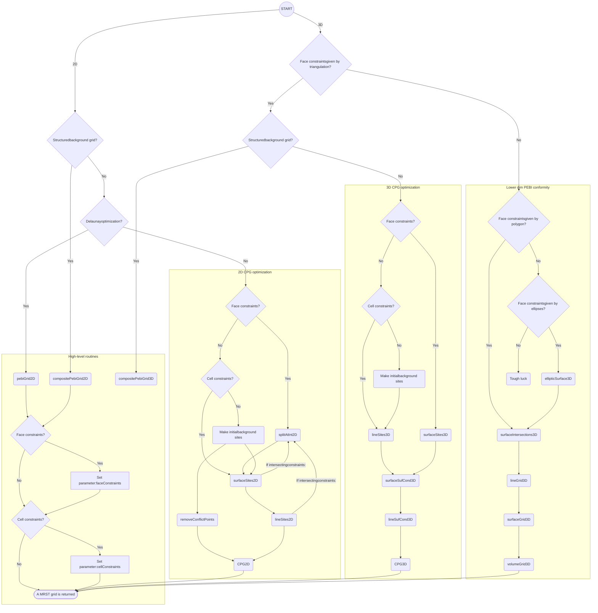

Figure 1.26 Flowchart outlining different workflows you can use to create PEBI grids using the `upr` module.

*Unstructured PEBI Grids Conforming to Lower-Dimensional Objects* <page_number>43</page_number>

As mentioned in the Introduction, some of the geometric algorithms in `upr` rely on tolerances that have mainly been tested for grids placed within a bounding box with minimum point at the origin and dimensions of order one. This does not mean that the underlying principles should not work on smaller or larger spatial scales, but this may require adjustment of input parameters and internal tolerances that are not fully exposed to the user. If you encounter strange error messages when trying to create grids with dimensions (and spatial coordinates) that are more typical for oil reservoirs described in map coordinates, the cause will in many cases be absolute tolerances that are too strict and do not capture the increased numerical rounding error for larger domains. If possible, you should therefore strive to scale your constraints and the bounding box to unit size when creating the grid and then rescale the grid to the desired size after it has been created.

We have already pointed out that gridding the statistically distributed fracture network in Subsection 1.6.2 required significant manual effort to find and refine the grid size in challenging areas. Automating and improving the choice of grid sizes to handle such cases would be a very beneficial extension to `upr`. The module can already adapt the grid size at the intersection of constraints, but this is not always sufficient. Specifically, when constraints are close, but not intersecting, the grid size should be decreased based on the distance between the line constraints to avoid conflict between the sites of the different constraints.

Finally, we mention that it is still an open research question how to best formulate efficient and robust algorithms for creating constrained Voronoi grids in 3D. In particular, the 3D methods in `upr` are not as sophisticated as the 2D methods. Grids conforming to simple surfaces can be constructed but, as we have seen, the user must do more of the work. Also, the computational time to convert the grid returned from `voronoin` to an MRST grid structure is significant. In its present state, `upr` mainly targets small- to medium-scale problems and its primary function is to help researchers move from simple grids posed on the unit square to more complex grids that contain many of the conceptual difficulties one expects to see in high-end, high-resolution geomodels.

## References

[1] C. B. Barber, D. P. Dobkin, and H. Huhdanpaa. The quickhull algorithm for convex hulls. *ACM Transactions on Mathematical Software*, 22(4):469–483, 1996. doi: 10.1145/235815.235821.

[2] R. L. Berge, Ø. S. Klemetsdal, and K.-A. Lie. Unstructured Voronoi grids conforming to lower dimensional objects. *Computational Geosciences*, 23(1):169–188, 2019. doi: 10.1007/s10596-018-9790-0.

[https://doi.org/10.1017/9781009019781](https://doi.org/10.1017/9781009019781) Published online by Cambridge University Press

<page_number>44</page_number>

R. L. Berge, Ø. S. Klemetsdal, and K.-A. Lie

[3] L. V. Branets, S. S. Ghai, S. L. Lyons, and X.-H. Wu. Challenges and technologies in reservoir modeling. *Communications in Computational Physics*, 6(1):1, 2009.

[4] L. Branets, S. S. Ghai, S. L. Lyons, and X.-H. Wu. Efficient and accurate reservoir modeling using adaptive gridding with global scale up. Paper presented at SPE Reservoir Simulation Symposium, Houston, TX, 2009. doi: 10.2118/118946-MS.

[5] M. A. Christie and M. J. Blunt. Tenth SPE comparative solution project: A comparison of upscaling techniques. *SPE Reservoir Evaluation and Engineering*, 4:308–317, 2001. doi: 10.2118/72469-PA. URL [www.spe.org/web/csp/datasets/set02.htm](www.spe.org/web/csp/datasets/set02.htm).

[6] X. Y. Ding and L. S. K. Fung. An unstructured gridding method for simulating faulted reservoirs populated with complex wells. Paper presented at: SPE Reservoir Simulation Symposium, Houston, TX, 2015. doi: 10.2118/173243-MS.

[7] Q. Du, V. Faber, and M. Gunzburger. Centroidal Voronoi tessellations: Applications and algorithms. *SIAM Review*, 41(4):637–676, 1999. doi: 10.1137/S0036144599352836.

[8] D. D. Filippov, I. Y. Kudryashov, D. Y. Maksimov, D. A. Mitrushkin, B. V. Vasekin, and A. P. Roshchektaev. Reservoir modeling of complex structure reservoirs on dynamic adaptive 3D Pebi-grid. Paper presented at: SPE Russian Petroleum Technology Conference, Moscow, Russia, October 16–18, 2017. doi: 10.2118/187799-MS.

[9] C. Geuzaine and J.-F. Remacle. Gmsh: A 3-D finite element mesh generator with built-in pre- and post-processing facilities. *International Journal for Numerical Methods in Engineering*, 79(11):1309–1331, 2009. doi: 10.1002/nme.2579.

[10] M. Iri, K. Murota, and T. Ohya. A fast Voronoi-diagram algorithm with applications to geographical optimization problems. In P. Thoft-Christensen, ed., *System Modelling and Optimization*, pp. 273–288. Springer, Berlin. doi: 10.1007/BFb0008901.

[11] K.-A. Lie. *An Introduction to Reservoir Simulation Using MATLAB/GNU Octave: User Guide for the MATLAB Reservoir Simulation Toolbox (MRST)*. Cambridge University Press, Cambridge, UK, 2019. doi: 10.1017/9781108591416.

[12] Y. Liu, W. Wang, B. Lévy, F. Sun, D.-M. Yan, L. Lu, and C. Yang. On centroidal Voronoi tessellation – energy smoothness and fast computation. *ACM Transactions on Graphics*, 28(4):101:1–101:17, 2009. doi: 10.1145/1559755.1559758.

[13] S. Manzoor, M. G. Edwards, and A. H. Dogru. Three-dimensional geological boundary aligned unstructured grid generation, and CVD-MPFA flow computation. Paper presented at: SPE Reservoir Simulation Conference, Galveston, TX, April 10–11, 2019. doi: 10.2118/193874-MS.

[14] S. Manzoor, M. G. Edwards, A. H. Dogru, and T. M. Al-Shaalan. Interior boundary-aligned unstructured grid generation and cell-centered versus vertex-centered CVD-MPFA performance. *Computational Geosciences*, 22(1):195–230, 2018. doi: 10.1007/s10596-017-9686-4.

[15] R. Merland, G. Caumon, B. Lévy, and P. Collon-Drouaillet. Voronoi grids conforming to 3D structural features. *Computational Geosciences*, 18(3–4):373–383, 2014. doi: 10.1007/s10596-014-9408-0.

[16] P.-O. Persson and G. Strang. A simple mesh generator in MATLAB. *SIAM Review*, 46(2):329–345, 2004. doi: 10.1137/S0036144503429121.

[17] J. R. Shewchuk, S.-W. Cheng, and T. K. Dey. *Delaunay Mesh Generation*. Chapman and Hall/CRC, New York, 2012. doi: 10.1201/b12987.

[https://doi.org/10.1017/9781009019781](https://doi.org/10.1017/9781009019781) Published online by Cambridge University Press

*Unstructured PEBI Grids Conforming to Lower-Dimensional Objects* 45
<page_number>

45
</page_number>

[18] J. Sun and D. Schechter. Optimization-based unstructured meshing algorithms for simulation of hydraulically and naturally fractured reservoirs with variable distribution of fracture aperture, spacing, length, and strike. *SPE Reservoir Evaluation & Engineering*, 18(4):463–480, 2015. doi: 10.2118/170703-PA.

[19] D.-M. Yan, W. Wang, B. Lévy, and Y. Liu. Efficient computation of clipped Voronoi diagram for mesh generation. *Computer-Aided Design*, 45(4):843–852, 2013. doi: 10.1016/j.cad.2011.09.004.

[https://doi.org/10.1017/9781009019781](https://doi.org/10.1017/9781009019781) Published online by Cambridge University Press

2

# Nonlinear Finite-Volume Methods for the Flow Equation in Porous Media

MOHAMMED AL KOBAISI AND WENJUAN ZHANG

### Abstract

This chapter explains how one can formulate nonlinear finite-volume (NFV) methods, as advanced discretization schemes, to solve the flow equation in porous media. These schemes are of particular interest because apart from being consistent, they are monotone by design. We explain the basic ideas of the NFV methods: how to construct one-sided fluxes, interpolate using harmonic averaging points, and obtain unique discrete fluxes through grid faces with convex combinations of one-sided fluxes. We outline key functions in the accompanied `nfvm` module in the MATLAB Reservoir Simulation Toolbox (MRST) and show some examples of how the method is applied.

## 2.1 Introduction

Two-point flux approximation (TPFA) is the default discretization scheme in almost all simulators, and this has been the case since the early days of reservoir simulation. Its popularity stems from its simplicity and properties of being locally conservative and honoring the discrete maximum principle (solution must be between the minimum and maximum boundary conditions [6]). In the context of reservoir simulation, the pressure field (solution) must be positive and bounded between the minimum and maximum boundary conditions (e.g., wells). For tensor permeability fields and non-K-orthogonal grids, TPFA fails to address the tensorial flow behavior and the errors incurred in the flow field can be quite significant. An excellent discussion on this can be found in Chapter 6 and subsection 10.4.2 in the MATLAB Reservoir Simulation Toolbox (MRST) textbook [14]. Linear multipoint flux approximation (MPFA) schemes [1, 2, 5, 7, 8, 18, 24, 25] can alleviate this problem to a certain degree, but they are “conditionally monotone” depending on the anisotropy contrast and severity of grid distortion [17]. Moreover, these linear schemes tend to increase cell stencils. To improve the quality of the discrete flux

<page_number>46</page_number>

[https://doi.org/10.1017/9781009019781](https://doi.org/10.1017/9781009019781) Published online by Cambridge University Press

Nonlinear Finite-Volume Methods for the Flow Equation in Porous Media 47

<page_number>

47
</page_number>

approximations with respect to monotonicity and the discrete maximum principle, nonlinear discretization schemes have been proposed recently [11, 13, 15, 16, 26]. These schemes aim to preserve monotonicity and positivity of the discrete solutions using a number of methods, most notably positive coefficient interpolation strategies, MPFA-like or flux continuity interpolation, and inverse-distance interpolation.

In the following sections, we succinctly describe the mathematical problem and delve right into the discretization scheme. We also present several examples, which can be readily replicated using the `nfvm` module implemented in MRST. The examples demonstrate the efficacy of nonlinear finite volume (NFV) methods against spurious oscillations that can potentially arise in the solutions of other consistent discretization schemes.

## 2.2 Model Equations

To illustrate the ideas of NFV methods, we consider the following diffusion equation on an open bounded polygonal domain $\Omega \subseteq \mathbb{R}^d, d = 2$ or 3:

$$
\begin{aligned}
-\nabla \cdot (\mathbf{K}(\mathbf{x}) \nabla p(\mathbf{x})) &= q(\mathbf{x}), & \mathbf{x} \in \Omega, \\
p(\mathbf{x}) &= g_D(\mathbf{x}), & \mathbf{x} \in \Gamma_D, \\
-\mathbf{K}(\mathbf{x}) \nabla p(\mathbf{x}) \cdot \mathbf{\hat{n}} &= g_N(\mathbf{x}), & \mathbf{x} \in \Gamma_N.
\end{aligned}
\eqno(2.1)
$$

Here, $p$ is the unknown dependent variable, called fluid pressure; the absolute permeability $\mathbf{K}$ of the porous medium is assumed to be symmetric and positive definite; and $q$ is the source (if positive) or sink term (if negative). Dirichlet boundary conditions $g_D$ and Neumann boundary conditions $g_N$ are applied on the boundaries $\Gamma_D$ and $\Gamma_N$, respectively. The boundary of the domain $\Omega$ is $\partial\Omega = \Gamma_N \cup \Gamma_D$. The unit normal vector pointing outward to the boundary is denoted by $\mathbf{\hat{n}}$.

## 2.3 Nonlinear Finite-Volume Methods

Like many control volume–based discretization methods, the NFV methods begin by partitioning the computational domain $\Omega$ into a conformal mesh consisting of strongly connected nonoverlapping cells. The following notations are first defined for the mesh:

*   **$\Omega_h$**: the set of all cells $\{\Omega_i\}_{i=1}^{n_c}$ in the mesh, where $n_c$ is the total number of cells;
*   **$\Omega_i$**: the $i$th cell in the mesh;
*   **$\mathbf{x}_i$**: the centroid of cell $\Omega_i$;
*   **$\mathcal{F}$**: the set of all faces in the mesh;
*   **$\sigma$**: a generic face from $\mathcal{F}$;
*   **$\mathbf{x}_\sigma$**: auxiliary point associated with face $\sigma$;
*   **$\mathcal{F}_i$**: the subset of faces associated with cell $\Omega_i$; i.e., $\partial\Omega_i = \cup_{\sigma \in \mathcal{F}_i} \sigma, \forall\Omega_i \in \Omega_h$.

[https://doi.org/10.1017/9781009019781](https://doi.org/10.1017/9781009019781) Published online by Cambridge University Press

48 M. Al Kobaisi and W. Zhang

Integrating (2.1) over cell $\Omega_i$ and applying the divergence theorem leads to

$$ \int_{\Omega_i} -\nabla \cdot (\mathbf{K} \nabla p) \, dx = \int_{\partial \Omega_i} -\mathbf{K} \nabla p \cdot \mathbf{\hat{n}} \, dS = \sum_{\sigma \in \mathcal{F}_i} \int_{\sigma} -\mathbf{K} \nabla p \cdot \mathbf{\hat{n}} \, dS = \int_{\Omega_i} q \, dx. $$
$$ (2.2) $$

This equation can be seen as a mass-balance equation for cell $\Omega_i$. The key element of finite-volume methods is to construct the discrete numerical flux $v_\sigma$ through the face $\sigma$ using pressure at the centroids of some cells:

$$ \int_{\sigma} -\mathbf{K} \nabla p \cdot \mathbf{\hat{n}} \, dS \approx v_\sigma = \sum_{k \in \phi_\sigma} t_k p_k. $$
$$ (2.3) $$

Here, $\phi_\sigma$ is the index set of cells used for the approximation of flux $v_\sigma$, the transmissibility term $t_k$ is associated with cell $\Omega_k$, and $p_k$ is the numerical approximation of pressure at the centroid of cell $\Omega_k$. For linear finite-volume methods, the transmissibility terms $t_k$ are constants for a given mesh and absolute permeability distribution.

The discrete flux expression given by (2.3) can be approximated linearly using the pressures of two adjacent grid blocks sharing an interface or by using additional pressures from neighboring grid blocks. The former leads to the standard TPFA method, whereas the latter leads to the so-called MPFA formalism. Variants of MPFA primarily depend on the location of the continuity points and the number of neighboring cells involved in the flux approximation. For additional details on flux linearization schemes in MPFA formulations, we refer the reader to [1].

Substituting (2.3) into (2.2) and assembling the resulting equation for all cells in the mesh leads to a system of linear equations that can be solved for pressure at cell centroids. For NFV methods, however, the transmissibility terms $t_k$ depend on the primary unknowns, leading to a system of nonlinear equations. To derive the discrete numerical flux $v_\sigma$ using NFV methods, two one-sided fluxes will first be constructed, and then a unique flux is obtained by taking a convex combination of the two one-sided fluxes. The details follow in the next subsections.

### 2.3.1 Construction of One-Sided Fluxes

Consider an internal face $\sigma$ shared by two cells $\Omega_i$ and $\Omega_j$ for a 2D grid as depicted in Figure 2.1. Flux through the face seen from cell $\Omega_i$ (called one-sided flux) can be approximated as

$$ \int_{\sigma} -\mathbf{K}_i \nabla p \cdot \mathbf{\hat{n}} \, dS \approx v_\sigma^i = -(\nabla p)_i \cdot \mathbf{K}_i \mathbf{n}_{ij}, $$
$$ (2.4) $$

[https://doi.org/10.1017/9781009019781](https://doi.org/10.1017/9781009019781) Published online by Cambridge University Press

Nonlinear Finite-Volume Methods for the Flow Equation in Porous Media <page_number>49</page_number>

Decomposition of conormal vector diagram showing cells Ωi and Ωj with auxiliary points xA, xB, xC, and xD.

Figure 2.1 Decomposition of conormal vector **K**<sub>i</sub>**n**<sub>ij</sub> and **K**<sub>j</sub>**n**<sub>ji</sub> using face interpolating points as auxiliary points.

where $(\nabla p)_i$ denotes the average constant pressure gradient inside $\Omega_i$, **K**<sub>i</sub> is the piecewise constant permeability tensor of cell $\Omega_i$, and **n**<sub>ij</sub> is the area-weighted normal vector to the face $\sigma$ pointing from cell $\Omega_i$ to cell $\Omega_j$.

The conormal vector **K**<sub>i</sub>**n**<sub>ij</sub> is then decomposed as

$$ \mathbf{K}_i \mathbf{n}_{ij} = \alpha_{iA} (\mathbf{x}_A - \mathbf{x}_i) + \alpha_{iB} (\mathbf{x}_B - \mathbf{x}_i), \tag{2.5} $$

where **x**<sub>A</sub> and **x**<sub>B</sub> are the position vectors of two auxiliary points, each associated with one face of cell $\Omega_i$. Determining the exact locations of the auxiliary points will be explained in the next subsection. The terms $\alpha_{iA}$ and $\alpha_{iB}$ are the corresponding decomposing coefficients and they are required to be nonnegative. Substituting (2.5) into (2.4) and assuming linearly varying pressure inside $\Omega_i$ leads to the following expression:

$$ v_\sigma^i = \alpha_{iA} (p_i - p_A) + \alpha_{iB} (p_i - p_B), \tag{2.6} $$

where $p_A$ and $p_B$ are pressures at **x**<sub>A</sub> and **x**<sub>B</sub>, respectively. To obtain a pure cell-centered scheme, $p_A$ and $p_B$ are further interpolated using the primary unknowns, which are pressures at some cell centroids:

$$ p_A = \sum_{k \in S_A} \omega_{Ak} p_k, \quad p_B = \sum_{k \in S_B} \omega_{Bk} p_k, \tag{2.7} $$

where $S_A$ and $S_B$ are the index sets of control volumes that are involved in the interpolation of $p_A$ and $p_B$, respectively. The term $\omega_{Ak}$ is the weighting coefficient of pressure at the centroid of cell $\Omega_k$ in the interpolation of $p_A$ and $\omega_{Bk}$ has similar meanings. Here, the weighting coefficients are again required to be nonnegative and need to sum up to unity for each auxiliary point. Finally, substituting (2.7) into (2.6) leads to

$$ v_\sigma^i = \alpha_{iA} \left( p_i - \sum_{k \in S_A} \omega_{Ak} p_k \right) + \alpha_{iB} \left( p_i - \sum_{k \in S_B} \omega_{Bk} p_k \right). \tag{2.8} $$

[https://doi.org/10.1017/9781009019781](https://doi.org/10.1017/9781009019781) Published online by Cambridge University Press

50 M. Al Kobaisi and W. Zhang

Collecting similar terms gives the final form of the one-sided flux:

$$ v_{\sigma}^{i} = t_{i}^{i} p_{i} - t_{j}^{i} p_{j} - \sum_{k \in S_{i}} t_{k}^{i} p_{k} = t_{i}^{i} p_{i} - t_{j}^{i} p_{j} - r_{i}, \tag{2.9} $$

where $t_{i}^{i}$, $t_{j}^{i}$, and $t_{k}^{i}$ are coefficients of $p_{i}$, $p_{j}$, and $p_{k}$, respectively, and $S_{i} = S_{A} \cup S_{B} \setminus \{i, j\}$. Similarly, the one-sided flux flowing from $\Omega_{j}$ to $\Omega_{i}$ seen from $\Omega_{j}$ can be expressed as (with $S_{j} = S_{C} \cup S_{D} \setminus \{i, j\}$)

$$ v_{\sigma}^{j} = t_{j}^{j} p_{j} - t_{i}^{j} p_{i} - \sum_{k \in S_{j}} t_{k}^{j} p_{k} = t_{j}^{j} p_{j} - t_{i}^{j} p_{i} - r_{j}. \tag{2.10) $$

One-sided fluxes for 3D grids can be derived analogously. Using the `nfvm` module in MRST, the one-sided transmissibilities are computed as:

```matlab
T = findOStrans(G, rock, hap, 'bc', bc);
```

Here, `G`, `rock`, and `bc` are data structures for grid, rock properties, and boundary conditions, respectively. Note that the boundary condition structure `bc` is slightly different from that used in the core of MRST. Instead of providing a scalar value for each boundary face in `bc.value`, we specify a function handle for each boundary face to accommodate the boundary data $g_{D}$ and $g_{N}$ in (2.1). The input argument `hap` stores information of the auxiliary points used in (2.5)–(2.7), which we will discuss in the next subsection.

## 2.3.2 *Harmonic Averaging Point*

Construction of one-sided fluxes requires introducing auxiliary points (2.6) and interpolating pressure at these points by pressures at some cell centroids (2.7). The grid vertices are an obvious choice for auxiliary points, and various interpolation methods have been proposed in the literature to interpolate pressure at grid vertices using pressure at cell centroids, such as linear interpolation and inverse distance weighting (IDW) and others; see, e.g., [[15, 19, 23]](https://doi.org/10.1017/9781009019781). Different interpolations can have a big impact on the performance of the NFV methods, and it is difficult to design an interpolation method that is both robust and accurate. As noted in [[22]](https://doi.org/10.1017/9781009019781), it can be more challenging to construct a second-order positivity-preserving interpolating algorithm than the construction of the NFV method itself. Another disadvantage of choosing grid vertices as auxiliary points is that the number of cells involved in the interpolation of pressure at a grid vertex can be quite large. Usually, all of the cells that share the vertex will be involved.

A more attractive option is the so-called harmonic averaging point that was first proposed in [[4]](https://doi.org/10.1017/9781009019781). There is one harmonic-averaging point **x**<sub>$\sigma$</sub> associated with

[https://doi.org/10.1017/9781009019781](https://doi.org/10.1017/9781009019781) Published online by Cambridge University Press

Nonlinear Finite-Volume Methods for the Flow Equation in Porous Media

51

Engineering drawing showing two cells Ωi and Ωj sharing a face σ, with points xi, xj, xσ, xA, xB and vectors Ki nσ,i, Kj nσ,j.

Figure 2.2 Harmonic-averaging point **x**<sub>σ</sub> lies between the two points **x**<sub>A</sub> and **x**<sub>B</sub>.

each face σ in the mesh. Interpolation of pressure at the harmonic-averaging point involves only the two neighboring cells that share the face and the interpolating coefficients are always nonnegative. Still, consider face σ shared by two cells Ω<sub>i</sub> and Ω<sub>j</sub> shown in Figure 2.2. First, we find the point **x**<sub>A</sub> that lies on the plane containing face σ such that the vector **x**<sub>A</sub> − **x**<sub>i</sub> is parallel to **K**<sub>i</sub>**n**<sub>ij</sub>. Similarly, we can find the point **x**<sub>B</sub> such that vector **x**<sub>B</sub> − **x**<sub>j</sub> is parallel to **K**<sub>j</sub>**n**<sub>ji</sub>. Assume that the pressure unknown p is piecewise affine, then flux out of cell Ω<sub>i</sub> and Ω<sub>j</sub> can be expressed individually as

$$ \begin{aligned} v_{\sigma}^{i} &= -(\nabla p)_{i} \cdot \mathbf{K}_{i} \mathbf{n}_{i j} = w_{i}\left(p_{i}-p_{A}\right), \\ v_{\sigma}^{j} &= -(\nabla p)_{j} \cdot \mathbf{K}_{j} \mathbf{n}_{j i} = w_{j}\left(p_{j}-p_{B}\right), \end{aligned} \tag{2.11} $$

where $w_{i}=\left\|\mathbf{K}_{i} \mathbf{n}_{i j}\right\| /\left\|\mathbf{x}_{A}-\mathbf{x}_{i}\right\|$ and $w_{j}=\left\|\mathbf{K}_{j} \mathbf{n}_{j i}\right\| /\left\|\mathbf{x}_{B}-\mathbf{x}_{j}\right\|$. Furthermore, assume that pressure and the tangential part of the pressure gradient **g**<sub>σ</sub> are continuous on the plane containing face σ. Now, if we take an arbitrary point **x** on the plane containing face σ, the pressure at points **x**<sub>A</sub> and **x**<sub>B</sub> can be written in terms of **g**<sub>σ</sub> and the pressure at **x** as

$$ p_{A}=p(\mathbf{x})+\mathbf{g}_{\sigma} \cdot\left(\mathbf{x}_{A}-\mathbf{x}\right), \quad p_{B}=p(\mathbf{x})+\mathbf{g}_{\sigma} \cdot\left(\mathbf{x}_{B}-\mathbf{x}\right) . \tag{2.12} $$

Substituting (2.12) into (2.11) and imposing flux continuity condition $v_{\sigma}^{i}+v_{\sigma}^{j}=0$, we can solve for pressure $p(\mathbf{x})$ as

$$ p(\mathbf{x})=\frac{w_{i} p_{i}+w_{j} p_{j}-\mathbf{g}_{\sigma} \cdot\left[w_{i}\left(\mathbf{x}_{A}-\mathbf{x}\right)+w_{j}\left(\mathbf{x}_{B}-\mathbf{x}\right)\right]}{w_{i}+w_{j}} . \tag{2.13} $$

This shows that pressure at any point on the plane containing face σ is a linear convex combination of pressures at centroids of two neighboring cells plus a term accounting for pressure variation along the tangent direction. If we choose a certain point, such that the last term in the numerator vanishes regardless of the tangent gradient **g**<sub>σ</sub>, pressure at this point will depend on pressure at the centroids of two

[https://doi.org/10.1017/9781009019781](https://doi.org/10.1017/9781009019781) Published online by Cambridge University Press

52 M. Al Kobaisi and W. Zhang

A figure showing harmonic-averaging points on a distorted quadrilateral mesh with permeability ellipses (left) and a zoomed-in view of a cell showing normal and conormal vectors and the convex hull of harmonic averaging points (right).

Figure 2.3 Left: Harmonic-averaging points (blue dots are harmonic-averaging points lying inside the face and red dots are points lying outside the face). The elongated ellipses in each cell represent the cell-wise constant permeability tensor. The semi-axes of the ellipses are scaled by the square root of the maximum and minimum principal permeability, respectively. Right: Zooming in on the circled part of the left plot. The red arrows represent the normal vector to the rightmost face and its associated conormal vector. The blue arrows start at the centroid of the cell and end at the harmonic averaging points associated with the faces of the cell. The triangle in magenta represent the convex hull of the involved harmonic averaging points. (After Zhang and Al Kobaisi [[26]](https://doi.org/10.1017/9781009019781))

neighboring cells only. By equating $w_i (\mathbf{x}_A - \mathbf{x}) + w_j (\mathbf{x}_B - \mathbf{x})$ to zero, we can solve for this particular point $\mathbf{x}$ denoted as $\mathbf{x}_\sigma$:

$$ \mathbf{x}_\sigma = \frac{w_i \mathbf{x}_A + w_j \mathbf{x}_B}{w_i + w_j}, \tag{2.14} $$

which is the location of the harmonic-averaging point associated with face $\sigma$. Pressure at this point can then be interpolated by

$$ p (\mathbf{x}_\sigma) = \frac{w_i p_i + w_j p_j}{w_i + w_j}. \tag{2.15} $$

Unfortunately, the harmonic-averaging point is not without its drawback. For heterogeneous and anisotropic permeability tensors on nonorthogonal grids, some harmonic-averaging points may lie far outside their associated grid faces. As a result, decomposition of conormal vectors with nonnegative coefficients can easily run into difficulty. Figure 2.3 shows an example taken from [[26]](https://doi.org/10.1017/9781009019781). The left plot of the figure shows a distorted quadrilateral mesh populated by a heterogeneous rotating permeability tensor field. The permeability tensor of each cell in the mesh is represented by an ellipse, whose semi-axes are scaled by the square root of

[https://doi.org/10.1017/9781009019781](https://doi.org/10.1017/9781009019781) Published online by Cambridge University Press

*Nonlinear Finite-Volume Methods for the Flow Equation in Porous Media* 53

<page_number>

53
</page_number>

the maximum and minimum principal permeability, respectively. The permeability anisotropy ratio is a constant of 200. Because of the strong anisotropy, the ellipses look very elongated in the plot. We can see that whereas most harmonic-averaging points lie inside the associated faces (indicated by the blue dots), a small fraction of the harmonic-averaging points (indicated by the red dots in the figure) lie far away from their respective associated faces.

The right plot of Figure 2.3 shows the zoomed-in area delineated by the green circle on the left plot of the figure. The four blue arrows denote the vectors starting at the centroid of the cell and ending at the four harmonic-averaging points associated with the four faces of the quadrilateral cell. Conormal vector **Kn** associated with the rightmost face is denoted by the red arrow. It can be readily seen that decomposing **Kn** with positive coefficients using harmonic-averaging points only is impossible, because the centroid lies outside of the convex hull (represented by the triangle in magenta) of the four harmonic averaging points associated to this cell.

To circumvent this difficulty in decomposing the conormal vectors, a robust and efficient correction algorithm is given in [[26]](https://doi.org/10.1017/9781009019781) to modify the location of those "ill-placed" harmonic averaging points so that the conormal vectors can be successfully decomposed with nonnegative coefficients. The main idea of the correction algorithm is to "pull back" the ill-placed harmonic averaging points toward the face centroids, while minimizing the errors incurred in the process. Specifically, for any cell whose centroid lies outside the convex hull of the harmonic averaging points associated with its faces, the harmonic averaging point that deviates the most from the face centroid is identified and a different interpolating point is chosen to replace the original harmonic-averaging point. The location of the new interpolating point is restricted to lie within a prescribed distance from the face centroid. Interpolation of pressure at this point is still given by (2.15). Because for any **x** $\neq$ **x**<sub>$\sigma$</sub> lying on the hyperplane containing face $\sigma$ pressure at point **x** is given by (2.13), the new location is chosen such that the term $w_i(\mathbf{x}_A - \mathbf{x}) + w_j(\mathbf{x}_B - \mathbf{x})$ is minimized.

Without digression from the main framework of NFV methods, in what follows we shall assume that the ill-placed harmonic averaging points have been corrected and interested readers are referred to [[26]](https://doi.org/10.1017/9781009019781) for details on the correction algorithm. Figures 2.4 and 2.5 show two pictorial examples in which `correctHAP(G,hap)`, found in the `nfvm` module, has been used to correct the harmonic averaging points for a triangular cell in 2D and a tetrahedral cell in 3D, respectively. The code for constructing and correcting the harmonic averaging points is

```matlab
hap=findHAP(G, rock, 'bc', bc); % compute hap's for all faces
hap=correctHAP(G, hap); % apply correction algorithm to the hap's
```

[https://doi.org/10.1017/9781009019781](https://doi.org/10.1017/9781009019781) Published online by Cambridge University Press

54 M. Al Kobaisi and W. Zhang

<table>
  <thead>
    <tr>
        <th>X-axis</th>
        <th>Before correction (Y)</th>
        <th>After correction (Y)</th>
    </tr>
  </thead>
  <tbody>
    <tr>
        <td>0.4</td>
        <td>0.7</td>
        <td>0.7</td>
    </tr>
    <tr>
        <td>0.45</td>
        <td>0.705</td>
        <td>0.705</td>
    </tr>
    <tr>
        <td>0.5</td>
        <td>0.68</td>
        <td>0.68</td>
    </tr>
  </tbody>
</table>

Figure 2.4 Harmonic-averaging points for a triangular cell before and after correction. (After Zhang and Al Kobaisi [[26]](https://doi.org/10.1017/9781009019781))

Harmonic-averaging points for a tetrahedral cell before correction Harmonic-averaging points for a tetrahedral cell after correction

Figure 2.5 Harmonic-averaging points for a tetrahedral cell before and after correction. (After Zhang and Al Kobaisi [[26]](https://doi.org/10.1017/9781009019781))

The `hap` structure stores the coordinates (`hap.coords`) of each harmonic averaging point, the index of cells (`hap.cells`) involved in the interpolation, and the corresponding weighting coefficients (`hap.weights`). The `correctHAP` function will then modify `hap.coords` whenever necessary.

## 2.3.3 Nonlinear TPFA

Using the harmonic-averaging points just introduced as auxiliary points, we can construct two one-sided fluxes $v_{\sigma}^{i}, v_{\sigma}^{j}$ for each internal face $\sigma$ as detailed in Subsection 2.3.1. The unique flux $v_{\sigma}$ through face $\sigma$ flowing from cell $\Omega_{i}$ to $\Omega_{j}$ is then obtained as a convex combination of the two one-sided fluxes:

$$ v_{\sigma} = \mu_{i} v_{\sigma}^{i} + \mu_{j} (-v_{\sigma}^{j}), \tag{2.16} $$

[https://doi.org/10.1017/9781009019781](https://doi.org/10.1017/9781009019781) Published online by Cambridge University Press

Nonlinear Finite-Volume Methods for the Flow Equation in Porous Media

<page_number>55</page_number>

where $\mu_i, \mu_j$ are the two nonnegative coefficients for the convex combination that satisfy

$$ \mu_i + \mu_j = 1. \tag{2.17} $$

Substituting the two one-sided fluxes (2.9) and (2.10) into (2.16) leads to

$$ v_\sigma = \left( \mu_i t_i^i + \mu_j t_j^i \right) p_i - \left( \mu_j t_j^j + \mu_i t_i^j \right) p_j - \mu_i r_i + \mu_j r_j. \tag{2.18} $$

To obtain a nonlinear TPFA scheme, the last two terms of (2.18) are forced to be zero:

$$ -\mu_i r_i + \mu_j r_j = 0. \tag{2.19} $$

Combining (2.17), (2.19) and solving for $\mu_i, \mu_j$ gives

$$ \mu_i = \frac{r_j}{r_i + r_j}, \quad \mu_j = \frac{r_i}{r_i + r_j}, \tag{2.20} $$

when $r_i + r_j \neq 0$. If $r_i + r_j = 0$, then $\mu_i$ and $\mu_j$ are taken as 0.5. The final expression for $v_\sigma$ is then given by the following:

$$ v_\sigma = \left( \mu_i t_i^i + \mu_j t_j^i \right) p_i - \left( \mu_j t_j^j + \mu_i t_i^j \right) p_j = T_i p_i - T_j p_j, \tag{2.21} $$

where $T_i = \mu_i t_i^i + \mu_j t_j^i$ and $T_j = \mu_j t_j^j + \mu_i t_i^j$. Note that because $r_i$ and $r_j$ are dependent on pressure values at some cell centroids, $T_i$ and $T_j$ are also dependent on the primary unknowns. Therefore, the flux $v_\sigma$ is nonlinear. In the case of K-orthogonal grids, the harmonic averaging point for a face coincides with the face centroid. Decomposition of conormal vectors becomes trivial because the conormal vector is parallel to the vector starting from the cell centroid and ending at the face centroid. The terms $r_i$ and $r_j$ will be identically zero and the two parameters $\mu_i$ and $\mu_j$ become constants. As a result, (2.21) simplifies to the regular linear TPFA method with the transmissibility between two cells approximated by the harmonic average of the cell transmissibilities; i.e., $v_\sigma = T_{Ha} (p_i - p_j)$.

### 2.3.4 Nonlinear MPFA

Though the nonlinear TPFA (NTPFA) method is monotone and preserves the nonnegativity of the pressure solution, it does not respect the discrete maximum/minimum principle. To obtain an NFV method that is also extremum preserving, a different convex combination of the one-sided fluxes can be used; see [10, 16, 20, 21]. Following the ideas presented in those works, we can write the one-sided flux expression (2.8) as

[https://doi.org/10.1017/9781009019781](https://doi.org/10.1017/9781009019781) Published online by Cambridge University Press

56 *M. Al Kobaisi and W. Zhang*

$$ \begin{aligned} v_{\sigma}^{i} &= \alpha_{iA} \Big[ \Big( \sum_{k \in S_{A}} \omega_{Ak} \Big) p_{i} - \sum_{k \in S_{A}} \omega_{Ak} p_{k} \Big] + \alpha_{iB} \Big[ \Big( \sum_{k \in S_{A}} \omega_{Ak} \Big) p_{i} - \sum_{k \in S_{B}} \omega_{Bk} p_{k} \Big] \\ &= \alpha_{iA} \sum_{k \in S_{A}} \omega_{Ak} (p_{i} - p_{k}) + \alpha_{iB} \sum_{k \in S_{B}} \omega_{Bk} (p_{i} - p_{k}) . \end{aligned} \eqno(2.22) $$

Noting that $\sum_{k \in S_{A}} \omega_{Ak} = 1$ and $\sum_{k \in S_{B}} \omega_{Bk} = 1$ and collecting similar terms gives the final form of the one-sided flux as

$$ v_{\sigma}^{i} = t_{j}^{i} (p_{i} - p_{j}) + \sum_{k \in S_{i}} t_{k}^{i} (p_{i} - p_{k}) = t_{j}^{i} (p_{i} - p_{j}) + R_{i}, \eqno(2.23) $$

where $t_{j}^{i}$ and $t_{k}^{i}$ are coefficients of $(p_{i} - p_{j})$ and $(p_{i} - p_{k})$, respectively, and $S_{i} = S_{A} \cup S_{B} \setminus \{i, j\}$. Note that the coefficients $t_{j}^{i}, t_{k}^{i}$ here are different from those in (2.9). Similarly, we have

$$ v_{\sigma}^{j} = t_{i}^{j} (p_{j} - p_{i}) + \sum_{k \in S_{j}} t_{k}^{j} (p_{j} - p_{k}) = t_{i}^{j} (p_{j} - p_{i}) + R_{j}, \eqno(2.24) $$

where $S_{j} = S_{C} \cup S_{D} \setminus \{i, j\}$. A unique flux $v_{\sigma}$ is then obtained by taking a convex combination of the two one-sides fluxes:

$$ v_{\sigma} = \mu_{i} f_{\sigma}^{i} + \mu_{j} (-v_{\sigma}^{j}) = \left( \mu_{i} t_{j}^{i} + \mu_{j} t_{i}^{j} \right) (p_{i} - p_{j}) + \mu_{i} R_{i} - \mu_{j} R_{j} . \eqno(2.25) $$

Unlike NTPFA, in the nonlinear MPFA (NMPFA) method we choose the two convex combination parameters as

$$ \mu_{i} = \frac{|R_{j}|}{|R_{i}| + |R_{j}|}, \quad \mu_{j} = \frac{|R_{i}|}{|R_{i}| + |R_{j}|}, \eqno(2.26) $$

when $|R_{i}| + |R_{j}| \neq 0$ and $\mu_{i} = \mu_{j} = 0.5$ otherwise. With this choice of convex combination parameters, it can be verified that when $R_{i} R_{j} \leq 0$, two algebraically equivalent fluxes are obtained:

$$ \begin{aligned} v_{\sigma} &= \left( \mu_{i} t_{j}^{i} + \mu_{j} t_{i}^{j} \right) (p_{i} - p_{j}) + 2 \mu_{i} \sum_{k \in S_{i}} t_{k}^{i} (p_{i} - p_{k}) \\ -v_{\sigma} &= \left( \mu_{i} t_{j}^{i} + \mu_{j} t_{i}^{j} \right) (p_{j} - p_{i}) + 2 \mu_{j} \sum_{k \in S_{j}} t_{k}^{j} (p_{j} - p_{k}) . \end{aligned} \eqno(2.27) $$

Equation (2.27) can be seen as an MPFA-like formulation because of the one-sided flux expressions given by (2.23) and (2.24); hence the name NMPFA. When $R_{i} R_{j} > 0$, the last two terms of (2.25) cancel out and the flux expression becomes

[https://doi.org/10.1017/9781009019781](https://doi.org/10.1017/9781009019781) Published online by Cambridge University Press

Nonlinear Finite-Volume Methods for the Flow Equation in Porous Media 57

$$ v_{\sigma} = \left( \mu_{i} t_{j}^{i} + \mu_{j} t_{i}^{j} \right) \left( p_{i} - p_{j} \right) . \tag{2.28} $$

Again, as in NTPFA, the NMPFA formulation reduces to the linear TPFA in the case of K-orthogonal grids.

### 2.3.5 Nonlinear Solver

The system of nonlinear equations resulting from the NTPFA and NMPFA methods can be solved by any nonlinear solver such as the widely used Newton–Raphson method. However, to guarantee the positivity of the pressure solutions during nonlinear iterations, the Picard nonlinear solver is often the method of choice and it is implemented in this module.

> Choose a small number $\epsilon_{\text{non}} > 0$ and initial solution vector $\mathbf{p}^{(0)} > 0$
> Repeat for $k = 1, 2, \dots$,
> solve $\mathbf{A}(\mathbf{p}^{(k-1)}) \mathbf{p}^{(k)} = \mathbf{b}(\mathbf{p}^{(k-1)})$
> until $\| \mathbf{A}(\mathbf{p}^{(k)}) \mathbf{p}^{(k)} - \mathbf{b}(\mathbf{p}^{(k)}) \| \leq \epsilon_{\text{non}} \| \mathbf{A}(\mathbf{p}^{(0)}) \mathbf{p}^{(0)} - \mathbf{b}(\mathbf{p}^{(0)}) \|$.

In the following numerical examples, we take $\epsilon_{\text{non}}$ to be $10^{-7}$. We also set the maximum number of Picard iterations to be 300 and exit if $k$ exceeds 300.

## 2.4 Numerical Examples

In this section, we present a few examples to show how one can use the aforementioned NFV formalism, as implemented in the `nfvm` module of MRST, to solve the flow equation in porous media. We note here that the examples are not, by any means, exhaustive but rather are intended to shed some light on the potential for NFV methods to handle highly unstructured grids with strong anisotropy ratios and heterogeneity contrasts. Furthermore, in the following we only show the 2D examples for ease of displaying the results pictorially. 3D cases can be run with the exact same calls of the `nfvm` module in MRST with the arguments being in 3D. Applications in 3D with additional flow physics can be found in [26, 27].

### 2.4.1 Example 1: Homogeneous Permeability

In this first example, we solve the diffusion equation on a unit square with a hole in the middle, $\Omega = (0, 1)^{2} \setminus [4/9, 5/9]^{2}$. The boundary of the computational domain is composed of two disjoint sets: an outer boundary $\Gamma_{0}$ and an inner boundary $\Gamma_{1}$. Pressure on $\Gamma_{0}$ is set to 0 and pressure on $\Gamma_{1}$ is 1. Source term $q$ is zero throughout the domain. The domain is meshed using perturbed quadrilateral grids and

[https://doi.org/10.1017/9781009019781](https://doi.org/10.1017/9781009019781) Published online by Cambridge University Press

<page_number>58</page_number>

M. Al Kobaisi and W. Zhang

Grids used for monotonicity test: perturbed quadrilateral mesh (left) and unstructured triangular mesh (right)

Figure 2.6 Grids used for monotonicity test on a perturbed quadrilateral mesh (left) and an unstructured triangular mesh (right).

Pressure solutions using TPFA, MPFA-O, NTPFA, and NMPFA on a perturbed quadrilateral mesh.

Figure 2.7 Pressure solutions using TPFA, MPFA-O, NTPFA, and NMPFA on a perturbed quadrilateral mesh. Cells with negative pressure values are colored in cyan and cells with pressure values greater than 1 are colored in magenta.

unstructured triangular grids shown in Figure 2.6. Permeability is homogeneous but anisotropic and takes the following form (where $\theta$ is $30^{\circ}$):

$$ \mathbf{K} = \left[ \begin{array}{cc} \cos \theta & -\sin \theta \\ \sin \theta & \cos \theta \end{array} \right] \left[ \begin{array}{cc} 1000 & 0 \\ 0 & 1 \end{array} \right] \left[ \begin{array}{cc} \cos \theta & \sin \theta \\ -\sin \theta & \cos \theta \end{array} \right] . $$

The discrete maximum principle (DMP) states that the discrete pressure solution should be bounded within the interval $[0, 1]$. Figure 2.7 depicts pressure

[https://doi.org/10.1017/9781009019781](https://doi.org/10.1017/9781009019781) Published online by Cambridge University Press

Nonlinear Finite-Volume Methods for the Flow Equation in Porous Media

59

<page_number>

59
</page_number>

Table 2.1 Computational results of Example 1.

<table>
  <thead>
    <tr>
        <th> </th>
        <th colspan="3">Quadrilateral grid</th>
        <th colspan="3">Triangular grid</th>
    </tr>
    <tr>
        <th>Method</th>
        <th>p<sub>min</sub></th>
        <th>p<sub>max</sub></th>
        <th>n<sub>iter</sub></th>
        <th>p<sub>min</sub></th>
        <th>p<sub>max</sub></th>
        <th>n<sub>iter</sub></th>
    </tr>
  </thead>
  <tbody>
    <tr>
        <td>TPFA</td>
        <td>0.0001</td>
        <td>0.9686</td>
        <td>–</td>
        <td>0</td>
        <td>0.9877</td>
        <td>–</td>
    </tr>
    <tr>
        <td>MPFA-O</td>
        <td>−0.1443</td>
        <td>1.1586</td>
        <td>–</td>
        <td>−0.9852</td>
        <td>1.0253</td>
        <td>–</td>
    </tr>
    <tr>
        <td>NTPFA</td>
        <td>0</td>
        <td>0.9851</td>
        <td>73</td>
        <td>0</td>
        <td>0.9864</td>
        <td>82</td>
    </tr>
    <tr>
        <td>NMPFA</td>
        <td>0</td>
        <td>0.9775</td>
        <td>153</td>
        <td>0</td>
        <td>0.9830</td>
        <td>300</td>
    </tr>
  </tbody>
</table>

Pressure solutions using TPFA, MPFA-O, NTPFA, and NMPFA on an unstructured triangular mesh. Each plot shows a heat map of pressure values with a color scale from 0 to 1. TPFA and MPFA-O show oscillations (cyan and magenta regions), while NTPFA and NMPFA show smooth monotonic solutions.

Figure 2.8 Paressure solutions using TPFA, MPFA-O, NTPFA, and NMPFA on an unstructured triangular mesh. Cells with negative pressure values are colored in cyan and cells with pressure values greater than 1 are colored in magenta.

solutions computed using linear TPFA, linear MPFA-O, NTPFA, and NMPFA on the quadrilateral mesh, and the corresponding results on the triangular mesh are shown in Figure 2.8. Table 2.1 lists the minimum and maximum pressure values $p_{\min}, p_{\max}$ for each method and the number of Picard iterations, $n_{\text{iter}}$, for the two nonlinear methods. As expected, the results show that only the two NFV methods respect the discrete minimum and maximum principle and perform consistently on the two different meshes. The MPFA-O method suffers from strong spurious oscillations, especially on the triangular mesh. Note here that the default MPFA-O($\eta = 0$) method is used. Monotonicity of linear MPFA methods on triangular grids is discussed in [12] and it is shown that the MPFA-O(0) method

[https://doi.org/10.1017/9781009019781](https://doi.org/10.1017/9781009019781) Published online by Cambridge University Press

60 M. Al Kobaisi and W. Zhang

<table>
  <thead>
    <tr>
        <th colspan="5">Figure 2.9 Convergence history of the Picard nonlinear solver</th>
    </tr>
    <tr>
        <th>Iteration</th>
        <th>NTPFA (Left)</th>
        <th>NMPFA (Left)</th>
        <th>NTPFA (Right)</th>
        <th>NMPFA (Right)</th>
    </tr>
  </thead>
  <tbody>
    <tr>
        <td>0</td>
        <td>10^0</td>
        <td>10^0</td>
        <td>10^0</td>
        <td>10^0</td>
    </tr>
    <tr>
        <td>50</td>
        <td>10^-4</td>
        <td>10^-4</td>
        <td>10^-6</td>
        <td>10^-4</td>
    </tr>
    <tr>
        <td>100</td>
        <td>10^-6</td>
        <td>10^-5</td>
        <td> </td>
        <td>10^-4</td>
    </tr>
    <tr>
        <td>150</td>
        <td>10^-8</td>
        <td>10^-7</td>
        <td> </td>
        <td>10^-4</td>
    </tr>
    <tr>
        <td>200</td>
        <td> </td>
        <td> </td>
        <td> </td>
        <td>10^-4</td>
    </tr>
    <tr>
        <td>250</td>
        <td> </td>
        <td> </td>
        <td> </td>
        <td>10^-4</td>
    </tr>
    <tr>
        <td>300</td>
        <td> </td>
        <td> </td>
        <td> </td>
        <td>10^-4</td>
    </tr>
  </tbody>
</table>

Figure 2.9 Convergence history of the Picard nonlinear solver for the two nonlinear methods on a quadrilateral mesh (left) and a triangular mesh (right).

suffers from strong unphysical oscillations when the triangular grid is not uniform, but its performance can be improved by using the alternative MPFA-O($\eta = \frac{1}{3}$) method [9]. The pressure solution of TPFA is also bounded between [0,1] but the method is obviously inconsistent on the two meshes.

Figure 2.9 reports the convergence history of the Picard nonlinear solver for NTPFA and NMPFA on the two meshes. Whereas NTPFA converges quickly on both meshes, NMPFA converges at a slower rate on the quadrilateral mesh and suffers from convergence issues on the triangular mesh. This may be caused by the strong anisotropy of the permeability tensor. If we take a mild anisotropy ratio of 5 and solve the diffusion equation on the same meshes again, we now see that both methods converge, albeit slower for NMPFA. The pressure solutions using NTPFA and NMPFA for this case are shown in Figure 2.10 and the convergence histories of the Picard nonlinear solver are shown in Figure 2.11. Depending on the particular case, NMPFA can run into local stiff nonlinear issues impeding its convergence. For more details on convergence analyses, see [26].

You can find details of the code in the script `nfvmExample_1.m`. Some key steps are given here. After the grid and rock properties are created in the standard MRST construct format (G, rock), the boundary condition is then specified:

```matlab
bf = boundaryFaces(G);
xf = G.faces.centroids(bf,1); yf = G.faces.centroids(bf,2);
d = min([abs(xf) abs(yf) abs(xf-Lx) abs(yf-Ly)],[],2);
index=d<1e-3;
bc.face = bf;
bc.type = repmat({'pressure'},[numel(bc.face),1]);
bc.value = cell(length(bf),1);
bc.value(index) = repmat({@(x)0},[sum(index) 1]);
bc.value(~index) = repmat({@(x)1},[sum(~index),1]);
```

[https://doi.org/10.1017/9781009019781](https://doi.org/10.1017/9781009019781) Published online by Cambridge University Press

Nonlinear Finite-Volume Methods for the Flow Equation in Porous Media 61

Pressure solutions using NTPFA and NMPFA on quadrilateral and triangular meshes

Figure 2.10 Pressure solutions using NTPFA and NMPFA on a quadrilateral mesh (left) and a triangular mesh (right) when the permeability anisotropy ratio is mild.

<table>
  <thead>
    <tr><th colspan="3">Quadrilateral Mesh (Left)</th></tr>
    <tr><th>Iteration</th><th>NTPFA</th><th>NMPFA</th></tr>
  </thead>
  <tbody>
    <tr><td>0</td><td>1.0E+00</td><td>1.0E+00</td></tr>
    <tr><td>10</td><td>1.0E-04</td><td>1.0E-03</td></tr>
    <tr><td>20</td><td>1.0E-07</td><td>1.0E-05</td></tr>
    <tr><td>30</td><td> </td><td>1.0E-06</td></tr>
    <tr><td>40</td><td> </td><td>1.0E-07</td></tr>
  </tbody>
</table>
<table>
  <thead>
    <tr><th colspan="3">Triangular Mesh (Right)</th></tr>
    <tr><th>Iteration</th><th>NTPFA</th><th>NMPFA</th></tr>
  </thead>
  <tbody>
    <tr><td>0</td><td>1.0E+00</td><td>1.0E+00</td></tr>
    <tr><td>10</td><td>1.0E-04</td><td>1.0E-03</td></tr>
    <tr><td>20</td><td>1.0E-07</td><td>1.0E-05</td></tr>
    <tr><td>30</td><td> </td><td>1.0E-06</td></tr>
    <tr><td>40</td><td> </td><td>1.0E-07</td></tr>
    <tr><td>50</td><td> </td><td>1.0E-07</td></tr>
    <tr><td>60</td><td> </td><td>1.0E-08</td></tr>
  </tbody>
</table>

Figure 2.11 Convergence history of the Picard nonlinear solver for the two nonlinear methods on a quadrilateral mesh (left) and a triangular mesh (right) when the permeability anisotropy ratio is mild.

We then compute the one-sided transmissibility arrays and store the results in a cell array T:

```matlab
T = transNFVM(G, rock, 'bc', bc);
```

which is nothing but a simple function that groups the three functions `findHAP`, `correctHAP`, and `findOStrans` together. The system of nonlinear equations is

[https://doi.org/10.1017/9781009019781](https://doi.org/10.1017/9781009019781) Published online by Cambridge University Press

62 *M. Al Kobaisi and W. Zhang*

Diagram showing principal directions of the K tensor rotated by different angles in four quadrants (left), and quadrilateral/triangular grids used to mesh the domain (middle and right).

Figure 2.12 Principal directions of the **K** tensor are rotated by different angles in each quadrant (left). Middle/left: Quadrilateral/triangular grid used to mesh the domain.

then solved using the Picard solver. Parameters needed by the Picard solver are collected in a structure called `picard`:

```
picard.u0      = ones(G.cells.num, 1);
picard.tol     = 1e-7;
picard.maxIter = 300;
```

Finally the pressure solution is obtained using any of the nonlinear methods:

```
sntp = incompNTPFA(G, T, picard, 'bc', bc);
snmp = incompNMPFA(G, T, picard, 'bc', bc);
```

The current implementation of the nonlinear flow solvers does not consider the fluid properties because we are mainly concerned with solving (2.1) numerically. Therefore, no `fluid` object is passed to the nonlinear solvers. To solve the same problem using the linear TPFA and MPFA methods implemented in MRST, we can simply set the fluid viscosity to unity.

## 2.4.2 Example 2: Discontinuous Permeability

The next example considers a domain with significant jumps in the permeabilities. The computational domain is $\Omega = (0,1)^2$ and is composed of four quadrants. The permeability tensor is homogeneous in each quadrant but jumps across mesh edges between different quadrants. The principal directions of the permeability tensors are rotated by different angles $\theta$ with respect to the coordinate system as indicated in the left plot of Figure 2.12. The maximum and minimum principal permeabilities are $k_1 = 1\,000$ and $k_2 = 1$ for all quadrants. Distorted quadrilateral and triangular grids that honor the internal permeability discontinuity are used

[https://doi.org/10.1017/9781009019781](https://doi.org/10.1017/9781009019781) Published online by Cambridge University Press

Nonlinear Finite-Volume Methods for the Flow Equation in Porous Media 63

<page_number>

63
</page_number>

Pressure solutions using TPFA, MPFA-O, NTPFA, and NMPFA for Example 2 with a perturbed quadrilateral mesh.

Figure 2.13 Pressure solutions using TPFA, MPFA-O, NTPFA, and NMPFA for Example 2 with a perturbed quadrilateral mesh.

to mesh the domain (see middle and right plots of Figure 2.12). Homogeneous Dirichlet boundary conditions are applied to the boundaries and the source term is given by

$$ q(x,y) = \begin{cases} 1000, & (x,y) \in [7/18, 11/18]^2, \\ 0, & \text{otherwise.} \end{cases} $$

Using similar code as in the previous example, we now simulate the problem using TPFA, MPFA-O, NTPFA, and NMPFA. Figure 2.13 shows the pressure solutions computed with these four schemes on quadrilateral meshes, and Figure 2.14 gives the pressure solutions on triangular meshes. Figure 2.15 shows the convergence history of the two nonlinear methods, and we can see that NMPFA again suffers from convergence issues, although the final solution looks physically correct.

If we rerun the simulation with a permeability anisotropy ratio of 10, while keeping all other parameters the same, the four schemes produce results that are virtually indistinguishable. The convergence histories of the Picard nonlinear solver depicted in Figure 2.16 also confirm that NMPFA converges to the specified tolerance with no problem when the permeability anisotropy ratio is not too large, as we also observed in the previous example. Table 2.2 lists the computational results of the monotonicity test for this example. Note that the MPFA-O method performs acceptably on the quadrilateral mesh but performs very poorly on the triangular mesh.

[https://doi.org/10.1017/9781009019781](https://doi.org/10.1017/9781009019781) Published online by Cambridge University Press

64 M. Al Kobaisi and W. Zhang

<page_number>

64
</page_number>

Pressure solutions using TPFA, MPFA-O, NTPFA, and NMPFA for Example 2 with a triangular mesh.

Figure 2.14 Pressure solutions using TPFA, MPFA-O, NTPFA, and NMPFA for Example 2 with a triangular mesh.

<table>
  <thead>
    <tr>
        <th colspan="5">Convergence history of the Picard nonlinear solver (Example 2)</th>
    </tr>
    <tr>
        <th colspan="3">Quadrilateral mesh (left)</th>
        <th colspan="2">Triangular mesh (right)</th>
    </tr>
    <tr>
        <th>Number of Picard Iterations</th>
        <th>NTPFA (Relative Residual)</th>
        <th>NMPFA (Relative Residual)</th>
        <th>NTPFA (Relative Residual)</th>
        <th>NMPFA (Relative Residual)</th>
    </tr>
  </thead>
  <tbody>
    <tr>
        <td>0</td>
        <td>10^0</td>
        <td>10^0</td>
        <td>10^0</td>
        <td>10^0</td>
    </tr>
    <tr>
        <td>50</td>
        <td>10^-4</td>
        <td>10^-4</td>
        <td>10^-4</td>
        <td>10^-4</td>
    </tr>
    <tr>
        <td>100</td>
        <td>10^-7</td>
        <td>10^-6</td>
        <td>10^-7</td>
        <td>10^-4</td>
    </tr>
    <tr>
        <td>150</td>
        <td> </td>
        <td>10^-4</td>
        <td> </td>
        <td>10^-4</td>
    </tr>
    <tr>
        <td>200</td>
        <td> </td>
        <td>10^-6</td>
        <td> </td>
        <td>10^-4</td>
    </tr>
    <tr>
        <td>250</td>
        <td> </td>
        <td>10^-3</td>
        <td> </td>
        <td>10^-4</td>
    </tr>
    <tr>
        <td>300</td>
        <td> </td>
        <td>10^-4</td>
        <td> </td>
        <td>10^-4</td>
    </tr>
  </tbody>
</table>

Figure 2.15 Convergence history of the Picard nonlinear solver for the two nonlinear methods on a quadrilateral mesh (left) and a triangular mesh (right) for Example 2.

The two nonlinear methods, on the other hand, resolve the principal directions of the discontinuous permeability tensors quite nicely and the pressure solutions stay nonnegative. Details of the code for this example can be found in the script `nfvmExample_2.m`.

[https://doi.org/10.1017/9781009019781](https://doi.org/10.1017/9781009019781) Published online by Cambridge University Press

Nonlinear Finite-Volume Methods for the Flow Equation in Porous Media

65

<page_number>

65
</page_number>

Table 2.2 Computational results of Example 2.

<table>
  <thead>
    <tr>
        <th rowspan="2">Method</th>
        <th colspan="3">Quadrilateral grid</th>
        <th colspan="3">Triangular grid</th>
    </tr>
    <tr>
        <th>p<sub>min</sub></th>
        <th>p<sub>max</sub></th>
        <th>n<sub>iter</sub></th>
        <th>p<sub>min</sub></th>
        <th>p<sub>max</sub></th>
        <th>n<sub>iter</sub></th>
    </tr>
  </thead>
  <tbody>
    <tr>
        <td>TPFA</td>
        <td>0</td>
        <td>0.0338</td>
        <td>–</td>
        <td>0</td>
        <td>0.0690</td>
        <td>–</td>
    </tr>
    <tr>
        <td>MPFA-O</td>
        <td>−0.0013</td>
        <td>0.0662</td>
        <td>–</td>
        <td>−27.1878</td>
        <td>29.3887</td>
        <td>–</td>
    </tr>
    <tr>
        <td>NTPFA</td>
        <td>0</td>
        <td>0.0443</td>
        <td>90</td>
        <td>0</td>
        <td>0.0469</td>
        <td>116</td>
    </tr>
    <tr>
        <td>NMPFA</td>
        <td>0</td>
        <td>0.0437</td>
        <td>300</td>
        <td>0</td>
        <td>0.0387</td>
        <td>300</td>
    </tr>
  </tbody>
</table>
<table>
  <thead>
    <tr>
        <th colspan="3">Quadrilateral mesh (left)</th>
        <th colspan="3">Triangular mesh (right)</th>
    </tr>
    <tr>
        <th>Iteration</th>
        <th>NTPFA</th>
        <th>NMPFA</th>
        <th>Iteration</th>
        <th>NTPFA</th>
        <th>NMPFA</th>
    </tr>
  </thead>
  <tbody>
    <tr>
        <td>0</td>
        <td>1.0E+00</td>
        <td>1.0E+00</td>
        <td>0</td>
        <td>1.0E+00</td>
        <td>1.0E+00</td>
    </tr>
    <tr>
        <td>20</td>
        <td>1.0E-04</td>
        <td>1.0E-02</td>
        <td>20</td>
        <td>1.0E-04</td>
        <td>1.0E-03</td>
    </tr>
    <tr>
        <td>40</td>
        <td>1.0E-07</td>
        <td>1.0E-04</td>
        <td>40</td>
        <td>1.0E-07</td>
        <td>1.0E-04</td>
    </tr>
    <tr>
        <td>60</td>
        <td> </td>
        <td>1.0E-05</td>
        <td>60</td>
        <td> </td>
        <td>1.0E-05</td>
    </tr>
    <tr>
        <td>80</td>
        <td> </td>
        <td>1.0E-06</td>
        <td>80</td>
        <td> </td>
        <td>1.0E-06</td>
    </tr>
    <tr>
        <td>90</td>
        <td> </td>
        <td>1.0E-07</td>
        <td>100</td>
        <td> </td>
        <td>1.0E-07</td>
    </tr>
    <tr>
        <td>100</td>
        <td> </td>
        <td> </td>
        <td>116</td>
        <td> </td>
        <td>1.0E-08</td>
    </tr>
  </tbody>
</table>

Figure 2.16 Convergence history of the Picard nonlinear solver for the two nonlinear methods on a quadrilateral mesh (left) and a triangular mesh (right) for Example 2: mild anisotropy.

### 2.4.3 Example 3: No-Flow Boundary Conditions

In this last example, a test problem taken from [3] is used here to further illustrate the monotonicity properties of the NFV methods. The computational domain is the unit square domain $(0,1)^2$ and it is meshed by an $11 \times 11$ Cartesian grid. Permeability is given by the following formula:

$$ \mathbf{K} = \left[ \begin{array}{cc} \cos \theta & -\sin \theta \\ \sin \theta & \cos \theta \end{array} \right] \left[ \begin{array}{cc} 1000 & 0 \\ 0 & 1 \end{array} \right] \left[ \begin{array}{cc} \cos \theta & \sin \theta \\ -\sin \theta & \cos \theta \end{array} \right], $$

where $\theta = 67.5^\circ$. No-flow boundary conditions are applied on the exterior boundaries. Pressure of cell (4, 6) is fixed at 0 and pressure in cell (8, 6) is 1, giving rise to Dirichlet boundary conditions for faces bordering the two cells. The pressure solutions using TPFA, MPFA-O, NTPFA, and NMPFA are shown in Figure 2.17 and the convergence history of the two nonlinear methods is shown in Figure 2.18. Astute observers will reach to the following remarks: The MPFA-O result is neither monotone nor DMP adherent; the NTPFA result is monotone but

[https://doi.org/10.1017/9781009019781](https://doi.org/10.1017/9781009019781) Published online by Cambridge University Press

66

M. Al Kobaisi and W. Zhang

Four 3D surface plots showing pressure profiles for TPFA, MPFA-O, NTPFA, and NMPFA methods, each with a color scale bar and semi-transparent red and black planes indicating physical bounds.

Figure 2.17 Pressure profiles using TPFA, MPFA-O, NTPFA, and NMPFA. The semi-transparent red and black planes mark the physical upper and lower bounds of the pressure solution, respectively.

<table>
  <thead>
    <tr>
        <th>Number of Picard Iterations</th>
        <th>NTPFA Relative Residual</th>
        <th>NMPFA Relative Residual</th>
    </tr>
  </thead>
  <tbody>
    <tr>
        <td>0</td>
        <td>10^0</td>
        <td>10^0</td>
    </tr>
    <tr>
        <td>10</td>
        <td>10^-2</td>
        <td>10^-2</td>
    </tr>
    <tr>
        <td>25</td>
        <td>10^-3</td>
        <td>10^-4</td>
    </tr>
    <tr>
        <td>50</td>
        <td>10^-4</td>
        <td>10^-5</td>
    </tr>
    <tr>
        <td>75</td>
        <td>10^-5</td>
        <td>10^-6</td>
    </tr>
    <tr>
        <td>100</td>
        <td>10^-5.5</td>
        <td>10^-7</td>
    </tr>
    <tr>
        <td>125</td>
        <td>10^-6</td>
        <td> </td>
    </tr>
    <tr>
        <td>150</td>
        <td>10^-6.5</td>
        <td> </td>
    </tr>
    <tr>
        <td>175</td>
        <td>10^-7</td>
        <td> </td>
    </tr>
  </tbody>
</table>

Figure 2.18 Convergence history of the Picard nonlinear solver for the two nonlinear methods on a quadrilateral mesh (left) and a triangular mesh (right) for Example 3.

violates the DMP; the NMPFA result, on the other hand, is both monotone and adheres to the DMP. Moreover, for this particular example, the NMPFA method converges faster than NTPFA. Details of the code for this example can be found in `nfvmExample_3.m`.

[https://doi.org/10.1017/9781009019781](https://doi.org/10.1017/9781009019781) Published online by Cambridge University Press

*Nonlinear Finite-Volume Methods for the Flow Equation in Porous Media*

67

# 2.5 Concluding Remarks

This chapter introduced you to a particular class of advanced discretizations, namely, NFV methods. Unlike their linear finite-volume counterparts, these methods enjoy full monotonicity and/or extremum preservation by design. These traits become of particular interest when dealing with highly unstructured grids and strong anisotropy ratios and heterogeneity contrasts. Because of the inherent nonlinear nature of the schemes, they do require efficient nonlinear solvers that preserve positivity of the discrete solution. Moreover, the size of the resultant discrete system remains equivalent to that of linear finite-volume approaches whenever the comparison is made on a one-to-one basis. However, computational gains are quickly realized when one compares the monotone nonlinear TPFA to a linear MPFA scheme for 3D problems. In the former, the stencil is essentially that of a linear TPFA in 3D, whereas for the latter we would be looking at a 27-point stencil for MPFA-O. Variants of the NFV formulations described herein are certainly possible, but a judicious interpolation method ensuring nonnegative flux decomposition is quite difficult to attain on challenging non-K-orthogonal grids with heterogeneous permeability fields and high anisotropy ratios. In our experience, however, the harmonic averaging point scheme combined with the correction algorithm seems to be the most robust of all.

*Acknowledgement.* The authors thank Knut-Andreas Lie, August Johansson, and Olav Møyner of the SINTEF Computational Geosciences group for the fruitful discussions.

## References

[1] I. Aavatsmark. An introduction to multipoint flux approximations for quadrilateral grids. *Computational Geosciences*, 6(3–4):405–432, 2002. doi: 10.1023/A:1021291114475.

[2] I. Aavatsmark, T. Barkve, Ø. Bøe, and T. Mannseth. Discretization on non-orthogonal, quadrilateral grids for inhomogeneous, anisotropic media. *Journal of Computational Physics*, 127(1):2–14, 1996. doi: 10.1006/jcph.1996.0154.

[3] I. Aavatsmark, G. T. Eigestad, B. T. Mallison, and J. M. Nordbotten. A compact multipoint flux approximation method with improved robustness. *Numerical Methods for Partial Differential Equations: An International Journal*, 24(5):1329–1360, 2008. doi: 10.1002/num.20320.

[4] L. Agélas, R. Eymard, and R. Herbin. A nine-point finite volume scheme for the simulation of diffusion in heterogeneous media. *Comptes Rendus Mathematique*, 347(11–12):673–676, 2009. doi: 10.1016/j.crma.2009.03.013.

[5] Q.-Y. Chen, J. Wan, Y. Yang, and R. T. Mifflin. Enriched multi-point flux approximation for general grids. *Journal of Computational Physics*, 227(3):1701–1721, 2008. doi: 10.1016/j.jcp.2007.09.021.

[6] J. Droniou. Finite volume schemes for diffusion equations: introduction to and review of modern methods. *Mathematical Models and Methods in Applied Sciences*, 24(8):1575–1619, 2014. doi: 10.1142/S0218202514400041.

[https://doi.org/10.1017/9781009019781](https://doi.org/10.1017/9781009019781) Published online by Cambridge University Press

68 M. Al Kobaisi and W. Zhang

<page_number>

68
</page_number>

[7] M. G. Edwards and C. F. Rogers. Finite volume discretization with imposed flux continuity for the general tensor pressure equation. *Computational Geosciences*, 2(4):259–290, 1998. doi: 10.1023/A:1011510505406.

[8] M. G. Edwards and H. Zheng. A quasi-positive family of continuous Darcy-flux finite-volume schemes with full pressure support. *Journal of Computational Physics*, 227(22):9333–9364, 2008. doi: 10.1016/j.jcp.2008.05.028.

[9] H. A. Friis, M. G. Edwards, and J. Mykkeltveit. Symmetric positive definite flux-continuous full-tensor finite-volume schemes on unstructured cell-centered triangular grids. *SIAM Journal on Scientific Computing*, 31(2):1192–1220, 2009. doi: 10.1137/070692182.

[10] Z. Gao and J. Wu. A small stencil and extremum-preserving scheme for anisotropic diffusion problems on arbitrary 2D and 3D meshes. *Journal of Computational Physics*, 250:308–331, 2013. doi: 10.1016/j.jcp.2013.05.013.

[11] Z. Gao and J. Wu. A second-order positivity-preserving finite volume scheme for diffusion equations on general meshes. *SIAM Journal on Scientific Computing*, 37(1):A420–A438, 2015. doi: 10.1137/140972470.

[12] E. Keilegavlen and I. Aavatsmark. Monotonicity for MPFA methods on triangular grids. *Computational Geosciences*, 15(1):3–16, 2011. doi: 10.1007/s10596-010-9191-5.

[13] C. Le Potier. Schéma volumes finis monotone pour des opérateurs de diffusion fortement anisotropes sur des maillages de triangles non structurés [Finite volume monotone scheme for highly anisotropic diffusion operators on unstructured triangular meshes]. *Comptes Rendus Mathématique*, 341(12):787–792, 2005. doi: 10.1016/j.crma.2005.10.010.

[14] K.-A. Lie. *An Introduction to Reservoir Simulation Using MATLAB/GNU Octave: User Guide for the MATLAB Reservoir Simulation Toolbox (MRST)*. Cambridge University Press, Cambridge, UK, 2019. doi: 10.1017/9781108591416.

[15] K. Lipnikov, M. Shashkov, D. Svyatskiy, and Y. Vassilevski. Monotone finite volume schemes for diffusion equations on unstructured triangular and shape-regular polygonal meshes. *Journal of Computational Physics*, 227(1):492–512, 2007. doi: 10.1016/j.jcp.2007.08.008.

[16] K. Lipnikov, D. Svyatskiy, and Y. Vassilevski. Minimal stencil finite volume scheme with the discrete maximum principle. *Russian Journal of Numerical Analysis and Mathematical Modelling*, 27(4):369–386, 2013. doi: 10.1515/rnam-2012-0020.

[17] J. M. Nordbotten, I. Aavatsmark, and G. Eigestad. Monotonicity of control volume methods. *Numerische Mathematik*, 106(2):255–288, 2007. doi: 10.1007/s00211-006-0060-z.

[18] J. M. Nordbotten and G. T. Eigestad. Discretization on quadrilateral grids with improved monotonicity properties. *Journal of Computational Physics*, 203(2):744–760, 2005. doi: 10.1016/j.jcp.2004.10.002.

[19] L. E. S. Queiroz, M. R. A. Souza, F. R. L. Contreras, P. R. M. Lyra, and D. K. E. de Carvalho. On the accuracy of a nonlinear finite volume method for the solution of diffusion problems using different interpolations strategies. *International Journal for Numerical Methods in Fluids*, 74(4):270–291, 2014. doi: 10.1002/fld.3850.

[20] D. Svyatskiy and K. Lipnikov. Second-order accurate finite volume schemes with the discrete maximum principle for solving Richards’ equation on unstructured meshes. *Advances in Water Resources*, 104:114–126, 2017. doi: 10.1016/j.advwatres.2017.03.015.

[https://doi.org/10.1017/9781009019781](https://doi.org/10.1017/9781009019781) Published online by Cambridge University Press

*Nonlinear Finite-Volume Methods for the Flow Equation in Porous Media* 69

<page_number>

69
</page_number>

[21] K. M. Terekhov, B. T. Mallison, and H. A. Tchelepi. Cell-centered nonlinear finite-volume methods for the heterogeneous anisotropic diffusion problem. *Journal of Computational Physics*, 330:245–267, 2017. doi: 10.1016/j.jcp.2016.11.010.

[22] J. Wu and Z. Gao. Interpolation-based second-order monotone finite volume schemes for anisotropic diffusion equations on general grids. *Journal of Computational Physics*, 275:569–588, 2014. doi: 10.1016/j.jcp.2014.07.011.

[23] G. Yuan and Z. Sheng. Monotone finite volume schemes for diffusion equations on polygonal meshes. *Journal of Computational Physics*, 227(12):6288–6312, 2008. doi: 10.1016/j.jcp.2008.03.007.

[24] W. Zhang and M. Al Kobaisi. A globally coupled pressure method for the discretization of the tensor-pressure equation on non-K-orthogonal grids. *SPE Journal*, 22(2):679–698, 2017. doi: 10.2118/184405-PA.

[25] W. Zhang and M. Al Kobaisi. A simplified enhanced MPFA formulation for the elliptic equation on general grids. *Computational Geosciences*, 21(4):621–643, 2017. doi: 10.1007/s10596-017-9638-z.

[26] W. Zhang and M. Al Kobaisi. Cell-centered nonlinear finite-volume methods with improved robustness. *SPE Journal*, 25(1):288–309, 2020. doi: 10.2118/195694-PA.

[27] W. Zhang and M. Al Kobaisi. Nonlinear finite volume method for 3D discrete fracture–matrix simulations. *SPE Journal*, 25(4):2079–2097, 2020. doi: 10.2118/201098-PA.

[https://doi.org/10.1017/9781009019781](https://doi.org/10.1017/9781009019781) Published online by Cambridge University Press

3

# Implicit Discontinuous Galerkin Methods for Transport Equations in Porous Media

ØYSTEIN S. KLEMETSDAL AND KNUT-ANDREAS LIE

## Abstract

We explain how you can use discontinuous Galerkin methods to formulate implicit higher-order discretizations of transport equations on stratigraphic and polytopal grids and outline how this is implemented in the `dg` module of the MATLAB Reservoir Simulation Toolbox (MRST).

## 3.1 Introduction

The single-point upstream-mobility weighting (SPU) scheme, introduced in subsection 9.3.2 and section 9.4 of the MATLAB Reservoir Simulation Toolbox (MRST) textbook [9], is robust and widely used but has certain limitations that can show up when simulating complex flow physics. First of all, the reason the method is robust is because it adds numerical diffusion that inhibits the creation of spurious oscillations near discontinuities and sharp gradients in the solution. In some cases, this can result in excessive smearing of linear or weakly linear waves that can be found as trailing waves in compositional and enhanced oil recovery (EOR) simulations (see Chapters 7 and 8). Fluid mobility and rock wettability typically change significantly across such waves, and smearing them out can lead to largely erroneous predictions of the displacement efficiency of a given injection strategy. A second problem with the SPU scheme is that it is only first-order accurate and thus gives relatively low resolution in smooth parts of the solution. Last, but not least, the method introduces preferential flow directions perpendicular to cell interfaces, which may lead to strong grid-orientation effects for flows with adverse mobility ratios [3, 7] (an examples is shown in the MRST textbook [9, subsection 10.4.2]). These effects result from instabilities in the multiphase flow equations and should not be confused with grid-orientation errors caused by

<page_number>70</page_number>

[https://doi.org/10.1017/9781009019781](https://doi.org/10.1017/9781009019781) Published online by Cambridge University Press

*Implicit Discontinuous Galerkin Methods for Transport Equations in Porous Media* 71
<page_number>

71
</page_number>

inconsistent discretizations of single-phase fluxes, as discussed in chapter 6 of the MRST textbook [9].

The three problems just mentioned can to a varying degree be mitigated by introducing high-resolution spatial discretizations. Higher-order discontinuous Galerkin (dG) methods [5, 16], first introduced by Reed and Hill [15], are one example of mass-conservative methods that are well-suited to capture sharp displacement fronts without introducing spurious oscillations or excessive numerical smearing. In contrast to other higher-order (high-resolution) methods, such as total-variation diminishing (TVD) [4, 19] and weighted essentially nonoscillatory (WENO) schemes [6, 11], that use a wider stencil of cells to achieve higher order, dG stencils are local to a single cell for all orders and thus give linearized systems that preserve the sparsity structure of the SPU scheme in a blockwise sense.

This chapter outlines how to formulate implicit discontinuous Galerkin methods for a wide class of meshes, including stratigraphic grids and general polytopal meshes. We describe rules for numerical integration, discuss various strategies to diminish spurious oscillations near discontinuities (e.g., slope limiters), and explain in detail how you can use the overall methodology to set up simulations within a sequential solution approach. The cases include the classical Buckley–Leverett problem in 1D, an unstructured polytopal mesh generated by the `upr` module, and a 2D Cartesian case with strongly channelized heterogeneity.

## 3.2 Model Equations

For the time and spatial scales of interest in the simulation of conventional reservoirs, changes in fluid pressures will usually propagate much faster than changes in fluid phases and chemical components. You can also see this in the model equations. The pressure part of the system is mainly governed by second-order differential operators in space and has a certain elliptic character, whereas the transport of fluid phases and chemical components in most cases, except for capillary-dominated flow, is primarily governed by first-order differential operators in space and has a dominant hyperbolic character. Hyperbolic and elliptic operators are discretized somewhat differently, and in sequential solution methods the overall flow equations are decomposed into a pressure and transport part and solved in sequence; see chapters 8 and 10 of the MRST textbook [9] for details. Discontinuous Galerkin methods can be used to discretize both the elliptic and hyperbolic parts of the model equations, but herein we will only use this formulation for the hyperbolic part. To simplify the discussion, we henceforth assume that fluid pressures, and all quantities that depend on these, are known or have been discretized in some appropriate manner.

[https://doi.org/10.1017/9781009019781](https://doi.org/10.1017/9781009019781) Published online by Cambridge University Press

72 Ø.S. Klemetsdal and K.-A. Lie

To develop the discontinuous Galerkin schemes, we start with the conservation equation for fluid phase $\alpha$, discretized in time by the standard backward Euler method and written in residual form:

$$ \mathcal{R}_{\alpha}^{n+1} = \frac{1}{\Delta t^n} (\mathcal{M}_{\alpha}^{n+1} - \mathcal{M}_{\alpha}^n) + \nabla \cdot \vec{\mathcal{F}}_{\alpha}^{n+1} - \mathcal{Q}_{\alpha}^{n+1} = 0. \tag{3.1} $$

The three possible phases are the aqueous phase ($a$), the liquid or oleic phase ($\ell$), and the vaporous or gaseous phase ($v$). For immiscible multiphase flow, the mass term $\mathcal{M}$, flux term $\vec{\mathcal{F}}$, and source/sink term $\mathcal{Q}$ read:

$$ \mathcal{M}_{\alpha}(u) = \phi \rho_{\alpha} S_{\alpha}, \quad \vec{\mathcal{F}}(u) = \rho_{\alpha} \vec{v}_{\alpha}, \quad \mathcal{Q}_{\alpha}(u) = \rho_{\alpha} q_{\alpha}. \tag{3.2} $$

As a shorthand, we use the (somewhat imprecise) notation $u$ to represent the unknown variables, which for an immiscible multiphase transport problem consist of the phase saturations $S_{\alpha}$. The porosity $\phi$ and the density $\rho_{\alpha}$ of phase $\alpha$ are generally pressure-dependent quantities that we here assume as given. The volumetric source terms, $q_{\alpha}$, are assumed to be known temporal functions for injection wells and functions of the unknown phase saturations $S_{\alpha}$ for production wells. For the volumetric flow rates, $\vec{v}_{\alpha}$, usually referred to as the macroscopic Darcy velocity, we use a fractional-flow formulation to derive the following expression (see the MRST textbook [9, subsection 8.3.2]):

$$ \vec{v}_{\alpha} = f_{\alpha} \left[ \vec{v} + \sum_{\beta=a,\ell,v} \lambda_{\beta} (\vec{G}_{\alpha} - \vec{G}_{\beta}) \right]. \tag{3.3} $$

The total velocity $\vec{v}$ generally depends on fluid pressure and saturations but is temporarily assumed to be a known quantity in the next section. The fractional flow $f_{\alpha}$ and the gravity/capillary flux terms $\vec{G}_{\alpha}$ are known functions of saturation:

$$ f_{\alpha} = \frac{\lambda_{\alpha}}{\lambda_a + \lambda_{\ell} + \lambda_v}, \quad \vec{G}_{\alpha} = \rho_{\alpha} g \mathbf{K} \nabla z + \mathbf{K} \nabla p_c^{\alpha}. \tag{3.4} $$

To complete the specification: $\mathbf{K}$ is the absolute permeability, $g$ is the gravity acceleration, and $\lambda_{\alpha}$ is the phase mobility, defined as the ratio between the relative permeability and the phase viscosity.

Altogether, this gives us a system of $m$ transport equations for $m$ fluid phases, which can be reduced to a system of $m - 1$ equations by using the assumption that the fluids fill the pore volume; i.e., $\sum_{\alpha} S_{\alpha} = 1$.

[https://doi.org/10.1017/9781009019781](https://doi.org/10.1017/9781009019781) Published online by Cambridge University Press

*Implicit Discontinuous Galerkin Methods for Transport Equations in Porous Media* 73

> You may wonder why we only use a first-order *temporal* discretization in (3.1). Higher-order temporal discretizations involve explicit terms that limit the time step, and to be able to take very large time steps we thus accept the reduced accuracy of the unconditionally stable backward Euler method. Moreover, the formal spatial order reduces to one half in the presence of discontinuities, which are often the most important part of the solution.

## 3.3 Discontinuous Galerkin Methods

To also discretize the residual equations in space, we introduce a mesh that partitions the computational domain $\Omega$ into nonoverlapping cells $\{\Omega_i\}_{i=1}^{n_c}$. Figure 3.1 shows an example of such a mesh in 2D. The mesh is assumed to have matching faces, so that each cell $\Omega_i$ shares a unique face $\Gamma_{ij}$ with each of its topological neighbors $\Omega_j$; indices of these cells are given by the set $\mathcal{N}(i)$. We use double subscript to denote quantities evaluated at the interface between two cells. We also assume that each cell has a set of associated geometric properties, including cell and face centroids, face areas and normals, and vertices. In MRST, this information is part of the standard grid structure developed to represent general unstructured meshes.

### 3.3.1 Weak Residual Form

As in any weighted residual method, like a continuous Galerkin method, we start by multiplying the residual equation (3.1)) by a test function $\psi$ from a function space $V$ of sufficiently smooth functions and then integrate over each cell $\Omega_i$ to obtain

Polytopal mesh and cell neighborhood diagram

```matlab
G = pebiGrid2D(1/8, [1 ,1]); % PEBI grid
```

Figure 3.1 Polytopal mesh constructed with the `upr` module. The right figure shows a cell $\Omega_i$ in gray and its topological neighbors $\mathcal{N}(i)$ outlined with thick lines. Source code for these plots and the examples in this section can be found in `dgExampleDiscretization.m`.

[https://doi.org/10.1017/9781009019781](https://doi.org/10.1017/9781009019781) Published online by Cambridge University Press

74 Ø.S. Klemetsdal and K.-A. Lie

$$ 0 = \int_{\Omega_i} \mathcal{R}_\alpha \psi \text{ d}V = \frac{1}{\Delta t} \int_{\Omega_i} (\mathcal{M}_\alpha - \mathcal{M}_\alpha^n) \psi \text{ d}V + \int_{\Omega_i} (\nabla \cdot \vec{\mathcal{F}}_\alpha) \psi \text{ d}V - \int_{\Omega_i} \mathcal{Q}_\alpha \psi \text{ d}V. \tag{3.5} $$

Here, we have dropped superscript $n + 1$ for the next time step. To move the derivative in the flux term to the test function, we write the weighted divergence of the flux as a sum of a surface integral and a volume integral

$$ \int_{\Omega_i} (\nabla \cdot \vec{\mathcal{F}}_\alpha) \psi \text{ d}V = \int_{\partial\Omega_i} (\vec{\mathcal{F}}_\alpha \psi) \cdot \vec{n} \text{ d}S - \int_{\Omega_i} \vec{\mathcal{F}}_\alpha \cdot \nabla \psi \text{ d}V. \tag{3.6} $$

In finite element theory, it is common to replace integrals involving test functions by the equivalent L<sup>2</sup> inner products

$$ (h, \psi)_{\Omega_i} = \int_{\Omega_i} h \psi \text{ d}V, \quad (h, \psi)_{\partial\Omega_i} = \int_{\partial\Omega_i} h \psi \text{ d}S. \tag{3.7} $$

In this notation, the weak form of the residual equation (3.1) reads

$$ \begin{aligned} (\mathcal{R}_\alpha(u), \psi)_{\Omega_i} = & \frac{1}{\Delta t} (\mathcal{M}_\alpha(u) - \mathcal{M}_\alpha(u^n), \psi)_{\Omega_i} \\ & + (\vec{\mathcal{F}}_\alpha(u) \cdot \vec{n}, \psi)_{\partial\Omega_i} - (\vec{\mathcal{F}}_\alpha(u), \nabla \psi)_{\Omega_i} - (\mathcal{Q}_\alpha(u), \psi)_{\Omega_i} = 0. \end{aligned} \tag{3.8} $$

### 3.3.2 Basis Functions

We obtain a fully discrete weak formulation of (3.1) by replacing the (infinite-dimensional) function space $V$ by a finite-dimensional subspace $V_h$ of functions that are piecewise polynomials on each cell but discontinuous across cell interfaces. We may represent this space locally on a cell $\Omega_i$ by a set of basis functions $\{\psi_i^k\}_{k=1}^{n_{\text{dof}}}$, which we also use to express an unknown function $u \in V_h$ in $\Omega_i$,

$$ u = u(\vec{x}) = \sum_{k=1}^{n_{\text{dof}}} u_i^k \psi_i^k(\vec{x}). \tag{3.9} $$

We refer to $u_i^k$ as the $k$<sup>th</sup> degree of freedom of $u$ in $\Omega_i$. There are several different ways to choose basis functions. For linear problems, one can use *orthonormal* basis functions, for which $(\psi_i^k, \psi_i^\ell)_{\Omega_i} = \delta_{k\ell}$, to ensure that the mass matrix is diagonal. Our flow equations are generally nonlinear, so using an orthonormal basis will not reduce sparsity. To get a dG method with polynomial basis functions of order $k$ or lower, we instead define the basis to be the set of all functions of the form

[https://doi.org/10.1017/9781009019781](https://doi.org/10.1017/9781009019781) Published online by Cambridge University Press

Implicit Discontinuous Galerkin Methods for Transport Equations in Porous Media 75

Polygonal cell Ωi with bounding box dimensions Δxi/2 and Δyi/2 centered at xi.

Figure 3.2 Polygonal cell $\Omega_i$ from Figure 3.1. The bounding box has dimensions $\Delta \vec{x}_i = (\Delta x_i, \Delta y_i)$, is aligned with the axial directions, and is computed so that the centroid of the box coincides with the centroid $\vec{x}_i$. Basis functions are constructed to be symmetric about the dashed coordinate axes through $\vec{x}_i$. (Hence the small gap at the left edge.)

$$
\psi_i^j(\vec{x}) = \begin{cases} \ell_p \left( \frac{x-x_i}{\Delta x_i/2} \right) \ell_q \left( \frac{y-y_i}{\Delta y_i/2} \right) \ell_r \left( \frac{z-z_i}{\Delta z_i/2} \right) & \text{if } \vec{x} \in \Omega_i, \\ 0 & \text{otherwise,} \end{cases} \tag{3.10}
$$

where $p, q, r \geq 0$ and $p + q + r \leq k$. Here, $\ell_p$ is the $p$th Legendre basis function, $\vec{x}_i = (x_i, y_i, z_i)$ is the cell centroid, and $\Delta \vec{x}_i = (\Delta x_i, \Delta y_i, \Delta z_i)$ are the dimensions of the smallest bounding box aligned with the coordinate axes that contain $\Omega_i$ so that its centroid coincides with $\vec{x}_i$; see Figure 3.2. The dimensions of each bounding box are computed using `computeCellDimensions(G)`.

Using $k$th-order polynomial basis functions gives a dG method of formal order $k + 1$, which we denote by dG($k$). The total number of basis functions for a dG($k$) method in $d$ spatial dimensions equals

$$
n_{\text{dof}} = \binom{k + d}{d} = \frac{(k + d)!}{d! k!}. \tag{3.11}
$$

We now have a fully discrete formulation for the weak bilinear form of (3.1):

> For all $i = 1 \dots n_c$, find $(u_i^1, \dots u_i^{n_{\text{dof}}}) \in \mathbb{R}^{n_{\text{dof}}}$ so that
> $$ \left( \mathcal{R}_\alpha \left( \sum_{\ell=1}^{n_{\text{dof}}} u_i^\ell \psi_i^\ell \right), \psi_i^k \right)_{\Omega_i} = 0 \quad \forall k = 1, \dots, n_{\text{dof}}. \tag{3.12} $$

[https://doi.org/10.1017/9781009019781](https://doi.org/10.1017/9781009019781) Published online by Cambridge University Press

76 Ø.S. Klemetsdal and K.-A. Lie

The six Lengendre-type basis functions in a dG(2) method: ψ¹(x) = 1, ψ²(x) = x, ψ³(x) = y, ψ⁴(x) = ½(3x² - 1), ψ⁵(x) = xy, ψ⁶(x) = ½(3y² - 1)

Figure 3.3 The six Lengendre-type basis functions in a dG(2) method for the cell indicated in Figure 3.1. Note that the basis functions are expressed in reference coordinates. (Color shows function values.)

Discontinuous Galerkin discretizations are implemented in MRST in the class `DGDiscretization`, which can be found in the `dg` module:

```matlab
mrstModule add dg                     % Load module
G     = computeCellDimensions(G);     % Compute cell dimensions
disc = DGDiscretization(G, 'degree', 2); % Construct dG(2) discretization
```

By default, this class constructs basis functions of the form (3.10):

```matlab
>> disp(disc.basis)                   >> disp(disc.basis.psi{3})
       psi: {6x11 cell}                  <u>Polynomial</u> with properties:
   gradPsi: {6x11 cell}
      degree: 2                            k: [0 1]
      k: [6x12 double]                w: 1
      nDof: 6                         dim: 2
      type: ’legendre’
```

The `basis` structure holds basis functions `psi` and their gradients `gradPsi`, in addition to other associated quantities. The basis functions are conveniently implemented in the `Polynomial` class, which defines the associated exponents `k` and coefficients `w`. This class has overloaded operators for elementary algebraic operations, as well as derivatives, gradients, and tensor products, which enables simple generation of basis functions of arbitrary order. Figure 3.3 depicts six basis functions for dG(2), plotted using `plotDGBasis(G,disc.basis,c)` for a given cell `c`.

[https://doi.org/10.1017/9781009019781](https://doi.org/10.1017/9781009019781) Published online by Cambridge University Press

*Implicit Discontinuous Galerkin Methods for Transport Equations in Porous Media* 77

### 3.3.3 Numerical Integration

Closed-form expressions for the bilinear forms in (3.8) are not readily available for unstructured grids and are not convenient to use when integrated relative permeabilities, pressure–volume–temperature functions, and other physical properties are represented in tabulated form. We must therefore resort to numerical integration using cubature rules [1]. We make the simplifying assumptions that all grids are polytopal; i.e., they have planar faces. The resulting rules can also be applied as an approximation for stratigraphic grids but need to be replaced by more accurate rules for bilinear faces that are strongly curved.

Given a cubature rule with a set of points $\vec{x}_1, \dots, \vec{x}_{n_p}$ and corresponding weights $w_1, \dots w_{n_p}$, the bilinear forms over $\Omega_i$ are approximated as

$$ (\mathcal{M}_\alpha(u), \psi)_{\Omega_i} \approx |\Omega_i| \sum_k w_k \mathcal{M}_\alpha(u(\vec{x}_k)) \psi(\vec{x}_k). \tag{3.13} $$

A cubature rule is of *precision k* if it is exact for all polynomials of order $k$ or less. This means that the weights $w_k$ must sum to 1 for each cell – a convenient check for any cubature rule. For a dG($k$) method, we have to integrate polynomials of total order $2k$, and we must thus ensure that the cubature rule has precision $2k$ or larger.

Perhaps the simplest way to construct cubature rules for a general polyhedral cell is to subdivide into simplices, for which well-known cubature rules exist. This approach is implemented in the `TriangleCubature` (2D) and `TetrahedronCubature` (3D) classes, which both inherit from the `Cubature` class. The underlying cubature rules in these classes are taken from [18] and are the default used to evaluate the bilinear forms over cells in the dG implementation. We can visualize the cubature using `plotCubature(G,i)`; the left plot in Figure 3.4 shows the result.

To evaluate an integral numerically, we get the cubature points and weights, transform the coordinates from physical to reference space, evaluate the integrand in the points, and take the weighted sum. As an example, the integral of the basis functions over $\Omega_i$ is

```matlab
[W, x, w, cells] = disc.cellCubature.getCubature(i, 'cell');
x = disc.cubature.transformCoords(x, cells);
cellfun(@(psi) W*psi(x), disc.basis.psi) % approximate integral computed by
                                         % matrix-vector multiplication
```

```matlab
ans =
    1.0000   -0.0000    0.0000   -0.1178   -0.0006   -0.1948
```

Refering back to Figure 3.3, we see that the first basis function is constant and equal to 1. This means that the first integral is simply the sum of the quadrature points, which should be equal to 1. The second and third basis functions are linear, and their integrals over $\Omega_i$ vanish by construction.

[https://doi.org/10.1017/9781009019781](https://doi.org/10.1017/9781009019781) Published online by Cambridge University Press

78 Ø.S. Klemetsdal and K.-A. Lie

Three different cubatures for numerical evaluation of integrals over Ωi: Triangulation (36), Moment-fitting (28), and Moment-fitting w/ reduction (15).

```matlab
triCubature   = disc.cellCubature;
mfCubature_nr = MomentFitting2DCubature(G, 2*degree, 'chunkSize', 1, 'reduce', false);
mfCubature    = MomentFitting2DCubature(G, 2*degree, 'chunkSize', 1);
subplot(1,3,1), plotCubature(G, triCubature,   c, 'faceColor', gray)
subplot(1,3,2), plotCubature(G, mfCubature_nr, c, 'faceColor', gray)
subplot(1,3,3), plotCubature(G, mfCubature,    c, 'faceColor', gray)
```

Figure 3.4 Three different cubatures for numerical evaluation of integrals over $\Omega_i$: `TriangleCubature`, based on triangulation. The cubature point markers are scaled by the corresponding integration weights. (Source code: `dgExampleDiscretization.m`.)

Triangulation is clearly inefficient, because it results in a cubature rule with significantly more points than strictly needed for the cubature rule to be correct. This is particularly true for implicit simulations with automatic differentiation, in which evaluation in a cubature point consists of potentially costly operations involving the Jacobians. Efficient cubatures can be constructed using moment fitting [12], which is implemented in the `MomentFitting2DCubature` and `MomentFitting3DCubature` classes, which rely on functionality from the `vemmech` module. In this approach, we use a set of $m$ predefined points and define the cubature rule for $\Omega_i$ as the solution to the following linear system (omitting cell subscript $i$):

$$ \begin{bmatrix} \psi^1(\vec{x}_1) & \cdots & \psi^1(\vec{x}_m) \\ \vdots & \cdots & \vdots \\ \psi^n(\vec{x}_1) & \cdots & \psi^n(\vec{x}_m) \end{bmatrix} \begin{bmatrix} w_1 \\ \vdots \\ w_m \end{bmatrix} = \frac{1}{|\Omega|} \begin{bmatrix} \int_\Omega \psi^1 \, \mathrm{d}V \\ \vdots \\ \int_\Omega \psi^n \, \mathrm{d}V \end{bmatrix}, \quad \text{or} \quad \Psi \vec{w} = \vec{b}. $$

Here, $\{\psi^i\}_{i=1}^n$ is the polynomial basis (e.g., Legendre) for the space of polynomials the cubature is intended for, with $n < m$. The right-hand side can be computed by any suitable means – typically a triangulation quadrature. The corresponding weights are then found as the constrained linear least-squares solution to the under-determined minimization problem

[https://doi.org/10.1017/9781009019781](https://doi.org/10.1017/9781009019781) Published online by Cambridge University Press

Implicit Discontinuous Galerkin Methods for Transport Equations in Porous Media 79

$$ \min(\Psi \vec{w} - \vec{b}) \quad \text{such that} \quad \vec{w} \geq 0. \tag{3.14} $$

The quadrature is reduced by iteratively removing the least significant point having the smallest value of $\sum_k \psi^k(\vec{x}_i)$ and recomputing the solution to (3.14). If the residual $\|\Psi \vec{w} - \vec{b}\|$ is sufficiently small ($10^{-14}$ in our implementation), the point is removed. We repeat the process until no points can be removed. The middle and right plots in Figure 3.4 illustrate a `MomentFitting2DCubature` without and with reduction. Even without reduction, we see that the cubature uses significantly fewer points (28) than `TriangleCubature` (36). With reduction, the cubature uses only 15 points, which equals the number of basis functions needed to represent all polynomials of order less than or equal to $2 \times 2$. Cubatures are computed once in a preprocessing step.

## 3.3.4 Evaluating the Interface Flux

The integrand $\vec{\mathcal{F}}_\alpha \cdot \vec{n}$ in the second term of (3.8) is in principle discontinuous in all points at $\partial\Omega_i$ and consequently requires a more delicate treatment. First, we write the bilinear form as a sum of integrals over all interfaces $\{\Gamma_{ij}\}_{j \in \mathcal{N}(i)}$ of $\Omega_i$,

$$ (\vec{\mathcal{F}}_\alpha(u) \cdot \vec{n}, \psi)_{\partial\Omega_i} = \sum_{j \in \mathcal{N}(i)} (\vec{\mathcal{F}}_\alpha(u) \cdot \vec{n}, \psi)_{\Gamma_{ij}}. \tag{3.15} $$

Looking back at the phase flux in (3.3) and (3.4), we see that it consists of a combination of saturation-dependent terms and terms that are either constant or depend on pressure. The total Darcy flux $\vec{v} \cdot \vec{n}$ and the gravity/capillary terms $\vec{G}_\beta \cdot \vec{n}$ across each interface are discretized using a standard two-point scheme, giving constant values for each interface $\Gamma_{ij}$; see [[9, section 9.4]]([9, section 9.4]) for details. For the saturation-dependent mobilities, we use single-point upstream weighting in each cubature point:

$$ \{\lambda_\alpha(\vec{x}); \vec{v}_\alpha \cdot \vec{n}\}_{ij} = \begin{cases} \lambda_i(\vec{x}) & \text{if } \vec{v}_\alpha(\vec{x}) \cdot \vec{n} \geq 0, \\ \lambda_j(\vec{x}) & \text{otherwise.} \end{cases} \tag{3.16} $$

Note that this involves an *implicit* upstream definition, because the direction of $\vec{v}_\alpha$ depends on the unknowns $u$. Fortunately, it is possible to replace the implicit definition by an explicit evaluation procedure outlined in [[9, section 9.4]]([9, section 9.4]). Applying this at each cubature point, we can approximate the interface bilinear forms as

$$ (\vec{\mathcal{F}}_\alpha(u) \cdot \vec{n}, \psi)_{\Gamma_{ij}} \approx |\Gamma_{ij}| \sum_k w_k \{\vec{\mathcal{F}}_\alpha(u(\vec{x}_k)), v_\alpha\}_{ij} \psi(\vec{x}_k). \tag{3.17} $$

Figure 3.5 illustrates the cubature rule between $\Omega_i$ and one of its neighbors.

[https://doi.org/10.1017/9781009019781](https://doi.org/10.1017/9781009019781) Published online by Cambridge University Press

80 Ø.S. Klemetsdal and K.-A. Lie

Cubature over the interface Γij between cells Ωi and Ωj

Figure 3.5 Cubature over the interface $\Gamma_{ij}$ between cells $\Omega_i$ and $\Omega_j$. The integrand is evaluated from $\Omega_i$ or from $\Omega_j$ depending on the direction of the flux in the quadrature the point. As in Figure 3.4, the size of the points are proportional to the corresponding integration weights.

### 3.3.5 Velocity Interpolation

The only remaining term that we have not yet discussed is the volume integral of $\vec{F}_\alpha \cdot \nabla \psi$, which is generally nonzero for linear or higher-order basis functions. The two-point scheme we just used to discretize the total Darcy flux and the gravity/capillary flux only gives us values $v_{ij}$ and $G_{ij}$ associated with each interface. The constant gravity contribution $g\mathbf{K}\nabla z$ is evaluated exactly. For the total Darcy velocity, we apply a simple scheme, inspired by the mimetic finite-difference method discussed in section 6.4 of the MRST textbook [9], to define a constant velocity $\vec{v}$ inside cell $\Omega_i$ that is consistent with the volumetric interface fluxes $v_{ij}$:

$$ \vec{v}_i = \frac{1}{|\Omega_i|} \sum_{j \in \mathcal{N}(i)} v_{ij} (\vec{x}_{ij} - \vec{x}_i). \tag{3.18} $$

Here, $\vec{x}_i$ and $\vec{x}_{ij}$ refer to the centroids of $\Omega_i$ and $\Gamma_{ij}$, respectively. The same approach is applied to the capillary term. (Consult [8] for more accurate interpolation methods.)

### 3.3.6 Limiters

As any other high-order method, dG($k$) tends to exhibit spurious oscillations near discontinuities for $k \geq 1$. To get a high-resolution method that has at least second-order spatial accuracy in smooth parts of the solution and is free of oscillations near discontinuities, we need to add a nonlinear mechanism, called a *limiter*, that effectively introduces enough numerical diffusion to dampen oscillations. We use two such limiters by default: a total variation bounded (TVB) limiter [[17]](https://doi.org/10.1017/9781009019781) that adjusts the gradient whenever the jump across an interface is greater than zero and a physical limiter that scales the solution to be within physical limits inside

[https://doi.org/10.1017/9781009019781](https://doi.org/10.1017/9781009019781) Published online by Cambridge University Press

*Implicit Discontinuous Galerkin Methods for Transport Equations in Porous Media* 81 <page_number>81</page_number>

each cell. In our experience, these limiters must be applied *after* the time step, because applying limiters in between nonlinear iterations tends to severely impede convergence.

**Finite-volume (FV) limiter:** After a nonlinear iteration, MRST does not necessarily update the unknowns directly but performs a number of operations on the increments calculated by the Newton solver before they are applied to update the unknowns. This involves restricting the cell averages to stay within physical limits, in addition to damping strategies such as chopping with absolute or geometric penalties; see [9, sections 12.2 and 12.3]. For miscible flow, we also handle complex physical processes such as phase appearance/disappearance. In the dG implementation, we use some of these ideas: First, absolute penalties are used when updating the unknowns. If the underlying base model uses a maximum absolute update $\Delta u_{\text{max}}$ for the unknown $u$, we apply a maximum update of $\Delta u_{\text{max}}/n_{\text{dof}}$ for the dG unknowns. Then, after updating the dG unknowns $u_i^k$ of $u_i$, we apply the following limiter:

$$ \mathcal{L}_{\text{FV}}(u_i) = \sum_{k=1}^{n_{\text{dof}}} \left( u_i^k + \left( \frac{\delta \bar{u}_i}{\Delta \bar{u}_i} - 1 \right) \Delta u_i^k \right) \psi_i^k. \tag{3.19} $$

Here, $\Delta \bar{u}_i$ is the update of the cell mean $\bar{u}_i$ resulting from the updated dG unknowns, and $\delta \bar{u}_i$ is the actual update in $\bar{u}_i$ after passing $\Delta \bar{u}_i$ to the update function of the base model. In effect, this limiter scales the updates to the higher-order degrees of freedom so that the mean value is updated according to the same rules as the base model, honoring physical limits.

**TVB limiter:** The TVB limiter [17] is applied after nonlinear convergence and adjusts the gradient in all cells where the jump across the interface to any neighboring cell exceeds a given tolerance $\epsilon_{\text{TV}}$. To explain the limiter, let us renumber our basis functions so that $\psi^0$ is the constant function, $\psi^{1,1}, \dots, \psi^{1,d}$ are the linear test functions, etc. With this, the limiter reads

$$ \begin{aligned} \mathcal{L}_{\text{TV}}(u_i) &= \begin{cases} u_i^0 \psi_i^0 + \hat{u}_i^1 \psi_i^{1,1} + \dots + \hat{u}_i^d \psi_i^{1,d}, & \text{if } |[u]| > \epsilon_{\text{TV}} \text{ on } \partial \Omega_i \\ u_i, & \text{otherwise,} \end{cases} \tag{3.20} \\ \hat{u}_i^k &= \text{minmod}(u_i^k, \{ \nabla u_{ipq}^k : p \neq q, \ p,q \in \mathcal{N}(i) \}). \end{aligned} $$

The minmod operator is a standard limiter, defined as

$$ \text{minmod}(v_1, \dots v_n) = \begin{cases} \min(v_1, \dots, v_n) & \text{if all } v_i > 0, \\ \max(v_1, \dots, v_n) & \text{if all } v_i < 0, \tag{3.21} \\ 0 & \text{otherwise.} \end{cases} $$

[https://doi.org/10.1017/9781009019781](https://doi.org/10.1017/9781009019781) Published online by Cambridge University Press

82 Ø.S. Klemetsdal and K.-A. Lie

In other words, if the jump across $\partial\Omega_i$ is larger than the tolerance $\epsilon_{\text{TV}}$, the limiter adjusts the degrees of freedom associated with linear basis functions (e.g., only $\psi^2$ and $\psi^3$ in Figure 3.3), whereas all higher-order degrees of freedom are set to zero. If the jump is less than the tolerance, the solution in $\Omega_i$ remains unchanged. The gradient is adjusted by comparing the original degree of freedom $u_i^k$ in the cell with approximations of the derivative obtained from the mean value of $\Omega_i$ and the mean values in neighboring cells $\Omega_j$, $j \in \mathcal{N}(i)$; see [[14, 20]](https://doi.org/10.1017/9781009019781). This reconstruction is relatively simple on rectilinear grids but complicated on polytopal grids. In our implementation, we therefore borrow a technique from the particular WENO discretization in MRST that obtains a number of gradient approximations $\nabla u_{ipq} = (u_{ipq}^1, \dots, u_{ipq}^d)$ by building planar reconstructions using triplets of values $(u_i^0, u_p^0, u_q^0)$ from $\Omega_i$ and two of its neighbors, $\Omega_p$ and $\Omega_q$, for $p, q \in \mathcal{N}(i)$; see [[10]](https://doi.org/10.1017/9781009019781) for more details. The $k$th degree of freedom $\hat{u}_i^k$ is then taken as the minmod of the original value $u_i^k$ and all of the derivative approximations. Note that this limiter adjusts the gradient in each coordinate direction independently.

**Physical limiter:** To ensure that each unknown $u$ value stays within its physical bounds, $[u_{\min}, u_{\max}]$, we also use a physical limiter [[2]](https://doi.org/10.1017/9781009019781) that scales the solution after nonlinear convergence,

$$
\begin{aligned}
\mathcal{L}_{\text{ph}}(u_i) &= u_i^0 \psi_i^0 + \theta_i(u_i - u_i^0 \psi_i^0), \\
\theta_i &= \min \left\{ \left| \frac{u_i^0 - u_{\min}}{u_i^0 - \min(u_i)} \right|, \left| \frac{u_{\max} - u_i^0}{\max(u_i) - u_i^0} \right|, 1 \right\}.
\end{aligned}
\eqno(3.22)
$$

Here, $\min(u_i)$ and $\max(u_i)$ are measured as the minimum and maximum value of $u$ at all cubature points inside or on the faces of $\Omega_i$. This limiter ensures that the minimum and maximum values of $u$ are within the physical bounds at the end of each timestep. During the nonlinear solution process, however, we allow the solution to violate the physical bounds, because this generally tends to aid nonlinear convergence.

Observant readers may have noticed that because our basis functions are not orthogonal by definition for general cell geometries, applying a limiter to adjust the higher-order degrees of freedom may have the unfortunate side effect of also changing the cell mean $\bar{u}_i$. However, because all linear basis functions are orthogonal by construction, we can avoid this by replacing $u_i^0$ with the cell mean $\bar{u}_i$ in (3.20) and (3.22). Likewise, applying the TVB and physical limiters after nonlinear convergence effectively changes the mass flux out of a cell and may therefore introduce a mass error. In our experience, however, this is necessary for a robust, implicit dG implementation, and the mass error does not seem to grow unacceptably large.

This concludes the description of the `dg` module. Figure 3.6 illustrates the solution of one timestep with the module.

[https://doi.org/10.1017/9781009019781](https://doi.org/10.1017/9781009019781) Published online by Cambridge University Press

*Implicit Discontinuous Galerkin Methods for Transport Equations in Porous Media* 83

<page_number>

83
</page_number>

<table>
  <tbody>
    <tr>
        <td colspan="3">graph TD</td>
    </tr>
    <tr>
        <td colspan="3">Start([Compute $$( \mathcal{R}_{\alpha}(u), \psi )_{\Omega_i}$$ for all $$\alpha, i$$]) --&gt; Decision{$$||( \mathcal{R}_{\alpha}(u), \psi )_{\Omega_i}|| &lt; \epsilon?$$}</td>
    </tr>
    <tr>
        <td colspan="3">Decision -- no --&gt; Linearize[Linearize and solve $$( \mathcal{R}_{\alpha}(u), \psi )_{\Omega_i} = 0$$ <br/> $$\rightarrow$$ dof updates $$\Delta u_i^k$$]</td>
    </tr>
    <tr>
        <td>Linearize --&gt; Update[Update solution: $$u_i^k + \min \{ \Delta u_i^k, \frac{\Delta u_{\max}}{n_{</td>
        <td>ext{dof}}} \}$$]</td>
        <td></td>
    </tr>
    <tr>
        <td>Update --&gt; FVLimiter[FV limiter: $$u_i = \mathcal{L}_{</td>
        <td>ext{FV}}(u_i)$$]</td>
        <td></td>
    </tr>
    <tr>
        <td colspan="3">FVLimiter --&gt; NextStep[$$t = t + \Delta t$$]</td>
    </tr>
    <tr>
        <td colspan="3">NextStep --&gt; Start</td>
    </tr>
    <tr>
        <td>Decision -- yes --&gt; dGLimiters[dG limiters: $$u_i = \mathcal{L}_{</td>
        <td>ext{TV}}(u_i), u_i = \mathcal{L}_{</td>
        <td>ext{ph}}(u_i)$$]</td>
    </tr>
    <tr>
        <td colspan="3">dGLimiters --&gt; NextStep</td>
    </tr>
  </tbody>
</table>

Figure 3.6 Flowchart describing the steps necessary to advance the solution one timestep. To compute the weak residual, we evaluate the conservation equations and basis functions in all quadrature points of all cells. If the residual exceeds the nonlinear tolerance $$\epsilon$$, we linearize the system of equations using automatic differentiation (see Chapter 6) and solve to find the dG updates. The solution is then updated using the FV limiter (3.19). After convergence, we apply the TVB limiter (3.20) and the physical limiter (3.22) to dampen spurious oscillations and ensure that the solution is within physical limits.

## 3.4 Numerical Examples

In the following, we will go through a few numerical examples to demonstrate how you can use the dG method just outlined, as implemented in the `dg` module of MRST, to solve transport problems.

### 3.4.1 1D Buckley–Leverett Displacement

The first example considers the canonical Buckley–Leverett displacement in a 1D domain with unit permeability and porosity (see `dgExampleBLDisplacement.m` for full code). We start by constructing a standard MRST grid structure and extending it with additional geometric information required by the dG discretization:

```matlab
G    = computeGeometry(cartGrid([30,1]));
G    = computeCellDimensions(G);
rock = makeRock(G, 1, 1);
```

That is, we extend the grid to include a mapping from cells to their bounding vertices, represented as two fields `G.cells.nodes` and `G.cells.nodePos` that

[https://doi.org/10.1017/9781009019781](https://doi.org/10.1017/9781009019781) Published online by Cambridge University Press

84 Ø.S. Klemetsdal and K.-A. Lie

are analogous to the fields `faces` and `facePos` that map from cell to bounding faces. In addition, each cell has an associated bounding box represented by the fields `xMin` and `xMax` plus the redundant dimension, `dx`. Similar bounding boxes are added to each face as part of the `G.faces` structure. In addition, `G.faces` contains two function handles, `phys2ref` and `ref2phys`, that map coordinates from physical space to reference space and back again. These are trivial for a 1D mesh but inevitable for general unstructured meshes.

We assume a two-phase model with water and oil, in which both fluid phases have Corey relative permeability curves with quadratic exponent and unit viscosity:

```matlab
fluid = initSimpleADIFluid('phases', 'WO' , 'n', [2,2], ...
                'mu', [1,1], 'rho', [1,1]);
model = GenericBlackOilModel(G, rock, fluid, 'gas', false);
```

The reservoir is initially filled with oil, and when water is injected from the left we get the classical Buckley–Leveret profile consisting of a leading shock, followed by a rarefaction wave. To simulate the problem using the standard finite-volume discretization in MRST, we first set the flux explicitly in the initial state:

```matlab
state0 = initResSol(G, 1, [0,1]);
state0.flux(1:G.cells.num+1) = 1;
```

and then define a `TransportModel`, which is implemented as a wrapper around the base model (in this case, the `GenericBlackOilModel`). This ensures that we handle the physics in the exact same way as in fully implicit simulations:

```matlab
tmodel = TransportModel(model);
[~, stFV, repFV] = simulateScheduleAD(state0, tmodel, schedule);
```

To simulate the transport problem with dG, we use the class `TransportModelDG`, which is a subclass of `TransportModel` from `blackoil-sequential`. The class constructor takes optional arguments for `DGDiscretization`, such as degree:

```matlab
tmodelDG0 = TransportModelDG(model, 'degree', 0);
[~, stDG0, repDG0] = simulateScheduleAD(state0, tmodelDG0, schedule);
```

The transport model with dG holds the discretization, along with the base model (or `parentModel`), etc.


<page_number>84</page_number>

[https://doi.org/10.1017/9781009019781](https://doi.org/10.1017/9781009019781) Published online by Cambridge University Press

*Implicit Discontinuous Galerkin Methods for Transport Equations in Porous Media* 85

<table>
  <thead>
    <tr>
        <th>x</th>
        <th>Unlimited</th>
        <th>Limited</th>
    </tr>
  </thead>
  <tbody>
    <tr>
        <td>0</td>
        <td>1.0</td>
        <td>1.0</td>
    </tr>
    <tr>
        <td>5</td>
        <td>0.85</td>
        <td>0.85</td>
    </tr>
    <tr>
        <td>10</td>
        <td>0.78</td>
        <td>0.78</td>
    </tr>
    <tr>
        <td>15</td>
        <td>0.68</td>
        <td>0.68</td>
    </tr>
    <tr>
        <td>20</td>
        <td>0.2</td>
        <td>0.2</td>
    </tr>
    <tr>
        <td>25</td>
        <td>0</td>
        <td>0</td>
    </tr>
    <tr>
        <td>30</td>
        <td>0</td>
        <td>0</td>
    </tr>
  </tbody>
</table>

Figure 3.7 Limited and unlimited solutions for the Buckley–Leverett example.

```matlab
>> disp(tmodelDG0)
  <u>TransportModelDG</u> with properties:
      discretization: [1x1 DGDiscretization]
      limiters: [2x1 struct]
      storeUnlimited: 0
      formulation: 'totalSaturation'
      parentModel: [1x1 GenericBlackOilModel]
      ...
```

Setting up the second-order dG(1) scheme is completely analogous, except we now need to specify the orders of the basis functions in each coordinate direction. Because we use a 2D grid with a single cell in the $y$-direction to simulate the 1D case, the test functions are set to be constant in this direction:

```matlab
tmodelDG1 = TransportModelDG(model, 'degree', [1,0]);
tmodelDG1.storeUnlimited = true; % Store the unlimited state in each step
fn = plotLimiter(tmodelDG1, 'plot1d', true, 'n', 500); % afterStepFn
  [~, stDG1, repDG1] = ...
  simulateScheduleAD(state0, tmodelDG1, schedule, 'afterStepFn', fn);
```

To see the effect of the limiters, we specify that the solver should store the unlimited solution and then use the optional argument `afterStepFn` in `simulateScheduleAD` to plot the unlimited and limited solution after each timestep. Figure 3.7 shows how the limiter adjusts the slope of the dG(1) solution.

In principle, the `dg` module supports arbitrary order, as long as we can also provide a sufficiently accurate cubature rule. Figure 3.8 shows the solutions obtained using dG(0), dG(1), dG(2), and the standard SPU scheme, compared to the exact solution. Notice that using constant basis functions in dG(0) gives a stair-stepped solution and that this coincides exactly with the SPU solution. Whereas using dG(2)

[https://doi.org/10.1017/9781009019781](https://doi.org/10.1017/9781009019781) Published online by Cambridge University Press

86 Ø.S. Klemetsdal and K.-A. Lie

<table>
  <thead>
    <tr>
        <th>x</th>
        <th>dG(0)</th>
        <th>dG(1)</th>
        <th>dG(2)</th>
        <th>SPU</th>
        <th>exact</th>
    </tr>
  </thead>
  <tbody>
    <tr>
        <td>0</td>
        <td>1</td>
        <td>1</td>
        <td>1</td>
        <td>1</td>
        <td>1</td>
    </tr>
    <tr>
        <td>5</td>
        <td>0.85</td>
        <td>0.88</td>
        <td>0.88</td>
        <td>0.85</td>
        <td>0.88</td>
    </tr>
    <tr>
        <td>10</td>
        <td>0.75</td>
        <td>0.78</td>
        <td>0.78</td>
        <td>0.75</td>
        <td>0.78</td>
    </tr>
    <tr>
        <td>15</td>
        <td>0.65</td>
        <td>0.68</td>
        <td>0.68</td>
        <td>0.65</td>
        <td>0.68</td>
    </tr>
    <tr>
        <td>20</td>
        <td>0.1</td>
        <td>0.4</td>
        <td>0.4</td>
        <td>0.1</td>
        <td>0</td>
    </tr>
    <tr>
        <td>25</td>
        <td>0</td>
        <td>0</td>
        <td>0</td>
        <td>0</td>
        <td>0</td>
    </tr>
    <tr>
        <td>30</td>
        <td>0</td>
        <td>0</td>
        <td>0</td>
        <td>0</td>
        <td>0</td>
    </tr>
  </tbody>
</table>

Figure 3.8 Solutions computed using dG(0), dG(1), dG(2), and FV together with the exact solution for the Buckley–Leverett example.

gives a slightly smoother solution than dG(1), we see that most of the accuracy gained in this example comes from introducing linear basis functions in dG(1).

Readers familiar with explicit dG methods may be somewhat disappointed by the resolution of the higher-order dG schemes in this example. The reason is that we use a *first-order implicit* temporal discretization to escape the severe timestep restriction imposed on explicit schemes. This introduces significant numerical smearing that counteracts the effect of the high-resolution spatial discretization. Chapter 5 shows an example of how an *adaptive-implicit method* (AIM) solution method can be combined with a high-resolution spatial discretization to significantly reduce the numerical smearing. Another method to reduce smearing is to use a more compressive limiter – i.e., a limiter that tends to choose steeper reconstructions – but this runs the risk of turning smooth bumps into discontinuities.

## 3.4.2 Smearing of Trailing Waves

In the Introduction we mentioned more accurate resolution of trailing waves as a motivation for introducing a higher-order spatial discretization. Such waves typically arise in multicomponent systems (see Chapter 7 for examples from surfactant–polymer flooding). We can mimic the same behavior by considering a Buckley–Leverett problem with an piecewise linear approximation to the fractional-flow function. Here, we use an approximation consisting of five line segments.

As explained in section 8.4 of the MRST textbook [9], the solution of the Riemann problem underlying the Buckley–Leverett displacement theory is solved by determining the concave envelope of the fractional-flow function between the right state (the resident fluid) and the left state (the injected fluid). Figure 3.9 shows that this envelope consists of three linear segments: one that lies above the original

[https://doi.org/10.1017/9781009019781](https://doi.org/10.1017/9781009019781) Published online by Cambridge University Press

*Implicit Discontinuous Galerkin Methods for Transport Equations in Porous Media* 87

<page_number>

87
</page_number>

<table>
  <thead>
    <tr>
        <th>S</th>
        <th>f(S)</th>
        <th>fc(S)</th>
    </tr>
  </thead>
  <tbody>
    <tr>
        <td>0</td>
        <td>0</td>
        <td>0</td>
    </tr>
    <tr>
        <td>0.2</td>
        <td>0.05</td>
        <td>0.25</td>
    </tr>
    <tr>
        <td>0.4</td>
        <td>0.45</td>
        <td>0.5</td>
    </tr>
    <tr>
        <td>0.6</td>
        <td>0.85</td>
        <td>0.75</td>
    </tr>
    <tr>
        <td>0.8</td>
        <td>0.95</td>
        <td>0.95</td>
    </tr>
    <tr>
        <td>1</td>
        <td>1</td>
        <td>1</td>
    </tr>
  </tbody>
</table>
<table>
  <thead>
    <tr>
        <th>x</th>
        <th>exact solution</th>
        <th>SPU implicit</th>
        <th>dG(1) implicit</th>
        <th>SPU explicit</th>
    </tr>
  </thead>
  <tbody>
    <tr>
        <td>0</td>
        <td>1</td>
        <td>1</td>
        <td>1</td>
        <td>1</td>
    </tr>
    <tr>
        <td>0.1</td>
        <td>0.8</td>
        <td>0.85</td>
        <td>0.82</td>
        <td>0.88</td>
    </tr>
    <tr>
        <td>0.2</td>
        <td>0.8</td>
        <td>0.8</td>
        <td>0.8</td>
        <td>0.8</td>
    </tr>
    <tr>
        <td>0.3</td>
        <td>0.8</td>
        <td>0.78</td>
        <td>0.79</td>
        <td>0.75</td>
    </tr>
    <tr>
        <td>0.4</td>
        <td>0.8</td>
        <td>0.7</td>
        <td>0.72</td>
        <td>0.68</td>
    </tr>
    <tr>
        <td>0.5</td>
        <td>0.6</td>
        <td>0.62</td>
        <td>0.61</td>
        <td>0.63</td>
    </tr>
    <tr>
        <td>0.6</td>
        <td>0.6</td>
        <td>0.6</td>
        <td>0.6</td>
        <td>0.6</td>
    </tr>
    <tr>
        <td>0.7</td>
        <td>0.6</td>
        <td>0.58</td>
        <td>0.59</td>
        <td>0.57</td>
    </tr>
    <tr>
        <td>0.8</td>
        <td>0.6</td>
        <td>0.55</td>
        <td>0.56</td>
        <td>0.52</td>
    </tr>
    <tr>
        <td>0.9</td>
        <td>0.6</td>
        <td>0.25</td>
        <td>0.12</td>
        <td>0.05</td>
    </tr>
    <tr>
        <td>1</td>
        <td>0</td>
        <td>0</td>
        <td>0</td>
        <td>0</td>
    </tr>
  </tbody>
</table>

Figure 3.9 Resolution of trailing waves without self sharpening. The left plot shows the piecewise linear flux function $f$ and its concave envelope $f_c$ that defines the Riemann solution. (Source code: `dgExampleTrailing.m`.)

fractional-flow function $f$ and two that coincide with segments of $f$. Effectively, this means that the characteristic profile, consisting of a leading shock and a trailing rarefaction wave, turns into a shock followed by two trailing (linear) discontinuities that contain no self-sharpening.

The right plot in Figure 3.9 shows solutions computed with three different schemes. As expected, dG(1) with implicit discretization delivers approximately the same resolution of the leading discontinuity as the explicit SPU scheme but better resolution of both trailing waves. To explain this, we can look at the analysis of truncation errors for the SPU scheme for linear waves; e.g., as outlined in subsection 9.3.2 of the MRST textbook [[9]](9). The numerical smearing of the explicit SPU scheme *increases* with decreasing Courant number but *decreases* with decreasing Courant number for the implicit variant, thus giving equal resolution of the slowest wave.

## 3.4.3 Inverted Five-Spot Pattern on a Perpendicular Bisector Grid

The next example is a 2D scaled-down version of the SPE10 benchmark case. Using a function from the `spe10` module, we construct a fully implicit simulation model for an inverted five-spot posed on a subset of the 13<sup>th</sup> layer from the Tarbert formation:

```matlab
[init0, model0, schedule0] = ...
    setupSPE10_AD('layers', 13, 'J', (1:110) + 30);
```

However, instead of simulating directly on this $60 \times 110$ Cartesian model, we use the `pebiGrid2D` function from the `upr` module (see Chapter 1) to construct an unstructured mesh with approximately 20 cells in each direction. In addition, we

[https://doi.org/10.1017/9781009019781](https://doi.org/10.1017/9781009019781) Published online by Cambridge University Press

88 Ø.S. Klemetsdal and K.-A. Lie

Setup of a coarse perpendicular bisector grid based on a 60 × 110 subsample from the 13th layer of the SPE10 benchmark. Well positions are marked in red.

Figure 3.10 Setup of a coarse perpendicular bisector grid based on a 60 × 110 subsample from the 13th layer of the SPE10 benchmark. Well positions are marked in red.

impose a certain degree of near-well refinement so that cells containing wells are 40% the size of the cells in the middle of the reservoir. This gives a polytopal mesh with 449 cells; see Figure 3.10. You can find the necessary details of how to construct this coarse mesh and set up the corresponding wells, petrophysical and initial data, and modified simulation schedule in the script `dgExampleIFS.m`. (Notice that because petrophysical properties are sampled and not upscaled, it will not make sense to compare results directly with the fine-scale model.) To simulate the model on the coarse grid, we start by defining a two-phase, fully implicit model:

```matlab
model = GenericBlackOilModel(G, rock, model0.fluid, 'gas', false);
```

We then use functionality from the `blackoil-sequential` module to set up a sequential simulation model consisting of a standard pressure solver and an implicit dG(0) transport solver:

```matlab
pmodel = PressureModel(model);                  % pressure model
tmodel = TransportModelDG(model, 'degree', 0);  % transport model
seqmodel = SequentialPressureTransportModel(pmodel, tmodel,'parentModel', model);
```

which we can simulate using the standard simulator interface from `ad-core`:

```matlab
[ws, states, reports] = simulateScheduleAD(state0, seqmodel, schedule);
```

The setup for dG(1) is completely analogous. Figure 3.11 shows 3D plots of the water saturation at the end of each simulation. Unlike a standard finite-volume method, which only computes averaged values per cell, the dG methods give point-wise solutions that are continuous inside each cell but discontinuous across cell

[https://doi.org/10.1017/9781009019781](https://doi.org/10.1017/9781009019781) Published online by Cambridge University Press

*Implicit Discontinuous Galerkin Methods for Transport Equations in Porous Media* 89
<page_number>89</page_number>

Saturations computed by dG(0) (left) and dG(1) (right) schemes for the inverted five-spot case. The plots show hexagonal grid cells with color-coded saturation levels and labels P1, P2, P3, P4 at the corners and I1 in the center.

Figure 3.11 Saturations computed by the dG(0) and dG(1) schemes for the inverted five-spot case.

Heatmap showing the difference in cell-averaged values between dG(1) and dG(0) (SPU) schemes. The x and y axes represent spatial coordinates (0 to 350), and the color scale ranges from -0.15 (red) to 0.15 (blue).

Figure 3.12 Difference in cell-averaged values for the dG(1) and the dG(0) (SPU) schemes shown in Figure 3.11. Because both solutions are mass conservative, dG(0) will have *lower* values than dG(1) behind the displacement front and *higher* values ahead of the front.

interfaces, as can clearly be seen in Figure 3.11 both for dG(0) and dG(1). From the difference in the corresponding cell-averaged values shown in Figure 3.12 it is clear that dG(0)/SPU smears the solution much more than dG(1), and this affects the prediction of water breakthrough (see Figure 3.13). An increased number of transport iterations, from 112 for dG(0) to 417 for dG(1), bears witness to the increased nonlinearity.

### 3.4.4 Grid-Orientation Errors for Adverse Mobility Ratios

In the standard SPU scheme, the intercell phase fluxes are computed entirely based on cell-averaged saturation values from the two grid cells on opposite sides of each

[https://doi.org/10.1017/9781009019781](https://doi.org/10.1017/9781009019781) Published online by Cambridge University Press

90 Ø.S. Klemetsdal and K.-A. Lie

<table>
  <thead>
    <tr>
        <th>Step #</th>
        <th>P2 (dG(0)) (10⁻⁵)</th>
        <th>P3 (dG(0)) (10⁻⁵)</th>
        <th>P2 (dG(1)) (10⁻⁵)</th>
        <th>P3 (dG(1)) (10⁻⁵)</th>
    </tr>
  </thead>
  <tbody>
    <tr>
        <td>0</td>
        <td>0</td>
        <td>0</td>
        <td>0</td>
        <td>0</td>
    </tr>
    <tr>
        <td>10</td>
        <td>0</td>
        <td>0</td>
        <td>0</td>
        <td>0</td>
    </tr>
    <tr>
        <td>20</td>
        <td>0</td>
        <td>2.5</td>
        <td>0</td>
        <td>2.8</td>
    </tr>
    <tr>
        <td>30</td>
        <td>0.1</td>
        <td>4.2</td>
        <td>0.1</td>
        <td>4.5</td>
    </tr>
    <tr>
        <td>40</td>
        <td>0.3</td>
        <td>4.5</td>
        <td>0.3</td>
        <td>4.8</td>
    </tr>
    <tr>
        <td>50</td>
        <td>0.5</td>
        <td>4.7</td>
        <td>0.5</td>
        <td>4.9</td>
    </tr>
    <tr>
        <td>60</td>
        <td>0.6</td>
        <td>4.8</td>
        <td>0.6</td>
        <td>5.0</td>
    </tr>
    <tr>
        <td>70</td>
        <td>0.7</td>
        <td>4.9</td>
        <td>0.7</td>
        <td>5.0</td>
    </tr>
  </tbody>
</table>

Figure 3.13 Water rate in the two producers with water breakthrough during the simulation period. Because dG(0) smears more than dG(1), it will *overestimate* the time to breakthrough in P3, which has early breakthrough because of fingering, and *underestimate* the breakthrough in P2, where the approaching displacement front is more planar.

interface. This dimension-by-dimension type of evaluation introduces preferential flow along the axial directions of the grid and can lead to strong grid-orientation effects when the displacing phase is more mobile than the displaced phase. The resulting errors grow in time as a result of the dynamic coupling between the pressure and transport equations. Higher-order dG schemes use subscale saturations inside each cell to evaluate the intercell fluxes, which significantly reduces dynamic grid-orientation errors for cases with adverse mobility ratios.

To illustrate, we revisit the setup from subsection 10.4.2 in the MRST textbook [9], comparing solutions of a two-phase, quarter-five-spot problem computed on two different Cartesian grids. The first 32 × 32 uniform grid follows the axial directions. This induces a preferential flow direction in the SPU scheme toward the stagnant zones along the axes connecting the producers and impedes flow along the diagonal from injector to producer. The second grid has the same resolution but follows the diagonal directions between injectors and producers. The SPU scheme will therefore exaggerate flow in the diagonal direction, as seen in the left plot of Figure 3.14.

The second-order dG(1) scheme has four degrees of freedom inside each grid cell, which effectively means that the saturation-dependent parameters are evaluated in a more multidimensional manner than in the SPU scheme. As a result, the dynamic grid-orientation errors are eliminated almost entirely and can only be seen near the leading displacement front, which is resolved much sharper on both grids. (Altogether, dG(1) required 66% and 41% more nonlinear transport iterations than SPU on the original and rotated grids, respectively.)

[https://doi.org/10.1017/9781009019781](https://doi.org/10.1017/9781009019781) Published online by Cambridge University Press

*Implicit Discontinuous Galerkin Methods for Transport Equations in Porous Media* 91

Two contour plots showing quarter-five-spot solutions for SPU (left) and dG(1) (right) on rotated and original geometries.

Figure 3.14 Quarter-five-spot solutions for displacement scenario with an adverse mobility ratio of 10:1 between water and oil, computed on the rotated (solid lines) and original (colors) geometry with a 32 × 32 grid. The left plot shows SPU and the right plot shows dG(1). (Source code: `dgExampleGridOrient`.)

### 3.4.5 Channelized Medium

Higher-order discretizations are particularly useful to accurately capture viscous fingers that develop in strongly heterogeneous or fractured media. To illustrate this, we consider another subsample from the SPE10 benchmark case, this time a 60 × 110 subset from the 51<sup>st</sup> layer, which is part of the fluvial Upper Ness formation. We move two of the producers in the original inverted five spot so that they all are completed in cells with good sand quality. We also move the injector a bit to the north to ensure a better overall sweep. Full setup of the example:

```matlab
[state0, imodel, schedule] = setupSPE10_AD('layers', 51, ...
    'J',1:110, 'make2D', true, 'T', 3*year, 'dt', 20*day);
G = computeCellDimensions(imodel.G);
schedule.control.W(3).cells = 6550;
schedule.control.W(4).cells = 6578;
schedule.control.W(5).cells = 3811;
model = GenericBlackOilModel(G, imodel.rock, imodel.fluid, 'gas', false);
```

We can then construct sequential simulators with dG(0) and dG(1) exactly as in the previous example. As shown in Figure 3.15, the second-order dG(1) scheme resolves the advancing fingers more sharply and predicts a more rapid movement of the tip of the fingers compared with dG(0). Increasing the accuracy from second to third order does not improve the resolution of the advancing fingers significantly, as also observed previously by [13]. Whereas higher-order solutions primarily stay within the high-permeability channels, the dG(0) solution is more smeared out and

[https://doi.org/10.1017/9781009019781](https://doi.org/10.1017/9781009019781) Published online by Cambridge University Press

<page_number>92</page_number>

Ø.S. Klemetsdal and K.-A. Lie

Water saturation overlain on permeability for the Upper Ness sub-sample simulated by dG(0)

Water saturation overlain on permeability for the Upper Ness sub-sample simulated by dG(1)

Figure 3.15 Water saturation overlain on permeability for the Upper Ness sub-sample simulated by dG(0) (left plot) and dG(1) (right plot). (Source code: `dgExampleNess.m`.)

<table>
  <thead>
    <tr>
        <th>Time [Days]</th>
        <th>P1 (dG(0))</th>
        <th>P2 (dG(0))</th>
        <th>P1 (dG(1))</th>
        <th>P2 (dG(1))</th>
    </tr>
  </thead>
  <tbody>
    <tr>
        <td>0</td>
        <td>0</td>
        <td>0</td>
        <td>0</td>
        <td>0</td>
    </tr>
    <tr>
        <td>100</td>
        <td>0</td>
        <td>0</td>
        <td>0</td>
        <td>0</td>
    </tr>
    <tr>
        <td>200</td>
        <td>0</td>
        <td>0</td>
        <td>0</td>
        <td>0</td>
    </tr>
    <tr>
        <td>300</td>
        <td>0</td>
        <td>0.5</td>
        <td>0</td>
        <td>1.1</td>
    </tr>
    <tr>
        <td>400</td>
        <td>0</td>
        <td>1.8</td>
        <td>0</td>
        <td>2.2</td>
    </tr>
    <tr>
        <td>500</td>
        <td>0.1</td>
        <td>2.4</td>
        <td>0.1</td>
        <td>2.6</td>
    </tr>
    <tr>
        <td>600</td>
        <td>0.3</td>
        <td>2.7</td>
        <td>0.3</td>
        <td>2.8</td>
    </tr>
    <tr>
        <td>700</td>
        <td>0.4</td>
        <td>2.8</td>
        <td>0.4</td>
        <td>2.9</td>
    </tr>
    <tr>
        <td>800</td>
        <td>0.45</td>
        <td>2.9</td>
        <td>0.45</td>
        <td>3.0</td>
    </tr>
    <tr>
        <td>900</td>
        <td>0.5</td>
        <td>3.0</td>
        <td>0.5</td>
        <td>3.1</td>
    </tr>
    <tr>
        <td>1000</td>
        <td>0.5</td>
        <td>3.1</td>
        <td>0.5</td>
        <td>3.2</td>
    </tr>
  </tbody>
</table>

Figure 3.16 Water production rate in the two wells located along the southern perimeter of the Upper Ness test case in Figure 3.15. Well P1 is located in the southwest corner and P2 in the southeast corner. Because dG(1) introduces less smearing of the water fingers, it also predicts earlier water breakthrough.

will overestimate areal sweep and the time to water breakthrough; see Figure 3.16. (Altogether, dG(1) uses 2.9 times as many nonlinear transport iterations as the SPU scheme.)

## 3.5 Concluding Remarks

This chapter has introduced you to implicit discontinuous Galerkin methods, which you can use to increase the resolution of the transport step in a sequential implicit formulation. This may be particularly beneficial for cases with unfavorable

[https://doi.org/10.1017/9781009019781](https://doi.org/10.1017/9781009019781) Published online by Cambridge University Press

*Implicit Discontinuous Galerkin Methods for Transport Equations in Porous Media* 93

displacement ratios and significant fingering introduced by heterogeneity. We end the chapter by discussing some advantages and disadvantages of dG methods.

**Size of the discrete system:** One advantage of dG methods is that because the higher-order approximation is introduced locally to each cell, it is relatively simple to develop adaptive versions that adapt the order in space. The disadvantage is that increasing the order significantly increases the number of degrees of freedom per unknown: to 3 in 2D and 4 in 3D for dG(1), to 6 in 2D and 10 in 3D for dG(2), and so on. For compositional flow and other transport equations with many primary unknowns, this will rapidly amplify the size of the linear systems. In our experience, however, the largest effect on accuracy comes from replacing SPU by dG(1), and in 3D it may even be sufficient to only increases the order in the lateral directions, which requires fewer quadrature points than a full dG(1) scheme.

**Nonlinear solvers:** Increasing spatial order also increases the nonlinearity of the discrete residual equations, so that standard Newton–Raphson solvers may not be able to take as large time steps for a dG(1) method as for SPU. However, because the extra degrees of freedom are local to each cell, the nonlinear system arising from a dG(k) discretization will have the exact same sparsity structure as the SPU system, except that each matrix entry for the SPU system is replaced by an $n_{dof} \times n_{dof}$ matrix block in the dG(k) system.

In sections 5.3 and 10.3 of the MRST textbook [[9]](https://doi.org/10.1017/9781009019781) we discussed how it is possible to permute the SPU discretization matrix to a (block) triangular form (see Figure 3.17), using an ordering based on fluid potential or total flux, so that it can be solved very efficiently using a nonlinear back-substitution method that solves a sequence of single-cell problems for cases that predominantly have cocurrent flow. In most displacement scenarios, the Newton updates are localized around (strong) displacement fronts so that cells further away can converge within a few iterations or not require any iterations at all if the cell residual is below the prescribed iteration tolerance. By localizing the nonlinear iteration this way, significant computational savings are possible. The same approach can be applied to dG schemes, except that we now have to solve local $n_{dof} \times n_{dof}$ nonlinear systems, which still is significantly less expensive than having to solve the full global nonlinear problem. This advantage of dG over other high-resolution schemes was first observed by Natvig and Lie [[13]](https://doi.org/10.1017/9781009019781).

**Disclaimers about the current implementation:** As with many other add-on modules to MRST, the `dg` module is primarily a proof-of-concept implementation that has not yet been optimized for computational speed. The solvers in `dg` are admittedly quite slow, in part because of many redundant computations in the


<page_number>

93
</page_number>

[https://doi.org/10.1017/9781009019781](https://doi.org/10.1017/9781009019781) Published online by Cambridge University Press

<page_number>94</page_number>

Ø.S. Klemetsdal and K.-A. Lie

The sparsity structure of dG(1) on a perpendicular bisector grid with natural and potential ordering. The left image shows a sparsity matrix and a grid with natural ordering (cells numbered 1 to 25 from bottom-left to top-right). The right image shows a sparsity matrix and a grid with potential ordering (cells numbered based on flow potential).

Figure 3.17 The sparsity structure of dG(1) on a perpendicular bisector grid with natural and potential ordering. An injector is placed in the southwest cell and a producer in the northeast cell; the polynomial order of dG is set to zero in both of these cells. (Source code: `dgShowSparsity.m`.)

evaluation of numerical cubatures and in part because a few key data elements are accessed row-wise, which is at odds with MATLAB’s internal compressed sparse column (CSC) storage format. You should therefore try out the dG solvers on a representative smaller case before attempting to run models with more than $\mathcal{O}(10^4)$ grid cells. The standard solvers in MRST are hardly affected if you represent your domain using a mesh of higher dimensions than necessary; e.g., represent a Cartesian $n \times m$ grid as an $n \times m \times 1$ model. For dG($k$) with $k > 0$, this will introduce unneeded basis functions and cubature points and incur extra computational cost. As a general precaution, you may consider shortening the time step somewhat compared to the SPU scheme to avoid potential convergence problems in the nonlinear solver. (We also remark that the dG(2) solver is less robust and does not seem to provide much more resolution than dG(1) due to the implicit time discretization.)

Implementing a finite element–type method like dG for unstructured polytopal grids is significantly more involved than a finite-volume method. It requires an appropriate set of basis functions and accompanying cubature rules for numerical integration. Constructing efficient cubature rules is challenging for polytopal grids. Robust and correct limiting strategies are also not straightforward to implement for implicit simulations. Herein, we have presented simple choices that seem to work reasonably well for dG(1) applied to immiscible multiphase flow. Optimizing and tuning these choices and applying them to more complex flow scenarios will be subject to further research.

Acknowledgement. The research leading up to the `dg` module has been partially funded by the Research Council of Norway through grant no. 244361 and by Total E&P Norway.

[https://doi.org/10.1017/9781009019781](https://doi.org/10.1017/9781009019781) Published online by Cambridge University Press

Implicit Discontinuous Galerkin Methods for Transport Equations in Porous Media 95

<page_number>95</page_number>

# References

[1] R. Cools. An encyclopaedia of cubature formulas. *Journal of Complexity*, 19(3): 445–453, 2003. doi: 10.1016/S0885-064X(03)00011-600011-6).

[2] A. Dedner, B. Kane, R. Klöfkorn, and M. Nolte. Python framework for hp-adaptive discontinuous Galerkin methods for two-phase flow in porous media. *Applied Mathematical Modelling*, 67:179–200, 2019. doi: 10.1016/j.apm.2018.10.013.

[3] F. P. Hamon and B. T. Mallison. Fully implicit multidimensional hybrid upwind scheme for coupled flow and transport. *Computer Methods in Applied Mechanics and Engineering*, 358:112606, 2020. doi: 10.1016/j.cma.2019.112606.

[4] A. Harten. High resolution schemes for hyperbolic conservation laws. *Journal of Computational Physics*, 135(2):260–278, 1997. doi: 10.1006/jcph.1997.5713. Reprinted from Volume 49, Number 3, March 1983, pp. 357–393.

[5] J. S. Hesthaven and T. Warburton. *Nodal Discontinuous Galerkin Methods: Algorithms, Analysis, and Applications*. Number 54 in *Texts in Applied Mathematics*. Springer Science & Business Media, New York, 2008. doi: 10.1007/978-0-387-72067-8.

[6] G.-S. Jiang and C.-W. Shu. Efficient implementation of weighted ENO schemes. *Journal of Computational Physics*, 126(1):202–228, 1996. doi: 10.1006/jcph.1996.0130.

[7] E. Keilegavlen, J. E. Kozdon, and B. T. Mallison. Multidimensional upstream weighting for multiphase transport on general grids. *Computational Geosciences*, 16(4):1021–1042, 2012. doi: 10.1007/s10596-012-9301-7.

[8] R. A. Klausen, A. F. Rasmussen, and A. F. Stephansen. Velocity interpolation and streamline tracing on irregular geometries. *Computational Geosciences*, 16(2): 261–276, 2012. doi: 10.1007/s10596-011-9256-0.

[9] K.-A. Lie. *An Introduction to Reservoir Simulation Using MATLAB/GNU Octave: User Guide for the MATLAB Reservoir Simulation Toolbox (MRST)*. Cambridge University Press, Cambridge, UK, 2019. doi: 10.1017/9781108591416.

[10] K.-A. Lie, T. S. Mykkeltvedt, and O. Møyner. A fully implicit WENO scheme on stratigraphic and unstructured polyhedral grids. *Computational Geosciences*, (24):405–423, 2020. doi: 10.1007/s10596-019-9829-x.

[11] X.-D. Liu, S. Osher, T. Chan, et al. Weighted essentially non-oscillatory schemes. *Journal of Computational Physics*, 115(1):200–212, 1994. doi: 10.1006/jcph.1994.1187.

[12] B. Müller, F. Kummer, and M. Oberlack. Highly accurate surface and volume integration on implicit domains by means of moment-fitting. *International Journal for Numerical Methods in Engineering*, 96(8):512–528, 2013. doi: 10.1002/nme.4569.

[13] J. R. Natvig and K.-A. Lie. Fast computation of multiphase flow in porous media by implicit discontinuous Galerkin schemes with optimal ordering of elements. *Journal of Computational Physics*, 227(24):10108–10124, 2008. doi: 10.1016/j.jcp.2008.08.024.

[14] J. Qiu and C.-W. Shu. Runge–Kutta discontinuous Galerkin method using WENO limiters. *SIAM Journal on Scientific Computing*, 26(3):907–929, 2005. doi: 10.1137/S1064827503425298.

[15] W. H. Reed and T. R. Hill. Triangular mesh methods for the neutron transport equation. Technical Report LA-UR-73-479, Los Alamos Scientific Laboratory, Los Alamos, NM, 1973.

[16] B. Riviere. *Discontinuous Galerkin Methods for Solving Elliptic and Parabolic Equations: Theory and Implementation*. SIAM, Philadelphia, 2008. doi:10.1137/1.9780898717440.

[https://doi.org/10.1017/9781009019781](https://doi.org/10.1017/9781009019781) Published online by Cambridge University Press

96 *Ø.S. Klemetsdal and K.-A. Lie*

[17] C.-W. Shu. TVB uniformly high-order schemes for conservation laws. *Mathematics of Computation*, 49(179):105–121, 1987. doi: 10.1090/S0025-5718-1987-0890256-5.

[18] P. Solin, K. Segeth, and I. Dolezel. *Higher-Order Finite Element Methods*. Chapman and Hall/CRC, New York, 2003. doi: 10.1201/9780203488041.

[19] H. C. Yee and A. Harten. Implicit TVD schemes for hyperbolic conservation laws in curvilinearcoordinates. *AIAA Journal*, 25(2):266–274, 1987. doi: 10.2514/3.9617.

[20] J. Zhu, J. Qiu, C.-W. Shu, and M. Dumbser. Runge–Kutta discontinuous Galerkin method using WENO limiters II: unstructured meshes. *Journal of Computational Physics*, 227(9):4330–4353, 2008. doi: 10.1016/j.jcp.2007.12.024.


<page_number>

96
</page_number>

[https://doi.org/10.1017/9781009019781](https://doi.org/10.1017/9781009019781) Published online by Cambridge University Press

# 4

# Multiscale Pressure Solvers for Stratigraphic and Polytopal Grids

KNUT-ANDREAS LIE AND OLAV MØYNER

### Abstract

The multiscale restriction-smoothed basis (MsRSB) method is the current state-of-the-art within multiscale methods. MsRSB is very robust and versatile and can be used either as an approximate coarse-scale solver having mass-conservative subscale resolution or as an iterative fine-scale solver that will provide mass-conservative solutions for any given tolerance. The performance of the method has been demonstrated on incompressible two-phase flow, on compressible two- and three-phase black-oil models, as well as on compositional models. It has also been demonstrated that the method can utilize combinations of multiple prolongation operators; e.g., corresponding to coarse grids with different resolutions, adapting to geological features, adapting to wells, or moving displacement fronts. This chapter explains the basic ideas of the MsRSB method, including methods to construct coarse partitions, prolongation, and restriction operators; reduction of the fine-scale flow equations to a coarse-scale system; and formulation as part of a two-level iterative solver. We outline the key functions in the module and show various examples of how the method can be used as an iterative solver for incompressible and compressible flow on 2D rectilinear grids, unstructured grids, and 3D stratigraphic grids.

## 4.1 Introduction and Background Discussion

Key elements of what today constitute the MATLAB Reservoir Simulation Toolbox (MRST) were originally developed as a flexible research and prototyping platform for multiscale methods and consistent discretizations on complex grids [[26]](https://doi.org/10.1017/9781009019781). Research on multiscale methods and other methods aimed at accelerating reservoir simulation has continued to fuel and direct the development of the software since then. After more than 15 years of research, state-of-the-art in multiscale methods

<page_number>97</page_number>

[https://doi.org/10.1017/9781009019781](https://doi.org/10.1017/9781009019781) Published online by Cambridge University Press

98 K.-A. Lie and O. Møyner

has reached a stage where these methods have been commercially implemented and can be used to accelerate the simulation of large and complex geomodels [[27]](https://doi.org/10.1017/9781009019781). The purpose of this chapter is to give a basic introduction to the multiscale finite-volume (MsFV) solvers implemented in the `msrsb` module of MRST and demonstrate how you can use these to solve incompressible and compressible flow equations, posed on Cartesian, stratigraphic, and complex polytopal grids. Specifically, we will describe the original MsFV method [[18, 32, 43, 56, 59]](https://doi.org/10.1017/9781009019781), which is based on primal–dual grid partitions, and the more flexible multiscale restriction-smoothed basis (MsRSB) method [[28, 44, 45, 47]](https://doi.org/10.1017/9781009019781). Both methods are also implemented<sup>1</sup> in the commercial INTERSECT simulator [[23, 24, 27]](https://doi.org/10.1017/9781009019781). The commercial implementation is more specialized and has been thoroughly optimized for computational speed, whereas the implementations in MRST are primarily designed to enable simple experimentation with new ideas and suffer from certain computational overhead you would not see with a compiled language. Please keep this in mind if the multiscale solvers in MRST do not give you the computational speedup you expect to see.

MRST also implements multiscale mixed finite-element methods for stratigraphic and unstructured grids [[1, 48]](https://doi.org/10.1017/9781009019781) in the `msmfem` module. These methods are robust and accurate alternatives to upscaling for incompressible flow problems. The solvers are versatile and robust with respect to various kinds of polytopal grids but proved difficult to extend to compressible flow, mainly because of the inherent requirement that flow equations must be on mixed form. The module has therefore not seen any significant development since 2012. In addition, the `msfvm` module offers an early and obsolete implementation of the MsFV method, which we have continued to release to respect the principle of reproducible research.

### 4.1.1 Why Do We Need Multiscale Methods?

Multiphase flow in porous rock formations is governed by physical processes that take place on a wide range of spatial/temporal scales and is therefore said to be a *multiscale problem*. To explain the fluid movement inside a petroleum reservoir, which typically spans hundreds or thousands of meters in the areal direction, one must understand the fluid movement that takes place inside individual pores and pore throats on the size of micrometers and characterize the petrophysical properties of the porous rock all the way up to the kilometer scale. Unfortunately, flow phenomena taking place on a microscale are not well separated from those on a

<sup>1</sup> In fact, the MsRSB method was first developed in MRST and later reimplemented in INTERSECT. Likewise, key parts of the strategy for generating primal–dual partitions in the MsFV method were first developed in MRST.

[https://doi.org/10.1017/9781009019781](https://doi.org/10.1017/9781009019781) Published online by Cambridge University Press

Multiscale Pressure Solvers for Stratigraphic and Polytopal Grids <page_number>99</page_number>

macro scale, and this makes modeling quite challenging. The MRST textbook [[25]](https://doi.org/10.1017/9781009019781) gives a thorough introduction to flow modeling, seen from a macroscale perspective, as used to, e.g., describe the fluid behavior of hydrocarbon reservoirs and large aquifer systems. A key modeling assumption is the existence of representative elementary volumes to justify the continuum hypothesis and the Darcy effective-property type description used in most parts of MRST. (See Blunt [[5]](https://doi.org/10.1017/9781009019781) for more details on flow modeling from a pore-scale perspective.)

The multiscale nature of macroscale models primarily comes from heterogeneity in the petrophysical characteristics of the porous rock. Properties can exhibit abrupt orders-of-magnitude variations across short distances between different strata and at the same time be strongly correlated over hundreds or thousands of meters inside the same strata. Accounting for all pertinent variations is virtually impossible and, as explained in <mark>chapter 2</mark> of the MRST textbook [[25]](https://doi.org/10.1017/9781009019781), reservoir characterization therefore usually involves a hierarchy of models that each covers a limited range of physical scales. Models used for flow studies include core-scale models (centimeter scale) and bed models (meter scale) that are used to give input to the geological characterization and derive effective flow parameters in sector models (tens to hundreds of meters) and field models (kilometer scale). Resulting high-resolution geological models have grid cells in the range of centimeters to decimeters in the vertical direction and meters to tens of meters in the horizontal direction to accurately account for structural elements like faults, fractures, joints, and deformation bands and stratigraphic characteristics like channels, clinoforms, lobes, shale and mud drapes, etc.

The last decades have seen a tremendous increase in computational power, which is equally matched by improvement in computational methods (massive parallelization, multilevel iterative solvers, preconditioning methods, etc.). Simulating high-resolution geomodels is nonetheless computationally costly and, as explained in [[25]](https://doi.org/10.1017/9781009019781), it is common to use a combination of grid coarsening (discussed in <mark>chapter 14</mark>) and upscaling (discussed in chapter 15) to derive more homogenized and coarser models that are more computationally tractable. This process is complicated by the lack of scale separation, which essentially implies that any upscaling procedure based on local considerations is only valid for simplified or idealized setups and that nonlocal information is generally needed to compute representative, effective properties that can accurately reproduce the correct flow patterns.

The first so-called multiscale methods were presented two decades ago [<mark>3, 4, 8, 17</mark>] as a more robust alternative to conventional upscaling. The original idea was to use special basis functions, computed numerically by solving localized flow problems, to incorporate unresolved subscale effects into macroscale models in a systematic and rigorous way that is consistent with the underlying flow equations. These basis functions also gave an immediate mechanism for reconstructing

[https://doi.org/10.1017/9781009019781](https://doi.org/10.1017/9781009019781) Published online by Cambridge University Press

100 K.-A. Lie and O. Møyner

approximate solutions on the fine or any intermediate scale. Over the years, research focus has shifted toward accelerating the solution of the original fine-scale problem, giving iterative multiscale methods [34, 56] that are contenders to algebraic multilevel methods [12, 52, 54].

## 4.1.2 Basic Flow Model and Abstract Notation

Multiscale methods are essentially designed to solve second-order elliptic equations with strongly heterogeneous coefficients. To explain the key ideas in more detail, it is therefore sufficient to consider the standard model for single-phase flow in the absence of gravity:

$$ \nabla \cdot (\mathbf{K}(\vec{x})\nabla p) = q, \quad \vec{x} \in \Omega. \tag{4.1} $$

Here, $p$ denotes the fluid pressure, $q$ contains volumetric source terms, and $\mathbf{K}$ is the permeability tensor, whose spatial variations introduce the multiscale nature into the problem. In abstract notation, we seek an unknown function $p$ in a solution space $\mathbb{U}$ defined over $\Omega$ that for given $\mathbf{K}$ and $q$ satisfy the equation $\mathcal{L}(p; \mathbf{K}) = q$, where $\mathcal{L}(\cdot; \mathbf{K}) = \nabla \cdot \mathbf{K}\nabla$ is the second-order (Poisson) differentiation operator.

The conventional way of representing permeability is as a set of cell-centered values $\mathbf{K}^h = \{\mathbf{K}_i\}_{i=1}^n$ defined over a volumetric mesh $\mathcal{M}^h = \{\Omega_i^h\}_{i=1}^n$. To discretize (4.1) over this mesh, we use the standard two-point flux approximation (TPFA) scheme, which gives a discrete equation in each cell

$$ \sum_k T_{ik}^h (p_i - p_k) = q_i, \quad i = 1, \dots, n. \tag{4.2} $$

Here, the *transmissibility* $T_{ik}^h$ is a discrete measure of the conductivity between two neighboring cells $i$ and $k$ and involves the discrete permeability values and geometric cell quantities. (Subsection 4.4.1 of the MRST textbook [25] gives more details.) Collecting the discrete equations as rows gives the linear system

$$ \mathbf{A}p = \mathbf{q}, \tag{4.3} $$

which we must solve with a direct or an iterative solver to obtain the unknown cell-averaged pressures $p \in \mathbb{R}^n$. Formulated in abstract notation, we thus seek an unknown pressure $p^h$ in the finite-dimensional space $\mathbb{U}^h$ that satisfies the operator equation $\mathcal{L}^h(p^h; \mathbf{K}^h) = q^h$ given by (4.2) inside each cell.

## 4.1.3 Local Upscaling

To better motivate multiscale methods, we first briefly outline standard upscaling methods. One starts by generating a coarser mesh, $\mathcal{M}^H = \{\Omega_i^H\}_{i=1}^N$, and then seeks a set of homogenized, effective permeabilities $\mathbf{K}^H = \{\mathbf{K}_i^*\}$ that ideally should

[https://doi.org/10.1017/9781009019781](https://doi.org/10.1017/9781009019781) Published online by Cambridge University Press

Multiscale Pressure Solvers for Stratigraphic and Polytopal Grids 101

Illustration of local flow problems on a grid with different boundary conditions for upscaling. The left image shows horizontal flow with p=1 on the left and p=0 on the right. The right image shows vertical flow with p=1 at the bottom and p=0 at the top. Both grids show a heterogeneous permeability field. Illustration of local flow problems on a grid with different boundary conditions for upscaling.

Figure 4.1 Illustration of flow-based upscaling with constant pressures prescribed along the inflow and outflow boundaries and no-flow (or sealing) boundary conditions elsewhere.

reproduce the same total flow through each homogeneous region as you would obtain by solving (4.1) with the full fine-scale permeability **K**<sup>*h*</sup>.

The simplest way to compute the individual **K**<sub>*j*</sub><sup>\*</sup> values is through arithmetic, geometric, or harmonic averaging inside each coarse block. This is generally not accurate and will only provide upper and lower bounds on the effective permeabilities. Sharper bounds are obtained through directional combinations of arithmetic and harmonic averages.

Alternatively, we can use a flow-based method in which we first solve local flow problems $\mathcal{L}^h(\varphi; \mathbf{K}^h) = 0$, localized to each coarse block $\Omega_j^H$ or a somewhat enlarged domain, with suitable boundary conditions. A standard choice is to impose a unit pressure drop in each axial direction, as illustrated in Figure 4.1, which emulates how permeabilities are measured from cores in the laboratory. Using Darcy's law, $\vec{v} = -\mathbf{K}\nabla p$, we can then relate the total outflow in each axial direction to the associated pressure drop over the block and use this to determine the axial components of the effective permeability. Section 15.3.2 of the MRST textbook [[25]]([25]) gives more details and discusses alternative setups of boundary conditions.

We can then use the upscaled permeabilities to solve a coarse-scale flow problem $\mathcal{L}^H(p^H; \mathbf{K}^H) = q^H$ that has significantly fewer unknowns. With a TPFA discretization it is more convenient to use a similar procedure defined over each pair of neighboring grid blocks to upscale the transmissibilities to coarse-scale transmissibilities $\{T_{ij}^H\}$ associated with $\mathcal{M}^H$, as discussed in more detail in section 15.4 of the MRST textbook [[25]]([25]).

## 4.2 Multiscale Finite-Volume Methods

Multiscale methods build on similar ideas as flow-based upscaling in the sense that we need to solve a set of representative flow problems that each is localized to

[https://doi.org/10.1017/9781009019781](https://doi.org/10.1017/9781009019781) Published online by Cambridge University Press

102 K.-A. Lie and O. Møyner

a small region. However, instead of using these local flow solutions to compute effective properties, we use them as local building blocks (basis functions) that are combined into an approximate solution by solving a global flow problem on a coarse scale. In other words, we construct a coarse-scale approximation space or, more generally, a set of such coarse-scale spaces that each consists of numerically computed functions that incorporate representative, localized behavior of the true solutions. The resulting reduced coarse-scale problem not only accounts for the effective average flow properties but also incorporates information about the influence of local, subscale variations in pressures and flow directions.

We have already mentioned the MsFV methods implemented in the `msrsb` module. As with geometric and algebraic multigrid, MsFV methods were first formulated in geometric form [18, 19] and later developed in algebraic form [32, 59]. We can use the following diagram to illustrate the differences between the two (details will be explained shortly):

<table>
  <tbody>
    <tr>
        <td colspan="2">graph TD</td>
    </tr>
    <tr>
        <td colspan="2">A["$$\mathcal{L}(p; \mathbf{K}) = q$$"]</td>
    </tr>
    <tr>
        <td colspan="2">B["$$\mathcal{L}(\sum_i p_i \psi_i^H) = q$$"]</td>
    </tr>
    <tr>
        <td colspan="2">C["$$\mathbf{A}p = q$$"]</td>
    </tr>
    <tr>
        <td colspan="2">D["$$\mathbf{A}_h^H p^H = q$$"]</td>
    </tr>
    <tr>
        <td>A -- "$$\Omega</td>
        <td>o \mathcal{M}^H, \mathcal{D}^H$$<br/>$$\mathcal{L}(\psi_i^H; \mathbf{K}) = 0$$" --&gt; B</td>
    </tr>
    <tr>
        <td>A -- "$$\Omega</td>
        <td>o \mathcal{M}^h$$" --&gt; C</td>
    </tr>
    <tr>
        <td>B -- "$$\psi_i^H</td>
        <td>o \psi_i^{H,h}$$" --&gt; D</td>
    </tr>
    <tr>
        <td colspan="2">C -- "$$R, P$$<br/>wirebasket" --&gt; D</td>
    </tr>
    <tr>
        <td colspan="2">style A fill:none,stroke:none</td>
    </tr>
    <tr>
        <td colspan="2">style B fill:none,stroke:none</td>
    </tr>
    <tr>
        <td colspan="2">style C fill:none,stroke:none</td>
    </tr>
    <tr>
        <td colspan="2">style D fill:none,stroke:none</td>
    </tr>
    <tr>
        <td colspan="2">linkStyle 0 stroke:blue,stroke-width:1px</td>
    </tr>
    <tr>
        <td colspan="2">linkStyle 1 stroke:red,stroke-width:1px</td>
    </tr>
    <tr>
        <td colspan="2">linkStyle 2 stroke:blue,stroke-width:1px</td>
    </tr>
    <tr>
        <td colspan="2">linkStyle 3 stroke:red,stroke-width:1px</td>
    </tr>
  </tbody>
</table>

In the geometric formulation (blue arrows), we first partition the domain into a set of primal–dual subdomains and construct a multiscale approximation space consisting of analytical solutions to the elliptic flow model (4.1) localized to these domains. To derive a discrete method, we discretize the local flow problems and use their numerical solutions as basis functions in a global coarse-scale flow problem. In the algebraic formulations (red arrows), we first discretize the global flow problem on the fine scale and then use algebraic operations to formulate discrete prolongation and reduction operators that reduce the fine-scale discretization matrix **A** to a coarse-scale problem. Geometric formulations are rarely used in practical simulations, but for completeness and pedagogical reasons we describe both forms in detail in the rest of this section.

### 4.2.1 Geometric Formulation of the Original MsFV Method

As in upscaling, we start by subdividing the domain $\Omega$ into a primal coarse mesh $\mathcal{M}^H = \{\Omega_i^H\}_{i=1}^N$, where $H$ is a parameter characterizing the size of the grid blocks $\Omega_i^H$. In practice, the coarse blocks are formulated as connected aggregates of cells from the fine mesh $\mathcal{M}^h$, represented in terms of a partition vector $\mathcal{P} \in \mathbb{N}^n$, defined

[https://doi.org/10.1017/9781009019781](https://doi.org/10.1017/9781009019781) Published online by Cambridge University Press

Multiscale Pressure Solvers for Stratigraphic and Polytopal Grids 103

<table>
  <tbody>
    <tr>
        <td>5</td>
        <td>5</td>
        <td>5</td>
        <td>6</td>
        <td>6</td>
        <td>6</td>
    </tr>
    <tr>
        <td>5</td>
        <td>5</td>
        <td>5</td>
        <td>6</td>
        <td>6</td>
        <td>6</td>
    </tr>
    <tr>
        <td>4</td>
        <td>4</td>
        <td>4</td>
        <td>3</td>
        <td>3</td>
        <td>3</td>
    </tr>
    <tr>
        <td>1</td>
        <td>4</td>
        <td>4</td>
        <td>3</td>
        <td>3</td>
        <td>3</td>
    </tr>
    <tr>
        <td>1</td>
        <td>1</td>
        <td>1</td>
        <td>2</td>
        <td>2</td>
        <td>2</td>
    </tr>
    <tr>
        <td>1</td>
        <td>1</td>
        <td>1</td>
        <td>2</td>
        <td>2</td>
        <td>2</td>
    </tr>
  </tbody>
</table>

Figure 4.2 Partition of a $6 \times 6$ fine mesh $\mathcal{M}^h$ into a coarse mesh $\mathcal{M}^H$ with six blocks. Colors and numbers show the entries of the corresponding partition vector $\mathcal{P}$, which takes six distinct values.

Diagram showing parts of a primal coarse mesh (blue lines), dual mesh (red dashed lines), centroids (blue circles), and a green shaded support region.

Figure 4.3 Parts of a primal coarse mesh $\mathcal{M}^H$ (blue lines) and the corresponding dual mesh $\mathcal{D}^H$ (red dashed lines). The centroids of the primal mesh are shown as blue circles, and the support region $\Psi_i^H$ of the basis function $\psi_i^H$ associated with the coarse block in the middle is shown in green.

such that $\mathcal{P}(k) = i$ if fine cell $k$ belongs to block $i$; see Figure 4.2. Chapter 14 of the MRST textbook [25] discusses various techniques for generating such partitions.

Next, we associate a *multiscale basis function* $\psi_i^H$ to each coarse block. These basis functions will be developed as generalizations of the standard first-order Galerkin finite-element basis functions defined on the *dual coarse mesh* $\mathcal{D}^H$. This mesh is defined so that the block centroids of the primal mesh $\mathcal{M}^H$ form vertices in $\mathcal{D}^H$; see Figure 4.3. We then define the basis function $\psi_i^H$ as a generalized hat function by requiring that it equals unity at the centroid of block $i$ and zero at all other block centroids, has compact support within the local domain $\Psi_i^H$ defined as the collection of all dual coarse blocks $\overline{\Omega}_k^H$ that overlap with $\Omega_i^H$, and satisfies a homogeneous flow problem $\mathcal{L}(\psi_i^H; \mathbf{K}) = 0$ inside the support region $\Psi_i^H$. The localization is enforced by imposing a reduced-dimensional homogeneous flow equation on the edges connecting block centroids, as illustrated in Figure 4.4. The procedure is essentially the same in three spatial dimensions, except that the

[https://doi.org/10.1017/9781009019781](https://doi.org/10.1017/9781009019781) Published online by Cambridge University Press

104 *K.-A. Lie and O. Møyner*

Diagram showing primal and dual coarse meshes with boundary conditions and the resulting generalized hat basis function. 3D visualization of a multiscale basis function (generalized hat function) over a grid.

Figure 4.4 Definition of basis functions for the MsFV method. To localize the basis function, we set a unit pressure at the block center and zero pressure at the centers of neighboring blocks and then impose a reduced flow problem as boundary conditions along the dual edges connecting the block centers. The basis function can then be computed by discretizing and solving the flow problems in the region bounded by the dual edges, giving the generalized hat function shown to the right.

localization must be enforced in two steps: First, we extrapolate the constant pressures at the block centroids to the edges of the dual mesh by imposing a reduced-dimensional flow equation in one independent variable. Then, we extrapolate the edge values to the dual block faces by imposing a reduced-dimensional flow equation in two independent variables.

Altogether, the collection of basis functions $\{\psi_i^H\}$ defines a coarse-scale approximation space $\mathbb{U}^H$, in which we can seek an approximate solution $p \approx p^H = \sum_i p_i \psi_i^H$ that satisfies $\mathcal{L}(\sum_i p_i \psi_i^H; \mathbf{K}) = q$.

To get a fully discrete method, we discretize the local flow problems to compute numerical approximations $\psi_i^{H,h}$ to $\psi_i^H$. In principle, one could solve the reduced-dimensional flow problems to localize each basis function using lower-dimensional grids, but this becomes quite cumbersome unless all coarse blocks have simple geometrical shapes; in practice, the localization equations are solved on collections of fine-scale cells that trace out the edges and faces of the dual coarse blocks.

Once the numerical basis functions are computed (see the right plot in Figure 4.4), we use them to write the multiscale approximation to the fine-scale solution as the following series:

$$ p^h \approx p^{H,h} = \sum_{i=1}^N p_i^H \psi_i^{H,h}, \tag{4.4} $$

where the unknown coefficients $p_1^H, \dots, p_N^H$ must be determined by inserting (4.4) into the discrete fine-scale problem, $\mathcal{L}^h(\sum_i p_i^H \psi_i^{H,h}; \mathbf{K}^h) = q$.

[https://doi.org/10.1017/9781009019781](https://doi.org/10.1017/9781009019781) Published online by Cambridge University Press

Multiscale Pressure Solvers for Stratigraphic and Polytopal Grids

<page_number>105</page_number>

By extending the definition of each basis function to the whole grid we can represent them as vectors **b**<sub>*i*</sub> $\in \mathbb{R}^n$. If we collect these vectors as columns in a matrix, we get an $n \times N$ so-called prolongation matrix $\mathbf{P}_H^h = [\mathbf{b}_1, \dots, \mathbf{b}_N]$ and can write (4.4) as an vector equation, $p \approx \mathbf{P}_H^h p^H$, where $p^H \in \mathbb{R}^N$. Inserting this approximation into (4.3) gives the linear system $A^h \mathbf{P}_H^h p^H = \mathbf{q}$, which consists of $n$ equations for $N$ unknowns. To avoid having an overdetermined $n \times N$ system, we simply sum the equations for all fine cells inside each coarse block to obtain an $N \times N$ system. To this end, we introduce the $N \times n$ restriction matrix $\mathbf{R}_h^H$, in which entry $R_{ij}$ equals 1 if cell $j$ is contained in block $i$ and 0 otherwise. Summing up, we obtain the following reduced coarse-scale system:

$$ (\mathbf{R}_h^H A^h \mathbf{P}_H^h) p^H = \mathbf{R}_h^H \mathbf{q} \quad \iff \quad A_H^H p^H = \mathbf{q}^H. \quad (4.5) $$

Solving this system gives an approximate coarse-scale pressure $p^H$ but also suggests an approximate fine-scale pressure $p^{H,h} = \mathbf{P}_H^h p^H$. We can then use Darcy's law to compute coarse-scale fluxes from $p^H$ and fine-scale fluxes from $p^{H,h}$. The coarse-scale fluxes are mass conservative, because they satisfy the conservation equation inherent in (4.5).

> The fine-scale fluxes resulting from $p^{H,h}$ are generally not mass conservative. They are mass conservative *inside* each dual coarse block $\overline{\Omega}_k^H$, where (4.3) holds, but along the edges/faces of the dual blocks, $\partial \overline{\Omega}_k^H$, they only satisfy a reduced-dimensional flow problem and will hence not be conservative. To remedy, we impose the fine-scale fluxes derived from the approximate multiscale solution as Neumann conditions on the boundary of the primal blocks, where these fluxes are mass conservative, because $\partial \Omega_i^H$ is inside $\overline{\Omega}_i^H$, and solve a local flow problem $\mathcal{L}(\tilde{p}; \mathbf{K}) = 0$ on each $\Omega_i^H$ to reconstruct fine-scale fluxes that are mass conservative *inside* $\Omega_i^H$ and thus also on $\partial \overline{\Omega}_k^H$.

Notice that we could also have used $(\mathbf{P}_H^h)^T$ to reduce the overdetermined system. This gives a Galerkin-type discretization [6], which is generally not locally mass conservative.

## 4.2.2 Algebraic Formulation of the Original MsFV Method

We will now explain how the same construction can be obtained through pure algebraic operations on the fine-scale discretization matrix **A** from (4.3). To this end, we first introduce a *wirebasket ordering*, in which each cell is categorized as being either a *node*, part of an *edge* of a dual block (or part of a dual *face* in 3D),

[https://doi.org/10.1017/9781009019781](https://doi.org/10.1017/9781009019781) Published online by Cambridge University Press

106 K.-A. Lie and O. Møyner

Wirebasket ordering of cells for a 15 x 15 fine-scale mesh partitioned into a 3 x 3 coarse mesh (left), sparsity pattern of the fine-scale discretization matrix A (middle), and the same matrix after permutation to wirebasket order (right).

Figure 4.5 Wirebasket ordering of cells for a $15 \times 15$ fine-scale mesh partitioned into a $3 \times 3$ coarse mesh (left), sparsity pattern of the fine-scale discretization matrix **A** (middle), and the same matrix after permutation to wirebasket order (right). (Soure code: `illustrateMsFV.m`.)

or an *inner* cell. Using this ordering, we can permute the linear system (4.3) so that we first have the equations for the inner cells, the edges, and then the nodes. For a 2D system, this reads

$$ \mathbf{A} \mathbf{p} = \mathbf{q} \quad \longrightarrow \quad \begin{bmatrix} \mathbf{A}_{ii} & \mathbf{A}_{ie} & \mathbf{0} \\ \mathbf{A}_{ei} & \mathbf{A}_{ee} & \mathbf{A}_{en} \\ \mathbf{0} & \mathbf{A}_{ne} & \mathbf{A}_{nn} \end{bmatrix} \begin{bmatrix} \mathbf{p}_i \\ \mathbf{p}_e \\ \mathbf{p}_n \end{bmatrix} = \begin{bmatrix} \mathbf{q}_i \\ \mathbf{q}_e \\ \mathbf{q}_n \end{bmatrix}. \eqno(4.6) $$

Here, matrix block $\mathbf{A}_{ie}$ represents the influence that inner-cell pressures have on the edge-cell pressures, etc. The zero blocks arise because node-cell pressures cannot influence inner-cell pressures, and vice versa, if we use a two-point discretization on the fine grid. Figure 4.5 illustrates the wirebasket ordering and the corresponding permutation for a small 2D test problem.

The system (4.6) is symmetric so that cells influence each other in a fully symmetric way. A quick recap of the previous section shows that to compute basis functions, we first impose a unit or zero pressure at the nodes, solve reduced flow problems in the edge and face cells to impose localizing boundary conditions, and finally solve a homogeneous flow problem in the inner nodes. To mirror this approach, we must break the symmetry of (4.6) by removing the influence of inner cells on the edge cells and similarly make node cells unaffected by edge cells ($\mathbf{A}_{ei} = \mathbf{0}, \mathbf{A}_{ne} = \mathbf{0}$). The resulting matrix system reads

$$ \tilde{\mathbf{A}} = \begin{bmatrix} \mathbf{A}_{ii} & \mathbf{A}_{ie} & \mathbf{0} \\ \mathbf{0} & \tilde{\mathbf{A}}_{ee} & \mathbf{A}_{en} \\ \mathbf{0} & \mathbf{0} & \tilde{\mathbf{A}}_{nn} \end{bmatrix}. \eqno(4.7) $$

Here, the new matrix block $\hat{\mathbf{A}}_{ee}$ represents how edge cells influence each other and is defined by removing the influence from the inner cells on the edge cells to

[https://doi.org/10.1017/9781009019781](https://doi.org/10.1017/9781009019781) Published online by Cambridge University Press

Multiscale Pressure Solvers for Stratigraphic and Polytopal Grids

<page_number>107</page_number>

ensure that no mass-balance errors are introduced by removing internal coupling (and equations). Specifically, we set

$$ \tilde{A}_{ee} = A_{ee} + \text{diag} \left( \sum_{i} A_{ie}^T \right), $$

where the summation is interpreted row-wise and the diag operator works as in MATLAB; i.e., mapping a vector to a diagonal matrix. The other new matrix block $\tilde{A}_{nn}$ represents how node cells influence each other and should be defined as the $A_h^H$ matrix derived in the previous section.

Because $\tilde{A}$ is upper block triangular, we can, without any prior knowledge of the algorithm, use block elimination to find an explicit inverse. However, to make the connection between the geometric and algebraic formulation of MsFV, we will form the part of the inverse that accounts for the influence of source terms associated with nodes $[ \mathbf{0} \ \mathbf{0} \ \mathbf{q}_n ]^T$, where $\mathbf{q}_n$ should be set equal to $\mathbf{q}^H$. To this end, we solve the following system (where $\mathbf{I}_n$ is the $N \times N$ identity matrix):

$$ \begin{bmatrix} A_{ii} & A_{ie} & \mathbf{0} \\ \mathbf{0} & \tilde{A}_{ee} & A_{en} \\ \mathbf{0} & \mathbf{0} & \tilde{A}_{nn} \end{bmatrix} \mathbf{B} = \begin{bmatrix} \mathbf{0} \\ \mathbf{0} \\ \mathbf{I}_n \end{bmatrix} \quad \longrightarrow \quad \mathbf{B} = \begin{bmatrix} A_{ii}^{-1} A_{ie} \tilde{A}_{ee}^{-1} A_{en} \\ -\tilde{A}_{ee}^{-1} A_{en} \\ \mathbf{I}_n \end{bmatrix} \tilde{A}_{nn}^{-1} = \tilde{\mathbf{P}} \tilde{A}_{nn}^{-1}. $$

This defines the prolongation matrix $\tilde{\mathbf{P}}$ (and the basis functions), which can be obtained by permuting $\tilde{\mathbf{P}}$ back to the original order. The action of matrix $\mathbf{B}$ can therefore be interpreted as first solving the coarse-scale equation (associated with the node cells) and then interpolating the result onto the remaining cells.

Similarly, we can define an inverse that accounts for the influence of the source terms corresponding to edge and inner cells in the fine-scale system $[ \mathbf{q}_i \ \tilde{\mathbf{q}}_e \ \mathbf{0} ]^T$ by inverting the following system:

$$ \begin{bmatrix} A_{ii} & A_{ie} & \mathbf{0} \\ \mathbf{0} & \tilde{A}_{ee} & A_{en} \\ \mathbf{0} & \mathbf{0} & \tilde{A}_{nn} \end{bmatrix} \mathbf{C} = \begin{bmatrix} \mathbf{I}_i & \mathbf{0} & \mathbf{0} \\ \mathbf{0} & \mathbf{I}_e & \mathbf{0} \\ \mathbf{0} & \mathbf{0} & \mathbf{0} \end{bmatrix} \quad \longrightarrow \quad \mathbf{C} = \begin{bmatrix} A_{ii}^{-1} & A_{ii}^{-1} A_{ie} \tilde{A}_{ee}^{-1} & \mathbf{0} \\ \mathbf{0} & \tilde{A}_{ee}^{-1} & \mathbf{0} \\ \mathbf{0} & \mathbf{0} & \mathbf{0} \end{bmatrix}. $$

Whereas the basis functions can be thought of as homogeneous solutions to the elliptic operator, the nonzero columns of matrix $\mathbf{C}$ are called *correction functions* [29, 30] and can be thought of as inhomogeneous or particulate solutions of the elliptic equation that account for effects not represented in the basis functions such as gravity, compressibility, and source terms from wells and aquifers. We can thus write the whole multiscale solution as

$$ \tilde{\mathbf{p}} = \tilde{\mathbf{P}} (A^H)^{-1} \mathbf{q}^H + \mathbf{C} \tilde{\mathbf{q}}, \tag{4.8} $$

[https://doi.org/10.1017/9781009019781](https://doi.org/10.1017/9781009019781) Published online by Cambridge University Press

108 K.-A. Lie and O. Møyner

Illustration of basis function, prolongation and restriction operators, and fine- and coarse-scale systems. The image shows a "Basis function" heatmap, matrices for P<sup>T</sup>, R, P̃, and P, a "Fine-scale system: A<sup>h</sup>" sparsity pattern, and a "Coarse-scale system: A<sup>H</sup>" sparsity pattern.
Coarse-scale system: A<sup>H</sup> detail

Figure 4.6 Illustration of basis function, prolongation and restriction operators, and fine- and coarse-scale system for the setup in Figure 4.5. (Complete source code: `illustrateMsFV.m`.)

where the tilde means that the vectors appear in wirebasket order. Without correction functions, the method can be interpreted as a special case of classic nonoverlapping domain-decomposition methods; see Nordbotten and Bjørstad [[50]](https://doi.org/10.1017/9781009019781).

**Example 4.1.** Figure 4.6 illustrates how this construction looks for the simple setup from Figure 4.5. Here, we reduce the 225 × 225 fine-scale system to a 9 × 9 system, which corresponds to an upscaling ratio of 25. Notice that whereas the fine-scale system has a pentagonal structure, the coarse-scale system has more diagonals and thus can be considered a multipoint discretization. The extra multipoint connections are introduced because of overlap among the different basis functions.

### 4.2.3 Deficiencies and Limitations of the Original MsFV Method

Extensive numerical tests have shown that the MsFV method, as outlined thus far, is accurate and robust compared with local upscaling methods and gives solutions that generally agree well with the corresponding fine-scale solutions. However, exceptions to this rule occur on meshes with high aspect ratios and for channelized media with strong permeability contrasts, for which the method tends to produce solutions with (large) unphysical pressure oscillations and highly circular velocity fields [[21, 31]](https://doi.org/10.1017/9781009019781). This deficiency is a result of inadequate localization assumptions, which become particularly evident when extrapolating across large media contrasts. This introduces a pronounced lack of monotonicity unless the coarse-scale stencil is modified locally to be closer to the classic two-point scheme; see [[16, 51, 57]](https://doi.org/10.1017/9781009019781) for more details. Attempting to remedy this deficiency led to the development of iterative versions of MsFV, which we will discuss in Subsection 4.2.6.

In algebraic operator form, the MsFV method can in principle be applied to any mesh, provided one has a suitable wirebasket ordering of the fine-scale cells. Using MRST, we developed algorithms to construct such orderings for general meshes

[https://doi.org/10.1017/9781009019781](https://doi.org/10.1017/9781009019781) Published online by Cambridge University Press

*Multiscale Pressure Solvers for Stratigraphic and Polytopal Grids* 109

Illustration of geometrical and topological challenges in meshes, including many neighbors, degenerate cells, internal gaps, non-matching faces, twisted grids, low permeability, and thin cells, with a permeability scale in mD.

Figure 4.7 Illustration of some of the geometrical and topological challenges encountered in meshes modeling real assets.

[40, 42, 43]. These algorithms work well for rectilinear, curvilinear, triangular, and Voronoi meshes and can also be applied to stratigraphic meshes that do not have too complex geometry and topology. However, meshes encountered in models of real petroleum assets are usually quite complex because of inactive cells, degeneracy in cell geometry, nonmatching cell faces across faults, and nonneighboring connections that are used to model pinch-outs, erosion, faults, etc., as illustrated in Figure 4.7. Developing practical methods that can generate admissible primal–dual partitions for such grids in an automated manner has proved wickedly difficult.

The main challenge is that we need to solve reduced-dimensional problems along the perimeter of the dual blocks to set the boundary conditions for the basis functions. A two-point discretization can only model flow across interfaces between neighboring cells (or, more generally, across nonneighboring connections that have associated transmissibilities). This means that the edge cells in the wirebasket ordering, outlined in black in Figure 4.5, must form a contiguous chain that is connected through cell faces of codimension one; face cells in the 3D ordering should be connected in the same way. Cells that only share a vertex or an edge – i.e., share a connection of codimension two or three, have no associated transmissibility in the fine-scale discretization, and these connections will thus act as internal no-flow boundaries in the reduced flow problems used to provide localization; see Figure 4.8.

Ensuring that edge and face cells are properly connected will inevitably make the edges/faces thicker, and one can easily end up with cluttered partitions in which edge/face cells represent a large fraction of the available cells, in particular for partitions with a low coarsening ratio. In addition, the edges and faces of dual blocks should preferably not contain high-contrast streaks, which are known to introduce numerical instabilities. In our experience, these requirements limit the resolution and type of partitions one can generate and in many cases preclude the use of automated approaches. We have also encountered numerous cases, typically

[https://doi.org/10.1017/9781009019781](https://doi.org/10.1017/9781009019781) Published online by Cambridge University Press

110 *K.-A. Lie and O. Møyner*

Diagram showing a wirebasket ordering with blue, green, and red cells. Diagram showing the same wirebasket ordering with yellow cells added to ensure contiguous connections.

Figure 4.8 Ensuring contiguous connections in a wirebasket ordering. Blue cells are either nodes or edges, green cells are part of a connected edge or face, and the red cells are only connected through interfaces of codimension two that effectively represent internal barriers for the reduced flow problems. The corresponding edges/faces can be made contiguous by adding the yellow cells so that two-point fluxes can be computed across all internal cell faces.

containing complex fault architectures, that we were not able to partition with contemporary partition methods. This motivated the development of an alternative way of computing basis functions based on algebraic smoothing, which we explain in the next subsection.

## 4.2.4 The Multiscale Restriction-Smoothed Basis Method

If we take a step back and consider how we constructed the matrix $A^H$ to form the coarse system, we see that we only need a pair (**P**, **R**) of prolongation and restriction operators. We have already discussed suitable choices of **R**, either as a block-wise summation operator or as **P**<sup>*T*</sup>. The essential feature of **P** is that it maps degrees of freedom associated with the coarse scale to degrees of freedom on the fine scale. Constructing **P** as a generalized version of standard finite-element hat functions is one of many possible choices. A trivial alternative would be to construct **P** as the characteristic function of the coarse partition; i.e., from piecewise constant basis functions that equal unity inside the corresponding coarse block and zero outside. We could also let each basis function sample a hat function with finite support covering the associated coarse block. Neither of these choices would satisfy the flow equation on the fine scale but nonetheless lead to admissible coarse-scale systems and provide a crude way of mapping coarse-scale solutions onto the fine mesh that may be sufficient when the method is applied as part of an iterative framework [41], which we will discuss in more detail in the Subsection 4.2.6.

From multigrid theory [54], we generally have that **P** should:

1. be a partition of unity to represent constant field (in the discrete case, this implies that each row of **P** has unit row sum, and likewise we require that each column of **R** has unit column sum);

2. be algebraically smooth in the sense that $\| A P \|_1$ is minimized, so that $A P \vec{p}^H \approx A p$ locally;

[https://doi.org/10.1017/9781009019781](https://doi.org/10.1017/9781009019781) Published online by Cambridge University Press

*Multiscale Pressure Solvers for Stratigraphic and Polytopal Grids*

111

3. be localized, which in the discrete case means that the basis functions defined by the columns of **P** should have compact support within a (small) support region that contains the corresponding coarse block.

To achieve this, we could imagine that we initiate each column of **P** as the characteristic function of the corresponding coarse block and then use a standard algebraic smoother, like Jacobi or Gauss–Seidel, to transform **P** so that the columns gradually become consistent with the discretized flow equation. Unfortunately, the support of the columns will increase by one cell layer in each iteration, and to ensure compact support, we would have to stop after a few iterations, giving us a prolongation operator that is only partially consistent with **A**. In [45], we proposed a careful localization strategy that enabled us to continue the iterations as long as we want and still obtain a prolongation operator that satisfies all three conditions just stated.

To explain this construction, we first supply each coarse block by a surrounding support region inside which the corresponding basis function will have compact support; see Figure 4.9. Our construction will force the basis function to be zero in a layer of cells surrounding the support region, and to ensure overlap among the basis functions, the support region should therefore extend at least one cell layer outside of the coarse block. If a primal–dual partition is available, each support region can be set as the union of dual blocks that overlap each coarse block. In [45], we presented an alternative geometric construction based on triangulation of coarse-block centers. Alternatively, one could form the support region by growing the coarse blocks outward.

Starting with **P** as the $n \times m$ characteristic function of the coarse partition and assuming that we already have obtained $\nu$ iterates, we first compute the next Jacobi increment for each column $j$ defined as

Diagram showing the construction of basis functions for the MsRSB method. The left part shows a grid with a support region $S(j)$ and boundary cells $B(j)$, with a legend indicating $i \in B(j)$, $i \in S(j), i \notin G$, $i \in S(j), i \in G$, Centroid of $S(j)$, and Centroid. The right part shows four subplots of basis function iterations for $\nu = 0$, $\nu = 3$, $\nu = 10$, and $\nu = 100$.

Figure 4.9 Construction of basis functions for the MsRSB method. The left plot shows the support region and boundary cells. The right plots show iterations. (Source code: `illustrateMsRSB.m`.)

[https://doi.org/10.1017/9781009019781](https://doi.org/10.1017/9781009019781) Published online by Cambridge University Press

112 K.-A. Lie and O. Møyner

$$ \boldsymbol{d}_j = \boldsymbol{\Lambda} \boldsymbol{A} \boldsymbol{P}_j^\nu, \quad \boldsymbol{\Lambda} = \text{diag}([1/a_{11}, \dots, 1/a_{nn}]). \tag{4.9} $$

To ensure that the support of the basis function does not extend outside its support region (defined as all cells $i \in \mathcal{S}(j)$), we reset $\boldsymbol{d}_j$ to zero in all of the support boundary cells $\mathcal{B}(j)$ of $\mathcal{S}(j)$, shown in red in Figure 4.9. This will effectively remove mass from the iteration, and to ensure that the basis functions represent a partition of unity, we must sum the mass loss from different basis functions and add it back in. To this end, let $\mathcal{G} = \bigcup_{j=1}^m \mathcal{B}(j)$ denote the set of all cells that belong to the support boundary of a basis function and define $\mathcal{H}(i)$ as the set of indices of the support regions the cell $i$ belongs to; i.e., $\mathcal{H}(i) = \{j | i \in \mathcal{S}(j), i \in \mathcal{G}\}$. Then, the updated to $\mathcal{P}_j$ reads

$$ \boldsymbol{P}_j^{\nu+1} = \boldsymbol{P}_j^\nu - \omega \hat{\boldsymbol{d}}_j, \quad \hat{d}_{ij} = \begin{cases} d_{ij}, & i \in \mathcal{S}(j), i \notin \mathcal{G} \\ \frac{1 - P_{ij}^\nu \sum_{k \in \mathcal{H}(i)} d_{jk}}{1 + \sum_{k \in \mathcal{H}(i)} d_{jk}}, & i \in \mathcal{S}(j), i \in \mathcal{G}, \\ 0, & i \notin \mathcal{S}(j). \end{cases} $$

Here, $\omega$ is a relaxation parameter, typically chosen as 2/3. How to define a similar iteration based on Gauss–Seidel is discussed in [[20]]([20]).

## 4.2.5 Introduction to the MRST Implementation

The `msrsb` module of MRST implements the algebraic multiscale methods explained in Subsections 4.2.2 and 4.2.4. Next, we describe the most basic routines and demonstrate how to solve a simple incompressible flow problem in 2D. The multiscale methods are implemented as solvers and not simulators, and to use them you must first set up a suitable problem description and construct a fine-scale linear system, as explained in chapters 5 and 10 of the MRST textbook [[25]]([25]). You will also find full details in the source codes that accompany each example. The basic multiscale solvers also assume that you have partitioned the mesh into coarse blocks and created an instance of MRST’s coarse-grid structure; see chapter 14 of the MRST textbook [[25]]([25]).

The basic multiscale solver for incompressible flow is implemented with an interface that resembles the incompressible solvers in the `incomp`, `mimetic`, and `mpfa` modules in the sense that it consists of two parts:

```matlab
[basis, CG]     = getMultiscaleBasis(CG, A, varargin)
[state, report] = incompMultiscale(state, CG, hT, fluid, basis, varargin)
```

The first function takes two arguments, a coarse grid `CG` and a fine-scale linear system `A`, and constructs a pair of restriction and prolongation operators, returned

[https://doi.org/10.1017/9781009019781](https://doi.org/10.1017/9781009019781) Published online by Cambridge University Press

Multiscale Pressure Solvers for Stratigraphic and Polytopal Grids 113

<page_number>

113
</page_number>

in the `basis` structure. Likewise, the function stores interaction regions to `CG`. For the prolongation operator, `basis.P`, the routine supports both MsFV- and MsRSB-type basis functions, which you can select by specifying the optional parameter `'type'` (default value is `'msrsb'`):

```matlab
[basis, CG] = getMultiscaleBasis(CG, A, 'type', 'msfv')
```

The restriction operator, `basis.R`, is by default set to be a control-volume summation operator, but you can also get a Galerkin-type restriction ($$\boldsymbol{R} = \boldsymbol{P}^T$$) by setting the optional parameter `'useControlVolume'` to false. In addition, there are optional parameters that let you control the convergence tolerance and the maximum number of iterations used to construct MsRSB bases. By default, the routine regularizes `A` before computing basis functions by ensuring that the row and column sum of the matrix is zero, but this is possible to disable.

The `incompMultiscale` function implements the main solver interface for incompressible problems. The function is a wrapper around `incompTPFA` from the `incomp` module and solves the problem with MsRSB (or MsFV), producing both an approximate fine-scale pressure and a reconstructed, divergence-free velocity field. The first four input parameters are almost the same as for the other incompressible solvers in MRST: reservoir state, `coarse grid`, transmissibilities for the fine-scale problem, and a fluid object. These are passed on to the `incompTPFA` solver to construct a new fine-scale system based on the current reservoir state. In addition, the solver accepts several optional parameters; some of these will be discussed later.

The solver is split across two functions so that we can solve dynamic multiphase flow problems more efficiently. The key idea is to first construct basis functions from a static flow equation $$\nabla \cdot (\mathbf{K}^0 \nabla p) = q$$ and then reuse these to compute approximate pressure updates for a multiphase equation $$\nabla \cdot (\lambda(S)\mathbf{K} \nabla p) = q$$, in which $$\lambda(S)$$ changes with time. This works well as long as the heterogeneity of $$\lambda(S)\mathbf{K}$$ is similar to $$\mathbf{K}^0$$ inside each coarse block. (If not, basis functions must be updated locally.) Because the global pressure is solved using many fewer unknowns, we can potentially save a lot of computations at the expense of only obtaining an approximate fine-scale solution; see, e.g., [[21]](https://doi.org/10.1017/9781009019781) for a more comprehensive discussion. This possibility was one of the main initial motivations behind multiscale methods.

**Example 4.2.** As an example of a strongly heterogeneous problem, we consider single-phase flow within a rectangular domain represented on a $$20 \times 20$$ Cartesian mesh with permeability sampled from Model 2 of the SPE10 upscaling benchmark [[9]](https://doi.org/10.1017/9781009019781), driven by a pressure drop of 50 bar from the west boundary to the east boundary. What we present in the following is the `shortMultiscaleIntro.m` script from the `msrsb` module, in which we have edited and condensed some key statements for

[https://doi.org/10.1017/9781009019781](https://doi.org/10.1017/9781009019781) Published online by Cambridge University Press

114 K.-A. Lie and O. Møyner

brevity. In particular, we omit all statements necessary to set up the fine-scale flow problem; i.e., define the grid `G` and petrophysics, half-transmissibilities `hT`, the fluid description `fluid`, boundary conditions `bc`, and initial condition `state0`.

To set up and use the multiscale solver, we start by creating a rectangular partition and a coarse-grid structure augmented with support regions:

```matlab
CG = coarsenGeometry(generateCoarseGrid(G, partitionUI(G, [5, 4])));
CG = storeInteractionRegion(CG);
```

Next, we can use the `incompTPFA` function to assemble the fine-scale linear system and return the result without solving it:

```matlab
state = incompTPFA(state0, G, hT, fluid, 'bc', bc, ...
                 'MatrixOutput', true, ...
                 'LinSolve', @(A, x) zeros(size(x, 1), 1));
```

Then, we use the resulting fine-scale matrix `state.A` to construct basis functions, form and solve the multiscale system, and prolongate the result back to the fine scale to obtain an approximate solution:

```matlab
basis  = getMultiscaleBasis(CG, state.A);
Am     = basis.R * state.A * basis.B;
bm     = basis.R * state.rhs;

p_ms   = Am\bm;
p_prol = basis.B * p_ms;
```

The structure of the fine-scale matrix, the prolongation and restriction operators, and the coarse-scale matrix are essentially the same as shown for a slightly smaller problem in Figure 4.4 and are thus not reported for brevity.

Figure 4.10 compares the multiscale solution on the fine and coarse meshes with the fine-scale solution and a corresponding upscaled solution computed using the local flow-based upscaling discussed in Subsection 4.1.3. On the coarse scale, the multiscale approximation is significantly more accurate than the upscaled solution and using the basis functions to project onto the fine scale reveals more of the structure of the true solution, even though not all details are fully correct. The multiscale solution has two sources of error: the approximations made to ensure that the basis functions have local support and the error in the coarse-scale system. In this case, however, the relative error is less than 9%, which can be acceptable for some purposes.

A fine-scale pressure approximation is not our primary interest when solving incompressible, multiphase flow problems. Instead, we need to have fine-scale fluxes, which will be used as input to the transport equation,

$$ \partial_t (\phi S) + \nabla \cdot (f(S)\vec{v}) = q. $$

[https://doi.org/10.1017/9781009019781](https://doi.org/10.1017/9781009019781) Published online by Cambridge University Press

*Multiscale Pressure Solvers for Stratigraphic and Polytopal Grids*

<page_number>

115
</page_number>

Four heatmaps comparing Upscaled, Fine-scale, Coarse MS, and Fine MS pressure solutions for a 20x20 subsample of Layer 15 from SPE 10.

Figure 4.10 Multiscale and upscaled approximations compared to the fine-scale solution for a 20 × 20 subsample of Layer 15 from SPE 10 with a pressure drop from 100 bar (left) to 50 bar (right).

For incompressible flow, the velocity field is divergence free away from source terms. As pointed out on p. 105, the prolongated pressure solution is not mass conservative and will not generally be divergence free. Instead, we need to solve a local flow problem inside each coarse block to reconstruct a more correct flux approximation that is suitable for use with a transport solver. To this end, we use the full solver to compute the multiscale solutions with and without flux reconstruction:

```matlab
rec  = incompMultiscale(state0, CG, hT, fluid, basis, 'bc', bc, ...
       'reconstruct', true);
prol = incompMultiscale(state0, CG, hT, fluid, basis, 'bc', bc, ...
       'reconstruct', false);
```

We can then use the divergence operator from the ad-core module to verify the divergence properties of the corresponding fluxes:

```matlab
op = setupOperatorsTPFA(G, rock);
Div = @(flux) op.Div(flux(op.internalConn));
[df, drec, dprol] = deal( Div(state.flux), Div(rec.flux), Div(prol.flux) );
```

Figure 4.11 shows that the discrete divergence of the fine-scale flux is only nonzero near the boundary where we have imposed boundary conditions that act like source and sink terms. The same is true for the reconstructed flux, whereas if we compute fluxes directly from the prolongated pressure using Darcy’s law, the resulting flux field has nonzero divergence in almost all cells. This means that this flux field is not

[https://doi.org/10.1017/9781009019781](https://doi.org/10.1017/9781009019781) Published online by Cambridge University Press

116 K.-A. Lie and O. Møyner

Heatmaps showing cell-wise discrete divergence for fine-scale flux, reconstructed flux, and flux from prolongated pressure.

Figure 4.11 Cell-wise discrete divergence for the fine-scale flux, the reconstructed flux, and the flux computed from the prolongated pressure solution.

Streamline plots for fine-scale and multiscale flux approximations.

Figure 4.12 Streamlines traced for the fine-scale flux and the reconstructed multiscale approximation.

suitable for use with a transport solver. The reconstructed flux field, on the other hand, reproduces the transport properties of the fine-scale solution with good accuracy, as can be seen from the streamline plots in Figure 4.12.

For completeness, let us also compute an approximate solution using MsFV basis functions. We start by forming a wirebasket ordering:

```matlab
wb      = partitionUIdual(CG,[5 4]);
CG.dual = makeExplicitDual(CG, wb);
```

which here will define 30 dual coarse blocks. The second line extends `CG` with an extra field `CG.dual` that contains the global wirebasket ordering as well as a local categorization of all cells that make up each dual coarse block. We can now construct basis functions and use these to compute an approximation solution:

```matlab
basis = getMultiscaleBasis(CG, A, 'type', 'msfv');
state = incompMultiscale(state0, CG, hT, fluid, basis, 'bc', bc);
```

Figure 4.13 compares the error in the MsRSB and MsFV approximations relative to the pressure computed by solving the original fine-scale system. The error for MsFV is significantly larger.

For the interested reader, we show the essential code that `getMultiscaleBasis` uses to compute the MsRSB basis functions. If we drop processing of input arguments and checks for convergence, the key lines read (see `illustrateMsRSB.m`):


<page_number>116</page_number>

[https://doi.org/10.1017/9781009019781](https://doi.org/10.1017/9781009019781) Published online by Cambridge University Press

Multiscale Pressure Solvers for Stratigraphic and Polytopal Grids

117

<page_number>

117
</page_number>

Heatmaps showing relative error in fine-scale pressure approximations for MsRSB and MsFV methods.

Figure 4.13 Relative error in the fine-scale pressure approximations computed by the MsRSB and the MsFV methods.

```matlab
P = zeros(n, m);
for i=1:m, P(p==i,i)=1; end
J = spdiags(1./diag(A), 0, n, n)*A;
for j=1:itMax
    incr = J*P.*M;
    P    = P - 2/3*incr;
    P    = bsxfun(@rdivide, P, sum(P, 2));
end
```

$$ M_{ij} = \begin{cases} 1, & \text{if } j \in \mathcal{H}(i), \\ 0, & \text{otherwise} \end{cases} $$

Here, p holds the coarse partition and has values $1, \dots, m$, whereas the $n \times m$ indicator matrix M signifies whether the cell corresponding to row $i$ belongs to the support region of the block corresponding to column $j$. The matrix is constructed from a cell array containing the indices of the cells belonging to each support region:

```matlab
lens   = cellfun(@numel, CG.cells.interaction);
blocks = rldecode((1:CG.cells.num)', lens);
ia = vertcat(CG.cells.interaction{:});
M = sparse(ia, blocks, ones(size(ia)), CG.parent.cells.num, CG.cells.num);
```

## 4.2.6 Iterative Formulation

The multiscale method, as discussed thus far, can compute mass-conservative, fine-scale approximations and reproduce qualitatively correct flow patterns but has no guarantee on the approximation error or the size of the fine-scale residual. The method can have significant local errors (as seen in Figure 4.13), and these errors can be particularly large at the interfaces between coarse-grid blocks as a result of inaccurate boundary conditions that do not necessarily represent the influence from global flow patterns in a good way. To diminish errors and provide a systematic means of controlling the overall multiscale approximation, Hajibeygi et al. [[13–15]](https://doi.org/10.1017/9781009019781) proposed to use line relaxation to smooth high-frequency error components and propagate fine-scale residuals from the interfaces and into the coarse blocks, where

[https://doi.org/10.1017/9781009019781](https://doi.org/10.1017/9781009019781) Published online by Cambridge University Press

118 K.-A. Lie and O. Møyner

<page_number>

118
</page_number>

they can be efficiently reduced by reapplying the multiscale solver with improved localization from the smoothed solution. This approach is tied to rectilinear or curvilinear meshes and cannot easily be generalized to other mesh types.

Fortunately, the algebraic formulation of the multiscale method can easily be applied as part of a suitable iterative algebraic framework:

*   Modified Richardson iteration is similar to Jacobi and Gauss–Seidel:

$$ \boldsymbol{p}^{\nu+1} = \boldsymbol{p}^{\nu} + \omega^{\nu} \boldsymbol{P} (\boldsymbol{A}_h^H)^{-1} \boldsymbol{R} (\boldsymbol{q} - \boldsymbol{A} \boldsymbol{p}^{\nu}). \tag{4.10} $$

Here, $\omega$ is a relaxation parameter that has to be chosen so that $\{\boldsymbol{p}^{\nu}\}$ converges.

*   In a two-stage iterative method [[56, 60]](https://doi.org/10.1017/9781009019781), the Richardson iteration is preconditioned with a local smoother $\boldsymbol{S}$ such as additive Schwarz or block incomplete lower–upper (ILU) factorization. The resulting method reads (with $\boldsymbol{p}^1 = \boldsymbol{P} (\boldsymbol{A}_h^H)^{-1} \boldsymbol{R} \boldsymbol{q}$)

$$ \begin{aligned} \boldsymbol{p}^* &= \boldsymbol{p}^{\nu} + \boldsymbol{S} (\boldsymbol{q} - \boldsymbol{A} \boldsymbol{p}^{\nu}), \\ \boldsymbol{p}^{\nu+1} &= \boldsymbol{p}^* + \boldsymbol{P} (\boldsymbol{A}_h^H)^{-1} \boldsymbol{R} (\boldsymbol{q} - \boldsymbol{A} \boldsymbol{p}^*). \end{aligned} \tag{4.11} $$

*   One can also use one iteration of the two-stage method as a preconditioner in a Krylov subspace method like GMRES, as first suggested by [[33]](https://doi.org/10.1017/9781009019781).

All approaches give a systematic means for reducing the fine-scale residual toward machine precision. Effectively, this means that multiscale methods can be used in three different modes: (i) as a linear solver for the fine-scale system; (ii) as an approximate solver that only reduces the fine-scale residual below a prescribed, relaxed tolerance and still guarantees a mass-conservative approximation; or (iii) as a one-step coarse-scale alternative to upscaling that gives mass-conservative fluxes on the fine and any intermediate meshes.

**Example 4.3.** We continue studying the setup from Example 4.2 (source code is given in `shortIterativeIntro.m`). To motivate the iterative method, we start by plotting the residual of the fine-scale multiscale approximation to the upper left in Figure 4.14. We observe that the residual is highly localized around the support of each basis function, forming patches that trace the contours of $\mathcal{G}$. In other words, large residual errors are primarily caused by the localization imposed on the basis functions to ensure that the coarse-scale system is sparse in nature. The smoother will in most cases consist of the application of a matrix that has approximately the same sparsity as the fine-scale discretization and hence only modifies the solution locally. Here, we observe that its main effect is to significantly reduce the high residuals on $\mathcal{G}$.

The interplay between local smoothers and coarse-grid corrections is widely studied for multilevel solvers. The central idea is to use the inexpensive smoother to remove local errors and let the coarse-scale solver remove low-frequency errors and account for the global forcing of drive mechanisms like boundary conditions, source

[https://doi.org/10.1017/9781009019781](https://doi.org/10.1017/9781009019781) Published online by Cambridge University Press

Multiscale Pressure Solvers for Stratigraphic and Polytopal Grids

<page_number>119</page_number>

Four heatmaps showing cell-wise absolute residual values at different stages of a multiscale iteration. The stages are: First multiscale, After smoothing, Second multiscale, and After smoothing. A color scale on the right indicates values from 0 to 2 x 10^-8.

Figure 4.14 Cell-wise absolute residual value after the first four substeps in a multiscale iteration: initial multiscale solution, after local preconditioner (smoother) in first iteration step, after global corrector (multiscale solver) in first iteration step, and after smoother in second iteration step.

terms, and wells. Together, the two solvers can fairly efficiently remove error modes from elliptic or near-elliptic problems, as we can observe in going from upper left to lower right in Figure 4.14.

Let us look at how this is implemented, starting with the construction of the smoother, which is done in two separate function calls:

```matlab
fn = getSmootherFunction('type', 'ilu0');
S = fn(A, b);
```

```matlab
fn =
  function_handle with value:
     @(A,b)getILU0(A,b,opt.iterations)

S =
  function_handle with value:
     @(d)U\(L\d)
```

The first call selects a single cycle of ILU(0) as our smoother and returns an interface to an anonymous function `@(A,b)`. When evaluated with our specific system `A` and `b` as input parameters, which usually is performed in a setup phase inside the solver but here is done explicitly for pedagogical reasons, this function performs a partial factorization of `A` and returns an approximate inverse of `A`. With ILU(0), the partial factorization is constructed so that the sum of the lower- and upper-triangular matrices `L` and `U` does not have more nonzero elements than `A`.

[https://doi.org/10.1017/9781009019781](https://doi.org/10.1017/9781009019781) Published online by Cambridge University Press

120 *K.-A. Lie and O. Møyner*

<table>
  <thead>
    <tr>
        <th>Iteration</th>
        <th>MsRSB+ILU(0)</th>
        <th>MsRSB+ILU(0), GMRES</th>
    </tr>
  </thead>
  <tbody>
    <tr>
        <td>0</td>
        <td>10^0</td>
        <td>10^0</td>
    </tr>
    <tr>
        <td>10</td>
        <td>10^-4</td>
        <td>10^-6</td>
    </tr>
    <tr>
        <td>20</td>
        <td>10^-6</td>
        <td>10^-12</td>
    </tr>
    <tr>
        <td>30</td>
        <td>10^-8</td>
        <td>10^-15</td>
    </tr>
    <tr>
        <td>40</td>
        <td>10^-10</td>
        <td> </td>
    </tr>
    <tr>
        <td>50</td>
        <td>10^-12</td>
        <td> </td>
    </tr>
    <tr>
        <td>60</td>
        <td>10^-14</td>
        <td> </td>
    </tr>
    <tr>
        <td>70</td>
        <td>10^-15</td>
        <td> </td>
    </tr>
  </tbody>
</table>

Figure 4.15 Decay in the residual norm for the iterative two-stage MsRSB method (4.11) with ILU(0) as smoother compared with the residual decay observed when the same two stages are used as a preconditioner for GMRES.

With the smoother specified, we can call the solver to compute the solution using, e.g., no initial guess for **p**, at most 50 iterations, and a residual tolerance of 10<sup>−6</sup>:

```matlab
p = solveMultiscaleIteratively(A, b, [], basis, fn, 1e-6, 50);
```

By default, the solver uses the two-stage iteration (4.11), for which the essential code lines are summarized quite compactly:

```matlab
mssolve = @(d) basis.B * mldivide(basis.R*A*basis.B, basis.R*d);
resnorm = @(p) norm(b-A*p,2)/norm(b,2);
res     = zeros(nit+1,1);
p       = mssolve(b);
res(1)  = resnorm(p);
for i=2:nit+1
    p = p + S(b - A*p);
    p = p + mssolve(b-A*p);
    res(i) = resnorm(p);
end
```

The first line defines an anonymous function that computes the multiscale correction, and `resnorm` evaluates the residual normalized by the norm of the right-hand side. The rest of the code should be self-explanatory. The actual implementation includes a more advanced loop control so that the iteration terminates once the residual norm is below the prescribed tolerance.

Figure 4.15 shows that using a single step of the two-stage iteration as a preconditioner to MATLAB’s built-in GMRES solver is much more efficient than the basic Richardson iteration if we want to reduce the residual to machine precision. The GMRES version is invoked by the call

[https://doi.org/10.1017/9781009019781](https://doi.org/10.1017/9781009019781) Published online by Cambridge University Press

*Multiscale Pressure Solvers for Stratigraphic and Polytopal Grids* 121

<page_number>

121
</page_number>

```matlab
[pg, report] = solveMultiscaleIteratively(A, b, [], basis, fn, ...
                            5e-15, nit, @mldivide, true);
```

Here, the second output argument is a result report that contains the total number of iterations, the residual for each of the iterations, and the coarse-scale matrix.

Notice that the iterative multiscale solver only computes the fine-scale pressure. If you also want the corresponding fluxes, the solver must be called through the higher-level interface that corresponds to standard incompressible solvers in MRST:

```matlab
[state,report] = incompMultiscale(state0, CG, hT, fluid, basis,'bc', bc, ...
 'getSmoother',fn,'iterations',nit, 'useGMRES', true, 'tolerance',5e-15);
```

There is also a multiscale linear solver class for use with the object-oriented, automatic differentiation (AD-OO) framework from the `ad-core` module, which uses the same internal interface. To use this, we first construct the solver and then use the `solveLinearSystem` interface (see the MRST textbook [25, subsection 12.3.4]) to solve the fine-scale system

```matlab
solver = MultiscaleVolumeSolverAD(CG, 'getSmoother', fn, ...
    'maxIterations', 50, 'tolerance', 1e-6, 'useGMRES', true);
sol = solver.solveLinearSystem(A, b);
```

Note that this generates a basis from A, which can be reused for subsequent solves.
We end the section by remarking that we recently [22, 28] showed that iterative methods as just described can be made even more efficient if, instead of using a single pair of restriction–prolongation operators to define the multiscale systems $A_h^H$, we cycle through an alternating sequence of operator pairs constructed from different types of partitions that, e.g., offer improved resolution of near-well regions and special features in the geological model or adapt to dynamic changes in the solution. It is also possible to extend the two-stage method to a multilevel setting, in which another multiscale solver is developed for the coarse system [49], and so on. However, we will not discuss these possibilities further herein.

## 4.3 Numerical Examples

This section highlights the performance and utility of the (iterative) multiscale solvers on a series of test cases, following a progression from incompressible single-phase flow to compressible multiphase flow.

[https://doi.org/10.1017/9781009019781](https://doi.org/10.1017/9781009019781) Published online by Cambridge University Press

122 K.-A. Lie and O. Møyner

Four heatmaps showing log10(K), fine-scale, msrsb, and msfv solutions for the bottom layer of SPE 10. A color scale on the right ranges from 0 to 1.

Figure 4.16 Lack of monotonicity for multiscale solutions computed for the bottom layer of SPE 10 subject to unit pressure drop from left to right. (Source code: `lackOfMonotonicity.m`.)

## 4.3.1 Lack of Monotonicity

The reduced system arising from a multiscale method will effectively represent a multipoint coarse-scale stencil, as shown in Figure 4.6, because of the overlap among basis functions from neighboring coarse blocks. Multipoint schemes are generally not monotone, as discussed in the MRST textbook [25, section 6.5], and give solutions that contain local oscillations and/or out-of-bound values. To illustrate this, we consider single-phase flow of a fluid with unit viscosity through the bottom layer of the SPE10 benchmark, subject to a unit pressure drop in the $y$-direction and sealing boundary conditions in the $x$-direction.

Figure 4.16 reports the permeability (shown on a logarithmic scale) along with the solutions computed on the fine scale and by the MsRSB and MsFV solvers without any iterations. The MsRSB solution exceeds unity by 0.3% in seven cells near the inflow boundary; likewise, there are seven cells near the outflow boundary in which the pressure is between $-0.003$ and 0. The MsFV solution, on the other hand, exhibits large patches of out-of-bound values. Altogether, there are 379 cells with values in the interval $[1, 15.7]$ and 421 cells with values in the interval $[-5.86, 0]$. These large oscillations are primarily the result of the localization that attempts to extrapolate pressure values across high-contrast streaks that cross the edges in the wirebasket ordering. As a result of this tendency to introduce nonphysical oscillations, the iterative MsFV method not only starts with a higher residual norm than MsRSB but also needs more iterations to reduce the residual to below a prescribed tolerance, as shown in Figure 4.17.

[https://doi.org/10.1017/9781009019781](https://doi.org/10.1017/9781009019781) Published online by Cambridge University Press

*Multiscale Pressure Solvers for Stratigraphic and Polytopal Grids* 123

<page_number>

123
</page_number>

Convergence of GMRES
<table>
  <tbody>
    <tr>
        <td>Iteration</td>
        <td>msrsb</td>
        <td>msfv</td>
    </tr>
    <tr>
        <td>1</td>
        <td>0.05</td>
        <td>0.1</td>
    </tr>
    <tr>
        <td>2</td>
        <td>0.02</td>
        <td>0.05</td>
    </tr>
    <tr>
        <td>3</td>
        <td>0.015</td>
        <td>0.03</td>
    </tr>
    <tr>
        <td>4</td>
        <td>0.01</td>
        <td>0.02</td>
    </tr>
    <tr>
        <td>5</td>
        <td>0.007</td>
        <td>0.015</td>
    </tr>
    <tr>
        <td>6</td>
        <td>0.005</td>
        <td>0.01</td>
    </tr>
    <tr>
        <td>7</td>
        <td>0.003</td>
        <td>0.008</td>
    </tr>
    <tr>
        <td>8</td>
        <td>0.002</td>
        <td>0.006</td>
    </tr>
    <tr>
        <td>9</td>
        <td>0.0015</td>
        <td>0.005</td>
    </tr>
    <tr>
        <td>10</td>
        <td>0.001</td>
        <td>0.004</td>
    </tr>
    <tr>
        <td>11</td>
        <td>0.0007</td>
        <td>0.003</td>
    </tr>
    <tr>
        <td>12</td>
        <td>0.0005</td>
        <td>0.0025</td>
    </tr>
    <tr>
        <td>13</td>
        <td>0.0003</td>
        <td>0.002</td>
    </tr>
    <tr>
        <td>14</td>
        <td>0.0002</td>
        <td>0.0015</td>
    </tr>
    <tr>
        <td>15</td>
        <td>0.00015</td>
        <td>0.0012</td>
    </tr>
    <tr>
        <td>16</td>
        <td>0.0001</td>
        <td>0.001</td>
    </tr>
    <tr>
        <td>17</td>
        <td>0.00007</td>
        <td>0.0008</td>
    </tr>
    <tr>
        <td>18</td>
        <td>0.00005</td>
        <td>0.0006</td>
    </tr>
    <tr>
        <td>19</td>
        <td>0.00003</td>
        <td>0.0005</td>
    </tr>
    <tr>
        <td>20</td>
        <td>0.00002</td>
        <td>0.0004</td>
    </tr>
    <tr>
        <td>21</td>
        <td>0.000015</td>
        <td>0.0003</td>
    </tr>
    <tr>
        <td>22</td>
        <td>0.00001</td>
        <td>0.00025</td>
    </tr>
    <tr>
        <td>23</td>
        <td>0.000007</td>
        <td>0.0002</td>
    </tr>
    <tr>
        <td>24</td>
        <td>0.000005</td>
        <td>0.00015</td>
    </tr>
    <tr>
        <td>25</td>
        <td>0.000003</td>
        <td>0.00012</td>
    </tr>
    <tr>
        <td>26</td>
        <td>0.000002</td>
        <td>0.0001</td>
    </tr>
    <tr>
        <td>27</td>
        <td>0.0000015</td>
        <td>0.00008</td>
    </tr>
    <tr>
        <td>28</td>
        <td>0.000001</td>
        <td>0.00006</td>
    </tr>
  </tbody>
</table>

Figure 4.17 Convergence history for the iterative MsFV and MsRSB solvers applied to the bottom layer of SPE10 shown in Figure 4.16. Because MsFV has a tendency to create nonphysical oscillations, it needs more iterations to reduce the residual compared with MsRSB. (Source code: `lackOfMonotonicity.m`.)

### 4.3.2 Grid-Orientation Errors

Because the MsFV and MsRSB methods give multipoint coarse-scale stencils, one may be tempted to believe that these schemes do not suffer from the type of grid-orientation errors discussed in chapter 6 of [[25]]([25]). This is unfortunately not the case: If an inconsistent scheme like the TPFA method is used to compute basis functions over a grid that is not K-orthogonal, the resulting multiscale method will to a large degree inherit the corresponding inconsistencies. This is important to be aware of, and to illustrate, we revisit example 6.1.2 from [[25]]([25]), which considers a homogeneous reservoir with a symmetric well pattern consisting of one injector and two producers, posed on a skew grid that is not K-orthogonal. As we can see from Figure 4.18, the multiscale solutions exhibit significant grid-orientation errors, but these are less if we choose the coarse mesh to be less skewed than the underlying fine mesh. Bosma et al. [[7]]([7]) discuss how to formulate MsRSB with a consistent fine-scale discretization.

### 4.3.3 Coarsening Complex Meshes

We have already discussed some challenges related to coarsening of realistic reservoir geometries in Subsection 4.2.3 and explained how difficulties in obtaining suitable primal–dual partitions limit the applicability of the MsFV method. You can find more details about difficulties related to faults in [[43]]([43]). For the MsRSB method, it is sufficient that the cells in the support boundaries $\mathcal{B}(j)$ are connected through entities of codimension two (i.e., cell edges in 3D and vertices in 2D). In practice, this means that it is much easier to generate suitable coarse partitions and

[https://doi.org/10.1017/9781009019781](https://doi.org/10.1017/9781009019781) Published online by Cambridge University Press

124 K.-A. Lie and O. Møyner

Pressure distribution on a 7x5 partition in index space

Pressure distribution on a 7x5 partition in physical space

Streamlines and time-of-flight on a 7x5 partition in index space

Streamlines and time-of-flight on a 7x5 partition in physical space

Figure 4.18 Solution of a symmetric flow problem in a homogeneous domain using the MsRSB method defined on a $7 \times 5$ partition in index space (left column) and in physical space (right column). In both cases, the basis functions are computed by the TPFA method on a skew grid that is not K-orthogonal. The upper plots show the pressure distribution, and the lower plots show streamlines and values of time-of-flight less than 0.2 pore volumes injected. (Source code: `gridOrientationMsRSB.m`.)

accompanying support regions for general polytopal meshes and heavily faulted meshes like the ones shown in Figure 4.7. In our experience, the main challenges for MsRSB do not come from complex topology but from strongly degenerate and deviated cell geometries.

To exemplify, we consider a highly detailed, core-scale model of realistic bedding structures, which is typically developed to derive directional permeability for a given lithofacies and identify net pay below the level of petrophysical log resolution. MRST contains several examples of such models in the `BedModels1` and `BedModel2` data sets. Here, we use the $30 \times 30 \times 333$ corner-point model from `BedModel2`; see Figure 4.19. The model has many layers that are fully or partially eroded away, so that only 30% of the logical cells are part of the active model. Among the active cells, the smallest half only make up 11% of the bulk volume. As a result, the model has four orders of variations in cells volumes and three orders of variation in the areas of the vertical faces. Many of the thin cells are also strongly curved so that cell centroids fall far outside the cells.

The standard approach to partition a model is to create a load-balanced partition in index space or use cell coordinates (centroids or vertices) to partition the cells into rectangular boxes in physical space. As an alternative, we can also try to make partitions that better reflect the structure of the model by merging layers

[https://doi.org/10.1017/9781009019781](https://doi.org/10.1017/9781009019781) Published online by Cambridge University Press

*Multiscale Pressure Solvers for Stratigraphic and Polytopal Grids* 125

<page_number>

125
</page_number>

Model of realistic bedding structure showing horizontal permeability, facies, cell count per layer, and pore volume per layer.

Figure 4.19 Model of realistic bedding structure. The left column shows the permeability and the distribution the six rock types, and the right column shows the distribution and cumulative distribution of cells and pore volume per cell layer in the *ijk* topology. (Source code: `bedModelMS.m`.)

vertically to obtain coarse layers with a certain “thickness” measured in cell count or bulk/pore volume. The bar charts in Figure 4.19 indicate nine natural groups we can use as a starting point. Once we have obtained a satisfactory vertical partition, we can use a standard index partition in the horizontal direction. To this end, we start by computing the cell count per layer and then use the cumulative sum to partition the layers into bins of approximately the same number of cells:

```matlab
[~,~,K] = gridLogicalIndices(G);
ncell   = accumarray(K,1);
layPart = discretize(cumsum(ncell),linspace(0,G.cells.num+1,10));
```

Here, `layPart` is a standard partition vector that contains value *m* in element *k* if layer *k* is part of coarse layer number *m*. We then use run-length encoding to compress the partition vector and construct an indirection map, which we pass to one of MRST’s standard partition routines (see [[25, subsection 15.6.4]](#)):

```matlab
[~,edges] = rlencode(layPart);
part      = partitionLayers(G, [6 6], [1; cumsum(edges)+1]);
```

Figure 4.20 shows the resulting partition. The multiscale solution exhibits overshoots in a few cells near the inflow boundary but otherwise is visually

[https://doi.org/10.1017/9781009019781](https://doi.org/10.1017/9781009019781) Published online by Cambridge University Press

<page_number>126</page_number>

K.-A. Lie and O. Møyner

Comparison of multiscale solutions for physical space and cell count partitions

<table>
  <thead>
    <tr>
        <th>Layer index</th>
        <th>Cumulative cell count ($\times 10^4$)</th>
    </tr>
  </thead>
  <tbody>
    <tr>
        <td>0</td>
        <td>0</td>
    </tr>
    <tr>
        <td>100</td>
        <td>~2.5</td>
    </tr>
    <tr>
        <td>200</td>
        <td>~5.5</td>
    </tr>
    <tr>
        <td>300</td>
        <td>~8.5</td>
    </tr>
  </tbody>
</table>

Figure 4.20 Comparison of multiscale solutions for two different partitions: $6 \times 6 \times 9$ in physical space (left) and vertical partition by cell count combined with horizontal $6 \times 6$ partition (middle). The right figure shows the cumulative distribution of cells per layer, with red dashed lines indicating the edges separating different coarse layers. (Source code: `bedModelMS.m`.)

<table>
  <thead>
    <tr>
        <th>Partition</th>
        <th>$L^\infty$ error</th>
        <th>$L^2$ error ($\times 10^{-3}$)</th>
        <th># Out-of-bound cells</th>
        <th>Range</th>
    </tr>
  </thead>
  <tbody>
    <tr>
        <td>Physical</td>
        <td>~0.4</td>
        <td>~1.18</td>
        <td>[blue/orange bar]</td>
        <td>[-0.011, 1.033]</td>
    </tr>
    <tr>
        <td>Index</td>
        <td>~4.5</td>
        <td>~1.43</td>
        <td>[blue/orange bar]</td>
        <td>[-0.804, 6.499]</td>
    </tr>
    <tr>
        <td>Cell count</td>
        <td>~0.5</td>
        <td>~1.27</td>
        <td>[blue/orange bar]</td>
        <td>[-0.012, 1.049]</td>
    </tr>
    <tr>
        <td>Pore vol</td>
        <td>~0.4</td>
        <td>~1.16</td>
        <td>[blue/orange bar]</td>
        <td>[-0.024, 1.003]</td>
    </tr>
    <tr>
        <td>Volume</td>
        <td>~0.4</td>
        <td>~1.26</td>
        <td>[blue/orange bar]</td>
        <td>[-0.015, 1.022]</td>
    </tr>
    <tr>
        <td>Manual</td>
        <td>~0.35</td>
        <td>~1.29</td>
        <td>[blue/orange bar]</td>
        <td>[-0.006, 1.004]</td>
    </tr>
  </tbody>
</table>

Figure 4.21 Error measures for the six different partitions of the bed model.

indistinguishable from the fine-scale solution (which is not shown for brevity). The left plot in the figure clearly shows how the edges of the coarse layers fall near the plateaus in the cumulative cell distribution (these plateaus are more distinct for the cumulative pore volume distribution). The figure also shows a uniform partition in physical space. Partitioning in index by merging layers has the advantage that the coarse block interfaces follow the bedding. Partitioning in physical space gives jagged coarse faces, which can be more pronounced for other coarsening factors.

In addition to the two partitions shown in Figure 4.20, we ran four other partitions: a load-balanced $6 \times 6 \times 9$ partition in index space, two partitions in which vertical layers are merged according to bulk and pore volume targets, and a manual partition in which we tried to place the layer edges in the middle of the plateaus for the cumulative pore volume function. Figure 4.21 reports various error measures for these six different partitions. All over, the manual partition seems to give the best

[https://doi.org/10.1017/9781009019781](https://doi.org/10.1017/9781009019781) Published online by Cambridge University Press

*Multiscale Pressure Solvers for Stratigraphic and Polytopal Grids* 127

<page_number>

127
</page_number>

3D visualization of a 60 x 220 x 24 subset of the Tarbert formation with a coarse grid overlay and well locations P2, P3, P4, and I2. A color scale on the left indicates values from 1e-2 to 1e4.

Figure 4.22 A 60 × 220 × 24 subset of the Tarbert formation from the SPE10 upscaling benchmark, with the 6 × 22 × 8 coarse grid outlined in black. The well pattern differs from the original benchmark and follows the MRST textbook [25, subsection 15.6.3], except for a slight offset to avoid having wells in the corner of the coarse blocks. (Source code: `upscalingVsMsRSB.m`.)

compromise, having the fewest out-of-bound cells, second lowest L<sup>∞</sup> error, and an L<sup>2</sup> error that is only 10% larger than the lowest. The worst behavior is observed for the uniform partition in index space. This partition has second fewest out-of-bound cells, but some of these cells are really far off and contribute to the largest overall L<sup>∞</sup> and L<sup>2</sup> errors. A closer inspection shows that the worst monotonicity violations can be traced back to coarse blocks that are partially eroded away so that the blocks above and below also share a direct connection. In a more advanced approach, one should thus postprocess the partition to merge and get rid of such pinched blocks. (This would be similar to what is achieved by the PINCH keyword in ECLIPSE input decks.)

### 4.3.4 Multiscale Methods as an Alternative to Upscaling

Next, we compare MsRSB to three upscaling methods: harmonic–arithmetic averaging, local flow-based upscaling with sealing boundary conditions for upscaling permeability as outlined in Subsection 4.1.3, and a global upscaling method in which representative global flow solutions are imposed as accurate boundary conditions on the local regions used to compute effective transmissibilities and well indices [25, p. 584]. The setup is almost the same as in subsection 15.6.3 of the MRST textbook [25], except that we now only consider the top 24 layers of the Tarbert formation to reduce computational time. Figure 4.22 shows the fine-scale model with the coarse grid outlined in black. All wells are controlled by bottom-hole pressure.

[https://doi.org/10.1017/9781009019781](https://doi.org/10.1017/9781009019781) Published online by Cambridge University Press

128 *K.-A. Lie and O. Møyner*

<page_number>

128
</page_number>

The MsRSB method is known to suffer from inaccuracies if wells are placed near the corner of internal coarse blocks. This can be easily remedied by changing the coarse grid locally around the affected wells or by introducing extra well bases as discussed in [[28]](https://doi.org/10.1017/9781009019781). These bases are not yet part of the basic setup in the `msrsb`, and as a pragmatic workaround we have modified the well positions slightly so that they fall near the center of the coarse blocks.

With 1 056 coarse blocks that each consists of 300 fine cells, the computational overhead induced by MATLAB is unfortunately significant for the routines we have used thus far to set up support regions and compute basis functions. In this examples, we therefore introduce accelerated versions:

```matlab
CG    = storeInteractionRegionCart(CG);
CG    = setupMexInteractionMapping(CG);
basis = getMultiscaleBasis(CG, A, 'type', 'msrsb', 'useMex', true);
```

The first routine is a specialized version of `storeInterationRegion`. For coarse and fine meshes with a strict Cartesian topology, each support region is a rectangular block in index space, bounded by the centroids of blocks that are nodal neighbors. The corresponding cells can be located very quickly operating on the logical indices only. This assumption is not valid for more general coarse/fine meshes.

The second function adds additional mappings to the coarse grid to enable C-accelerated implementation of basis functions. This is somewhat time consuming for a large grid but can be done once for a specific partition and reused throughout a simulation. We can then pass the flag `'useMex'` to the standard interface for computing basis functions to tell the routine that it should use the C-accelerated backend (`cppMultiscaleBasis`). Note that this requires a working C++ compiler to be configured with the MATLAB builtin `mex -setup` and may take some time to compile when first run. This interface also offers the opportunity to write basis functions to disk as a series of text files; this is time consuming but can be useful for setting up and generating basis functions that can be reused for some other purpose. You can find more details in the tutorial examples of the `msrsb` module.

To compare the accuracy of the different methods, we consider plots of well allocation in Figure 4.23 computed by flow diagnostics. In short, the colored sectors report that the cumulative flux out of injector I2, from the bottom to the top of the well, is distributed onto flow paths that end up in each of the four producers, P1 to P4; see subsections 13.1.3 and 13.4.3 of the MRST textbook [[25]](https://doi.org/10.1017/9781009019781) for a more detailed description. The dark lines outline the same allocation for the fine-scale model, and the closer the colored sectors match these lines, the more accurately

[https://doi.org/10.1017/9781009019781](https://doi.org/10.1017/9781009019781) Published online by Cambridge University Press

Multiscale Pressure Solvers for Stratigraphic and Polytopal Grids

<page_number>

129
</page_number>

<table>
  <thead>
    <tr>
        <th colspan="5">Harmonic-arithmetic</th>
    </tr>
    <tr>
        <th>X-axis</th>
        <th>P1</th>
        <th>P2</th>
        <th>P3</th>
        <th>P4</th>
    </tr>
  </thead>
  <tbody>
    <tr>
        <td>0</td>
        <td>0</td>
        <td>0</td>
        <td>0</td>
        <td>0</td>
    </tr>
    <tr>
        <td>0.005</td>
        <td>~2.5</td>
        <td>~5.5</td>
        <td>~8.5</td>
        <td>~11.5</td>
    </tr>
    <tr>
        <td>0.01</td>
        <td>~3.5</td>
        <td>~7.5</td>
        <td>~10.5</td>
        <td>~13.5</td>
    </tr>
    <tr>
        <td>0.015</td>
        <td>~4</td>
        <td>~8</td>
        <td>~11</td>
        <td>~14</td>
    </tr>
    <tr>
        <th colspan="5">Multiscale: MsRSB only</th>
    </tr>
    <tr>
        <th>X-axis</th>
        <th>P1</th>
        <th>P2</th>
        <th>P3</th>
        <th>P4</th>
    </tr>
    <tr>
        <td>0</td>
        <td>0</td>
        <td>0</td>
        <td>0</td>
        <td>0</td>
    </tr>
    <tr>
        <td>0.005</td>
        <td>~3</td>
        <td>~6</td>
        <td>~9</td>
        <td>~12</td>
    </tr>
    <tr>
        <td>0.01</td>
        <td>~4</td>
        <td>~8</td>
        <td>~11</td>
        <td>~14</td>
    </tr>
    <tr>
        <td>0.015</td>
        <td>~4</td>
        <td>~8</td>
        <td>~11</td>
        <td>~14</td>
    </tr>
    <tr>
        <th colspan="5">Flow-based, pressure drop</th>
    </tr>
    <tr>
        <th>X-axis</th>
        <th>P1</th>
        <th>P2</th>
        <th>P3</th>
        <th>P4</th>
    </tr>
    <tr>
        <td>0</td>
        <td>0</td>
        <td>0</td>
        <td>0</td>
        <td>0</td>
    </tr>
    <tr>
        <td>0.005</td>
        <td>~2.5</td>
        <td>~5.5</td>
        <td>~8.5</td>
        <td>~11.5</td>
    </tr>
    <tr>
        <td>0.01</td>
        <td>~3.5</td>
        <td>~7.5</td>
        <td>~10.5</td>
        <td>~13.5</td>
    </tr>
    <tr>
        <td>0.015</td>
        <td>~4</td>
        <td>~8</td>
        <td>~11</td>
        <td>~14</td>
    </tr>
    <tr>
        <th colspan="5">Multiscale: 3 iterations</th>
    </tr>
    <tr>
        <th>X-axis</th>
        <th>P1</th>
        <th>P2</th>
        <th>P3</th>
        <th>P4</th>
    </tr>
    <tr>
        <td>0</td>
        <td>0</td>
        <td>0</td>
        <td>0</td>
        <td>0</td>
    </tr>
    <tr>
        <td>0.005</td>
        <td>~3</td>
        <td>~6</td>
        <td>~9</td>
        <td>~12</td>
    </tr>
    <tr>
        <td>0.01</td>
        <td>~4</td>
        <td>~8</td>
        <td>~11</td>
        <td>~14</td>
    </tr>
    <tr>
        <td>0.015</td>
        <td>~4</td>
        <td>~8</td>
        <td>~11</td>
        <td>~14</td>
    </tr>
    <tr>
        <th colspan="5">Global, flow-based</th>
    </tr>
    <tr>
        <th>X-axis</th>
        <th>P1</th>
        <th>P2</th>
        <th>P3</th>
        <th>P4</th>
    </tr>
    <tr>
        <td>0</td>
        <td>0</td>
        <td>0</td>
        <td>0</td>
        <td>0</td>
    </tr>
    <tr>
        <td>0.005</td>
        <td>~3</td>
        <td>~6</td>
        <td>~9</td>
        <td>~12</td>
    </tr>
    <tr>
        <td>0.01</td>
        <td>~4</td>
        <td>~8</td>
        <td>~11</td>
        <td>~14</td>
    </tr>
    <tr>
        <td>0.015</td>
        <td>~4</td>
        <td>~8</td>
        <td>~11</td>
        <td>~14</td>
    </tr>
    <tr>
        <th colspan="5">Multiscale: 7 iterations</th>
    </tr>
    <tr>
        <th>X-axis</th>
        <th>P1</th>
        <th>P2</th>
        <th>P3</th>
        <th>P4</th>
    </tr>
    <tr>
        <td>0</td>
        <td>0</td>
        <td>0</td>
        <td>0</td>
        <td>0</td>
    </tr>
    <tr>
        <td>0.005</td>
        <td>~3</td>
        <td>~6</td>
        <td>~9</td>
        <td>~12</td>
    </tr>
    <tr>
        <td>0.01</td>
        <td>~4</td>
        <td>~8</td>
        <td>~11</td>
        <td>~14</td>
    </tr>
    <tr>
        <td>0.015</td>
        <td>~4</td>
        <td>~8</td>
        <td>~11</td>
        <td>~14</td>
    </tr>
  </tbody>
</table>

Figure 4.23 Cumulative well allocation factors, from bottom to top, for injector I2 in the Tarbert test case (Figure 4.22) computed by three upscaling methods and MsRSB. Dark lines outline the allocation factors computed on the underlying fine model. (Source code: `upscalingVsMsRSB.m`.)

the upscaled or multiscale solution reproduces the volumetric connections in the fine-scale model. Here, we see that the averaging and flow-based upscaling methods underestimate the inflow into the reservoir, whereas the MsRSB method tends to overestimate it. The global upscaling method uses specific information obtained from the solution of the fine-scale flow problem to compute effective properties and is therefore more accurate, but by adding only three iterations, which are not very computationally expensive, the MsRSB method achieves better resolution. With seven iterations, the match is almost exact.

## 4.3.5 Incompressible Multiphase Flow in Fractured Media

Accelerating the simulation of multiphase flow by systematic reuse of basis functions from one time step to the next has been a key argument for multiscale methods since their inception. In many cases, it is sufficient to compute the basis functions at the outset of a simulation and keep the resulting prolongation and restriction operators fixed throughout the whole simulation. In some cases, the effective permeability may change so much as a result of fluid movement that the basis functions cease being representative and need to be updated. However, such updates are usually localized and can, for the MsRSB method in particular, be obtained by continuing to iterate on the existing basis functions using an updated **A** matrix.

[https://doi.org/10.1017/9781009019781](https://doi.org/10.1017/9781009019781) Published online by Cambridge University Press

130 K.-A. Lie and O. Møyner

A two-phase fractured example visualization showing a 2D grid with yellow fracture lines, an injector 'I' and producer 'P', and a color scale for permeability or pressure.

Figure 4.24 A two-phase fractured example adapted from [47]. The 13 fractures are represented volumetrically on an unstructured perpendicular bisector mesh generated by the `upr` module described in Chapter 1.

To demonstrate the utility of reusing basis functions in a multiphase simulation, we consider a simplified, incompressible, two-phase analogue of the example studied in subsection 5.2 of [47]; see Figure 4.24. We inject a very light fluid of density 300 kg/m<sup>3</sup> and viscosity 0.3 cP into another fluid of density 1 000 kg/m<sup>3</sup> and viscosity 1 cP that fills a layered medium containing 13 high-permeability fractures. The injected fluid is highly mobile and will reach the first fracture after a short time and then move rapidly through the fracture system to give early breakthrough in the producer. Complete setup of the problem is described in `fracturedExampleMS.m`.

We simulate the injection over a period of 10 years using a sequential solution method that combines the standard implicit transport solver from `incomp` with three different pressure solvers: the standard `incompTPFA` solver and the MsRSB solver with either a rectangular partition or an unstructured partition generated by the METIS graph partitioning software. The solvers are set up as anonymous functions:

```matlab
tsolver   = @(state,dt) implicitTransport(state, G, dt, rock, fluid, 'W', W);
psolver   = @(state)    incompTPFA(state, G, hT, fluid, 'W', W);
mssolver1 = @(state)    incompMultiscale(state, CG1, hT, fluid, basis1, 'W', W);
mssolver2 = @(state)    incompMultiscale(state, CG2, hT, fluid, basis2, 'W', W);
```

Each of these functions compute a single transport or pressure step in the sequential solution algorithm. To stabilize the simulation, we use a geometric rampup of the first time steps and then continue with a uniform time step. The time steps are kept in the array `dt`. The essential lines of the main simulation loop then read:

[https://doi.org/10.1017/9781009019781](https://doi.org/10.1017/9781009019781) Published online by Cambridge University Press

Multiscale Pressure Solvers for Stratigraphic and Polytopal Grids 131

<page_number>

131
</page_number>

Saturation profiles for fine scale solver (left), MsRSB with rectangular coarse grid (middle), and MsRSB with adapted unstructured coarse grid (right). A color scale on the right indicates values from 0 to 1.

Figure 4.25 Saturation profiles after 511 days for the fractured test case (Figure 4.24) simulated with a fine-scale solver (left) and with a multiscale solver with a rectangular coarse grid (middle) and an unstructured coarse grid adapted to the fractures (right).

```matlab
rstates{1} = psolver(state0);
rws{1} = getWellSol(W, rstates{1}, fluid);

for i=1:numel(dt)
  state        = psolver(rstates{i});
  rstates{i+1} = tsolver(state, dt(i));
  rws{i+1}     = getWellSol(W, rstates{i+1}, fluid);
end
```

Here, `rstates` and `rws` are cell arrays that keep the reservoir states and well responses for each time step. The updates for the multiscale solvers are virtually identical and are omitted for brevity.

Figure 4.25 reports saturation profiles just after the first of the simulations have broken through, and Figure 4.26 reports the corresponding fractional flow in the producer. This happens for MsRSB with the adapted partition. For this partition, we have configured METIS with fine-scale transmissibilities as edge weights in the matrix and zero weight across interfaces between matrix and fracture cells to ensure that the high-permeability fractures are represented as separate objects. This results in a set of elongated coarse blocks that run across multiple blocks in the matrix. These blocks cause MsRSB to overestimate flow through the fracture network, resulting in premature breakthrough. In contrast, the straightforward rectangular partition gives remarkable accuracy throughout the whole simulation, even without any updating of basis functions.

[https://doi.org/10.1017/9781009019781](https://doi.org/10.1017/9781009019781) Published online by Cambridge University Press

<page_number>132</page_number>

K.-A. Lie and O. Møyner

<table>
  <thead>
    <tr>
        <th>Time [Days]</th>
        <th>fine scale</th>
        <th>MsRSB rectangular</th>
        <th>MsRSB adapted</th>
    </tr>
  </thead>
  <tbody>
    <tr>
        <td>0</td>
        <td>0</td>
        <td>0</td>
        <td>0</td>
    </tr>
    <tr>
        <td>500</td>
        <td>0</td>
        <td>0</td>
        <td>0.15</td>
    </tr>
    <tr>
        <td>1000</td>
        <td>0.3</td>
        <td>0.32</td>
        <td>0.48</td>
    </tr>
    <tr>
        <td>1500</td>
        <td>0.58</td>
        <td>0.58</td>
        <td>0.62</td>
    </tr>
    <tr>
        <td>2000</td>
        <td>0.72</td>
        <td>0.72</td>
        <td>0.74</td>
    </tr>
    <tr>
        <td>2500</td>
        <td>0.8</td>
        <td>0.8</td>
        <td>0.81</td>
    </tr>
    <tr>
        <td>3000</td>
        <td>0.84</td>
        <td>0.84</td>
        <td>0.85</td>
    </tr>
    <tr>
        <td>3500</td>
        <td>0.88</td>
        <td>0.88</td>
        <td>0.88</td>
    </tr>
  </tbody>
</table>

Figure 4.26 Fractional flow of the injected fluid in the producer for the three different simulations of the fractured test case in Figure 4.24. The MsRSB solver predicts premature breakthrough of the injected fluid on the adapted partition but matches the fine-scale solution quite accurately on the rectangular partition.

In previous research, we have argued and demonstrated that using adapted partitions can increase accuracy of the MsRSB method. However, as this example and the one in Subsection 4.3.3 show, you need to know what you are doing to avoid introducing artifacts that diminish the performance of the method. Our general advice is thus to start with a relatively simple partition and only try to do something clever if simple partitioning strategies fail to give the desired accuracy or robustness. (Adapted partitions pay more off when used as part of a multibasis approach [[28]]([28]).)

## 4.3.6 Gravity Segregation

As the previous example demonstrated, you can obtain good accuracy in many dynamic flow simulations without updating basis functions or introducing iterations. However, because the basis functions essentially are localized solutions of a homogeneous elliptic flow problem, they cannot generally account correctly for flow patterns induced by strong compressibility, gravity, or capillary effects, and use of iterations is therefore necessary. To illustrate, we consider gravity segregation of a heavier fluid with density 1 000 kg/m<sup>3</sup> and viscosity 1 cP placed on top of a lighter fluid with density 600 kg/m<sup>3</sup> and viscosity 0.5 cP inside a 500 × 60 m<sup>2</sup> vertical cross section with heterogeneous media properties; see Figure 4.27. Both fluids are assumed to have quadratic relative permeabilities.

[https://doi.org/10.1017/9781009019781](https://doi.org/10.1017/9781009019781) Published online by Cambridge University Press

*Multiscale Pressure Solvers for Stratigraphic and Polytopal Grids* 133

Heatmap showing gravity segregation with a heavier fluid on top of a lighter fluid, including a color scale bar at the bottom.

Figure 4.27 Setup for the gravity-segregation test case with a heavier fluid on top of a lighter fluid. The permeability is related to a normally distributed porosity through the Carman–Kozeny relationship. (Source code: `gravitySegregationMS.m`.)

We simulate the gravity segregation over a 10-year period using 100 equally spaced time steps and the standard implicit transport solver from the `incomp` module combined with three different pressure solvers: the standard `incompTPFA` solver and the MsRSB solver with and without iterations. The solvers are set up as anonymous functions and used in a simple sequential loop in almost exactly the same way as in the previous section.

Figure 4.28 reports snapshots from the dynamic simulation. We clearly see that the plain multiscale solver captures the general behavior of the fluid movement but fails to resolve details correctly, giving an L<sup>1</sup> error with mean value 6.4% and maximum value 9.4% over the 10-year period. The iterative version, on the other hand, can be set to match the fine-scale solver as close as you wish. With a residual tolerance of 10<sup>−3</sup> and an average of 4.6 iterations per step, the resulting fluid distributions are visually indistinguishable from the fine-scale solution, having an L<sup>1</sup> error with mean value 0.12% and maximum value 0.21%.

### 4.3.7 Compressible Black-Oil Models: Fully Implicit Methods and CPR

In this section, we will demonstrate how multiscale methods can be used to solve compressible black-oil models. Let us start by considering a fully implicit (FI) formulation, which can be considered the industry standard approach over the past decades. (Chapters 11 and 12 of the MRST textbook [25] give more details.) The natural way to use multiscale methods in an FI setting would be to use them as solvers for the elliptic pressure equation formed in a constrained pressure residual (CPR) preconditioner (see, e.g., [25, subsection 12.3.4]), which represents state-of-the-art for solving linearized black-oil equations.

[https://doi.org/10.1017/9781009019781](https://doi.org/10.1017/9781009019781) Published online by Cambridge University Press

134 K.-A. Lie and O. Møyner

Snapshots of gravity-segregation process comparing fine scale, MsRSB without iterations, and MsRSB with iterative GMRES at three different time steps.

Figure 4.28 Snapshots of the gravity-segregation process after 146 days (top), 1 460 days (middle), and 10 years (bottom). Green denotes the lightest fluid and blue denotes the heaviest fluid.

To demonstrate the use of MsRSB as part of a CPR preconditioner, we consider the synthetic sector model from subsection 15.6.4 of the MRST textbook [[25]](https://doi.org/10.1017/9781009019781), which models a waterflooding scenario with one injector and three producers using a slightly compressible two-phase dead-oil model without any dissolved gas. The full setup is presented in the script `sectorModelMS.m` and relies on the model classes from the `ad-blackoil` module and the solver framework from `ad-core`.

The model contains several eroded layers with inactive cells and, as discussed in Subsection 4.3.3, there are many different ways we could partition such a model. However, to be consistent with our advice from Subsection 4.3.5, we choose a straightforward uniform $8 \times 8 \times 3$ partition (Figure 4.29), which is sufficient to get a significant reduction in the number of unknowns of the coarse-grid structure and support regions is the same as in previous examples, and we omit the code for brevity. We can then instantiate a multiscale solver class and configure it to use the two-stage method with ILU(0) as smoother:

```matlab
msSolver = MultiscaleVolumeSolverAD(CG, 'tolerance', 1e-4, ...
 'maxIterations', 1, 'useGMRES', false, 'verbose', false, ...
 'getSmoother', getSmootherFunction('type', 'ilu0', 'iterations', 1));
```

[https://doi.org/10.1017/9781009019781](https://doi.org/10.1017/9781009019781) Published online by Cambridge University Press

Multiscale Pressure Solvers for Stratigraphic and Polytopal Grids 135

<page_number>

135
</page_number>

3D visualization of a 40 x 40 x 12 sector model with logical partitions and well locations (P1, P2, P3, I1), accompanied by a permeability scale bar.

Figure 4.29 The $40 \times 40 \times 12$ sector model from [25, subsection 15.6.4] with a $8 \times 8 \times 3$ logical partition that gives 201 coarse blocks because of the three faults. The model spans four layers with distinctly different permeability; all layers except for the second are partially eroded. (Source code: `sectorModelMS.m`.)

To set up the full solver, we pass the `msSolver` object as an elliptic solver to the CPR interface for black-oil-type equations from the AD-OO framework:

```matlab
linsolve = CPRSolverAD('ellipticSolver', msSolver, 'relativeTolerance', 1e-3);
```

Once we have set up the model, the initial data, and the simulation schedule and configured the linear solver hierarchy properly, we can run the simulation using the standard method from ad-core:

```matlab
[wellSolsMS, statesMS, reportMS] = ...
    simulateScheduleAD(state0, model, schedule, 'LinearSolver', linsolve);
```

Figure 4.30 reports oil rates in all three producers and confirms that the multiscale solver produces the exact same solutions as the reference simulation. This simulation utilized an agglomeration-based algebraic multigrid (AMG) method from the AMGCL library [11] to solve the elliptic equation in the CPR preconditioner; see Chapter 6 for more details. Figure 4.31 compares the CPU times consumed by the linear solver part of the simulation and confirms that MsRSB and the AMG solver give more or less the same performance in terms of computational costs.

> The reader should be cautious when interpreting (and extrapolating) runtime comparisons like the one shown in Figure 4.31. Neither `CPRSolverAD` nor the multiscale methods in the `msrsb` module are optimized for speed. Our focus has instead been to create flexible implementations that can be used to investigate new computational algorithms. For this reason, we also ran the

[https://doi.org/10.1017/9781009019781](https://doi.org/10.1017/9781009019781) Published online by Cambridge University Press

136 K.-A. Lie and O. Møyner

examples in single-threaded mode. In other words: The purpose of the `msrsb` module is not to create a high-performing solver but rather to provide a proof-of-concept and demonstrate the potential of a new technology. If you primarily want to accelerate (the linear solves of) your MRST simulator, we rather encourage you to look into the high-performance CPR solver implemented as a part of AMGCL outlined in the MRST textbook [25, subsection 12.3.4] and in Chapter 6.

qOs: Well surface rate (oil)
<table>
  <thead>
    <tr>
        <th>Time [Days]</th>
        <th>P1 (amg)</th>
        <th>P2 (amg)</th>
        <th>P3 (amg)</th>
        <th>P1 (msrsb)</th>
        <th>P2 (msrsb)</th>
        <th>P3 (msrsb)</th>
    </tr>
  </thead>
  <tbody>
    <tr>
        <td>500</td>
        <td>3400</td>
        <td>4100</td>
        <td>2500</td>
        <td>3400</td>
        <td>4100</td>
        <td>2500</td>
    </tr>
    <tr>
        <td>1000</td>
        <td>2500</td>
        <td>2800</td>
        <td>3800</td>
        <td>2500</td>
        <td>2800</td>
        <td>3800</td>
    </tr>
    <tr>
        <td>1500</td>
        <td>1600</td>
        <td>1700</td>
        <td>2600</td>
        <td>1600</td>
        <td>1700</td>
        <td>2600</td>
    </tr>
    <tr>
        <td>2000</td>
        <td>1100</td>
        <td>1100</td>
        <td>1900</td>
        <td>1100</td>
        <td>1100</td>
        <td>1900</td>
    </tr>
    <tr>
        <td>2500</td>
        <td>900</td>
        <td>900</td>
        <td>1500</td>
        <td>900</td>
        <td>900</td>
        <td>1500</td>
    </tr>
    <tr>
        <td>3000</td>
        <td>800</td>
        <td>800</td>
        <td>1300</td>
        <td>800</td>
        <td>800</td>
        <td>1300</td>
    </tr>
    <tr>
        <td>3500</td>
        <td>700</td>
        <td>700</td>
        <td>1100</td>
        <td>700</td>
        <td>700</td>
        <td>1100</td>
    </tr>
  </tbody>
</table>

Figure 4.30 Surface oil rate in all producers predicted by the two simulations using AMG and MsRSB as solvers for the elliptic equations in the CPR preconditioner.

<table>
  <thead>
    <tr>
        <th>Time step</th>
        <th>amg</th>
        <th>msrsb</th>
    </tr>
  </thead>
  <tbody>
    <tr>
        <td>0</td>
        <td>2.9</td>
        <td>1.0</td>
    </tr>
    <tr>
        <td>5</td>
        <td>1.4</td>
        <td>1.1</td>
    </tr>
    <tr>
        <td>10</td>
        <td>2.3</td>
        <td>1.0</td>
    </tr>
    <tr>
        <td>15</td>
        <td>1.0</td>
        <td>0.9</td>
    </tr>
    <tr>
        <td>20</td>
        <td>1.2</td>
        <td>0.9</td>
    </tr>
    <tr>
        <td>25</td>
        <td>0.9</td>
        <td>0.6</td>
    </tr>
    <tr>
        <td>30</td>
        <td>0.7</td>
        <td>0.6</td>
    </tr>
  </tbody>
</table>

Figure 4.31 CPU times for the linear solves for each fully implicit time step with AMG and MsRSB as solvers for the elliptic equations in the CPR preconditioner.


<page_number>136</page_number>

[https://doi.org/10.1017/9781009019781](https://doi.org/10.1017/9781009019781) Published online by Cambridge University Press

Multiscale Pressure Solvers for Stratigraphic and Polytopal Grids 137

## 4.3.8 Compressible Black-Oil Models: Sequential Solution Methods

In recent years, there has been a revived interest in sequential implicit approaches for simulating the black-oil equations, and most of the research and commercial development of multiscale solvers for black-oil equations has focused on sequential formulations. To formulate a *sequential implicit* (SI) method, one starts by developing a pressure (or flow) equation as a weighted sum of all component conservation equations. The weights are defined so that the derivative of the sum of the accumulation terms with respect to any non-pressure variable is guaranteed to be identically equal to zero. One then proceeds by alternatingly solving the (parabolic) pressure and transport equations in the same way as for incompressible flow.

The transport equations can be composed in different ways. We can use the constraint that the fluid saturations sum to unity to eliminate one transport equation and solve for the others, which will ensure volume conservation but not mass conservation for compressible fluids. In our experience, however, it is better to solve all component equations, which ensures conservation of mass.

To demonstrate how MsRSB can be used in such a setting, we continue considering the sector model from the previous section. The sequential module, which is part of the AD-OO framework, has functionality that automatically sets up a sequential model, consisting of a pressure and transport submodel, from a given fully implicit simulation model. That is

```matlab
seqmodel = getSequentialModelFromFI(model);
seqmodel.transportModel.conserveOil = true;
seqmodel.transportModel.conserveWater = true;
seqmodel.transportModel.useCNVConvergence = true;
```

The second and third lines specify that we should solve transport equations for both the oil and the water component (default: only water), whereas the fourth line specifies that we should use the maximum normalized residual in addition to mass balance to measure convergence (see the MRST textbook [25, subsection 12.3.2]). The `msrsb` module offers a function that sets up and adds a multiscale solver to the pressure equation of a sequential model, which can then be simulated as usual:

```matlab
msmodel = addMultiscaleSolverComp(msmodel, CG, 'maxIterations', 50,...
          'useGMRES', true, 'tolerance', 0.01);
wsFIms  = simulateScheduleAD(state0, seqmodel, schedule);
```

The approximate solution obtained after two consecutive pressure and transport steps will generally neither satisfy the residual equations of the underlying fully implicit discretization exactly nor conserve both mass and volume (depending on the formulation). Hence, the FI and SI methods will not produce the same solutions.

[https://doi.org/10.1017/9781009019781](https://doi.org/10.1017/9781009019781) Published online by Cambridge University Press

<page_number>138</page_number>

K.-A. Lie and O. Møyner

<table>
  <thead>
    <tr>
        <th>Time [Days]</th>
        <th>P1 (FI)</th>
        <th>P2 (FI)</th>
        <th>P3 (FI)</th>
        <th>P1 (SFI)</th>
        <th>P2 (SFI)</th>
        <th>P3 (SFI)</th>
        <th>P1 (SI)</th>
        <th>P2 (SI)</th>
        <th>P3 (SI)</th>
    </tr>
  </thead>
  <tbody>
    <tr>
        <td>0</td>
        <td>400</td>
        <td>400</td>
        <td>400</td>
        <td>400</td>
        <td>400</td>
        <td>400</td>
        <td>400</td>
        <td>400</td>
        <td>400</td>
    </tr>
    <tr>
        <td>500</td>
        <td>550</td>
        <td>650</td>
        <td>350</td>
        <td>550</td>
        <td>650</td>
        <td>350</td>
        <td>550</td>
        <td>710</td>
        <td>350</td>
    </tr>
    <tr>
        <td>1000</td>
        <td>450</td>
        <td>550</td>
        <td>650</td>
        <td>450</td>
        <td>550</td>
        <td>650</td>
        <td>450</td>
        <td>550</td>
        <td>680</td>
    </tr>
    <tr>
        <td>1500</td>
        <td>300</td>
        <td>350</td>
        <td>450</td>
        <td>300</td>
        <td>350</td>
        <td>450</td>
        <td>300</td>
        <td>350</td>
        <td>450</td>
    </tr>
    <tr>
        <td>2000</td>
        <td>220</td>
        <td>250</td>
        <td>320</td>
        <td>220</td>
        <td>250</td>
        <td>320</td>
        <td>220</td>
        <td>250</td>
        <td>320</td>
    </tr>
    <tr>
        <td>2500</td>
        <td>170</td>
        <td>190</td>
        <td>250</td>
        <td>170</td>
        <td>190</td>
        <td>250</td>
        <td>170</td>
        <td>190</td>
        <td>250</td>
    </tr>
    <tr>
        <td>3000</td>
        <td>130</td>
        <td>150</td>
        <td>200</td>
        <td>130</td>
        <td>150</td>
        <td>200</td>
        <td>130</td>
        <td>150</td>
        <td>200</td>
    </tr>
    <tr>
        <td>3500</td>
        <td>100</td>
        <td>120</td>
        <td>170</td>
        <td>100</td>
        <td>120</td>
        <td>170</td>
        <td>100</td>
        <td>120</td>
        <td>170</td>
    </tr>
  </tbody>
</table>

Figure 4.32 Surface oil rates for all three producers in the sector model from Figure 4.29 predicted by the FI, SFI, and SI methods. (Source code: `sectorModelMS.m`.)

The *sequential fully implicit* (SFI) method attempts to remedy this shortcoming of the SI method by introducing outer iterations that systematically reduce the total residuals and the mass/volume discrepancies below a prescribed tolerance. In MRST, the sequential model just described can easily be changed to describe an SFI simulation by adjusting a few parameters as follows:

```matlab
seqmodel.stepFunctionIsLinear        = false;
seqmodel.outerCheckParentConvergence = false;
seqmodel.volumeDiscrepancyTolerance  = 3e-3;
seqmodel.incTolSaturation            = inf;
```

The first parameter says that each time step is not linear and should thus be iterated upon until convergence in some norm(s) prescribed by the user. The next three parameters specify these norms and here configure the algorithm to only check the volume discrepancy ($|\sum_{\alpha} S_{\alpha} - 1|$) against a prescribed tolerance and neither check the fully implicit residual nor the increments in saturations from one transport step to the next within the outer iteration. The volume discrepancy is adjusted up from the very strict default of 1e-3 to a value of 3e-3. In many cases, larger values can be allowed without significant impact to the simulation accuracy.

Figure 4.32 reports surface oil rates for all three producers. The SI method is generally able to reproduce the qualitative behavior of the FI solution but overestimates the peak production rates in all producers. We expect that the discrepancy

[https://doi.org/10.1017/9781009019781](https://doi.org/10.1017/9781009019781) Published online by Cambridge University Press

Multiscale Pressure Solvers for Stratigraphic and Polytopal Grids 139

<page_number>

139
</page_number>

between the two methods would have been smaller if we had used a longer rampup period for the initial time steps. Adding outer iterations gives an SFI solution that is almost indistinguishable from the FI solution. At most, the SFI method uses three outer iterations in step number 6 (corresponding to the peak in P2) but otherwise converges in one or two iterations in the other steps, giving a total of 40 outer iterations over the 30 time steps.

## 4.3.9 Compositional Flow

In the previous examples, we have looked at a range of different ways of using multiscale methods. We will conclude the numerical examples with an isothermal compositional version of the incompressible two-phase scenario in Subsection 4.3.5. The reservoir is initially filled with 30% methane, 10% carbon dioxide, and 60% n-decane by moles at a pressure of 75 bar, 150°C in a mostly liquid state. We simulate the injection of approximately 0.25 pore volumes of gas over a 7-year period. The injection gas is mostly supercritical carbon dioxide but contains 10% methane. Vapor–liquid equilibrium and densities are modeled by the Peng–Robinson equation of state, with the Lohrenz–Bray–Clark viscosity correlation for both phases. The pressure drop over the domain is slightly below 50 bar, with a producer operating at fixed bottom-hole pressure of 50 bar.

Our baseline is a fully implicit simulation with the `OverallCompositionModel` from MRST’s compositional module. (This module is discussed in detail in Chapter 8.) The simulation uses a uniform step length of 20 days after an initial rampup period, giving a total of 136 time steps. Computational simulations are generally time consuming, and it is therefore important to use features in MRST that are optimized for computational performance. That is, we use the accelerated backend for automatic differentiation introduced in Chapter 6 in combination with optimized linear solvers from the AMGCL library [11]. For convenience, we also use functionality for so-called packed simulations discussed in Chapter 6, which runs simulations and stores computed time steps consecutively on disk. This enables you to easily retrieve simulation results that have been run in a previous MATLAB session or restart simulations that have been interrupted. Complete source code for the whole setup is given in `fracturedExampleCompositionalMS.m`.

We compare the baseline simulation to a sequential setup with three different linear solvers for the pressure equation (Figure 4.33): (i) an accurate algebraic multigrid (AMG) solver, (ii) a multiscale solver with relaxed tolerances, and (iii) a multiscale solver with the same tolerances as the AMG solver. As before,

[https://doi.org/10.1017/9781009019781](https://doi.org/10.1017/9781009019781) Published online by Cambridge University Press

<page_number>140</page_number>

K.-A. Lie and O. Møyner

Heatmaps showing saturation and composition for fully implicit, AMGCL, MsRSB(relaxed), and MsRSB(strict) models.

Figure 4.33 Saturation of the hydrocarbon phase (top) and composition (bottom) after 660 days.

we build a sequential model from the fully implicit model and add the multiscale solvers to it:

```matlab
msmodel = getSequentialModelFromFI(model);
msmodel = addMultiscaleSolverComp(msmodel, CG, 'maxIterations', 50, ...
             'useGMRES', true, 'tolerance', 1e-3);
msmodel.pressureModel.incTolPressure = 0.05;  % Default 1e-3
```

The last line imposes the relaxed convergence criterion on the pressure increment, which is defined as $\|\Delta p\|_{\infty} / (\max(p) - \min(p))$. Using relaxed tolerances in the pressure solver requires that the transport solver is sufficiently robust to converge. Fortunately, the compositional transport solvers based on a total saturation formulation can produce reliable results even when there is significant compressibility and volume change on mixing.

The problem is challenging to simulate because of the orders of magnitude differences in flow velocities in the background sand and the high-permeability fractures. We decided to run with uniform time steps of 20 days, which give a reasonable compromise between having too high Courant numbers in the fractures and too low Courant numbers in the background matrix. In addition, we add a standard rampup that doubles the time step from 1.875 hours and up to 20 days to stabilize the

[https://doi.org/10.1017/9781009019781](https://doi.org/10.1017/9781009019781) Published online by Cambridge University Press

Multiscale Pressure Solvers for Stratigraphic and Polytopal Grids 141

<page_number>

141
</page_number>

<table>
  <thead>
    <tr>
        <th>Value</th>
        <th>Exponent</th>
    </tr>
  </thead>
  <tbody>
    <tr>
        <td>10</td>
        <td>2</td>
    </tr>
    <tr>
        <td>10</td>
        <td>1</td>
    </tr>
    <tr>
        <td>10</td>
        <td>0</td>
    </tr>
    <tr>
        <td>10</td>
        <td>-1</td>
    </tr>
    <tr>
        <td>10</td>
        <td>-2</td>
    </tr>
    <tr>
        <td>10</td>
        <td>-3</td>
    </tr>
  </tbody>
</table>

Figure 4.34 Maximum cell-wise compositional Courant number over all time steps for the compositional fracture example.

<table>
  <thead>
    <tr>
        <th>Solver</th>
        <th>Pressure</th>
        <th>Transport</th>
        <th>Outer</th>
    </tr>
  </thead>
  <tbody>
    <tr>
        <td>fully implicit</td>
        <td> </td>
        <td> </td>
        <td>641</td>
    </tr>
    <tr>
        <td>AMGCL</td>
        <td>332</td>
        <td>446</td>
        <td>148</td>
    </tr>
    <tr>
        <td>MsRSB(relaxed)</td>
        <td>184</td>
        <td>450</td>
        <td>141</td>
    </tr>
    <tr>
        <td>MsRSB(strict)</td>
        <td>303</td>
        <td>467</td>
        <td>148</td>
    </tr>
  </tbody>
</table>

Figure 4.35 Nonlinear iterations in the pressure step, transport step, and the outer loop for the compositional example.

displacement fronts as they move into the reservoir. This gives a total of 136 time steps, with maximum Courant numbers between 1 and 10 in the background sand but exceeding 100 in the high-permeability fractures (Figure 4.34). We see this reflected in the nonlinear iterations in Figure 4.35: The fully implicit solver uses a total of 641 iterations, or approximately 4.8 iterations per step, whereas the baseline sequential solver needs a total of 332 pressure iterations and 446 transport iterations. The strict multiscale solver is comparable to the baseline sequential solver, with 303 pressure and 467 transport iterations. Using a relaxed tolerance nearly halves the number of pressure iterations to 184 without introducing significant difficulties in transport (450 iterations). Small variations in the pressure solution can lead to one or more additional iterations in transport, but it is encouraging that we can relax the pressure tolerance without introducing significant performance degradation.

[https://doi.org/10.1017/9781009019781](https://doi.org/10.1017/9781009019781) Published online by Cambridge University Press

142 K.-A. Lie and O. Møyner

<page_number>

142
</page_number>

<table>
  <thead>
    <tr>
        <th colspan="4">Figure 4.36 Left: Production rates for each mass component (approximate values)</th>
    </tr>
    <tr>
        <th>Time [days]</th>
        <th>Methane [kg/day]</th>
        <th>CarbonDioxide [kg/day]</th>
        <th>n-Decane [kg/day]</th>
    </tr>
  </thead>
  <tbody>
    <tr>
        <td>0</td>
        <td>0</td>
        <td>0</td>
        <td>7000</td>
    </tr>
    <tr>
        <td>500</td>
        <td>500</td>
        <td>500</td>
        <td>8000</td>
    </tr>
    <tr>
        <td>1000</td>
        <td>500</td>
        <td>2500</td>
        <td>7000</td>
    </tr>
    <tr>
        <td>1500</td>
        <td>500</td>
        <td>4500</td>
        <td>6000</td>
    </tr>
    <tr>
        <td>2000</td>
        <td>500</td>
        <td>6000</td>
        <td>5000</td>
    </tr>
    <tr>
        <td>2500</td>
        <td>500</td>
        <td>7000</td>
        <td>4000</td>
    </tr>
  </tbody>
</table>

Figure 4.36 Left: Production rates for each mass component in the fracture example. Right: Volume discrepancy for each of the four simulations in the fracture example.

Reducing the number of iterations is of questionable value if it also reduces the accuracy of the solver. The plot of component production rates to the left in Figure 4.36 verifies that there is excellent agreement among all four solvers. We know that the sequential scheme is mass conservative for all components without an outer loop, because we solve for all components at once. One way to measure the error of the solution is then to look at the volume discrepancy introduced by the transport solver,

$$ e_s = \int \phi |(S_l + S_v) - 1| \, dV \bigg/ \int \phi \, dV. \tag{4.12} $$

The right plot in Figure 4.36 confirms that all three sequential simulators have a low volume error relative to the total pore volume of the domain, except in the beginning of the simulation. The pressure equation in each step will ensure that the volume discrepancy from the previous time step is not carried forward. In particular, we observe that there is no additional increase in volume discrepancy for the solver with looser tolerances, which used significantly fewer pressure iterations.

## 4.4 Concluding Remarks

In this chapter, you have seen how to use the MsRSB solvers on a variety of problems that range from immiscible and incompressible two-phase flow to compressible, miscible multicomponent flow. To apply the multiscale method, you must generally isolate a pressure-like equation, either as a CPR-type preconditioner [12, 55] or, as we have done here, as part of a sequential splitting algorithm in which the pressure-like degrees of freedom are frozen in a subsequent transport step. Different formulations have been proposed to this end [2, 10, 53, 58],

[https://doi.org/10.1017/9781009019781](https://doi.org/10.1017/9781009019781) Published online by Cambridge University Press

Multiscale Pressure Solvers for Stratigraphic and Polytopal Grids

<page_number>143</page_number>

and it is still an open question which approach is the best. Recent research has focused on developing robust splitting methods for general compositional cases [37–39, 46, 47]. The general idea is to use a weighted sum of the nonlinear conservation equations with weights that remove derivatives of the linearized accumulation terms not associated with pressure. The resulting linearized pressure system is similar to the one formed by the true-IMPES approach in a CPR preconditioner.

Once a proper pressure equation is formulated, the error of the multiscale method can be controlled by iterations in a similar way as in algebraic multigrid solvers; the use of such solvers in MRST is discussed in Chapter 6. Altogether, we believe that the current chapter gives a solid introduction to the different parts of a modern multiscale solver, because we have covered basis functions, coarse grids, sequential schemes, and iterative correction. The code described in this chapter can be used to quickly bootstrap new multilevel methods to complex flow problems, by modifying either of the constitutive parts with your method of choice. However, we emphasize that because the `msrsb` module is a prototype implementation intended for research purposes, you should not expect it to have the full computational efficiency of a solver implemented in a compiled language. Our current research on the MsRSB method focuses on integrating it efficiently into a multilevel solver framework [49]. Work also remains to be done on efficient multicore and multiprocessor implementations; see [20, 24, 35, 36] for some early work to this end.

*Acknowledgement.* The research leading up to the `msrsb` module has been partially funded by the Research Council of Norway (grant nos. 226035 and 244361), Schlumberger Information Solutions, and VISTA, a basic research program funded by Equinor and conducted in close collaboration with The Norwegian Academy of Science and Letters.

## References

[1] J. E. Aarnes, S. Krogstad, and K.-A. Lie. Multiscale mixed/mimetic methods on corner-point grids. *Computational Geosciences*, 12(3):297–315, 2008. doi: 10.1007/s10596-007-9072-8.

[2] G. Acs, S. Doleschall, and E. Farkas. General purpose compositional model. *Society of Petroleum Engineers Journal*, 25(4):543–553, 1985. doi: 10.2118/10515-PA.

[3] T. Arbogast. Numerical subgrid upscaling of two-phase flow in porous media. In *Numerical Treatment of Multiphase Flows in Porous Media (Beijing, 1999)*, volume 552 of *Lecture Notes in Physics*, pages 35–49. Springer, Berlin, 2000. doi: 10.1007/3-540-45467-5_3.

[4] T. Arbogast. Implementation of a locally conservative numerical subgrid upscaling scheme for two-phase Darcy flow. *Computational Geosciences*, 6(3–4):453–481, 2002. doi: 10.1023/A:1021295215383.

[5] M. J. Blunt. *Multiphase Flow in Permeable Media: A Pore-Scale Perspective*. Cambridge University Press, Cambridge, UK, 2017. doi:10.1017/9781316145098.

[https://doi.org/10.1017/9781009019781](https://doi.org/10.1017/9781009019781) Published online by Cambridge University Press

144 K.-A. Lie and O. Møyner

[6] G. Bonfigli and P. Jenny. Recent developments in the multi-scale-finite-volume procedure. In I. Lirkov, S. Margenov, and J. Wasniewski, eds., *Large-Scale Scientific Computing*, volume 5910 of *Lecture Notes in Computer Science*, pp. 124–131. Springer, Berlin, 2010. doi: 10.1007/978-3-642-12535-5_13.

[7] S. B. M. Bosma, S. Kletsov, O. Møyner, and N. Castelletto. Enhanced multiscale restriction-smoothed basis (MsRSB) preconditioning with applications to porous media flow and geomechanics. *Journal of Computational Physics*, 428, 109934, 2021. doi: 10.1016/j.jcp.2020.109934.

[8] Z. Chen and T. Y. Hou. A mixed multiscale finite element method for elliptic problems with oscillating coefficients. *Mathematics of Computation*, 72:541–576, 2003. doi: 10.1090/S0025-5718-02-01441-2.

[9] M. A. Christie and M. J. Blunt. Tenth SPE comparative solution project: A comparison of upscaling techniques. *SPE Reservoir Evaluation and Engineering*, 4:308–317, 2001. doi: 10.2118/72469-PA. URL [www.spe.org/web/csp/datasets/set02.htm](www.spe.org/web/csp/datasets/set02.htm).

[10] K. H. Coats. An equation of state compositional model. *Society of Petroleum Engineers Journal*, 20(5):363–376, 1980. doi: 10.2118/8284-PA.

[11] D. Demidov. AMGCL: An efficient, flexible, and extensible algebraic multigrid implementation. *Lobachevskii Journal of Mathematics*, 40(5):535–546, 2019. doi: 10.1134/S1995080219050056.

[12] S. Gries, K. Stüben, G. L. Brown, D. Chen, and D. A. Collins. Preconditioning for efficiently applying algebraic multigrid in fully implicit reservoir simulations. *SPE Journal*, 19(4):726–736, 2014. doi: 10.2118/163608-PA.

[13] H. Hajibeygi, G. Bonfigli, M. A. Hesse, and P. Jenny. Iterative multiscale finite-volume method. *Journal of Computational Physics*, 227(19):8604–8621, 2008. doi: 10.1016/j.jcp.2008.06.013.

[14] H. Hajibeygi and P. Jenny. Multiscale finite-volume method for parabolic problems arising from compressible multiphase flow in porous media. *Journal of Computational Physics*, 228(14):5129–5147, 2009. doi: 10.1016/j.jcp.2009.04.017.

[15] H. Hajibeygi and P. Jenny. Adaptive iterative multiscale finite volume method. *Journal of Computational Physics*, 230(3):628–643, 2011. doi: 10.1016/j.jcp.2010.10.009.

[16] M. A. Hesse, B. T. Mallison, and H. A. Tchelepi. Compact multiscale finite volume method for heterogeneous anisotropic elliptic equations. *Multiscale Modeling & Simulation*, 7(2):934–962, 2008. doi: 10.1137/070705015.

[17] T. Y. Hou and X.-H. Wu. A multiscale finite element method for elliptic problems in composite materials and porous media. *Journal of Computational Physics*, 134:169–189, 1997. doi: 10.1006/jcph.1997.5682.

[18] P. Jenny, S. H. Lee, and H. A. Tchelepi. Multi-scale finite-volume method for elliptic problems in subsurface flow simulation. *Journal of Computational Physics*, 187:47–67, 2003. doi: 10.1016/S0021-9991(03)00075-500075-5).

[19] P. Jenny, S. H. Lee, and H. A. Tchelepi. Adaptive fully implicit multi-scale finite-volume method for multi-phase flow and transport in heterogeneous porous media. *Journal of Computational Physics*, 217(2):627–641, 2006. doi: 10.1016/j.jcp.2006.01.028.

[20] F. Johannessen. Accelerated smoothing and construction of prolongation operators for the multiscale restricted-smoothed basis method on distributed memory systems. Master’s thesis, Norwegian University of Science and Technology, Trondheim, Norway, 2016. URL [http://hdl.handle.net/11250/2433754](http://hdl.handle.net/11250/2433754).

[https://doi.org/10.1017/9781009019781](https://doi.org/10.1017/9781009019781) Published online by Cambridge University Press

Multiscale Pressure Solvers for Stratigraphic and Polytopal Grids

145

<page_number>

145
</page_number>

[21] V. Kippe, J. E. Aarnes, and K.-A. Lie. A comparison of multiscale methods for elliptic problems in porous media flow. *Computational Geosciences*, 12(3):377–398, 2008. doi: 10.1007/s10596-007-9074-6.

[22] Ø. S. Klemetsdal, O. Møyner, and K.-A. Lie. Accelerating multiscale simulation of complex geomodels by use of dynamically adapted basis functions. *Computational Geosciences*, 24:459–476, 2020. doi: 10.1007/s10596-019-9827-z.

[23] A. Kozlova, Z. Li, J. R. Natvig, S. Watanabe, Y. Zhou, K. Bratvedt, and S. H. Lee. A real-field multiscale black-oil reservoir simulator. *SPE Journal*, 21(6):2049–2061, 2016. doi: 10.2118/173226-PA.

[24] A. Kozlova, D. Walsh, S. Chittireddy, Z. Li, J. Natvig, S. Watanabe, and K. Bratvedt. A hybrid approach to parallel multiscale reservoir simulator. In *ECMOR XV – 15th European Conference on the Mathematics of Oil Recovery, Amsterdam, The Netherlands, 29 August–1 September 2016*. EAGE. doi: 10.3997/2214-4609.201601889.

[25] K.-A. Lie. *An Introduction to Reservoir Simulation Using MATLAB/GNU Octave: User Guide for the MATLAB Reservoir Simulation Toolbox (MRST)*. Cambridge University Press, Cambridge, UK, 2019. doi: 10.1017/9781108591416.

[26] K.-A. Lie, S. Krogstad, I. S. Ligaarden, J. R. Natvig, H. Nilsen, and B. Skaflestad. Open-source MATLAB implementation of consistent discretisations on complex grids. *Computational Geosciences*, 16:297–322, 2012. doi: 10.1007/s10596-011-9244-4.

[27] K.-A. Lie, O. Møyner, J. R. Natvig, A. Kozlova, K. Bratvedt, S. Watanabe, and Z. Li. Successful application of multiscale methods in a real reservoir simulator environment. *Computational Geosciences*, 21(5–6):981–998, 2017. doi: 10.1007/s10596-017-9627-2.

[28] K.-A. Lie, O. Møyner, and J. R. Natvig. Use of multiple multiscale operators to accelerate simulation of complex geomodels. *SPE Journal*, 22(6):1929–1945, 2017. doi: 10.2118/182701-PA.

[29] I. Lunati and P. Jenny. Multiscale finite-volume method for compressible multiphase flow in porous media. *Journal of Computational Physics*, 216(2):616–636, 2006. doi: 10.1016/j.jcp.2006.01.001.

[30] I. Lunati and P. Jenny. A multiscale finite-volume method for three-phase flow influenced by gravity. In P. Binning, P. Engesgaard, H. Dahle, G. Pinder, and W. Gray, eds., *Proceedings of the XVI International Conference on Computational Methods in Water Resources, Copenhagen, Denmark, 18–22 June*. Technical University of Denmark, Kgs. Lyngby, 2006.

[31] I. Lunati and P. Jenny. Treating highly anisotropic subsurface flow with the multiscale finite-volume method. *Multiscale Modeling & Simulation*, 6(1):308–318, 2007. doi: 10.1137/050638928.

[32] I. Lunati and S. H. Lee. An operator formulation of the multiscale finite-volume method with correction function. *Multiscale Modeling & Simulation*, 8(1):96–109, 2009. doi: 10.1137/080742117.

[33] I. Lunati, M. Tyagi, and S. H. Lee. An iterative multiscale finite volume algorithm converging to the exact solution. *Journal of Computational Physics*, 230(5):1849–1864, 2011. doi: 10.1016/j.jcp.2010.11.036.

[34] A. Manea and T. Almani. A multi-level algebraic multiscale solver (ML-AMS) for reservoir simulation. Paper presented at *ECMOR XVI – 16th European Conference on the Mathematics of Oil Recovery, Barcelona, Catalonia, Spain. 3–6 September, 2018*. doi: 10.3997/2214-4609.201802253.

[35] A. M. Manea and T. Almani. A massively parallel algebraic multiscale solver for reservoir simulation on the GPU architecture. In *SPE Reservoir Simulation*

[https://doi.org/10.1017/9781009019781](https://doi.org/10.1017/9781009019781) Published online by Cambridge University Press

<page_number>146</page_number>

K.-A. Lie and O. Møyner

*Conference, 10–11 April, Galveston, Texas, USA.* Society of Petroleum Engineers, 2019. doi: 10.2118/193880-MS.

[36] A. M. Manea and H. A. Tchelepi. A massively parallel semicoarsening multigrid linear solver on multi-core and multi-GPU architectures. In *SPE Reservoir Simulation Conference, 20–22 February, Montgomery, Texas, USA.* Society of Petroleum Engineers, 2017. doi: 10.2118/182718-MS.

[37] A. Moncorge, O. Møyner, H. A. Tchelepi, and P. Jenny. Consistent upwinding for sequential fully implicit multiscale compositional simulation. *Computational Geosciences*, 24:533–550, 2020. doi: 10.1007/s10596-019-09835-6.

[38] A. Moncorgé, H. A. Tchelepi, and P. Jenny. Modified sequential fully implicit scheme for compositional flow simulation. *Journal of Computational Physics*, 337:98–115, 2017. doi: 10.1016/j.jcp.2017.02.032.

[39] A. Moncorgé, H. A. Tchelepi, and P. Jenny. Sequential fully implicit formulation for compositional simulation using natural variables. *Journal of Computational Physics*, 371:690–711, 2018. doi: 10.1016/j.jcp.2018.05.048.

[40] O. Møyner. Multiscale finite-volume methods on unstructured grids. Master’s thesis, Norwegian University of Science and Technology, Trondheim, 2012. URL [http://hdl.handle.net/11250/259015](http://hdl.handle.net/11250/259015).

[41] O. Møyner. Construction of multiscale preconditioners on stratigraphic grids. Paper presented at *ECMOR XIV – 14th European Conference on the Mathematics of Oil Recovery*, Catania, Italy, 8–11 September, 2014. doi: 10.3997/2214-4609.20141775.

[42] O. Møyner and K.-A. Lie. The multiscale finite volume method on unstructured grids. In *SPE Reservoir Simulation Symposium, The Woodlands, TX, USA, 18–20 February 2013*, Society of Petroleum Engineers, 2013. doi: 10.2118/163649-MS.

[43] O. Møyner and K.-A. Lie. The multiscale finite-volume method on stratigraphic grids. *SPE Journal*, 19(5):816–831, 2014. doi: 10.2118/163649-PA.

[44] O. Møyner and K.-A. Lie. A multiscale restriction-smoothed basis method for compressible black-oil models. *SPE Journal*, 21(6):2079–2096, 2016. doi: 10.2118/173265-PA.

[45] O. Møyner and K.-A. Lie. A multiscale restriction-smoothed basis method for high contrast porous media represented on unstructured grids. *Journal of Computational Physics*, 304:46–71, 2016. doi: 10.1016/j.jcp.2015.10.010.

[46] O. Møyner and A. Moncorgé. Nonlinear domain decomposition scheme for sequential fully implicit formulation of compositional multiphase flow. *Computational Geosciences*, 24:789–806, 2020. doi: 10.1007/s10596-019-09848-1.

[47] O. Møyner and H. A. Tchelepi. A mass-conservative sequential implicit multiscale method for isothermal equation-of-state compositional problems. *SPE Journal*, 23(6):2376–2393, 2018. doi: 10.2118/182679-PA.

[48] J. R. Natvig, B. Skaflestad, F. Bratvedt, K. Bratvedt, K.-A. Lie, V. Laptev, and S. K. Khataniar. Multiscale mimetic solvers for efficient streamline simulation of fractured reservoirs. *SPE Journal*, 16(4):880–888, 2011. doi: 10.2018/119132-PA.

[49] H. M. Nilsen, A. Moncorgé, K. Bao, O. Møyner, K.-A. Lie, and A. Brodtkorb. Comparison between algebraic multigrid and multilevel multiscale methods for reservoir simulation. *ECMOR XVII – 17th European Conference on the Mathematics of Oil Recovery, 14–17 September 2020, Edinburgh, UK*, 2020. doi: 10.3997/2214-4609.202035063.

[50] J. M. Nordbotten and P. E. Bjørstad. On the relationship between the multiscale finite-volume method and domain decomposition preconditioners. *Computational Geosciences*, 12(3):367–376, 2008. doi: 10.1007/s10596-007-9066-6.

[https://doi.org/10.1017/9781009019781](https://doi.org/10.1017/9781009019781) Published online by Cambridge University Press

*Multiscale Pressure Solvers for Stratigraphic and Polytopal Grids* 147
<page_number>147</page_number>

[51] J. M. Nordbotten, E. Keilegavlen, and A. Sandvin. Mass conservative domain decomposition for porous media flow. In R. Petrova, ed., *Finite Volume Method– Powerful Means of Engineering Design*, pp. 235–256. InTech Europe, Rijeka, Croatia, 2012. doi: 10.5772/38700.

[52] K. Stüben. A review of algebraic multigrid. *Journal of Computational and Applied Mathematics*, 128(1):281–309, 2001. doi: 10.1016/S0377-0427(00)00516-100516-1).

[53] J. A. Trangenstein and J. B. Bell. Mathematical structure of compositional reservoir simulation. *SIAM Journal of Scientific and Statistical Compution*, 10(5):817–845, 1989. doi: 10.1137/0910049.

[54] U. Trottenberg, C. W. Oosterlee, and A. Schüller. *Multigrid*. Academic Press, London, 2000.

[55] J. R. Wallis, R. P. Kendall, and T. E. Little. Constrained residual acceleration of conjugate residual methods. In *SPE Reservoir Simulation Symposium*, 10–13 February, Dallas, Texas. Society of Petroleum Engineers, 1985. doi: 10.2118/13536-MS.

[56] Y. Wang, H. Hajibeygi, and H. A. Tchelepi. Algebraic multiscale solver for flow in heterogeneous porous media. *Journal of Computational Physics*, 259:284–303, 2014. doi: 10.1016/j.jcp.2013.11.024.

[57] Y. Wang, H. Hajibeygi, and H. A. Tchelepi. Monotone multiscale finite volume method. *Computational Geosciences*, 20(3):509–524, 2016. doi: 10.1007/s10596-015-9506-7.

[58] J. W. Watts. A compositional formulation of the pressure and saturation equations. *SPE Reservoir Engineering*, 1(3):243–252, 1986. doi: 10.2118/12244-PA.

[59] H. Zhou and H. A. Tchelepi. Operator-based multiscale method for compressible flow. *SPE Journal*, 13(2):267–273, 2008. doi: 10.2118/106254-PA.

[60] H. Zhou and H. A. Tchelepi. Two-stage algebraic multiscale linear solver for highly heterogeneous reservoir models. *SPE Journal*, 17(2):523–539, 2012. doi: 10.2118/141473-PA.

[https://doi.org/10.1017/9781009019781](https://doi.org/10.1017/9781009019781) Published online by Cambridge University Press

[https://doi.org/10.1017/9781009019781](https://doi.org/10.1017/9781009019781) Published online by Cambridge University Press

## Part II

Rapid Prototyping and Accelerated Computation

https://doi.org/10.1017/9781009019781 Published online by Cambridge University Press

[https://doi.org/10.1017/9781009019781](https://doi.org/10.1017/9781009019781) Published online by Cambridge University Press

5

# Better AD Simulators with Flexible State Functions and Accurate Discretizations

OLAV MØYNER

## Abstract

The `ad-core` module in the MATLAB Reservoir Simulation Toolbox (MRST) offers an object-oriented framework for rapid prototyping of new reservoir simulators based on automatic differentiation (AD-OO). The framework simplifies the task of changing and extending existing simulation models in MRST or implementing brand new ones. The MRST textbook presents a model hierarchy for the black-oil equations, discretized by a standard fully implicit method, and describes how to (automatically) select time steps and configure linear and nonlinear solvers. Herein, we present a further modularization that aims to simplify the implementation of more complex flow models and other types of discretizations and solution strategies. To this end, we view the reservoir simulator as a graph of functional relationships and their dependencies and introduce the new concept of so-called *state functions* to define these functional relationships and compute discrete quantities required for the linearized governing equations. Using the graph perspective, it is relatively simple to not only visualize and understand the data flow of highly complex reservoir simulators but also replace components of the graph and/or extend the graph with new branches as needed. The result is a versatile family of reservoir simulators that can easily be configured to run different types of multiphase, multicomponent models and at the same time support a number of different spatial and temporal discretizations. The state function concept also has a built-in compute cache that helps you to systematically eliminate redundant function evaluations. The chapter explains the new concept in detail and exemplifies its use by showcasing implicit, explicit, and adaptive-implicit simulators for the same physical processes. We also demonstrate the use of consistent and high-resolution schemes to improve simulation accuracy. Applications to complex flow physics (enhanced oil recovery, compositional flow, fractured reservoirs) are discussed in other chapters.

<page_number>151</page_number>

[https://doi.org/10.1017/9781009019781](https://doi.org/10.1017/9781009019781) Published online by Cambridge University Press

152 O. Møyner

<page_number>

152
</page_number>

# 5.1 Introduction

How to best organize simulators based on automatic differentiation to support efficient solution of complex multiphysics problems is still a subject of research (see, e.g., [[8]](https://doi.org/10.1017/9781009019781) for work on coupling strategies in Stanford University’s research simulator, AD-GPRS). Until recently, the MATLAB Reservoir Simulation Toolbox (MRST) used a rather monolithic approach in which the implementation of reservoir and facility models was tightly coupled. In MRST 2019a, however, we decided to increase the granularity of the object-oriented, automatic differentiation (AD-OO) framework to simplify the task of adding new model equations or discretization schemes by introducing a new family of class objects, called *state functions* and state-function groups, for evaluating fluid properties, discretized fluxes, and other key properties that vary during the simulation.

This chapter discusses several of these recent additions to the AD-OO simulator framework in MRST. In particular, we will go into more detail on how the simulator performs linearizations and brings a state toward convergence. You will see how MRST recently has been extended to decouple the choice of primary variables from the governing equations to make coupling easier for multiphysics problems and to calculate sensitivities and gradients. As part of this development process, we also introduced a number of improvements to the generic model classes that enable more fine-grained control over primary variables and the strategies a model uses to update physical states so that these comply with the pertinent mathematical models. We suggest that you go through the material in chapter 12 of the MRST textbook [[3]](https://doi.org/10.1017/9781009019781) before reading this chapter.

The central concept in this chapter is the state functions that MRST uses to treat the governing equations of any model as a graph of functions that depend on each other. Taking a cue from descriptions of thermodynamics, a state function computes values that completely depend on the current state of the system, irrespective of the path taken to arrive at those values. The framework for state functions is a recent addition to MRST that addresses the growing complexity of our simulators based on automatic differentiation. It is built from the ground up to support spatial variations in functional relationships (e.g., fluid regions), variable number of phases and components (e.g., compositional or multiphase flow), and easy redefinition of discrete equations (e.g., alternative discretizations or solution strategies). You will learn how to visualize sets of state functions with complex interdependent relationships as graphs, how to modify and replace existing functions, and how to create entirely new groups of functional relationships.

Once you are familiar with how functional relationships are described with state functions, we explain how you can easily change the temporal and spatial discretizations as needed. This includes explicit and adaptive-implicit solvers, consistent discretizations for complex grids, and high-resolution schemes for transport.

[https://doi.org/10.1017/9781009019781](https://doi.org/10.1017/9781009019781) Published online by Cambridge University Press

*Better AD Simulators with Flexible State Functions and Accurate Discretizations* 153

<page_number>

153
</page_number>

In doing so, we present the first set of MRST solvers that support both highly advanced physical effects *and* specialized discretization schemes offering improved accuracy. Altogether, the techniques in this chapter represent the next generation of the AD-OO framework, demonstrating new levels of flexibility and modularity for MRST as a prototyping platform. Further improvements to AD-OO are presented in Chapter 6, in which we describe how you can increase simulation efficiency using high-performing backends for automatic differentiation, faster linear solvers, and management of simulation cases. We recommend that you start with the chapter you are currently reading. In addition, Chapter 7 on water-based enhanced oil recovery, Chapter 8 on compositional simulation, and Chapter 11 on unified modeling of fractured media make extensive use of the new state-functions framework, demonstrating how it is used in practice.

## 5.2 Numerical Models in MRST

The model concept is central to MRST’s AD-OO simulator framework. Whereas a mathematical model describes a system using mathematical concepts and language, a numerical model in AD-OO describes the system in a *discrete* sense. A model class, derived from the `PhysicalModel` base class (see the MRST textbook [3, section 12.1]) therefore consists of a number of different entities that together define the discrete version of pertinent physical or empirical laws. In addition, the model provides the means to modify a given discrete state of the system so that it fulfills these laws. Herein, we consider a generic system of discrete flow equations, which is described in the next two subsections.

The rest of the section then continues with an in-depth discussion of the iterative procedure models use to update states. The discussion complements chapter 12 in the MRST textbook by providing more details and outlining features that were not available in the software at the time that book was written. An updated description of the interfaces that govern nonlinear iterations is useful for readers who wish to write (or understand) advanced simulators that vary the choice of primary variables or couple different models together. In addition, some of this material is essential to motivate the state functions described in Section 5.3.

### 5.2.1 A Generic Multicomponent Flow Model

We consider a generic set of flow equations for a system of $N$ individual components that have been discretized in time by a finite-difference method and in space by a finite-volume scheme over a general unstructured grid (see Figure 5.1):

$$ \frac{\mathbf{M}_i^{n+1} - \mathbf{M}_i^n}{\Delta t^n} + \text{div}(\mathbf{V}_i) - \mathbf{Q}_i = 0, \quad i \in \{1, \dots, N\}. \tag{5.1} $$

[https://doi.org/10.1017/9781009019781](https://doi.org/10.1017/9781009019781) Published online by Cambridge University Press

154 O. Møyner

Illustration of grid structure in MRST, mapping tables, and a single cell discretization.

Figure 5.1 Illustration of the grid structure in MRST (left) and a finite-volume discretization on a single cell. The two tables show the mappings $c \rightarrow F(c)$ from cells to faces and $f \rightarrow \{C_1, C_2\}$ from faces to neighboring cells, used to define discrete differentiation operators. In the finite-volume discretization, we have a mass $m$ and a volumetric source term $q$ associated with each cell and a volumetric flux $v$ associated with each face. These are collected to vectors **M**, **Q**, and **V** defined over the whole grid. In a multicomponent setting, we have one such vector for each component $i$.

Here, **M**<sub>$i$</sub> is a vector with one entry $m_{i,\ell}$ per cell that contains the total mass of component $i$ in cell $\ell$. Likewise, **V**<sub>$i$</sub> contains one value per face and corresponds to the total component mass flux integrated over that face, whereas **Q**<sub>$i$</sub> is the total component mass source term in each cell. We also continue to use the notation of discrete operators from the MRST textbook [3], so that `div` is the discrete divergence operator that takes interior face values as input and produces cell values as output. We also abuse notation so that the product of two vector quantities of the same dimensions is shorthand for the Hadamard product; i.e., $(xy)_\ell = x_\ell \ y_\ell$, equal to the `.*` operator from MATLAB/Octave. We have intentionally left the time level at which the fluxes and source terms in (5.1) are evaluated unspecified, because there are several possibly choices, some of which are outlined in Subsection 5.4.3.

Throughout the chapter, we use Greek subscripts for phases and Latin letters for components. Each component can exist in multiple phases so that the total mass in each cell and the total component mass fluxes are both defined by a sum over all phases in which the component is present:

$$ \mathbf{M}_i = \sum_\alpha \mathbf{M}_{i,\alpha} = \Phi \sum_\alpha \rho_{i,\alpha} S_\alpha, \quad \mathbf{V}_i = \sum_\alpha \mathbf{V}_{i,\alpha}. \tag{5.2} $$

Here, $\Phi$ is the pore volume, $\rho_{i,\alpha}$ denotes the mass density of component $i$ in phase $\alpha$, and $S_\alpha$ is the phase saturation. The convention in MRST is that, unless otherwise noted, phase quantities are given as volumes under local conditions and component quantities are given as masses.

[https://doi.org/10.1017/9781009019781](https://doi.org/10.1017/9781009019781) Published online by Cambridge University Press

Better AD Simulators with Flexible State Functions and Accurate Discretizations 155

<page_number>

155
</page_number>

If we consider a multiphase extension of Darcy’s law, the volumetric phase flux **V**<sub>$\alpha$</sub> and component mass flux **V**<sub>$i,\alpha$</sub> are both written via the phase-potential difference $\Theta_\alpha$ and the face transmissibility **T**$_f$,

$$ \mathbf{V}_\alpha = -\lambda_\alpha^f \mathbf{T}_f \Theta_\alpha, \quad \mathbf{V}_{i,\alpha} = -\lambda_{i,\alpha}^f \mathbf{T}_f \Theta_\alpha. \tag{5.3} $$

The phase-potential difference is taken to be the discrete gradient of the phase pressure together with the difference in hydrostatic head over each pair of faces,

$$ \Theta_\alpha = \text{grad}(\mathbf{p}_\alpha) - g \text{favg}(\rho_\alpha) \text{grad}(\mathbf{z}). \tag{5.4} $$

Here, **z** refers to the vector of cell center depths, $g$ the acceleration constant, and the phase pressure **p**$_\alpha$ is defined from some chosen reference pressure **p** by way of the capillary pressure

$$ \mathbf{p}_\alpha = \mathbf{p} - \mathbf{p}_{c\alpha}. \tag{5.5} $$

We need both the *phase mobility* $\lambda_\alpha$, which is the mobility of the *volume* of phase $\alpha$ in each cell, and the *component mobility* $\lambda_{i,\alpha}$, which represents the mobility of the *mass* of component $i$ present in phase $\alpha$. One possible definition that covers many relevant models is that the phase mobility is the ratio between relative permeability **k**$_\alpha$ and viscosity $\mu_\alpha$. The component mobility is then equal to the phase mobility weighted by the phase density $\rho_{i,\alpha}$:

$$ \lambda_\alpha = \frac{\mathbf{k}_\alpha}{\mu_\alpha}, \quad \lambda_{i,\alpha} = \rho_{i,\alpha} \lambda_\alpha. \tag{5.6} $$

To find the values of the mobility on each cell face, we typically employ a standard upwinding scheme. The convention for upwinding a quantity flowing with a phase $\alpha$ is based on the sign of the phase-potential gradient across a face connecting a pair of cells $C_1(f), C_2(f)$, defined such that a positive flux goes from $C_1$ to $C_2$,

$$ \lambda_\alpha^f = \text{upw}(\lambda_\alpha), \quad \text{upw}(\mathbf{x})[f] = \begin{cases} \mathbf{x}_\alpha[C_1(f)], & \text{if } \Theta_\alpha[f] \leq 0, \\ \mathbf{x}_\alpha[C_2(f)], & \text{otherwise.} \end{cases} \tag{5.7} $$

For further details on the mathematical properties of the upwinding scheme; see p. 141 of the MRST textbook [[3]](https://doi.org/10.1017/9781009019781).

The generalized set of flow equations just outlined is a useful high-level description that covers all of the different models for multiphase flow in MRST. We do not describe specific cases in further detail, because these are described in other chapters of this book or in part III of the MRST textbook [[3]](https://doi.org/10.1017/9781009019781). Later in this chapter, we show how immiscible, black-oil, and fully compositional systems all can be posed on the form of (5.1) by choosing the appropriate definitions of **M**$_i$, **V**$_i$, and **Q**$_i$. The definitions of these terms make up a large part of the practical implementation when extending a simulator with new flow physics. However, many of

[https://doi.org/10.1017/9781009019781](https://doi.org/10.1017/9781009019781) Published online by Cambridge University Press

156

O. Møyner

the relationships we have introduced appear in (almost) the same form in several models. Implementing these as state functions makes more of the functionality in MRST *generic* and independent of the specific physical process a model may be designed for.

## 5.2.2 Anatomy of a `stepFunction`

As we have just seen, flow models usually constitute nonlinear systems of discrete equations that must be solved using some iterative method to correctly modify the state of the system. To this end, the default choice in MRST is to use Newton–Raphson’s method, and the main workhorse is the `stepFunction` member function, which evaluates a linearized version of the physical laws, solves the resulting linear system of equations to determine an increment, and uses this increment to update the state of the system within the physical constraints the model permits. In other words, this function is responsible for defining the problem under consideration, solving it, and then defining convergence. As a consequence, it is by far the most computationally intensive part of a simulator. It is also likely the most important function for anyone who wants to develop new solvers with AD-OO.

Figure 5.2 breaks the default function down into four layers. Depending on what kind of solver you want to implement, you may interact with one or more of these layers. The outer layer of the `stepFunction` itself is well described in the MRST textbook and is shown in red. The default outer layer is in essence Newton’s method applied to the system of equations. One function that may be unfamiliar from the MRST textbook is the recently introduced `reduceState` function, which removes AD variables and state-function containers from the state – more on that later. The `stepFunction` itself should only be replaced if you are writing a solver that does not directly use Newton’s method. For instance, the sequential solution procedure implemented in the `SequentialPressureTransportModel` class from the `sequential` module has a custom implementation that amounts to two separate nonlinear solves (one solution of the pressure equation and one solve of the transport equations) inside each outer loop.

### getEquations: Residual Equations and Canonical Primary Variables

The `getEquations` function should be well known to any existing user of AD-OO. It takes the current and previous states, together with driving forces and the corresponding timestep, and produces the linearized residual equations of the model, differentiated with respect to the *canonical set of primary variables* (unless the optional `'resOnly'` argument is enabled to only compute the residuals). The canonical primary variables should be uniquely determined from the values in the state and are the solution variables for a linearized problem.

[https://doi.org/10.1017/9781009019781](https://doi.org/10.1017/9781009019781) Published online by Cambridge University Press

Better AD Simulators with Flexible State Functions and Accurate Discretizations 157

```mermaid
graph TD
    subgraph stepFunction [stepFunction]
        direction TB
        sf1[getEquationsGet linearized residuals,differentiated with re-spect to primary variables.]
        sf2[checkConvergenceTerminate if the residual valuesare within tolerances: ||r|| ≤ ε]
        sf3[solveLinearProblemUse LinearSolverAD tosolve the linearized sys-tem, Δxⁿ⁺¹ = -J⁻¹rⁿ]
        sf4[reduceStateRemove AD-status fromvariables. Remove thestateFunctionContainers,since the inputs to these func-tions are about to be updated.]
        sf5[updateStateUpdate the state based on theincrements, xⁿ⁺¹ = xⁿ + Δxⁿ⁺¹]
        
        sf1 --> sf2
        sf2 --> sf3
        sf3 --> sf4
        sf4 --> sf5
        sf5 -- Newton iteration --> sf1
    end

    subgraph getEquations [getEquations]
        direction TB
        ge1[getStateADTake the values in stateand modify some or allvalues to be AD-variables.]
        ge2[getModelEquationsGet the model equationsfor the given state. This isindependent of the primaryvariables that are initialized.]
        ge3[setupLinearizedProblemStore the set of primaryvariables, residual equa-tions, and Jacobians in aLinearizedProblem instance.]
        
        ge1 --> ge2
        ge2 --> ge3
    end

    subgraph getStateAD [getStateAD]
        direction TB
        gs1[getPrimaryVariablesGet the current valuesand names of the primaryvariables. If the primaryvariables belong to a sub-model, this is also indicated.]
        gs2[initVariablesADBackend initializes primaryvariables as AD objects.]
        gs3[initStateADGets the primary variablesreturned and prepares thestate in a consistent manner.]
        
        subgraph initStateAD_sub [initStateAD]
            direction TB
            is1[setPropStore the variables in statewith canonical mappingfrom getVariableField.]
            is2[initStateFunctionContainersInitialize the state functioncontainers as HandleStructinstances for easy caching.]
            is1 --> is2
        end
        
        gs1 --> gs2
        gs2 --> gs3
        gs3 -.-> is1
    end

    sf1 -.-> ge1
    ge1 -.-> gs1
```

Figure 5.2 The anatomy of a `stepFunction` for a model instance. The overall default Newton logic (in red) is decomposed into a linearization of the residual equations (blue) with respect to the model’s canonical primary variables (green), which are stored in a state (purple). Section 6.2 gives more details about the automatic differentiation libraries that perform computations behind the curtain during the linearization, and Section 6.3 discusses efficient methods for solving the linearized systems.

Historically, each MRST model has had a separate implementation of this function that sets up the canonical primary variables from the state and assembles the residual equations. Per MRST 2019a, the `PhysicalModel` base class has a default implementation that may be used:

```matlab
if opt.reverseMode
    [state0, primaryVars] = model.getReverseStateAD(state0);
    state = model.getStateAD(state, false);
else
    [state, primaryVars] = model.getStateAD(state, ~opt.resOnly);
end
[eqs, names, types, state] = model.getModelEquations(state0, state, dt, forces);
problem = model.setupLinearizedProblem(eqs, types, names, primaryVars, state, dt);
```

We see that the forward-mode or reverse-mode AD states are initialized in separate routines before calling the new `getModelEquations` function that

[https://doi.org/10.1017/9781009019781](https://doi.org/10.1017/9781009019781) Published online by Cambridge University Press

158 O. Møyner

<page_number>

158
</page_number>

assembles the residual equations based on the current state. This function is agnostic to the choice of primary variables. We will go into more details on the state in the next subsection. A model’s choice of primary variables may vary with respect to the state; for instance, if additional variables are required to represent a gas phase that only appears at certain pressures. However, the total number of equations should normally match the total number of primary variables to give a square linear system. The equations will then be stored in a `LinearizedProblem` class instance, which can be solved with the linear solver attached to the nonlinear solver.

All model classes written prior to the 2019a release overload `getEquations` and have the entire equations setup in a single function, resulting in a fairly self-contained implementation; see, for example, `equationsBlackOil`, which implements the fully implicit discretization of the three-phase black-oil equations. There are a few drawbacks to this approach: There is inevitably some code duplication between similar models. It may also be difficult to differentiate the governing equations with respect to other variables than those in the canonical set, especially when computing sensitivities with the adjoint method or when implementing multiphysics problems for which the flow equations must be differentiated with respect to any additional primary variables required to solve for geomechanics or for thermal energy. As an alternative, it is possible to instead implement the `getModelEquations` interface that computes the residual equations directly from state without any awareness of the global set of primary variables. For example, the implementation used by the `GenericBlackOil` model is fairly short:

```matlab
function [eqs,names,types,state] = getModelEquations(model,state0,state,dt,forces)
      fd = model.FlowDiscretization;
      f  = model.FacilityModel;
      [eqs, flux, names, types] = ...   % to save memory: eqs start as acc
         fd.componentConservationEquations(model, state, state0, dt);
      src = f.getComponentSources(state);
      eqs = model.insertSources(eqs, src);
      % Assemble equations and add in sources
      for i = 1:numel(eqs)
         eqs{i} = model.operators.AccDiv(eqs{i}, flux{i});
      end
      % Extend system with control equations for wells/facilities
      [we, wnm, wtyp, state] = f.getModelEquations(state0, state, dt, forces);
      eqs = [eqs, we]; names = [names, wnm]; types = [types, wtyp];
end
```

The code excerpt is somewhat simplified to only show the branch the code takes when flow is driven by wells only. The input arguments are the same as for

[https://doi.org/10.1017/9781009019781](https://doi.org/10.1017/9781009019781) Published online by Cambridge University Press

*Better AD Simulators with Flexible State Functions and Accurate Discretizations* 159

`getEquations` and any AD variables are implicitly passed on with `state`. The `FlowDiscretization` class does most of the heavy lifting to evaluate the accumulation and flux terms. This class is an example of a *state-function group* that we detail in Section 5.3. We also perform another call to `getModelEquations` – this time to the version from the `FacilityModel` – to obtain the closure relations for wells. In this way, multiple models, each with their own governing equations, can be nested or combined. Note also that we use the new `AccDiv` operator to assemble discrete equations from cell and face values. The operator implements a common compound expression and is called *after* source terms are added for efficiency. As an example of the action of this operator, we can rewrite (5.1) slightly:

$$ \text{AccDiv} \left( \frac{\mathbf{M}_i^{n+1} - \mathbf{M}_i^n}{\Delta t^n} - \mathbf{Q}_i, \mathbf{V}_i \right) = \frac{\mathbf{M}_i^{n+1} - \mathbf{M}_i^n}{\Delta t^n} + \text{div}(\mathbf{V}_i) - \mathbf{Q}_i. \quad (5.8) $$

### `getStateAD` and `initStateAD`

As we saw in the previous subsection, we must choose the primary unknowns the flow equations are linearized with respect to before calling `getModelEquations` to compute these equations in residual form. These unknowns must be represented as AD variables and be present in the `state` itself. Recently, we introduced the class function `getPrimaryVariables`, which is called from `getStateAD` and defines the canonical set of primary variables for a given `state`:

```matlab
[vars, names, origin] = model.getPrimaryVariables(state);
```

The outputs are all cell arrays of equal length: `vars` contains the values of the primary variables, `names` holds their names, and `origin` is the name of the class providing the primary variables. To see how this looks like in practice, we set a breakpoint at the last line of this function (inside the `ThreePhaseBlackOilModel` class) when simulating the SPE 1 model from [[7]](7) using the `blackoilExampleSPE1.m` script (see the MRST textbook [[3, subsection 11.8.1]](3, subsection 11.8.1)) and print each of the primary variables:

```matlab
for i = 1:numel(names);
    fprintf('%8s: %3d entries from %s\n', names{i}, numel(vars{i}), origin{i});
end
```

[https://doi.org/10.1017/9781009019781](https://doi.org/10.1017/9781009019781) Published online by Cambridge University Press

160 O. Møyner

```
pressure: 300 entries from GenericBlackOilModel
      sW: 300 entries from GenericBlackOilModel
       x: 300 entries from GenericBlackOilModel
     qWs:   2 entries from ExtendedFacilityModel
     qOs:   2 entries from ExtendedFacilityModel
     qGs:   2 entries from ExtendedFacilityModel
     bhp:   2 entries from ExtendedFacilityModel
```

The model contains three components, 300 cells, two wells, and three phases. The first three variables belong to the black-oil model and have values given for each cell in the domain. (Strictly speaking, it is not required that primary variables are defined in the entire model domain, but this is typical.) The remaining primary variables correspond to the facility model attached to the reservoir model. Once the simulator requested the primary variables from reservoir model, it called `getPrimaryVariables` for the facility, which returned the three phase rates and the bottom-hole pressure for each active well.

Referring back to the green box in Figure 5.2, the model can initialize any of these primary variables with the `initVariablesAD` function from the AD backend (see Chapter 6) and return the primary variables to the model through `initStateAD`, the function that makes sure the state is suitable for assembly of the discrete residual equations. The default implementation simply calls `setProp` for the primary variables. For some models, the mapping from primary variables to the state variables is not trivial and a custom function is used. One example is the black-oil equations, in which the primary variables change depending upon which phases are present; see the MRST textbook [3, subsection 11.6.4] for more details.

For the SPE 1 model just shown, some logic is required to convert the reservoir primary variables defined in every cell (p, sW, x) to the full set of variables (p, sW, sO, sG, rs) that together determine the discrete governing equations for black oil when dissolution of gas is present. In general, one must be careful to differentiate between the canonical primary variables, which may be one valid choice of many, and the variables that determine the governing equations, which are specific to a given set of equations. We could easily have modified the model to solve for primary variables (p, sO, x), but these primary variables would still have to be converted to (p, sW, sO, sG, rs) for the linearization to be successful.

Inputs to `initStateAD` are exactly the outputs from `getPrimaryVariables`, but the entries may now be of ADI type. The function then places the variables in the state. If the primary variables can be set directly by `setProp`, the default implementation of `initStateAD` does this automatically. Following the flow of the purple box in Figure 5.2, we see that once the state has been assigned all required variables, the storage for the state-function output is set up as described in Section 5.3.

[https://doi.org/10.1017/9781009019781](https://doi.org/10.1017/9781009019781) Published online by Cambridge University Press

*Better AD Simulators with Flexible State Functions and Accurate Discretizations* 161
<page_number>161</page_number>

### 5.2.3 Validation and Preparation

When we implement a `stepFunction`, we would prefer to not have to explicitly check that the reservoir state is consistent and that the configuration of the model and boundary conditions is valid. It is better if inputs to the step function are automatically *normalized* by a set of validation routines so that all required fields are present and values are all of the expected dimensions and within expected bounds. In this way, there is no need to check for missing or ill-defined data during the linearization. Errors or warnings due to issues with user input should be provided as early as possible to avoid wasting time on simulations that will never give meaningful results. Model classes have a number of routines that perform basic validation before the main simulation starts. We quickly recap the validation routines used by AD-OO; see pp. 425 and 430 in the MRST textbook [3] for more details on the validation of model and state.

* `validateState`: Verify that the initial state completely determines the system. The model can add fields to `state` in this process. For instance, the compositional solvers discussed in Chapter 8 will perform a vapor–liquid equilibrium calculation from the initial compositions if phase mole fractions are not specified.

* `validateModel`: Prepare the model for simulation. In addition to performing various checks on static quantities not already verified in the constructor, this call will instantiate all state-function groups that belong to the model by calling the `setupStateFunctionGroupings` function. If you want to evaluate any state functions via `getProp` outside of a simulation, the relevant state functions must be present in the model by calling `model=model.validateModel()` first.

* `validateSchedule`: The function performs a validation of the entire schedule, which relies on `validateDrivingForces` to validate each set of controls.

There are also a few helper functions related to the transition from one completed timestep to the start of the solution process for the next. These are useful when designing models that need to respond to changing controls by performing additional setup based on the current solution quantities or models that approximate some parts of the system in a lagged manner from the previous step:

* `prepareReportstep`: Called before a new report step is started, when the driving forces may have changed. The function may modify the model itself to account for new wells that have become active, well targets that change, and so on.

* `prepareTimestep`: Performs setup specific to each timestep. This function is called before any timestep is solved.

[https://doi.org/10.1017/9781009019781](https://doi.org/10.1017/9781009019781) Published online by Cambridge University Press

162 O. Møyner

# 5.3 StateFunctions: Framework for AD Functions

If you are interested in understanding how the AD-OO framework evaluates different functions such as phase mobilities or densities, the `StateFunction` framework is a natural starting point. A state function in MRST is any function that is uniquely determined by the contents of the `state` struct alone: All state functions for a given model can be calculated from a single normalized state, often by expanding the state with the results of intermediate computed results from other state functions. In the following, we will motivate the mechanisms behind a simple call of the type often seen in MRST codes:

```matlab
[mob, rho] = model.getProps(state, 'Mobility', 'Density'); % Named state functions
```

This call obtains the phase densities and mobilities for a given state. We will go into some detail on how these outputs are computed efficiently. You will also learn how to modify or replace the functions that are called behind the scenes by `getProps`. You can find the code for this section in `exampleStateFunctionsBook.m`. In addition, `stateFunctionTutorial.m` contains a self-contained tutorial showing many of the same concepts. If your interest is primarily in setting up and simulating different problems with `simulateScheduleAD`, this section can be safely skipped.

A typical conservation equation (5.1) contains a number of intermediate quantities that must be computed, such as the capillary pressure and the relative permeability, which may have different valid definitions. Often, we use many of the same quantities in multiple places: Capillary pressure, for instance, is used both when calculating phase properties that depend on the phase pressure and when calculating phase fluxes. When a quantity is required in multiple parts of the equation assembly, we would ideally prefer only to compute this quantity once for given state and primary variables. We can outline requirements on general *state functions* that depend on the current state of the physical system a model describes:

1. Dependency management: Each state function may depend on many other state functions, which in turn may have additional dependencies. Keeping track of the dependency graph of any given function can become nontrivial. Programming is simplified if the simulator has a mechanism to ensure that all input quantities to a function have been evaluated before evaluating the function itself.

2. Generic interfaces: Closure relationships and physical properties can often be modeled using different functional dependencies and different versions of the same family of mathematical (flow) models may not always have the exact same physical variables (gas may, for instance, not always be present). A numerical model requiring some physical property G should preferably therefore not explicitly define relations on the form $G(p, s_w)$.

[https://doi.org/10.1017/9781009019781](https://doi.org/10.1017/9781009019781) Published online by Cambridge University Press

*Better AD Simulators with Flexible State Functions and Accurate Discretizations* 163

3. Lazy evaluation with caching: State functions are only evaluated if needed either directly or indirectly as a dependency for another function. Already evaluated values are stored and can be retrieved with minimal additional cost.

4. Support for spatial dependence: MRST uses a vectorized syntax for efficiency when evaluating constitutive relationships over all cells or faces in a grid, but a common requirement in Darcy flow applications is that such relationships vary throughout the domain to account for variations in the properties of the underlying porous media. The most typical example is rock types that are characterized by different relative permeability or capillary pressure curves, but there are also other types of relationships where a given function varies spatially. For example, in ECLIPSE input, such variations appear in the form of pressure–volume–temperature (PVT), saturation, and equilibration regions.

5. Implementations should be independent of the chosen primary variables to support calculation of sensitivities.

Starting in MRST 2019a, AD-OO simulators primarily evaluate properties and functional relationship via a state-function framework. Specific state functions are implemented as subclasses of `StateFunction`, whereas a `StateFunctionGrouping` instance groups interdependent state functions together and provides mechanisms for lazy evaluation of these functions with caching.

### 5.3.1 A Crash Course in State Functions

State functions were introduced in MRST as helper classes inside numerical simulation models, but they can also be used independent of a model. Before we look at the functions used to simulate multiphase flow in MRST, we discuss a simple example that demonstrates the fundamentals of state functions. Assume that we want to compute the following function using state functions:

$$ G(x, y, a, b) = xy + ab. $$ (5.9)

The state object will in this case be a structure that contains, as a minimum, the four fields, x, y, a, and b, holding the numbers $x$, $y$, $a$, and $b$. The generic way to evaluate (5.9) will then be of the form `G(state)`. Following operator precedence, we can decompose this function into two products, $xy$ and $ab$, and the addition of the two results. Implementing a state function consists of two main parts: Any functional dependencies must be documented as part of the class constructor, whereas the function is evaluated using the `evaluateOnDomain` member function. The constructor of the base class has a simple signature:

```matlab
function sfn = StateFunction(model, regions)
```

[https://doi.org/10.1017/9781009019781](https://doi.org/10.1017/9781009019781) Published online by Cambridge University Press

164

O. Møyner

The model class is normally a required input argument, because the definition of a state function depends on the grid and physical model under consideration. The second input variable is optional and can be used to specify spatial dependence. For functions such as capillary pressure that produce results in each cell of the domain, `regions` would be a vector with one entry per cell that indicates which capillary pressure curve is to be used in that cell.

We first define a state-function class, named `TutorialNumber`, that simply retrieves any of the numbers $x, y, a, b$, from the corresponding named field in the state struct. The constructor of this state function specifies dependency on the state property with name n (which in our case will be `'x'`, `'y'`, `'a'`, or `'b'`):

```matlab
function tn = TutorialNumber(n) % Class constructor
    tn.stateField = n;
    tn = tn.dependsOn(n, 'state');
end
function v = evaluateOnDomain(tn, model, state) % Main evaluator
    fprintf('Retrieving %s from state.\n', tn.stateField);
    v = state.(tn.stateField);
end
```

This is an *external* dependency, because the values are retrieved from outside of the current group of functions, in this case from the state. The evaluation simply returns the value from the state. For pedagogical purposes, the function outputs a log message when evaluated.

Next, we implement the product as another state function taking two inputs:

```matlab
function tp = TutorialProduct(left, right) % Class constructor
    [tp.leftNumber, tp.rightNumber] = deal(left, right);
    tp = tp.dependsOn({left, right});
end
function v = evaluateOnDomain(tp, model, state)
    [l, r] = tp.getEvaluatedDependencies(state, tp.leftNumber, tp.rightNumber);
    fprintf('Multiplying %s and %s.\n', tp.leftNumber, tp.rightNumber);
    v = l.*r; % Perform element-wise multiplication
end
```

The constructor declares *internal* dependencies on two named functions that are implied to be from the same group as the product. The evaluation function can then use the function `getEvaluatedDependencies` to obtain these values; i.e., retrieve them from cache if they have already been computed. We also write a nearly identical `TutorialPlus` that adds two numbers together, which is omitted here.

[https://doi.org/10.1017/9781009019781](https://doi.org/10.1017/9781009019781) Published online by Cambridge University Press

Better AD Simulators with Flexible State Functions and Accurate Discretizations 165

We now have the three classes needed to implement (5.9). We instantiate an empty group that will manage the relationships between the state functions:

```matlab
group = StateFunctionGrouping('mystorage'); % Store in state.mystorage
```

Here, the argument specifies that outputs for this group are stored in the `mystorage` field of the state. We can now define four functions that each retrieve a specific number from the state:

```matlab
group = group.setStateFunction('A', TutorialNumber('a')); % state.a -> A
group = group.setStateFunction('B', TutorialNumber('b')); % state.b -> B
group = group.setStateFunction('X', TutorialNumber('x')); % state.x -> X
group = group.setStateFunction('Y', TutorialNumber('y')); % state.y -> Y
```

We then add the functions required to compute $G$ and show the final class instance:

```matlab
group = group.setStateFunction('AB', TutorialProduct('A', 'B')); % A*B
group = group.setStateFunction('XY', TutorialProduct('X', 'Y')); % X*Y
group = group.setStateFunction('G', TutorialAdd('AB', 'XY')); % AB + XY
disp(group)
```

```text
StateFunctionGrouping (edit|plot) state function grouping instance.
StateFunctionGrouping has no intrinsic state functions.

Extra state functions (Added to class instance):
A: TutorialNumber (edit|plot)
B: TutorialNumber (edit|plot)
X: TutorialNumber (edit|plot)
Y: TutorialNumber (edit|plot)
AB: TutorialProduct (edit|plot)
XY: TutorialProduct (edit|plot)
G: TutorialAdd (edit|plot)
```

Diagram showing the relationship between state variables a, b and functions A, B, AB, G, with a code snippet for classdef TutorialProduct

All state-function groupings have a custom `disp` implementation that makes it easy to open the documentation by clicking the class name, open the implementation in the editor by clicking “edit,” or make a plot of the functions by clicking “plot.” In the listing, we have also shown the plot of the state-function group as it appears when visualized from within MATLAB. Alternatively, we can also convert the graph to a LaTeX file and compile it if TikZ is available, resulting in Figure 5.3.<sup>1</sup> We

<sup>1</sup> TikZ plots of state functions use the graph-drawing functionality [10] for automatic layouts.

[https://doi.org/10.1017/9781009019781](https://doi.org/10.1017/9781009019781) Published online by Cambridge University Press

166 *O. Møyner*

$$G(x, y, a, b) = xy + ab$$

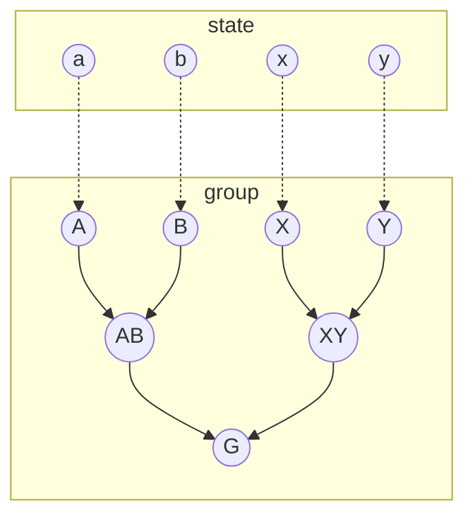

Figure 5.3 State-function graph for the crash course example. The relationships between the state variables, shown in red, and the state functions in a group, shown in blue, are shown by directed connections that indicate a dependency. For this figure, we have converted the graph to a TikZ file, which can be manually tweaked to get a publication-ready figure.

will revisit the plotting functionality later on in this chapter. Note that whereas we have seven different state functions, we only implemented three classes. The same implementation is in this case used for several different named functions. Thinking about how to structure state functions can drastically reduce the amount of code you have to write.

> Visualizing `StateFunctionGrouping` instances uses the MATLAB graph-plotting functionality, which was introduced in R2015b. The plots presented in this chapter are generated as TikZ from these graphs and are somewhat different from the plots seen in the MATLAB plotting interface. The 2015b requirement does not apply to simulators that employ state functions; it is only a requirement for the graph plotting.

We are now ready to define our input. The state functions pick values from the state, so we initialize a struct with arbitrary values for the required fields:

```matlab
state0 = struct('a', 3, 'b', 5, 'x', 7, 'y', 2); % Initial state
```

We next add the state-function *container* for the group to enable caching. (During a simulation, this would be done automatically by `initStateAD`.) Per the constructor call to the group, intermediate results will be stored under the field `mystorage` as a specialized struct that acts as a handle class:

[https://doi.org/10.1017/9781009019781](https://doi.org/10.1017/9781009019781) Published online by Cambridge University Press

Better AD Simulators with Flexible State Functions and Accurate Discretizations 167

<page_number>

167
</page_number>

```matlab
state = group.initStateFunctionContainer(state0); % Enable caching
disp(state.mystorage)
```

```
  HandleStruct with fields:
    A: []
    B: []
    X: []
    Y: []
   AB: []
   XY: []
    G: []
```

Now that all functions and inputs are set up, we can finally evaluate $G$, which will trigger the evaluation of all intermediate functions as the dependency graph is traversed. We insert an empty array in the positional argument normally reserved for the model, because it is not needed for our example:

```matlab
G = group.get([], state, 'G'); % First call, triggers execution
```

```
  Retrieving a from state.
  Retrieving b from state.
  Multiplying A and B.
  Retrieving x from state.
  Retrieving y from state.
  Multiplying X and Y.
  Adding AB and XY.
```

We see that the dependencies are traversed in a depth-first manner of the transpose of the directed graph in Figure 5.3, starting from $G$. The container is now updated with the intermediate results. As we just saw, storage of evaluated state functions is achieved through the use of a `handle` class instance, which acts much like a pointer in C++.<sup>2</sup> The evaluated properties will still be cached if you pass an initialized AD state to a function that calls `getProp` without returning the state itself:

```matlab
disp(state.mystorage)
```

```
  HandleStruct with fields:
    A: 3
    B: 5
    X: 7
    Y: 2
   AB: 15
   XY: 14
    G: 29
```

<sup>2</sup> See subsection 12.3.2, *Handle classes*, of the MRST textbook [3] for more details and the design considerations that lead to AD-OO’s sparing use of `handle` as the base class.

[https://doi.org/10.1017/9781009019781](https://doi.org/10.1017/9781009019781) Published online by Cambridge University Press

168 O. Møyner

<page_number>

168
</page_number>

We can verify this by calling the `get` function again; no output will be produced, because the result is already computed:

```matlab
G = group.get([], state, 'G') % Second call, cached

G = 29
```

With only a few different functions present, it is fairly simple to see from the graphs whether anything is missing or out of place. We can also use the `checkDependencies` function that checks all dependencies and optionally returns the boolean `ok` indicating whether all of the dependencies are fulfilled:

```matlab
mrstVerbose on; % Print missing dependencies
ok = group.checkDependencies();
```

```
All internal dependencies are met for group of class
StateFunctionGrouping.
```

In sum, we can safely request all functions in this group via `getProp`. We now add a function `F` that multiplies `X` with a missing function `Z` and validate again:

```matlab
group = group.setStateFunction('F', TutorialProduct('X', 'Z'));
ok = group.checkDependencies();
```

```
Unmet internal dependency for F in StateFunctionGrouping:
    Did not find Z in own group.
```

It is worth nothing that if no output argument is given, the function will throw an error at the first unmet dependency it finds. You can also pass in a cell array of other groups to check any external dependencies:

```matlab
ok = group.checkDependencies({groupA, groupB, groupC});
```

The `validateModel` function discussed in Subsection 5.2.3 checks all external and internal dependencies at the start of a simulation.

## 5.3.2 Evaluation of Properties

In the preceding sections, we have not specified the logic behind `getProp` and how it triggers an evaluation of one or more state functions. Figure 5.4 outlines the process MRST goes through to produce outputs for the given state and a

[https://doi.org/10.1017/9781009019781](https://doi.org/10.1017/9781009019781) Published online by Cambridge University Press

Better AD Simulators with Flexible State Functions and Accurate Discretizations <page_number>169</page_number>

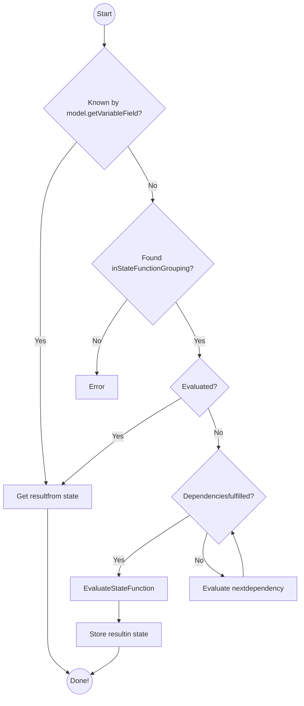

Figure 5.4 Flowchart demonstrating the internal logic used when calling `model.getProp` to get the value of some state variable or state function in the AD framework. The blue color corresponds to the model itself, whereas nodes colored in red are handled by any `StateFunctionGroupings` attached to the model.

named property. We can make a few observations from the flowchart: Named properties known by `model.getVariableField` take precedence over any named state functions present. The intent is to differentiate between the properties present in `state`, which together completely define the current conditions of the system we are simulating, and properties that can be derived from the current conditions via functions. By convention, state-function groups are instantiated at the start of the simulation by the `validateModel` function, which calls the `setupStateFunctionGroupings` function. We do not create them in the model constructor, because the properties of the model can be changed after the class is instantiated and the choice of specific functions depends on the final configuration.

We also see that the evaluation of a property is *cached* so that it will be evaluated only if not already present in `state`. If dependencies are not yet evaluated, the simulator will evaluate them in sequence as we saw earlier. Each of the dependencies may have their own dependencies that are recursively computed. For this reason, the first call to `getProp` within a linearization is often the slowest,

[https://doi.org/10.1017/9781009019781](https://doi.org/10.1017/9781009019781) Published online by Cambridge University Press

170 O. Møyner

because it will implicitly calculate many values. In the initialization of the AD state in `initStateAD`, described in Subsection 5.2.2, the `initStateFunctionContainers` function will give each `StateFunctionGrouping` attached to the model the opportunity to initialize storage for all known state functions. This call is responsible for setting up the containers we saw attached to the state in Subsection 5.3.2. The storage and any Jacobians are removed from state using the `reduceState` function before the variables in state are updated and passed on to the next nonlinear iteration.

Let us compute the density for a compositional model by initializing a state with caching for a model with 40 000 cells. Here, we have performed the evaluation without the initialization of primary variables<sup>3</sup>:

```matlab
fprintf('First call: '); tic(); rho = model.getProp(state, 'Density'); toc();
fprintf('Second call: '); tic(); rho = model.getProp(state, 'Density'); toc();

First call: Elapsed time is 0.035023 seconds.
Second call: Elapsed time is 0.000847 seconds.
```

Two calls will only evaluate the state functions necessary to compute density once so that the second call just retrieves the stored result. Let us examine the relevant fields of the state-container storage after `initStateAD` has been called but before we call `getProp`:

```matlab
disp(state.PVTProps)
```

```matlab
              :
                       Density: []
                PhasePressures: []
   PhaseCompressibilityFactors: []
              :
```

These empty values, corresponding to density and two other properties required to evaluate density, are filled in after calling `getProp` once:

```matlab
              :
                       Density: {1x3 cell}
                PhasePressures: {1x3 cell}
   PhaseCompressibilityFactors: {1x3 cell}
              :
```

<sup>3</sup> For more details, see Subsection 5.2.2 and then call `getProp` twice. The setup code for this snippet is found in `examplePlottingStateFunctionsBook.m`.

[https://doi.org/10.1017/9781009019781](https://doi.org/10.1017/9781009019781) Published online by Cambridge University Press

Better AD Simulators with Flexible State Functions and Accurate Discretizations 171

<page_number>

171
</page_number>

As in the state-function crash course, we see that the outputs from the (intermediate) function evaluations have been stored in the state object. For this reason, once a state has been initialized with state-function caching of variables – e.g., by calling `getStateAD` – you should be careful not to modify any values of the state. Otherwise, the output of `getProp` may not be what you expect due to caching.

There are actually two main interfaces for retrieving state-function outputs. You have already been introduced to the general `getProp`/`getProps` interface, which automatically figures out whether the input arguments belong to the state itself or to one of the state-function groups. The second interface is specific to each grouping and is required if properties in multiple groups have the same name:

```matlab
model.getProp(state, 'Mobility')     % Standard interface: Automatic mapping
fp = model.FlowPropertyFunctions;    % StateFunctionGrouping class instance
fp.get(model, state, 'Mobility')     % Internal interface: Get from grouping
```

The model can contain several different state-function groups. For a group to be accessible to `getProp`, it must be returned from the model member function `getStateFunctionGroupings`. This function outputs a cell array of all currently initialized groups. For example, if we write a custom model class inheriting from `PhysicalModel` that has a new group contained in the field `MyCustomGroup`, we must modify the member function so that it also reports this new group:

```matlab
function groupings = getStateFunctionGroupings(model)
    groupings@PhysicalModel(model);    % Get parent groups
    groupings{end+1} = model.MyCustomGroup; % Output new group
end
```

### 5.3.3 Examples of State Functions

You have seen how the state functions work on a simplified example and where they fit as a part of a model. Next, we consider a few examples of specific functions used by MRST for black-oil simulation to demonstrate the usage in practice. The first example is the `PoreVolume` state function, which provides the discrete pore volume to the simulator. The base implementation inherits from the `StateFunction` base class and has a simple constructor that validates the cell-wise pore volumes stored in the model. This class is stored under `ad-core/statefunctions/flowprops`. In the constructor, we verify that the

[https://doi.org/10.1017/9781009019781](https://doi.org/10.1017/9781009019781) Published online by Cambridge University Press

<page_number>172</page_number>

O. Møyner

model has pore volumes stored and that these are nonnegative and given for all cells in the domain. During simulation, the simulator will call the `evaluateOnDomain` member function with an AD-initialized state and the current model. In this case, we merely retrieve the pore volume from the model:

```matlab
function gp = PoreVolume(model, varargin)
      gp@StateFunction(model, varargin{:}); % Call base constructor
      assert(isfield(model.operators, 'pv'), ...
         'Pore volume (pv) must be present as field in operators struct');
      assert(numel(model.operators.pv) == model.G.cells.num,...
         'Pore volumes must be defined in each cell.');
      assert(all(model.operators.pv > 0), 'Pore volumes must be non-negative.');
end

function pv = evaluateOnDomain(prop, model, state)
      pv = model.operators.pv; % Static pore-volume
end
```

Pore volume is often thought of as static, and if it changes it is usually through a weak dependence on the pressure as the rock surrounding the pores expands or contracts to match the stresses from changes in the fluid pressure. This alternative definition writes $\Phi$ as a function of average porosity $\phi$ in each cell, bulk volume **V** in each cell, and a pressure-dependent multiplier function **m**, so that $\Phi(\mathbf{p}) = \mathbf{m}(\mathbf{p})\phi\mathbf{V}$. The `BlackOilPoreVolume` specialization inherits from `PoreVolume` and documents in the constructor that the class requires the pressure from the state to perform an evaluation. We also verify that the fluid struct contains the requisite function handle for the multiplier. The function evaluation now consists of two parts: We first retrieve the pore volume from the model by calling the base implementation and then evaluate and apply the multiplier to the volumes in each cell:

```matlab
function gp = BlackOilPoreVolume(model, varargin)
      gp@PoreVolume(model, varargin{:});
      gp = gp.dependsOn({'pressure'}, 'state');
end
function pv = evaluateOnDomain(prop, model, state)
      % Get effective pore-volume, accounting for rock-compressibility
      pv = evaluateOnDomain@PoreVolume(prop, model, state);
      f = model.fluid;
      p = model.getProp(state, 'pressure');
      pvMult = prop.evaluateFluid(model, 'pvMultR', p);
      pv = pv.*pvMult;
end
```

Here, `pvMultR` is passed onto `evaluateFunctionOnDomainWithArguments`, a special function that evaluates one or more `function_handle` instances on the

[https://doi.org/10.1017/9781009019781](https://doi.org/10.1017/9781009019781) Published online by Cambridge University Press

*Better AD Simulators with Flexible State Functions and Accurate Discretizations* 173
<page_number>

173
</page_number>

entire domain with the given arguments via `evaluateFluid`. If `fluid.pvMultR` is a single function, it is interpreted as valid for all cells in the domain. Otherwise, the function is evaluated for each subdomain. The code executed by the class is then equivalent to the following:

```matlab
f = model.fluid;
if iscell(f.pvMult) % Regions present
    v = model.AutoDiffBackend.convertToAD(zeros(model.G.cells.num, 1), p);
    for i = 1:numel(f.pvMult)       % Iterate over regions
         active = fn.regions == i;  % Find the cells where function is valid
         v(active) = f.pvMultR{i}(p(active)) % Evaluate for these cells
    end
else                % No regions present
    v = f.pvMult(p);
end
```

The assumption of small variation can be violated; for instance, if the bulk mass of the porous medium is fractured during simulation or if the rock reacts with the fluid through mineralization or acidification. By exposing the pore volume as a state function, we have made it easy to replace the implementation for practitioners who wish to study different phenomena. Such an implementation has access to all current primary variables in `state` and all static properties in the model, making it possible to introduce any functional dependency in a simulator without modifying any of the other code. Breaking a complex simulator into many smaller constitutive parts that each represents a function with a single output makes it easier to test and verify correct behavior for the simulator as a whole. In the next section, we describe exactly how the interplay between different functions is managed by the simulator and how to interject new relationships as needed.

### 5.3.4 The `StateFunctionGrouping` Class

The typical simulator will contain a fairly large number of different functions that evaluate functional relationships based on the reservoir state. Many of these functions will depend on each other and may be closely related. The `StateFunctionGrouping` class groups many different `StateFunction` instances together and manages the evaluation of entries in the group. In the previous section, we saw how two different pore volume implementations can coexist, but we were vague on how the simulator would choose the correct one for a given scenario. The answer lies in the corresponding state-function group for PVT properties.

[https://doi.org/10.1017/9781009019781](https://doi.org/10.1017/9781009019781) Published online by Cambridge University Press

174 O. Møyner

<page_number>

174
</page_number>

We already saw an example of how to use the groups in Subsection 5.3.1. The group is instantiated during model validation and chooses the specific implementations for functions for the specific scenario. We start by calling the base constructor and retrieving the PVT regions:

```matlab
function props = PVTPropertyFunctions(model)
    props@StateFunctionGrouping();
    pvt = props.getRegionPVT(model);
```

Each state function is then constructed with the region indicators:

```matlab
bf = BlackOilShrinkageFactors(model, pvt);
props = props.setStateFunction('ShrinkageFactors', bf);
```

Certain properties have multiple implementations. One example is the pore volume we have already discussed:

```matlab
if isfield(model.fluid, 'pvMultR') % Check for multiplier
    pv = BlackOilPoreVolume(model, pvt);
else
    pv = PoreVolume(model, pvt);
end
props = props.setStateFunction('PoreVolume', pv);
```

It is instructive to consider another state function from the PVT grouping. Let us consider a black-oil model, in which the gas component is allowed to dissolve into the oleic phase. The multiphase densities are then given as a function of the surface densities, the shrinkage factors $b_\alpha$, and the solution gas–oil ratio $R_s$,

$$ \rho_w = b_w\rho_{ws}, \quad \rho_o = b_o(\rho_{os} + R_s\rho_{gs}), \quad \rho_g = b_g\rho_{gs}. \quad (5.10) $$

This equation is included as an example of a function with multiple dependencies. You can consult subsection 8.2.3 and section 11.4 of the MRST textbook [3] for additional details on the black-oil model and the physical interpretation of these terms. To keep the discussion straightforward, we consider a simplified version of the general MRST class `BlackOilDensity`, in which we assume that gas can always dissolve into the oleic phase and that the oil component does not vaporize into the gaseous phase. We consider the constructor, where we have two types of dependencies documented:

```matlab
function gp = BlackOilDensity(model, varargin)
    gp@StateFunction(model, varargin{:});
    gp = gp.dependsOn({'rs'}, 'state');
    gp = gp.dependsOn({'ShrinkageFactors'});
end
```

[https://doi.org/10.1017/9781009019781](https://doi.org/10.1017/9781009019781) Published online by Cambridge University Press

Better AD Simulators with Flexible State Functions and Accurate Discretizations 175

<page_number>

175
</page_number>

The first dependency is an *external* dependency on `rs` from `state`. The second is an *internal* dependency, in which we require values of the named state function `ShrinkageFactors` from the same *group*: We are not specifying the name of this group itself, but we are implicitly saying that if the simulator wants to evaluate `BlackOilDensity`, it would also have to provide some way of getting `ShrinkageFactors` in the same group. Internal dependencies are always evaluated with the same state object and can be thought of as closely related. The interface for evaluating the properties reflects this division between internal and external dependencies: For each internal dependency, we can use `getEvaluatedDependencies` to query whether this property already has been evaluated (and cached) so that we do not have to use a potentially expensive call to `getProp`. This function bypasses the more expensive parts of `getProp` that check and evaluate dependencies. Summing up, the evaluation of black-oil densities is implemented as follows:

```matlab
function rho = evaluateOnDomain(prop, model, state)
   rs = model.getProp(state, 'rs'); % External dependency
   b = prop.getEvaluatedDependencies(state, 'ShrinkageFactors'); % Internal
   rhoS = model.getSurfaceDensities(); nph = model.getNumberOfPhases();
   rho = cell(1, nph); % Allocate storage
   for i = 1:nph
      rho{i} = rhoS(prop.regions, i).*b{i}; % rhoS_alpha * b_alpha
   end
   oix = model.getPhaseIndex('O'); gix = model.getPhaseIndex('G');
   rho{oix} = rho{oix} + rs.*b{oix}.*rhoS(prop.regions, gix); % Disgas
end
```

The member function `evaluateOnDomain` is the main way of getting values from state functions. It can generally be implemented just as you would implement any other function, with a few caveats:

* Matrix output is generally not supported when a function should support automatic differentiation in MRST. Unless your function will never produce AD outputs, consider using a cell array of column vectors instead, where each entry corresponds to one column of the matrix.

* If the output is made up of either a single column vector or multiple column vectors arranged as a row-cell array, the values should match the dimensions of `prop.regions` if present.

* If a cell array is given as output, the convention is to let the row index correspond to the index of a component and the column index indicate the phase. It is assumed that calling `value` on the output is safe, which requires that all vectors in the same row of a cell array are of the same length.

* Empty entries in cell arrays will be interpreted as zero values.

[https://doi.org/10.1017/9781009019781](https://doi.org/10.1017/9781009019781) Published online by Cambridge University Press

176 O. Møyner

<page_number>

176
</page_number>

Shrinkage factors are listed as *internal* dependencies because they belong to the `PVTPropertyFunctions` grouping that contains all properties related to modeling PVT behavior of fluids. When a reservoir model is validated before simulation, the default `PVTPropertyFunctions` class will be instantiated, and specialized versions of the different state functions will be chosen based on features present in the model. For black-oil models, this includes the `disgas` and `vapoil` flags, the function handles present in `state.fluid`, and an Eclipse deck, if present, in `model.inputdata`. To illustrate, we examine the flow functions for the SPE 1 model from `blackoilTutorialSPE1`:

```matlab
model = model.setupStateFunctionGroupings(); % Setup
disp(model.PVTPropertyFunctions)
```

```text
  PVTPropertyFunctions (edit|plot) state function grouping instance.

  Intrinsic state functions (Class properties for PVTPropertyFunctions,
  always present):
                  Density: BlackOilDensity (edit|plot)
           PhasePressures: PhasePressures (edit|plot)
               PoreVolume: BlackOilPoreVolume (edit|plot)
 PressureReductionFactors: BlackOilPressureReductionFactors (edit|plot)
         ShrinkageFactors: BlackOilShrinkageFactors (edit|plot)
                Viscosity: BlackOilViscosity (edit|plot)

  Extra state functions (Added to class instance):
                  RsMax: RsMax (edit|plot)
```

The output, produced by the `StateFunctionGrouping` base class’s overloaded implementation of `disp`, shows a number of *intrinsic* PVT properties that will always be present in a black-oil model, such as density and pore volumes discussed earlier in this chapter, as well as phase pressures, shrinkage factors, and viscosities. The pressure reduction factors are weights that can be used to transform a set of conservation equations into a pressure equation (cf. the discussion of constrained pressure residuals in subsection 12.3.4 of the MRST textbook [[3]](3)). When writing a general function that acts on some model with a PVT property-functions instance, we can safely assume that the outputs of these state functions are available through `model.getProp`. In addition, `RsMax` has been added as an extra property to facilitate support for variable bubble-point pressure. We cannot generally assume that this function is available, because it implicitly relies on the specific way dissolution is modeled in black-oil-type equations. We also see that each property, intrinsic or not, has both a group name (e.g., Density) and an implementation name for the configured class (`BlackOilDensity`). We can look up the documentation or edit the specific implementation directly from the command window or plot the

[https://doi.org/10.1017/9781009019781](https://doi.org/10.1017/9781009019781) Published online by Cambridge University Press

Better AD Simulators with Flexible State Functions and Accurate Discretizations 177

<page_number>

177
</page_number>

relationship between the functions. We can easily add, get a handle to, replace, remove, and evaluate functions for a given state-function grouping `g` through the public interfaces:

```matlab
g = g.setStateFunction('Name', impl);     % Set 'Name' implementation
p = props.getStateFunction('Name');       % Get class instance defining 'Name'
g = g.removeStateFunction('Name');        % Only allowed for extra properties
v = props.get(model, state, 'Density');   % Evaluate for given state
```

By adding or changing which `StateFunction` class is used to evaluate a given physical property, it is possible to effectively rewrite or reconfigure many parts of the simulator without changing other parts of the existing code. Once a model has been validated to set up the state-function groups, we can compute values for the named property for a given `state` through the standard interface:

```matlab
v = model.getProp(state, 'Density'); % Standard interface
```

Generally, you do not need to know in which group a specific state function is placed. However, if two different properties from different groups have the same name, you should use the internal interface from Subsection 5.3.2.

## 5.4 Discretization with State Functions

In a flow simulator, the `PVTPropertyFunctions` grouping is usually accompanied by other groups like the `FlowPropertyFunctions`, which contains flow properties such as capillary pressure, relative permeabilities, mobilities, etc. Other groupings include `FlowDiscretization`, which holds functions used to discretize and define the mass-conservation equations for a typical finite-volume scheme, and `FacilityFlowDiscretization`, which contains functions needed to compute fluxes from wells for a given set of controls. Neither of these groups of functions is entirely independent of each other, and we can thus also have a number of cross-group dependencies. In summary, state functions are used to evaluate properties but are also used to discretize model equations. In this section, we will go through some of the benefits of using state functions to build a simulator.

> Much of the functionality in this section is only supported in the `Generic` family of AD models. Model classes that explicitly name the number of phases – e.g., `ThreePhaseBlackOilModel` – are currently limited to fully implicit schemes with the standard spatial discretizations.

[https://doi.org/10.1017/9781009019781](https://doi.org/10.1017/9781009019781) Published online by Cambridge University Press

<page_number>178</page_number>

O. Møyner

## 5.4.1 The Simulator as a Graph

There may be many state functions involved in a simulator; at the time of writing, the solvers in the compositional module define nearly 40 individual functions when wells are present. We have seen that there are numerous benefits associated with this structure, but it may become unwieldy to manage such a large number of classes if you are not already intimately familiar with the structure of the simulator. One way to visualize this structure is to consider the dependency graph as we briefly saw in Subsection 5.3.1: If you think of each state function as a node and treat the dependencies of each functions as edges in a graph, each property evaluation is represented as the traversal of a directed graph. Let us return to the mass densities from (5.13). If a model has a density implementation, we can easily plot the function and all of its dependencies by calling<sup>4</sup>:

```
plotStateFunctionGroupings(model, 'Stop', 'Density')
```

The optional `'Stop'` argument indicates that we only wish to plot the part of the graph visited by a backwards traversal starting from the density. This gives us a plot of all functions and state variables needed to evaluate the density. The dependency graph in Figure 5.5 shows that the density in a black-oil model depends directly on *b*-factors and $R_s$, as expected from (5.13). It also depends indirectly on saturation through capillary pressure, which enters the phase pressures used to evaluate the *b*-factors. The black-oil model represents a simplified PVT behavior compared to a compositional model. Figure 5.6 shows the result of the same plotting command applied to a compositional model. Compositional models compute density directly, and the *b*-factors (ShrinkageFactors) are thus nowhere to be seen. Density of the liquid phase, for example, depends on pressure, temperature, phase compressibility factor $Z_\ell$, and phase mole fractions $x_i$,

$$ pV = n_\ell RTZ_\ell \rightarrow \rho_\ell = \frac{p}{RTZ_\ell} \sum_{i=1}^{N_c} M_i x_i. $$

You can use standard techniques to manipulate the graphs, and it is possible to quickly get an overview of complex simulators simply by plotting one or more of the function groups in the simulator. Plotting the full graph is done by either passing the model to plot all groups or the desired groups as a cell array:

```
plotStateFunctionGroupings(model)
plotStateFunctionGroupings(model.getStateFunctionGroupings())
```

<sup>4</sup> State functions are set up at the start of a simulation, with reasonable defaults given. If you have just constructed your model (e.g., using `initEclipseProblemAD`), you must issue a call to `model = model.validateModel()` to set up the state functions and invoke the defaults.

[https://doi.org/10.1017/9781009019781](https://doi.org/10.1017/9781009019781) Published online by Cambridge University Press

Better AD Simulators with Flexible State Functions and Accurate Discretizations 179

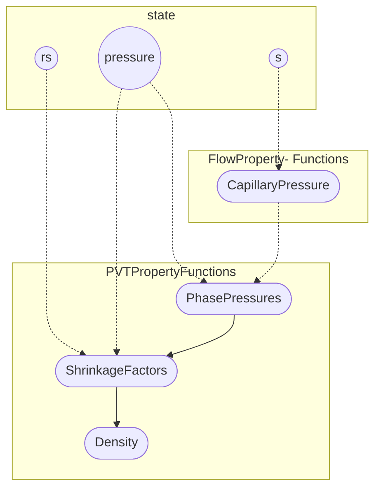

Figure 5.5 Dependency graph for phase mass density in a standard black-oil model with gas dissolved in oil.

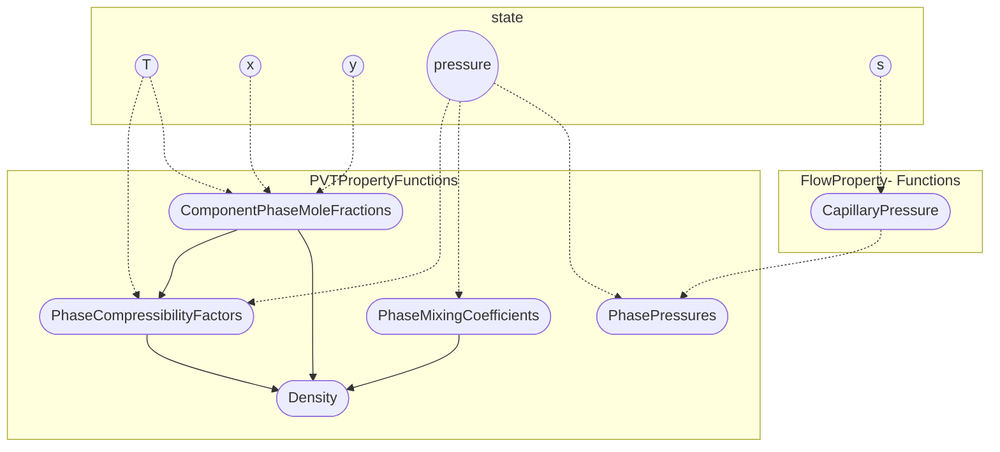

Figure 5.6 Dependency graph for phase mass density in a three-phase compositional model; PVT behavior is clearly more complex than for the black-oil model in Figure 5.5.

Graphs with a large number of connections are often difficult to navigate but may serve as a good starting point for exploring the interdependencies of different functions used in a given simulator.

The optional argument `'label'` determines the type of labels used for the nodes in the graph. The default is `'name'`, which labels nodes by the name of the corresponding state function has been given in the group. If we instead use the value `'label'`, each state function outputs the contents of its `label` property instead, which may be interpreted by T<sub>E</sub>X. As an example, Figure 5.7 reports the entire graph of the `GenericBlackOilModel` for SPE 1, including state variables, flow properties, flux discretization for the reservoir equations, and facility flux discretization for the wells. The default symbols used in the plot correspond to the notation from the set of generic governing equations in Subsection 5.2.1, but you can, of course, change the labels if you want to use generate figures with another notation.

Returning to (5.1), we see that all three discrete quantities we need to evaluate the mass-conservation equation for a component appear as leaf nodes in Figure 5.7:

[https://doi.org/10.1017/9781009019781](https://doi.org/10.1017/9781009019781) Published online by Cambridge University Press

180 O. Møyner

State-function graph for a black-oil model showing relationships between state variables, PVT properties, flow properties, and discretization terms.

Figure 5.7 The entire state-function graph for a black-oil model. The state variables are the starting point for computing the reservoir flow properties, PVT properties, reservoir fluxes, and well source terms. The terms appearing in (5.1) are marked in red.

The component mass in each cell **M**<sub>i</sub> is in the flow property functions, the component mass mflux **V**<sub>i</sub> across each cell interface in the flux discretization, and the component mass source term **Q**<sub>i</sub> is the terminus of the facility flux discretization.

## 5.4.2 The Component Implementation

State functions relating to compositions have so far always given values for all components simultaneously. This is manageable for many simple fluid descriptions but can cause code duplication for multicomponent systems, because the same component may be present in many different settings. For example, the immiscible water component is present in both black-oil and compositional systems. Generic models therefore make use of a helper class, `GenericComponent`, that is instantiated by `validateModel` for each component present. The generic black-oil model, for example, executes the following when either dissolved gas or vaporized oil is present:

```matlab
for ph = 1:nph
    switch names(ph)
        case 'W',    c = ImmiscibleComponent('water', ph);
        case 'O',    c = OilComponent('oil', ph, disgas, vapoil);
        case 'G',    c = GasComponent('gas', ph, disgas, vapoil);
    end
    model.Components{ph} = c;
end
```

[https://doi.org/10.1017/9781009019781](https://doi.org/10.1017/9781009019781) Published online by Cambridge University Press

Better AD Simulators with Flexible State Functions and Accurate Discretizations 181

<page_number>

181
</page_number>

The water phase is treated as a generic immiscible fluid, whereas the gas and oil components use specialized classes. We will go through these in more detail in the following subsections. The component base class implements the component phase mass from (5.2) and the component mass mobility from (5.6). In the following, we focus on the definition of the phase-component mass density $\rho_{i,\alpha}$ through the function `getComponentDensity`, because it implicitly defines the component mobility and mass fractions. The possibility exists for overriding each of these functions individually, should you, for example, desire a more complex expression for (5.6). For additional examples of specialized components for different applications, see Chapters 7 and 8.

## Immiscible Components

Immiscible models assume that a component belongs to a single phase only and that the phase is only composed of that component. Phases and components are often used interchangeably when describing models in which all phases are immiscible. As with a state function, we document the dependencies the component have in the constructor. For the immiscible component, we pass the index of the phase the component belongs to as a required parameter:

```matlab
function c = ImmiscibleComponent(name, phase)
   c@GenericComponent(name);
   c.phaseIndex = phase;
   c=c.functionDependsOn('getComponentDensity','Density','PVTPropertyFunctions');
end
```

If we let $L(i)$ label the phase component $i$ belongs to, we can define the mass density for the component succinctly:

$$
\rho_{i,\alpha} = \begin{cases} \rho_{\alpha}, & \text{if } \alpha = L(i), \\ 0, & \text{otherwise.} \end{cases} \eqno(5.11)
$$

To define the component mass density, we let the base class produce an empty cell array and then set the component density equal to the phase density in phase $L(i)$:

```matlab
function c = getComponentDensity(component, model, state)
   rho = model.getProp(state, 'Density');
   c{component.phaseIndex} = rho{component.phaseIndex};
end
```

In addition, there are a number of functions that describe how a component is divided between the different phase streams at surface phase conditions (i.e., as qWs, qOs and qGs) and how compositions are added to the flow from an injector well. We associate each unit of mass produced of the immiscible component

[https://doi.org/10.1017/9781009019781](https://doi.org/10.1017/9781009019781) Published online by Cambridge University Press

182 O. Møyner

with one unit of the corresponding surface phase stream, regardless of the pressure and temperature conditions:

```matlab
function c = getPhaseCompositionSurface(component, model, state, pressure, T)
    c = cell(model.getNumberOfPhases(), 1);
    c{component.phaseIndex} = 1;
end
```

Finally, we can define the mass fraction for the injection well stream from the compi field of the wells:

```matlab
function c = getPhaseComponentFractionInjection(component, model, state, force)
    % Get the fraction of the component in each phase (when
    % injecting from outside the domain)
    c = cell(model.getNumberOfPhases(), 1);
    if isfield(force, 'compi')
        comp_{i} = vertcat(force.compi); % Wells
    else
        comp_{i} = vertcat(force.sat); % BC
    end
    index = component.phaseIndex;
    ci = comp_{i}(:, index);
    if any(ci ~= 0), c{index} = ci; end
end
```

## Black-Oil Components

One perspective on the black-oil model is that it is a stepping stone from the immiscible model toward more compositional behavior. The number of phases still equals the number of components and each component is paired with a corresponding phase of the same name. The water component is considered immiscible, and we do not need to modify our implementation:

$$ \rho_{w,\alpha} = \begin{cases} \rho_{\alpha}, & \text{if } \alpha = w, \\ 0, & \text{otherwise.} \end{cases} \eqno(5.12) $$

There is a symmetry to the two components when **R**<sub>s</sub> and **R**<sub>v</sub> are both present:

$$ \rho_{o,\alpha} = \begin{cases} \rho_{o}^{S} \mathbf{b}_{o}, & \text{if } \alpha = o, \\ \rho_{o}^{S} \mathbf{b}_{g} \mathbf{R}_{v}, & \text{if } \alpha = g, \\ 0, & \text{otherwise,} \end{cases} \quad \rho_{g,\alpha} = \begin{cases} \rho_{g}^{S} \mathbf{b}_{o} \mathbf{R}_{s}, & \text{if } \alpha = o, \\ \rho_{g}^{S} \mathbf{b}_{g}, & \text{if } \alpha = g, \\ 0, & \text{otherwise.} \end{cases} \eqno(5.13) $$

Mathematically, the black-oil model is an extension of the immiscible flow model, and the oil and gas components thus inherit from the immiscible implementation. We only examine the oil component; the gas component is essentially analogous:

[https://doi.org/10.1017/9781009019781](https://doi.org/10.1017/9781009019781) Published online by Cambridge University Press

Better AD Simulators with Flexible State Functions and Accurate Discretizations 183

```matlab
function c = OilComponent(name, gasIndex, disgas, vapoil)
    c@ImmiscibleComponent(name, gasIndex);
    [c.disgas, c.vapoil] = deal(disgas, vapoil);
    c = c.functionDependsOn('getComponentDensity', ...
                            'ShrinkageFactors', 'PVTPropertyFunctions');
    if vapoil
        c = c.functionDependsOn('getComponentDensity', 'rv', 'state');
    end
end
```

Next, we define the component density for the oil component in vaporized oil as the product of **R**<sub>*v*</sub> together with the oil shrinkage factor and the oil surface density. We must also take care to modify the density in the oil phase to account for the swelling due to dissolved gas per (5.13). The actual value of **R**<sub>*s*</sub> is not explicitly used, but it implicitly impacts the results via the evaluation of the shrinkage factors themselves, as we saw in Figure 5.5:

```matlab
function c = getComponentDensity(component, model, state)
    c = getComponentDensity@ImmiscibleComponent(component, model, state);
    if component.disgas || component.vapoil % Check for black-oil behavior
        b = model.getProps(state, 'ShrinkageFactors');
        phasenames = model.getPhaseNames();
        oix = (phasenames == 'O');
        reg = model.PVTPropertyFunctions.getRegionPVT(model);
        rhoOS = model.getSurfaceDensities(reg, oix);
        if component.disgas % Component density is not phase density
            bO = b{oix}; c{oix} = rhoOS.*bO;
        end
        if component.vapoil % There is mass of oil in gaseous phase
            gix = phasenames == 'G';
            rv = model.getProp(state, 'rv');
            c{gix} = rv.*rhoOS.*b{gix};
        end
    end
end
```

### Two-Phase Compositional Components

For the compositional module discussed in more detail in Chapter 8, we assume we have up to two phases present that are formed through vapor–liquid equilibrium. Then the following holds:

$$
\rho_{i,\alpha} = \begin{cases} X_{i,\ell}\rho_{\ell}, & \text{if } \alpha = \ell, \\ X_{i,v}\rho_{v}, & \text{if } \alpha = v, \\ 0, & \text{otherwise.} \end{cases} \tag{5.14}
$$

The definition of the component density is then straightforward from the mass fractions and mass density obtained from flashing the compositions:

[https://doi.org/10.1017/9781009019781](https://doi.org/10.1017/9781009019781) Published online by Cambridge University Press

184 O. Møyner

```matlab
function c = getComponentDensity(component, model, state, varargin)
    c = component.getPhaseComposition(model, state, varargin{:});
    rho = model.getProps(state, 'Density');
    for ph = 1:numel(c)
        if ~isempty(c{ph})
            c{ph} = rho{ph}.*c{ph};
        end
    end
end
```

## 5.4.3 Temporal Discretizations

Combining automatic differentiation with the state-function framework enables you to decouple functions from their derivatives. One advantage of this approach is that it becomes easy to implement different temporal discretizations. The default discretization in MRST is always implicit, but it is not difficult to change which variables and functions are evaluated implicitly (i.e., based on the yet unknown state at the end of the timestep).

Let us consider the discrete component flux from (5.3), where the flux is made up of a potential term $\Theta_\alpha$, the absolute transmissibility $\mathbf{T}_f$, and the component mass mobility $\lambda_{i,\alpha}$. We assume that the transmissibility is a static quantity. We also observe that the rapid speed of propagation for pressure means that the potential difference should be evaluated implicitly:

$$ \mathbf{V}_{i,\alpha} = -\lambda_{i,\alpha}^{f,k} \mathbf{T}_f \Theta_\alpha^{n+1}. \tag{5.15} $$

The component mobility is here evaluated at time level $k$, so that $k = n$ gives explicit discretization of mobility and $k = n + 1$ results in a fully implicit scheme. We refer the reader to subsection 9.3.4 of the MRST textbook [3] for a discussion on explicit versus implicit schemes in general and to Section 10.2 for examples of sequential-implicit and sequential-explicit solvers for incompressible flow.

If we have the states at both the current and the previous time level as `state` and `state0`, respectively, the explicit flux ($k = n$) on the form (5.15) can be implemented as two state-function evaluations, here given for a single phase:

```matlab
mob  = model.getProp(state0, 'FaceMobility');                  % Previous time
kpot = model.getProp(state, 'PermeabilityPotentialGradient');  % Current time
v    = -mob{1}.*kpot{1};                                       % Explicit/implicit
```

Implementing standard explicit and implicit schemes in this way is straightforward. However, the two state functions are made up of many individual state functions for viscosity, relative permeability, density, and so on. If we want to exert fine-grained control over the implicitness of each individual function or have a function with implicitness that varies spatially, we need a more systematic approach. For this

[https://doi.org/10.1017/9781009019781](https://doi.org/10.1017/9781009019781) Published online by Cambridge University Press

Better AD Simulators with Flexible State Functions and Accurate Discretizations 185

reason, discrete fluxes are implemented in the `FlowDiscretization` class. This class contains an instance of a `FlowStateBuilder` class, which serves a dual purpose:

1. Before a timestep is simulated by the simulator, the flow-state builder may modify the suggested timestep to ensure stability of the underlying discretization scheme. You may already know the timestep selector classes from the MRST textbook [3, subsection 12.3.3], which select timesteps based on a variety of heuristics to target a certain accuracy or number of nonlinear iterations. The timestep limit imposed by the flow-state builder should ensure stability of the resulting scheme. For an explicit treatment of the mobility, the Courant–Friedrichs–Lewy (CFL) condition limits stability.

2. During a linearization, the flow-state builder will build a hybridized `state` that contains a mixture of implicit (AD, current time level) and explicit (double, from previous time level) variables. The hybridized state is used to evaluate the state functions that are required to compute the fluxes:

```matlab
v = model.getProp(flowstate, 'PhaseFlux')
```

The hybridized state contains a combination of the values at the current timestep and the values at the previous timestep for all state variables, making the scheme either explicit, implicit, or somewhere in between. The calling signature acts directly on the state, automatically carrying forward any AD variables:

```matlab
fd = model.FlowDiscretization;
flowstate = fd.buildFlowState(model, state, state0, dt); % Hybridize state
```

The functionality just discussed is implemented through two member functions of the `FlowDiscretization` class: `buildFlowState` creates the hybridized state struct and `getMaximumTimestep` calls the corresponding functions from the flow-state builder itself.

### Fully Implicit

The default implementation of the fully implicit flow-state builder is trivial. The theoretical maximum timestep for an unconditionally convergent scheme is infinity, whereas the flow state itself is just the state at the current timestep:

```matlab
function dt = getMaximumTimestep(fsb, fd, model, state, state0, dt, forces)
    dt = inf; % No time-step restriction
end
function flowState = build(builder, fd, model, state, state0, dt)
    flowState = state; % Fully implicit
end
```

[https://doi.org/10.1017/9781009019781](https://doi.org/10.1017/9781009019781) Published online by Cambridge University Press

186 O. Møyner

The utility function `setTimeDiscretization` modifies the flux discretization of an existing model and you can use it to switch between the flow-state builders. Fully implicit is the default choice, but it is still possible to explicitly select it:

```
model_fim = setTimeDiscretization(model, 'fully-implicit'); % FIM
```

### Explicit

Explicit schemes are attractive for their reduced numerical diffusion and relatively low computational cost for hyperbolic equations. They are, however, only conditionally stable in that the timestep is limited by the CFL condition. The general condition for a conservative discrete flux is found in equation (9.14) of the MRST textbook [3], but we can rewrite it slightly to use the maximum derivative of the fractional flow $f$ together with a fixed total velocity $v_t$:

$$ \eta = \frac{\Delta t}{\Delta x} \max_S |f'(S)| v_t \leq 1. \tag{5.16} $$

Explicit schemes update the values of a cell based on the values of its neighbors at the previous time level. This means that the timestep should be limited so that the fastest wave entering a cell should not exit that cell during the timestep or the stability will be impacted. The maximum derivative of the flux function must be determined over the interval spanned by the range of saturations inside the domain of dependence for each cell to obtain a *sharp* upper bound for the Courant number $\eta$ and produce a scheme that is formally stable. (In practice, one often uses a somewhat stricter condition by maximizing over all saturation values found in the initial and boundary data, because this set can be determined once and for all.) Systems of equations do not generally fulfill a maximum principle, and sharp and rigorous upper bounds on $\eta$ can become expensive to compute. Therefore, we instead compute numerical estimates and target a reduced upper bound on $\eta$ to have some margin of safety. The numerical estimate is based on the form given in [9]. (Notice also that the upper stable limit on $\eta$ generally depends on the discretization.)

If there are no capillary forces, we can write an estimate of the phase Courant number $\eta_s$ for cell $c$ in a three-phase system as

$$ \eta_s[c] = \frac{\Delta t}{\Phi[c]} \Lambda[c] \sum_{\gamma} \mathbf{V}_t[\gamma]. \tag{5.17} $$

Here, the sum is taken over a set of faces (e.g., all faces $\gamma$ that result in flow out from the cell) and $\Lambda[c]$ is the largest eigenvalue of the Jacobian

[https://doi.org/10.1017/9781009019781](https://doi.org/10.1017/9781009019781) Published online by Cambridge University Press

Better AD Simulators with Flexible State Functions and Accurate Discretizations 187

<page_number>

187
</page_number>

$$ \frac{\partial \boldsymbol{f}}{\partial \boldsymbol{S}} = \begin{bmatrix} \frac{\partial f_w}{\partial S_w} & \frac{\partial f_w}{\partial S_o} \\ \frac{\partial f_o}{\partial S_w} & \frac{\partial f_o}{\partial S_o} \end{bmatrix} $$

for the fractional-flow function in cell $c$, where the fractional flow is defined in the usual manner $f_\alpha = \lambda_\alpha / \sum_\beta \lambda_\beta$. If we consider a scalar problem in 1D with unit porosity, $\boldsymbol{\Lambda}$ becomes the largest derivative, the pore volume becomes $1/\Delta x$, and we recover (5.16). We also define the estimated component Courant number $\eta_z$ from an approximate volumetric flux for each component, given as the ratio of the component mass flow and the cell component mass:

$$ \eta_z[c] = \frac{\Delta t}{\boldsymbol{\Phi}[c]} \max_{i \in \{1, \dots, N\}} \left[ \frac{1}{\mathbf{M}_i[c]} \sum_\gamma \mathbf{V}_i[\gamma] \right]. \tag{5.18} $$

The smallest of the two limits is chosen to set the maximum timestep; i.e., $\eta = \min(\eta_s, \eta_z)$. Both of these values are only estimates, because the eigenvalues and component masses are calculated at a specific set of saturations and compositions. In addition, the fluxes may change during the timestep. For these reasons, it is natural to target a lower Courant number than unity in practice when choosing timesteps. The target can be adjusted on a per case basis; different authors [2, 12] have noted that a target of 1.5 or 2 can be safe under certain conditions.

If we now return to the implementation of the explicit flow-state builder, we see that there are a number of options to set the reduced CFL target:

```matlab
saturationCFL = 0.9;  % Target saturation CFL. Should be <= 1 for stability.
compositionCFL = 0.9; % Target composition CFL. Should be <= 1 for stability.
explicitFlux = {'FaceMobility', 'FaceComponentMobility',...
                'GravityPotentialDifference'}; % Explicit in FlowDiscretization
explicitFlow = {};    % Explicit quantities in FlowPropertyFunctions
explicitPVT = {};     % Explicit quantities in PVTPropertyFunctions
explicitProps = {};   % setProp/getProp exposed properties that should be explicit
initialStep = 1*day;  % Time step used if no fluxes are present
useInflowForEstimate = false;
```

In addition, the class allows us to specify explicit terms, which are either named functions from the different state-function groups in the reservoir model or properties in state, specified in `explicitProps`. These are most easily understood if we reformulate (5.1) as a difference of masses by removing source terms and weighting by the ratio of pore volume to timesteps and assume that the flux $\mathbf{V}$ is given by a general function $F$,

[https://doi.org/10.1017/9781009019781](https://doi.org/10.1017/9781009019781) Published online by Cambridge University Press

188 *O. Møyner*

$$ \mathbf{M}^{n+1} - \mathbf{M}^n + \frac{\Delta t}{\Phi} \text{div} \left( F(\mathbf{u}_1^n, \mathbf{u}_2^{n+1}, \mathbf{G}_1^n, \mathbf{G}_2^{n+1}) \right) = 0. \tag{5.19} $$

The function $F$ is parameterized by a set of state variables $\mathbf{u}_1$ and $\mathbf{u}_2$ that are evaluated explicitly and implicitly, respectively. Here, $\mathbf{u}_1$ would be the `explicitProps` and $\mathbf{u}_2$ contains the remainder of the state variables. We also assume that state functions $\mathbf{G}_1, \mathbf{G}_2$ are direct inputs in the same manner. Here, $\mathbf{G}_1$ is set by `explicitFlow` for flow properties and `explicitPVT` for PVT properties, `initialStep` specifies the maximum timestep at the start of the simulation when flux estimates are not present, and `useInflowForEstimate` provides a toggle for changing the definition of the faces in the sum in (5.17) from outflow to inflow faces.

The implementation of the hybrid state itself consists of two major parts: First, one replaces implicit state properties with the named explicit properties and then inserts the values of explicit property functions into the state cache so they are not recomputed. We use the implicit state as a starting point and use `setProp` to overwrite any specified variables:

```matlab
flowState = state; % Everything is implicit by default
for i = 1:numel(builder.explicitProps)
    p = builder.explicitProps{i};
    flowState = model.setProp(flowState, p, model.getProp(state0, p));
end
for i = 1:numel(props)
    prop = props{i}; % Props for current container
    if ~isempty(state0.(name).(prop)) % Name is the current container
        state0.(name).(prop) = []; % Remove cached entries
    end
    f0 = model.getProps(state0, prop);
    flowState.(name).(prop) = f0;
end
```

At this point, we have a state in which all values are evaluated either explicitly or implicitly. Evaluating the state functions that depend on several values may thus result in partially explicit evaluations; e.g., the default flux will evaluate the gradient of pressure implicitly and treat the mobility explicitly. You can select the explicit flow-state builder with a single line for any generic model class:

```matlab
model_exp = setTimeDiscretization(model, 'explicit'); % IMPES
```

### Adaptive Implicit

The explicit strategy has less numerical diffusion than the standard implicit method and can make the discrete equations nearly linear but will usually result in severe

[https://doi.org/10.1017/9781009019781](https://doi.org/10.1017/9781009019781) Published online by Cambridge University Press

*Better AD Simulators with Flexible State Functions and Accurate Discretizations* 189
<page_number>189</page_number>

timestep restrictions in practice. A somewhat less restrictive approach is to take the timestep as given and instead select the implicitness on a cell-by-cell basis according to the CFL limit. We can define a rule that defines the mobility in each cell from the estimate:

$$
\lambda_{i,\alpha}^k[c] = \begin{cases} \lambda_{i,\alpha}^{n+1}[c], & \text{if } \eta[c] > \eta_{\text{max}}, \\ \lambda_{i,\alpha}^n[c], & \text{otherwise.} \end{cases} \tag{5.20}
$$

This is the basic principle of adaptive-implicit methods (AIM) [1, 11], in which each property can be implicit or explicit in different parts of the domain. The adaptive-implicit flow-state builder inherits directly from the explicit version. The major difference is that it produces no limits on the timestep but instead uses the estimated CFL number to set an `implicit` flag for each cell in the domain. Building the flow state is then similar to the explicit version, with the assignment from the previous state for explicit properties replaced with a combination of explicit and implicit values:

```
f_hyb = implicit.*f + ~implicit.*f0;
flowState.(name).(prop) = f_hyb;
```

We remark that this implementation is somewhat inefficient, because the property may be computed twice. Because we have a cell-wise indicator for the implicit flag, AIM currently relies on introducing implicitness via state functions in the PVT and flow groups that give cell-wise output only, because the flag is set on a per cell basis. Values on the face in the flux discretization are assumed to be computed from the cell-wise values. Note that the coupling between wells and perforated reservoir cells is evaluated implicitly regardless of CFL condition, because these cells are assumed to be subject to rapid changes in flow conditions. AIM is selected by specifying the values `'adaptive-implicit'` or `'aim'`:

```
model_aim = setTimeDiscretization(model, 'adaptive-implicit'); % AIM
```

### 5.4.4 Example: Fully Implicit, Explicit, and Adaptive Implicit

The choice of temporal discretization determines both the computational efficiency and how accurate a numerical scheme will resolve sharp displacement fronts. To illustrate this, we consider a simple advection problem, $\phi S_t + a S_x = 0$, corresponding to two-phase flow with equal phase viscosities and linear relative permeabilities. The CFL condition for this equation is $(a \Delta t / \phi \Delta x) \leq 1$. Subsection 9.3.4 in the MRST textbook [3] presents a discussion of truncation errors and numerical smearing of the explicit and implicit schemes for the case of $\phi = 1$. The discussion

[https://doi.org/10.1017/9781009019781](https://doi.org/10.1017/9781009019781) Published online by Cambridge University Press

190 O. Møyner

<table>
  <thead>
    <tr>
        <th>x</th>
        <th>Fully-implicit</th>
        <th>Explicit</th>
        <th>AIM</th>
        <th>Explicit (CFL&gt;1)</th>
    </tr>
  </thead>
  <tbody>
    <tr>
        <td>0</td>
        <td>1</td>
        <td>1</td>
        <td>1</td>
        <td>1</td>
    </tr>
    <tr>
        <td>100</td>
        <td>1</td>
        <td>1</td>
        <td>1</td>
        <td>1</td>
    </tr>
    <tr>
        <td>200</td>
        <td>0.6</td>
        <td>0.5</td>
        <td>0.5</td>
        <td>0.5</td>
    </tr>
    <tr>
        <td>300</td>
        <td>0.4</td>
        <td>0.3</td>
        <td>0.3</td>
        <td>0.2</td>
    </tr>
    <tr>
        <td>400</td>
        <td>0.1</td>
        <td>0</td>
        <td>0</td>
        <td>0</td>
    </tr>
    <tr>
        <td>500</td>
        <td>0</td>
        <td>0</td>
        <td>0</td>
        <td>0</td>
    </tr>
    <tr>
        <td>600</td>
        <td>0</td>
        <td>0</td>
        <td>0</td>
        <td>0</td>
    </tr>
    <tr>
        <td>700</td>
        <td>0</td>
        <td>0</td>
        <td>0</td>
        <td>0</td>
    </tr>
    <tr>
        <td>800</td>
        <td>0</td>
        <td>0</td>
        <td>0</td>
        <td>0</td>
    </tr>
    <tr>
        <td>900</td>
        <td>0</td>
        <td>0</td>
        <td>0</td>
        <td>0</td>
    </tr>
    <tr>
        <td>1000</td>
        <td>0</td>
        <td>0</td>
        <td>0</td>
        <td>0</td>
    </tr>
  </tbody>
</table>

Figure 5.8 Four different solvers: fully implicit, explicit stable, explicit unstable, and adaptive-implicit saturation fronts, together with the varying porosity field for an advection equation. The implicit timesteps have CFL less than unity in the white region where $\phi = 0.5$ but exceed 1 in the grey regions.

will be made easier by considering a one-dimensional problem but, as we will see later, the approach is the same for more complex problems. This example is found in MRST as `immiscibileTimeIntegrationExample`.

We set up the advection equation by choosing equal phase viscosities and linear relative permeability curves for a two-phase immiscible fluid model. We let the porosity vary one order of magnitude throughout a domain of length $L = 1\ 000\text{ m}$

$$
\phi(x) = \begin{cases} 0.05, & \text{if } x/L \in [0.20, 0.30] \cup [0.70, 0.80], \\ 0.10, & \text{if } x/L \in [0.45, 0.55], \\ 0.50, & \text{otherwise.} \end{cases} \tag{5.21}
$$

The average fluid velocity $a$ per volume is constant throughout the domain so that a reduced porosity leads to much higher velocity in the pores, in turn severely limiting the length of stable timesteps for an explicit solver. The varying porosity is plotted in Figure 5.8 together with the solutions.

Default timesteps for fully implicit and adaptive-implicit methods are chosen to give a Courant number of 0.75 in the high-porosity cells. The explicit scheme selects timesteps automatically based on an estimate of the actual Courant number, which is 5 and 10 times higher in the low-porosity cells and will therefore use more timesteps locally as the front passes through these cells. We can adjust the CFL target used to select timesteps for the explicit flow-state builder up from the default of 0.9, at the risk of introducing unphysical oscillations in the solution.

To demonstrate instabilities that occur when exceeding the CFL limit, we increase the limit to five and disable convergence checks by setting a flag to indicate that the model is linear (i.e., that it is sufficient to only iterate once in the Newton solver):

```matlab
model_explicit_largedt = setTimeDiscretization(model, 'explicit', ...
        'verbose', true, 'saturationCFL', 5); % Potentially unstable!
model_explicit_largedt.stepFunctionIsLinear = true;  % No convergence check
```

[https://doi.org/10.1017/9781009019781](https://doi.org/10.1017/9781009019781) Published online by Cambridge University Press

Better AD Simulators with Flexible State Functions and Accurate Discretizations <page_number>191</page_number>

It is also possible to adjust whether specific properties will be evaluated explicitly or implicitly through the properties of the flow-state builder itself:

```
fsb = model_explicit.FlowDiscretization.getFlowStateBuilder();
disp(fsb)
```

```
  explicitFlux: {'FaceMobility' 'FaceComponentMobility'
                 'GravityPotentialDifference'}
  explicitFlow: {}
  explicitPVT:  {}
  explicitProps: {}
```

Once we have chosen temporal discretization for each property, we can simulate as usual. We can pass a `'verbose'` argument larger than one when setting the time discretization to get additional output during the simulation from the flow-state builder. For example, looking at the output from the explicit solver, we get a message at the beginning of each timestep:

```
Solving timestep 018/158: 30 Days -> 33 Days, 8 Hours
Time-step limited by saturation CFL: 3.33 Days reduced to
        9.66 Hours (87.92% reduction)
```

The global timestep will be limited by the cell experiencing the largest Courant number. Here, this means that a single timestep of 3.33 days was split into several substeps that end at the next report step.

We next simulate the same case with the AIM solver. When we monitor the progress, we now observe that the message has changed from a notification of reduction in timestep to a notice of how many cells are implicit:

```
Solving timestep 050/158: 136 Days, 16 Hours -> 140 Days
Adaptive implicit: 44 of 150 cells are implicit (29.33%).
0 limited by composition, 44 limited by saturation, 0 belong to wells.
```

Figure 5.8 shows the solutions. The fully implicit method (FIM) and AIM both use the prescribed 158 timesteps, whereas the explicit solver uses 1 357 and 307 steps with stable and unstable Courant number, respectively. Of these two, only the stable setup avoids oscillations near the low porosity regions. FIM is the least accurate, which is typical for linear waves, because these are highly susceptible to numerical diffusion. For more details of the impact of numerical diffusion in practical simulation, see Chapter 7. You may note that the explicit solver introduces somewhat more smearing than AIM. Some may find this to be counter intuitive, but it follows directly from the truncation error analysis presented in the MRST textbook [3, subsection 9.3.4]: Numerical smearing decreases with decreasing timesteps for implicit methods but increases for explicit methods. A similar effect is seen in Subsection 3.4.2.

[https://doi.org/10.1017/9781009019781](https://doi.org/10.1017/9781009019781) Published online by Cambridge University Press

192 O. Møyner

<page_number>

192
</page_number>

We finally note that this approach to the explicit solver is somewhat inefficient, because the residual is computed and the full Jacobian is assembled in the entire domain. An alternative approach is to use the `PressureModel` and `TransportModel` from the sequential module to solve a separate pressure equation and adjust the temporal discretization in the transport solver. Although we omit it here for brevity, this is demonstrated in the example. A companion example, `blackoilTimeIntegrationExample`, demonstrates how to simulate with different temporal discretizations for the SPE 1 and SPE 9 benchmark models. We encourage you to experiment with the different options to see the impact on accuracy and efficiency.

## 5.4.5 Spatial Discretizations

It is also possible to change the spatial discretizations used by the simulator. The terms of the governing equations are themselves broken down into a number of different state functions that can be replaced in the same manner as we did when switching the pore volume definition from static to dynamic in Subsection 5.3.3. A detailed description of different discretization techniques is outside the scope of this chapter, but we will consider two examples that demonstrate how to use alternate schemes in the framework: a multipoint flux-approximation scheme that is consistent for grids lacking K-orthogonality and a weighted essentially nonoscillatory (WENO) scheme for more accurate resolution of the component transport.

### Multipoint Flux Approximation Scheme

By default, the AD simulators in MRST discretize the Darcy flux using the two-point flux approximation (TPFA), which is not consistent for general grids and permeability fields. Chapter 6 of the MRST textbook [3] describes these consistency issues and why the inconsistent scheme is still used for most practical reservoir simulation. Our focus here is how to integrate an already implemented scheme in simulators that use state functions.

As an example, we use the MPFA-O multipoint flux approximation scheme from the `mpfa` module, as described in [[3, section 6.4]]([3, section 6.4]) under the name "local-flux mimetic method." This can be integrated into the AD-OO framework by altering the definition of the phase-potential difference $\Theta_\alpha$. The reason for the modification of this function in particular is twofold:

1. We would like to simulate multiphase flow, for which the phase-potential difference in (5.4) is used to upwind transported quantities in (5.7). Modifying the

[https://doi.org/10.1017/9781009019781](https://doi.org/10.1017/9781009019781) Published online by Cambridge University Press

Better AD Simulators with Flexible State Functions and Accurate Discretizations 193

<page_number>

193
</page_number>

potential ensures that all functions that make use of the direction of the discrete potential difference consistently see the correct direction.
2. Face-based transmissibilities are deeply entrenched in reservoir simulation and may be modified in many ways that may not fit neatly in the mathematical description of the problem. Examples include fault multipliers and pressure-dependent transmissibilities. A rigorous mathematical treatment of such effects must be done on a case-by-case basis (see, e.g., the fault treatment in [6]). We would like to incorporate these effects even when not using a TPFA scheme by retaining the concept of transmissibilites for each face. In this way, multipliers or pressure-dependent transmissibility can seamlessly be combined with the MPFA scheme and give reasonable results.

Note that our approach to change the spatial discretization uses the same machinery for state functions as we used to implement pore volumes and densities earlier. The modified form of (5.4) is written in terms of a matrix $M_\Delta$ that represents the discrete gradient required for the MPFA scheme and a matrix $M_g$ for the treatment of hydrostatic head difference:

$$ \Theta_\alpha = M_\Delta(\mathbf{p}_\alpha) - g M_g \text{favg}(\rho_\alpha) \text{grad}(\mathbf{z}). \tag{5.22} $$

The matrix $M_\Delta$ is identical in action to the discrete gradient operator `grad` for K-orthogonal grids but introduces additional nonzero entries in the pressure Jacobian that connect cells to their nodal neighbors. The values and sparsity pattern of the matrix take on different values for skewed grids or anisotropic permeability fields. By the same logic, $M_g$ is an identity matrix for K-orthogonal grids.

Once we have the desired potential difference, the fluxes in (5.3) can be computed in a straightforward manner. Equation (5.22) is introduced to the simulator via a helper utility, `setMPFADiscretization`. This function is quite compact and relies mostly on the multipoint transmissibility calculator from the `mpfa` module for the heavy lifting, leaving only a few scaling operations to match the conventions in AD-OO for signs and gradients. For brevity, we only offer the necessary lines without detailed explanation:

```matlab
require mpfa
[~, M] = computeMultiPointTrans(model.G, model.rock); % From MPFA code
Tv = M.rTrans;                % Transmissibilities: cells -> inner faces
Tg = M.rgTrans(model.operators.internalConn, :); % Gravity contributions

% Change sign and rescale operators to fit with AD-OO definition of gradient.
scale   = -1./(2*model.operators.T);
MPFAGrad = Tv.*scale;
Mg      = -Tg.*scale/2;
```

[https://doi.org/10.1017/9781009019781](https://doi.org/10.1017/9781009019781) Published online by Cambridge University Press

<page_number>194</page_number>

O. Møyner

Integrating existing functionality into state functions can be an efficient way to extend a simple prototype implementation to more complex flow scenarios. After the MPFA transmissibilities are computed, we set up the state functions:

```matlab
model = model.setupStateFunctionGroupings();
```

The scheme is then implemented by retrieving two state functions from the model and modifying them: First, the pressure gradient is given a custom gradient operator consistent with the MPFA scheme:

```matlab
% Discrete gradient
fd = model.FlowDiscretization;
dp = fd.getStateFunction('PressureGradient');
dp.Grad = @(x) MPFAGrad*x;
fd = fd.setStateFunction('PressureGradient', dp);
```

Then, the gravity potential difference is modified with $M_g$ as a weighting matrix:

```matlab
% Gravity potential difference
dg = fd.getStateFunction('GravityPotentialDifference'); dg.weight = Mg;
model.FlowDiscretization = fd.setStateFunction('GravityPotentialDifference', dg);
```

## Example: MPFA vs TPFA

The script `MPFAvsTPFAwithADExample` from `ad-core` demonstrates the use of MPFA on example 6.1.2 from the MRST textbook [[3]](https://doi.org/10.1017/9781009019781). The example describes a homogeneous reservoir with a symmetric well pattern consisting of a single injector and two producers. To demonstrate typical grid-orientation effects on skewed grids, the grid is intentionally angled toward one of the two producers, as seen in Figure 5.9. Once we have set up a standard two-phase flow model and loaded the `mpfa` module, we can replace the TPFA discretization:

```matlab
mrstModule add mpfa    % Load module
model_mpfa = setMPFADiscretization(model); % Replace discretization
```

We first apply TPFA with both explicit and implicit time integration. We know that the water cut between the two producers should be symmetric for a consistent solver, but we observe a significant discrepancy in Figure 5.10. Using a consistent scheme results in a greatly improved balance between the wells as seen in the right plot of the same figure. Switching to an explicit scheme sharpens the production curves somewhat in both cases. There are multiple error sources at work,

[https://doi.org/10.1017/9781009019781](https://doi.org/10.1017/9781009019781) Published online by Cambridge University Press

Better AD Simulators with Flexible State Functions and Accurate Discretizations <page_number>195</page_number>

Four contour plots comparing TPFA and MPFA discretizations for incompressible and compositional scenarios.

Figure 5.9 Two variants of the same symmetric scenario realized with an inconsistent method (left column) and a the consistent method (right column). The upper row is an incompressible and immiscible scenario, whereas the lower row shows a compositional scenario in which CO<sub>2</sub> displaces decane. Colors give isocontours for the implicit solution, and black lines represent the same isocontours for the explicit scheme.

<table>
  <thead>
    <tr>
        <th colspan="5">TPFA</th>
    </tr>
    <tr>
        <th>Days simulated</th>
        <th>W2: Implicit</th>
        <th>W2: Explicit</th>
        <th>W3: Implicit</th>
        <th>W3: Explicit</th>
    </tr>
  </thead>
  <tbody>
    <tr>
        <td>0</td>
        <td>0</td>
        <td>0</td>
        <td>0</td>
        <td>0</td>
    </tr>
    <tr>
        <td>100</td>
        <td>0.05</td>
        <td>0.05</td>
        <td>0</td>
        <td>0</td>
    </tr>
    <tr>
        <td>200</td>
        <td>0.35</td>
        <td>0.35</td>
        <td>0.05</td>
        <td>0.05</td>
    </tr>
    <tr>
        <td>300</td>
        <td>0.75</td>
        <td>0.75</td>
        <td>0.15</td>
        <td>0.15</td>
    </tr>
    <tr>
        <td>400</td>
        <td>0.95</td>
        <td>0.95</td>
        <td>0.45</td>
        <td>0.45</td>
    </tr>
  </tbody>
</table>
<table>
  <thead>
    <tr>
        <th colspan="5">MPFA</th>
    </tr>
    <tr>
        <th>Days simulated</th>
        <th>W2: Implicit</th>
        <th>W2: Explicit</th>
        <th>W3: Implicit</th>
        <th>W3: Explicit</th>
    </tr>
  </thead>
  <tbody>
    <tr>
        <td>0</td>
        <td>0</td>
        <td>0</td>
        <td>0</td>
        <td>0</td>
    </tr>
    <tr>
        <td>100</td>
        <td>0.02</td>
        <td>0.02</td>
        <td>0.02</td>
        <td>0.02</td>
    </tr>
    <tr>
        <td>200</td>
        <td>0.15</td>
        <td>0.15</td>
        <td>0.15</td>
        <td>0.15</td>
    </tr>
    <tr>
        <td>300</td>
        <td>0.45</td>
        <td>0.45</td>
        <td>0.45</td>
        <td>0.45</td>
    </tr>
    <tr>
        <td>400</td>
        <td>0.75</td>
        <td>0.75</td>
        <td>0.75</td>
        <td>0.75</td>
    </tr>
  </tbody>
</table>

Figure 5.10 Water cut for the symmetry test for two different spatial discretizations: the inconsistent TPFA method (left) and the consistent MPFA method (right). The two producers should have equal water cut, but the skewed grid affects the results. Switching to a more accurate temporal discretization reduces the numerical diffusion but does not impact the asymmetry.

and selecting the solution with the least error requires a careful examination. In Figure 5.9 it is clear that the explicit discretization reduces the numerical diffusion near the water front, whereas the consistent discretization governs where the water front itself moves by producing a better velocity field.

A second variation of this scenario (set `useComp=true`) is a compositional model setup in which we inject supercritical CO<sub>2</sub> to displace a resident heavy component. With a mobility ratio different from unity, the values of the pressure matter directly for the results and not just indirectly through the velocity field.

[https://doi.org/10.1017/9781009019781](https://doi.org/10.1017/9781009019781) Published online by Cambridge University Press

196 O. Møyner

<page_number>

196
</page_number>

The higher mobility of the injected gas results in stronger grid-orientation effects, as is clearly exhibited in the lower row of Figure 5.9. Note that we did not have to change any of the MPFA-related routines to simulate a very different type of flow physics.

### High-Resolution Scheme for Upwinding

Fully implicit methods are popular in reservoir simulation due to their unconditional stability. Unfortunately, when paired with a single-point upwind (SPU) scheme on the form (5.7), the accuracy of the scheme can be poor for flux functions that are not self-sharpening. The previous section showed that varying the degree of implicitness for saturations and compositions can reduce the numerical diffusion of the SPU scheme. A complementary option to varying implicitness is changing the discretization itself; e.g., by replacing SPU by the high-resolution discontinuous Galerkin methods described in Chapter 3. We consider an alternative WENO discretization [5] in which states used to compute the flux across each cell interface are reconstructed point-wise from a number of polynomial interpolations from the cell-averaged values in the neighboring cells. In short, this scheme computes a second-order approximation from several truncated Taylor expansions around the upstream cell for each interface $f$,

$$ \lambda_{\alpha}^{f} = \lambda_{\alpha}[\ell] + \sum_{j} w_{j, \ell} \sigma_{j, \alpha}^{\ell} (\mathbf{x}_{f} - \mathbf{x}_{C_{1}(f)}^{\ell}), \quad \begin{cases} \ell = C_{1}(f), & \text{if } \Theta_{\alpha}[f] \leq 0, \\ \ell = C_{2}(f), & \text{otherwise.} \end{cases} \eqno(5.23) $$

Here, each approximate gradient $\sigma_{j, \alpha}^{\ell}$ is determined from the values of the phase mobility at the centers of a triplet of cells (in the 2D case) that includes $\ell$ and the sum runs over all such triplets that contain the upstream cell. A nonzero weight $w_{j, \ell}$ is assigned to each interpolated value, with $\sum_{j} w_{j, \ell} = 1$. These are nonlinear functions that depend on the cell-averaged values, and small weights are assigned to cell triplets $(i, j, \ell)$ giving large gradients to avoid spurious oscillations near discontinuities in the solution (see Lie et al. [4] for more details). The scheme is second-order accurate away from discontinuities and applicable to fairly general grids. The original paper only discussed the fully implicit version of the scheme but, as we have seen, switching to explicit or AIM is just a matter of changing the flow-state builder.

### Example: Combining WENO and AIM

The example `wenoExampleAD.m` demonstrates the WENO scheme on a simple quarter five-spot example in which a tracer fluid is injected. Due to the linear

[https://doi.org/10.1017/9781009019781](https://doi.org/10.1017/9781009019781) Published online by Cambridge University Press

Better AD Simulators with Flexible State Functions and Accurate Discretizations 197

flux function, the front is highly sensitive to numerical diffusion. Just as when we switched from TPFA to MPFA, the switch from SPU to WENO is done by a helper routine:

```matlab
model_weno = setWENODiscretization(model);
```

The routine essentially consists of two parts. The first is setting up the WENO discretization as an UpwindDiscretization subclass (see the class documentation for more details on available options):

```matlab
weno = WENOUpwindDiscretization(model);
```

In addition, the class has a member function faceUpstream that determines face values from the cell values. Several state-function classes that produce outputs on each face can contain an upwind discretization class. If none is passed, the default function from the model’s operators struct is used instead. Once the WENO scheme has been set up, our helper routine can update the definitions of $λ_α$ and $λ_{i,α}$:

```matlab
p = model.FlowDiscretization; % Get default
p = p.setStateFunction('FaceMobility', FaceMobility(model, weno));
p = p.setStateFunction('FaceComponentMobility', FaceComponentMobility(model, weno));
model.FlowDiscretization = p; % Replace
```

The advantage of the modular approach provided by state functions is clear: We can easily modify any kind of upwinded function with a WENO scheme, just as we could easily switch to AIM for any type of model. We can now simulate a quarter five-spot injection scenario on a $50 \times 50$ grid with four different schemes: FIM with SPU, FIM with WENO, AIM with SPU, and AIM with WENO. Figure 5.11 uses the same style of plot as the previous example and shows that the fully implicit SPU scheme is very diffusive. The white outline in the plot of Courant numbers highlights cells near the wells that are evaluated implicitly in the AIM scheme. Even when many of the cells are treated explicitly, there is significant smearing of the front. If we instead switch to WENO, the fully implicit solver is comparable in accuracy to the explicit SPU. Switching to AIM for the WENO solver results in significant additional improvement. Obtaining accurate results for scenarios that are sensitive to smearing of fronts may therefore require a combination of a fine grid, high-resolution schemes, tailored time integration strategies, and carefully chosen time steps, all of which are possible with the new AD-OO framework in MRST.

[https://doi.org/10.1017/9781009019781](https://doi.org/10.1017/9781009019781) Published online by Cambridge University Press

198 O. Møyner

Simulation results for SPU, WENO, and Courant number distributions Simulation results for SPU, WENO, and Courant number distributions Simulation results for SPU, WENO, and Courant number distributions

Figure 5.11 A quarter five-spot example with a linear displacement. The linear wave is sensitive to numerical diffusion and we observe significant smearing for the implicit SPU scheme (left) even when using AIM (black lines). Smearing diminishes significantly when switching to implicit WENO (middle) and is further reduced by applying AIM (black lines). Courant numbers (right) exceed the stability limit of explicit schemes in the near-well regions, where many streamlines depart the well. AIM therefore uses an implicit discretization in the regions inside the white lines.

## 5.5 Concluding Remarks

The state-function framework, together with the modular initialization of AD variables, represents a significant step forward in the capability of the AD-OO prototyping environment. Altogether, the combination of new features makes it easy to modify, extend, and understand simulators for highly complex processes in porous media. The design of the simulator as a graph of loosely coupled, replaceable functions is a step forward from the flexibility afforded by automatic differentiation, and many of the other chapters in this book build upon these features to support a range of physical effects, including chemical enhanced oil recovery (Chapter 7), compositional flow (Chapter 8), flow in fractured reservoirs (Chapters 10 and 11), and geothermal flow (Chapter 12).

### References

[1] H. Cao. Development of techniques for general purpose simulators. PhD thesis, Stanford University, Stanford, CA, 2002.

[2] K. H. Coats. A note on IMPES and some IMPES-based simulation models. *SPE Journal*, 5(3):245–251, 2000. doi: 10.2118/65092-PA.

[3] K.-A. Lie. *An Introduction to Reservoir Simulation Using MATLAB/GNU Octave: User Guide for the MATLAB Reservoir Simulation Toolbox (MRST)*. Cambridge University Press, Cambridge, UK, 2019. doi: 10.1017/9781108591416.

[4] K.-A. Lie, T. S. Mykkeltvedt, and O. Møyner. A fully implicit WENO scheme on stratigraphic and unstructured polyhedral grids. *Computational Geosciences*, 24: 405–423, 2020. doi: 10.1007/s10596-019-9829-x.

[https://doi.org/10.1017/9781009019781](https://doi.org/10.1017/9781009019781) Published online by Cambridge University Press

*Better AD Simulators with Flexible State Functions and Accurate Discretizations* 199
<page_number>

199
</page_number>

[5] X.-D. Liu, S. Osher, and T. Chan. Weighted essentially non-oscillatory schemes. *Journal of Computational Physics*, 115(1):200–212, 1994. doi: 10.1006/jcph.1994.1187.

[6] H. M. Nilsen, J. R. Natvig, and K.-A. Lie. Accurate modeling of faults by multipoint, mimetic, and mixed methods. *SPE Journal*, 17(2):568–579, 2012. doi: 10.2118/149690-PA.

[7] A. S. Odeh. Comparison of solutions to a three-dimensional black-oil reservoir simulation problem (includes associated paper 9741). *Journal of Petroleum Technology*, 33(1):13–25, 1981. doi: 10.2118/9723-PA.

[8] R. Rin, P. Tomin, T. Garipov, D. Voskov, and H. A. Tchelepi. General implicit coupling framework for multi-physics problems. Paper presented at *SPE Reservoir Simulation Conference*, Montgomery, TX, 20–22 February. Society of Petroleum Engineers, 2017. doi: 10.2118/182714-MS.

[9] T. Russell. Stability analysis and switching criteria for adaptive implicit methods based on the CFL condition. In *SPE Symposium on Reservoir Simulation*. Society of Petroleum Engineers, 1989. doi: 10.2118/18416-MS.

[10] T. Tantau. Graph drawing in TikZ. In *International Symposium on Graph Drawing*, pp. 517–528. Springer, Berlin, 2012. doi: 10.1007/978-3-642-36763-2_46.

[11] G. W. Thomas and D. H. Thurnau. Reservoir simulation using an adaptive implicit method. *Society of Petroleum Engineers Journal*, 23(5):759–768, 1983. doi: 10.2118/10120-PA.

[12] L. C. Young and T. F. Russell. Implementation of an adaptive implicit method. In *SPE Symposium on Reservoir Simulation*, New Orleans, LA, 28 February–3 March. Society of Petroleum Engineers, 1993. doi: 10.2118/25245-MS.

[https://doi.org/10.1017/9781009019781](https://doi.org/10.1017/9781009019781) Published online by Cambridge University Press

6

# Faster Simulation with Optimized Automatic Differentiation and Compiled Linear Solvers

OLAV MØYNER

## Abstract

Many different factors contribute to elapsed runtime of reservoir simulators. Once the cases become larger and more complex, the required wait time for results can become prohibitive. This chapter discusses three features recently introduced into the object-oriented, automatic differentiation (AD-OO) framework of the MATLAB Reservoir Simulation Toolbox (MRST) to make simulation of large cases more efficient. By analyzing the sparsity pattern of the Jacobians for some of the most common operations involved in computing residual flow equations, we have developed different implementations of automatic differentiation that offer better memory usage and require fewer floating-point operations. Using these so-called AD backends ensures (much) faster assembly of linearized systems. Likewise, these systems can be solved much faster by utilizing external packages for linear algebra; herein, primarily represented by the AMGCL header-only C++ library for solving large sparse linear systems with algebraic multigrid (AMG) methods. Last, but not least, the new "packed problem" format simplifies the management of multiple simulation cases and enables automatic restart of simulations and an ability for early inspection of results from large batch simulations. Altogether, these features are essential if you are working with bigger simulation models and want timely results that persist across MATLAB sessions.

## 6.1 Introduction

The premise of this chapter is that you wish to use the MATLAB Reservoir Simulation Toolbox (MRST) to perform simulations that involve many thousands of unknowns. Maybe you have developed your own simulation scripts, or maybe your research involves one of the many preexisting ones in MRST. You have verified that your setup gives correct results for a smaller case, and it is time to run a much

<page_number>200</page_number>

[https://doi.org/10.1017/9781009019781](https://doi.org/10.1017/9781009019781) Published online by Cambridge University Press

*Optimized Automatic Differentiation and Compiled Linear Solvers* 201
<page_number>201</page_number>

bigger version to get fully resolved results for your paper, or you have simply read somewhere that MRST supports simulations of industry-standard complexity and want to try the software for a complex (real asset) model you have. You are probably aware that MRST is primarily written to be a flexible prototyping platform and, like many others, you may question whether it scales to large models and how well its runtime compares with commercial simulators or academic research codes written in a compiled language.

As a prototyping platform, MRST cannot and should not try to compete with dedicated high-performance simulators written in Fortran, C, or C++ in terms of computational speed. If given the choice between efficiency when writing code or efficiency when executing it, a prototyping platform should always tend toward ease of implementation. There is a caveat to this, however, because the value of a prototype solver is limited if it cannot run relevant test cases within a reasonable amount of time. There are several factors that potentially could cause MRST codes to be slow:

1. **Interpreted language:** You may have good reasons to suspect that any operation executed in an interpreted language is slower than in standard compiled languages like Fortran, C, or C++. In MATLAB, this is addressed by, among others, the just-in-time (JIT) compiler that translates scripts into machine code and by vectorization calling highly efficient libraries written in C++/C/assembly behind the scene. In MRST, we have been careful to utilize vectorization, logical indexing, preallocation of memory, etc., as discussed throughout the MRST textbook [[14]](https://doi.org/10.1017/9781009019781), to improve computational performance. In many cases, MRST scripts can therefore run almost as fast as if they were written in a compiled language. We believe that our experience in this regard is applicable in general.

2. **Computational overhead:** It is generally difficult to avoid introducing computational overhead when prototyping a new computational idea. In MRST, a primary contributor to this is the automatic differentiation that comprises a crucial part of the object-oriented, automatic differentiation (AD-OO) framework. Because AD is used extensively in the linearization and assembly of linear systems, which usually constitute a significant part of the total runtime of a simulator, it is important that the AD implementation is as computationally efficient as possible. In Section 6.2 we therefore introduce you to a family of new AD backends that have been optimized to utilize certain sparsity patterns in the computation and accumulation of derivatives. These backends can also potentially be MEX-accelerated. Although the discussion focuses on MRST, we highlight many issues and possible remedies that may be relevant to other vectorized languages.

[https://doi.org/10.1017/9781009019781](https://doi.org/10.1017/9781009019781) Published online by Cambridge University Press

202 *O. Møyner*

<page_number>

202
</page_number>

3. **Redundant computations:** When prototyping a new idea, avoiding redundant function and property evaluations may not be the first thing on your mind. These can easily become quite entrenched in your code and difficult to root out after the simulator has been validated. The modular state-function framework introduced in Chapter 5, with its associated cache mechanism and dependency graphs, has been designed to mitigate this problem. We believe that these ideas represent a very promising way forward to develop more versatile simulators, not only in MRST but also more generally.

4. **Linear algebra:** Hearsay has that the major fraction of the computational cost of a carefully designed reservoir simulator should come from the linear solver. MATLAB’s direct linear solvers are highly efficient and hard to beat on small linear systems but do not scale well to larger reservoir models. Subsection 12.3.4 of the MRST textbook [14] therefore outlined how you can configure MRST to use more efficient (preconditioned) iterative solvers. In Section 6.3, we give an updated and more in-depth discussion of how you can use external iterative solvers, written in a compiled language, to ensure that the computational performance of MRST scales well also for (surprisingly) large models. The interfaces presented are specific to MRST, but the specific solution strategies and solvers discussed should be applicable to any reservoir simulator.

For completeness, we emphasize that there are also other sources of computational overhead that are not as simple to reduce. Per design, MATLAB has many convenience features that contribute to making the language an attractive prototyping platform. This includes dynamic types, dynamic allocation and deallocation, a lot of safety checks, and variable list of input–output parameters. There is also overhead associated with certain indexing operations in sparse matrices and calling compiled libraries. Likewise, the model for utilizing concurrency is not optimal and it may be difficult to avoid expensive cache misses. So, in sum: MRST can be made efficient also for (surprisingly) large models, but you should not generally expect that it can compete 100% with a compiled and highly optimized simulator.

Running a case with many cells and complex flow physics will nonetheless take time, regardless of the simulator, so you will often have to leave it running for several hours. Sometimes, the simulation is aborted because the timestep was cut too many times or you decide to abort it yourself because it takes too long to finish. You may also experience unwanted computer crashes or reboots during a long simulation. In either case, unless your setup has a restart mechanism, your results are gone, and you have no choice but to start the simulation again and hope that the same thing does not happen this time. If this sounds familiar, Section 6.4 was written for you; it describes recent functionality that enables automatic restarts for aborted or failed simulations.

[https://doi.org/10.1017/9781009019781](https://doi.org/10.1017/9781009019781) Published online by Cambridge University Press

Optimized Automatic Differentiation and Compiled Linear Solvers <page_number>203</page_number>

The discussion in this chapter does not contain any details about the underlying reservoir modeling, and to benefit from it you should therefore be familiar with how to set up and run simulations in MRST; this is described in the MRST textbook [[14]](https://doi.org/10.1017/9781009019781). To a certain extent, features discussed later in this chapter can be automatically selected. If you are using utility functions such as `initEclipseProblemAD`, `selectLinearSolverAD`, or `getNonLinearSolver`, chances are that you are already using many of the features from this chapter.

**Benchmark setup:** All computational performance results reported later in this chapter, in terms of the runtime for individual operations and simulation steps, are from a Windows 10 workstation with a single Intel Xeon E3-1275 v6 and 64 GB of RAM. This CPU is a 2017 model that operates at 3.8 GHz with four cores. Some of the functionality discussed relies on MEX extensions that herein were compiled with the Visual Studio 2019 compiler. Appendix A gives you more details about how such MEX extensions are set up in MRST.

## 6.2 Accelerated Implementation of Automatic Differentiation

The literature about automatic differentiation is abundant, but if you are not familiar with the concept and how it can be used for numerical computations, we recommend the introductory article by Neidinger [[18]](https://doi.org/10.1017/9781009019781), which focuses on how this technique can be implemented efficiently in MATLAB. This paper was a strong source of inspiration when we first developed capabilities for automatic differentiation in MRST. In this section, we first explain the context for automatic differentiation in reservoir simulation, briefly outline the different ways it can be implemented, and then discuss what we have done to improve the efficiency of this technique in MRST.

**The need for derivatives:** The basic flow equations in reservoir simulation can be summarized as a set of equations that each model the discrete conservation for a quantity **M** with a corresponding flux **V** and source term **Q**,

$$ \frac{\mathbf{M}^{n+1} - \mathbf{M}^n}{\Delta t^n} + \text{div}(\mathbf{V}) - \mathbf{Q} = 0. \tag{6.1} $$

This is a generalized form of the type of flow equations you will encounter in many of the chapters in Part III of the book; Chapters 7 and 8, for instance, present more details for the specific cases of chemical enhanced oil recovery (EOR) and compositional simulation. These resulting nonlinear equations are usually solved by a Newton–Raphson method, which requires the full set of derivatives with respect to

[https://doi.org/10.1017/9781009019781](https://doi.org/10.1017/9781009019781) Published online by Cambridge University Press

204 *O. Møyner*

<page_number>

204
</page_number>

all primary variables to construct the necessary Jacobian matrix needed to compute an iterative increment.

In Chapter 5 we discussed the interdependencies of the many quantities that enter such a computation, explained how the computation can be modularized using state functions, and highlighted how the output from specific state functions often are used in several different equations simultaneously. For example, the total phase mobility in a given cell may enter into each of the component conservation equations, as well as in the equations for any wells connected to that cell. So, in reservoir simulation, unlike in many other applications that utilize automatic differentiation, the computation of derivatives is in a many-to-many context, in which we require the derivatives of the residual equations in all cells (and well completions/segments) with respect to all primary variables.

**Forward versus reverse AD:** One possible classification distinguishes between forward-mode and backward- or reverse-mode AD. In the former, the derivatives of each individual operation involved in evaluating a mathematical function are tracked simultaneously with the value of these operations using standard algebraic rules. The effect of the individual operations is accumulated using the well-known chain rule. The forward mode can be implemented by introducing types for dual numbers that hold values and derivatives or by operator overloading, depending on the language itself. In reverse-mode AD, the graph of operations leading to a final value is carefully recorded and values of any intermediate variables are stored in a forward sweep. This is followed by a backward phase that propagates back the derivatives again using the chain rule. This is what is commonly called *backpropagation* in the context of machine learning and is similar to the adjoint method [9] for sensitivities of a time-dependent reservoir simulation. In addition, there exist source-transformation approaches in which the source code of a program is examined by another program with the intent to generate additional source code that produces any required derivatives.

Which of the methods will be most computationally efficient depends on the characteristics of the problem. Forward AD needs to store intermediate values and derivatives and is therefore considered to be the most efficient when the number of independent variables (input) is much lower than the number of function values (output). Conversely, reverse AD only stores intermediate values and the dependency and will therefore be more efficient for cases with many variables and few function values, as is typically the case in machine learning.

**Use of AD for reservoir simulation:** As we have already seen, reservoir simulation is a many-to-many context. At first glance it may not necessarily be obvious

[https://doi.org/10.1017/9781009019781](https://doi.org/10.1017/9781009019781) Published online by Cambridge University Press

Optimized Automatic Differentiation and Compiled Linear Solvers <page_number>205</page_number>

which of the two methods just outlined will be the most efficient, and different approaches have therefore been applied in the literature. The first implementation of AD we are aware of appeared in an early version of the commercial INTERSECT simulator [5]. Its use was not continued, and use of AD for reservoir simulation has instead primarily been pioneered by Stanford’s AD-GPRS simulator [[22, 23, 27]](https://doi.org/10.1017/9781009019781), which builds on ADETL, a library for forward-mode AD implemented in terms of expression templates in C++ [[25, 26]](https://doi.org/10.1017/9781009019781). Seeing the success of AD-GPRS, we decided to implement the same type of methods in MRST [[2, 12, 17]](https://doi.org/10.1017/9781009019781), using ideas from Neidinger [18] to develop a variable-first forward-AD library suited for vectorized operations in MATLAB. The same approach was subsequently implemented almost verbatim in the open-source simulator OPM Flow [21] but has later been superseded by a localized, cells-first forward-AD library that is more suited to the underlying C++ language. It is our belief that forward AD is the best choice for reservoir simulation, but we acknowledge that other authors argue for the use of reverse-mode AD [13].

**Improving the efficiency of MRST:** Much of the flexibility found in MRST would not be possible without automatic differentiation. For instance, all simulators that use state functions described in Chapter 5 rely on AD to compute the Jacobians of complex graphs that consist of discretizations, functional relationships, and thermodynamic quantities. The benefit of such a flexible framework is limited if the evaluation becomes too slow. The main advantage of the original AD implementation in MRST was its simplicity. However, in trying to make a vectorized library, we also made some choices that affect performance adversely. For this reason, MRST has recently been extended to include support for C/C++ accelerated and optimized AD implementations. In the rest of the section, we examine how you can utilize known sparsity patterns of certain operations to reduce their computational cost (and memory consumption). We then discuss how different types of specialized AD backends can be used in MRST to quickly assemble Jacobians for larger test cases and obtain performance that rivals that of compiled simulators on typical shared memory systems used for prototyping; e.g., on workstations and laptops. Parts of this discussion are specific to MRST and reservoir simulation, but there are also patterns and considerations that are generally applicable to any vectorized language and for applications other than reservoir simulation.

### 6.2.1 Different Backends for Automatic Differentiation

If you are familiar with the AD-OO framework, from the MRST textbook [14] or one of the many tutorial examples, you have already seen primary variables being

[https://doi.org/10.1017/9781009019781](https://doi.org/10.1017/9781009019781) Published online by Cambridge University Press

206 O. Møyner

initialized with `initVariablesADI`, which is the initializer for the default AD implementation in MRST. In a recent reformulation of the AD-OO framework, we introduce the concept of an automatic differentiation *backend* to initialize primary variables, because this makes it easy to change the AD implementation by replacing the backend in use. AD-OO contains several variations of forward-mode automatic differentiation that, e.g., use different storage formats for accumulating derivatives.

Each backend is derived from the `AutoDiffBackend` base class that takes care of initialization and consistent conversion of doubles to AD variables. For example, assume that we have three vectors and have declared two of them to be independent primary variables with AD type:

```matlab
x = rand(10, 1); y = rand(10, 1); z = rand(10, 1); % Three vectors
[x, y] = initVariablesADI(x, y);                 % Initialize x, y as AD
```

We can then convert the third to be the same type of AD variable as x and y – i.e., utilize the same AD implementation and have the same primary variables – and initialize it to have zero derivatives with respect to these primary variables:

```matlab
z = double2ADI(z, x);       % z -> AD, dz/dx = 0, dz/dy = 0
```

This gives us a systematic way of converting (vectors of) doubles to AD variables. Converting doubles to AD is essential when working with vectorized code. Examples of usage are provided in Subsection 6.2.5. Alternatively, we can express the same operations by first instantiating a backend and then using standard interfaces:

```matlab
backend = AutoDiffBackend();
[x, y]  = backend.initVariablesAD(x, y);
z       = backend.convertToAD(z, x);
```

These two listings are completely equivalent in results. The only difference is that in the second alternative we could replace `AutoDiffBackend` in the first line with another class to use another type of AD. All AD-OO simulation models in MRST automatically set up a backend upon construction, which is later used when linearizing equations. You can extract or set the associated backend as follows:

```matlab
backend = model.AutoDiffBackend; % Get AD backend
model.AutoDiffBackend = backend; % Set AD backend
```


<page_number>206</page_number>

[https://doi.org/10.1017/9781009019781](https://doi.org/10.1017/9781009019781) Published online by Cambridge University Press

Optimized Automatic Differentiation and Compiled Linear Solvers 207

<page_number>

207
</page_number>

> AD objects initialized from different backends are usually *not* directly compatible. For this reason, we recommend that you always use the backend from the model when possible.

In the following, we first demonstrate the difference between the standard *sparse AD* representation and the *diagonal AD* on a simple test problem, before outlining the available implementations and discussing their advantages and drawbacks.

## 6.2.2 Motivation for Different Types of AD Backends

It will be illustrative to work through a simple numerical example to understand why we have implemented several AD variants in MRST. To this end, we consider a vector version of the simple scalar equation used in the crash course on state functions in Chapter 5:

$$ \mathbf{G}(\mathbf{x}, \mathbf{y}, \mathbf{a}, \mathbf{b}) = \mathbf{xy} + \mathbf{ab}. \tag{6.2} $$

To understand the specific details of the following discussion, you should read this section first.

The output of the function in (6.2) is itself a vector with length $L$. The element-wise nature of the operations<sup>1</sup> means that the calculation of entries $i$ and $j$ of $\mathbf{G}$ only depends on the corresponding entries $i$ and $j$ in $\mathbf{x}$, $\mathbf{y}$, $\mathbf{a}$, and $\mathbf{b}$. We have four vector inputs to $\mathbf{G}$, and to compute the partial derivatives with respect to all input parameters we let the vector $\mathbf{v}$ of primary variables correspond to these four vectors:

$$ \mathbf{v} = [\mathbf{x}^T, \mathbf{y}^T, \mathbf{a}^T, \mathbf{b}^T]. \tag{6.3} $$

**Setup of the problem:** The example `showConceptualAD` computes $\mathbf{G}$ and a few related operations together with the corresponding derivatives in several different ways. We first describe the basic operations in terms of doubles, omitting the setup of the state functions themselves. We set up a state and assign to it a container for the group of state functions that represent $\mathbf{G}$ to enable caching:

```matlab
[a,b,x,y] = deal(rand(n,1), rand(n,1), rand(n,1), rand(n,1)); % n entries each
state0 = struct('a', a, 'b', b, 'x', x, 'y', y);             % Initial state
state = group.initStateFunctionContainer(state0);            % Set up storage
```

<sup>1</sup> Note that, as in Chapter 5, we abuse notation for vector multiplication so that the multiplication of two column vectors results in element-wise multiplication. In this way, we match the MATLAB `times` operator `x.*y`; i.e., $(\mathbf{xy})_i = \mathbf{x}_i \mathbf{y}_i$.

[https://doi.org/10.1017/9781009019781](https://doi.org/10.1017/9781009019781) Published online by Cambridge University Press

208 *O. Møyner*

We then define the four operations we will use to study computational performance of automatic differentiation:

Listing 6.1 *Example of four operations that are typical in simulators.*

```matlab
G = group.get([], state, 'G');     % Compute G for all input values
G_sub = G(1:100:n);                % Extract a subset: every 100th value
v     = 2*G_sub;                   % Compute on the subset of values
G(1:100:n) = v;                    % Insert the modified subset values
```

In addition to calculating **G**, we extract every hundredth element, multiply the resulting subset with a scalar, and then reinsert the values into **G**. Operations on subsets of values are very common in simulators that couple different models together or when introducing source terms in parts of the domain. Note that because the index is nonsequential, the subset operation is more expensive in terms of memory access than with an index that would pick the same number of elements in sequence.

For each of these four operations, the script measures the average time taken over many repeated calls of the four operations. If we assume the cost of adding and multiplying two numbers to be the same, computing each entry of **G** consists of three floating-point operations (flops). For the AD part, the derivative of an addition is simply the addition of the derivatives of each argument. The derivative of a product of two numbers with known derivatives can be found by the product rule

$$ (f(x)g(x))' = f'(x)g(x) + f(x)g'(x). \tag{6.4} $$

Hence, the cost of computing the derivative of multiplication is three flops. For **G**, we must thus perform a total of seven flops for each derivative. Because we have four nonzero derivatives, computing all derivatives of **G** with respect to **v** requires at least 28 flops per entry in **G**, in addition to the three operations for the value itself. Using AD to compute values *and* derivatives hence requires roughly 10 times as many operations than for just doubles to only compute the values. Note that counting flops is just a part of the picture for modern computing, because memory locality, cache effects, and specialized processor features in practice will have large impacts on the execution speed. In the following comparison, however, we will for simplicity say that a new AD implementation is very promising if its runtime is less than 10 times that of computing the **G** values only (using plain doubles).

**Local AD operations in reservoir simulation:** Even though (6.2) is just a conceptual illustration, the local operations in Listing 6.1 are nonetheless relevant to

[https://doi.org/10.1017/9781009019781](https://doi.org/10.1017/9781009019781) Published online by Cambridge University Press

Optimized Automatic Differentiation and Compiled Linear Solvers <page_number>209</page_number>

Table 6.1 *Examples of values **M** can take in (6.1) depending on the type of model in use.*

<table>
  <thead>
    <tr>
        <th>Physics</th>
        <th>M</th>
        <th>Interpretation</th>
        <th>Module</th>
    </tr>
  </thead>
  <tbody>
    <tr>
        <td>Immiscible</td>
        <td>$\Phi \rho_w S_w$</td>
        <td>Mass of water phase</td>
        <td>ad-blackoil</td>
    </tr>
    <tr>
        <td>Black oil</td>
        <td>$\Phi \rho_g^s (b_g S_g + R_s b_o S_o)$</td>
        <td>Mass of gas pseudocomponent</td>
        <td>ad-blackoil</td>
    </tr>
    <tr>
        <td>Compositional</td>
        <td>$\Phi (\rho_l X_{i,l} S_l + \rho_v X_{i,v} S_v)$</td>
        <td>Mass of component $i$</td>
        <td>compositional</td>
    </tr>
    <tr>
        <td>Thermal</td>
        <td>$\Phi \rho_f u_f + (1 - \Phi) \rho_r c_r T$</td>
        <td>Thermal energy in rock &amp; fluid</td>
        <td>geothermal</td>
    </tr>
  </tbody>
</table>

reservoir simulation and are encountered often during the assembly of discretized residual equations of the form (6.1). For instance, **M** is typically an expression that closely resembles (6.2); Table 6.1 shows a few possible examples from MRST. Each specific **M** is generally composed of a series of functions such as phase density or heat capacity that are functions of the primary variables. These are then multiplied and added together to form the final term we are interested in. Many of the intermediate results will also be used to evaluate other terms in the flow equations. Efficient computation of Jacobians for local operations is therefore an important prerequisite for fast assembly. In the following, we describe how utilizing the diagonal structure of such Jacobians is a key to fast assembly in MRST.

**Two different AD representations:** We can perform the same operations by initializing AD variables to simultaneously compute the Jacobians with respect to **v**:

```matlab
[aAD, bAD, xAD, yAD] = initVariablesADI(a, b, x, y);
state0 = struct('a', aAD, 'b', bAD, 'x', xAD, 'y', yAD);
```

The rest of the operations proceed as before, with the final value of `G` being an `ADI` class object that contains a vector of values for `G` and a list of square and sparse Jacobian submatrices, one for each of the four input vectors:

```matlab
disp(G)
```

```text
  ADI with properties:
      val: [1000000x1 double]
      jac: {[1000000x1000000 double]  [1000000x1000000 double]
            [1000000x1000000 double]  [1000000x1000000 double]}
```

[https://doi.org/10.1017/9781009019781](https://doi.org/10.1017/9781009019781) Published online by Cambridge University Press

210 O. Møyner

We can also initialize the variables with another initialization function:

```matlab
[aAD, bAD, xAD, yAD] = initVariablesAD_diagonal(a, b, x, y);
```

which has the same interface but gives a different representations of AD variables, which we discuss in detail later on. We now have a `GenericAD` instance with a `DiagonalJacobian` that replaces the four sparse matrices:

```matlab
disp(G)

    GenericAD with properties:
      numVars: [4x1 double]
      offsets: [2x1 double]
      useMex: 0
         val: [1000000x1 double]
         jac: {[1x1 DiagonalJacobian]}
```

**Computational efficiency:** Figure 6.1 reports the execution time for each of the four operations in Listing 6.1 when the input variables are doubles or class objects of the sparse or diagonal AD type. With sparse AD data type of the standard AD library, MRST spends significantly more than 10 times as much time as with regular doubles. Computing **G** itself with derivatives takes 44 times as much time, but the performance penalty is significantly worse when we extract a subset of the larger vector. The new diagonal AD class, in contrast, significantly outperforms both the sparse AD and our goal of 10 times slower performance with four derivatives per

<table>
  <thead>
    <tr>
        <th>Category</th>
        <th>Compute</th>
        <th>Subset</th>
        <th>Subcompute</th>
        <th>Insertion</th>
    </tr>
  </thead>
  <tbody>
    <tr>
        <td colspan="5">only values</td>
    </tr>
    <tr>
        <td>double</td>
        <td>1.0</td>
        <td>1.0</td>
        <td>1.0</td>
        <td>1.0</td>
    </tr>
    <tr>
        <td colspan="5">values+Jacobian</td>
    </tr>
    <tr>
        <td>Sparse AD</td>
        <td>44.4</td>
        <td>172.3</td>
        <td>292.3</td>
        <td>46.5</td>
    </tr>
    <tr>
        <td>Diagonal AD</td>
        <td>5.0</td>
        <td>5.0</td>
        <td>4.7</td>
        <td>4.7</td>
    </tr>
  </tbody>
</table>

Figure 6.1 Time consumed by the four different operations in Listing 6.1 with vectors of 1 million cells. The times taken to evaluate values using doubles only are compared to the times consumed using two different versions of AD. The number above each bar indicates the relative increase in execution time when compared to computing values only using doubles.

[https://doi.org/10.1017/9781009019781](https://doi.org/10.1017/9781009019781) Published online by Cambridge University Press

Optimized Automatic Differentiation and Compiled Linear Solvers <page_number>211</page_number>

entry in **G**. For all operations, the diagonal AD class uses roughly five times as much time as plain doubles. In the following, we try to answer two questions: Why does the standard AD in MRST use so much time? And what is done differently in the diagonal AD?

The answer lies in how the derivatives are represented. As you have already seen, the default AD implementation in MRST stores all derivatives as a list of sparse matrices. These are highly memory efficient for general sparse matrices because only nonzero entries are kept in memory. In reservoir simulation, you often want to manipulate the matrix blocks that correspond to individual independent variables in the full linearized system, and using a list of sparse matrices to represent the derivatives of the independent variable is much more efficient than using one big matrix for all of the derivatives, which is the standard choice in many forward AD libraries. However, the use of sparse matrices is not without drawbacks, because the bookkeeping of which matrix entries are present makes matrix operations more complex than for a dense matrix. In addition, MATLAB stores all sparse matrices in the column-major format [16], which means that all entries for a given column are stored together. Accessing all entries in a given column is therefore much more efficient than accessing all entries in a given row, because each entry then will be retrieved from a different column. Upon taking the subset of a AD vector, we must extract the sub-Jacobians that correspond to certain rows in the larger Jacobian, resulting in the construction of a new sparse matrix.

To improve execution speed, the diagonal AD uses a specialized class to store the Jacobians, which can be expanded to a standard sparse matrix when necessary. Because **G**<sub>*i*</sub> only depends on values in the *i*th entries of each of the four inputs, most of the entries **J**<sub>*ij*</sub> = ∂**G**<sub>*i*</sub>/∂**v**<sub>*j*</sub> in the *L* × 4*L* Jacobian matrix will be zero. To be precise, **J**<sub>*ij*</sub> can only be nonzero when *j* equals *i*, *i* + *L*, *i* + 2*L*, and *i* + 3*L*. We therefore say that **J** is *diagonal* in the sense that the ADI class would represent it as four sparse matrices in which only the diagonals are nonzero. Interpreted as one large sparse matrix, **J** has four nonzero bands. In general, the new diagonal AD class stores matrices in which the nonzero entries follow a simple pattern:

$$ \mathbf{J}_{ij} = \begin{cases} v & \text{if } (j - 1) \mod L = i - 1 \\ 0 & \text{otherwise.} \end{cases} \eqno(6.5) $$

This trick enables highly efficient AD computations when operations are local to each cell. Subsection 6.2.4 discusses in more detail how this is done in practice, as well as how MRST uses diagonal-like representations even when the Jacobians are not as neatly structured as in (6.5).

[https://doi.org/10.1017/9781009019781](https://doi.org/10.1017/9781009019781) Published online by Cambridge University Press

212 O. Møyner

<page_number>

212
</page_number>

**COMPUTER EXERCISES**

1. Here, **G** had 1 million entries, but you should test the example with larger or smaller n values. For smaller n, the sparse version may outperform the diagonal version; e.g., the author observed that the sparse version is comparable to the diagonal version when **G** has around 1 000 entries. How many elements do you need for the diagonal AD to outperform the sparse AD on your computer?

2. How does the difference between the AD types change with the number of threads? You can use `maxNumCompThreads` to control the number of threads. Experiment with the number of elements, threads, and AD variants to get a feel for the performance.

### 6.2.3 Sparse AD Backends in MRST

At the time of writing, MRST offers two different sparse AD backends. To compare and contrast the two, we use a simple flow example (`backendOptionsExample.m`) for which all of the existing backend options are available for experimentation.

**Model setup:** Consider a three-phase immiscible problem with pressure, water saturation, and gas saturation as primary variables. The specific details of the scenario are not important, because our primary concern is the structure of the Jacobians. We set up an initial state and initialize the model:

```matlab
model.AutoDiffBackend = backend;            % Set backend
model = model.validateModel();              % Validate model with new backend
state0 = initResSol(G, p0, s0);             % Set up initial state
state0 = model.validateState(state0);       % Validate initial state
state = model.getStateAD(state0);           % Initialize AD-state
forces = model.getValidDrivingForces();     % Set up dummy forces
```

All changes in the following sections depend on the choice for the backend variable. Once everything has been set up, we can evaluate a few state functions via `getProp`:

```matlab
% Get two primary variables, the mass in each cell and the phase flux
[p, sw] = model.getProps(state, 'pressure', 'sw');
[cm, v] = model.getProps(state, 'ComponentTotalMass', 'PhaseFlux');
eqs     = model.getModelEquations(state0, state, 1*day, forces);
```

For the discussion of the different Jacobian representations, it will be useful to make note of the dimensions of the grid in terms of cells and faces, which we verify from the dimensions of the outputs. Here, the grid has been set to 10 × 10 cells:

[https://doi.org/10.1017/9781009019781](https://doi.org/10.1017/9781009019781) Published online by Cambridge University Press

Optimized Automatic Differentiation and Compiled Linear Solvers 213

<page_number>

213
</page_number>

```matlab
fprintf('Grid has %d cells with %d interfaces\n', numelValue(p), numelValue(v{1}))
```

> Grid has 100 cells with 180 interfaces

## The Standard Backend: AutoDiffBackend

The default backend is for all intents and purposes identical to the standard `ADI` class described in appendix A.5 of the MRST textbook [14]. If we examine the pressure primary variable, we see that the Jacobian consists of the usual list of sparse matrices:

```matlab
disp(p)
```

```matlab
  ADI with properties:
      val: [100x1 double]
      jac: {[100x100 double]  [100x100 double]  [100x100 double]}
```

Each sparse matrix in the cell array `p.jac` corresponds to the derivative of `p` with respect to the corresponding primary variable. This means that `p.jac{1}` represents $\partial \mathbf{p} / \partial \mathbf{p}$, `p.jac{2}` is $\partial \mathbf{p} / \partial \mathbf{S}_w$, and so on. Because `p` is itself a primary variable, the first entry is the identity matrix and the remaining entries are zero matrices.

> Only the default backend provides instances of the `ADI` base class that all AD objects inherit from. This class implements the *canonical* representation that all AD functions should support. Other backends provide instances of the subclass `GenericAD`, which is flexible with respect to the Jacobian structure. If your code relies on particulars of the canonical per variable sparse Jacobian representation, you should use `assert(~isa(x, 'GenericAD'))` to throw an error inside your function if a nonstandard backend is in use.

## The Sparse Backend: SparseAutoDiffBackend

The storage format and the underlying algorithms of the default `AutoDiffBackend` class may change in future releases of MRST and, hence, the sparse backend (`SparseAutoDiffBackend`) is introduced to enable backward compatibility and as a convenient way to ensure that a model can explicitly initialize the sparse backend. The general advantage of sparse backends is that Jacobians are easily manipulated as matrices and that any variable can depend on any other variable. Using a standard sparse matrix format ensures that the performance of this class

[https://doi.org/10.1017/9781009019781](https://doi.org/10.1017/9781009019781) Published online by Cambridge University Press

<page_number>214</page_number>

*O. Møyner*

will automatically improve when MATLAB’s and Octave’s sparse implementations improve and that the underlying data elements can be directly passed to linear solvers that support column-major sparse matrices. The drawback is that certain sparse matrix operations like insertion and matrix–matrix operations may be expensive when in-memory data must be moved around to accommodate a new sparsity pattern. Typical simulations require a large number of linearizations, and the performance of the sparse representation is often a bottleneck if a fast linear solver is used.

**Single-matrix representation:** The sparse backend has an additional feature: We can change to a single-matrix representation to compute the full Jacobian as a sparse matrix, by setting `backend.useBlocks=false`:

`disp(p)`

```
GenericAD with properties:
    numVars: [3x1 double]
    offsets: []
    useMex: 0
       val: [100x1 double]
       jac: {[100x300 double]}
```

The `GenericAD` class now contains three data fields not present in the canonical ADI class, and the list of sparse matrices has been replaced by a single large Jacobian representing the entirety of [$\partial \mathbf{p}/\partial \mathbf{p}, \partial \mathbf{p}/\partial \mathbf{S}_w, \partial \mathbf{p}/\partial \mathbf{S}_g$]. Single-matrix storage will be faster for operations involving addition and multiplication of full matrices, because this enables better thread parallelization in MATLAB than operations that have to loop over lists of sparse submatrices. The disadvantage is that extracting a sub-Jacobian for one or more variables is more expensive for single-matrix storage, because a new sparse matrix must be created. The diagonals with respect to a group of variables are less accessible in the single-matrix backend, and functions that need to access groups of derivatives separately may not support this representation. One such example is the constrained pressure residual (CPR) linear solver, `CPRSolverAD`, which relies on access to each submatrix separately and does not currently support equations assembled with single-matrix AD as input.

## 6.2.4 High Performance: DiagonalAutoDiffBackend

The `DiagonalAutoDiffBackend` is designed to leverage dense linear algebra when possible and only uses the full sparse representation when strictly required. With many options that improve execution speed, this is the primary test bed for AD performance improvements in MRST.

[https://doi.org/10.1017/9781009019781](https://doi.org/10.1017/9781009019781) Published online by Cambridge University Press

Optimized Automatic Differentiation and Compiled Linear Solvers <page_number>215</page_number>

# Optimized Representation of Diagonal Matrices

To understand how the class is constructed to optimize storage and number of flops, we again examine the initialized AD objects for the `p` variable after switching backends:

`disp(p)`

```
GenericAD with properties:
      numVars: [3x1 double]
      offsets: [2x1 double]
      useMex: 0
      val: [100x1 double]
      jac: {[1x1 DiagonalJacobian]}
```

Here, we see that the list of sparse matrices that represented the Jacobian in the `ADI` class has been replaced by an instance of the `DiagonalJacobian` class:

```matlab
Jp = p.jac{1}; Jw = sw.jac{1}; % Get pressure and S_{w} Jacobians
disp(Jp)                       % Show the pressure Jacobian
```

```
DiagonalJacobian with properties:
                     diagonal: [100x3 double]
                     dim: [100 3]
                     subset: []
                     :
```

The `dim` property indicates that this is a Jacobian with respect to a primary variable vector with 100 elements and three variables per element. The `diagonal` property stores the local derivatives for each element as an $n_v \times n_d$ dense matrix, where $n_v$ is the number of values and $n_d$ is the number of local derivatives for each value. The first column of the Jacobian is all ones, whereas the remaining two columns are all zero. These zeros are stored in memory, however, which means that, e.g., multiplying `p` with a constant would result in additional multiplication operations when compared to the sparse representation. The values stored in memory are shown in Figure 6.2 for the three storage formats we have encountered so far: separate sparse blocks, a single large sparse block, and the diagonal Jacobian.

It is easy to think that the explicit storage of all diagonal entries would mean reduced performance when many entries have zero value, but the overhead of tracking the sparsity far exceeds the extra time spent multiplying out extraneous zeros: With a grid of dimensions $1\ 000 \times 1\ 000$, the author recorded a speedup of 2.4 by switching to the diagonal backend for the operation `x = p*5`.

Why is it more efficient to store the derivatives as a dense matrix? If we multiply vectors **x** and **y** element-wise with the corresponding Jacobians $\mathbf{J}_x$ and $\mathbf{J}_y$, a vector-valued variant of (6.4) reads

[https://doi.org/10.1017/9781009019781](https://doi.org/10.1017/9781009019781) Published online by Cambridge University Press

216 *O. Møyner*

Diagram showing three ways of storing the Jacobian: "Sparse, separate blocks" with sub-blocks for ∂p/∂p, ∂p/∂sw, and ∂p/∂x; "Sparse, single block" representing the combined matrix; and "Diagonal" representing the diagonals stored as a dense matrix.

Figure 6.2 Three different ways of storing the Jacobian of the same primary variable in MRST: Sub-Jacobian blocks that distinguish between each type of primary variables (top), a single large sparse matrix (bottom), or storing the diagonals as a dense matrix (right). The bands here are not the nonzero elements; rather, they are values that are explicitly stored in memory. For the sparse representations, this obviously coincides with the nonzero entries.

$$ \mathbf{J}_{xy} = \text{diag}(\mathbf{y})\mathbf{J}_x + \text{diag}(\mathbf{x})\mathbf{J}_y. \tag{6.6} $$

Here, `diag()` takes a vector and produces a matrix with the vector entries on the diagonal. The effect of this is that every row of the Jacobian $\mathbf{J}_y$ is multiplied by the corresponding value of **x** and vice versa. To understand how the diagonal backend gets better performance, we can manually set up and examine the operations each backend performs when realizing (6.6). Letting `m` be the number of elements and `nder` the number of derivatives per element, we initialize:

```matlab
Dx = rand(m, nder); Dy = rand(m, nder); % Diagonals of Jacobians
x = rand(m, 1); y = rand(m, 1); % Vector values
```

Let us first consider how operation (6.6) would be computed with the sparse backend. We first initialize sparse matrices to represent each of the sub-Jacobians:

```matlab
Jx = cell(1, nder); Jy = cell(1, nder);
for i = 1:nder
    Jx{i} = sparse(1:m, 1:m, Dx(:, i), m, m); % m-by-m diagonal matrix, J_xi
    Jy{i} = sparse(1:m, 1:m, Dy(:, i), m, m); % m-by-m diagonal matrix, J_yi
end
```

Computing the full Jacobian itself consist of creating two sparse matrices that contain **x** and **y** on their respective diagonals and multiplying and adding each diagonal:

[https://doi.org/10.1017/9781009019781](https://doi.org/10.1017/9781009019781) Published online by Cambridge University Press

Optimized Automatic Differentiation and Compiled Linear Solvers

<page_number>217</page_number>

```matlab
J_sparse = cell(1, nder);           % Storage
dx = sparse(1:m, 1:m, x, m, m);     % diag(x)
dy = sparse(1:m, 1:m, x, m, m);     % diag(y)
for i = 1:nder, J_sparse{i} = dx*Jy{i} + dy*Jx{i}; end
```

For a diagonal matrix, the Jacobians are represented as the rectangular matrices Dx and Dy and we can directly evaluate the Jacobian<sup>2</sup>:

```matlab
J_diag = Dx.*y + Dy.*x;
```

To compare, we perform each operation 100 times and output the average time. For five derivatives and 1 million elements:

```
Sparse: 0.2972s. Diagonal: 0.0076s (39.3 speedup from diagonal)
```

This amounts to nearly 40 times speedup by using the diagonal representation. One possibility would be that the `for` loop required for the sparse representation has a high cost. If we consider a single derivative per element to avoid the `for` loop,

```
Sparse: 0.1100s. Diagonal: 0.0018s (62.0 speedup from diagonal)
```

we see that the gap in performance is even larger. Modern CPUs have exceptional performance when performing the same operation on two arrays that lie contiguously in memory, and even the most optimal sparse implementations thus have a hard time achieving comparable performance to dense linear algebra.

The subset property of the Jacobian makes it possible to retain efficiency on subsets of diagonal Jacobians. For instance, slicing rows from a diagonal Jacobian, which occurs when extracting a subset of a AD vector, also gives a diagonal:

```matlab
Jps = Jp(5, :) % Pick the fifth element of pressure Jacobian
```

```
DiagonalJacobian with properties:
                      diagonal: [1 0 0]
                           dim: [100 3]
                        subset: 5
                             :
```

Note that the `dim` field is still `[100,3]`, because the subset is taken from a primary variable with 100 entries and three variables per entry. If we were to represent this

<sup>2</sup> On MATLAB versions prior to R2016b, we use `bsxfun` instead of the implicit expansion: `J_diag = bsxfun(@times, D1, v2)+ bsxfun(@times, D2, v1)`. MRST automatically determines whether the implicit expansion is available and uses the fastest version available.

[https://doi.org/10.1017/9781009019781](https://doi.org/10.1017/9781009019781) Published online by Cambridge University Press

218 O. Møyner

<page_number>

218
</page_number>

subset as a sparse matrix, it would be a $1 \times 300$ matrix. The increased speed of the diagonal structure is maintained whenever possible; e.g., when a modified subset is reinserted into the same position:

```matlab
Jp(5, :) = 2*Jps;      % Inserting in the same position still gives a diagonal
class(Jp)              % -> DiagonalJacobian: Diagonal structure preserved
Jp(6, :) = 3*Jps;      % Insertion in another position results in sparse
class(Jp)              % subset mismatch -> double: Sparse matrix
```

Operations on subsets get the efficiency of the diagonal representation if possible. If an operation requires a sparse representation, the object is automatically converted:

```matlab
Jws = Jw(5, :);        % Take the fifth element of S_w Jacobian
class(Jps + Jws)       % Different variables, same subset -> DiagonalJacobian
class(Jps + Jw(6, :))  % Different variables, different subset -> double
```

In addition to the automatic conversion, we can expand an instance of the diagonal representation to a matrix at any time by explicitly casting to sparse:

```matlab
Jp = sparse(Jp);
fprintf('Jacobian has type %s with dimensions %d by %d.\n', class(Jp), size(Jp))
```

```
Jacobian has type double with dimensions 100 by 300.
```

In this way, the diagonal backend can still represent fully general derivatives when needed, although the disadvantages with sparse matrices will then apply to any subsequent operations on the Jacobians. In Subsection 6.2.4, you will see how we can retain the diagonal efficiency even when working with nondiagonal values; for instance, when we have values on faces that are differentiated with respect to cell variables on an unstructured grid.

Finally, we note that the diagonal backend will group the derivatives of vectors of the same length together. In the following case, it will store the Jacobians as two separate groups:

```matlab
u = zeros(10, 1); e = zeros(5, 1);
[a, b, c, d] = initVariablesAD_diagonal(u, u, e, e);
disp(a)
```

```
GenericAD with properties:
       :
       val: [10×1 double]
       jac: {[1×1 DiagonalJacobian]   [1×1 DiagonalJacobian]}
```

[https://doi.org/10.1017/9781009019781](https://doi.org/10.1017/9781009019781) Published online by Cambridge University Press

Optimized Automatic Differentiation and Compiled Linear Solvers

219

The first Jacobian has derivatives with respect to the two vectors with 10 entries each and the second Jacobian represents the derivatives with respect to the two primary variables with five entries each:

`disp(a.jac{1})` `disp(a.jac{2})`

```
  DiagonalJacobian with properties:        DiagonalJacobian with properties:
          diagonal: [10×2 double]                  diagonal: [10×0 double]
            subset: []                             subset: [10×1 double]
               dim: [10 2]                            dim: [5 2]
                 :                                      :
```

Because we here examined the first primary variable, all derivatives in the second group, which correspond to the second primary variable, are zero. This leads to two observations: (i) the diagonal has zero for the second dimension to represent a zero Jacobian and (ii) the subset is already initialized. The subset entries are all zero values, which indicates that any value can be inserted anywhere in the array without switching to a sparse matrix.

## Modified Discrete Operators

The diagonal Jacobians we have described so far will turn into sparse matrices when they are multiplied by a general matrix. Many of the discrete operators used in the assembly of the linearized system for (6.1) are linear maps that take cell values as input and produce results on the faces; i.e., a mapping of the type $\mathbb{R}^{n_c} \rightarrow \mathbb{R}^{n_f}$. For example, the discrete gradient and divergence operators in MRST are implemented using a sparse matrix $\mathbf{D} \in \mathbb{R}^{n_c} \times \mathbb{R}^{n_f}$:

$$ \text{grad}(\mathbf{p}) = -\mathbf{Dp}, \quad \text{div}(\mathbf{v}) = \mathbf{D}^T \mathbf{v}. \quad (6.7) $$

As described in [14, subsection 4.4.2], each row of this matrix corresponds to a face and contains two nonzero entries in the positions where the cells belonging to that face are found. The same principle applies to the other operators that compute face values from cell values, namely, `faceUpstr` and `faceAvg`. These are all used to compute discrete phase fluxes of the form

$$ \mathbf{v}_\alpha = -\text{upw}(\lambda_\alpha)\mathbf{T}_f \left( \text{grad}(\mathbf{p}_\alpha) + \text{g}\text{favg}(\rho_\alpha)\text{grad}(\mathbf{z}) \right). \quad (6.8) $$

We saw earlier that computing derivatives for these multiplication and addition operators is significantly more efficient if we can exploit the structure of the Jacobians to avoid introducing unnecessary intermediate sparse matrices. The diagonal backend has an option to replace the existing matrix-based operators with custom operators tailored to expressions involving diagonal Jacobians. This setting

[https://doi.org/10.1017/9781009019781](https://doi.org/10.1017/9781009019781) Published online by Cambridge University Press

220 O. Møyner

is enabled by default but can be disabled by setting the public backend property `modifyOperators` to `false`.

To see this effect, we examine the Jacobian of one of the phase fluxes we retrieved earlier. When modified operators are not enabled, we get a sparse Jacobian of $180 \times 300$ entries, but if the option is enabled, we get a class instance instead:

```matlab
vw = v{1} % Get the water flux
```

```matlab
>> backend.modifyOperators=false;        >> backend.modifyOperators=true;
  GenericAD with properties:              GenericAD with properties:
      :                                       :
    val: [180x1 double]                     val: [180x1 double]
    jac: {[180x300 double]}                 jac: {[1x1 FixedWidthJacobian]}
```

The new class, `FixedWidthJacobian`, is designed to represent Jacobians of operations on multivariate functions when each entry in the output vectors depends on a *fixed number of entries in the original vector*. If modified operations are activated in the backend, face averages, upwinded quantities, and gradients all get Jacobians of this class. Element-wise operations on the output from these discrete operators also retain the same structure, which means that (6.8) will also have a dense Jacobian representation. This means that the intermediate multiplications and additions are all able to get the efficiency through the same means as the regular diagonal Jacobians.

The Jacobian of the discrete water flux from our example gives several hints to how this is implemented in practice:

```matlab
disp(vw.jac{1})
```

```matlab
    FixedWidthJacobian with properties:
                 map: [180x2 double]
             mapName: 'interiorfaces'
        parentSubset: []
            diagonal: [180x6 double]
                 dim: [100 3]
              subset: []
                       :
```

Because the class is derived from the regular `DiagonalJacobian` class, we still have the diagonal property. Though it is expected that we have one entry per face, we also observe that there are six columns instead of the three we saw for the cell pressure in the beginning of this section. Each face separates two cells, which means that the Jacobian will have dimensions $n_f \times 2n_d$. Figure 6.3 outlines the layout of the diagonal matrix for face quantities for a small grid. Here, the neighborship matrix $N$ is stored as the `map` property. In the case of face values, the rows tell us the pair of cells any given face value depends

[https://doi.org/10.1017/9781009019781](https://doi.org/10.1017/9781009019781) Published online by Cambridge University Press

Optimized Automatic Differentiation and Compiled Linear Solvers

221

<page_number>

221
</page_number>

Diagram showing the conversion of in-memory diagonal Jacobian structure to a Jacobian defined on interior faces for a grid.

Figure 6.3 The in-memory diagonal Jacobian structure of derivatives local to each cell (upper left) gets converted into a Jacobian defined on interior faces (right) for a grid with two cells per faces (lower left). This way, the Jacobian can still be represented as a dense matrix.

on. The property `mapName` can contain a string that uniquely defines `map`, here `'interiorfaces'`. In this way, the class does not need to check each entry of `map` to see whether two fixed-width Jacobians can be safely multiplied together. As with the regular `DiagonalJacobian` class, we can seamlessly operate on subsets of variables and expand to a sparse matrix when encountering, e.g., a general matrix–vector product. We also have a `parentSubset` that may contain the subset array of the original cell values used to produce the fixed-width Jacobian.

The fixed-width representation reuses most operations directly from the regular diagonal Jacobian class: The class consists of mere 130 lines, most of which concern conversions to sparse matrices and equality comparisons between two Jacobian classes of different type. The backend also includes a custom version of `div` and `AccDiv`. These operators take face quantities as input and produce output in each cell, and the custom versions can exploit the fixed-width representation for faster assembly. At this stage, the sparse Jacobian is usually assembled, unless a specific option is set, as detailed in Subsection 6.2.4. As with the face operators, these custom operators degrade gracefully to the standard sparse versions when provided with sparse Jacobians.

### Row-Major Option

MATLAB stores all matrices in column-major order. This means that accessing consecutive entries in a single column is more efficient than accessing the same

[https://doi.org/10.1017/9781009019781](https://doi.org/10.1017/9781009019781) Published online by Cambridge University Press

222 O. Møyner

number of consecutive entries in any given column. For example, the following two codes produce identical outputs with the same number of flops:

```matlab
for i = 1:nrow       % Row outer          for j = 1:ncol       % Column outer
    for j = 1:ncol   % Column inner           for i = 1:nrow   % Row inner
        A(i, j) = i + j;                          A(i, j) = i + j;
    end                                       end
end                                       end
```

With `nrow` and `ncol` both set to 2 000, the second alternative is almost 2.4 times faster than the first. For historical reasons, MRST stores solution quantities such as pressures or saturations as column vectors, and the default behavior of the diagonal backend matches this: Each row of an $n_v \times n_d$ diagonal matrix corresponds to all derivatives of a single value. Unfortunately, this can be inefficient if all derivatives of a value are retrieved more often than, e.g., getting the first derivative of all values. With the `rowMajor` option set, the backend stores the *transpose* of (6.5) in each object to improve memory locality. Figure 6.4 demonstrates the difference between the two representations when accessing the data consecutively in memory.

## MEX Acceleration

The results in Figure 6.1 were achieved with pure MATLAB code and show that users without access to a C++ compiler can also benefit from switch-

<table>
  <thead>
    <tr>
<th colspan="2">Column-major: $n_v \times n_d$</th>
<th colspan="2">Row-major: $n_d \times n_v$</th>
    </tr>
  </thead>
  <tbody>
    <tr>
<td>Matrix Representation</td>
<td>Linear Memory Layout</td>
<td>Matrix Representation</td>
<td>Linear Memory Layout</td>
    </tr>
    <tr>
<td>$\begin{bmatrix} J_{1,1} &amp; J_{1,2} &amp; \dots &amp; J_{1,M} \\ J_{2,1} &amp; J_{2,2} &amp; \dots &amp; J_{2,M} \\ J_{3,1} &amp; J_{3,2} &amp; \dots &amp; J_{3,M} \\ J_{4,1} &amp; J_{4,2} &amp; \dots &amp; J_{4,M} \\ J_{5,1} &amp; J_{5,2} &amp; \dots &amp; J_{5,M} \\ J_{6,1} &amp; J_{6,2} &amp; \dots &amp; J_{6,M} \end{bmatrix}$</td>
<td>$J_{1,1}, J_{2,1}, J_{3,1}, J_{4,1}, J_{5,1}, J_{6,1}, \dots, J_{1,6}, J_{2,6}, J_{3,6}, J_{4,6}, J_{5,6}, J_{6,6}$</td>
<td>$\begin{bmatrix} J_{1,1} &amp; J_{2,1} &amp; J_{3,1} &amp; J_{4,1} &amp; J_{5,1} &amp; J_{6,1} \\ J_{1,2} &amp; J_{2,2} &amp; J_{3,2} &amp; J_{4,2} &amp; J_{5,2} &amp; J_{6,2} \\ \vdots &amp; \vdots &amp; \vdots &amp; \vdots &amp; \vdots &amp; \vdots \\ J_{1,M} &amp; J_{2,M} &amp; J_{3,M} &amp; J_{4,M} &amp; J_{5,M} &amp; J_{6,M} \end{bmatrix}$</td>
<td>$J_{1,1}, \dots, J_{1,M}, J_{2,1}, \dots, J_{2,M}, \dots, J_{6,1}, \dots, J_{6,M}$</td>
    </tr>
  </tbody>
</table>

Figure 6.4 The diagonal backend can store the diagonals containing nonzero derivatives as either column-major or row-major. If using a row-major ordering, the derivatives for each value are consecutive in memory, making retrieval of all derivatives much more efficient.

[https://doi.org/10.1017/9781009019781](https://doi.org/10.1017/9781009019781) Published online by Cambridge University Press

*Optimized Automatic Differentiation and Compiled Linear Solvers*

<page_number>

223
</page_number>

Table 6.2 Overview of MEX-accelerated operators for the diagonal AD backend. Some operators have acceleration for both calculating values and computing the associated Jacobian.

<table>
  <thead>
    <tr>
        <th>Operation</th>
        <th>Function</th>
        <th>MEX Value</th>
        <th>MEX Jacobian</th>
    </tr>
  </thead>
  <tbody>
    <tr>
        <td>upw</td>
        <td>singlePointUpwind</td>
        <td>Yes</td>
        <td>Yes</td>
    </tr>
    <tr>
        <td>grad</td>
        <td>twoPointGradient</td>
        <td>Yes</td>
        <td>Yes</td>
    </tr>
    <tr>
        <td>favg</td>
        <td>faceAverage</td>
        <td>Yes</td>
        <td>Yes</td>
    </tr>
    <tr>
        <td>div</td>
        <td>discreteDivergence</td>
        <td>Yes</td>
        <td>Yes</td>
    </tr>
    <tr>
        <td>diag(<strong>y</strong>)J<sub>x</sub></td>
        <td>diagMult</td>
        <td>–</td>
        <td>Yes</td>
    </tr>
    <tr>
        <td>diag(<strong>y</strong>)J<sub>x</sub> + diag(<strong>x</strong>)J<sub>y</sub></td>
        <td>diagProductMult</td>
        <td>–</td>
        <td>Yes</td>
    </tr>
    <tr>
        <td>Diagonal to sparse</td>
        <td>sparse</td>
        <td>–</td>
        <td>Yes</td>
    </tr>
  </tbody>
</table>

ing to the diagonal backend. The runtimes can be further reduced by setting `backend.useMex=true` and thereby enable MEX acceleration of many operations in the AD library. Table 6.2 list operators that have accelerated versions available. The accelerated versions are written in C++ and use OpenMP for parallelization, enabling MRST to take advantage of multiple threads without any additional toolboxes.

## Deferred Assembly Option

Normally, the `AccDiv` and `Div` operators lead to the sparse matrix assembly. The diagonal backend also has an option of deferred assembly, so that these operators instead return an intermediate representation that can then be assembled into other matrix formats; e.g., when using a linear solver that prefers another input than the default compressed sparse column format. Examining the water conservation equation, we see the difference by changing the option:

```matlab
ew = eqs{1} % Equation for conservation of water component
```

<table>
  <tbody>
    <tr>
        <td>&gt; backend.deferredAssembly=false;</td>
        <td>&gt;&gt; backend.deferredAssembly=true;</td>
    </tr>
    <tr>
        <td><u>GenericAD</u> with properties:</td>
        <td><u>GenericAD</u> with properties:</td>
    </tr>
    <tr>
        <td>val: [100x1 double]</td>
        <td>val: [100x1 double]</td>
    </tr>
    <tr>
        <td>jac: {[100x300 double]}</td>
        <td>jac: {[1x1 ConservationLawJacobian]}</td>
    </tr>
    <tr>
        <td>:</td>
        <td>:</td>
    </tr>
  </tbody>
</table>

With deferred assembly enabled, the Jacobian contains the accumulation terms and the discrete flux as diagonal and fixed-width Jacobians, respectively:

[https://doi.org/10.1017/9781009019781](https://doi.org/10.1017/9781009019781) Published online by Cambridge University Press

224 O. Møyner

<page_number>

224
</page_number>

```
disp(ew.jac{1})
```

```
ConservationLawJacobian with properties:
             flux: [1x1 FixedWidthJacobian]
     accumulation: [1x1 DiagonalJacobian]
divergenceOptions: [1x1 struct]
```

This class can then add cell-wise contributions to the accumulation term. As before, we can always cast this class to sparse to get the scalar compressed sparse column representation or use the intermediate Jacobians to assemble the matrix into another type. In Example 6.5.2, this form is used to assemble a block CSR matrix that is passed directly onto a linear solver.

### A Few Words of Caution

The advantage of the diagonal representation is that it can often be more efficient than the default sparse implementation. In the end, the diagonal representations will gracefully degrade to sparse matrices as needed, but if this occurs early in a complex expression, the performance benefits may be lost. If your code uses additional discrete operators beyond those included with MRST, you may have to implement a diagonal version that uses the fixed-width Jacobian if a sparse representation of the discrete operator is inefficient. This part of MRST is relatively new and also under active development, but the principles discussed are general and should be relevant to anybody interested in reducing computational overhead. We cannot yet guarantee that there will not be bugs in untested corner cases and thus recommend that you first validate your implementation with the canonical sparse AD backend and then only start experimenting with the additional options when you progress your research to larger cases and assembly time becomes significant.

## 6.2.5 Performance of AD Backends

We end the discussion by presenting three test cases that compare and contrast the performance and scalability of the AD backends currently available on larger and more representative setups, sampled from multiphase simulation models.

### Benchmarking Operations for Different Backends

You have already seen that using the diagonal backend improves certain element-wise operations. MRST includes the routine `benchmarkAutoDiffBackends`, which performs a more systematic performance test for any given set of backends. The use of this routine is demonstrated in `exampleBenchmarkBackends`, in which different backends can be compared for grids of varying size and with a varying number of degrees of freedom. Here, we only report one such case

[https://doi.org/10.1017/9781009019781](https://doi.org/10.1017/9781009019781) Published online by Cambridge University Press

Optimized Automatic Differentiation and Compiled Linear Solvers

225

<page_number>

225
</page_number>

<table>
  <thead>
    <tr>
        <th>Operation</th>
        <th>Sparse</th>
        <th>Diagonal-MEX</th>
        <th>Diagonal-MEX-RowMajor</th>
    </tr>
  </thead>
  <tbody>
    <tr>
        <td colspan="4">elementwise</td>
    </tr>
    <tr>
        <td>x.*y (cell)</td>
        <td>0.21</td>
        <td>0.03</td>
        <td>0.02</td>
    </tr>
    <tr>
        <td>x.*y (on face)</td>
        <td>0.84</td>
        <td>0.08</td>
        <td>0.06</td>
    </tr>
    <tr>
        <td colspan="4">subset</td>
    </tr>
    <tr>
        <td>x(subs)</td>
        <td>0.06</td>
        <td>0.01</td>
        <td>0.01</td>
    </tr>
    <tr>
        <td>x(subs)=y</td>
        <td>0.16</td>
        <td>0.04</td>
        <td>0.04</td>
    </tr>
    <tr>
        <td colspan="4">cell→face</td>
    </tr>
    <tr>
        <td>favg(x)</td>
        <td>0.23</td>
        <td>0.05</td>
        <td>0.05</td>
    </tr>
    <tr>
        <td>grad(x)</td>
        <td>0.25</td>
        <td>0.05</td>
        <td>0.05</td>
    </tr>
    <tr>
        <td>upw(x)</td>
        <td>0.30</td>
        <td>0.06</td>
        <td>0.06</td>
    </tr>
    <tr>
        <td colspan="4">face→cell</td>
    </tr>
    <tr>
        <td>div(x)</td>
        <td>0.51</td>
        <td>0.17</td>
        <td>0.17</td>
    </tr>
    <tr>
        <td colspan="4">mix</td>
    </tr>
    <tr>
        <td>x + div(y)</td>
        <td>0.67</td>
        <td>0.17</td>
        <td>0.17</td>
    </tr>
  </tbody>
</table>

Figure 6.5 A benchmark of three different backends for automatic differentiation with a million cells and five primary variables in each cell. The first tests are element-wise products, followed by subset operations, cell-to-face operators, and finally a face-to-cell operator and a mixed operator.

with 1 million cells and five primary variables per cell, but we encourage you to experiment with the different options to see what parameters give the best performance on your configuration. We first define the backends we would like to benchmark:

```matlab
sparseBlocks = SparseAutoDiffBackend();
diagRowMex     = DiagonalAutoDiffBackend('useMex', true, 'rowMajor', true);
diagColMex     = DiagonalAutoDiffBackend('useMex', true, 'rowMajor', false);
backends       = {sparseBlocks, diagRowMex, diagColMex};
```

We then call the benchmark itself, passing the Cartesian dimensions of a desired test grid as the first input. Alternatively, we could either pass a model or a grid to benchmark on a specific case:

```matlab
dim = [100, 100, 100]; % Get a 100 by 100 by 100 Cartesian grid
results = benchmarkAutoDiffBackends(dim, backends, 'block_size', 5);
```

The first backend is used as the reference when measuring speed and correctness of the backends. Each operation is performed a number of times based on the `'iterations'` optional parameter and the average wall time is output together with the observed speedup if no outputs are requested or the `'verbose'` option is enabled. The output contains a large number of tests, which are provided in Appendix B.

Figure 6.5 plots a few element-wise operations, operations on 20% of the elements, as well as some discrete operators. By using the most efficient diagonal backend with row-major storage of Jacobians and MEX acceleration, we obtain a speedup in the range of 5 to 10 for element-wise operations and a factor of

[https://doi.org/10.1017/9781009019781](https://doi.org/10.1017/9781009019781) Published online by Cambridge University Press

226 O. Møyner

three to five for the discrete operators. The performance can be accelerated up to three orders of magnitude in the case of smaller subsets, in line with our earlier observations.

### COMPUTER EXERCISES

1. We only tested three backends. Change the example so that it includes the single-block sparse representation and any other options you would like to test.

2. How do the MEX backends perform on your machine? Are there any differences compared to our reported results?

3. The operators can be tested on any kind of grid. How do they perform on a corner-point grid having a variable number of faces per cell? Try to set up one of the grids from the MRST textbook and replace the `dims` input with this grid.

### Assembly Benchmark: Different Sets of Governing Equations

In the preceding section, we assessed the performance of MRST’s AD library on many of the key discrete operations found in a reservoir simulator. The timing of each operation may be difficult to relate to the full assembly process in a simulation model, because some operations may occur more often than others in a nonlinear problem. To assess the performance of MRST’s assembly in practice, we consider the linearization of a parameterized test problem. Just as for the individual AD operations, MRST has a dedicated routine for benchmarking assembly of a single linearized system; `assemblyBenchmarkAD` can be used to estimate the assembly speed for a variety of different models:

```matlab
results = assemblyBenchmarkAD(N, backend, physics, 'wells')
```

The test problem is posed on a Cartesian grid with $N \times N \times N$ cells. If the fourth argument is `'wells'`, the assembly includes a set of four vertical wells, placed in the corners of the domain and perforated throughout all $N$ layers of the model. We let $N$ vary from 20 to 126, with the smallest grid having 8 000 cells and the largest two million cells. In the example `showADBenchmarkAssembly`, three different sets of governing equations are considered:

1. Three-phase immiscible flow: three degrees of freedom per cell, no capillary pressure or gravity, and linear relative permeabilities.

2. Three-phase black oil with the SPE 9 benchmark fluid [10]: three degrees of freedom per cell, capillary pressure, gravity, dissolved gas, no vaporized oil.

3. Liquid–vapor compositional problem with overall composition formulation: The fluid model is taken from the SPE 5 benchmark [11], with six component degrees of freedom per cell. The compositional model allows components to be present in both phases.

[https://doi.org/10.1017/9781009019781](https://doi.org/10.1017/9781009019781) Published online by Cambridge University Press

*Optimized Automatic Differentiation and Compiled Linear Solvers* 227

<page_number>

227
</page_number>

Table 6.3 *Overview of the execution time in seconds for a single linearization using the diagonal AD backend with C++ acceleration for three different fully implicit flow systems posed on a Cartesian grid with $N \times N \times N$ cells. See Figure 6.6 for a plot of the same data.*

<table>
  <thead>
    <tr>
        <th colspan="2">Grid</th>
        <th colspan="2">Single-phase</th>
        <th colspan="2">Immiscible</th>
        <th colspan="2">Black oil</th>
        <th colspan="2">Compositional</th>
    </tr>
    <tr>
        <th>N</th>
        <th># Cells</th>
        <th>Base</th>
        <th>Wells</th>
        <th>Base</th>
        <th>Wells</th>
        <th>Base</th>
        <th>Wells</th>
        <th>Base</th>
        <th>Wells</th>
    </tr>
  </thead>
  <tbody>
    <tr>
        <td>20</td>
        <td>8 000</td>
        <td>0.02</td>
        <td>0.04</td>
        <td>0.04</td>
        <td>0.06</td>
        <td>0.07</td>
        <td>0.10</td>
        <td>0.44</td>
        <td>0.54</td>
    </tr>
    <tr>
        <td>25</td>
        <td>15 625</td>
        <td>0.02</td>
        <td>0.03</td>
        <td>0.04</td>
        <td>0.07</td>
        <td>0.09</td>
        <td>0.12</td>
        <td>0.63</td>
        <td>0.74</td>
    </tr>
    <tr>
        <td>30</td>
        <td>27 000</td>
        <td>0.03</td>
        <td>0.04</td>
        <td>0.05</td>
        <td>0.08</td>
        <td>0.10</td>
        <td>0.14</td>
        <td>0.90</td>
        <td>1.05</td>
    </tr>
    <tr>
        <td>35</td>
        <td>42 875</td>
        <td>0.03</td>
        <td>0.04</td>
        <td>0.07</td>
        <td>0.10</td>
        <td>0.14</td>
        <td>0.19</td>
        <td>1.21</td>
        <td>1.36</td>
    </tr>
    <tr>
        <td>50</td>
        <td>125 000</td>
        <td>0.04</td>
        <td>0.07</td>
        <td>0.13</td>
        <td>0.20</td>
        <td>0.28</td>
        <td>0.38</td>
        <td>2.79</td>
        <td>3.09</td>
    </tr>
    <tr>
        <td>75</td>
        <td>421 875</td>
        <td>0.10</td>
        <td>0.14</td>
        <td>0.36</td>
        <td>0.52</td>
        <td>0.85</td>
        <td>1.09</td>
        <td>9.26</td>
        <td>9.95</td>
    </tr>
    <tr>
        <td>100</td>
        <td>1 000 000</td>
        <td>0.21</td>
        <td>0.28</td>
        <td>0.78</td>
        <td>1.11</td>
        <td>1.87</td>
        <td>2.37</td>
        <td>20.57</td>
        <td>22.13</td>
    </tr>
    <tr>
        <td>126</td>
        <td>2 000 376</td>
        <td>0.39</td>
        <td>0.54</td>
        <td>1.53</td>
        <td>2.25</td>
        <td>3.77</td>
        <td>4.62</td>
        <td>40.89</td>
        <td>44.17</td>
    </tr>
  </tbody>
</table>

We consider the assembly of a single linearized set of equations. For black oil and compositional, we let 10% of the domain be in the two-phase hydrocarbon state, so that cells contain both free gas and oil–liquid, because this leads to additional work during assembly for these models. The overall compositional solver performs a number of linearizations to get derivatives of the outputs from the flash equations with respect to the chosen primary variables in the region with both liquid and vapor present; see Chapter 8 for more details.

In the following, we focus on the diagonal representation with C++ acceleration, which is the fastest implementation currently available. The results are shown in Table 6.3. We note that each combination of grid and fluid system has two benchmarks in the table. If the problem has wells, we can describe the linearized system by dividing the Jacobian into four parts:

$$ J = \begin{bmatrix} J_{rr} & J_{rw} \\ J_{wr} & J_{ww} \end{bmatrix} . \tag{6.9} $$

In the upper row, $J_{rr}$ represents the Jacobian of the reservoir equations with respect to primary variables defined in reservoir cells and $J_{rw}$ is the derivative of the same equations with respect to the well primary variables. In the lower row, the well equations are differentiated with respect to reservoir primary variables, $J_{rw}$, and the well variables themselves, $J_{ww}$. In the table, “base” refers to the assembly of $J_{rr}$ alone, whereas the “wells” results correspond to the coupled system that contains all four blocks of $J$.

Because the length of the wells grows with the vertical extent of the domain, the overhead of assembling the well equations remains roughly the same percentage of

[https://doi.org/10.1017/9781009019781](https://doi.org/10.1017/9781009019781) Published online by Cambridge University Press

228 O. Møyner

<page_number>

228
</page_number>

<table>
  <thead>
    <tr>
        <th>Number of cells</th>
        <th>single-phase</th>
        <th>3ph, immiscible</th>
        <th>3ph, blackoil</th>
        <th>6c, compositional</th>
    </tr>
  </thead>
  <tbody>
    <tr>
        <td>1 × 10⁴</td>
        <td>0.03</td>
        <td>0.05</td>
        <td>0.08</td>
        <td>0.6</td>
    </tr>
    <tr>
        <td>1 × 10⁵</td>
        <td>0.06</td>
        <td>0.15</td>
        <td>0.3</td>
        <td>4</td>
    </tr>
    <tr>
        <td>1 × 10⁶</td>
        <td>0.28</td>
        <td>1.11</td>
        <td>2.37</td>
        <td>44.17</td>
    </tr>
    <tr>
        <td>2 × 10⁶</td>
        <td>0.5</td>
        <td>2.1</td>
        <td>4.5</td>
        <td>85</td>
    </tr>
  </tbody>
</table>

Figure 6.6 The time consumed by the diagonal AD backend with C++ acceleration to assemble a single linearized residual with respect to all primary variables for three different fluid models: immiscible three-phase, three-phase black oil, and compositional. All models contain five wells perforated in all layers of the domain. Note that the y axis is logarithmic, with two different types of linear scaling shown as black guards that correspond to 0.5 seconds per million cells and 50 seconds per million cells. The data for this plot are provided in Table 6.3.

the total time as the grid resolution increases. The different physical systems have widely different costs: Whereas a million-cell scalar problem can be assembled in 0.28 seconds with wells, a million-cell compositional system with the same wells takes 44.17 seconds. For the latter, the large number of interactions between the component pairs in the equation of state and the calculation of implicit derivatives consume significant time. Assembly of the conservation equations takes approximately 40% of the time for the compositional model and closer to 95% for the other models. The immiscible and black-oil systems are less expensive, clocking in at assembly times of 1.11 and 2.37 seconds, respectively, for a million cells with wells.

The results for assembly with wells are plotted in Figure 6.6. On the smallest grids, the assembly cost is dominated by computational overhead of the classes and functions in MATLAB and hence does not increase significantly with the number of degrees of freedom. The state functions used by the simulator to compute the residual equations are all vectorized over all cells, so that the number of function calls is the same for 100 cells and for 1 million cells. For this reason, we observe a linear trend once the vector operations dominate the constant overhead.

### Assembly Benchmark: Parallel Performance

Developing highly parallel programs is fraught with difficulties, and benchmarking of parallel programs even more so. It is generally accepted that codes must be

[https://doi.org/10.1017/9781009019781](https://doi.org/10.1017/9781009019781) Published online by Cambridge University Press

Optimized Automatic Differentiation and Compiled Linear Solvers 229

(re)written with parallel performance in mind from the ground up to benefit from a large number of processors. The MEX-accelerated AD backends do not aim to make MRST’s prototyping simulators massively parallel. Rather, the goal is that each of the individual AD routines should be shared memory parallel to get reasonable performance on modern workstations that have many cores, without sacrificing any of the prototyping flexibility.

In the context of strong scaling, in which a large problem is executed faster by adding more threads, it is natural to compare to Amdahl’s law. If we define the *serial fraction* of a program as $F_s$, so that the part of the program that can fully take advantage of any number of processors is $1 - F_s$, the speedup achieved when going from 1 to $N_p$ processors has a closed-form expression [1]:

$$ S_s = \frac{1}{F_s + (1 - F_s)/N_p}. \tag{6.10} $$

We can exploit Amdahl’s law to estimate the fraction of the assembly that is parallel without having to test individual parts of the simulator. To exemplify, we repeat the immiscible assembly from the previous example with a varying number of threads active for a model with fixed size (source code: `parallelScalingAD`). The test was run on a dual-CPU workstation with two Intel Xeon E5-2630 CPUs with 2.6 GHz base speed and 128 GB of RAM with 12 cores in total. The Intel Turbo Boost feature was disabled to ensure that the single-thread performance is close to 1/12th of the total capacity of the processor.

If we perform the test for a model with 6 million cells, so that each thread has at least 500 000 cells, MRST uses 23.9 seconds in total for a single thread and 3.8 seconds for 12 threads, a total speed up of 6.3. Figure 6.7 reports the results for 1 to 12 threads, together with the theoretical scaling according to (6.10) for a serial fraction $F_s$ of 0.1 and 0.05, as well as the idealized case with speedup

<table>
  <thead>
    <tr>
        <th>Number of threads</th>
        <th>Init</th>
        <th>Equations</th>
        <th>Total</th>
        <th>Ideal</th>
        <th>Amdahl's law, Fs = 0.10</th>
        <th>Amdahl's law, Fs = 0.05</th>
    </tr>
  </thead>
  <tbody>
    <tr>
        <td>1</td>
        <td>1.0</td>
        <td>1.0</td>
        <td>1.0</td>
        <td>1.0</td>
        <td>1.0</td>
        <td>1.0</td>
    </tr>
    <tr>
        <td>2</td>
        <td>1.1</td>
        <td>1.8</td>
        <td>1.8</td>
        <td>2.0</td>
        <td>1.8</td>
        <td>1.9</td>
    </tr>
    <tr>
        <td>3</td>
        <td>1.2</td>
        <td>2.5</td>
        <td>2.5</td>
        <td>3.0</td>
        <td>2.5</td>
        <td>2.7</td>
    </tr>
    <tr>
        <td>4</td>
        <td>1.3</td>
        <td>3.2</td>
        <td>3.1</td>
        <td>4.0</td>
        <td>3.1</td>
        <td>3.5</td>
    </tr>
    <tr>
        <td>5</td>
        <td>1.4</td>
        <td>3.9</td>
        <td>3.7</td>
        <td>5.0</td>
        <td>3.6</td>
        <td>4.2</td>
    </tr>
    <tr>
        <td>6</td>
        <td>1.4</td>
        <td>4.5</td>
        <td>4.2</td>
        <td>6.0</td>
        <td>4.0</td>
        <td>4.8</td>
    </tr>
    <tr>
        <td>7</td>
        <td>1.5</td>
        <td>5.1</td>
        <td>4.7</td>
        <td>7.0</td>
        <td>4.4</td>
        <td>5.4</td>
    </tr>
    <tr>
        <td>8</td>
        <td>1.5</td>
        <td>5.7</td>
        <td>5.2</td>
        <td>8.0</td>
        <td>4.7</td>
        <td>6.0</td>
    </tr>
    <tr>
        <td>9</td>
        <td>1.6</td>
        <td>6.2</td>
        <td>5.6</td>
        <td>9.0</td>
        <td>5.0</td>
        <td>6.5</td>
    </tr>
    <tr>
        <td>10</td>
        <td>1.6</td>
        <td>6.7</td>
        <td>6.0</td>
        <td>10.0</td>
        <td>5.3</td>
        <td>7.0</td>
    </tr>
    <tr>
        <td>11</td>
        <td>1.7</td>
        <td>7.2</td>
        <td>6.4</td>
        <td>11.0</td>
        <td>5.5</td>
        <td>7.4</td>
    </tr>
    <tr>
        <td>12</td>
        <td>1.7</td>
        <td>7.6</td>
        <td>6.7</td>
        <td>12.0</td>
        <td>5.7</td>
        <td>7.8</td>
    </tr>
  </tbody>
</table>

Figure 6.7 Strong scaling of an immiscible three-phase assembly case with a total of 6 000 000 cells and up to 12 threads.

[https://doi.org/10.1017/9781009019781](https://doi.org/10.1017/9781009019781) Published online by Cambridge University Press

230

O. Møyner

proportional to the number of threads. Judging from the figure, the total assembly would be classified as between 90% and 95% parallel according to the estimate from Amdahl’s law, so that the assembly of the equations themselves with AD is largely parallel. The initialization of AD variables and state, although small for the single-thread case, does not take advantage of more than a few threads.

### Common Pitfalls with AD

We end the performance discussion by pointing out a few potential pitfalls. The first comes from the way MATLAB is designed:

> MATLAB, and by extension Octave, does not perform type conversion when assignment by indexing (`subasgn`) is used. This can sometimes result in less than intuitive behavior when preallocating arrays as doubles.

We can easily make an example illustrating the dangers of implicit conversion. Note that as of MRST 2019a, this example will result in a runtime warning from the AD implementation:

```matlab
x = zeros(10, 1);       % Initialized vector
y = initVariablesADI(1); % Make AD
x(5) = y;               % Insert AD object in array. Will produce a warning.
disp(x)                 % We still have a double! Derivatives were lost.
```

For this reason, the backend can also convert values of type `double` to AD variables with zero-initialized derivatives, which is useful when preallocating storage for vectors, as the previous code excerpt illustrated. Let us consider a function `myfun`, which has many numerical input arguments. We do not know which of the numerical arguments are AD (if any), but we can still write an AD-capable function:

```matlab
function z = myfun(model, x, y)
   s = getSampleAD(x, y);            % Find whichever of x and y are AD
   z = zeros(10, 1);                 % Class of double
   z = model.backend.convertToAD(z, s); % Convert to AD with same context as s
   % ... do operations on z as normal
end
```

Another important consideration is that the performance of an operation decreases with the number of derivatives and their storage format. You can often obtain better performance by rearranging operations to minimize the number of operations on nondiagonal Jacobians.

[https://doi.org/10.1017/9781009019781](https://doi.org/10.1017/9781009019781) Published online by Cambridge University Press

Optimized Automatic Differentiation and Compiled Linear Solvers

<page_number>231</page_number>

# 6.3 High-Performance Linear Solvers

The runtime of a typical MRST simulation can be classified into three parts: (i) the assembly and update functions, primarily governed by the performance of AD and the state functions in use; (ii) the time spent in the linear solver; and (iii) the number of nonlinear iterations required to meet the convergence criteria.

We have already explained how you can reduce the time spent in assembly by replacing the AD backend. Next, we consider the linear solver, with a focus on the possibilities that lie in the compiled solvers you can automatically download and use with MRST. We will not go into the same level of detail for the nonlinear solvers but instead refer you to [14, subsection 12.3.2]. Our starting point is that you have a simulation that convergences nicely after tweaking the residual tolerances and nonlinear solver parameters like acceptance factor, relaxation, line search, and maximum updates for pressure and saturation, but the simulation is still too slow.

The helper utility `getNonLinearSolver` has several options for setting up a nonlinear solver with automatic timestepping and a suitable linear solver. These reasonable conservative defaults are used throughout MRST, including the setup routines that use input files described in Subsection 6.4.1.

## 6.3.1 Selecting Different Linear Solvers

Whereas configuring the nonlinear solver is important to get good computational performance, the linear solver is usually the factor that limits the size of the problems you can solve with MRST. Unfortunately, the one-size-fits-all linear solver is yet to be invented and therefore there are a number of linear solvers available in the AD-OO framework. These are all derived from the base class `LinearSolverAD`. If you have instantiated one such class object, `linsolver`, there are basically two ways you can pass it to your simulator. The first option is to configure the `NonLinearSolver` object, which is responsible for calling the linear solver and thus always contains a linear solver class object:

```matlab
nls.LinearSolver = linsolver;
[ws, states, report] = ...
    simulateScheduleAD(state0, model, schedule, 'NonLinearSolver', nls)
```

Alternatively, you can pass the `linsolver` object directly to the simulator if you are otherwise satisfied with the default nonlinear solver:

```matlab
[ws, states, report] = ...
    simulateScheduleAD(state0, model, schedule, 'LinearSolver', linsolver)
```

[https://doi.org/10.1017/9781009019781](https://doi.org/10.1017/9781009019781) Published online by Cambridge University Press

232 O. Møyner

# Overview of Linear Solvers in the AD-OO Framework

To start, we complement the discussion in subsection 12.3.4 of the MRST textbook [[14]](https://doi.org/10.1017/9781009019781) by listing all of the linear solvers available to MRST, together with their requirements. First of all, the software offers a number of self-contained linear solvers that can be used out of the box:

* **BackslashSolverAD**: This default option corresponds to the `\` (`mldivide`) operator. Depending on the structure of the input matrix, different direct solvers will be used. Many of the linear systems produced by simulation models in MRST are non-Hermitian and will normally be solved by LU factorization, which is fairly expensive for models with more than a few thousand degrees of freedom. The limited scaling of direct factorization for sparse systems is usually the factor that prevents you from simulating larger cases with MRST.

* **CPRSolverAD**: An implementation of different CPR [4, 24] preconditioners for fully implicit systems. The solver creates an approximate pressure equation, which is passed onto another, user-configurable linear solver of any type. It then uses MATLAB’s built-in scalar incomplete LU factorization ILU(0) on the entire system.

* **GMRES_ILUSolverAD**: A pure MATLAB implementation of GMRES, preconditioned with scalar ILU(0). Can often perform better than the direct solvers, especially for pure transport systems.

* **HandleLinearSolverAD**: Not technically a complete linear solver but rather a *wrapper* class that takes a function handle on the form `@(A, b)` as input. Useful for quickly integrating your favorite linear solver, if it already has a MATLAB interface, into an MRST simulation without writing any code.

Because the first three of these base solvers primarily rely on standard MATLAB functionality, their computational performance is somewhat limited.

Large sparse systems arising from the discretization of partial differential equations are usually best solved with a combination of different sparse preconditioning techniques. To account for this, we have recently introduced a number of interfaces to external linear solvers in MRST, including both general iterative solvers and algebraic multigrid (AMG). The latter is especially useful for solving elliptic-like equations such as pressure or steady-state thermal distributions, either as a stand-alone system or for the elliptic part of the two-stage preconditioner in `CPRSolverAD`. These external solvers can be used if the prerequisite dependencies are met, or their interfaces can serve as the base for developing links to your favorite linear solver.

[https://doi.org/10.1017/9781009019781](https://doi.org/10.1017/9781009019781) Published online by Cambridge University Press

*Optimized Automatic Differentiation and Compiled Linear Solvers* 233

<page_number>

233
</page_number>

* **AGMGSolverAD**: Agglomeration-based AMG, wrapping the `agmg` solver [[20]](https://doi.org/10.1017/9781009019781). Precompiled binaries are available from the AGMG website [[19]](https://doi.org/10.1017/9781009019781) at no cost for academic use. A license is required for commercial use. Over the years, we have used AGMG extensively with the incompressible family of solvers in MRST but less so for solvers based on the AD-OO framework.

* **AMGCLSolverAD**: The AMGCL library is a header-only C++ library for solving sparse linear systems developed by Demidov [[7]](https://doi.org/10.1017/9781009019781). The source code is released under the permissive BSD license and can be used for any purpose [[6]](https://doi.org/10.1017/9781009019781). The library contains efficient implementations of both scalar and block Krylov-accelerated sparse solvers, with a range of different available preconditioners, including many variants of AMG, different smoothers (Jacobi, Gauss–Seidel), and partial factorizations. Quoting [[6]](https://doi.org/10.1017/9781009019781): *AMGCL builds the AMG hierarchy on a CPU and then transfers it to one of the provided backends. This allows for transparent acceleration of the solution phase with help of OpenCL, CUDA, or OpenMP technologies. Users may provide their own backends which enables tight integration between AMGCL and the user code.*

* **AMGCL_CPRSolverAD**: Interface to the CPR implementation in AMGCL. The interface includes quasi-IMPES, true IMPES, and dynamic row-sum [[8]](https://doi.org/10.1017/9781009019781) types of reductions.

* **AMGCLSolverBlockAD** and **AMGCL_CPRSolverBlockAD** are variants of the regular AMGCL solvers requiring that the deferred-assembly option from Subsection 6.2.4 is enabled in the backend. These solvers eschew the use of regular sparse matrices and instead assemble directly into a custom block-CSR system that can be passed unmodified onto AMGCL. Because the linear systems are transferred directly without any postprocessing or copying, these are the fastest linear solvers available when applicable.

* There also exists a set of bindings to the DUNE iterative solver template library (DUNE-ISTL) [[3]](https://doi.org/10.1017/9781009019781). At the time of writing, this is only experimental, but we hope to provide a fully functional interface in the not-too-distant future.

## Performance Tests

The `linearSolversExample.m` script from `ad-core` demonstrates many of the solvers just described for a 3D test problem.

**Problem setup**: We again consider an $N \times N \times N$ Cartesian mesh, this time with four single-cell wells in the corners of the domain and a 1:10 vertical aspect ratio. We are only solving a linearized system, so the details of the setup are less important, but we note that the problem has significant density differences,

[https://doi.org/10.1017/9781009019781](https://doi.org/10.1017/9781009019781) Published online by Cambridge University Press

234 O. Møyner

nonlinear relative permeabilities, and compressibility. We consider three different linear systems that may arise from simulating such a system: (i) the linearized fully implicit system, (ii) a pressure subproblem, and (iii) a transport subproblem. These can all be derived from the same underlying model equations as follows:

```matlab
model = GenericBlackOilModel(G, rock, fluid);
tmodel = TransportModel(model);
pmodel = PressureModel(model);
```

Here, the fully implicit model solves for pressure, water and gas saturation in each cell, and four variables per well; the pressure model only solves for the pressure in each cell; and the transport model solves for three saturations with a fixed total velocity. The fully implicit problem is of a mixed parabolic–hyperbolic type, whereas the pressure problem is purely parabolic and the transport is purely hyperbolic.

**Solver setup:** We let each solver use a maximum of 100 iterations to reach a strict tolerance of 10<sup>−6</sup> in the residual norm.<sup>3</sup> We set up a few solvers for the fully implicit system: The MATLAB built-in `mldivide` solver; our MATLAB-based CPR solver with either `mldivide`, AGMG, or AMGCL as solvers for the pressure subproblem; and two AMGCL-CPR solvers. We use the default setup for most of the solvers and leave out the boilerplate setup code for brevity (full details are found in the script). We can examine the `AMGCL_CPRSolverAD` instance to see the default setup:

```matlab
disp(cpr_cl)

AMGCL-CPR-block linear solver of class AMGCL_CPRSolverAD
--------------------------------------------------------
AMGCL constrained-pressure-residual (CPR) solver. Configuration:
         solver: bicgstab (Biconjugate gradient stabilized method.)
    preconditioner: amg (Algebraic multigrid)
    relaxation: spai0 (Sparse approximate inverse of order 0)
    coarsening: aggregation (Aggregation with constant interpolation)
                             - aggr_eps_strong = 0.08
                             - aggr_over_interp = 1
                             - aggr_relax = 0.666667
    s_relaxation: ilu0 (Incomplete LU-factorization with zero fill-in - ILU(0))
                             - ilu_damping = 1

->  <u>AMGCL_CPRSolverAD</u> with properties:
        doApplyScalingCPR: 1
        :
```

<sup>3</sup> In practice, simulators typically use less strict tolerances, because the nonlinear system requires many linearized systems to fully converge. Here, however, we employ a strict tolerance because some linear solvers have decreased rate of convergence after a few iterations because they only remove high-frequency errors, which may be misleading in terms of their general efficacy.

[https://doi.org/10.1017/9781009019781](https://doi.org/10.1017/9781009019781) Published online by Cambridge University Press

Optimized Automatic Differentiation and Compiled Linear Solvers 235

<page_number>

235
</page_number>

The solver uses BiCGStab with aggregation AMG as preconditioner. The AMG preconditioner uses a sparse approximate inverse of the lowest order (SPAI0) as smoother, and because this is a CPR solver, there is a configuration present for a second-stage relaxation, which uses ILU(0) on the full system. In addition, there are a few hints of additional parameters specific to ILU(0) and aggregation coarsening that can be adjusted in `solver.amgcl_setup` or by variable input arguments to the constructor. If we would like to examine the possible options for, e.g., the coarsening, we can call the corresponding set routine without input arguments:

`cpr_cl.setCoarsening()`

```
No coarsening argument given. Available options:
smoothed_aggregation: Smoothed aggregation
ruge_stuben: Ruge-Stuben / classic AMG coarsening
aggregation: Aggregation with constant interpolation
smoothed_aggr_emin: Smoothed aggregation (energy minimizing)
```

We set up two versions of this solver: One that uses the regular sparse matrix representation and one that uses the block-CSR representation. The two are identical from a mathematical point of view, but the block format makes memory access more efficient.

For the last AMGCL-CPR solver, we can use some intuition of the problem to modify the defaults. For instance, the uniform permeability field is amenable to the alternative coarsening strategy of smoothed aggregation. It also seems likely that resolving the pressure to a strict tolerance is the most difficult part of the system, so we switch to multiple pre- and postsmoothing steps, with two cycles per level instead of the default of one. We can also explicitly set the solver to use the biconjugate gradient stabilized (BiCGStab) method as our outer solver:

```matlab
cpr_mod = AMGCL_CPRSolverBlockAD(base_arg{:}, ...
    'aggr_eps_strong', 0.1, 'aggr_over_interp', 1.5, ...
    'npre', 1, 'npost', 2, 'ncycle', 2, 'id', '-bcsr-tweaked');
cpr_mod.setCoarsening('smoothed_aggregation')
cpr_mod.setRelaxation('spai0')
cpr_mod.setSolver('bicgstab')
```

**Block solvers:** The fully implicit system includes an additional preparation step for many of the solvers, which amounts to eliminating well equations via a Schur complement. The AMGCL-CPR solvers also require both a transpose and a reordering of the linear system to cell-major from the default variable-major ordering unless a block-CSR variant is used. For a system with two equations **R**<sub>*w*</sub>, **R**<sub>*o*</sub> and two primary variables **p**, **s** in each cell, we have

$$ \mathbf{x}_{var} = [p_1, p_2, \dots, p_n, s_1, s_2, \dots, s_n] \quad \rightarrow \quad \mathbf{x}_{cell} = [p_1, s_1, p_2, s_2, \dots, p_n, s_n]. $$

[https://doi.org/10.1017/9781009019781](https://doi.org/10.1017/9781009019781) Published online by Cambridge University Press

236 O. Møyner

Table 6.4 *Linear solver time in seconds for a three-phase fully implicit problem.*

<table>
  <thead>
    <tr>
        <th> </th>
        <th> </th>
        <th colspan="2">8 000 cells</th>
        <th colspan="2">125 000 cells</th>
        <th colspan="2">421 875 cells</th>
        <th colspan="2">1 000 000 cells</th>
    </tr>
    <tr>
        <th>Solver</th>
        <th>Req.</th>
        <th>Total</th>
        <th>Setup</th>
        <th>Total</th>
        <th>Setup</th>
        <th>Total</th>
        <th>Setup</th>
        <th>Total</th>
        <th>Setup</th>
    </tr>
  </thead>
  <tbody>
    <tr>
        <td>LU</td>
        <td>–</td>
        <td>2.49</td>
        <td>0.02</td>
        <td>576.58</td>
        <td>0.18</td>
        <td>–</td>
        <td>–</td>
        <td>–</td>
        <td>–</td>
    </tr>
    <tr>
        <td>CPR<sup>⋆</sup></td>
        <td>–</td>
        <td>0.90</td>
        <td>0.03</td>
        <td>137.30</td>
        <td>0.38</td>
        <td>–</td>
        <td>–</td>
        <td>–</td>
        <td>–</td>
    </tr>
    <tr>
        <td>CPR<sup>⋆</sup></td>
        <td>AGMG</td>
        <td>0.18</td>
        <td>0.03</td>
        <td>3.60</td>
        <td>0.35</td>
        <td>13.78</td>
        <td>1.17</td>
        <td>43.39</td>
        <td>2.96</td>
    </tr>
    <tr>
        <td>CPR<sup>⋆</sup></td>
        <td>AMGCL</td>
        <td>0.21</td>
        <td>0.03</td>
        <td>3.44</td>
        <td>0.36</td>
        <td>16.20</td>
        <td>1.18</td>
        <td>51.35</td>
        <td>3.24</td>
    </tr>
    <tr>
        <td>CPR</td>
        <td>AMGCL</td>
        <td>0.07</td>
        <td>0.02</td>
        <td>0.43</td>
        <td>0.02</td>
        <td>3.38</td>
        <td>1.11</td>
        <td>10.20</td>
        <td>3.12</td>
    </tr>
    <tr>
        <td>CPR</td>
        <td>AMGCL<sup>†</sup></td>
        <td>0.05</td>
        <td>0.00</td>
        <td>0.86</td>
        <td>0.35</td>
        <td>1.97</td>
        <td>0.03</td>
        <td>5.60</td>
        <td>0.09</td>
    </tr>
    <tr>
        <td>CPR</td>
        <td>AMGCL<sup>‡</sup></td>
        <td>0.05</td>
        <td>0.00</td>
        <td>0.38</td>
        <td>0.01</td>
        <td>1.33</td>
        <td>0.03</td>
        <td>2.51</td>
        <td>0.06</td>
    </tr>
  </tbody>
</table>

Here, ⋆ indicates that we are using `CPRSolverAD` (MATLAB) with another solver for the elliptic subsystem. Solvers marked with <sup>†</sup> and <sup>‡</sup> are both block-CSR solvers, with <sup>‡</sup> having algorithmic tweaks to improve performance for this test case.

The same reordering is also applied to the equations themselves, enabling the global Jacobian to be interpreted as a *block* Jacobian:

$$ (J)_{ij}^b = \begin{bmatrix} \frac{\partial R_{wi}}{\partial p_j} & \frac{\partial R_{wi}}{\partial s_j} \\ \frac{\partial R_{oi}}{\partial p_j} & \frac{\partial R_{oi}}{\partial s_j} \end{bmatrix} . $$ (6.11)

This system is then applicable to block solvers; i.e., conventional scalar solvers converted by redefining elementary arithmetic operations, e.g., by replacing division by a number with a small block-sized matrix inverse. The default configuration of the AMGCL-CPR solver in MRST reflects the mixed nature of the system and treats the pressure system as scalar, with a block preconditioner for the whole system.

**Performance comparison:** The results are reported in Table 6.4 for 8 000 to 1 million cells, corresponding to 24 000 to 3 million cell-wise and 12 well degrees of freedom. We see that `mldivide` is by far the slowest for all but the smallest problem, using almost 500 seconds for the second smallest case; the fastest CPR solver uses only 1.3 seconds for this case. We generally see improvements when introducing a compiled elliptic solver for the MATLAB CPR solver and even more improvements as we go to the fully compiled AMGCL-CPR solvers, to the extent where it is difficult to recommend `CPRSolverAD` if a compiler is available. Switching to the block-CSR matrix significantly reduces runtime. We also note that the adjusted parameters for our tweaked AMGCL-CPR<sup>‡</sup> solver results in a 50% improvement in solve time for the 1 million cells case.

[https://doi.org/10.1017/9781009019781](https://doi.org/10.1017/9781009019781) Published online by Cambridge University Press

Optimized Automatic Differentiation and Compiled Linear Solvers 237
<page_number>237</page_number>

Table 6.5 *Linear solver time in seconds for a three-phase pressure problem. The AMGCL variants all use variations of AMG to solve the system, whereas AGMG uses agglomeration only.*

<table>
  <thead>
    <tr>
        <th rowspan="2">Solver</th>
        <th>8 000 cells</th>
        <th>125 000 cells</th>
        <th>421 875 cells</th>
        <th>1 000 000 cells</th>
    </tr>
    <tr>
        <th>Total</th>
        <th>Total</th>
        <th>Total</th>
        <th>Total</th>
    </tr>
  </thead>
  <tbody>
    <tr>
        <td>LU</td>
        <td>0.06</td>
        <td>0.27</td>
        <td>32.6</td>
        <td>–</td>
    </tr>
    <tr>
        <td>AMGCL (classical)</td>
        <td>0.03</td>
        <td>0.18</td>
        <td>0.83</td>
        <td>1.80</td>
    </tr>
    <tr>
        <td>AMGCL (aggregation)</td>
        <td>0.04</td>
        <td>0.21</td>
        <td>0.78</td>
        <td>2.31</td>
    </tr>
    <tr>
        <td>AMGCL (smoothed<br/>aggregation)</td>
        <td>0.05</td>
        <td>0.17</td>
        <td>0.55</td>
        <td>1.47</td>
    </tr>
    <tr>
        <td>AMGCL (energy<br/>minimization)</td>
        <td>0.06</td>
        <td>0.72</td>
        <td>2.28</td>
        <td>4.89</td>
    </tr>
    <tr>
        <td>AGMG</td>
        <td>0.03</td>
        <td>0.23</td>
        <td>0.75</td>
        <td>1.77</td>
    </tr>
  </tbody>
</table>

> The reported timings include overhead for the Schur complement and possible reordering for the block solvers that do not used deferred assembly. This is an area of possible future improvement, because the current implementation is written in pure MATLAB.

The solve times are generally much lower for the scalar pressure system reported in Table 6.5. Even a 1 million cell problem can be solved in just over a second with the optimal choice of AMG coarsening. The `mldivide` solver still has limited performance beyond the 10 000 cell range and cannot complete the largest model due to memory constraints. AGMG is algorithmically similar to AMGCL with aggregation and gives comparable performance. Although the transport subproblem, whose runtimes are reported in Table 6.6, has the same size as the fully implicit system, it is readily solved by all of the iterative solvers, even by the GMRES-ILU(0) solver implemented directly in MATLAB, which was not able to solve any of the fully implicit systems. Switching from a scalar ILU(0) with partial factorization to a block version significantly reduces the solve time.

**Summary and recommendations:** MRST has many general linear solvers available, but there can often be significant gains in adjusting your choice to the problem at hand. Systems that contain pressure (sub)systems are generally harder to solve than pure transport problems. Many solvers can be used in a black-box fashion and reasonable default choices for a given model can

[https://doi.org/10.1017/9781009019781](https://doi.org/10.1017/9781009019781) Published online by Cambridge University Press

238 O. Møyner

Table 6.6 *Linear solver time in seconds for a three-phase transport problem.*

<table>
  <thead>
    <tr>
        <th> </th>
        <th>8 000 cells</th>
        <th>125 000 cells</th>
        <th>421 875 cells</th>
        <th>1 000 000 cells</th>
    </tr>
    <tr>
        <th>Solver</th>
        <th>Total</th>
        <th>Total</th>
        <th>Total</th>
        <th>Total</th>
    </tr>
  </thead>
  <tbody>
    <tr>
        <td>mldivide</td>
        <td>0.50</td>
        <td>127.4</td>
        <td>–</td>
        <td>–</td>
    </tr>
    <tr>
        <td>mldivide</td>
        <td>0.50</td>
        <td>127.4</td>
        <td>–</td>
        <td>–</td>
    </tr>
    <tr>
        <td>MATLAB-GMRES-ILU(0)</td>
        <td>0.03</td>
        <td>0.40</td>
        <td>1.71</td>
        <td>4.92</td>
    </tr>
    <tr>
        <td>AMGCL-ILU(0)</td>
        <td>0.03</td>
        <td>0.44</td>
        <td>1.48</td>
        <td>3.57</td>
    </tr>
    <tr>
        <td>AMGCL-block-GS</td>
        <td>0.02</td>
        <td>0.30</td>
        <td>0.97</td>
        <td>2.49</td>
    </tr>
    <tr>
        <td>AMGCL-block-ILU(0)</td>
        <td>0.02</td>
        <td>0.27</td>
        <td>0.91</td>
        <td>2.32</td>
    </tr>
    <tr>
        <td>AMGCL-block-ILU(0)<sup>†</sup></td>
        <td>0.01</td>
        <td>0.09</td>
        <td>0.34</td>
        <td>0.90</td>
    </tr>
  </tbody>
</table>

The block solver marked with <sup>†</sup> uses the block-CSR representation of the system matrix.

be selected by `selectLinearSolverAD`, which is automatically called by `getNonLinearSolver` and `initEclipseProblemAD`, but spending some time testing different parameters can pay off for longer simulations. If your system exhibits a block structure, it is highly likely that even just a one-level block solver like GMRES-ILU(0) will significantly speed up your simulation. If you are working with large problems with high permeability contrasts, going to a multilevel method like AMG is highly recommended. There is always some degree of trade-off when performing an expensive setup phase that reduces the number of iterations; modern AMG variants like aggregation AMG provide a good balance between rigorous AMG hierarchy setup and computational performance if ILU(0) is not sufficient.

Installing and configuring a C++ compiler is worth the time for problems with more than a few thousand cells, especially if you wish to perform many simulations.

## 6.4 Setting Up and Managing Simulation Cases

Most examples and tutorials included with MRST are by design fairly small so that they can be run quickly to demonstrate functionality. From a conceptual point of view, there is no difference between setting up a model with 10 cells and a model with 1 million cells. In practice, however, larger simulation cases have additional requirements. Earlier in this chapter, you saw that models with a large number of degrees of freedom can be efficiently assembled and solved in MRST. In this section, we discuss how to efficiently manage single or multiple cases, with automatic restarts of aborted simulations and storage and retrieval of simulation results. We also explain how you can quickly set up a simulation from an ECLIPSE input file

[https://doi.org/10.1017/9781009019781](https://doi.org/10.1017/9781009019781) Published online by Cambridge University Press

*Optimized Automatic Differentiation and Compiled Linear Solvers* <page_number>239</page_number>

and use functionality from MRST to choose intelligent defaults for the configuration of nonlinear and linear solvers.

### 6.4.1 Packed Problems: Storing and Running Simulation Cases

Many tutorials in MRST and several examples in the MRST textbook [[14]](https://doi.org/10.1017/9781009019781) use the main simulator interface `simulateScheduleAD`. It is efficient at simulating an entire *schedule* of time steps but will by default only return results once the simulation is complete. If the simulation stops due to a convergence failure at step 99 out of a 100, the first 99 steps are lost. The `ad-core` module supplies the `ResultHandler` class to automatically store intermediate results to disk<sup>4</sup> and it is possible to trigger the restart of a simulation from intermediate results through the `restartStep` optional argument. As an alternative to fine-grained manual calls to the simulator, we have introduced a concept we refer to as *packed problems* that separates the configuration and setup of a case from the simulation itself. We will demonstrate the basic functionality in this section before we use the functionality extensively in the examples. To this end, we use a pair of simple simulations.

**Problem specification:** We use a comparable setup to example 12.1.1 from [[14]](https://doi.org/10.1017/9781009019781), which in turn corresponds to `adBuckleyLeverett1D.m` from `ad-core`. This example can be found in `ad-core` as `demoPackedProblems.m`. We have a one-dimensional domain, 1 000 m long and discretized into 100 cells. We inject one pore volume of a fluid over 10 years, displacing the resident fluid that initially fills the domain. The fluid model is incompressible and immiscible, with equal viscosities for both phases. Let us say that we would like to see how this scenario behaves with two different relative permeability models:

```matlab
fluid_1 = initSimpleADIFluid(..'n', [1, 1]..); % Linear relperm
model_1 = TwoPhaseOilWaterModel(G, rock, fluid_1);
fluid_2 = initSimpleADIFluid(..'n', [2, 2]..); % Quadratic relperm
model_2 = TwoPhaseOilWaterModel(G, rock, fluid_2);
```

We omit setup of initial state and schedule, which is immaterial to the discussion.

**Setting up a packed problem:** To use the packed problems, we must have a unique identifier for the case we are working with. Behind the scenes, all problems with the same name are stored in the same subfolder set up by the `mrstOutputDirectory()` utility. Keep in mind that your operating system must

<sup>4</sup> See example 12.1.1 in the MRST book [[14]](https://doi.org/10.1017/9781009019781) for details on using the `ResultHandler` class directly with `simulateScheduleAD`.

[https://doi.org/10.1017/9781009019781](https://doi.org/10.1017/9781009019781) Published online by Cambridge University Press

240 O. Møyner

be able to create and access a folder with this name and that there is sufficient space to store your results. We opt for a simple name in this case:

```matlab
BaseName = 'test_packed';
```

Once we have the initial state, model, schedule, and a name for the scenario, we are ready to pack the pair of problems. The required input arguments of `packSimulationProblem` are the same as for `simulateScheduleAD`, followed by the case name and possibly a (short) description:

```matlab
problem_1 = packSimulationProblem(state0, model_1, schedule, BaseName, ...
    'Name', 'linear_relperm', ...
    'Description', '1D displacement with linear flux');
problem_2 = packSimulationProblem(state0, model_2, schedule, BaseName, ...
    'Name', 'quadratic_relperm', ...
    'Description', '1D displacement with nonlinear flux');
```

The case name and the short description are optional, but the name is required here, because it will default to `class(model)`, which in our case would be the same for the two solvers. Additional optional arguments include `NonLinearSolver` and `ExtraArguments`, which are passed onto `simulateScheduleAD` when simulating. We can examine a packed problem to see the structure:

```matlab
disp(problem_1)
```

```
       BaseName: 'test_packed'
           Name: 'linear_relperm'
    Description: '1D displacement with linear flux'
 SimulatorSetup: [1x1 struct]
        Modules: 1x4 cell
 OutputHandlers: [1x1 struct]
```

Apart from the already discussed fields, the `SimulatorSetup` field contains the inputs to `simulateScheduleAD`, the `Modules` field contains the list of loaded modules at initialization, and `OutputHandlers` contains `ResultHandlers` for all outputs. A packed problem then represents the entire definition of a simulation, including initial conditions, timestepping, and solvers. As we can see, it is fairly simple to convert a call to `simulateScheduleAD` to a packed problem.

**Simulating packed problems:** Now that the problems have been properly set up and packed, it is time to solve them:

[https://doi.org/10.1017/9781009019781](https://doi.org/10.1017/9781009019781) Published online by Cambridge University Press

Optimized Automatic Differentiation and Compiled Linear Solvers

<page_number>241</page_number>

```matlab
problems = {problem_1, problem_2};
[ok, status] = simulatePackedProblem(problems);
```

Here, we have wrapped both problems in a cell array. We could alternatively have called `simulatePackedProblem` with a single problem as the input. The simulations are then performed sequentially, starting with the first problem:

```
****************************************************
* Case "test_packed" (linear_relperm)              *
* Description: "1D displacement with linear flux"  *
****************************************************
-> No output found, starting from first step...
Solving timestep 001/108: -> 3 Hours, 1518 Seconds, 750.00 Milliseconds
Solving timestep 002/108 ...
```

If the simulation is aborted for any reason – for instance if you sent an interrupt or your laptop ran out of battery – you can rerun the example script up to the same point to get an automatic restart:

```
-> Partial output found, starting from step 3 of 108...
Solving timestep 003/108 ...
```

If the entire case was already simulated, this will be acknowledged as well:

```
-> Complete output found, nothing to do here.
```

We can retrieve the simulation results by either accessing the `ResultHandler` instances in the packed problems or using routines that act directly on problems. One approach gives identical ordered outputs as `simulateScheduleAD`:

```matlab
[ws, states, reports] = getPackedSimulatorOutput(problem_1)
```

This routine will give you results even if the simulation was not complete, enabling visualization of partial simulation results. You can even work with the results of an ongoing simulation from a different session if the same problem is present in both MATLAB instances. If you would like to rerun the simulation, you can either specify the optional `'restartStep'` argument to `simulatePackedProblem` or remove the stored data prior to simulation via the file system or function calls:

```matlab
simulatePackedProblem(problem_1, 'restartStep', 1)  % Restart from first step
clearPackedSimulatorOutput(problems, 'prompt', true/false)   % Remove results
```

[https://doi.org/10.1017/9781009019781](https://doi.org/10.1017/9781009019781) Published online by Cambridge University Press

242 O. Møyner

<page_number>

242
</page_number>

If the prompt input is not set to false, the command window will query before deleting each case to make sure you really want to throw away the fruits of the simulator’s labors:

```
Do you want to delete 108 states and reports
for test_packed [linear_relperm]? y/n [n]: y
Removing files... Files removed.
```

## 6.4.2 Automatic Setup of ECLIPSE DataSets

If your simulation case is not set up from within MRST, chances are that it came from an ECLIPSE input deck. Section 12 of the MRST textbook [[14]](https://doi.org/10.1017/9781009019781) describes a set of routines you can use to make a script that runs simulations based on an input deck. MRST provides a pair of convenience routines for setting up such cases with reasonable defaults without having to manually read and parse the deck and construct the model yourself:

```matlab
[state0, model, schedule, nls] = initEclipseProblemAD(deck);
```

Here, `deck` can either be a struct that contains the parsed DATA file or simply a string containing the path and name of the DATA file. The routine will initialize the initial state struct, pick the appropriate model and a suitable AD backend, and set up an appropriate nonlinear solver with automatic timestep selection and the best guess at a working and fast linear solver by calling `getNonLinearSolver`. The routine has a sibling, which enables you to set up an entire case directly into a packed problem:

```matlab
problem = initEclipsePackedProblemAD(deck);
```

By taking advantage of these routines, scripts for running ECLIPSE cases can be quite short. The following example sets up SPE 9, simulates it with reasonable acceleration, and plots both the well and reservoir results:

```matlab
mrstModule add ad-blackoil ad-core mrst-gui ad-props deckformat
fn      = fullfile( getDatasetPath('spe9'), 'BENCH_SPE9.DATA');
problem = initEclipsePackedProblemAD(fn, 'useMex', true, 'rowMajorAD', true);
simulatePackedProblem(problem, 'restartStep', 1);     % Simulate!
plotPackedProblem(problem);                           % Plot
```

The code is somewhat conservative in its default choices, so here we have enabled the row-major option and enabled `useMex` to indicate that MRST can pick options

[https://doi.org/10.1017/9781009019781](https://doi.org/10.1017/9781009019781) Published online by Cambridge University Press

*Optimized Automatic Differentiation and Compiled Linear Solvers*

243

that require a C++ compiler to get better performance. The packed problem automatically retrieves the title from the input file:

```
disp(problem)
```

```
  struct with fields:
              BaseName: 'SPE 9TH COMPARATIVE STUDY'
                  Name: 'GenericBlackOilModel'
           Description: 'GenericBlackOilModel'
        SimulatorSetup: [1x1 struct]
               Modules: 1x7 cell
        OutputHandlers: [1x1 struct]
```

The routine uses the default output location configured by the utility function `mrstOutputDirectory`. Hence, rerunning a problem made from the same deck will automatically restart any simulation in progress. We can examine the properties of the packed problem to see the choices made:

```
disp(problem.SimulatorSetup.NonLinearSolver.LinearSolver)
```

```
  AMGCL-CPR-block linear solver of class AMGCL_CPRSolverAD
  :
```

```
disp(problem.SimulatorSetup.NonLinearSolver.timeStepSelector)
```

```
  IterationCountTimeStepSelector with properties:
  :
```

Our development policy is to keep new functionality out of the automatic deck initialization until it is considered fully stable. For instance, the deferred assembly option is not yet exposed as an option. Similarly, the default nonlinear tolerances and timestep strategies are fairly conservative. Modifying the model and nonlinear solver after set up is often a good approach to fine-tune the simulator for a specific case, leaving other options set to reasonable defaults.

## 6.5 Numerical Examples

We will consider two numerical examples that highlight how to benefit from many of the features discussed in the earlier sections. The first example illustrates how to use the concept of packed problems to simulate an ensemble of 1D models. In the second example, we compare the computational efficiency for different AD backends for a highly resolved sector model with more than 1 million cells.

[https://doi.org/10.1017/9781009019781](https://doi.org/10.1017/9781009019781) Published online by Cambridge University Press

244 O. Møyner

## 6.5.1 Packed Problems: Simulation of an Ensemble

We have seen that packing simulation problems makes it easy to store and retrieve simulation results between MATLAB sessions. We will next show how you can use packed problems to work with an ensemble of many closely related models; e.g., for use with uncertainty quantification.

**Ensemble model:** Complete source code for this example is found as `ensemblePackedProblemsExample` in `ad-core`. We consider the same 1D domain as in the previous section, with quadratic relative permeability functions and a 5:1 viscosity ratio between the resident and displacing fluid. To include the effect of permeability on the flow, both fluids are set to be compressible. Next, we generate 50 different porosity fields using `gaussianField` to give values between 0.01 and 0.5. The permeability is then generated from the porosity using the Carman–Kozeny relation. Parameters for specific surface area and grain size are taken from the MRST textbook [14, subsection 2.5.2]. Both the permeability and porosity are stored in matrices, with dimensions `G.cells.num` × 50. We loop over the rows and create a simulation model for each realization of permeability and porosity:

```matlab
for i = 1:n
      caseName = sprintf('Case %d', i);         % Simple name
      rock = makeRock(G, K(:, i), p(:, i));     % Get realization
      model = GenericBlackOilModel(G, rock, fluid, 'gas', false);
      description = sprintf('Average porosity %1.2f, average perm %1.2f md', ...
                  mean(p), mean(k)/(milli*darcy));
      problems{i} = packSimulationProblem(state0, model, schedule, baseName, ...
                  'Name', caseName, 'Description', description);
end
```

There is a base name (`baseName`) for the entire case that groups the cases together, with case names and descriptions assigned to each ensemble member. We note that we could equally well have changed the schedule and the initial state for each case if these vary from one realization to another. We assume the initial conditions and injected volumes to be the same for all realizations and omit this configuration, which is identical to the previous example.

**Batch simulation:** We now have a set of problems representing our entire ensemble, which we can simulate with `simulatePackedProblem`. There are, however, a large number of realizations, and running them sequentially may take a long time. Modern computers usually have a number of CPU cores, and whereas many parts of MRST are parallel, serial parts will limit the total speedup during simulation. We can instead run the simulations in separate threads:

[https://doi.org/10.1017/9781009019781](https://doi.org/10.1017/9781009019781) Published online by Cambridge University Press

Optimized Automatic Differentiation and Compiled Linear Solvers

245

<page_number>

245
</page_number>

Visual progress monitoring for the ensemble case with simulations running in parallel as separate threads.

Figure 6.8 Visual progress monitoring for the ensemble case with simulations running in parallel as separate threads. The screenshot is taken on a PC with four available cores so that there are only 4 out of the 50 total cases running simultaneously.

```matlab
ppm = PackedProblemManager(problems);     % Create manager class
ppm.simulateProblemsBatch();              % Run simulations in the background
```

After a few moments, you will be greeted by a sight similar to Figure 6.8. Four parallel simulations are running, corresponding to the default choice of one simulation per available core on this particular CPU. As each case finishes, a new simulation will be launched, ensuring that there are always four cases running if possible, until the entire ensemble has been simulated. This functionality is available with a basic MATLAB license, and MRST does not rely on the parallel computing toolbox to achieve this. Instead, a separate session without the graphical user interface is launched for each simulation. MRST stores each packed problem as a `.mat`-file together with details on which modules should be loaded. The main MATLAB session will launch additional sessions as needed and continue to update the progress bars. Each session loads MRST with `startup.m`, reads the packed problem, and performs a simulation before quitting. Hence, there is some startup cost to launching a background session, which for very small cases will outweigh the benefits.

Once one or more simulations have finished, we can extract results in bulk with a single call:

```matlab
[ws, states, reports, names] = getMultiplePackedSimulatorOutputs(problems);
```

Instead of giving outputs for a single realization, this function gives us all results as cell arrays of cell arrays. We can thus find the state corresponding to timestep 10 of realization 25 in `states{25}{10}`. The function has several useful features for working with many similar simulation problems, including the output of

[https://doi.org/10.1017/9781009019781](https://doi.org/10.1017/9781009019781) Published online by Cambridge University Press

246

O. Møyner

<table>
  <thead>
    <tr>
        <th>Distance</th>
        <th>Mean Saturation ($S_w$)</th>
    </tr>
  </thead>
  <tbody>
    <tr>
        <td>0</td>
        <td>0.95</td>
    </tr>
    <tr>
        <td>100</td>
        <td>0.88</td>
    </tr>
    <tr>
        <td>200</td>
        <td>0.82</td>
    </tr>
    <tr>
        <td>300</td>
        <td>0.75</td>
    </tr>
    <tr>
        <td>400</td>
        <td>0.65</td>
    </tr>
    <tr>
        <td>500</td>
        <td>0.48</td>
    </tr>
    <tr>
        <td>600</td>
        <td>0.25</td>
    </tr>
    <tr>
        <td>700</td>
        <td>0.10</td>
    </tr>
    <tr>
        <td>800</td>
        <td>0.03</td>
    </tr>
    <tr>
        <td>900</td>
        <td>0.01</td>
    </tr>
    <tr>
        <td>1000</td>
        <td>0.00</td>
    </tr>
  </tbody>
</table>

Figure 6.9 Water saturation for a specific timestep for the ensemble case: 50 different saturation distributions, each corresponding to one permeability and porosity realization are shown in different colors. The mean saturation over the entire ensemble is plotted as a black line.

different timesteps and grids corresponding to each subproblem, as well as returning `ResultHandler` instances to avoid reading all results into memory at once.

After we have retrieved the output from the entire ensemble, we can easily work with the data. We are not going to perform a detailed analysis of this synthetic example. Instead, we plot the solutions of all 50 ensembles for one timestep in Figure 6.9 together with the average water saturation for the entire ensemble. As expected, the large variation in petrophysical can have a large impact on the flow behavior for cases sharing the same fluid model.

## 6.5.2 Bringing It All Together: Running a Big Model

For our final example, we consider a larger variant of the model used for upscaling in [14, subsection 15.6.3]. In `blockAssemblyBigModelExample` we define a three-phase flow scenario on a 100 × 100 × 120 grid with a total of 1 017 960 fine cells shown as in Figure 6.10. During simulation, the model has 3 053 880 degrees of freedom that describe the reservoir state. The fluid phases are compressible with nonlinear relative permeabilities, and the model is initialized at equilibrium by specifying water–oil and gas–oil contacts. We operate the three producers at fixed bottom-hole pressure and inject 0.25 pore volumes in a single injector over a 10-year period with 30-day timesteps. Just as when we tested the linear solvers, the exact details of the flow scenario are not of high importance.

The scenario is set up to use the `GenericBlackOilModel` with three different backends: sparse, row-major diagonal, and row-major diagonal with deferred assembly. All models use the same formulation for CPR: GMRES with aggregation AMG for the pressure subproblem, block ILU(0) for the global preconditioner, and quasi-IMPES pressure reduction with a tolerance of 10<sup>−3</sup>. Aside

[https://doi.org/10.1017/9781009019781](https://doi.org/10.1017/9781009019781) Published online by Cambridge University Press

Optimized Automatic Differentiation and Compiled Linear Solvers

247

<page_number>

247
</page_number>

A 3D geological model visualization with labeled points P3, P2, P1, and I1, and a color scale bar below it.

Figure 6.10 A larger model with 1 017 960 cells used in Example 6.5.2. The original version of this model with fewer grid cells is found in subsection 15.6.3 of the MRST textbook [[14]]([14]).

from the tolerance being loosened from 10<sup>−4</sup>, this is the default setup in MRST. The diagonal block version with deferred assembly replaces the standard scalar solver with the `AMGCL_CPRSolverBlockAD` version. It is likely that further fine-tuning of the linear solver for this case could result in better results than the defaults.

When setting up multiple problems that share many parameters, it is often useful to define an anonymous helper function at the start of the script to ensure that all problems are otherwise identical:

```matlab
packer = @(model, name, varargin) packSimulationProblem(state0, model, schedule,...
                                'BigSectorExample', 'name', name, varargin{:});
```

Once set up, each of the models is packed as a problem and simulated with the sequential interface, making use of the full resources of our PC:

```matlab
sparse_problem = packer(model_sparse, 'sparse-backend',    'NonLinearSolver', nls);
diag_problem   = packer(model_diag,   'diagonal-backend',  'NonLinearSolver', nls);
block_problem  = packer(model_bdiag,  'block-backend',     'NonLinearSolver', nls);
problems       = {sparse_problem, diag_problem, block_problem};
simulatePackedProblem(problems);
```

Each of the cases produces the exact same results, converging in the exact same number of nonlinear iterations but takes a different amount of time to do so. We retrieve the timing of each simulation:

```matlab
timings = cellfun(@(x) getReportTimings(x, 'total', true), reports);
d = arrayfun(@(x) [x.Assembly./x.NumberOfAssemblies, ...
               [x.LinearSolve, x.LinearSolvePrep]./x.Iterations],...
               timings, 'UniformOutput', false);
```

[https://doi.org/10.1017/9781009019781](https://doi.org/10.1017/9781009019781) Published online by Cambridge University Press

248

O. Møyner

<table>
  <thead>
    <tr>
        <th>Backend</th>
        <th>Time per assembly</th>
        <th>Time per linear solve</th>
        <th>Prep per linear solve</th>
    </tr>
  </thead>
  <tbody>
    <tr>
        <td>Sparse-backend</td>
        <td>17.9</td>
        <td>7.0</td>
        <td>2.4</td>
    </tr>
    <tr>
        <td>Diagonal-backend</td>
        <td>1.8</td>
        <td>6.5</td>
        <td>2.4</td>
    </tr>
    <tr>
        <td>Diagonal-backend-block</td>
        <td>1.3</td>
        <td>6.0</td>
        <td>0.6</td>
    </tr>
  </tbody>
</table>

Figure 6.11 The time spent per assembly and per nonlinear iteration for a 1 million cell three-phase model with different AD versions.

Then, we plot the assembly time per linearization and the linear solver time for each nonlinear iteration:

```matlab
bar(vertcat(d{:})) set(gca, 'XTickLabel', names)
legend('Time per assembly', 'Time per linear solve', 'Prep per linear solve')
ylabel('Time [s]')
```

Note that there are fewer iterations than assemblies, because the assembled discrete residual equations are not passed onto the linear solver if a timestep has converged. Figure 6.11 shows a graphical display of the timings. The same data are shown in Table 6.7, where we see that the sparse backend uses 17.9 seconds, the diagonal backend 1.8 seconds, and the block version 1.3 seconds per assembly with four threads. For comparison, using the C++ OPM Flow simulator [21] to simulate the same model consumes 1.1 seconds per assembly with four threads on the same CPU. The major benefit of the block version is that the preparation step for the linear solver avoids concatenating, reordering, and transposing the linear system before it is passed onto AMGCL, thereby reducing the time spent from 2.4 to 0.6 seconds per solve. The solvers generally spend a comparable amount of time on the linear solve itself, which limits the overall speedup.

Switching from sparse to the diagonal backend gives us a total speedup of 2.8, and using the block-diagonal version brings this up to a factor 4.3. If we examine the speedup of the assembly only, switching to diagonal variants nets us approximately one order of magnitude speedup. By switching the backend to the fastest available, we can reduce the total simulation time from 9 hours and 15 minutes to just under 3 hours for the whole case. The speedup would be much larger if we started with a less efficient linear solver, but using, e.g., a direct solver for this case would be somewhat disingenuous, because it would easily take a week to simulate. We also remark that the new generic models from Chapter 5 are in general faster than the original family of black-oil models discussed in the MRST textbook [14], because the former use vectorized code for wells and

[https://doi.org/10.1017/9781009019781](https://doi.org/10.1017/9781009019781) Published online by Cambridge University Press

Optimized Automatic Differentiation and Compiled Linear Solvers <page_number>249</page_number>

Table 6.7 *Breakdown of runtime in seconds for a three-phase model on a grid with 1 million cells simulated with sparse, diagonal, and block-diagonal assembly. All solvers use exactly the same number of nonlinear iterations. Speedup is reported relative to the default sparse backend.*

<table>
  <thead>
    <tr>
        <th>Backend</th>
        <th> </th>
        <th>Time (total)</th>
        <th>Time (each)</th>
        <th>Speedup</th>
        <th>% of total</th>
    </tr>
  </thead>
  <tbody>
    <tr>
        <td rowspan="4">Sparse<br/>(baseline)</td>
        <td>Assembly</td>
        <td>33 362.3</td>
        <td>17.9</td>
        <td>1.0</td>
        <td>72.79</td>
    </tr>
    <tr>
        <td>Preparation</td>
        <td>3 805.3</td>
        <td>2.4</td>
        <td>1.0</td>
        <td>8.30</td>
    </tr>
    <tr>
        <td>Linear solve</td>
        <td>7 493.5</td>
        <td>4.7</td>
        <td>1.0</td>
        <td>16.35</td>
    </tr>
    <tr>
        <td><em>Total</em></td>
        <td><em>45 832.9</em></td>
        <td><em>28.5</em></td>
        <td><em>1.0</em></td>
        <td><em>100.00</em></td>
    </tr>
    <tr>
        <td rowspan="4">Diagonal</td>
        <td>Assembly</td>
        <td>3 419.3</td>
        <td>1.8</td>
        <td>9.8</td>
        <td>20.89</td>
    </tr>
    <tr>
        <td>Preparation</td>
        <td>3 930.7</td>
        <td>2.4</td>
        <td>1.0</td>
        <td>24.02</td>
    </tr>
    <tr>
        <td>Linear solve</td>
        <td>7 690.3</td>
        <td>4.8</td>
        <td>1.0</td>
        <td>46.99</td>
    </tr>
    <tr>
        <td><em>Total</em></td>
        <td><em>16 366.7</em></td>
        <td><em>10.2</em></td>
        <td><em>2.8</em></td>
        <td><em>100.00</em></td>
    </tr>
    <tr>
        <td rowspan="4">DiagonalBlock</td>
        <td>Assembly</td>
        <td>2 455.5</td>
        <td>1.3</td>
        <td>13.6</td>
        <td>22.97</td>
    </tr>
    <tr>
        <td>Preparation</td>
        <td>911.2</td>
        <td>0.6</td>
        <td>4.2</td>
        <td>8.52</td>
    </tr>
    <tr>
        <td>Linear solve</td>
        <td>6 535.4</td>
        <td>4.1</td>
        <td>1.1</td>
        <td>61.14</td>
    </tr>
    <tr>
        <td><em>Total</em></td>
        <td><em>10 690.0</em></td>
        <td><em>6.6</em></td>
        <td><em>4.3</em></td>
        <td><em>100.00</em></td>
    </tr>
  </tbody>
</table>

state functions that avoid redundant recomputations during assembly. In the end, assembly and related routines make up approximately 20% of the total runtime, which makes further improvements subject to diminishing returns. Speeding up this simulation significantly from this point would likely involve a combination of adjusting the timesteps, tweaking the linear solver settings, and changing the numerical method in use.

## 6.6 Concluding Remarks

We have seen that there are several ways to accelerate simulations in MRST. Optimized AD backends and improved linear solvers significantly reduce the time spent simulating. Packed simulation problems automatically store intermediate simulation results and can restart aborted simulations automatically so that you can restart your MATLAB session or tweak the solver parameters during a long simulation. Finally, whereas MRST is not intended as a platform for high-performance computing, the ongoing efforts demonstrated herein to improve performance make it possible to use the framework for problems with more than 1 million degrees of freedom and get a level of performance that is quite surprising when balanced against the flexibility MRST provides.

[https://doi.org/10.1017/9781009019781](https://doi.org/10.1017/9781009019781) Published online by Cambridge University Press

250 *O. Møyner*

# Appendix A Compilation of MRST Extensions

A large part of this chapter concerns improved execution speed. For some of the AD techniques described in Section 6.2, a C++ compiler must be available to MATLAB. The same applies for the AMGCL linear solvers from Section 6.3. A major advantage of using an integrated development environment such as MATLAB for writing numerical code is to avoid the myriad of compilation issues that are associated with external libraries and different compilers. Unfortunately, whereas MATLAB can be very efficient when using the high-level vectorized syntax correctly, some functions are not amenable to vectorization and compiled code may be needed for optimal performance. However, the thought of dealing with dependencies, platform-specific quirks, and build systems may intimidate potential users, and for this reason we have tried to streamline the process as much as possible:

* External dependencies are automatically downloaded from within MRST. For the linear solvers, this includes the AMGCL sources and the small required subset of the Boost library known to work with your specific release.

* Compilation should be supported by the free, license-permissive compilation option for a given MATLAB version. Specifically, this means GCC under GNU/Linux, the MinGW compiler on Windows, and Clang under OS X.

* The compilation should be performed directly from within MATLAB as needed.

As a user, you will nonetheless need to make sure that MATLAB has a working C++ compiler available. For details on the available options for your platform, please see the MathWorks help page on compilers [[15]](https://www.mathworks.com/support/sysreq/compiler_support.html). To verify that you have a working C++ compiler available for MATLAB, please run `mex -setup C++` and follow the provided instructions.

All features described earlier in this chapter are automatically compiled as needed, but if you would like to get the compilation out of the way in a fresh install of MRST, you can manually trigger a build.

**AD backends:** For the AD operators described in Subsection 6.2.4:

```matlab
mrstModule add ad-core
buildMexOperators();       % Build all operators that are not already compiled
buildMexOperators(true);   % Force rebuild of all operators
```

It is also possible to build a specific named operator. To illustrate, we only build a single operator to reduce the amount of output:

```matlab
buildMexOperators('names', 'mexDiscreteDivergenceJac');
```


<page_number>

250
</page_number>

[https://doi.org/10.1017/9781009019781](https://doi.org/10.1017/9781009019781) Published online by Cambridge University Press

Optimized Automatic Differentiation and Compiled Linear Solvers 251

```
Building MEX file mexDiscreteDivergenceJac...
Building with 'Microsoft Visual C++ 2019'.
MEX completed successfully.
Extension built in 4.87s -> OK!
```

Calling the function again with the same inputs results in no additional compilation, even if MATLAB is restarted:

```
buildMexOperators('names', 'mexDiscreteDivergenceJac');

mexDiscreteDivergenceJac is already compiled -> OK!
```

**Linear solvers:** The AMGCL solvers from Section 6.3 are compiled similarly:

```
mrstModule add linearsolvers
buildLinearSolvers();

  Building with 'Microsoft Visual C++ 2019'.
  AMGCL is compiled and ready for use.
```

MRST may in this process ask for permission to download the required source files, because these are not included with the released version of MRST. Note that the AMGCL interface in MRST includes a large number of different solvers and may take a few minutes to build. For this author, building linear solvers as just explained took slightly more than 2 minutes. The MEX extensions are also tentatively supported in GNU Octave, but there is some additional performance overhead as the MEX compatibility layer performs a copy of variables passed to the compiled executable. Extending MRST with the option to use the native Oct-file interface would remove this overhead, but this is not something we have been able to prioritize at present.

# Appendix B Output from AD Benchmark

The output for the sparse reference and the diagonal row-major MEX backends in Subsection 6.2.5 for the 1 million cells model is shown here, demonstrating the backend performance on a large number of different tests together with significant speedup:

<table>
  <thead>
    <tr>
        <th colspan="2">Backend #1 (baseline):</th>
    </tr>
    <tr>
        <th colspan="2">Sparse:</th>
    </tr>
    <tr>
        <th>Name</th>
        <th>Time (s)</th>
    </tr>
  </thead>
  <tbody>
    <tr>
        <td>cell_xy</td>
        <td>0.204016</td>
    </tr>
    <tr>
        <td>cell_xv</td>
        <td>0.099936</td>
    </tr>
  </tbody>
</table>
<table>
  <thead>
    <tr>
        <th colspan="3">Backend #3:</th>
    </tr>
    <tr>
        <th colspan="3">Diagonal-MEX-RowMajor:</th>
    </tr>
    <tr>
        <th>Name</th>
        <th>Time (s)</th>
        <th>Speedup</th>
    </tr>
  </thead>
  <tbody>
    <tr>
        <td>cell_xy</td>
        <td>0.012575</td>
        <td>16.22</td>
    </tr>
    <tr>
        <td>cell_xv</td>
        <td>0.010842</td>
        <td>9.22</td>
    </tr>
  </tbody>
</table>

[https://doi.org/10.1017/9781009019781](https://doi.org/10.1017/9781009019781) Published online by Cambridge University Press

252 O. Møyner

<page_number>252</page_number>

<table>
  <tbody>
    <tr>
        <td>cell_xy_2z</td>
        <td>0.268010</td>
    </tr>
    <tr>
        <td>diagmult</td>
        <td>0.101080</td>
    </tr>
    <tr>
        <td>diagproductmult</td>
        <td>0.245032</td>
    </tr>
    <tr>
        <td>interp1_10</td>
        <td>0.122377</td>
    </tr>
    <tr>
        <td>interp1_50</td>
        <td>0.124154</td>
    </tr>
    <tr>
        <td>interp1_1000</td>
        <td>0.127021</td>
    </tr>
    <tr>
        <td>sparse</td>
        <td>0.000389</td>
    </tr>
    <tr>
        <td>subset_small</td>
        <td>0.037223</td>
    </tr>
    <tr>
        <td>subasgn_small</td>
        <td>0.123621</td>
    </tr>
    <tr>
        <td>subset_med</td>
        <td>0.039283</td>
    </tr>
    <tr>
        <td>subasgn_med</td>
        <td>0.124855</td>
    </tr>
    <tr>
        <td>subset_large</td>
        <td>0.054378</td>
    </tr>
    <tr>
        <td>subasgn_large</td>
        <td>0.157129</td>
    </tr>
    <tr>
        <td>faceavg</td>
        <td>0.233785</td>
    </tr>
    <tr>
        <td>Grad</td>
        <td>0.247267</td>
    </tr>
    <tr>
        <td>upw</td>
        <td>0.292929</td>
    </tr>
    <tr>
        <td>face_xy</td>
        <td>0.834371</td>
    </tr>
    <tr>
        <td>face_xv</td>
        <td>0.321489</td>
    </tr>
    <tr>
        <td>face_xy_2z</td>
        <td>1.164837</td>
    </tr>
    <tr>
        <td>Div</td>
        <td>0.508060</td>
    </tr>
    <tr>
        <td>AccDiv</td>
        <td>0.671153</td>
    </tr>
    <tr>
        <td>Total time</td>
        <td>6.102395</td>
    </tr>
  </tbody>
</table>
<table>
  <tbody>
    <tr>
        <td>cell_xy_2z</td>
        <td>0.031201</td>
        <td>8.59</td>
    </tr>
    <tr>
        <td>diagmult</td>
        <td>0.007379</td>
        <td>13.70</td>
    </tr>
    <tr>
        <td>diagproductmult</td>
        <td>0.009892</td>
        <td>24.77</td>
    </tr>
    <tr>
        <td>interp1_10</td>
        <td>0.014856</td>
        <td>8.24</td>
    </tr>
    <tr>
        <td>interp1_50</td>
        <td>0.017938</td>
        <td>6.92</td>
    </tr>
    <tr>
        <td>interp1_1000</td>
        <td>0.024308</td>
        <td>5.23</td>
    </tr>
    <tr>
        <td>sparse</td>
        <td>0.025759</td>
        <td>0.02</td>
    </tr>
    <tr>
        <td>subset_small</td>
        <td>0.000087</td>
        <td>429.88</td>
    </tr>
    <tr>
        <td>subasgn_small</td>
        <td>0.012634</td>
        <td>9.78</td>
    </tr>
    <tr>
        <td>subset_med</td>
        <td>0.000499</td>
        <td>78.77</td>
    </tr>
    <tr>
        <td>subasgn_med</td>
        <td>0.013550</td>
        <td>9.21</td>
    </tr>
    <tr>
        <td>subset_large</td>
        <td>0.007671</td>
        <td>7.09</td>
    </tr>
    <tr>
        <td>subasgn_large</td>
        <td>0.017950</td>
        <td>8.75</td>
    </tr>
    <tr>
        <td>faceavg</td>
        <td>0.042958</td>
        <td>5.44</td>
    </tr>
    <tr>
        <td>Grad</td>
        <td>0.048814</td>
        <td>5.07</td>
    </tr>
    <tr>
        <td>upw</td>
        <td>0.042245</td>
        <td>6.93</td>
    </tr>
    <tr>
        <td>face_xy</td>
        <td>0.051084</td>
        <td>16.33</td>
    </tr>
    <tr>
        <td>face_xv</td>
        <td>0.043241</td>
        <td>7.43</td>
    </tr>
    <tr>
        <td>face_xy_2z</td>
        <td>0.143504</td>
        <td>8.12</td>
    </tr>
    <tr>
        <td>Div</td>
        <td>0.160009</td>
        <td>3.18</td>
    </tr>
    <tr>
        <td>AccDiv</td>
        <td>0.161755</td>
        <td>4.15</td>
    </tr>
    <tr>
        <td>Total time</td>
        <td>0.900749</td>
        <td>6.77</td>
    </tr>
  </tbody>
</table>

## References

[1] G. M. Amdahl. Validity of the single processor approach to achieving large scale computing capabilities. In *Proceedings of the April 18–20, 1967, Spring Joint Computer Conference*, pp. 483–485, Academic Press, London, UK, 1967. doi: 10.1145/1465482.1465560.

[2] K. Bao, K.-A. Lie, O. Møyner, and M. Liu. Fully implicit simulation of polymer flooding with MRST. *Computational Geosciences*, 21(5–6):1219–1244, 2017. doi: 10.1007/s10596-017-9624-5.

[3] M. Blatt and P. Bastian. The iterative solver template library. In B. Kagström et al., eds., *International Workshop on Applied Parallel Computing*, pp. 666–675. Springer, Berlin, 2006. doi: 10.1007/978-3-540-75755-9_82.

[4] H. Cao, H. A. Tchelepi, J. R. Wallis, and H. E. Yardumian. Parallel scalable unstructured CPR-type linear solver for reservoir simulation. In *SPE Annual Technical Conference and Exhibition, Dallas, TX, 9–12 October*. Society of Petroleum Engineers, 2005. doi: 10.2118/96809-MS.

[5] D. DeBaun et al. An extensible architecture for next generation scalable parallel reservoir simulation. In *SPE Reservoir Simulation Symposium*, 2005. doi: 10.2118/93274-MS.

[6] D. Demidov. C++ library for solving large sparse linear systems with algebraic multigrid method. URL [https://github.com/ddemidov/amgcl](https://github.com/ddemidov/amgcl).

[7] D. Demidov. AMGCL: an efficient, flexible, and extensible algebraic multigrid implementation. *Lobachevskii Journal of Mathematics*, 40(5):535–546, 2019. doi: 10.1134/S1995080219050056.

[8] S. Gries, K. Stüben, G. L. Brown, D. Chen, and D. A. Collins. Preconditioning for efficiently applying algebraic multigrid in fully implicit reservoir simulations. *SPE Journal*, 19(4):726–736, 2014. doi: 10.2118/163608-PA.

[https://doi.org/10.1017/9781009019781](https://doi.org/10.1017/9781009019781) Published online by Cambridge University Press

*Optimized Automatic Differentiation and Compiled Linear Solvers* 253

<page_number>

253
</page_number>

[9] J. D. Jansen. Adjoint-based optimization of multi-phase flow through porous media—a review. *Computers & Fluids*, 46(1):40–51, 2011. doi: 10.1016/j.compfluid.2010.09.039.

[10] J. Killough. Ninth SPE comparative solution project: a reexamination of black-oil simulation. In *SPE Reservoir Simulation Symposium*, 12–15 February, San Antonio, Texas. Society of Petroleum Engineers, 1995. doi: 10.2118/29110-MS.

[11] J. Killough and C. Kossack. Fifth comparative solution project: evaluation of miscible flood simulators. In *SPE Symposium on Reservoir Simulation*, 1–4 February, San Antonio, Texas. Society of Petroleum Engineers, 1987. doi: 10.2118/16000-MS.

[12] S. Krogstad, K.-A. Lie, O. Møyner, H. M. Nilsen, X. Raynaud, and B. Skaflestad. MRST-AD – an open-source framework for rapid prototyping and evaluation of reservoir simulation problems. In *SPE Reservoir Simulation Symposium*, 23–25 February, Houston, Texas, USA. Society of Petroleum Engineers, 2015. doi: 10.2118/173317-MS.

[13] X. Li and D. Zhang. A backward automatic differentiation framework for reservoir simulation. *Computational Geosciences*, 18(6):1009–1022, 2014. doi: 10.1007/s10596-014-9441-z.

[14] K.-A. Lie. *An Introduction to Reservoir Simulation Using MATLAB/GNU Octave: User Guide for the MATLAB Reservoir Simulation Toolbox (MRST)*. Cambridge University Press, Cambridge, UK, 2019. doi: 10.1017/9781108591416.

[15] MathWorks. Compilers – MATLAB & Simulink. URL [https://mathworks.com/support/requirements/supported-compilers.html](https://mathworks.com/support/requirements/supported-compilers.html).

[16] MathWorks. IR array of sparse array – MATLAB. URL [https://se.mathworks.com/help/matlab/apiref/mxsetir.html](https://se.mathworks.com/help/matlab/apiref/mxsetir.html).

[17] O. Møyner. Next generation multiscale methods for reservoir simulation. PhD thesis, 2016. URL [http://hdl.handle.net/11250/2431831](http://hdl.handle.net/11250/2431831).

[18] R. Neidinger. Introduction to automatic differentiation and MATLAB object-oriented programming. *SIAM Review*, 52(3):545–563, 2010. doi: 10.1137/080743627.

[19] Y. Notay. AGMG software and documentation. URL [https://agmg.eu/](https://agmg.eu/).

[20] Y. Notay. An aggregation-based algebraic multigrid method. *Electronic Transactions on Numerical Analysis*, 37(6):123–146, 2010.

[21] A. F. Rasmussen, T. H. Sandve, K. Bao, A. Lauser, J. Hove, B. Skaflestad, R. Klöfkorn, M. Blatt, A. B. Rustad, O. Sævareid, K.-A. Lie, and A. Thune. The open porous media flow reservoir simulator. *Computers & Mathematics with Applications*, 81:159–185, 2021. doi: 10.1016/j.camwa.2020.05.014.

[22] D. V. Voskov and H. A. Tchelepi. Comparison of nonlinear formulations for two-phase multi-component EoS based simulation. *Journal of Petroleum Science and Engineering*, 82–83:101–111, 2012. doi: 10.1016/j.petrol.2011.10.012.

[23] D. V. Voskov, H. A. Tchelepi, and R. Younis. General nonlinear solution strategies for multiphase multicomponent EoS based simulation. In *SPE Reservoir Simulation Symposium*, 2–4 February, The Woodlands, Texas, 2009. doi: 10.2118/118996-MS.

[24] J. R. Wallis. Incomplete Gaussian elimination as a preconditioning for generalized conjugate gradient acceleration. In *SPE Reservoir Simulation Symposium*, 15–18 November, San Francisco, California. Society of Petroleum Engineers, 1983. doi: 10.2118/12265-MS.

[25] R. Younis. Advances in modern computational methods for nonlinear problems; a generic efficient automatic differentiation framework, and nonlinear solvers that converge all the time. PhD thesis, Stanford University, Stanford, CA, 2009.

[26] R. Younis and K. Aziz. Parallel automatically differentiable data-types for next-generation simulator development. In *SPE Reservoir Simulation Symposium*,

[https://doi.org/10.1017/9781009019781](https://doi.org/10.1017/9781009019781) Published online by Cambridge University Press

254 O. Møyner

<page_number>

254
</page_number>

26–28 February, Houston, Texas, U.S.A., Society of Petroleum Engineers, 2007. doi: 10.2118/106493-MS.

[27] Y. Zhou, H. A. Tchelepi, and B. T. Mallison. Automatic differentiation framework for compositional simulation on unstructured grids with multi-point discretization schemes. In *SPE Reservoir Simulation Symposium*, 21–23 February, The Woodlands, *Texas, USA*, Society of Petroleum Engineers, 2011. doi: 10.2118/141592-MS.

[https://doi.org/10.1017/9781009019781](https://doi.org/10.1017/9781009019781) Published online by Cambridge University Press

## Part III

Modeling of New Physical Processes

https://doi.org/10.1017/9781009019781 Published online by Cambridge University Press

[https://doi.org/10.1017/9781009019781](https://doi.org/10.1017/9781009019781) Published online by Cambridge University Press

# 7

# Using State Functions and MRST’s AD-OO Framework to Implement Simulators for Chemical EOR

XIN SUN, KNUT-ANDREAS LIE, AND KAI BAO

## Abstract

Surfactant and polymer flooding, alone or in combination, are common and effective chemical enhanced oil recovery (EOR) methods. This chapter reviews the main physical mechanisms and presents how the corresponding mathematical flow models are implemented as an add-on module to the MATLAB Reservoir Simulation Toolbox (MRST) to provide a powerful and flexible tool for investigating flooding processes in realistic reservoir scenarios. Using a so-called limited compositional model, surfactant and polymer are both assumed to be transported in the water phase only but also adsorbed within the rock. The hydrocarbon phases are described with the standard three-phase black-oil equations. The resulting flow models also take several physical effects into account, such as chemical adsorption, inaccessible pore space, permeability reduction, effective solution viscosities, capillary pressure alteration, relative permeability alteration, and so on. The new simulator is implemented using the object-oriented, automatic differentiation (AD-OO) framework from MRST and can readily utilize features such as efficient iterative linear solvers with constrained pressure residual (CPR) preconditioners, efficient implicit and sequential solution strategies, advanced timestep controls, improved spatial discretizations, etc. We describe how the computation of fluid properties can be decomposed into state functions for better granularity and present several numerical examples that demonstrate the software and illustrate different physical effects. We also discuss the resolution of trailing chemical waves and validate our implementation against a commercial simulator.

## 7.1 Introduction

Mature fields account for a considerable part of the world’s current crude oil production. New discoveries are becoming more scarce and it is thus increasingly

<page_number>257</page_number>

[https://doi.org/10.1017/9781009019781](https://doi.org/10.1017/9781009019781) Published online by Cambridge University Press

258 X. Sun, K.-A. Lie, and K. Bao

<page_number>

258
</page_number>

```mermaid
graph TD
    EOR[EOR METHODS] --> NT[Non-thermal]
    EOR --> T[Thermal]

    NT --> CF[Chemical Flooding]
    NT --> MF[Miscible Flooding]
    NT --> GF[Gas Flooding]

    CF --> PF[Polymer Flooding]
    CF --> SF[Surfactant Flooding]
    CF --> AF[Alkaline Flooding]
    CF --> EF[Emulsion Flooding]
    CF --> MiF[Micellar Flooding]
    CF --> Comb[Combinations]

    MF --> MSP[Miscible Slug Process]
    MF --> EGD[Enriched Gas Drive]

    GF --> IG[Inert Gas]
    GF --> FG[Flue Gas]
    GF --> IC2[Immiscible CO2]
    GF --> VGD[Vaporize Gas Drive]
    GF --> AlF[Alcohol Flooding]
    GF --> CD[Carbon Dioxide Flooding]
    GF --> NF[Nitrogen Flooding]

    T --> SI[Steam Injection]
    T --> HWF[Hot Water Flooding]
    T --> ISC[In Situ Combustion]
    T --> EH[Electrical Heating]

    SI --> CSS[Cyclic Steam Stimulation]
    SI --> StF[Steam Flooding]
    SI --> SAGD[SAGD]

    SAGD --> FCH[Fracture/Conduction Heating]
    SAGD --> CWS[Combination with Chemicals & Solvents]
    CWS --> VAPEX[VAPEX]

    ISC --> FC[Forward Combustion]
    ISC --> RC[Reverse Combustion]
    ISC --> ISR[In Situ Retorting Oil Shale]

    FC --> Dry[Dry]
    FC --> Wet[Wet]

    RC --> OE[Oxygen Enriched]
    RC --> OAA[Other Additives to Air]
```

Figure 7.1 Summary of EOR methods, adapted from [2]. Herein, we consider methods marked in red.

important to enhance oil recovery from existing fields in response to global energy demand and depleted reserves. Enhanced oil recovery (EOR) refers to processes that change the physical and chemical properties of the rock and the reservoir fluids to recover more hydrocarbons. When EOR is performed after gas injection or waterflooding, it is referred to as tertiary recovery. EOR methods can roughly be divided into two major categories (Figure 7.1) [2]: thermal and nonthermal methods.

The dominant mechanism of thermal methods is to increase the reservoir temperature by injecting heat into the ground, thereby further reducing the viscosity of the crude oil and improving its fluidity within a high-temperature environment. Thermal methods mainly consist of steam injection (steam flooding or steam huff-n’-puff), in situ combustion, hot water flooding, and electrical heating.

The nonthermal category includes a wider range of methods and more diverse recovery mechanisms, which can be categorized as chemical flooding, gas drives, miscible displacements, and microbial methods. The enhanced recovery mechanisms mainly consist of increasing sweep efficiency, improving the efficiency of the displacement fluid, improving the flow properties of the in situ crude oil by changing its density and viscosity or its interfacial tension with water, and so on. Among the various EOR methods, chemical EOR is very effective but expensive. One particular challenge is that whereas the chemical processes that lead to enhanced recovery are well known in theory and their effect can be proved in laboratory, upscaling and applying them efficiently and economically on a field scale is

[https://doi.org/10.1017/9781009019781](https://doi.org/10.1017/9781009019781) Published online by Cambridge University Press

Chemical EOR Simulators with AD-OO and State Functions

259

<page_number>

259
</page_number>

a complicated balancing act. However, with the gradual depletion of petroleum resources and with oil prices that remained at relatively high and stable levels for a long time, chemical EOR received renewed interest in many oil companies, especially in national oil companies in China [33].

Chemical EOR methods are basically classified into three types, named after the chemical substances involved: polymers, surfactants, and alkali. In addition, people have created new injection methods by adjusting the concentration of the three substances and combining them, such as surfactant–polymer (SP) flooding, alkali–surfactant–polymer (ASP) flooding, emulsion flooding, and micellar flooding [2]. Injection of alkaline liquids can enhance the effect of polymer and surfactant but can also lead to problems such as excessive formation loss and severe scaling. For these reasons, the use of alkali is not as common as polymer and surfactant in chemical EOR processes. This chapter thus focuses on two chemical EOR methods: surfactant and polymer flooding, on their own or in combination.

**Polymer flooding:** In polymer flooding, water-soluble polymers are added to the injected water to reduce its mobility and hence improve the local displacement and volumetric sweep efficiency of the waterflood [20]. A polymer is generally a chemical compound of large molecular mass, consisting of repetitive structural units, called monomers, bonded together by covalent chemical bonds. These come in two main forms: biopolymers like xanthan gum (a polysaccharide) come as a broth or in powder form, whereas synthetic polymers like partially hydrolyzed polyacrylamides consist of synthetic flexible straight chains of acrylamide monomers and come either as powder or as a water-in-oil microemulsion [36].

The primary mechanism of polymer flooding is that dissolved polymer molecules increase the brine viscosity, which increases the saturation behind the water front and enables the water drive to push more oil through the reservoir, thereby leaving behind less mobile oil in water-swept areas. A higher viscosity also reduces the injected water’s tendency of channeling through high-flow zones.

Polymer can be adsorbed onto the surface of the reservoir rock, depending on polymer type and rock and brine properties, which will reduce porosity and permeability of the reservoir rock [36]. Moreover, the diluted polymer solution is in most cases pseudoplastic or shear-thinning and hence has lower viscosity near injection wells and other high-flow zones where shear rates are high. This non-Newtonian fluid rheology improves injectivity and gradually introduces the desired mobility control in terms of a stronger displacement front but may also reduce conformance effects because the polymer solution will have a higher tendency to flow through high-permeability regions. Polymer solutions can also exhibit pseudodilatant or shear-thickening behavior, which improves sweep efficiency and reduces injectivity.

[https://doi.org/10.1017/9781009019781](https://doi.org/10.1017/9781009019781) Published online by Cambridge University Press

260 X. Sun, K.-A. Lie, and K. Bao

Onshore, polymer flooding is considered a mature technology with well-proven results and relatively low commercial and technical risk. Many countries, especially China, have applied this technology for decades to improve the sweep efficiency for waterfloods with unfavorable mobility ratios and/or to reduce the water mobility in high-permeability zones and improve the displacement of oil in low-permeability zones; e.g., in reservoirs with significant vertical stratification. Offshore, applications of polymer flooding are still few because of challenges related to logistics and platform space, high-salinity formation water, large well spacing, stability under injection, treatment of polymer and produced water, as well as other health, safety, and environment requirements [4].

**Surfactant flooding:** The main mechanism of surfactant flooding is to mobilize trapped oil by reducing the interfacial tension, which is similar to miscible gas flooding. In more detail, a surfactant consists of two parts, the hydrophilic head group and the lipophilic tail chain [20]. The surfactant can therefore accumulate in a large amount at the oil–water interface, adjusting the polarity difference between the oil and water phases, thereby reducing the oil–water interfacial tension. It can also increase the capillary number (i.e., the relative effect of viscous drag forces versus surface tension forces acting across an interface between oil and water) and thereby improve the relative permeability of the oil and water phases.

Like polymer, surfactant can be adsorbed on the rock surface, depending on the surfactant type and rock properties. This happens when the positively charged hydrophilic head group in the surfactant bonds with a hydroxyl group on the rock surface. This will cause the surfactant to start accumulating on the rock surface and form an adsorption layer. This adsorption has two effects: One is to change the wettability of the rock surface, and the other is to reduce the effective concentration of the surfactant in the solution, thereby reducing its ability to reduce the interfacial tension between oil and water. In general, we treat the adsorption of surfactants as an undesirable behavior that causes a loss of surfactants. As mentioned previously, the surfactant molecules in the solution are able to adsorb at the oil–water interface to reduce the oil–water interfacial tension. On the one hand, low interfacial tension helps to reduce the residual oil saturation in the reservoir and improve the oil washing efficiency. On the other hand, it can increase the capillary number, which appears in the model as an increase in the relative permeability of the oil and water phases.

**Combined surfactant and polymer flooding:** Decreased interfacial tension and wettability alteration caused by injected low-concentration surfactant will in many cases increase the relative permeability of the aqueous phase without significantly improving the mobility ratio of oil and water. As a result, the pure surfactant

[https://doi.org/10.1017/9781009019781](https://doi.org/10.1017/9781009019781) Published online by Cambridge University Press

*Chemical EOR Simulators with AD-OO and State Functions* 261

<page_number>

261
</page_number>

slug will finger into the oil bank and significantly decrease the sweep efficiency. A reliable remedy is to add polymer to the surfactant solution to counterbalance the mobility decrease and improve the overall sweep efficiency in the reservoir.

In reality, one rarely implements surfactant flooding alone without adding polymer [[34]](https://doi.org/10.1017/9781009019781). This chapter therefore also discusses SP flooding as a combined chemical EOR method. In addition to the pure polymer and surfactant flooding mechanisms just described, the coexistence of polymer and surfactant produces a synergistic effect, resulting in a “one plus one is greater than two” effect. The main synergistic mechanisms are the following:

1. The viscosifying effect of the polymer can reduce the diffusion rate of the surfactant, thereby reducing the loss of surfactant.

2. The polymer can react with calcium and magnesium ions in the formation water and prevent these divalent ions from reacting with the surfactant to form calcium and magnesium salts with low interfacial activity.

3. The coexistence of polymer and surfactant leads to competitive adsorption on the rock surface, which can reduce adsorption loss of surfactant on the rock surface.

4. The polymer can improve the stability of the oil-in-water emulsion formed by the surfactant and further improve the sweep and washing efficiency.

5. Some surfactants can form a complex structure with the polymer to further increase the viscosifying ability of the polymer.

In its most basic form, SP flooding is described by a flow model that consists of two or three phases and three to five fluid (pseudo)components. Compared with the standard black-oil models, the presence of surfactant and long-chain polymer molecules in the water phase introduces a series of new flow effects.

In summary, understanding and being able to accurately simulate the interaction between polymer, surfactant, water, oil, and reservoir rocks on a reservoir scale is important for designing successful surfactant–polymer injection projects. In addition to the basic effects discussed so far, the fluid chemistry of the injected water and the resident water tends to significantly affect the viscosifying ability of the polymer and the interfacial activity of the surfactant. More advanced models of SP flooding should therefore also consider the effects that pH, salt, microemulsion, etc., have on the displacement process and the recovery factor.

In the following, we will review the basic flow equations for surfactant–polymer flooding and show how to use so-called state functions and the object-oriented, automatic differentiation (AD-OO) framework of the MATLAB Reservoir Simulation Toolbox (MRST) to implement a complete and easily extensible, three-phase, fully implicit chemical flooding simulator. At the end of the chapter, we also discuss a few simulation examples and compare the results with a commercial simulator.

[https://doi.org/10.1017/9781009019781](https://doi.org/10.1017/9781009019781) Published online by Cambridge University Press

262 X. Sun, K.-A. Lie, and K. Bao

<page_number>

262
</page_number>

Diagram showing the averaging of two partially mixed aqueous fluids (water and diluted polymer) into two grid blocks with concentrations c1 and c2.

Figure 7.2 Averaging of two partially mixed aqueous fluids over two (large) grid blocks to give a single immiscible fluid phase with polymer concentration $c$.

# 7.2 Effective Modeling Using Black-Oil-Type Equations

This section explains physical assumptions and describes the basic flow equations for surfactant and polymer flooding, which are built as extensions of the general black-oil model, which is, e.g., discussed in detail in chapter 11 of the MRST textbook [22]. We will also briefly outline how the various fluid properties that enter the flow equations are interrelated and implemented using so-called state functions, which were recently introduced in MRST. If you are not yet familiar with these, we encourage you to read Chapter 5 before continuing.

## 7.2.1 Immiscible Flow Models

Polymer flooding involves two different aqueous fluids (water and polymerized water) that can be fully or partially mixed inside the reservoir, depending on heterogeneity and the displacement process. In principle, one should be able to simulate polymer flooding accurately on the laboratory scale, given a sufficiently fine grid and possibly with the use of higher-order numerical discretizations. For field-scale simulations, on the other hand, the required grid resolution is far beyond what is computationally tractable. Instead, it is common to upscale the problem and represent it as an immiscible fluid system, in which water and polymerized water are considered as two pseudophases that together form a single immiscible fluid phase; see Figure 7.2. The polymer content of this immiscible fluid phase is represented by a concentration. To account for the effect of partial mixing of the two fluids, we will modify the fluid properties of the pseudophases so that they depend on the polymer concentration.

We use the same approach for the surfactant, which is assumed to exist within both the water and the polymer pseudophases, and thus obtain two different concentrations, $c_p$ and $c_s$, for polymer and surfactant, respectively.

In the general case of SP flooding, we therefore have a system with five different components – oil ($O$), gas ($G$), water ($W$), polymer ($P$), and surfactant ($S$) – that can separate into three phases: an oleic ($o$), a gaseous ($g$), and an aqueous

[https://doi.org/10.1017/9781009019781](https://doi.org/10.1017/9781009019781) Published online by Cambridge University Press

Chemical EOR Simulators with AD-OO and State Functions <page_number>263</page_number>

($w$) phase. The latter splits into a pure water ($ww$) and a diluted polymer ($wp$) pseudophase. Each phase has an associated saturation $S_{\alpha}$, a density $\rho_{\alpha}$, a viscosity $\mu_{\alpha}$, and a volumetric flow rate $\vec{v}_{\alpha}$. These are given by modified versions of Darcy's law:

$$ \vec{v}_o = -\frac{k_{ro}(S_o, c_s)}{\mu_o} \mathbf{K}(\nabla p_o - \rho_o g \nabla z) \tag{7.1a} $$

$$ \vec{v}_g = -\frac{k_{rg}(S_g)}{\mu_g} \mathbf{K}(\nabla p_g - \rho_g g \nabla z) \tag{7.1b} $$

$$ \vec{v}_w = -\frac{k_{rw}(S_w, c_s)}{\mu_{w,eff}(p, c_s, c_p) R_k(c_p^a)} \mathbf{K}(\nabla p_w - \rho_w g \nabla z) \tag{7.1c} $$

$$ \vec{v}_{wp} = -\frac{k_{rw}(S_w, c_s)}{\mu_{wp}(p, c_s, c_p) R_k(c_p^a)} \mathbf{K}(\nabla p_w - \rho_w g \nabla z). \tag{7.1d) $$

Here, $\mathbf{K}$ is permeability, $g$ is gravitational acceleration, and $\nabla z$ is the depth gradient, and $\mu_{\alpha}$, $k_{r\alpha}$, and $p_{\alpha}$ denote the viscosity, relative permeability, and phase pressure of phase $\alpha$, respectively. All relative permeabilities, except for the gas phase, depend on both the phase saturation and the surfactant concentration but not on the polymer concentration, whereas the phase pressures are given by the relation

$$ p_o = p_w + p_c(S_w, c_s), \tag{7.2} $$

where the capillary pressure function $p_c$ depends on the water saturation and surfactant concentration. Finally, the nondecreasing function $R_k(c_p^a)$ models permeability reduction of the rock to the aqueous phase(s) caused by absorbed polymer.

As already explained, the two aqueous pseudophases combine into an immiscible aqueous phase. For the Todd–Longstaff mixture model, which we will discuss in more detail in Subsection 7.2.2, the volume of the two pseudophases split with the ratio given by $\bar{c}_p = c_p/c_{p, \text{max}}$:

$$ S_{ww} = (1 - \bar{c}_p)S_w \quad \text{and} \quad S_{wp} = \bar{c}_p S_w. $$

Here, $c_{p, \text{max}}$ denotes the maximum possible polymer concentration. We assume that the polymer content has a negligible effect on the densities of the aqueous pseudophases, so that $\rho_{ww} = \rho_{wp} = \rho_w$. Finally, we introduce a solid phase ($s$) to account for the adsorption of polymer and surfactant onto the rock surface, whose amounts are denoted $c_p^a(c_p)$ and $c_s^a(c_s)$, respectively.

We can now write the mass conservation for component $i \in \{O, G, W, P, S\}$ as

$$ \frac{\partial}{\partial t} \left( \sum_{\alpha=o,g,w} \phi b_{\alpha} x_{i,\alpha} S_{\alpha} + \rho_s(1 - \phi)x_{i,s} \right) + \nabla \cdot \left( \sum_{\alpha=o,g,w} b_{\alpha} x_{i,\alpha} \vec{v}_{\alpha} \right) = q_i. \tag{7.3} $$

Here, $\phi$ is the porosity of the reservoir rock, $q_i$ denotes the source of component $i$, and $x_{i,\alpha}$ is either a volume fraction or concentration of component $i$ in phase

[https://doi.org/10.1017/9781009019781](https://doi.org/10.1017/9781009019781) Published online by Cambridge University Press

264 X. Sun, K.-A. Lie, and K. Bao

<page_number>

264
</page_number>

Table 7.1 *Expressions for the volume fractions or concentrations $x_{i,\alpha}$ in the general immiscible surfactant–polymer model (with phases $\alpha$ as rows and components $i$ as columns).*

<table>
  <thead>
    <tr>
        <th> </th>
        <th>O</th>
        <th>G</th>
        <th>W</th>
        <th>P</th>
        <th>S</th>
    </tr>
  </thead>
  <tbody>
    <tr>
        <td>o</td>
        <td>1</td>
        <td>$r_s$</td>
        <td>0</td>
        <td>0</td>
        <td>0</td>
    </tr>
    <tr>
        <td>g</td>
        <td>$r_v$</td>
        <td>1</td>
        <td>0</td>
        <td>0</td>
        <td>0</td>
    </tr>
    <tr>
        <td>w</td>
        <td>0</td>
        <td>0</td>
        <td>1</td>
        <td>$c_p$</td>
        <td>$c_s$</td>
    </tr>
    <tr>
        <td>s</td>
        <td>0</td>
        <td>0</td>
        <td>0</td>
        <td>$c_p^a(c_s)$</td>
        <td>$c_s^a(c_s)$</td>
    </tr>
  </tbody>
</table>

$\alpha \in \{o, g, w, s\}$; expressions for these are summarized in Table 7.1. As in the standard black-oil model, we have introduced pressure-dependent shrinkage factors $b_\alpha$ to relate densities $\rho_\alpha$ at reservoir conditions to densities $\rho_\alpha^0$ at surface conditions. Likewise, the solution gas–oil ratio $r_s$ accounts for gas dissolved in oil at reservoir conditions, whereas the vaporized oil–gas ratio $r_v$ accounts for oil vaporized in gas. For the polymer component equation, we must additionally replace the water saturation $S_w$ by $S_w(1 - s_{ipv})$, where $s_{ipv}$ is a scalar quantity that accounts for inaccessible pore space (see Subsection 7.2.2), and likewise replace the water flow rate $\vec{v}_w$ by the flow rate of the diluted polymer pseudophase $\vec{v}_{wp}$.

## 7.2.2 Physical Effects of Polymer

In this and the next subsection, we discuss various effective properties for modeling the pertinent EOR mechanisms for polymer and surfactant flooding. We will explain the underlying flow physics, outline how the corresponding effective properties are implemented in MRST, and show how they affect the displacement process. We will then come back to more details of how the various effective properties are integrated into the overall simulator framework to form appropriate model classes in Section 7.3.

### Effective Viscosities

Polymer flooding is also called tackifying or thickening waterflooding. This illustrates, from another aspect, the importance of the polymer’s viscosifying effect on EOR. Increasing the water viscosity can reduce the water–oil mobility ratio, thereby reducing the fingering effect of water and improving the spreading efficiency of the displacement agent, and ultimately enhance the oil recovery. The molecular structure of the polymer explains the reason for its thickening effect:

[https://doi.org/10.1017/9781009019781](https://doi.org/10.1017/9781009019781) Published online by Cambridge University Press

Chemical EOR Simulators with AD-OO and State Functions 265

<page_number>

265
</page_number>

Polymer molecules dissolved in water

Figure 7.3 Polymer molecules dissolved in water. The long-chain molecules, illustrated by black curves, fully stretch and entangle with each other to increase the viscosity of the aqueous solution.

1. Polymers have a high molecular weight because they are formed from a large number of repeating chain links.

2. The hydrophilic groups in these chain link undergo solvation in water, so that there is a layer of “water sheath” formed by solvated water outside the polymer molecules, which will increase the internal friction when the water phase moves relatively; that is, it increases the water viscosity.

3. Ionic hydrophilic groups dissociate in water, resulting in many chain links with the same type of charge. They repel each other, which makes the polymer molecules more stretchable in water (Figure 7.3) and gives better thickening capabilities.

In addition, if you have deployed polymer solutions in a laboratory experiment or in the oil field, you should find that polymer dissolution is a cautious and slow process. Once a large amount of polymer is added to the water for a short time, the dry polymer powder will aggregate into a mass and become extremely difficult to dissolve. The reason for this phenomenon is that the molecular weight of the polymer is relatively large, so the speed of its various links unfolding in water is relatively slow. For the same reason, the process of diluting high-concentration polymer solutions is also slow. This means that when we inject a relatively high concentration of polymer solution into the formation, we cannot assume that the polymer solution and the formation water are instantaneously miscible and form a single-phase state.

For the effective viscosities of the water–polymer mixture, we use the Todd–Longstaff mixing model [[38]](https://doi.org/10.1017/9781009019781), which introduces a mixing parameter $\omega \in [0,1]$ that takes into account the degree of mixing of polymer into water. The effect of polymer on the viscosity is included in the model as a multiplicative function $\gamma_p$.

[https://doi.org/10.1017/9781009019781](https://doi.org/10.1017/9781009019781) Published online by Cambridge University Press

266 X. Sun, K.-A. Lie, and K. Bao

For a fully mixed polymer solution, without surfactant and at reference pressure condition, we have

$$ \mu_w(c_p) = \gamma_p(c_p)\mu_w. \tag{7.4} $$

For the partially mixed case, the viscosities of pseudophases $wp$ and $ww$ are, in the absence of surfactant and at reference pressure conditions, given by

$$ \mu_{wp}(c_p) = \gamma_p(c_p)^\omega \gamma_p(c_{p, \text{max}})^{1-\omega} \mu_w = \gamma_p^{wp}(c_p)\mu_w, \tag{7.5a} $$

$$ \mu_{ww}(c_p) = \gamma_p(c_p)^\omega \gamma_p(0)^{1-\omega} \mu_w = \gamma_p(c_p)^\omega \mu_w. \tag{7.5b} $$

The latter equality follows because $\gamma_p(0) = 1$. The effective water viscosity is then calculated as a harmonic average of the contributions from the two pseudophases

$$ \mu_{w, \text{eff}} = \left[ \frac{1 - \bar{c}_p}{\mu_{ww}} + \frac{\bar{c}_p}{\mu_{wp}} \right]^{-1} = \underbrace{\left[ \frac{\gamma_p(c_p)^\omega}{1 - \bar{c}_p + \bar{c}_p / \gamma_{p, \text{max}}^{1-\omega}} \right]}_{\gamma_w^{\text{eff}}(c_p)} \mu_w, \quad \bar{c}_p = \frac{c_p}{c_{p, \text{max}}}. \tag{7.6} $$

**Microscopic displacement efficiency:** To understand how the effective viscosities affect a displacement, we look at the fractional-flow theory for 1D displacements, which is a generalization of the classical Buckley–Leverett theory of pure waterflooding discussed in section 8.4 of the MRST textbook [22]. You can consult [[27]](https://doi.org/10.1017/9781009019781) for an early introduction to this theory for various displacement types, including polymer and surfactant flooding, and [[6]](https://doi.org/10.1017/9781009019781) for a more comprehensive overview.

To be specific, we consider polymer flooding consisting of two phases (oil and water) and three components (oil, water, polymer) in a 1D homogeneous, isotropic medium with uniform initial distribution of fluids and continuous injection of constant composition from the left end. We assume incompressible fluids with negligible capillarity, dispersion, and gravity. For simplicity, we only consider the fully mixed case with water viscosity given by (7.4). Finally, we assume constant porosity and rescale the equations to remove the dependence on flow rate, porosity, length, and area. This reduces the flow equations to the following first-order, quasilinear, hyperbolic system (for brevity, we drop subscripts $p$ for polymer and $w$ for water):

$$ \partial_t S + \partial_x f(S, c) = 0, \tag{7.7a} $$

$$ \partial_t (Sc) + \partial_x (cf(S, c)) = 0, \tag{7.7b) $$

$$ f(S, c) = \frac{k_{rw}(S)}{k_{rw}(S) + k_{ro}(S)\mu_w(c)/\mu_o}. \tag{7.7c} $$

In fractional-flow theory, we consider initial-boundary data of the following form:


<page_number>

266
</page_number>

[https://doi.org/10.1017/9781009019781](https://doi.org/10.1017/9781009019781) Published online by Cambridge University Press

*Chemical EOR Simulators with AD-OO and State Functions* 267

$$ (S,c)(x,t) = \begin{cases} (S_L,c_L), & x = 0, \ t \geq 0 \\ (S_R,c_R), & x > 0, \ t = 0, \end{cases} \eqno(7.8) $$

where $(S_L,c_L)$ and $(S_R,c_R)$ are constant states. In mathematical literature, it is more common to consider the *Riemann problem*, with $(S_L,c_L)$ imposed as initial data on the left half-line ($x \leq 0, t = 0$). These two problems are mathematically equivalent and have the same solution, because the system (7.7) only has positive characteristics.

Solutions of the problem (7.7)–(7.8) will generally consist of a set of constant states separated by elementary waves (rarefaction waves, shocks, and contact discontinuities). These waves are functions of $x/t$ only, which makes the overall solution self-similar. To determine the wave structure, we start by expanding the derivatives in (7.7) and writing the system in quasilinear form,

$$ \mathbf{u}_t + \mathbf{A}(\mathbf{u})\mathbf{u}_x = \mathbf{0}, \quad \mathbf{A}(\mathbf{u}) = \mathbf{A}(S,c) = \begin{bmatrix} f_s(S,c) & f_c(S,c) \\ 0 & f(S,c)/S \end{bmatrix}. \eqno(7.9) $$

The eigenvalues of $\mathbf{A}$ are $\xi^S = f_s$ and $\xi^c = f/S$. Continuous elementary waves must be integral curves of the two corresponding right eigenvectors $\boldsymbol{\eta}^S$ and $\boldsymbol{\eta}^c$. A complete solution of the Riemann problem for all possible combinations of left and right states was first given by Isaacson [15]. We will briefly introduce some of the ingredients, but we do not explain the general solution in full detail.

For $\xi = \xi^S$, the eigenvector is $\boldsymbol{\eta}^S = (0,1)^T$ so that $c$ is constant along the corresponding integral curve. This means that the $S$-waves can be found by solving the scalar Buckley–Leverett equation, $S_t + f(S)_x = 0$; the solution is discussed in section 8.4 of the MRST textbook [22].

For $\xi = \xi^c$, the eigenvector $\boldsymbol{\eta}^c = (f_c, \xi^c - \xi^S)$ gives a linearly degenerate characteristic field, because $\nabla_{(S,c)} \xi^c \cdot \boldsymbol{\eta}^c = 0$, so that the resulting $c$-waves are contact discontinuities and not proper rarefaction or shock waves. Because $\xi^c = f/S$ is constant along a contact discontinuity, these waves have no inherent self-sharpening to counteract numerical smearing, unlike shock waves, for which the characteristics of any intermediate state along the wave curve point into the shock.

Figure 7.4 explains the graphical construction for the special case with $S_L = 1$, $c_R = 0$, and $S_R = S_{wc}$ (connate water). This solution is simple to determine. Given an injection concentration $c_L$, we first determine the values $S_1$ and $S_2$ by solving two scalar equations (where $f(\cdot;c)$ is a function of one variable for each given $c$):

$$ f'(S_1;c_L) = f(S_1;c_L)/S_1, \quad f(S_2;0) = f(S_1;c_L) S_2/S_1. \eqno(7.10) $$

To determine the full solution, all that remains now is to compute the scalar Buckley–Leverett solutions that represent the $S$-waves for saturation values from 1 to $S_1$ and from $S_2$ to $S_{wc}$. As explained in the MRST textbook [22, section 8.4],

[https://doi.org/10.1017/9781009019781](https://doi.org/10.1017/9781009019781) Published online by Cambridge University Press

268 X. Sun, K.-A. Lie, and K. Bao

<table>
  <thead>
    <tr>
        <th>S</th>
        <th>f(s;0)</th>
        <th>f(s;cL)</th>
    </tr>
  </thead>
  <tbody>
    <tr>
        <td>0</td>
        <td>0</td>
        <td>0</td>
    </tr>
    <tr>
        <td>0.2</td>
        <td>0</td>
        <td>0</td>
    </tr>
    <tr>
        <td>0.4</td>
        <td>0.4</td>
        <td>0.1</td>
    </tr>
    <tr>
        <td>0.6</td>
        <td>0.95</td>
        <td>0.6</td>
    </tr>
    <tr>
        <td>0.8</td>
        <td>1</td>
        <td>1</td>
    </tr>
    <tr>
        <td>1</td>
        <td>1</td>
        <td>1</td>
    </tr>
  </tbody>
</table>
<table>
  <thead>
    <tr>
        <th>x/t</th>
        <th>Waterflooding</th>
        <th>Polymer flooding</th>
    </tr>
  </thead>
  <tbody>
    <tr>
        <td>0</td>
        <td>0.75</td>
        <td>0.75</td>
    </tr>
    <tr>
        <td>0.5</td>
        <td>0.65</td>
        <td>0.65</td>
    </tr>
    <tr>
        <td>1</td>
        <td>0.6</td>
        <td>0.6</td>
    </tr>
    <tr>
        <td>1.5</td>
        <td>0.55</td>
        <td>0.48</td>
    </tr>
    <tr>
        <td>2</td>
        <td>0.52</td>
        <td>0.48</td>
    </tr>
    <tr>
        <td>2.5</td>
        <td>0.5</td>
        <td>0.2</td>
    </tr>
    <tr>
        <td>3</td>
        <td>0.2</td>
        <td>0.2</td>
    </tr>
  </tbody>
</table>

Figure 7.4 Fractional-flow analysis of polymer flooding with increased mobility ratios because of full mixing as the only physical effect included. The left figure shows the construction of the solution in $(S, f)$-space. The right figure shows the self-similar solution in $(x/t, S)$-space. (The figure assumes a viscosity ratio of 5 between polymer and pure water, equal viscosities of water and oil, Corey exponent 2 for water and 4 for oil, and connate and irreducible water saturation equal to 0.2.)

this is done by constructing the concave envelopes of $f(S; c_L)$, $S \in [S_1, 1]$ and of $f(S; 0)$, $S \in [S_{wc}, S_2]$, which both can give a shock followed by a rarefaction. The right plot in Figure 7.4 presents the resulting self-similar solution. Adding polymer to the injected fluid reduces the penetration of water into the reservoir by lowering the saturation and propagation speed of the water front. This delays the water breakthrough and enables us to uphold a higher oil production rate. Behind the polymer front, all connate water initially present has been displaced by water containing diluted polymer in a piston-type displacement. This displacement increases the microscopic displacement efficiency and leaves less residual oil behind compared with the corresponding waterflood, when viewed at a given instance in time. We encourage you to run the script `showRiemannSolution` to see how the solution changes with the viscosity ratio between polymer and pure water, the exponents in the Corey relative permeabilities, and the connate and irreducible water saturation.

**Macroscopic displacement efficiency:** In addition to improving the injected water's ability to locally displace oil from the pores, polymer can have a significant conformance effect. Improving the viscosity ratio between the displacing and displaced fluids will reduce the tendency of the displacing fluid to form viscous fingers for cases with unfavorable oil–water mobility ratios. You may also observe low sweep efficiency of waterflooding for cases with mobility ratios close to unity as a result of contrasting stratification or large areal permeability variations.

[https://doi.org/10.1017/9781009019781](https://doi.org/10.1017/9781009019781) Published online by Cambridge University Press

Chemical EOR Simulators with AD-OO and State Functions 269
<page_number>269</page_number>

Two-layer simulation plots showing water saturation for waterflood (left) and polymer flood (right). The top layer is labeled "high perm" and the bottom layer "low perm". A color scale on the right indicates saturation levels from 0.2 to 0.8.

Figure 7.5 Improved vertical sweep efficiency in a layered system with contrasting stratification (upper layer: **K** = (200, 100) md, lower layer: **K** = (20, 10) md). The plots show water saturations from two high-resolution simulations of waterflooding (left) and polymer flooding (right). (Source code for this example: `runPolymerTwoLayer.m`.)

Adding polymers to the injected water will provide mobility control and counteract undesired effects such as early water breakthrough. Figure 7.5 shows how injection of polymer counteracts the formation of a thief zone in a simple stratified case.

**Implementation in MRST:** It follows from (7.6) that mixture viscosity is modeled as a *multiplicative* effect, $\mu_{w,eff} = \gamma_p^{eff}(c_p)\mu_w$. The state-function framework, which is a relative new addition to MRST, motivated and explained in Chapter 5, contains several hooks that enable you to add in new multiplicative modifications of existing properties by simply defining a new multiplier, implemented as a state function. The viscosity multiplier $\gamma_p^{eff}(c_p)$ is implemented in the `PVTPropertyFunctions` group as shown in Listing 7.1.

Listing 7.1 *Member functions of* `PolymerViscMultiplier`.

```matlab
function gp = PolymerViscMultiplier(model, varargin)
    gp@StateFunction(model, varargin{:});
    gp = gp.dependsOn({'polymer'}, 'state'); % check mechanism
    assert(model.water);
    assert(all(isfield(model.fluid,{'cpmax','mixPar','muWMult'})));
end

function effMult = evaluateOnDomain(prop, model, state)
    fluid     = model.fluid;
    cp        = model.getProp(state, 'polymer');
    cpMax     = repmat(fluid.cpmax, numelValue(cp), 1);
    mult      = prop.evaluateFluid(model, 'muWMult', cp);
    multMax   = prop.evaluateFluid(model, 'muWMult', cpMax);
    cpbar     = cp/fluid.cpmax;
    a         = multMax.^(1 - fluid.mixpar);
    b         = 1./(1 - cpbar + cpbar./a);
    effMult   = b.*mult.^fluid.mixpar;
end
```

The creator function declares that the viscosity multiplier depends on polymer concentration as well as three functions/values from the fluid object. We also check

[https://doi.org/10.1017/9781009019781](https://doi.org/10.1017/9781009019781) Published online by Cambridge University Press

270 X. Sun, K.-A. Lie, and K. Bao

that the model has a water phase, because $\gamma_p^{\text{eff}}$ only affects this phase. The second function uses model-specific parameters extracted from the fluid object (i.e., the multiplier $\gamma_p(c_p)$ and the two parameters $\omega$ and $c_{p, \text{max}}$) to evaluate $\gamma_p^{\text{eff}}(c_p)$ for the polymer concentration found on the `state` object. One obvious alternative is to hardcode the necessary functions directly into the fluid object, but by default, the `ad-eor` module assumes that these fluid parameters are specified in an ECLIPSE input file [[5, 30]](https://doi.org/10.1017/9781009019781), using the following keywords:

<table>
  <tbody>
    <tr>
        <td>PLYVISC</td>
        <td> </td>
        <td>PLMIXPAR</td>
        <td> </td>
        <td>x</td>
        <td>y</td>
    </tr>
    <tr>
        <td>0</td>
        <td>1.0</td>
        <td>1.0</td>
        <td>/</td>
        <td>0</td>
        <td>0</td>
    </tr>
    <tr>
        <td>0.5</td>
        <td>4.0</td>
        <td> </td>
        <td> </td>
        <td>0.5</td>
        <td>4</td>
    </tr>
    <tr>
        <td>1.0</td>
        <td>8.0</td>
        <td>PLYMAX</td>
        <td> </td>
        <td>1.0</td>
        <td>8</td>
    </tr>
    <tr>
        <td>1.5</td>
        <td>13.0</td>
        <td>3.00</td>
        <td>0 /</td>
        <td>1.5</td>
        <td>13</td>
    </tr>
    <tr>
        <td>2.0</td>
        <td>26.0</td>
        <td> </td>
        <td> </td>
        <td>2.0</td>
        <td>26</td>
    </tr>
    <tr>
        <td>3.0</td>
        <td>52.0 /</td>
        <td> </td>
        <td> </td>
        <td>3.0</td>
        <td>52</td>
    </tr>
  </tbody>
</table>

Because these keywords only contain scalar or two-column tabulated data,<sup>1</sup> MRST’s standard deck reader will simply read them with no further ado. However, to process the content and assign it functionally on the fluid object, we must use the `assignKEYWORD` mechanism from the `ad-props` module. That is, we need to implement three new functions called `assignPLYVISC`, `assignPLMIXPAR`, and `assignPLYMAX` and place them in the subdirectory `props` of the `ad-props` module. (You can find a brief explanation of how such assignment functions work in the MRST textbook [[22, section 11.3]](https://doi.org/10.1017/9781009019781).) The latter two are simple one-line functions that assign the scalar input value to the corresponding field in the fluid object and are omitted for brevity. The processing function for viscosity, shown in Listing 7.2, may seem somewhat obscure but follows a standard pattern for such assignments. If you have seen one, it is not difficult to implement another.

### Listing 7.2 Processing of the `PLYVISC` keyword.

```matlab
function f = assignPLYVISC(f, plyvisc, reg)
    f.muWMult = getFunction(plyvisc, reg);
end

function muWmult = getFunction(plyvisc, reg)
    muWmult = cell(1, reg.pvt);
    for i = 1:reg.pvt
        t = extendTab(plyvisc{i});
        muWmult{i} = @(c, varargin) reg.interp1d(t(:, 1), t(:, 2), c);
    end
end
```

<sup>1</sup> In this specific example, `PLYVISC` only supplies a single table, but in general there can be multiple tables, one per region, which each is terminated by a /.

[https://doi.org/10.1017/9781009019781](https://doi.org/10.1017/9781009019781) Published online by Cambridge University Press

Chemical EOR Simulators with AD-OO and State Functions 271

Illustration of polymer retention in porous media showing adsorbed polymer, polymer solution flow paths, and rock matrix with zones A, B, and C.

Figure 7.6 Illustration of polymer retention in porous media, inspired by [[8, 36]](https://doi.org/10.1017/9781009019781). Polymer molecules, shown as black curly lines, are attached to the surface of the rock particles. The blue lines and arrows indicate the flow path and direction of the polymer solution. The three areas A/B/C correspond to the retention of the polymer solution after passing through the pores of different sizes and their effects on the subsequent fluidity. Zone A: Adsorbed polymer molecules causing increased resistance to flow. Zone B: Molecules mechanically trapped by bridging. Zone C: Molecules trapped by physical plugging. In addition, polymer molecules can become hydrodynamically trapped in stagnant zones.

The first function is called automatically when MRST encounters `PLYVISC` while processing all input keywords. It simply returns a function handle to the internal function `getFunction`, which sets up functions to evaluate the multiplier $\gamma_p(c_p)$ by interpolation in the values given in the `PLYVISC` input tables, one function per pressure–volume–temperature (PVT) region. The first line in the loop modifies the input data for each table so that we can use constant extrapolation for any values outside the data span, whereas the second line constructs a handle to the function that does the actual interpolation.

## Polymer Adsorption

Polymer has a tendency to interact with the solid rock and either be adsorbed onto the rock surface or become entrapped between rock particles. Figure 7.6 illustrates various retention mechanisms. Such retention can have strong effect on the overall displacement efficiency of polymer flooding.

Polymer molecules can be bound to the surface of the solid rock by forces such as van der Waals forces (weak, distance-dependent forces acting between atoms and molecules) and hydrogen bonding. This phenomenon is called *adsorption*. The immediate effect on polymer flooding is the loss of the polymer: The polymer stays on the surface of the rock, thereby decreasing the effective concentration of the polymer solution. However, due to effective supplement of displacing fluid, the effect is mainly seen as a backward shift of the front of the polymer solution in the actual displacement process. The adsorption will also reduce the effective

[https://doi.org/10.1017/9781009019781](https://doi.org/10.1017/9781009019781) Published online by Cambridge University Press

272 X. Sun, K.-A. Lie, and K. Bao

rock permeability, because polymer molecules adsorbed to the rock increase the flow resistance of the displacing fluid through the pores, as shown in Zone A of Figure 7.6.

Another form of polymer retention, *entrapment*, refers to the phenomenon that polymer molecules will tend to accumulate if they are too large to pass through a narrow pore throat. This phenomenon causes polymer consumption and the creation of inaccessible pore space for polymer in the reservoir formation. When the radius of the polymer molecule is smaller than the radius of the pore throat, polymers can become entrapped by a gradual bridging effect. As shown in Zone B of Figure 7.6, water may still be able to partially pass through an accumulation of polymer molecules that are blocked outside a throat. However, this will greatly increase the resistance to water flow and cause a permeability reduction. When the radius of the polymer molecule is larger than the radius of the pore throat, the entrapment is called *physical plugging* (see Zone C of Figure 7.6). In this case, polymer molecules and water both cannot pass through the throat.

To make the description of the various polymer effects more structured, we collectively refer to polymer loss caused by retention as *polymer adsorption*, the increase in fluid flow resistance caused by polymer retention as *permeability reduction*, and the reduction of pore space accessible to flow because of polymer molecules that remain outside of pore throats or prefer the “highways” defined by large pore throats as the *inaccessible pore space effect*. We will discuss the two last effects in the following subsections.

As in [[30, 31]](https://doi.org/10.1017/9781009019781), we assume that adsorption is instantaneous and reversible and model it through the accumulation term $(1 - \phi)\rho_s c_p^a(c_p)$ in (7.3) (see also Table 7.1). For the polymer adsorption parameter $c_p^a$, we use an approach based on Langmuir isotherms, so that the adsorbed concentration is a function of the polymer concentration of the form

$$ c_p^a(\hat{c}_p) = \frac{a_p(\hat{c}_p - c_p^a)}{1 + b_p(\hat{c}_p - c_p^a)}, \quad \hat{c}_p = \min(c_p, c_p^{\max}), \eqno(7.11) $$

where $a_p, b_p$ are constants, $c_p^{\max}$ is the maximum polymer concentration, and $c_p - c_p^a$ is the equilibrium concentration in the rock–polymer solution system. Figure 7.7 shows a characteristic form.

We consider the reversible case and the case without desorption. In the irreversible case, the term $c_p^a$ is replaced by $\hat{c}_p^a$, which denotes the maximum value that the adsorption concentration has reached. More precisely, if we define

$$ \hat{c}_{p, \max}^a(t, x) = \max_{t' < t}(\hat{c}_p^a(t', x)), \eqno(7.12) $$

[https://doi.org/10.1017/9781009019781](https://doi.org/10.1017/9781009019781) Published online by Cambridge University Press

Chemical EOR Simulators with AD-OO and State Functions

273

<page_number>

273
</page_number>

<table>
  <thead>
    <tr>
        <th>cp</th>
        <th>c_p^a (×10⁻⁵)</th>
    </tr>
  </thead>
  <tbody>
    <tr>
        <td>0</td>
        <td>0</td>
    </tr>
    <tr>
        <td>0.5</td>
        <td>1.8</td>
    </tr>
    <tr>
        <td>1</td>
        <td>2.3</td>
    </tr>
    <tr>
        <td>1.5</td>
        <td>2.5</td>
    </tr>
    <tr>
        <td>2</td>
        <td>2.6</td>
    </tr>
    <tr>
        <td>2.5</td>
        <td>2.7</td>
    </tr>
    <tr>
        <td>3</td>
        <td>2.8</td>
    </tr>
  </tbody>
</table>

Figure 7.7 Typical shape of the adsorbed concentration $c_p^a(c_p)$ as function of polymer concentration $c_p$.

we can define the cumulative amount of irreversible adsorption as

$$ \hat{c}_p^a(t,x) = \max(c_p^a(c(t,x)), \hat{c}_{p, \max}^a(t,x)). \tag{7.13} $$

**Microscopic displacement efficiency:** To perform the same type of fractional flow analysis as in Subsection 7.2.2, we consider the following 1D problem:

$$ \partial_t S + \partial_x f(S,c) = 0, \tag{7.14a} $$

$$ \partial_t [Sc + a(c)] + \partial_x (cf(S,c)) = 0, \tag{7.14b) $$

where $a(c)$ represents the adsorption term. Johansen and Winther [[16]]([16]) presented complete solutions for the corresponding Riemann problem for all possible combinations of left and right states under the assumption that $a(c)$ is smooth, increasing, and concave; the extension to multicomponent polymers is developed in [[17]]([17]). The solution is largely similar to the one we discussed earlier, except for one important difference. The second eigenvalue is now $\xi^c = f/(S + a'(c))$ and corresponds to a genuinely nonlinear characteristic field, because $\nabla_{(S,c)} \xi^c \cdot \eta^c > 0$. Any $c$-wave will therefore be a *shock* if $c_L > c_R$ and a *rarefaction* otherwise, and Riemann solutions will at most consist of four constant states.

Let us look at how to construct this solution for the same setup as in Figure 7.4; i.e., left state $(1, c_L)$ and right state $(S_{wc}, 0)$. Now, the contact discontinuity will be replaced by a $c$-shock that satisfies the so-called Rankine–Hugoniot conditions

$$ f(S_R, c_R) - f(S_L, c_L) = \sigma(S_R - S_L), \tag{7.15a} $$

$$ c_R f(S_R, c_R) - c_L f(S_L, c_L) = \sigma [S_R c_R + a(c_R) - S_L c_L - a(c_L)]. \tag{7.15b} $$

Here, the scalar constant $\sigma$ denotes the shock speed. We can now use (7.15a) to eliminate $f_L$ or $f_R$ from (7.15b), which gives

[https://doi.org/10.1017/9781009019781](https://doi.org/10.1017/9781009019781) Published online by Cambridge University Press

274 X. Sun, K.-A. Lie, and K. Bao

<table>
  <thead>
    <tr>
        <th>S</th>
        <th>f(S; 0)</th>
        <th>f(S; c_L)</th>
        <th>Construction Lines</th>
    </tr>
  </thead>
  <tbody>
    <tr>
        <td>-0.5</td>
        <td> </td>
        <td> </td>
        <td>0</td>
    </tr>
    <tr>
        <td>-0.2</td>
        <td> </td>
        <td> </td>
        <td>0.2</td>
    </tr>
    <tr>
        <td>0.2</td>
        <td>0</td>
        <td> </td>
        <td>0.4</td>
    </tr>
    <tr>
        <td>0.4</td>
        <td>0.2</td>
        <td>0</td>
        <td>0.6</td>
    </tr>
    <tr>
        <td>0.5</td>
        <td>0.6</td>
        <td>0.2</td>
        <td>0.8</td>
    </tr>
    <tr>
        <td>0.6</td>
        <td>0.9</td>
        <td>0.6</td>
        <td>1.0</td>
    </tr>
    <tr>
        <td>0.7</td>
        <td>1.0</td>
        <td>0.9</td>
        <td> </td>
    </tr>
  </tbody>
</table>
<table>
  <thead>
    <tr>
        <th>x/t</th>
        <th>S</th>
        <th>Feature</th>
    </tr>
  </thead>
  <tbody>
    <tr>
        <td>0</td>
        <td>0.8</td>
        <td>S-rarefaction</td>
    </tr>
    <tr>
        <td>0.7</td>
        <td>0.7</td>
        <td>S1</td>
    </tr>
    <tr>
        <td>0.8</td>
        <td>0.6</td>
        <td>c-shock</td>
    </tr>
    <tr>
        <td>1.5</td>
        <td>0.55</td>
        <td>S-rarefaction</td>
    </tr>
    <tr>
        <td>2.4</td>
        <td>0.55</td>
        <td>S2</td>
    </tr>
    <tr>
        <td>2.6</td>
        <td>0.52</td>
        <td>S3</td>
    </tr>
    <tr>
        <td>2.7</td>
        <td>0.2</td>
        <td>S-shock</td>
    </tr>
    <tr>
        <td>3.0</td>
        <td>0.2</td>
        <td>Connate water</td>
    </tr>
  </tbody>
</table>

Figure 7.8 Fractional-flow analysis of polymer flooding with adsorption and increased mobility ratios because of full mixing. The left figure shows the construction of the solution in $(S, f)$-space. The right figure shows the self-similar solution in $(x/t, S)$-space. (The figure is generated with the `showRiemannSolution` script and assumes a viscosity ratio of 5 between polymer and pure water, Corey exponent 2 for water and 4 for oil, connate and irreducible water saturation equal to 0.2, and strong adsorption with $h_{LR} = 0.6$.)

$$ (c_R - c_L) f_L = \sigma S_L (c_R - c_L) + \sigma (a_R - a_R), \tag{7.16a} $$

$$ (c_R - c_L) f_R = \sigma S_R (c_R - c_L) + \sigma (a_R - a_R). \tag{7.16b} $$

If we solve both of these equations for $\sigma$, we can express the Rankine–Hugoniot conditions as

$$ \sigma = \frac{f(S_L, c_L)}{S_L + h_{LR}} = \frac{f(S_R, c_R)}{S_R + h_{LR}}, \quad h_{LR} = \frac{a(c_R) - a(c_L)}{c_R - c_L}. \tag{7.17} $$

Figure 7.8 illustrates the graphical construction of the corresponding solution. Here, we have chosen the adsorption to be so strong that the leading $S$-wave is a composite wave consisting of a shock wave from $S_{wc}$ to $S_3$, followed by a (small) rarefaction wave from $S_3$ to the right state, $S_2$, of the $c$-shock. (Notice, however, that $S_3$ is not a constant state, because the wave speeds of the shock and the rarefaction wave coincide.) Because a large fraction of the polymer is adsorbed, the polymer flooding loses much of its efficiency. Not only does the polymer front infiltrate less deeply into the reservoir, but the leading water front retains its front saturation and propagation speed from the pure waterflooding case.

**Macroscopic displacement efficiency:** Adsorption and mechanical trapping can also have an advantageous effect on sweep efficiency for cases with strong spatial heterogeneity. Pore blocking and local reduction in permeability will effectively alter the preferential flow paths through high-permeability regions and deviate more flow to regions with lower permeability and thereby improve sweep efficiency and

[https://doi.org/10.1017/9781009019781](https://doi.org/10.1017/9781009019781) Published online by Cambridge University Press

*Chemical EOR Simulators with AD-OO and State Functions* 275

<page_number>

275
</page_number>

Listing 7.3 *Member functions of* `PolymerAdsorption`.

```matlab
function gp = PolymerAdsorption(model, varargin)
    gp@StateFunction(model, varargin{:});
    gp = gp.dependsOn({'polymer', 'polymermax'}, 'state'); % check mechanism
    assert(model.water && isfield(model.fluid, 'adsInx'));
end

function ads = evaluateOnDomain(prop, model, state)
    [cp, cpmax] = model.getProps(state, 'polymer', 'polymermax');
    if model.fluid.adsInx == 2
       ce = max(cp, cpmax);
    else
       ce = cp;
    end
    ads = prop.evaluateFluid(model, 'ads', ce);
end
```

contribute to homogenize the lengths of flow paths from injector to producer. We show an example in the next subsection.

**Implementation in MRST:** The implementation of adsorption essentially follows the same lines as the evaluation of the viscosity multiplier, described in the previous subsection. That is, the reversible adsorption function $c_p^a(c_p)$ or the cumulative irreversible adsorption $\hat{c}_p^a(t,x)$, depending on what type of process we are modeling, is evaluated by the state function in Listing 7.3. The constructor declares that the function depends on two state variables, the current concentration and the maximum concentration observed so far over the simulation history. The second function performs the actual evaluation of $c_p^a(c_p)$ or $\hat{c}_p^a(t,x)$. The necessary input are given in two different ECLIPSE keywords [5, 30]: `PLYADS` describes the adsorption function $c_p^a(c_p)$ and comprises one or more tables given on the same form as `PLYVISC`. The corresponding `assignPLYADS` function is essentially the same as `assignPLYVISC`. In addition, `adsInx` defines whether the adsorption process is reversible or irreversible. The value of this variable is found in the fourth entry of the polymer–rock keyword (with one data record/line for each rock type):

```
PLYROCK
--IPV RRF dens AI max ads
0.05 1.3 2600 2 0.000025 /
```

If the adsorption index (AI) equals 1, the adsorption process is reversible so that the adsorption isotherm is retracted whenever $c_p$ decreases. It the index equals 2, the process is irreversible. The other four entries give the fraction of inaccessible

[https://doi.org/10.1017/9781009019781](https://doi.org/10.1017/9781009019781) Published online by Cambridge University Press

276 X. Sun, K.-A. Lie, and K. Bao

pore volume for each rock type, the residual resistance factor, the rock density, and the maximum polymer adsorption used to evaluated permeability reduction. These will be discussed in more detail in the next two subsections.

## Permeability Reduction

In the previous section, we saw that adsorption of polymer on the pore surface and mechanical trapping by bridging will both lead to a decrease in the absolute permeability of the rock. We use the permeability reduction factor $R_k$ to represent this phenomenon, which is given as

$$R_k(c_p) = 1 + (RRF - 1) c_p^a(c_p)/c_{p,max}^a. \tag{7.18}$$

Here, $c_{p,max}^a$ is the maximum adsorbed concentration, whereas the (hysteretic) residual resistance factor $RRF \geq 1$ is defined as the ratio between water permeability measured before and after polymer flooding. Both of these quantities depend on the rock type and will thus generally vary in space. Because $R_k(c_p)$ is a translation and scaling of $c_p^a$, it will essentially have the same shape; see Figure 7.7.

**Displacement efficiency:** The microscopic effect of reduced permeability was discussed in the previous subsection. Going back to the fractional-flow analysis, we see that the only microscopic effect of reduced permeability is to improve the mobility ratio between the displacing and displaced fluid. Figure 7.9 shows

<table>
  <thead>
    <tr>
        <th>Saturation</th>
        <th>M=1</th>
        <th>M=2</th>
        <th>M=5</th>
        <th>M=10</th>
        <th>M=20</th>
        <th>M=40</th>
    </tr>
  </thead>
  <tbody>
    <tr>
        <td>0</td>
        <td>0</td>
        <td>0</td>
        <td>0</td>
        <td>0</td>
        <td>0</td>
        <td>0</td>
    </tr>
    <tr>
        <td>0.2</td>
        <td>0</td>
        <td>0</td>
        <td>0</td>
        <td>0</td>
        <td>0</td>
        <td>0</td>
    </tr>
    <tr>
        <td>0.4</td>
        <td>0.3</td>
        <td>0.1</td>
        <td>0.05</td>
        <td>0.02</td>
        <td>0.01</td>
        <td>0</td>
    </tr>
    <tr>
        <td>0.6</td>
        <td>0.95</td>
        <td>0.85</td>
        <td>0.7</td>
        <td>0.55</td>
        <td>0.4</td>
        <td>0.25</td>
    </tr>
    <tr>
        <td>0.8</td>
        <td>1</td>
        <td>1</td>
        <td>1</td>
        <td>1</td>
        <td>1</td>
        <td>1</td>
    </tr>
    <tr>
        <td>1</td>
        <td>1</td>
        <td>1</td>
        <td>1</td>
        <td>1</td>
        <td>1</td>
        <td>1</td>
    </tr>
  </tbody>
</table>
<table>
  <thead>
    <tr>
        <th>Distance</th>
        <th>M=1</th>
        <th>M=2</th>
        <th>M=5</th>
        <th>M=10</th>
        <th>M=20</th>
        <th>M=40</th>
    </tr>
  </thead>
  <tbody>
    <tr>
        <td>0</td>
        <td>0.7</td>
        <td>0.75</td>
        <td>0.78</td>
        <td>0.8</td>
        <td>0.81</td>
        <td>0.82</td>
    </tr>
    <tr>
        <td>0.5</td>
        <td>0.6</td>
        <td>0.65</td>
        <td>0.68</td>
        <td>0.7</td>
        <td>0.71</td>
        <td>0.72</td>
    </tr>
    <tr>
        <td>1</td>
        <td>0.55</td>
        <td>0.6</td>
        <td>0.63</td>
        <td>0.65</td>
        <td>0.66</td>
        <td>0.67</td>
    </tr>
    <tr>
        <td>1.5</td>
        <td>0.52</td>
        <td>0.5</td>
        <td>0.5</td>
        <td>0.5</td>
        <td>0.5</td>
        <td>0.5</td>
    </tr>
    <tr>
        <td>2</td>
        <td>0.52</td>
        <td>0.5</td>
        <td>0.5</td>
        <td>0.5</td>
        <td>0.5</td>
        <td>0.5</td>
    </tr>
    <tr>
        <td>2.5</td>
        <td>0.52</td>
        <td>0.5</td>
        <td>0.5</td>
        <td>0.5</td>
        <td>0.5</td>
        <td>0.5</td>
    </tr>
    <tr>
        <td>3</td>
        <td>0.2</td>
        <td>0.2</td>
        <td>0.2</td>
        <td>0.2</td>
        <td>0.2</td>
        <td>0.2</td>
    </tr>
  </tbody>
</table>

Figure 7.9 Illustration of how the viscosity ratio $M$ between polymer and pure water affects the displacement profile. The figure assumes Corey exponent 2 for water and 4 for oil, connate and irreducible water saturation equal to 0.2, and adsorption with $h_{LR} = 0.2$; see Figure 7.8.

[https://doi.org/10.1017/9781009019781](https://doi.org/10.1017/9781009019781) Published online by Cambridge University Press

Chemical EOR Simulators with AD-OO and State Functions

277

<page_number>

277
</page_number>

Simulation of Polymer flood with retention

Simulation of Polymer flood without retention

Permeability map on a logarithmic color scale with reduction area indicated

Simulation of Waterflood

Figure 7.10 Conceptual simulations demonstrating the conformance effect of reduced permeability by polymer adsorption for an unfavorable displacement. The lower-left plot shows the permeability (on a logarithmic color scale) with the area affected by permeability reduction indicated in bluish colors inside a contour line. (Source code: `verticalSPE10.m`.)

how the displacement profile changes with the viscosity ratio between displacing fluid with and without polymer. We encourage you to experiment with the script `showMobilityEffect` to see how the figure changes with different choices of the fluid parameters.

On a macroscopic scale, the permeability reduction will have a conformance effect by diverting flow from highly conductive to less permeable regions. This is illustrated in Figure 7.10. The vertical cross section is sampled from the SPE 10 benchmark [10] and has large permeability contrasts, with five orders of magnitude variations in the lateral direction and eight orders in the vertical direction. The oil is significantly more viscous than the injected water, and this gives an unfavorable displacement in which the water has a strong tendency to form long fingers induced by heterogeneity. Injecting polymer improves mobility control, but the displacing fluid still shows a relatively strong affinity to follow high-permeability pathways. If adsorption induces a significant permeability reduction (here, we have used an exaggerated *RRF* value of 8 to demonstrate the effect), the conformance improvement is pronounced.

**Implementation in MRST:** Going back to (7.1c), we see that permeability reduction is another example of a multiplicative modification of a physical property, this time for the relative permeability of water. Permeability reduction is therefore implemented as a multiplier, defined in the `PolymerPermReduction` state function

[https://doi.org/10.1017/9781009019781](https://doi.org/10.1017/9781009019781) Published online by Cambridge University Press

278 X. Sun, K.-A. Lie, and K. Bao

```matlab
function permRed = evaluateOnDomain(prop, model, state)
      ads     = prop.getEvaluatedDependencies(state, 'PolymerAdsorption');
      fluid   = model.fluid;
      permRed = 1 + ((fluid.rrf - 1)./fluid.adsMax).*ads;
end
```

If we know that all dependencies are evaluated, we can bypass much of the dependency checking in `getProp` and use `getEvaluatedDependencies` to fetch polymer adsorption that has already been evaluated (and cached). Values on the fluid object are usually set by the `PLYROCK` keyword discussed in the previous subsection.

## Inaccessible Pore Space

Many polymer flooding experiments show that polymers tend to migrate faster than other components (such as the chromatographic separation in ASP flooding). The main reason for this is that polymer molecules are so large that they can only move through larger pores (see Figure 7.6, Zone C). Because the small pores constitute the lower part of the underlying velocity spectrum, the effective Darcy velocity of a polymer mixture increases compared to that of pure water. The region of pore space not accessible to polymer is known as the inaccessible pore volume, or the dead pore space. We can introduce a scalar rock parameter, $s_{ipv}$, to represent the fraction of the pore volume that is inaccessible to the polymer solution for each specific rock type.

Conventional polymer models used in many commercial reservoir simulators then simply use $s_{ipv}$ to reduce the accessible pore volume for polymer in the accumulation term, $(1 - s_{ipv})\phi b_w S_w c_p$, of (7.3). The resulting model is unfortunately not well posed and can give instabilities and predict unphysical accumulation of polymer at the water front or infinite polymer concentrations. The reason is that the model allows polymer to travel independent of the concentration and the water saturation, which can result in polymer traveling beyond the existence of water. A number of alternative models have therefore been proposed by various authors; see [[14]](layout_id_missing) for an overview. In practice, it may still be reasonable to use the simple, but incorrect, model, because other physical effects and the significant smearing induced by the coarse grid resolution of most sector or field models tend to mask and dampen the unphysical behavior.

## Non-Newtonian Rheology of the Polymer Solution

Polymer molecules can be entangled with each other to form a 3D network structure, thereby increasing the viscosity of the aqueous solution. This can improve the water–oil mobility ratio and the sweep efficiency of the flooding fluid. On the other

[https://doi.org/10.1017/9781009019781](https://doi.org/10.1017/9781009019781) Published online by Cambridge University Press

Chemical EOR Simulators with AD-OO and State Functions 279

<page_number>

279
</page_number>

Schematic of polymer in water under shearing. The left side shows large polymer molecules under entangled state in water. Arrows point to "High speed shearing" which leads to two outcomes: upper right shows large polymer molecules under disentangled state, and lower right shows small polymer molecules under disentangled state due to chain breakage.

Figure 7.11 Schematic of polymer in water under shearing, inspired by [[19, 29]](https://doi.org/10.1017/9781009019781). The different colored lines in the figure represent polymer molecules. In static state, large polymer molecules entangle with each other, which greatly increases the viscosity of the aqueous solution (left diagram). During high-speed shearing, polymer molecules may align along the shearing direction and disentangle, which reduces their tackifying ability (upper right). If the shear rate is high enough, the polymer molecular chain may even break, which reduces the molecular weight of the polymer solution and its tackifying ability (lower right).

hand, one should expect a need to increase the injection pressure at the wellhead considerably to be able to push the highly viscous, polymeric fluid through the well pipe and into the rock formation.

In practice, the wellhead pressure is often much lower than what one should expect from the polymer’s static viscosity. The reason is that diluted polymer generally has non-Newtonian rheology. When a polymer solution moves at a high speed in a certain direction, the polymer molecules will elongate and align with the flow direction or even unwind (see Figure 7.11). These phenomena cause a decrease in the viscosity of the solution. We call this behavior *shear thinning*. Of course, there are also some polymers that thicken as the shear rate increases, but such polymers are not commonly used. When the flow speed is high enough, strong shear force may also break the molecular chain and cause irreversible mechanical degradation of the polymer.

Here, we follow [[31]](https://doi.org/10.1017/9781009019781) and set the shear viscosity of the polymer to be a function of flow rate. (See also the discussion in section 7.4 of the MRST textbook [[22]](https://doi.org/10.1017/9781009019781).) First, we introduce the shear factor $Z$ to describe the shear effect,

$$ Z = \frac{\mu_{w,sh}(u_{w,sh})}{\mu_{w,eff}} = \frac{1 + (\gamma_p^{eff}(c_p) - 1)\gamma_{sh}(u_{w,sh})}{\gamma_p^{eff}(c_p)}. \qquad (7.19) $$

The multiplier $\gamma_{sh}$ is a user-prescribed function of the unknown shear-modified water velocity $u_{w,sh}$ and $\mu_{w,eff}$ is the effective water viscosity (7.6) without

[https://doi.org/10.1017/9781009019781](https://doi.org/10.1017/9781009019781) Published online by Cambridge University Press

280 X. Sun, K.-A. Lie, and K. Bao

considering the shear effect. The multiplier takes values $\gamma_{sh} > 1$ when shear thickening occurs and $\gamma_{sh} \in [0, 1)$ for shear thinning. With no shear effect ($\gamma_{sh} = 1$), we use the effective water viscosity, whereas the shear viscosity equals $\mu_{w,\text{eff}}/\gamma_{p}^{\text{eff}}(c_{p})$ in the case of maximum shear thinning ($\gamma_{sh} = 0$). To calculate the unknown velocity $u_{w,sh}$, we follow [4] and first introduce the effective, unsheared water velocity $u_{w,0}$, calculated from (7.1c) without shear effect, and then use the relation

$$u_{w,sh} = u_{w,0} \frac{\mu_{w,\text{eff}}}{\mu_{w,sh}(u_{w,sh})}$$ (7.20)

combined with (7.19) to derive the following implicit equation for $u_{w,sh}$:

$$u_{w,sh} (1 + (\gamma_{p}^{\text{eff}}(c_{p}) - 1)\gamma_{sh}(u_{w,sh})) - \gamma_{p}^{\text{eff}}(c_{p})u_{w,0} = 0.$$ (7.21)

A standard Newton's method is used to solve (7.21) for $u_{w,sh}$. With $u_{w,sh}$, we can calculate shear factor $Z$ from (7.19) and calculate the shear-modified viscosities $\mu_{w,sh}$ and $\mu_{p,sh}$ as

$$\mu_{w,sh} = \mu_{w,\text{eff}}Z \quad \text{and} \quad \mu_{p,sh} = \mu_{wp}Z.$$ (7.22)

In practice, we update the phase fluxes directly as

$$\vec{v}_{w,sh} = \vec{v}_{w}/Z \quad \text{and} \quad \vec{v}_{wp,sh} = \vec{v}_{wp}/Z$$ (7.23)

to avoid repeated computation. Alternatively, we could also calculate shear factors for $\mu_{w,\text{eff}}$ and $\mu_{wp}$ separately, but at the moment we use a single shear factor.

**Implementation in MRST:** The `ad-eor` module currently implements two alternative methods to calculate the shear factor (7.19). The first method is activated with the keyword `PLYSHEAR`, which inputs the shear multiplier $\gamma_{sh}$ in tabulated form. With this keyword, the solution procedure just described with (7.19) and (7.21) will be employed.

<table>
  <thead>
    <tr>
        <th colspan="2">PLYSHEAR</th>
    </tr>
    <tr>
        <th>-- Vw.</th>
        <th>VRF</th>
    </tr>
  </thead>
  <tbody>
    <tr>
        <td>0</td>
        <td>1</td>
    </tr>
    <tr>
        <td>0.00002</td>
        <td>0.9</td>
    </tr>
    <tr>
        <td>0.00008</td>
        <td>0.8</td>
    </tr>
    <tr>
        <td>:</td>
        <td>:</td>
    </tr>
    <tr>
        <td>0.22</td>
        <td>0.48</td>
    </tr>
    <tr>
        <td>2.2</td>
        <td>0.41 /</td>
    </tr>
  </tbody>
</table>

The keyword `PLYSHLOG` activates an alternative logarithm-based description to calculate the shear factor (see [30] for more details about this keyword). With (7.19) and (7.20), we have

$$u_{w,sh}Z = u_{w,0}.$$ (7.24)

Taking the natural logarithm of both sides of (7.24), we obtain

$$\ln u_{w,sh} + \ln Z = \ln u_{w,0}.$$ (7.25)

The nonlinear system associated with (7.19) thus becomes a line intersection problem, which can be more robust when Newton's method faces convergence difficulties.

[https://doi.org/10.1017/9781009019781](https://doi.org/10.1017/9781009019781) Published online by Cambridge University Press

Chemical EOR Simulators with AD-OO and State Functions

281
<page_number>281</page_number>

The corresponding computations of shear multipliers are implemented in two private functions in the `ad-eor` module, which we do not present for brevity. More implementation details about the first method can be found in [[4]]([4]).

### 7.2.3 Physical Effects of Surfactants

Surfactants (short for surface active agents) are chemical compounds that are capable of lowering the interfacial tension between two liquids, between a gas and a liquid, or between a liquid and a solid. They are generally injected along with a displacing fluid to increase the mobility of hydrocarbons that would otherwise be residually trapped. Depending on the surfactant concentration and the type of additives in the displacing fluid, surfactant flooding can be roughly divided into conventional surfactant flooding, micellar solution flooding, and microemulsion flooding. If mixed gas is considered, foam injection is also included. Herein, we will only consider models for conventional surfactant flooding, which has relatively low cost and widespread application.

*Relative Permeability Alterations*

Wettability is the ability of a liquid to maintain contact with a solid surface. When an oil drop is placed on a smooth, horizontal surface covered by water, intermolecular adhesive forces between the oil and the solid will cause the drop to spread out, whereas cohesive forces inside the fluid will try to make the drop avoid the contact and stay in a spherical form. This process will reach an equilibrium when a force balance is established among the interfacial tensions<sup>2</sup> between oil and water, water and solid, and oil and solid; see Figure 7.12. We say that the system is preferably oil wet if the contact angle $\theta$ is less than 90° and water wet in the opposite case.

The strength of the contact between the oil droplet and the rock surface is measured by the work of adhesion, defined as the work one must do to pull an oil droplet in water with a unit contact area away from the rock surface, as illustrated in Figure 7.13. Mathematically this work is given as

$$ W_a = \sigma_{ow} + \sigma_{ws} - \sigma_{os}. \tag{7.26} $$

The interfacial tension is by definition directed along the contact surface. Combined with Figure 7.12, we find that the force at point $O$ is balanced, and the interfacial tension here satisfies the following relationship:

$$ \sigma_{ws} = \sigma_{os} + \sigma_{ow} \cos \theta, \tag{7.27} $$

<sup>2</sup> Interfacial tension, or surface energy, is the work that must be expended to increase the interface between two different phases.

[https://doi.org/10.1017/9781009019781](https://doi.org/10.1017/9781009019781) Published online by Cambridge University Press

282 X. Sun, K.-A. Lie, and K. Bao

Diagram showing an oil droplet on a rock surface submerged in water, illustrating interfacial tensions and contact angle.

Figure 7.12 For an oil droplet attached to a solid surface covered by water, there is a force equilibrium between three interfacial tensions: $\sigma_{ow}$ between oil and water, $\sigma_{ws}$ between water and solid, and $\sigma_{os}$ between oil and solid. This equilibrium defines the contact angle $\theta$.

Schematic diagram showing the work of adhesion required to pull an oil droplet free from a rock surface.

Figure 7.13 Schematic diagram of work of adhesion. Black lines denote the water–solid contact, red lines the oil–water contact, and the green line the oil–solid contact. Work of adhesion is the energy required to pull the droplet free from the surface, illustrated by the hovering drop in the right plot.

where $\theta$ is the contact angle. Inserting (7.27) into (7.26) gives the so-called Young–Dupré equation for the work of adhesion,

$$W_a = \sigma_{ow}(1 + \cos \theta).$$ (7.28)

To recover an oil drop attached to the solid rock, we must apply work that exceeds this work per unit oil–solid interface. Surfactants will lower $\sigma_{ow}$, and hence we should expect that the work applied by the invading fluid should be able to displace more droplets of oil.

Let us now see how this process works at reservoir conditions [[11]](https://doi.org/10.1017/9781009019781), as illustrated in Figure 7.14. Natural active substances in crude oil adsorb on the rock surface at reservoir conditions and the rock therefore shows an oleophilic state with contact angle less than 90°. If a surfactant solution invades the medium, surfactant molecules will adsorb on the contact surface between oil and water and reduce the oil–water interfacial tension. Likewise, an additional adsorption layer will form on top of the adsorption layer of natural active substances on the rock surface, thereby changing the rock wettability. These effects reduce the work of adhesion of crude

[https://doi.org/10.1017/9781009019781](https://doi.org/10.1017/9781009019781) Published online by Cambridge University Press

Chemical EOR Simulators with AD-OO and State Functions 283

Diagram showing adhesion change at reservoir conditions. Left: Pure water environment with oil droplet on rock surface covered in natural active substances (oil wet). Right: Surfactant solution environment where surfactants adsorb on the oil-water interface and rock surface, changing wettability to water wet.

Figure 7.14 Adhesion change at reservoir conditions. The red ball-stick represents the natural active substance in crude oil, whereas the black ball-stick represents the surfactant molecules in the surfactant solution. Left picture: The rocks are oil wet due to the adsorption of natural active substances on the rock surface in the original reservoir state. Right picture: When the surfactant solution invades, the surfactant is adsorbed on the oil–water interface and on the rock surface. The oil–water interface adsorption reduces the oil–water interface tension, and adsorption on the rock surface changes the rock wettability from oil wet to water wet.

oil, making it easier to remove from the rock surface, which improves displacement efficiency.

In our simulator, we use alteration in the relative permeability between two phases to model these phenomena [[31]](https://doi.org/10.1017/9781009019781). The surfactant will reduce the adhesion and hence reduce the flow resistance of water and oil. Changes in the oil–water interfacial tension can be orders of magnitude and are considered to be the primary effect. Changes in the wetting angle can change the rock from being primarily water wet to primarily oil wet, or vice versa, and also affect the adhesion. However, this is considered a secondary effect and is neglected in the following.

At the upscaled level, the change in relative permeability depends on the capillary number, which measures the ratio between the viscous and capillary forces

$$ N_c = \frac{|\mathbf{K} \nabla p|}{\sigma} . $$ (7.29)

The interfacial tension $\sigma$ is assumed to be a known function of surfactant concentration, typically given in tabulated form.

We now outline the procedure for computing relative permeability as function of surfactant concentration; see Figure 7.15. In addition to $\sigma$, we assume that the relative permeabilities $k_{r\alpha}^{ns}(S_\alpha)$ and $k_{r\alpha}^s(S_\alpha)$, and the accompanying residual saturations $S_{\alpha r}^{ns}$ and $S_{\alpha r}^s$, for zero and maximal surfactant concentrations are known input. These correspond to minimal and maximal capillary numbers, $N_c^{ns}$ and $N_c^s$.

We first compute $\sigma$ for the given surfactant concentration, which gives us a new $N_c$ value. To calculate the corresponding relative permeability curve $k_{r\alpha}(S_\alpha, N_c)$, we first use logarithmic interpolation in $N_c$ to calculate a new residual saturation,

[https://doi.org/10.1017/9781009019781](https://doi.org/10.1017/9781009019781) Published online by Cambridge University Press

<page_number>284</page_number>

X. Sun, K.-A. Lie, and K. Bao

<table>
  <thead>
    <tr>
        <th>Saturation Point</th>
        <th>k_rw^s (Red)</th>
        <th>k_rw^ns (Green)</th>
        <th>k_rw (Blue)</th>
    </tr>
  </thead>
  <tbody>
    <tr>
        <td>S_wr^s</td>
        <td>0</td>
        <td> </td>
        <td>0</td>
    </tr>
    <tr>
        <td>S_wr^Nc</td>
        <td> </td>
        <td> </td>
        <td>0</td>
    </tr>
    <tr>
        <td>S_wr^ns</td>
        <td> </td>
        <td>0</td>
        <td> </td>
    </tr>
    <tr>
        <td>S_w^ns</td>
        <td> </td>
        <td>k_rw^ns(S_w^ns)</td>
        <td> </td>
    </tr>
    <tr>
        <td>S_w</td>
        <td> </td>
        <td> </td>
        <td>k_rw(S_w, N_c)</td>
    </tr>
    <tr>
        <td>S_w^s</td>
        <td>k_rw^s(S_w^s)</td>
        <td> </td>
        <td> </td>
    </tr>
  </tbody>
</table>

Figure 7.15 A simple example for the relative permeability calculation method. The green line represents water relative permeability with zero surfactant, the red line represents water relative permeability with maximum surfactant, and the blue line represents the final calculated water relative permeability with specific surfactant concentration.

$$ S_{\alpha r}^{N_c} = m(N_c)S_{\alpha r}^s + [1 - m(N_c)]S_{\alpha r}^{ns}, \quad m(N_c) = \frac{\log_{10} N_c - \log_{10} N_c^{ns}}{\log_{10} N_c^s - \log_{10} N_c^{ns}}. $$
(7.30)

We then compute two saturation values, $S_\alpha^s$ and $S_\alpha^{ns}$, which we will use to interpolate the relative permeabilities $k_{r\alpha}^s$ and $k_{r\alpha}^{ns}$ for each $S_\alpha$-value:

$$ S_\alpha^j = S_{\alpha r}^j + \frac{S_\alpha - S_{\alpha r}^{N_c}}{1 - S_{\alpha r}^{N_c} - S_{\beta r}^{N_c}}(1 - S_{\alpha r}^j - S_{\beta r}^j), \quad j = s, ns. $$
(7.31)

Here, $\alpha$ and $\beta$ denote different phases. With these two new saturations, the interpolation in $N_c$ using the coefficient $m(N_c)$ reads

$$ k_{r\alpha}(S_\alpha, N_c) = m(N_c)k_{r\alpha}^s(S_\alpha^s) + [1 - m(N_c)]k_{r\alpha}^{ns}(S_\alpha^{ns}). $$
(7.32)

**Microscopic displacement efficiency:** Because the primary effect of injecting surfactant is to lower the residual saturations, it is usually applied after a waterflood or in conjunction with polymer flooding to mobilize residually trapped oil. We will nonetheless first consider the case of secondary recovery by surfactant injected into a reservoir initially filled with oil. The fractional-flow analysis is essentially the same as in Subsection 7.2.2, and we therefore do not present any details.

Figure 7.16 shows displacement profiles for two different fluid parameters. In Case 1, the profile is quite similar to the polymer flooding example presented in Figure 7.4, except that the trailing $S$-rarefaction now goes all the way up to 0.975 because more oil is mobilized as a result of reduced interface tension. In Case 2,

[https://doi.org/10.1017/9781009019781](https://doi.org/10.1017/9781009019781) Published online by Cambridge University Press

Chemical EOR Simulators with AD-OO and State Functions 285

<page_number>

285
</page_number>

<table>
  <thead>
    <tr>
        <th colspan="8">Figure 7.16: Secondary surfactant flooding solutions</th>
    </tr>
    <tr>
        <th colspan="2">Left Panel (S vs f)</th>
        <th colspan="3">Middle Panel (x/t vs S)</th>
        <th colspan="3">Right Panel (S vs f)</th>
    </tr>
    <tr>
        <th>S</th>
        <th>f</th>
        <th>x/t</th>
        <th>Case 1 (S)</th>
        <th>Case 2 (S)</th>
        <th>S</th>
        <th>f (Case 2)</th>
        <th>f (Dashed)</th>
    </tr>
  </thead>
  <tbody>
    <tr>
        <td>0</td>
        <td>0</td>
        <td>0</td>
        <td>1.0</td>
        <td>1.0</td>
        <td>0</td>
        <td>0</td>
        <td>0</td>
    </tr>
    <tr>
        <td>0.2</td>
        <td>0.05</td>
        <td>1</td>
        <td>0.65</td>
        <td>0.5</td>
        <td>0.2</td>
        <td>0.1</td>
        <td>0.2</td>
    </tr>
    <tr>
        <td>0.4</td>
        <td>0.2</td>
        <td>2</td>
        <td>0.5</td>
        <td>0.45</td>
        <td>0.4</td>
        <td>0.4</td>
        <td>0.6</td>
    </tr>
    <tr>
        <td>0.6</td>
        <td>0.8</td>
        <td>3</td>
        <td>0.1</td>
        <td>0.45</td>
        <td>0.6</td>
        <td>0.9</td>
        <td>0.95</td>
    </tr>
    <tr>
        <td>0.8</td>
        <td>0.95</td>
        <td>4</td>
        <td>0.1</td>
        <td>0.1</td>
        <td>0.8</td>
        <td>1.0</td>
        <td>1.0</td>
    </tr>
    <tr>
        <td>1.0</td>
        <td>1.0</td>
        <td> </td>
        <td> </td>
        <td> </td>
        <td>1.0</td>
        <td>1.0</td>
        <td>1.0</td>
    </tr>
  </tbody>
</table>

Figure 7.16 Secondary surfactant flooding into an oil-filled reservoir containing 30% connate water. Left figure: Solution in ($S, f$)-space with Corey exponents $n_w = 2$ and $n_o = 3$ and $\mu_o : \mu_w = 1$. Right figure: $n_w = 2, n_o = 2.5$, and $\mu_o : \mu_w = 0.225$. The middle plot shows the corresponding self-similar solutions in ($x/t, S$)-space. (The figure is generated with the `showRiemannSolution` script, assuming that the surfactant reduces the residual saturations of 0.25 for pure waterflooding to 0.05 for water and 0.025 for oil. No adsorption or viscosity effects are included for the surfactant.)

<table>
  <thead>
    <tr>
        <th colspan="5">Figure 7.17: Tertiary surfactant flooding solutions</th>
    </tr>
    <tr>
        <th colspan="2">Left Panel (S vs f)</th>
        <th colspan="3">Right Panel (x/t vs S)</th>
    </tr>
    <tr>
        <th>S</th>
        <th>f</th>
        <th>x/t</th>
        <th>S</th>
        <th>Label</th>
    </tr>
  </thead>
  <tbody>
    <tr>
        <td>0</td>
        <td>0</td>
        <td>0</td>
        <td>0.95</td>
        <td>Sor^s</td>
    </tr>
    <tr>
        <td>0.2</td>
        <td>0.05</td>
        <td>0.5</td>
        <td>0.85</td>
        <td> </td>
    </tr>
    <tr>
        <td>0.4</td>
        <td>0.2</td>
        <td>1.0</td>
        <td>0.75</td>
        <td> </td>
    </tr>
    <tr>
        <td>0.6</td>
        <td>0.8</td>
        <td>1.3</td>
        <td>0.55</td>
        <td>Point 2</td>
    </tr>
    <tr>
        <td>0.8</td>
        <td>0.95</td>
        <td>1.7</td>
        <td>0.7</td>
        <td>1-Sor</td>
    </tr>
    <tr>
        <td>1.0</td>
        <td>1.0</td>
        <td>2.0</td>
        <td>0.7</td>
        <td> </td>
    </tr>
  </tbody>
</table>

Figure 7.17 Tertiary surfactant flooding for Case 1 from Figure 7.16 but with $\mu_w : \mu_o$ set to 2 to better separate the leading leading $S$-shock and the trailing $c$-wave.

the trailing $c$-wave gives rise to an "oil wall" that increases the oil production momentarily before it again decays in the trailing $S$-rarefaction.

For surfactant injected into a waterflooded reservoir (tertiary case), the solution is almost identical, except that the solution ahead of the leading $S$-shock now equals the irreducible oil saturation $S_{or}$. Figure 7.17 shows the solution for a fluid model similar to Case 1 from Figure 7.16. To construct this solution, we modify the construction of the $S$-wave and now use the lower convex envelope of the fractional-flow function for water. (Source code: `showSurfTertiary.m`.)

**Implementation in MRST:** The procedure described earlier in this section for interpolating relative permeabilities is implemented in two separate state functions: `CapillaryNumber` and `SurfactantRelativePermeability`. The former computes the capillary number, whereas the latter computes the new residual

[https://doi.org/10.1017/9781009019781](https://doi.org/10.1017/9781009019781) Published online by Cambridge University Press

286 X. Sun, K.-A. Lie, and K. Bao

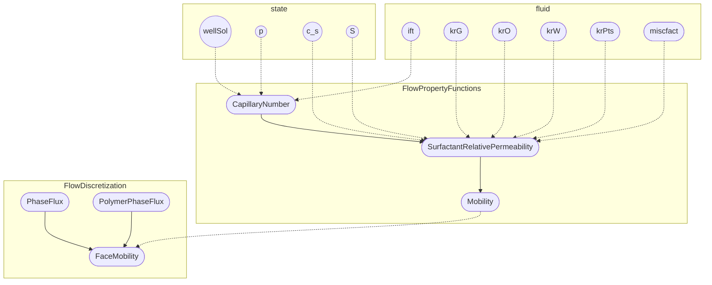

Figure 7.18 The dependency graph for the two state functions that compute relative permeabilities with alterations due to the presence of surfactant. The figure also shows how results are fed forward to routines computing interface fluxes. *Slanted text means that this part is inherited from the underlying black-oil model.*

saturations and performs the actual interpolation between the $k_{r\alpha}^{ns}$ and $k_{r\alpha}^s$ curves. Figure 7.18 shows their dependence graphs. The functions consist of many lines of code, which will not be discussed in detail.

Let us instead look at the ECLIPSE keywords you can use to specify the necessary input for the fluid object. The relative permeability curves (`krG`, `krO`, `krW`) and their endpoints (`krPts`) can be given using either of the two alternative keyword families (SWOF, SGOF) or (SWFN, SGFN, SOF3) [[5, 30]](references). Each keyword must specify two tables for each fluid region; the first gives curves for the immiscible system without surfactant and the second gives curves for the miscible system with maximum surfactant concentration (these will be associated to two different surfactant regions). The first family is discussed in detail in the MRST textbook [[22, section 11.3]](references).

The `SURFST` keyword gives input to `fluid.ift`, which describes the water–oil surface tension as a function of surfactant concentration in the water phase. The data are given as a two-column table, in the same form as described earlier for `PLYVISC` and `SHEARVISC`, with concentration values increasing monotonically downward. Last but not least, `fluid.miscfact` contains the surfactant capillary desaturation function, which takes values in the interval [0,1] and describes the transition from immiscible to miscible conditions as a function of $\log_{10}(N_c)$. (Notice that this represents a generalization of the linear relation $m(\log_{10} N_c)$ given in (7.30).) The corresponding keyword `SURFCAPD` should specify the same number of two-column tables with $\log_{10} N_c$ versus $m$ as the number of fluid regions.

[https://doi.org/10.1017/9781009019781](https://doi.org/10.1017/9781009019781) Published online by Cambridge University Press

*Chemical EOR Simulators with AD-OO and State Functions* <page_number>287</page_number>

## Capillary Pressure Alterations

When two phases coexist in a porous medium, interfacial tension and difference in wettability of the fluids on the rock surface will cause fluid interfaces to be curved and be accompanied by a finite pressure difference, referred to as capillary pressure (see, e.g., subsection 8.1.3 of the MRST textbook [22] for more details). This pressure is defined as the difference between the phase pressures of the nonwetting and wetting fluids, $p_c = p_n - p_w$, because $p_n > p_w$. For a given interfacial tension $\sigma$, the capillary pressure is also given by the Young–Laplace equation

$$ p_c = \sigma \left( \frac{1}{R_1} + \frac{1}{R_2} \right), \tag{7.33} $$

where $R_1$ and $R_2$ denote the principal radii of curvature for the interface.

In a three-phase black-oil model, the capillary pressures are defined for the oil–water and gas–oil subsystems,

$$ p_{cow} = p_o - p_w \quad \text{and} \quad p_{cog} = p_g - p_o. $$

The two capillary functions $p_{cow}$ and $p_{cog}$ are usually assumed to be functions of saturation. Because surfactant influences the interfacial tension between oil and water, it follows from (7.33) that it will also affect the capillary pressure. In our model, we assume a simple scaling relationship,

$$ p_{cow}(S_w, c_s) = p_{cow}(S_w) \frac{\sigma(c_s)}{\sigma_0}, \tag{7.34) $$

where $p_{cow}(S_w)$ and $\sigma_0$ denote oil–water capillary pressure and interfacial tension without surfactant, respectively.

**Implementation in MRST:** The evaluation of capillary pressures is implemented in a state function called `SurfactantCapillaryPressure` (Listing 7.4), which is built on top of the existing state function from the `ad-blackoil` module. This demonstrates one of the advantages of using state functions based on inheritance.

```
SURFST
-- Cs     Surf.tens
0         0.05
0.1       0.0005
0.5       1e-5
1         1e-6
30        1e-6
100       1e-6 /
```

The constructor simply says that this state function depends on surfactant concentration and whatever the underlying state function from `ad-blackoil` depends on.

The evaluation function first computes capillary pressures for the black-oil system, and if this system has a capillary function for a water–oil system (`ph=='W'`), we scale it by interfacial tension according to (7.34). Tabulated values for $\sigma(c_s)$ are usually given by the `SURFST` keyword [5, 30].

[https://doi.org/10.1017/9781009019781](https://doi.org/10.1017/9781009019781) Published online by Cambridge University Press

288 X. Sun, K.-A. Lie, and K. Bao

Listing 7.4 Member functions of *SurfactantCapillaryPressure*.

```matlab
function prop = SurfactantCapillaryPressure(model, varargin)
    prop@BlackOilCapillaryPressure(model, varargin{:});
    prop = prop.dependsOn('surfactant', 'state');
    assert(model.water && isfield(model.fluid,'ift'))
end

function pc = evaluateOnDomain(prop, model, state)
    pc = evaluateOnDomain@BlackOilCapillaryPressure(prop, model,state);
    ph = model.getPhaseNames(); iW = find(ph=='W');
    c = model.getProps(state, 'surfactant');
    pc{iW} = pc{iW}.*model.fluid.ift(c)/model.fluid.ift(0);
end
```

### Effective Viscosities

Addition of surfactant may increase the viscosity of the injected aqueous phase. As for a fully mixed polymer solution in (7.4), this is modeled by introducing a multiplier function, $\gamma_s(c_s)$,

$$ \mu_w(c_s) = \gamma_s(c_s)\mu_w^0. \tag{7.35} $$

Here, $\mu_w^0$ denotes the viscosity of pure water at reference pressure condition. Unlike polymers, however, the effect of surfactants on the viscosity of the aqueous phase is relatively minor and will in many cases be comparable to pressure effects in magnitude. Water viscosibility, the dependence of the viscosity with respect to pressure, is usually also introduced as a multiplier $\gamma(p)$,

$$ \mu_w(p) = \gamma(p)\mu_w^0. \tag{7.36} $$

If we now consider a system containing both polymer and surfactant and include all effects of polymer/surfactant concentration and pressure dependence, it follows from (7.6), (7.35), and (7.36) that the effective water viscosity becomes

$$ \mu_{w,\text{eff}} = \gamma(p) \gamma_w^{\text{eff}}(c_p) \gamma_s(c_s) \mu_w^0. \tag{7.37} $$

**Microscopic displacement efficiency:** In Figure 7.9, we saw that increasing the viscosity ratio between a polymer mixture and pure water will shift the fractional-flow curve of polymer to the right and increase the frontal saturation of the chemical wave. Exactly how much this increases the oil recovery will, of course, depend on the shape of the fractional-flow functions. The effects on secondary surfactant flooding are similar and are not included for brevity.

Let us instead look at the tertiary flooding case from Figure 7.17. Figure 7.19 shows fractional-flow curves and solution profile for a case with a fourfold increase

[https://doi.org/10.1017/9781009019781](https://doi.org/10.1017/9781009019781) Published online by Cambridge University Press

Chemical EOR Simulators with AD-OO and State Functions

289

<page_number>

289
</page_number>

<table>
  <tbody>
    <tr>
        <td>x</td>
        <td>Solid Blue</td>
        <td>Solid Orange</td>
        <td>Dashed Blue</td>
        <td>Dashed Orange</td>
    </tr>
    <tr>
        <td>0</td>
        <td>0</td>
        <td>0</td>
        <td>0</td>
        <td>0.1</td>
    </tr>
    <tr>
        <td>0.2</td>
        <td>0.02</td>
        <td>0.05</td>
        <td>0.1</td>
        <td>0.25</td>
    </tr>
    <tr>
        <td>0.4</td>
        <td>0.1</td>
        <td>0.15</td>
        <td>0.3</td>
        <td>0.45</td>
    </tr>
    <tr>
        <td>0.6</td>
        <td>0.8</td>
        <td>0.4</td>
        <td>0.9</td>
        <td>0.65</td>
    </tr>
    <tr>
        <td>0.8</td>
        <td>0.98</td>
        <td>0.85</td>
        <td>1</td>
        <td>0.9</td>
    </tr>
    <tr>
        <td>1</td>
        <td>1</td>
        <td>1</td>
        <td>1</td>
        <td>1</td>
    </tr>
  </tbody>
</table>
<table>
  <tbody>
    <tr>
        <td>x</td>
        <td>Value</td>
    </tr>
    <tr>
        <td>0</td>
        <td>0.92</td>
    </tr>
    <tr>
        <td>0.5</td>
        <td>0.85</td>
    </tr>
    <tr>
        <td>1</td>
        <td>0.82</td>
    </tr>
    <tr>
        <td>1.2</td>
        <td>0.52</td>
    </tr>
    <tr>
        <td>1.8</td>
        <td>0.52</td>
    </tr>
    <tr>
        <td>1.9</td>
        <td>0.7</td>
    </tr>
    <tr>
        <td>2.2</td>
        <td>0.7</td>
    </tr>
    <tr>
        <td>2.3</td>
        <td>0.7</td>
    </tr>
    <tr>
        <td>2.5</td>
        <td>0.7</td>
    </tr>
  </tbody>
</table>

Figure 7.19 Tertiary surfactant flooding for the case from Figure 7.17 but with a fourfold increase in the water viscosity as a result of surfactant and pressure effects. (Fractional-flow curve and solution with no viscosity increase are shown as thin lines.)

in the viscosity of the surfactant solution. Here, we observe the interesting effect that the increased viscosity not only improves the displacement efficiency behind the surfactant front but also significantly accelerates the oil wall and gives an earlier increase in the oil recovery.

**Implementation in MRST:** The surfactant multiplier $\gamma_s(c_s)$ is implemented as a state function in the same way as the polymer multiplier from Listing 7.1:

```matlab
function mSft = evaluateOnDomain(prop, model, state) % SurfactantViscMultiplier
   cs   = model.getProps(state, 'surfactant');
   mSft = prop.evaluateFluid(model, 'muWSft', cs) / model.fluid.muWr;
end
```

The combined evaluation of all terms in (7.37) is handled generically by the underlying state-function framework. For the special case of a polymer–surfactant model, this effectively amounts to first evaluating the standard black-oil viscosities that include any pressure dependencies, checking which chemical components are part of the model, computing the corresponding multipliers, and overwriting the viscosity for the water phase. The other viscosities as kept as for the black-oil model.

Figure 7.20 shows the dependence graph for all functions involved in the computation of effective viscosities for a two-phase surfactant–polymer system. The necessary functional relationships for the fluid object are easiest to give as tabulated data through an ECLIPSE input deck. The `PVTW` and `PVTO` keywords specify viscosities at reference conditions and curves for the dependence on pressure. These are part of the standard black-oil support in MRST and are discussed in the MRST textbook [[22, section 11.5]]([22, section 11.5]). The dependence on viscosity can be prescribed through the `SURFVISC` keywords; these data must be consistent with the input from `PVTW`. The specification and processing of `SURFVISC` follows the exact same pattern as `PLYVISC` discussed in Subsection 7.2.2.

[https://doi.org/10.1017/9781009019781](https://doi.org/10.1017/9781009019781) Published online by Cambridge University Press

290 X. Sun, K.-A. Lie, and K. Bao

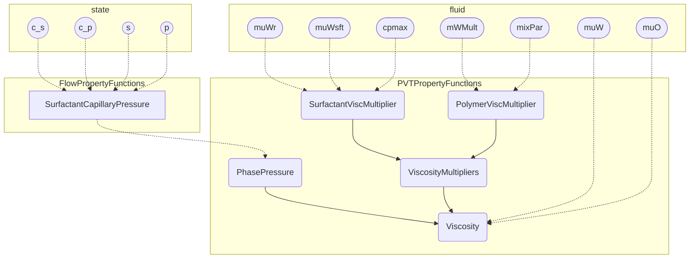

Figure 7.20 The dependency graph for the state functions implementing the viscosity relationship in (7.37) for a two-phase surfactant–polymer system. Dependencies on the fluid object are not usually included in the dependency graph generated by MRST. Slanted text indicates inherited entities.

### Surfactant Adsorption

We have already discussed how surfactant molecules tend to accumulate at the oil–water interface and rock surface as a result of the coexistence of specific hydrophilic and lipophilic groups (Figure 7.14), which has the beneficial effect of reducing the oil–water interfacial tension. However, adsorption on the rock surface also reduces the effective concentration of surfactant in the solution, resulting in loss of surfactant and decreased displacement efficiency. Both the modeling and the fractional-flow analysis are virtually identical to those of polymer and details are omitted for brevity. (The interested reader can use the scripts `showRiemannSolution` and `showSurfTertiary` to study the effects on secondary and tertiary displacements.)

## 7.3 The Surfactant–Polymer Flooding Simulator

So far, we have introduced different physical mechanisms that affect surfactant and polymer flooding, described pertinent mathematical models, and outlined their implementation as state (or utility) functions in the `ad-eor` module. In doing so, we have also mentioned relevant ECLIPSE keywords you can use to set all of the different parameters and functional relationships.

In this section, we explain how all of the different pieces outlined so far are put together to make classes in the AD-OO simulation framework (a first version was released in MRST 2019b). We will not present all details but focus on the main points. As always with MRST, you can find full details by querying the latest

[https://doi.org/10.1017/9781009019781](https://doi.org/10.1017/9781009019781) Published online by Cambridge University Press

Chemical EOR Simulators with AD-OO and State Functions 291

version of the ad-eor module. We end the section by explicitly describing the necessary steps to run simulations based on an ECLIPSE input deck.

## 7.3.1 Design of Flexible Model Classes

The ad-eor module offers different model classes that implement chemical flooding simulators. In a previous paper [4], we discussed the implementation of a fully implicit, three-phase polymer simulator. (This is built in the same way as the `ThreePhaseBlackOilModel` model from the original AD-OO framework discussed in chapter 12 of the MRST textbook [22].) More recently, we developed a similar model for surfactant–polymer flooding. The only conceptual difference is that various fluid properties, which in the polymer model were evaluated by functions held by the fluid object (see [4]), now are evaluated using state functions.

In this model, the evaluation of residual flow equations is essentially located to a single function, which makes it simpler to follow the logic of the computation. The disadvantage is that if you want to simulate, say, a two-phase oil–water–surfactant problem, you would either use the full model and always solve for five unknowns per cell or develop a specialized class (`OilWaterSurfactantModel`) that uses only three unknowns per cell. With three phases and five components, there will be many special cases, and if we later wish to expand the module by adding additional chemicals like alkali or solvents, we quickly end up with a combinatorial explosion of model classes.

Component (or generic) models, discussed in Chapter 5, were introduced to overcome this limitation. They offer finer granularity and eliminate the need for specialized classes for different combinations of phases and components. Instead, combinations can be specified at runtime to form models having only the necessary unknowns. The underlying framework is designed so that it is easy to specify alternative spatial or temporal discretizations; e.g., to replace the standard fully implicit formulation by an adaptive implicit method, replace the two-point flux approximation scheme by a multipoint discretization, or replace the single-point upwind mobility scheme by a high-resolution method; see Chapter 5.

## 7.3.2 The Full Three-Phase, Five-Component Model

We start by briefly describing the full model having three phases and all five components. The model is derived and inherits a lot of functionality from the `ThreePhaseBlackOilModel`. We therefore assume that you are already familiar

[https://doi.org/10.1017/9781009019781](https://doi.org/10.1017/9781009019781) Published online by Cambridge University Press

292 X. Sun, K.-A. Lie, and K. Bao

with this model and the underlying `ReservoirModel` and `PhysicalModel`; all three are described in great detail in chapter 12 of the MRST textbook [22]. The model has five properties that decide which components are active and what type of shear model to use, if any. These are set in the constructor based on an ECLIPSE-type input deck:

```matlab
classdef ThreePhaseSurfactantPolymerModel < ThreePhaseBlackOilModel
    properties
        polymer
        surfactant
        usingShear, usingShearLog, usingShearLogshrate
    end
end
```

**Variables and updating:** The model must define necessary variables: polymer and surfactant concentrations $c_p$ and $c_s$ are primary variables, whereas maximum concentrations $c_{p,\max}$ and $c_{s,\max}$ are used to calculate adsorption:

```matlab
function [fn, index] = getVariableField(model, name, varargin)
    switch(lower(name))
        case {'polymer', 'polymermax'}
            index = nnz(strcmpi(model.getComponentNames(), 'polymer'));
            if strcmpi(name, 'polymer')
                fn = 'cp';
            else fn = 'cpmax'; end
        :
        otherwise
            [fn, index] = getVariableField@ThreePhaseBlackOilModel...
                (model, name, varargin{:});
    end
end
```

Here, `fn` and `index` are the field name and column index that will extract the correct variable from the `state` struct. The last two lines access all variables defined in the black-oil model. The function also defines two extra variables, `qWPoly` and `qWSft`, for the surface rate of polymer and surfactant in and out of wells.

We also need to implement two update functions. The first, `updateState`, is run after each iteration step to update the reservoir state and check that it is within physical limits; that is, we let the underlying black-oil model check the states defined in this model and then check that $c_{p/s} \in [0, c_{p/s,\max}]$; see [4] for details. The second function, `updateAfterConvergence`, is almost identical and is run after the nonlinear equation has converged to track the maximum concentrations $c_{p/s,\max}$. The class also implements an enhanced `validateState` function, which checks that concentration variables are present in the state and have the correct dimensions.

[https://doi.org/10.1017/9781009019781](https://doi.org/10.1017/9781009019781) Published online by Cambridge University Press

Chemical EOR Simulators with AD-OO and State Functions 293

**State functions:** By and large, the member functions are straightforward extensions to those discussed in [[4]](https://doi.org/10.1017/9781009019781) and [[22, chapter 12]](https://doi.org/10.1017/9781009019781). The new part is how to incorporate the state functions for computing fluid properties described in Subsections 7.2.2 and 7.2.3. These are not created by the class constructor, because the properties of the model can change after the class is instantiated, but are instead instantiated at the start of the simulation by the `validateModel` function, which in turn calls the `setupStateFunctionGroupings` function. We go through some parts of this to give you the general idea. We start by calling upon the underlying black-oil model to create the necessary state-function groupings:

```matlab
function model = setupStateFunctionGroupings(model, varargin)

  model=setupStateFunctionGroupings@ThreePhaseBlackOilModel(model,varargin{:});

  fp = model.FlowPropertyFunctions;
  pp = model.PVTPropertyFunctions;
  fd = model.FlowDiscretization;

  pvtreg = pp.getRegionPVT(model);
  satreg = fp.getRegionSaturation(model);
  surfreg = fp.getRegionSurfactant(model);
```

The last three lines extract region identifiers that will be used to model spatial dependencies in PVT properties, capillary pressures, and relative permeabilities. Saturation and PVT regions are used as in a standard black-oil model from the `rock` struct stored by the model, if available. For relative permeabilities we use `satreg` to get the value of $k_{r\alpha}^{ns}(S_\alpha)$ and use `surfreg` to get the value of $k_{r\alpha}^s(S_\alpha)$, whereas `pvtreg` is used when computing the viscosities.

Let us start by state functions modeling adsorption. Provided that polymer is present, the corresponding function is added to the flow property group as follows (setup for surfactant adsorption is analogous):

```matlab
fp = fp.setStateFunction('PolymerAdsorption', PolymerAdsorption(model, satreg));
```

The state functions necessary to compute viscosities for the three physical phases are set up in the PVT property group:

```matlab
pp = pp.setStateFunction('Viscosity', EORViscosity(model, pvtreg));
pp = pp.setStateFunction('BaseViscosity', BlackOilViscosity(model));

viscmult = PhaseMultipliers(model);
viscmult.label = 'M_\mu';
```

[https://doi.org/10.1017/9781009019781](https://doi.org/10.1017/9781009019781) Published online by Cambridge University Press

294 *X. Sun, K.-A. Lie, and K. Bao*

The evaluation is done by the general class `EORViscosity`. The function first evaluates a base viscosity, which here is the standard, pressure-dependent viscosity from the black-oil model – i.e., $$\mu_{\alpha}(p) = \gamma(p)\mu_{\alpha}^{0}$$ – and then applies any multipliers defined by chemical effects in the EOR model. The `PhaseMultipliers` class is a simple container that collects state functions defining multipliers. These are added as follows, conditional on the presence of polymer and surfactant components:

```matlab
if model.polymer
      peffmult = 'PolymerEffViscMult';
      pp = pp.setStateFunction(peffmult, PolymerEffViscMult(model, pvtreg));
      viscmult = viscmult.addMultiplier(model, peffmult, 'W');
end
if model.surfactant
      smult = 'SurfactantViscMultiplier';
      pp = pp.setStateFunction(smult, SurfactantViscMultiplier(model, pvtreg));
      viscmult = viscmult.addMultiplier(model, smult, 'W');
end
pp = pp.setStateFunction('ViscosityMultipliers', viscmult);
```

Notice here the last argument to `addMultiplier`, which specifies that multipliers will only be applied to the water phase.

State functions for relative permeability, with reduced permeability as multiplier, and for the polymer pseudophase are defined in the much the same way. We must also set up state functions for evaluating interface fluxes for the polymer pseudophase:

```matlab
fd = fd.setStateFunction('PolymerPhaseFlux' , PolymerPhaseFlux(model));
fd = fd.setStateFunction('FaceConcentration', FaceConcentration(model));
```

**Residual equations:** With state functions set up, we can compute the discretized flow equations. This is done in `equationsThreePhaseSurfactantPolymer`, which follows the same general pattern as in [4, 22]. The function is admittedly complicated because of wells, source terms, boundary conditions, shear-thinning effects (see discussion in [4]), and the possibility of formulating reverse equations for computing adjoints. Going through all these details is outside the scope of this introductory chapter. Instead, we briefly explain how state functions and extended functionality from the new AD backends discussed in Chapter 6 are used to evaluated the basic flow equation for the polymer component.

We start by extracting the necessary physical variables, selecting and setting up primary unknowns as AD variables, and evaluating basic fluid properties:


<page_number>

294
</page_number>

[https://doi.org/10.1017/9781009019781](https://doi.org/10.1017/9781009019781) Published online by Cambridge University Press

Chemical EOR Simulators with AD-OO and State Functions

<page_number>295</page_number>

```matlab
[p, sW, sG, rs, rv, cp, cpmax] = model.getProps(state, ...
               'pressure', 'water', 'gas', 'rs', 'rv', 'polymer', 'polymermax');

[p, sW, x, cp] = model.AutoDiffBackend.initVariablesAD(p, sW, x, cp);

[b, pv]          = model.getProps(state, 'ShrinkageFactors', 'PoreVolume');
[phFlux, flags]  = model.getProps(state, 'PhaseFlux', 'PhaseUpwindFlag');
[pres, mob, rho] = model.getProps(state, 'PhasePressures', 'Mobility', 'Density');
vP               = model.getProps(state, 'PolymerPhaseFlux');
muWeffMult       = model.getProp(state, 'PolymerEffViscMult');
adsp             = model.getProp(state, 'PolymerAdsorption');
[bW, bO, bG]     = deal(b{:});
[vW, vO, vG]     = deal(phFlux{:});
                 :
```

For brevity, we have skipped code for selecting the primary variable x representing free or dissolved gas, code computing values at the previous time step (`adsp0`, `cp0`, `p0`, `sW0`), and so on. We then compute the accumulation and flux terms:

```matlab
plyAcc  = ((1-fluid.dps)/dt).*(pv.*bW.*sW.*cp - pv0.*fluid.bW(p0).*sW0.*cp0) ...
        + (s.pv/dt).*fluid.rhoR.*((1-poro)./poro).*(adsp - adsp0);
plyFlux = s.faceUpstr(upcw, bW).*vP;
```

These are collected along with similar terms from the other equations and passed on to the AD backend, which combines the accumulation and the divergence of the flux term as efficiently as possible:

```matlab
eqs    = {wAcc, oAcc, gAcc, plyAcc, sftAcc};
fluxes = {wFlux, oFlux, gFlux, plyFlux, sftFlux};

for i = 1:numel(fluxes)
    eqs{i} = s.AccDiv(eqs{i}, fluxes{i});
end
```

One word of caution at the end: During simulation, states with zero or almost zero water saturation and nonzero polymer/surfactant concentrations may lead to bad condition numbers for the corresponding Jacobian matrices. We therefore post-process the Jacobians and reinstate original values in cells with problematic values.

## 7.3.3 A Generic Surfactant–Polymer Model

So-called generic models offer a systematic and relatively simple approach to formulate multiphase, multicomponent systems. The basic idea is to build the system at runtime as a collection of components that each has a well-known PVT behavior.

[https://doi.org/10.1017/9781009019781](https://doi.org/10.1017/9781009019781) Published online by Cambridge University Press

296 X. Sun, K.-A. Lie, and K. Bao

<page_number>

296
</page_number>

Examples of such components are *immiscible components* that only exist in one phase that is made up entirely of the specific component; *oil or gas components* of the type found in black-oil models that can exist in all hydrocarbon phases; or *concentration components* that are transported in another phase without changing the mass and density of the phase but affecting other properties like viscosity. Each component type is implemented as a class that offers routines for computing phase composition, component density and mass, component mobility, etc.; see Chapter 5.

Surfactant and polymer models can generally contain components of all of these types. Water is an immiscible component, polymer and surfactants are concentration components, whereas oil is an "oil component" in a system with live oil or wet gas and an immiscible component in a dead-oil system without gas or with dry gas.

**Polymer/surfactant components:** The `ConcentrationComponent` neither implements the density (PVT behavior) of the carrying aqueous phase by itself nor implements how the component concentration affects the component mobility. To get the correct behavior, we must therefore implement two derived classes. Let us consider surfactant as an example; the class for polymer is almost identical but with the obvious modifications due to different flow physics. The class has no properties and the constructor only states that the surfactant is carried by the aqueous phase (which by convention is the first phase) and then registers functional dependencies:

```matlab
classdef SurfactantComponent < ConcentrationComponent
    properties
    end
    methods
        function c = SurfactantComponent()
            c@ConcentrationComponent('surfactant', 1);
            c = c.functionDependsOn('getComponentDensity', 'surfactant');
            c = c.functionDependsOn('getComponentDensity', 'ShrinkageFactors',...
                                    'PVTPropertyFunctions');
            :
        end
```

The component density (relative to the constant surface density of the aqueous phase) is given by the usual shrinkage factor times the surfactant density:

```matlab
function c = getComponentDensity(component, model, state, varargin)
    [cs, b] = model.getProps(state, 'surfactant', 'ShrinkageFactors');
    c       = cell(1, numel(b));
    c{1}    = cs.*b{1};
end
```

[https://doi.org/10.1017/9781009019781](https://doi.org/10.1017/9781009019781) Published online by Cambridge University Press

*Chemical EOR Simulators with AD-OO and State Functions* 297

<page_number>

297
</page_number>

Surfactant mass is found in two different forms: dissolved in the mobile aqueous phase and adsorbed in the rock:

```matlab
function c = getComponentMass(component, model, state, varargin)
    [cs, pv, b, sw, ads] = model.getProp(state, 'surfactant', 'PoreVolume', ...
                              'ShrinkageFactors', 'sW', 'SurfactantAdsorption');
    c          = cell(1, model.getNumberOfPhases);
    mobile     = sw.*cs.*b{1};
    poro       = model.rock.poro;
    adsorbed = model.fluid.rhoR .* ((1-poro)./poro) .* ads;
    c{1}       = pv.*(adsorbed + mobile);
end
```

Finally, the mobility of the surfactant component is the mobility of the water phase times the component density:

```matlab
function cmob = getComponentMobility(component, model, state, varargin)
    [mob, b, c] = model.getProps(state, 'Mobility', 'ShrinkageFactors', 'surfactant');
    cmob       = cell(1, model.getNumberOfPhases);
    cmob{1} = c.*b{1}.*mob{1};
end
```

Because the polymer component only flows with the polymer pseudophase, its mobility must be multiplied by $\gamma_{p}^{\text{eff}}(c_{p})/\gamma_{p}^{wp}(c_{p})$ – i.e., the ratio between the polymer effective viscosity multiplier and the polymer multiplier.

**The `GenericSurfactantPolymerModel` class:** Any generic model must be derived from the dummy class `ExtendedReservoirModel` to signify that it is generic. Here, we also derive the new class from `ThreePhaseSurfactantPolymerModel` so that we can inherit properties, the constructor, setup of state functions, and necessary update functions. As with state functions, the component functions are initiated during runtime by the `validateModel` member function and not by the constructor. The following is a slightly edited excerpt of this member function:

```matlab
if isempty(model.Components)
    nph = model.getNumberOfPhases();
    names = model.getPhaseNames();
    model.Components = cell(1, nph + model.polymer + model.surfactant);
    for ph = 1:nph
        switch names(ph)
            case 'W', c = ImmiscibleComponent('water', ph);
            case 'O'
                if disgas || vapoil, c = OilComponent('oil', ph, disgas, vapoil);
                else,                  c = ImmiscibleComponent('oil', ph); end
            :
    end
```

[https://doi.org/10.1017/9781009019781](https://doi.org/10.1017/9781009019781) Published online by Cambridge University Press

298 X. Sun, K.-A. Lie, and K. Bao

```matlab
        model.Components{ph} = c;
    end
    index = nph;
    if model.polymer
        index = index + 1;
        model.Components{index} = PolymerComponent();
    end
    :
end
model = validateModel@ThreePhaseSurfactantPolymerModel(model, varargin{:});
```

The function first loops through all phases present to construct the corresponding components. Then, we construct any concentration components. Finally, we call upon any underlying classes to perform additional validations, which in this case are carried out in the `ReservoirModel` and `PhysicalModel` classes.

The residual equations are evaluated by the `getModelEquations` function, which, in the case with no wells and boundary conditions, only consists of a few lines:

```matlab
function [eqs, names, types, state] = ...
         getModelEquations(model, state0, state, dt, drivingForces)
[eqs, flux, names, types] = ...
      model.FlowDiscretization.componentConservationEquations(model,state,state0,dt);
for i = 1:numel(eqs)
      eqs{i} = model.operators.AccDiv(eqs{i}, flux{i});
end
```

The first statement calls a member function of the flux-discretization group, which essentially loops through all phases and components to evaluate and accumulate the component phase masses and the component phase fluxes. These fluxes are in turn evaluated from the component mobilities of the type we just saw explained for the `SurfactantComponent` class.

Figure 7.21 shows the dependency between all state variables and the various state functions used to evaluate the component fluxes and masses. The diagram for fluxes includes 28 different state functions and eight different state variables. The diagrams are very complex, but if you look in detail, you will probably recognize many of the state functions we discussed in Subsections 7.2.2 and 7.2.3.

The point of including this figure, however, is not to discuss details in the dependencies but rather highlight the fine granularity of the generic implementation. This offers a lot of flexibility but also makes it more challenging to figure out exactly where in the code each model or formula is evaluated.

This ends our discussion of the general setup. If you want to learn more technical details about how to include wells and surface facilities or source terms and boundary conditions or how to account for non-Newtonian fluid effects, you must look in

[https://doi.org/10.1017/9781009019781](https://doi.org/10.1017/9781009019781) Published online by Cambridge University Press

Chemical EOR Simulators with AD-OO and State Functions

299

Dependency diagrams for the calculation of total component flux (top) and total component mass (bottom) for the generic surfactant–polymer model.

Figure 7.21 Dependency diagrams for the calculation of total component flux (top) and total component mass (bottom) for the generic surfactant–polymer model.

the code itself. It is admittedly complicated, but all of the necessary details are there. If you want to explore the code, your experience is that the powerful functionality for displaying state-function diagrams and groupings is an indispensable tool to quickly develop an understanding of how things are tied together.

## 7.3.4 Running the Simulator from an Input Deck

The first thing you need to do to run an EOR simulation with the ad-eor module is to load the necessary modules:

```
mrstModule add ad-core ad-blackoil ad-eor ad-props deckformat mrst-gui
```

The first three modules contain the necessary simulator classes, the next two supply routines for reading ECLIPSE input decks [30] and building fluid objects, and the last module contains useful plotting tools.

Here, we simply assume that you have made an appropriate input function according to the specifications in [30]. We have already discussed most of the

[https://doi.org/10.1017/9781009019781](https://doi.org/10.1017/9781009019781) Published online by Cambridge University Press

300 *X. Sun, K.-A. Lie, and K. Bao*

keywords necessary to specify polymer and surfactant behavior in Section 7.2. Likewise, section 11.5 of the MRST textbook [22] gives a brief and MRST-centric introduction to how you can specify properties of the underlying black-oil model. For a more comprehensive discussion of the input format, you should consult the documentation of ECLIPSE [30], the lecture notes of Pettersen [26], or the documentation of OPM Flow [5]; we recommend the latter two, because they are freely available online.

Given an input deck, you can use a function that was recently introduced in the AD-OO framework to read the deck and construct an initial state, a model, a simulation schedule, and a nonlinear solver class:

```matlab
fn = fullfile('path','to','datafile', 'filename');
[state0, model, schedule, nonlinear] = initEclipseProblemAD(fn);
```

The init function uses `selectModelFromDeck` to pick the appropriate model, and if you write a new model class, you must make sure that the logic of this latter function is able to select your model. Likewise, the init function uses `getNonlinearSolver` and `selectLinearSolverAD` to set up reasonable defaults for the nonlinear solver, the linear solver, and the timestep selector classes. You can find more details about this functionality in Chapter 6. (You can, of course, also perform the setup manually if you want more direct control.)

We can now simulate the model and plot the well responses (bottom-hole pressures, reservoir and surface rates, water cut, etc.):

```matlab
[wellSols, states, report] = ...
      simulateScheduleAD(state0, model, schedule, 'NonLinearSolver', nonlinear);
plotWellSols(wellSols,cumsum(schedule.step.val))
```

By default, the simulator will report progress by printout, but you can also use the `getPlotAfterStep` function to set up a graphical user interface that provides simple means for computational steering; see section 12.1 of the MRST textbook [22]. Chapter 6 describes more advanced functionality for setting up so-called packed simulation problems, which provide a means for automatic restarts of aborted simulations and storage and retrieval of simulation results from disk.

## 7.4 Numerical Examples

In this section, we go through a few examples to demonstrate how you can use the models and solvers from the `ad-eor` module to set up simulations. All examples come with complete source code and ECLIPSE input files, all found in the `book-ii` example directory of the `ad-eor` module. We have already discussed


<page_number>300</page_number>

[https://doi.org/10.1017/9781009019781](https://doi.org/10.1017/9781009019781) Published online by Cambridge University Press

Chemical EOR Simulators with AD-OO and State Functions <page_number>301</page_number>

how to run the ad-eor simulators from an input deck; hence, we will not discuss code details in the following.

However, before you continue, we would like to add a few words of caution. The examples presented in this section have been designed to highlight particular features of chemical flooding. In most of the examples, we have therefore modified fluid and reservoir parameters to visually highlight specific effects of polymer and surfactant on enhanced recovery or to demonstrate effects in the numerical solvers you should be aware of. In particular, we have scaled the concentration of chemical agents (compared to actual reservoir development parameters). When reading the examples, you should therefore look at trends and features and not focus on specific numbers such as fluid rates, pressure values, temporal and spatial scales, and so on. Likewise, parameters found in the input files should not be applied uncritically to model real-life scenarios.

## 7.4.1 Numerical Resolution of Trailing Waves

We have seen in previous sections that trailing waves in a displacement profile in many cases are a main cause of the EOR effect observed for polymer and surfactant flooding. (As an example, you can think of the $c$-waves in Figures 7.4 and 7.8.) To correctly predict potential improvements in microscopic and macroscopic displacement efficiency it is therefore important to resolve these waves as accurately as possible. This may prove quite challenging if the trailing wave is linear or weakly nonlinear, which means that the wave has no or very little self sharpening to counteract the strong numerical smearing seen in the standard first-order discretization methods used in reservoir simulation. Reducing this smearing is one of the main motivations for developing high-resolution schemes such as the weighted essentially nonoscillatory (WENO) schemes outlined briefly in Chapter 5 and higher-order discontinuous Galerkin methods discussed in Chapter 3.

**Conceptual analysis:** To illustrate this point, let us first look at a conceptual problem describing the transport of a scalar quantity $u \in [0,1]$ subject to a convex flux function $h(u)$, for which $h(0) = 0$ and $h(1) = 1$. A discontinuity $\hat{u}(x,t)$ with left state $u_L = 1$ and right state $u_R = 0$ will then propagate with constant unit speed. In Lagrangian coordinates (i.e., coordinates that follow the discontinuity), we can write the effective quasilinear equation as

$$ u_t + [h'(u) - 1]u_x = 0 $$ (7.38)

and let the stationary discontinuity $\hat{u}$ be centered at the origin, so that $\hat{u}(x,t)$ equals one for $x < 0$ and zero for $x > 0$. Consider now a smeared version $\tilde{u}(x,t)$ of the stationary solution $u(x,t)$. If we assume $h''(u) > 0$, there exists a $u^*$ such

[https://doi.org/10.1017/9781009019781](https://doi.org/10.1017/9781009019781) Published online by Cambridge University Press

302 X. Sun, K.-A. Lie, and K. Bao

Conceptual illustration of self-sharpening vs smearing for strongly and weakly nonlinear cases.

Figure 7.22 Conceptual illustration of the balance between self-sharpening and numerical smearing in the transport equation (7.38) for a stationary shock (dashed line). The circles denote constant $u$-values and the arrows indicate the effects that try to move these values in opposite directions.

that $h'(u) < 1$ for $u \in [0, u^*)$ and $h'(u) > 1$ for $u \in (u^*, 1]$. Using the method of characteristics, we then have that any value $\tilde{u}(x, t) < u^*$, found to the right of the discontinuity, will propagate leftward toward $x = 0$. Likewise, any value $\tilde{u}(x, t) > u^*$, found to the left of the discontinuity, will propagate rightward toward $x = 0$. As a result, the smeared profile will eventually sharpen up again into the stationary discontinuity $\hat{u}(x)$. This is what we refer to as *self-sharpening*; see Figure 7.22 for a conceptual illustration.

When simulating this transport with a finite-volume or finite-difference scheme, we effectively introduce some numerical smearing, so that instead of solving (7.38), we solve $u_t + [h'(u) - 1]u_x = \varepsilon u_{xx}$, where the magnitude of the diffusion coefficient $\varepsilon$ depends on the specific scheme, the grid resolution, and the timestep. The smearing can be thought of as a "force" that pushes the states $\tilde{u}(x, t) < u^*$ rightward and the states $\tilde{u}(x, t) > u^*$ leftward. To what degree the profile stays sharp or continues to be smeared out depends on the magnitude of $|h'(u) - 1|$ compared with the smearing. In other words, the more *nonlinear* $h(u)$ is, the less the discontinuous profile will be affected by numerical smearing. We also see that in the case of $h(u) = u$, which corresponds to a contact discontinuity, there is no self-sharpening to counteract the smearing, and in Lagrangian coordinates this discontinuity will effectively evolve according to a heat equation $u_t = \varepsilon u_{xx}$.

**1D polymer flooding:** Let us now use this insight to study the resolution of the polymer front in a 1D pure polymer flooding. For this, we use a setup consisting of a $50 \times 3 \times 3\text{ m}^3$ horizontal reservoir with permeability 100 md and porosity 0.2, discretized by a 1D grid. The reservoir is initially filled with oil and 20% connate water. We continuously inject a polymer solution with concentration $3.0\text{ kg/m}^3$ at a constant rate along the left edge and produce fluids at a constant rate from the right edge. We neglect all polymer effects except for viscosity enhancement and consider varying degrees of mixing, from fully mixed to no mixing. You can find the source

[https://doi.org/10.1017/9781009019781](https://doi.org/10.1017/9781009019781) Published online by Cambridge University Press

Chemical EOR Simulators with AD-OO and State Functions 303

<page_number>

303
</page_number>

Four line charts showing saturation ($S_w$) and concentration ($c_p$) profiles for different mixing parameters $\omega$ and grid resolutions $\Delta x$.

Figure 7.23 Polymer injection for various degrees of mixing, from no mixing ($\omega = 0$ in (7.6)) to full mixing ($\omega = 1$), simulated with two different grid resolutions. The fluid model only accounts for changes in effective viscosities resulting from the polymer.

code in the script `runPolyMixParam.m` and the setup in two ECLIPSE input files called `MixPar25.DATA` and `MixPar400.DATA`, in which 25 and 400 refer to the number of cells in the grid.

Figure 7.23 reports saturation and concentration profiles for a variety of mixing parameters $\omega$ in (7.6), simulated on the two different grids. The analytic solution consists of a leading $S$-shock, followed by a discontinuous $c$-wave and an $S$-rarefaction. On the coarsest grid, it is difficult to distinguish the $c$-wave from the trailing $S$-rarefaction in the saturation profile for values of $\omega$ close to one, because the concentration front is smeared out over large distances. A grid resolution of 16 m may be possible for onshore EOR applications, where well distances are not too large, but for offshore applications this would be considered a high-resolution grid. Even on the much finer grid (with $\Delta x = 1$ m), we see that the $c$-wave is smeared much more than the leading shock. You may recall from Subsection 7.2.2 that the $c$-wave is a contact discontinuity for the special case of $\omega = 1$. For $\omega < 1$, the polymer equation (7.7b) is replaced by

$$ \partial_t(Sc) + \partial_x[cm(c)f(S,c)] = 0, \tag{7.39} $$

which means that the contact discontinuity turns into a shock. Here, $cm(c) \leq c$ is a convex function of a form similar to $h(u)$ from our conceptual analysis. The function $cm(c)$ becomes more convex with decaying values of $\omega$. This increases

[https://doi.org/10.1017/9781009019781](https://doi.org/10.1017/9781009019781) Published online by Cambridge University Press

304 X. Sun, K.-A. Lie, and K. Bao

<table>
  <thead>
    <tr>
        <th colspan="10">Left Panel: Sw vs Distance (Δx = 16 m)</th>
    </tr>
    <tr>
        <th>Distance</th>
        <th>ω=1.000</th>
        <th>ω=0.975</th>
        <th>ω=0.950</th>
        <th>ω=0.925</th>
        <th>ω=0.900</th>
        <th>ω=0.850</th>
        <th>ω=0.800</th>
        <th>ω=0.600</th>
        <th>ω=0.000</th>
    </tr>
  </thead>
  <tbody>
    <tr>
        <td>0</td>
        <td>0.7</td>
        <td>0.7</td>
        <td>0.7</td>
        <td>0.7</td>
        <td>0.7</td>
        <td>0.7</td>
        <td>0.7</td>
        <td>0.7</td>
        <td>0.7</td>
    </tr>
    <tr>
        <td>100</td>
        <td>0.65</td>
        <td>0.65</td>
        <td>0.65</td>
        <td>0.65</td>
        <td>0.65</td>
        <td>0.65</td>
        <td>0.65</td>
        <td>0.65</td>
        <td>0.65</td>
    </tr>
    <tr>
        <td>200</td>
        <td>0.4</td>
        <td>0.4</td>
        <td>0.4</td>
        <td>0.4</td>
        <td>0.4</td>
        <td>0.4</td>
        <td>0.4</td>
        <td>0.4</td>
        <td>0.4</td>
    </tr>
    <tr>
        <td>300</td>
        <td>0.4</td>
        <td>0.4</td>
        <td>0.4</td>
        <td>0.4</td>
        <td>0.4</td>
        <td>0.4</td>
        <td>0.4</td>
        <td>0.4</td>
        <td>0.4</td>
    </tr>
    <tr>
        <td>400</td>
        <td>0.2</td>
        <td>0.2</td>
        <td>0.2</td>
        <td>0.2</td>
        <td>0.2</td>
        <td>0.2</td>
        <td>0.2</td>
        <td>0.2</td>
        <td>0.2</td>
    </tr>
    <tr>
        <th colspan="10">Right Panel: cp vs Distance</th>
    </tr>
    <tr>
        <th>Distance</th>
        <th>ω=1.000</th>
        <th>ω=0.975</th>
        <th>ω=0.950</th>
        <th>ω=0.925</th>
        <th>ω=0.900</th>
        <th>ω=0.850</th>
        <th>ω=0.800</th>
        <th>ω=0.600</th>
        <th>ω=0.000</th>
    </tr>
    <tr>
        <td>0</td>
        <td>3</td>
        <td>3</td>
        <td>3</td>
        <td>3</td>
        <td>3</td>
        <td>3</td>
        <td>3</td>
        <td>3</td>
        <td>3</td>
    </tr>
    <tr>
        <td>100</td>
        <td>3</td>
        <td>3</td>
        <td>3</td>
        <td>3</td>
        <td>3</td>
        <td>3</td>
        <td>3</td>
        <td>3</td>
        <td>3</td>
    </tr>
    <tr>
        <td>200</td>
        <td>0</td>
        <td>0</td>
        <td>0</td>
        <td>0</td>
        <td>0</td>
        <td>0</td>
        <td>0</td>
        <td>0</td>
        <td>0</td>
    </tr>
    <tr>
        <td>300</td>
        <td>0</td>
        <td>0</td>
        <td>0</td>
        <td>0</td>
        <td>0</td>
        <td>0</td>
        <td>0</td>
        <td>0</td>
        <td>0</td>
    </tr>
    <tr>
        <td>400</td>
        <td>0</td>
        <td>0</td>
        <td>0</td>
        <td>0</td>
        <td>0</td>
        <td>0</td>
        <td>0</td>
        <td>0</td>
        <td>0</td>
    </tr>
  </tbody>
</table>

Figure 7.24 Polymer injection for varying degrees of mixing, from no mixing ($\omega = 0$ in (7.6)) to full mixing ($\omega = 1$). In addition to changes in effective viscosities, we account for polymer adsorption and permeability reduction but not inaccessible pore volume.

the self-sharpening of the $c$-wave, and for $\omega \lesssim 0.6$, you can see that the $c$-wave is resolved approximately as accurately as the leading $S$-shock.

If the fluid model also accounts for polymer retention, the $c$-wave is no longer linear or weakly nonlinear, and the need for high grid resolution is not as imminent. In Figure 7.24, we have repeated the simulation from Figure 7.23 with the effects of adsorption and permeability reduction included on the coarsest grid. The degree of mixing still influences how accurately we resolve the trailing $c$-discontinuity, but the effect is not as evident as for the case without polymer retention.

**Improved discretizations:** To improve the resolution we will use the implicit, second-order WENO scheme developed in [[23, 24]](https://doi.org/10.1017/9781009019781), which is explained briefly in Chapter 5. Instead of computing fluxes from cell-averaged quantities, one uses a nonlinear procedure to reconstruct a piecewise linear approximation to the mobilities inside each cell and then uses reconstructed point values on opposite sides of each cell interface to evaluate the numerical fluxes.

To replace the standard single-point upwind (SPU) mobility scheme by a WENO scheme, we simply select a different set of state functions in the generic model class. These are set up by the helper function

```matlab
model = setWENODiscretization(model);
```

To further reduce numerical smearing, we can also use an adaptive-implicit temporal discretization [[37]](https://doi.org/10.1017/9781009019781), which uses an estimate of the Courant number to determine whether a mobility is evaluated explicitly or implicitly. AIM is set up as follows:

```matlab
model = setTimeDiscretization(model, 'aim', 'saturationCFL', 0.75);
```

The estimated Courant number is not necessarily accurate, and to be on the safe side we use a conservative limit of 0.75; this is to prevent the method from introducing

[https://doi.org/10.1017/9781009019781](https://doi.org/10.1017/9781009019781) Published online by Cambridge University Press

Chemical EOR Simulators with AD-OO and State Functions 305

<page_number>

305
</page_number>

<table>
  <thead>
    <tr>
        <th>Distance</th>
        <th>SPU: Δ x = 1 m</th>
        <th>SPU: Δ x = 8 m</th>
        <th>WENO: Δ x = 8 m</th>
        <th>WENO+AIM: Δ x = 8 m</th>
    </tr>
  </thead>
  <tbody>
    <tr>
        <td>0</td>
        <td>0.75</td>
        <td>0.75</td>
        <td>0.75</td>
        <td>0.75</td>
    </tr>
    <tr>
        <td>100</td>
        <td>0.70</td>
        <td>0.70</td>
        <td>0.70</td>
        <td>0.70</td>
    </tr>
    <tr>
        <td>200</td>
        <td>0.38</td>
        <td>0.45</td>
        <td>0.38</td>
        <td>0.38</td>
    </tr>
    <tr>
        <td>300</td>
        <td>0.38</td>
        <td>0.38</td>
        <td>0.38</td>
        <td>0.38</td>
    </tr>
    <tr>
        <td>400</td>
        <td>0.20</td>
        <td>0.20</td>
        <td>0.20</td>
        <td>0.20</td>
    </tr>
  </tbody>
</table>

Figure 7.25 Polymer injection with mixing coefficient $\omega = 0.85$ simulated on a fine grid and with the standard single-point upwind scheme and two high-resolution schemes on a coarser grid. (Source code: `runPolyMixHiRes.m`.)

explicit discretizations too aggressively, which would lead to instabilities in the form of spurious oscillations. Figure 7.25 shows how this improves resolution; with AIM and WENO, the trailing waves are resolved almost as accurately as on the fine grid.

## 7.4.2 Subset from SPE10: Conformance Improvement

We consider a subset of the 64th layer of Model 2 from the SPE10 benchmark [10]. Our reservoir is described by a uniform $50 \times 50 \times 1$ rectangular grid that covers an area of size $1\,000 \times 500 \times 2\text{ m}^3$. Initially, the reservoir has a uniform pressure equal 423 bar and is filled with 33% water and 67% oil that contains a lot of dissolved gas. We set a water injection well in the center of the model, operating at a fixed injection rate, and two production wells on the upper and lower sides, operating at a fixed bottom-hole pressure of 420 bar. All wells are shown as black dots in Figure 7.26. We consider two different injection scenarios: pure waterflooding and continuous polymer flooding. For the polymer, we include all effects outlined in Subsection 7.2.2: viscosity enhancement due to full mixing of polymer and water, adsorption, permeability reduction with $RRF = 1.3$, 5% inaccessible pore space, and shear-thinning polymer rheology. (The complete source code is found in the script `plyConformSPE10.m`.)

Here, we only review a few conspicuous points for the two scenarios. Figure 7.26 clearly shows how the injected water will finger rapidly through the high-permeability channel that connects the injector and the two producers. Adding polymer reduces the frontal saturation and retards the water front as observed in the fractional-flow analysis in Figure 7.4 but also improves flow conformance in terms of an improved areal sweep. This is also seen in the water cuts of the two producers and the cumulative oil production reported in Figure 7.27. However, this comes

[https://doi.org/10.1017/9781009019781](https://doi.org/10.1017/9781009019781) Published online by Cambridge University Press

306 X. Sun, K.-A. Lie, and K. Bao

Comparison of waterflooding and polymer flooding simulation results over time (21, 171, 411, and 591 days). Top row shows waterflooding; bottom row shows polymer flooding.

Figure 7.26 Comparison of waterflooding (top) and polymer flooding (bottom) in a fluvial reservoir. The brown background colors show the permeability on a logarithmic scale, with light colors signifying low permeabilities and dark colors signifying high permeabilities. Water saturation in flooded cells are shown using a blue-to-green color scale, and polymer concentration is shown in red.

at a cost: The increased viscosity of the diluted polymer causes a considerable reduction in injectivity despite its shear-thinning rheology, and to maintain the prescribed injection rate, the bottom-hole pressure of the injector must be increased significantly above the injection pressure used in the waterflooding scenarios. Notice also that the injection pressure continues to increase as the reservoir is filled with more water containing diluted polymer. Without the shear-thinning effect, the injection pressure would have to be increased another 10 bar or so.

### COMPUTER EXERCISES

To get more familiar with the simulator, we suggest a few exercises:

1. Run the simulations yourself and compare the number of iterations and the consumed CPU time. (Hint: look in the `reports` structures.)

2. Run a simulation to verify the difference in injection pressure with and without shear thinning effects. How much does this effect the overall displacement? (Hint: to turn off shear thinning, you can set `model.usingshear` to false.)

3. How is the displacement affected if the assumption of full mixing of water and diluted polymer is not correct? (Hint: you can control the degree of mixing using the $\omega$ parameter `model.fluid.mixPar`.)

[https://doi.org/10.1017/9781009019781](https://doi.org/10.1017/9781009019781) Published online by Cambridge University Press

Chemical EOR Simulators with AD-OO and State Functions 307

<table>
  <thead>
    <tr>
        <th colspan="5">Water cut in producers</th>
    </tr>
    <tr>
        <th>Time [Days]</th>
        <th>P1 (Water)</th>
        <th>P2 (Water)</th>
        <th>P1 (Polymer)</th>
        <th>P2 (Polymer)</th>
    </tr>
  </thead>
  <tbody>
    <tr>
        <td>0</td>
        <td>0</td>
        <td>0</td>
        <td>0</td>
        <td>0</td>
    </tr>
    <tr>
        <td>100</td>
        <td>0</td>
        <td>0</td>
        <td>0</td>
        <td>0</td>
    </tr>
    <tr>
        <td>200</td>
        <td>0.45</td>
        <td>0.15</td>
        <td>0.1</td>
        <td>0.05</td>
    </tr>
    <tr>
        <td>300</td>
        <td>0.75</td>
        <td>0.65</td>
        <td>0.5</td>
        <td>0.35</td>
    </tr>
    <tr>
        <td>400</td>
        <td>0.82</td>
        <td>0.85</td>
        <td>0.55</td>
        <td>0.58</td>
    </tr>
    <tr>
        <td>500</td>
        <td>0.88</td>
        <td>0.9</td>
        <td>0.62</td>
        <td>0.68</td>
    </tr>
  </tbody>
</table>
<table>
  <thead>
    <tr>
        <th colspan="5">Cumulative surface production of oil [m³]</th>
    </tr>
    <tr>
        <th>Time [Days]</th>
        <th>P1 (Water)</th>
        <th>P2 (Water)</th>
        <th>P1 (Polymer)</th>
        <th>P2 (Polymer)</th>
    </tr>
  </thead>
  <tbody>
    <tr>
        <td>0</td>
        <td>0</td>
        <td>0</td>
        <td>0</td>
        <td>0</td>
    </tr>
    <tr>
        <td>100</td>
        <td>1000</td>
        <td>1100</td>
        <td>1100</td>
        <td>1200</td>
    </tr>
    <tr>
        <td>200</td>
        <td>1800</td>
        <td>2000</td>
        <td>2100</td>
        <td>2300</td>
    </tr>
    <tr>
        <td>300</td>
        <td>2400</td>
        <td>2800</td>
        <td>3000</td>
        <td>3300</td>
    </tr>
    <tr>
        <td>400</td>
        <td>2800</td>
        <td>3500</td>
        <td>3800</td>
        <td>4200</td>
    </tr>
    <tr>
        <td>500</td>
        <td>3100</td>
        <td>4300</td>
        <td>4700</td>
        <td>5100</td>
    </tr>
  </tbody>
</table>
<table>
  <thead>
    <tr>
        <th colspan="5">Bottom-hole pressure in injector [barsa]</th>
    </tr>
    <tr>
        <th>Time [Days]</th>
        <th>Injector (water)</th>
        <th>Injector (polymer)</th>
        <th>Initial pressure</th>
        <th>Producer bhp</th>
    </tr>
  </thead>
  <tbody>
    <tr>
        <td>0</td>
        <td>422</td>
        <td>422</td>
        <td>422.5</td>
        <td>420</td>
    </tr>
    <tr>
        <td>100</td>
        <td>421.8</td>
        <td>428</td>
        <td>422.5</td>
        <td>420</td>
    </tr>
    <tr>
        <td>200</td>
        <td>422</td>
        <td>430</td>
        <td>422.5</td>
        <td>420</td>
    </tr>
    <tr>
        <td>300</td>
        <td>422</td>
        <td>432</td>
        <td>422.5</td>
        <td>420</td>
    </tr>
    <tr>
        <td>400</td>
        <td>421.8</td>
        <td>433</td>
        <td>422.5</td>
        <td>420</td>
    </tr>
    <tr>
        <td>500</td>
        <td>421.7</td>
        <td>434</td>
        <td>422.5</td>
        <td>420</td>
    </tr>
  </tbody>
</table>

Figure 7.27 Well responses for the simulations in Figure 7.26. The upper-left plot shows water cut in the two producers, the upper-right plot shows cumulative surface production of oil, and the lower plot shows bottom-hole pressure in the injector.

4. The pressure control on the two producers is set so high that the oil stays above the bubble point. Lower the bottom-hole pressure and see how this affects the production process.

5. Use tools from the `diagnostics` module to investigate how polymer injection affects the dynamic heterogeneity of the displacement; see section 13.2 of the MRST textbook [22].

### 7.4.3 The Dynamics of Slug Injection

In all examples so far, we have considered continuous injection of chemical agents as part of a secondary or tertiary recovery process. Polymers and surfactants are rarely used in this way. A usual setup is instead to start off recovering oil by natural

[https://doi.org/10.1017/9781009019781](https://doi.org/10.1017/9781009019781) Published online by Cambridge University Press

308 X. Sun, K.-A. Lie, and K. Bao

drive mechanisms (primary recovery), followed by injection of water to maintain pressure and push oil toward the producers (secondary recovery). In the tertiary recovery period, one first injects water containing surfactants to reduce interfacial tension between water and residual oil and to alter the wettability so that more oil can be recovered. Polymer is then injected for an extended period of time to provide mobility control for the mobilized oil bank. After a significant fraction of the sweep region has been flooded by chemicals, a pure water drive is set up to push the chemical slugs and the enhanced oil bank toward the producers.

In this example, we consider a conceptual 1D slug injection with an injector at the left and a producer at the right end. (Source code and ECLIPSE input files are found in the `book-ii/slug1D` folder of the `ad-eor` module.) Supporting fractional-flow analysis for such cases is discussed in chapters 7–9 of the textbook by Bedrikovetsky [6], and herein we only present results from numerical simulations. We consider two different EOR scenarios for our virtual recovery project, visualized to illustrate how the fluid distribution would be inside the reservoir, from injector I to producer P, if each slug represented a piston-type displacement:

Diagram showing two EOR strategies for 1D slug injection. Strategy 2 shows sequential slugs of water, polymer, and surfactant. Strategy 1 shows a single slug of surfactant + polymer. Both strategies are bounded by an injector (I) and a producer (P).

**Strategy 1:** Instead of injecting surfactant and polymer as two consecutive slugs, we first consider coinjection of a single slug. During the initial secondary-recovery period, the solution is a standard Buckley–Leverett profile, consisting of a shock followed by a rarefaction. Once chemical injection starts, we get a tertiary injection process. We have already presented and discussed the tertiary solution for a surfactant solution injected into a waterflooded reservoir in Figures 7.17 and 7.19. Adding polymer to the injection fluid does not fundamentally change the tertiary solution. There is still a significant oil bank, resulting from increased mobilization of residually trapped oil, that travels rightward as an *S*-shock that impinges on the trailing *S*-rarefaction from the secondary waterflooding. As this tertiary *S*-shock gradually eats away the trailing end of the *S*-rarefaction, its speed increases when the front saturation decreases, so that it (almost) overtakes the secondary *S*-shock by the time they reach the producer at the right end of the domain.

The leading tertiary *S*-wave (which with time also includes a weak rarefaction) is followed by two trailing *c*-waves associated with the eigenvalues $\xi^{c_s} = f / (S + a_s'(c_s))$ and $\xi^{c_p} = f / (S + a_p'(c_p))$, where $a_s$ and $a_p$ are the adsorption terms associated with surfactant and polymer, respectively; see Equation (7.14). If there

[https://doi.org/10.1017/9781009019781](https://doi.org/10.1017/9781009019781) Published online by Cambridge University Press

Chemical EOR Simulators with AD-OO and State Functions 309

<page_number>

309
</page_number>

is no adsorption or the adsorption terms are the same (i.e., $h_{LR}^s = h_{LR}^p$ in the notation of (7.17)), the eigenvalues coincide and the two $c$-waves collapse into a single $c$-wave, which is found as the upper envelope of the chemical fractional-flow curve. For the specific parameters of this example, the chemical curve is shifted so far to the right, compared with the pure-water curve, that the $c$-wave is a shock not followed by an $S$-rarefaction, as was the case in Figures 7.17 and 7.19.

In the general case, $\xi^{c_s} \neq \xi^{c_p}$, and this will cause so-called chromatographic separation between polymer and surfactant. You can see this from the difference in the yellow and magenta lines marked by "1" in the top plot of Figure 7.28, which represent the foot of the $c_p$- and $c_s$-waves, respectively. Inaccessible pore space will also influence the degree of separation, because water containing large molecules can only move through a smaller fraction of pore space than water containing surfactant, which implies that a polymer solution will move faster through a bulk volume than a surfactant solution. This separation is clearly evident in the second solution, sampled at time $\frac{2}{3}T$, after chemical injection has ceased. We also see that whereas the trailing edge of the polymer slug is a single rarefaction wave (points 2 to 3), the trailing edge of the surfactant splits into two rarefaction waves, a strong wave from points 2 to 3 and a weak wave from points 4 to 5.

**Strategy 2:** The recovery with the second, four-slug strategy (Figure 7.29) turns out to be less efficient. As intended, the surfactant slug reduces the interfacial tension between oil and water and reduces the endpoint saturations, but it does not provide sufficient mobility control to push a large amount of oil ahead of the chemical front (see the first solution sample). This happens first when we start injecting polymer in the second half of the chemical injection period (second and third solution samples). As a result, the bank of enhanced oil will consist of two parts and be composed of a number of subwaves that result from the interaction of the surfactant and polymer slugs. Altogether, this means that the production of oil mobilized by the surfactant is significantly delayed, and by the end of the project period, the highly resolved simulations show that the first strategy will have recovered 16.6% more oil. On the positive side, the second strategy requires significantly lower injection pressures.

The simulations presented thus far have been highly resolved. Typical lateral resolution in 3D models is on the order of tens of cells between injectors and producers, and in Figure 7.30 we have thus repeated the simulation of strategy 2 with 12, 25, 50, 100, and 200 cells. Consistent with the discussion in Subsection 7.4.1, the chemical slugs are smeared out to the point where the oil bank is hardly recognizable for the 12 cell simulation. Notice also how far the solution paths deviate from the high-resolution one in state space. Deviations in cumulative oil production nonetheless only range from 4.7% to 0.85%, because we stop the simulations long

[https://doi.org/10.1017/9781009019781](https://doi.org/10.1017/9781009019781) Published online by Cambridge University Press

310

X. Sun, K.-A. Lie, and K. Bao

Color plot of water saturation in the (x,t)-plane with tracked c-waves for surfactant and polymer.

Solution in physical space (left) and state space (right) at time 1.

Solution in physical space (left) and state space (right) at time 2.

Figure 7.28 Highly resolved numerical solutions for strategy 1 of the slug-injection experiment (5 000 grid cells, 5 000 timesteps). The upper plot shows a color plot of the water saturation in the ($x,t$)-plane. The colored lines track start and endpoints for the $c$-waves for surfactant (magenta) and polymer (orange). The two boxes below show the solution in physical space (left) and in state space (right) at two different times, indicated as dashed horizontal lines in the color plot. The tracked points are indicated by colored dots. For the plots in physical space, surfactant and polymer concentrations have been scaled to take values in the unit interval.

[https://doi.org/10.1017/9781009019781](https://doi.org/10.1017/9781009019781) Published online by Cambridge University Press

Chemical EOR Simulators with AD-OO and State Functions

311

<page_number>

311
</page_number>

Scientific plots showing solutions for strategy 2 of a slug-injection experiment in (x,t)-space, physical space, and state space.

Figure 7.29 Solutions for strategy 2 of the slug-injection experiment shown in ($x,t$)-space (top) and at three different times in physical space (left column) and in state space (right column). See Figure 7.28 for an explanation of the different plots.

[https://doi.org/10.1017/9781009019781](https://doi.org/10.1017/9781009019781) Published online by Cambridge University Press

312 X. Sun, K.-A. Lie, and K. Bao

Grid-refinement study plots showing s(x,t), cs(x,t), and cp(x,t) on the left and the same solutions in state space on the right.

Figure 7.30 Grid-refinement study with $n$ uniform cells for strategy 2; see Figure 7.29. The three coarsest simulations all used 100 timesteps, whereas the finest used 5 000. The left plots show $s(x,t)$, $c_s(x,t)$, and $c_p(x,t)$ for $t = 2T/3$. The right plot shows the same solutions in state space. (Source code: `slugGridRef.m`.)

before the oil bank has reached the producer and the self-sharpening shock of the secondary production profile is reasonably well resolved on a coarse grid.

**Improved discretizations:** For completeness, we also run scenario 2 with improved temporal and spatial discretizations. Figure 7.31 reports surfactant concentrations computed by the standard upwind method (SPU) and WENO, both with fully implicit (FIM) or AIM temporal discretization. In all simulations, we use 80 equally spaced timesteps. With 25 cells, the estimated Courant numbers vary from approximately 0.2 for the trailing waves to 2.75 for the leading saturation shock. As we have already noted, the smearing increases with decreasing Courant numbers for the explicit part of AIM but decreases for FIM. Hence, we only see a modest effect of replacing FIM by AIM. The effect of using WENO, on the other hand, is pronounced on all four grids. Typically, WENO gives at least as good resolution as SPU gives on a grid that is refined by a factor of 2.

When the number of cells is doubled to 50, Courant numbers for large parts of the trailing chemical waves fall in the range where AIM is effective and we thus observe significant improvements by switching time discretization for both SPU and WENO. On the 100-cell grid, the Courant number exceeds unity in the majority of the cells and the effect of AIM is negligible. With 200 cells, the WENO-FIM scheme breaks down (and produces a singular linearized system) when the Courant number increases well above 20 midway through the polymer injection period. However, if we halve the timestep during this time period, the simulation runs smoothly.

[https://doi.org/10.1017/9781009019781](https://doi.org/10.1017/9781009019781) Published online by Cambridge University Press

*Chemical EOR Simulators with AD-OO and State Functions* 313

<page_number>

313
</page_number>

<table>
  <thead>
    <tr>
        <th>Series</th>
        <th>n = 25</th>
        <th>n = 50</th>
        <th>n = 100</th>
        <th>n = 200</th>
    </tr>
  </thead>
  <tbody>
    <tr>
        <td>reference</td>
        <td>Present</td>
        <td>Present</td>
        <td>Present</td>
        <td>Present</td>
    </tr>
    <tr>
        <td>SPU-FIM</td>
        <td>Present</td>
        <td>Present</td>
        <td>Present</td>
        <td>Present</td>
    </tr>
    <tr>
        <td>SPU-AIM</td>
        <td>Present</td>
        <td>Present</td>
        <td>Present</td>
        <td>Present</td>
    </tr>
    <tr>
        <td>WENO-FIM</td>
        <td>Present</td>
        <td>Present</td>
        <td>Present</td>
        <td>Present</td>
    </tr>
    <tr>
        <td>WENO-AIM</td>
        <td>Present</td>
        <td>Present</td>
        <td>Present</td>
        <td>Present</td>
    </tr>
  </tbody>
</table>

Figure 7.31 Surfactant concentration computed with different spatial and temporal discretizations on a uniform grid with *n* cells, using 80 equally spaced timesteps. (Source code: `slugWENOAIM.m`.)

Altogether, this example demonstrates two important points: (i) AIM seems to be most effective when the Courant numbers of trailing waves straddle unity and (ii) the WENO discretization is not as robust as the SPU scheme and should not be used with very large Courant numbers. What is a large Courant number in this regard may depend on the complexity and nonlinearity of the system you are solving.

## 7.4.4 Validation against a Commercial Simulator

In the last example, we validate our SP simulator against the commercial simulator ECLIPSE [[30, 31]](https://doi.org/10.1017/9781009019781). To this end, we consider two models: a 2D vertical reservoir cross section with a single injector–producer pair and a small 3D sector model.

**Vertical cross section:** The setup is shown in Figure 7.32 and consists of a large 4 000 × 200 × 125 m<sup>3</sup> sandbox discretized on a uniform 20 × 1 × 5 Cartesian grid. Initially, the reservoir is at hydrostatic equilibrium and contains all three phases, with a mobile gas cap overlying the mobile oil. Hydrocarbons will be recovered from a producer perforated in the upper two cells in the rightmost column and operating at a constant bottom-hole pressure of 260 bar. The production is supported by an injector perforated in the bottom two cells of the leftmost column, which injects the displacing fluids at constant flow rate of 1 000 m<sup>3</sup>/day subject to a maximum pressure limit of 800 bar. (You find complete source code in `spValidation2D.m`.)

[https://doi.org/10.1017/9781009019781](https://doi.org/10.1017/9781009019781) Published online by Cambridge University Press

314 X. Sun, K.-A. Lie, and K. Bao

Heatmap of horizontal permeability in millidarcies (left) and initial fluid distribution (right) for a 2D validation case. The permeability map shows a grid with values ranging from 100 to 400 mD. The fluid distribution map shows gas (Sg), water (Sw), and oil (So) phases.

Figure 7.32 Setup of the 2D validation case with horizontal permeability in millidarcies to the left and initial fluid distribution to the right.

<table>
  <thead>
    <tr>
        <th>Scenario</th>
        <th>Time: 1.26 yrs</th>
        <th>Time: 3.45 yrs</th>
        <th>Time: 8.11 yrs</th>
        <th>Time: 19.1 yrs</th>
        <th>Time: 30 yrs</th>
    </tr>
  </thead>
  <tbody>
    <tr>
        <td>W flooding</td>
        <td>[image]</td>
        <td>[image]</td>
        <td>[image]</td>
        <td>[image]</td>
        <td>[image]</td>
    </tr>
    <tr>
        <td>P flooding</td>
        <td>[image]</td>
        <td>[image]</td>
        <td>[image]</td>
        <td>[image]</td>
        <td>[image]</td>
    </tr>
    <tr>
        <td>S flooding</td>
        <td>[image]</td>
        <td>[image]</td>
        <td>[image]</td>
        <td>[image]</td>
        <td>[image]</td>
    </tr>
    <tr>
        <td>SP flooding</td>
        <td>[image]</td>
        <td>[image]</td>
        <td>[image]</td>
        <td>[image]</td>
        <td>[image]</td>
    </tr>
  </tbody>
</table>

Figure 7.33 Evolution of the phase saturations over the whole simulation period for the 2D validation case. Columns show, from left to right, saturation midway through the water preflush, at the end of the preflush, after the chemical injection period, midway through the water postflush, and at the end of the simulation period. Black lines indicate wells, whereas colored lines outline the polymer/surfactant slugs, measured as $c > 0.05$.

The production is set up in three stages: First, 1 260 days of water preflush, and then, 1 700 days of chemical injection of polymer with a concentration of 2.0 kg/m<sup>3</sup>, surfactant with a concentration of 20 kg/m<sup>3</sup>, or a combination of both chemicals. This is followed by 8 000 days of chase water injection. For comparison, we also simulate pure waterflooding. Figure 7.33 reports computed fluid saturations and chemical concentrations throughout the four production scenarios. The water preflush is dominated by production from the gas cap, which is almost fully displaced by the time chemical injection starts (after 3.45 years). Injection of polymer contributes to push more oil toward the producer. If you compare the waterflooding and polymer flooding plots at 8.11 years, you can see that the oil saturation is slightly higher behind the leading water front and that the water saturation is slightly higher behind the trailing polymer front. The surfactant, on the other hand, has a very strong washing effect and reduces the residual water saturation from 0.2 to 0.06 but

[https://doi.org/10.1017/9781009019781](https://doi.org/10.1017/9781009019781) Published online by Cambridge University Press

Chemical EOR Simulators with AD-OO and State Functions

315

<page_number>

315
</page_number>

<table>
  <thead>
    <tr>
        <th>Time [years]</th>
        <th>Water</th>
        <th>Polymer</th>
        <th>Surfactant</th>
        <th>Surfactant+polymer</th>
    </tr>
  </thead>
  <tbody>
    <tr>
        <td>0</td>
        <td>300</td>
        <td>300</td>
        <td>300</td>
        <td>300</td>
    </tr>
    <tr>
        <td>5</td>
        <td>480</td>
        <td>600</td>
        <td>480</td>
        <td>600</td>
    </tr>
    <tr>
        <td>10</td>
        <td>550</td>
        <td>650</td>
        <td>550</td>
        <td>650</td>
    </tr>
    <tr>
        <td>15</td>
        <td>520</td>
        <td>580</td>
        <td>520</td>
        <td>580</td>
    </tr>
    <tr>
        <td>20</td>
        <td>500</td>
        <td>530</td>
        <td>480</td>
        <td>510</td>
    </tr>
    <tr>
        <td>25</td>
        <td>480</td>
        <td>510</td>
        <td>450</td>
        <td>480</td>
    </tr>
    <tr>
        <td>30</td>
        <td>470</td>
        <td>500</td>
        <td>430</td>
        <td>460</td>
    </tr>
  </tbody>
</table>
<table>
  <thead>
    <tr>
        <th>Time [years]</th>
        <th>Water</th>
        <th>Polymer</th>
        <th>Surfactant</th>
        <th>Surfactant+polymer</th>
    </tr>
  </thead>
  <tbody>
    <tr>
        <td>0</td>
        <td>50</td>
        <td>50</td>
        <td>50</td>
        <td>50</td>
    </tr>
    <tr>
        <td>5</td>
        <td>750</td>
        <td>750</td>
        <td>750</td>
        <td>750</td>
    </tr>
    <tr>
        <td>10</td>
        <td>200</td>
        <td>200</td>
        <td>250</td>
        <td>250</td>
    </tr>
    <tr>
        <td>15</td>
        <td>100</td>
        <td>100</td>
        <td>200</td>
        <td>200</td>
    </tr>
    <tr>
        <td>20</td>
        <td>50</td>
        <td>50</td>
        <td>120</td>
        <td>120</td>
    </tr>
    <tr>
        <td>25</td>
        <td>40</td>
        <td>40</td>
        <td>80</td>
        <td>80</td>
    </tr>
    <tr>
        <td>30</td>
        <td>30</td>
        <td>30</td>
        <td>50</td>
        <td>50</td>
    </tr>
  </tbody>
</table>

Figure 7.34 Bottom-hole pressure of the injector (left) and oil production rate (right) for the 2D cross-section validation case. Solid lines are simulated by MRST and dashed lines by ECLIPSE. The shaded regions represent the chemical injection period.

also introduces significant gravity segregation so that the displacing fluids move faster toward the producer along the bottom of the reservoir. Including polymer improves the conformance significantly and we end up with a trailing displacement front that is more vertical for SP flooding. (You can also notice a chromatographic separation between the two chemicals.)

Figure 7.34 reports bottom-hole pressures and oil production rates predicted by MRST and by ECLIPSE with the same input data. First of all, there is excellent agreement between the two simulators,<sup>3</sup> which validates our implementation. Let us also compare the four different production scenarios. By injecting polymer, we are able to maintain a slightly higher oil rate after water breakthrough around 8.6 years and up to approximately 25 years. Altogether, this enhances the oil and gas production by 4% and 2%, respectively. However, this comes at the cost of a significantly increased injection pressure in order to overcome the reduced injectivity caused by the more viscous injection fluid. The injector hits its pressure constraint after 7.3 years and is thus not fully able to maintain the prescribed injection rate for the full slug-injection period.

When solvent is injected, we see the opposite effect: Because solvent reduces the interfacial tension between oil and water, it not only mobilizes oil that would otherwise be residually trapped but also increases the mobility of both phases so that a lower injection pressure is sufficient to maintain the prescribed injection rate. This is particularly evident toward the end of the simulation. Altogether, solvent injection gives an enhanced oil and gas production of 14.1% and 7.9%, respectively.

<sup>3</sup> The match cannot generally be expected to be exact due to subtle differences in how the two simulators evaluate oil properties; ECLIPSE 100 interpolates $b_o$ and $b_o/\mu_o$ [30], whereas MRST interpolates $b_o$ and $\mu_o$.

[https://doi.org/10.1017/9781009019781](https://doi.org/10.1017/9781009019781) Published online by Cambridge University Press

316 X. Sun, K.-A. Lie, and K. Bao

Horizontal permeability scale in millidarcies

3D grid model showing horizontal permeability distribution with well locations PROD01, INJE01, and PROD02

3D grid model showing initial fluid distribution (gas, oil, water) with well locations

Figure 7.35 Setup of the 3D validation case with horizontal permeability in millidarcies to the left and initial fluid distribution to the right.

The full SP flooding contains features from both the polymer and the surfactant flooding. First of all, we see an even larger increase in the oil rate after water breakthrough, in particular in the period between years 10 and 18, as a result of the improved flow conformance. The highly viscous polymer solution still reduces injectivity, but the increased mobility caused by the surfactant will to a certain extent compensate for this, so that the pressure increase is less than for pure polymer flooding. The overall result is 10.6% increase in gas recovery and 18.9% increase in oil recovery after 30 years.

**Sector model:** Our second validation test is taken from [[4]](https://doi.org/10.1017/9781009019781) and is a $30 \times 20 \times 6$ corner-point grid with 2 778 active cells, in which the middle section contains four intersecting vertical faults. The reservoir is produced from two production wells, located on the left and right sides, respectively, each perforating the top layer. These are supported by an injection well at the center of the model that perforates the lower three grid layers. The reservoir contains all three phase fluids in the initial state, and they are all in hydrostatic equilibrium, as shown in Figure 7.35.

To produce the reservoir, we consider the same four types of injection strategies as in the 2D example. The injector is set up with constant injection rate of 2 500 m<sup>3</sup>/day and an upper pressure constraint of 290 bar, whereas the producers are set to operate at a constant bottom-hole pressure of 230 bar. The first water injection stage lasts for 560 days and then turns into a chemical injection with polymer solution concentration of 1 kg/m<sup>3</sup> and surfactant concentration of 30 kg/m<sup>3</sup>. After 400 days of continuous chemical injection, chase water is injected for another 2 430 days.

Figure 7.36 reports a comparison of well responses simulated by MRST and by ECLIPSE. As in the 2D example, there is excellent agreement for the water-flooding and polymer flooding cases. For cases with surfactant, there are some slight deviations in the bottom-hole pressures, which we believe come from the fact that ECLIPSE uses a kind of operator-splitting method in which the surfactant

[https://doi.org/10.1017/9781009019781](https://doi.org/10.1017/9781009019781) Published online by Cambridge University Press

Chemical EOR Simulators with AD-OO and State Functions

317

<table>
  <thead>
    <tr>
        <th>Time [days]</th>
        <th>Water</th>
        <th>Polymer</th>
        <th>Surfactant</th>
        <th>Surfactant+polymer</th>
    </tr>
  </thead>
  <tbody>
    <tr>
        <td>0</td>
        <td>284</td>
        <td>284</td>
        <td>284</td>
        <td>284</td>
    </tr>
    <tr>
        <td>500</td>
        <td>254</td>
        <td>254</td>
        <td>254</td>
        <td>254</td>
    </tr>
    <tr>
        <td>1000</td>
        <td>258</td>
        <td>290</td>
        <td>268</td>
        <td>287</td>
    </tr>
    <tr>
        <td>1500</td>
        <td>275</td>
        <td>275</td>
        <td>275</td>
        <td>275</td>
    </tr>
    <tr>
        <td>2000</td>
        <td>283</td>
        <td>288</td>
        <td>265</td>
        <td>287</td>
    </tr>
    <tr>
        <td>2500</td>
        <td>283</td>
        <td>287</td>
        <td>264</td>
        <td>285</td>
    </tr>
    <tr>
        <td>3000</td>
        <td>280</td>
        <td>284</td>
        <td>265</td>
        <td>282</td>
    </tr>
  </tbody>
</table>
<table>
  <thead>
    <tr>
        <th>Time [days]</th>
        <th>Water</th>
        <th>Polymer</th>
        <th>Surfactant</th>
        <th>Surfactant+polymer</th>
    </tr>
  </thead>
  <tbody>
    <tr>
        <td>0</td>
        <td>0</td>
        <td>0</td>
        <td>0</td>
        <td>0</td>
    </tr>
    <tr>
        <td>500</td>
        <td>0.4</td>
        <td>0.4</td>
        <td>0.4</td>
        <td>0.4</td>
    </tr>
    <tr>
        <td>1000</td>
        <td>1.1</td>
        <td>1.1</td>
        <td>1.1</td>
        <td>1.1</td>
    </tr>
    <tr>
        <td>1500</td>
        <td>1.8</td>
        <td>1.8</td>
        <td>1.8</td>
        <td>1.8</td>
    </tr>
    <tr>
        <td>2000</td>
        <td>2.4</td>
        <td>2.4</td>
        <td>2.5</td>
        <td>2.5</td>
    </tr>
    <tr>
        <td>2500</td>
        <td>2.7</td>
        <td>2.8</td>
        <td>3.0</td>
        <td>3.1</td>
    </tr>
    <tr>
        <td>3000</td>
        <td>2.9</td>
        <td>3.0</td>
        <td>3.2</td>
        <td>3.4</td>
    </tr>
    <tr>
        <td>3500</td>
        <td>3.0</td>
        <td>3.1</td>
        <td>3.3</td>
        <td>3.5</td>
    </tr>
    <tr>
        <td>4000</td>
        <td>3.1</td>
        <td>3.2</td>
        <td>3.4</td>
        <td>3.6</td>
    </tr>
    <tr>
        <td colspan="5">Simulator discrepancy: Water: -0.1%, Polymer: -0.1%, Surfactant: 1.0%, Surfactant+polymer: 0.5%</td>
    </tr>
  </tbody>
</table>

Figure 7.36 Bottom-hole pressure of the injector (left) and cumulative oil production (right) for the 3D cross-section validation case. Solid lines are simulated by MRST and dashed lines by ECLIPSE. The simulator discrepancy in oil production is measured as the difference between MRST and ECLIPSE, normalized by the MRST result.

concentrations are updated implicitly *after* the oil, gas, and water components have been computed [31]. However, the discrepancies in total oil production are nonetheless within 1% for all simulations.

Starting with the waterflooding scenario, we initially see a rapid decay in injection pressure because of gas production, followed by a gradual buildup of pressure until around water breakthrough to compensate for the increase resistance by the multiphase fluids. (The breakthrough appears as a gradual increase in water cut because the water front is very smeared out.) Once sufficient water communication is established between injector and producers, the prescribed injection rate can be maintained with a lower pressure and the injection pressure drops off. When polymer is injected, the pressure increases sharply because of poor injectivity and hits the upper constraint almost immediately, so that we cannot maintain the prescribed injection rate during the injection of the chemical slug. This reduces the efficiency of the polymer injection significantly so that all over oil recovery is only enhanced by 2%.

In the surfactant flooding, we notice that injection pressure decreases when surfactant is injected, as we already observed in the 2D case. More pronounced, however, is the sharp decay that takes place after approximately 1 600 days. Comparing the 3D plots of saturation in Figure 7.37, we see that a wide channel of high saturations has developed between the injector and the second producer for the surfactant flooding. This not only increases the water rate (and lowers the oil rate) but also explains the sharp decay in injection pressure as this water channel offers a path of less resistance to flow for the injected chase water. This effect is also evident in the combined surfactant–polymer flooding but is delayed and weakened because of the improved conformance introduced by the viscous

[https://doi.org/10.1017/9781009019781](https://doi.org/10.1017/9781009019781) Published online by Cambridge University Press

318 X. Sun, K.-A. Lie, and K. Bao

<table>
  <thead>
    <tr>
        <th>Time [days]</th>
        <th>Water</th>
        <th>Polymer</th>
        <th>Surfactant</th>
        <th>Surfactant+polymer</th>
    </tr>
  </thead>
  <tbody>
    <tr>
        <td>0</td>
        <td>0</td>
        <td>0</td>
        <td>0</td>
        <td>0</td>
    </tr>
    <tr>
        <td>500</td>
        <td>0</td>
        <td>0</td>
        <td>0</td>
        <td>0</td>
    </tr>
    <tr>
        <td>1000</td>
        <td>0</td>
        <td>0</td>
        <td>0</td>
        <td>0</td>
    </tr>
    <tr>
        <td>1500</td>
        <td>250</td>
        <td>250</td>
        <td>400</td>
        <td>300</td>
    </tr>
    <tr>
        <td>2000</td>
        <td>750</td>
        <td>750</td>
        <td>1100</td>
        <td>900</td>
    </tr>
    <tr>
        <td>2500</td>
        <td>1000</td>
        <td>1000</td>
        <td>1300</td>
        <td>1200</td>
    </tr>
    <tr>
        <td>3000</td>
        <td>1200</td>
        <td>1200</td>
        <td>1500</td>
        <td>1500</td>
    </tr>
  </tbody>
</table>

Figure 7.37 Water rates for the second producer (left plot). The plots to the right show phase saturations for surfactant flooding (top) and polymer flooding (bottom) in all cells where the water saturation exceeds 0.55. The plots are sampled after 1 695 days, when the water rate attains a local maximum for surfactant flooding.

polymer mixture. All over, the two surfactant cases enhance the oil recovery by 7.8% and 11.9%, respectively.

## 7.5 Directions and Suggestions for Future Improvements

This chapter has introduced you to the basic physiochemical mechanisms of EOR by polymer, surfactant, or surfactant–polymer flooding. We have also outlined how to model these processes by appropriate extensions of the standard black-oil equations and discussed our modular implementation, which has been set up so that you easily can utilize the many different discretizations, solvers, and solution algorithms the AD-OO framework of MRST offers.

Our main purpose of developing the `ad-eor` module of MRST is to provide a basic framework and flexible interface that we can build upon when developing novel models and simulation methods that do not exist in any other simulators. We are well aware that the AD-OO framework, with its modular state functions and generic simulator models, is complex and can be difficult to understand for new users. However, we hope that this chapter has made it more accessible and convinced you that it is a powerful tool you can leverage to quickly implement standard models for other well-known mechanisms or develop novel models and computational methods. We welcome and encourage you to participate in the continued research and construction of the `ad-eor` module and MRST in general.


<page_number>318</page_number>

[https://doi.org/10.1017/9781009019781](https://doi.org/10.1017/9781009019781) Published online by Cambridge University Press

Chemical EOR Simulators with AD-OO and State Functions <page_number>319</page_number>

In its current form, the `ad-eor` module of MRST only implements the most rudimentary models for three specific enhanced recovery schemes. Many other chemical and biological agents have been applied for EOR purposes, and researchers have discovered and studied many mechanisms that have yet to be implemented in MRST. We end the chapter by providing a brief overview of mechanisms that have yet to be included in the public version of the `ad-eor` module.

**Temperature effects:** Temperature affects the properties of both polymers and surfactants. Viscosity, for instance, is usually deeply affected by temperature. Excessively high temperature may even destroy the structure of the polymer and irreversibly reduce the viscosity of the polymer solution. [9, 21, 39]. Temperature also changes the adsorption characteristics of the surfactant at the solid–liquid interface and at the oil–water interface [7, 18], and further affects chemicals’ ability to enhance the recovery factor. Therefore, the role of temperature should be emphasized in the case of large temperature changes in the formation.

**Mechanical effects:** During polymer injection, when the flow rate is high, the polymer not only undergoes the shear-thinning behavior described in this chapter but mechanical degradation may also occur. This phenomenon is generally considered to be an irreversible behavior caused by the breaking of polymer molecular chains [3]. Mechanical degradation can significantly reduce the viscosity of the displacing agent and thus reduce its EOR effect. Accounting for this mechanism is important so that correct design decisions can be made; e.g., by preshearing the polymer mixture according to simulation results before injection to maximize its effectiveness [32].

**Wettability alteration:** Interfacial phenomena are common in reservoirs where multiphase fluids coexist. Wettability is one of the key parameters to accurately describe the interface phenomenon and plays an important role in surfactant flooding and spontaneous imbibition [43] in fractured reservoirs. In addition, the application of nanomaterials in EOR is attracting more attention. The mechanism of wettability alteration caused by the adsorption of nanomaterials on solid surfaces [42] also needs to be further explored and accurately simulated.

**Salinity effects:** Like temperature, changes in salt ion type and concentration also affect the properties of polymers and surfactants [40]. For polymers, the viscosity-increasing effect changes with different salt ion concentration; usually the viscosity decreases, but a few special polymers have salt-sensitive self-thickening effects [41]. For surfactants, the presence of salt ions not only impacts the reduction in

[https://doi.org/10.1017/9781009019781](https://doi.org/10.1017/9781009019781) Published online by Cambridge University Press

320 X. Sun, K.-A. Lie, and K. Bao

interfacial tension and the wettability alteration but also plays an important role in the phase behavior and properties of microemulsion.

In the most basic model [31], polymer solution, reservoir brine, and injected water all form pseudophases within the aqueous phase, and the evolution of salt concentration is described with a similar flow equation as for polymer concentration, with an effective water viscosity described using Todd–Longstaff mixing to account for physical dispersion at the front and fingering effects at trailing edges but without adsorption and dead pore space. This model should thus be relatively straightforward to include in the existing `ad-eor` module.

**Microemulsions:** When the surfactant concentration is greater than the critical micelle concentration, the surfactant will spontaneously aggregate and form micelles. The presence of micelles will cause a part of oil and water to mix thermodynamically and stably, thus forming a new phase state, called the microemulsion phase [1]. The appearance of new phase states will change the original oil–water phase properties (such as density, viscosity, etc.) and will also change the properties between phase states (such as interfacial tension, relative permeability, capillary force, etc.) [12, 25]. Therefore, accurate description and simulation of the microemulsion phase are very important in the simulation of surfactant flooding with medium–high concentrations.

**Alkali flooding:** In this EOR technique, one injects alkaline chemicals, such as sodium carbonate, that react with acidic oil components to create natural surfactants such as petroleum sulfonate inside the reservoir. Like the water-soluble synthetic surfactant discussed earlier in this chapter, the resulting petroleum sulfonate will mobilize more oil and thus increase the microscopic displacement efficiency by reducing interfacial tension, changing the rock surface wettability, and emulsifying the oil into the injected water. Alkaline chemicals can also have an adverse effect, by reacting with the calcium ions to produce scale and precipitation that may damage the formation. It is thus not suitable for reservoirs with high divalent ion concentration formation water.

Tertiary ASP flooding [35] combines polymer injection with two sources of surfactants, water-soluble synthetic surfactant and alkaline chemicals that form surfactants in situ and contribute to reduce surfactant adsorption. This lowers the required concentration of the synthetic surfactant and makes the injection more sustainable and less detrimental to long-term production. As in SP flooding, the surfactant and polymer can be co-injected, but polymer is often injected as a post-slug to mobilize the oil freed from the rock by the surfactant and provide general mobility control to the flood fronts. In the most basic model [31], the flow equation for the alkali concentration has the same form as for polymer but without the effects of


<page_number>

320
</page_number>

[https://doi.org/10.1017/9781009019781](https://doi.org/10.1017/9781009019781) Published online by Cambridge University Press

Chemical EOR Simulators with AD-OO and State Functions 321

dead pore space and permeability reduction. This model should thus be relatively straightforward to include in the existing `ad-eor` module.

**Compositional effects:** To study the action mechanism of various chemical agents in more detail, it may be necessary to study crude oil components separately. Likewise, chemical agents can also be used alongside of gases, such as carbon dioxide, nitrogen, oil field associated gas, etc. In all of these cases, compositional EOR models are necessary to simulate the interaction between each components and the resulting changes in fluid properties [13, 28]. For more details on compositional simulation, we refer to Chapter 8.

*Acknowledgement.* We thank Olav Møyner and Xavier Raynaud for useful discussions and comments on the chapter and invaluable help with the implementation of the `ad-eor` module.

# References

[1] S. Abbott. *Surfactant Science: Principles and Practice*, volume 1. 2016. URL [www.stevenabbott.co.uk/practical-surfactants/the-book.php](www.stevenabbott.co.uk/practical-surfactants/the-book.php)

[2] S. M. Ali and S. Thomas. The promise and problems of enhanced oil recovery methods. *Journal of Canadian Petroleum Technology*, 35(7), 57–63, 1996. doi: 10.2118/96-07-07.

[3] B. Al-Shakry, T. Skauge, B. Shaker Shiran, and A. Skauge. Impact of mechanical degradation on polymer injectivity in porous media. *Polymers*, 10(7):742, 2018. doi: 10.3390/polym10070742.

[4] K. Bao, K.-A. Lie, O. Møyner, and M. Liu. Fully implicit simulation of polymer flooding with MRST. *Computational Geosciences*, 21(5–6):1219–1244, 2017. doi: 10.1007/s10596-017-9624-5.

[5] D. Baxendale, K. Bao, M. Blatt, et al. *Open Porous Media: Flow Documentation Manual*, 2019–10 Rev-1 edition, 2019. URL [http://opm-project.org](http://opm-project.org)

[6] P. Bedrikovetsky. *Mathematical Theory of Oil and Gas Recovery: With Applications to Ex-USSR Oil and Gas Fields*, volume 4 of *Petroleum Engineering and Development Studies*. Kluwer Academic Publishers, Dordrecht, the Netherlands 1993.

[7] A. F. Belhaj, K. A. Elraies, S. M. Mahmood, N. N. Zulkifli, S. Akbari, and O. S. Hussien. The effect of surfactant concentration, salinity, temperature, and ph on surfactant adsorption for chemical enhanced oil recovery: a review. *Journal of Petroleum Exploration and Production Technology*, 10(1):125–137, 2020. doi: 10.1007/s13202-019-0685-y.

[8] G. Cheraghian, S. S. K. Nezhad, M. Kamari, M. Hemmati, M. Masihi, and S. Bazgir. Adsorption polymer on reservoir rock and role of the nanoparticles, clay and SiO<sub>2</sub>. *International Nano Letters*, 4(3):114, 2014. doi: 10.1007/s40089-014-0114-7.

[9] B. Choi, M. S. Jeong, and K. S. Lee. Temperature-dependent viscosity model of HPAM polymer through high-temperature reservoirs. *Polymer Degradation and Stability*, 110:225–231, 2014. doi: 10.1016/j.polymdegradstab.2014.09.006.

[10] M. A. Christie and M. J. Blunt. Tenth SPE comparative solution project: A comparison of upscaling techniques. *SPE Reservoir Evaluation & Engineering*, 4:308–

[https://doi.org/10.1017/9781009019781](https://doi.org/10.1017/9781009019781) Published online by Cambridge University Press

322 X. Sun, K.-A. Lie, and K. Bao

317, 2001. doi: 10.2118/72469-PA. URL [www.spe.org/web/csp/datasets/set02.htm](www.spe.org/web/csp/datasets/set02.htm).

[11] C. Dai and F. Zhao. *Oilfield Chemistry*. Springer, Singapore, 2019. doi: 10.1007/978-981-13-2950-0.

[12] M. Delshad, G. A. Pope, and K. Sepehrnoori. A compositional simulator for modeling surfactant enhanced aquifer remediation, 1 formulation. *Journal of Contaminant Hydrology*, 23(4):303–327, 1996. doi: 10.1016/0169-7722(95)00106-9.

[13] C. Han, M. Delshad, K. Sepehrnoori, and G. A. Pope. A fully implicit, parallel, compositional chemical flooding simulator. In *SPE Annual Technical Conference and Exhibition, 9–12 October, Dallas, Texas*. Society of Petroleum Engineers, 2005. doi: 10.2118/97217-MS.

[14] S. T. Hilden, H. M. Nilsen, and X. Raynaud. Study of the well-posedness of models for the inaccessible pore volume in polymer flooding. *Transport in Porous Media*, 114(1):65–86, 2016. doi: 10.1007/s11242-016-0725-8.

[15] E. L. Isaacson. Global solution of a Riemann problem for a non-strictly hyperbolic system of conservation laws arising in enhanced oil recovery. Unpublished. Technical report issued by the Enhanced Oil Recovery Institute, University of Wyoming. 1989.

[16] T. Johansen and R. Winther. The solution of the Riemann problem for a hyperbolic system of conservation laws modeling polymer flooding. *SIAM Journal on Mathematical Analysis*, 19(3):541–566, 1988. doi: 10.1137/0519039.

[17] T. Johansen and R. Winther. The Riemann problem for multicomponent polymer flooding. *SIAM Journal on Mathematical Analysis*, 20(4):908–929, 1989. doi: 10.1137/0520061.

[18] W. Karnanda, M. S. Benzagouta, A. AlQuraishi, and M. M. Amro. Effect of temperature, pressure, salinity, and surfactant concentration on IFT for surfactant flooding optimization. *Arabian Journal of Geosciences*, 6(9):3535–3544, 2013. doi: 10.1007/s12517-012-0605-7.

[19] M. Khatibi, N. Potokin, and R. W. Time. Experimental investigation of effect of salts on rheological properties of non-Newtonian fluids. *Transactions of the Nordic Rheology Society*, 24:117–126, 2016.

[20] L. W. Lake. *Enhanced Oil Recovery*. Prentice Hall, Old Tappan, NJ, 1989.

[21] E. A. Lange and C. Huh. A polymer thermal decomposition model and its application in chemical EOR process simulation. In *SPE/DOE Improved Oil Recovery Symposium*. Society of Petroleum Engineers, 1994. doi: 10.2118/27822-MS.

[22] K.-A. Lie. *An Introduction to Reservoir Simulation Using MATLAB/GNU Octave: User Guide for the MATLAB Reservoir Simulation Toolbox (MRST)*. Cambridge University Press, Cambridge, UK, 2019. doi: 10.1017/9781108591416.

[23] K.-A. Lie, T. S. Mykkeltvedt, and O. Møyner. A fully implicit WENO scheme on stratigraphic and unstructured polyhedral grids. *Computational Geosciences*, (24):405–423, 2020. doi: 10.1007/s10596-019-9829-x.

[24] T. S. Mykkeltvedt, X. Raynaud, and K.-A. Lie. Fully implicit higher-order schemes applied to polymer flooding. *Computational Geosciences*, 21(5–6):1245–1266, 2017. doi: 10.1007/s10596-017-9676-6.

[25] L. Patacchini, R. De Loubens, A. Moncorge, and A. Trouillaud. Four-fluid-phase, fully implicit simulation of surfactant flooding. *SPE Reservoir Evaluation & Engineering*, 17(2):271–285, 2014. doi: 10.2118/161630-PA.

[26] Ø. Pettersen. Basics of reservoir simulation with the eclipse reservoir simulator. Lecture notes, Department of Mathematics, University of Bergen, 2006. URL www.mj-oystein.no/index_htm_files/ResSimNotes.pdf

[https://doi.org/10.1017/9781009019781](https://doi.org/10.1017/9781009019781) Published online by Cambridge University Press

Chemical EOR Simulators with AD-OO and State Functions <page_number>323</page_number>

[27] G. A. Pope. The application of fractional flow theory to enhanced oil recovery. *Society of Petroleum Engineers Journal*, 20(3):191–205, 1980. doi: 10.2118/7660-PA.

[28] G. A. Pope and R. C. Nelson. A chemical flooding compositional simulator. *Society of Petroleum Engineers Journal*, 18(5):339–354, 1978. doi: 10.2118/6725-PA.

[29] W. Pu, F. Jiang, B. Wei, Y. Tang, and Y. He. Influences of structure and multi-intermolecular forces on rheological and oil displacement properties of polymer solutions in the presence of Ca<sup>2+</sup>/Mg<sup>2+</sup>. *RSC Advances*, 7(8):4430–4436, 2017. doi: 10.1039/C6RA25132C.

[30] Schlumberger. *ECLIPSE: Reference Manual*. Schlumberger, 2014.1 edition, 2014.

[31] Schlumberger. *ECLIPSE: Technical Description*. Schlumberger, 2014.1 edition, 2014.

[32] R. S. Seright, J. M. Maerker, and G. Holzwarth. Mechanical degradation of polyacrylamides induced by flow through porous-media. In *Abstracts of Papers of the American Chemical Society*, volume 182, pp. 17. American Chemical Society, Washington, DC, 1981.

[33] J. J. Sheng. *Modern Chemical Enhanced Oil Recovery: Theory and Practice*. Gulf Professional Publishing, Boston, 2010. doi: 10.1016/C2009-0-20241-8.

[34] J. J. Sheng. *Enhanced Oil Recovery Field Case Studies*. Gulf Professional Publishing, Boston, 2013. doi: 10.1016/C2010-0-67974-0.

[35] J. J. Sheng. A comprehensive review of alkaline–surfactant–polymer (ASP) flooding. *Asia-Pacific Journal of Chemical Engineering*, 9(4):471–489, 2014. doi: 10.1002/apj.1824.

[36] K. S. Sorbie. *Polymer-Improved Oil Recovery*. Springer Science+Business Media, New York, 2013. doi: 10.1007/978-94-011-3044-8.

[37] G. W. Thomas and D. H. Thurnau. Reservoir simulation using an adaptive implicit method. *Society of Petroleum Engineers Journal*, 23(5):759–768, 1983. doi: 10.2118/10120-PA.

[38] M. R. Todd and W. J. Longstaff. The development, testing, and application of a numerical simulator for predicting miscible flood performance. *Journal of Petroleum Technology*, 24(7):874–882, 1972. doi: 10.2118/3484-PA.

[39] E. Vermolen, M. J. Van Haasterecht, S. K. Masalmeh, M. J. Faber, D. M. Boersma, and M. A. Gruenenfelder. Pushing the envelope for polymer flooding towards high-temperature and high-salinity reservoirs with polyacrylamide based ter-polymers. In *SPE Middle East Oil and Gas Show and Conference*. Society of Petroleum Engineers, 2011. doi: 10.2118/141497-MS.

[40] Z. Wu, T. Cheng, J. Yu, and H. Yang. Effect of viscosity and interfacial tension of surfactant–polymer flooding on oil recovery in high-temperature and high-salinity reservoirs. *Journal of Petroleum Exploration and Production Technology*, 4(1):9–16, 2014. doi: 10.1007/s13202-013-0078-6.

[41] Q. You, K. Wang, Y. Tang, G. Zhao, Y. Liu, M. Zhao, Y. Li, and C. Dai. Study of a novel self-thickening polymer for improved oil recovery. *Industrial & Engineering Chemistry Research*, 54(40):9667–9674, 2015. doi: 10.1021/acs.iecr.5b01675.

[42] H. Zhang, A. Nikolov, and D. Wasan. Enhanced oil recovery (EOR) using nanoparticle dispersions: underlying mechanism and imbibition experiments. *Energy & Fuels*, 28(5):3002–3009, 2014. doi: 10.1021/ef500272r.

[43] X. Zhou, N. R. Morrow, and S. Ma. Interrelationship of wettability, initial water saturation, aging time, and oil recovery by spontaneous imbibition and waterflooding. In *SPE/DOE Improved Oil Recovery Symposium*. Society of Petroleum Engineers, 1996. doi: 10.2118/35436-MS.

[https://doi.org/10.1017/9781009019781](https://doi.org/10.1017/9781009019781) Published online by Cambridge University Press

# 8

# Compositional Simulation with the AD-OO Framework

OLAV MØYNER

## Abstract

The compositional module in the MATLAB Reservoir Simulation Toolbox (MRST) implements two different formulations of a three-phase compositional system that consists of a pair of multicomponent phases and an optional immiscible phase. In petroleum engineering, the aqueous phase is taken to be immiscible and the hydrocarbon liquid and vapor phases are governed by an equation of state (EoS). The overall composition formulation uses pressure and overall mole fractions as primary variables, whereas the natural variable formulation relies on solving for phase mole fractions and phase saturations simultaneously. Thermodynamic behavior is modeled using *K*-values or a (standard) cubic EoS. In the chapter, you will learn about the model equations, choice of primary variables, and numerical strategies for solving the thermodynamic problem, alone or coupled to the flow equations. We discuss details of the implementation, which builds upon the object-oriented, automatic differentiation (AD-OO) framework and utilizes state functions and generic model classes for increased modularity. We also present a few relatively simple simulation examples to illustrate typical behavior and teach you how to set up simulation cases yourself.

## 8.1 Introduction

The predominant approach to simulate recovery of hydrocarbons from the subsurface has been to use a black-oil-type model in which chemical hydrocarbon species are lumped into into two pseudocomponents, gas or oil, depending on whether the species are found in gaseous or liquid form at standard surface conditions. At reservoir conditions, the two pseudocomponents generally form a gaseous/vapor phase and an oleic liquid phase. To describe the pressure–volume–temperature (PVT) behavior of the two fluid phases and the distribution of the oil and gas

<page_number>324</page_number>

[https://doi.org/10.1017/9781009019781](https://doi.org/10.1017/9781009019781) Published online by Cambridge University Press

*Compositional Simulation with the AD-OO Framework* <page_number>325</page_number>

components across these two phases one uses correlations and/or (tabulated) data, which are interpolated as functions of pressure. In the MATLAB Reservoir Simulation Toolbox (MRST), such models have been implemented in the `ad-blackoil` module, which constitutes an important part of the object-oriented, automatic differentiation (AD-OO) simulator framework, as described in detail in the first MRST textbook [21].

For many recovery processes, and miscibility flooding in particular, black-oil-type models are not sufficient to describe important flow physics. Instead, one needs to represent how individual hydrocarbon species (or a larger set of lumped species, and possibly other nonhydrocarbon reservoir gases like carbon dioxide, nitrogen, and solvents) flow as two or more hydrocarbon phases and exchange components across these phases. In compositional simulation, one therefore simultaneously studies the coupled process of multiphase flow, multicomponent transport, and thermodynamics at the high-pressure, high-temperature conditions typically found in the hydrocarbon-bearing layers of the subsurface. Compositional flow simulation is also needed in other subsurface applications like CO<sub>2</sub> storage, geothermal energy, hydrosystem engineering, subsurface contamination and remediation, etc., particularly when accurate description of dissolution and mixing processes is important to understand and predict the flow system.

Compositional simulation generally uses an equation of state to compute equilibrium compositions and densities of the individual chemical components that make up the fluid system. Once these are known, other necessary fluid properties can be computed using known correlations and/or interpolated as a function of pressure from tabulated black-oil fluid models. As such, compositional simulation is the most mechanistically correct description of a multiphase, multicomponent system. Simpler models like black-oil and immiscible flow equations can be shown to be special cases that can be represented within the general compositional framework. One particular challenge with black-oil-type models is that one can easily end up with an inconsistent and incorrect description of the phase behavior if PVT properties are extrapolated outside their intended domain of validity (see, e.g., subsection 11.8.3 in the MRST textbook [21]). Provided that the equation of state is properly tuned to experimental data, a compositional model can predict the correct phase behavior, for both miscible and immiscible conditions. By utilizing the optional prediction of densities and phase behavior from an equation of state (EoS), it is generally easier to formulate a consistent and accurate description of a complex multiphase flow problem using a compositional formulation than with a black-oil equation. Compositional simulations are thus often used to run fine-scale reference simulations to generate the tabulated data necessary for the simplified PVT description of a black-oil model. In many cases, compositional simulators also include the effects of interfacial tension, molecular diffusion, convective dispersion, and nonisothermal conditions.

[https://doi.org/10.1017/9781009019781](https://doi.org/10.1017/9781009019781) Published online by Cambridge University Press

326 O. Møyner

<page_number>

326
</page_number>

The improved physical realism of a compositional simulation has a price. As you will see in some of the examples discussed later in this chapter, compositional systems tend to contain a complex combination of waves (shocks, rarefactions, and contact discontinuities) that must be resolved to predict displacement and fluid injection/recovery accurately. Among these, it is particularly challenging to resolve linear or weakly nonlinear waves, which typically require (very) high grid resolution (or higher-order discretizations) to avoid excessive smearing, as also discussed in Chapter 7. The second disadvantage of compositional simulators is that they are computationally expensive. Even without extra grid resolution, a compositional simulation will generally contain many more unknowns per cell than a black-oil simulator and thus incur significantly higher computational cost. Coupling of flow and thermodynamics can also introduce severe nonlinearities that result in slow iterative convergence. It is therefore important to develop numerical formulations that reduce the number of nonlinear iterations and their cost as much as possible. A key to this end is the choice of primary unknowns, for which there are many possibilities.

The compositional module in MRST implements a standard three-phase compositional model, consisting, by default, of two multicomponent phases (vapor and liquid) and one immiscible phase. In this chapter, we will introduce you to the governing flow and thermodynamics equations for the two-phase multicomponent part and discuss the numerical procedures used to solve the thermodynamic equations both as a standalone problem and as part of a coupled flow–thermodynamics system. We also present a set of illustrative numerical examples and describe how the equations and numerical algorithms are implemented in the AD-OO framework of MRST using the generic model classes and the state functions introduced in Chapter 5. To benefit from the discussions of implementation details, you should be familiar with the AD-OO framework and conventions used therein and preferably have read Chapters 8, 11, and 12 from the MRST textbook as well as chapter 5 herein.

## 8.2 Governing Equations

A compositional model for multiphase flow enables you to track numerous species that make up different fluid phases. In the following description, we limit our discussion to the case of two-phase liquid–vapor flow, for which a system of $N$ individual species is described. We note that the MRST implementation also supports the optional inclusion of an additional immiscible phase, but because this additional pseudo-component does not interact with the EoS, we omit it from the discussion herein.

[https://doi.org/10.1017/9781009019781](https://doi.org/10.1017/9781009019781) Published online by Cambridge University Press

Compositional Simulation with the AD-OO Framework <page_number>327</page_number>

Each species can exist in both the liquid and vapor phases. We denote the *molar fraction* of component $i$ in the liquid and vapor phases as $x_i$ and $y_i$, respectively. The overall mole fraction of a component is denoted $z_i$. We can then relate the three via the liquid- and vapor-phase mole fractions $L$ and $V$,

$$x_i L + y_i V = z_i, \quad L + V = 1. \eqno(8.1)$$

### 8.2.1 Basic Flow Equations

Our starting point is the general form of the discrete conservation equation defined in each cell of a computational grid for a system made up of $N$ components,

$$\frac{\mathbf{M}_i^{n+1} - \mathbf{M}_i^n}{\Delta t^n} + \text{div}(\mathbf{V}_i) - \mathbf{Q}_i = 0, \quad i \in \{1, \dots, N\}. \eqno(8.2)$$

Here, the vectors $\mathbf{M}_i$ and $\mathbf{Q}_i$ have one entry per cell, whereas $\mathbf{V}_i$ has one entry per interface in the grid. This equation was also discussed in Chapter 5, and you may recall that `div` denotes a discrete version of the divergence operator that essentially summarizes flux contributions over all faces delimiting each cell; this operator is defined more precisely in subsection 4.4.2 of the MRST textbook [[21]]([21]).

To define the total cell mass $\mathbf{M}_i$ and total mass flux $\mathbf{V}_i$ for each component, we take the sum over the two phases and introduce the *mass fractions* $\mathbf{X}_i$ and $\mathbf{Y}_i$,

$$\mathbf{M}_i = \Phi(\rho_\ell S_\ell X_i + \rho_v S_v Y_i), \quad \mathbf{V}_i = -\mathbf{T}^f (\lambda_{i,\ell}^f \mathbf{\Theta}_\ell + \lambda_{i,v}^f \mathbf{\Theta}_v). \eqno(8.3)$$

Here, $\rho_\alpha$, $S_\alpha$, and $\mathbf{\Theta}_\alpha$ denote the density, saturation, and phase potential of phase $\alpha$; $\lambda_{i,\alpha}^f$ is the component mobility, evaluated at the cell interfaces; $\Phi$ is the cell-wise pore volume; and $\mathbf{T}^f$ is the vector (or matrix) of intercell transmissibilities.

We can relate the mass fractions to the mole fractions via the molar masses $m_i$ as $X_i = m_i x_i / (\sum_i^N m_i x_i)$. To solve the system (8.2)–(8.3), we have to know the phase saturations and the $N$ mole fractions for both phases. In addition, the flow potential and any dependence on the pressure for densities will require knowledge of both phase pressures. Additional closure relations can be introduced by assuming that the fractions sum up to unity and that the liquid pressure is the reference pressure,

$$\sum_i^N x_i = 1, \quad \sum_i^N y_i = 1, \quad S_\ell + S_v = 1, \quad p_v = p_\ell + p_{cv\ell}. \eqno(8.4)$$

If we consider a single cell so that the phase state is uniquely defined, we see that after eliminating one variable from each of these relations, we need to at least solve for $2(N - 1)$ mole fractions, the reference pressure, and one saturation, giving a total of $2N$ unknown variables. If we also make the assumption that we are under

[https://doi.org/10.1017/9781009019781](https://doi.org/10.1017/9781009019781) Published online by Cambridge University Press

328 *O. Møyner*

<page_number>

328
</page_number>

single-phase conditions – i.e., that $S_{\ell} = 0$ or $S_v = 0$ – the number of unknowns reduces to $N$ variables from the requirement that the phase mobility is zero for zero saturation. We have so far only introduced the $N$ governing equations in the form of mass conservation, indicating that we will have to introduce additional relationships for the system to be well posed if both phases are present.

## 8.2.2 Thermodynamics

To determine the composition of a multicomponent hydrocarbon system at a given pressure, one must first determine whether the system exists in a single-phase or two-phase state. This is either done by using a so-called phase stability test [26] or a saturation–pressure calculation [28]. When the system is in a two-phase state, molecules will continuously vaporize from the liquid phase and condense from the vapor phase. If the phases are not in equilibrium, pressures and temperature may differ between the phases and chemical species will condense and vaporize at different rates. Given enough time, however, the two phases will reach a state of thermal equilibrium (same temperatures), mechanical equilibrium (same pressures), and chemical equilibrium (condensation rate equals vaporization rate for all chemical species).

The exact degree to which each component appears in each of the two phases at equilibrium is key to the behavior of the system and depends in the most general case on pressure, temperature, and the other components present. The problem of splitting a total composition into phase compositions (i.e., determining $x_i$, $y_i$, and $L$ or $V$ from known $z_i$ values) is referred to as a *flash calculation* [27] and can be carried out using two different approaches.

### K-value Methods

The simplest approach to calculate the compositions of each phase is to assume that components partition across phases according to a fixed ratio; i.e., we introduce so-called *equilibrium constants* $K_i$ that relate the phase mole fractions to each other [9]. The $K$-values are usually assumed to be functions of pressure and temperature only, and the relationship $K_i x_i = y_i$ can be derived from the isofugacity condition, which we will come back to shortly when discussing equations of state. This linear form is convenient if the molecular makeup of each phase is tabulated (e.g., from an experiment), but $K$-values can also be obtained from various correlations. When the $K$-values also depend on the solution variables, the name “equilibrium constant” is somewhat misleading and it is more natural to refer to the values as just $K$-values.

The $K$-value approach is implemented in most commercial compositional simulators. In isothermal simulations, the $K$-values are usually set to depend on pressure only, and this approach is adequate for displacement problems in which the

[https://doi.org/10.1017/9781009019781](https://doi.org/10.1017/9781009019781) Published online by Cambridge University Press

Compositional Simulation with the AD-OO Framework 329

true *K*-values are weak functions of composition [9, 13]. For thermal simulation, the *K*-values depend on pressure and temperature and may also include liquid–liquid interactions to account for the fact that hydrocarbon components can dissolve in the water phase; see, e.g., [56]. A motivation for introducing *K*-values is that it separates the flow equations from the phase-equilibrium equations during the nonlinear iteration process. This simplifies the phase stability test and can significantly speed up the computations. The main disadvantage is that the *K*-values typically do not account for dependencies on composition and do not provide a way to evaluate compressibility factors on their own.

## Equation of State Methods

When a suitable EoS is known (these will be discussed more in Subsection 8.3.4), we can instead minimize the Gibbs free energy [14] of the system:

$$ G(p,T) = U + pV + TS. \tag{8.5} $$

Here, *G* is the free energy as a function of internal energy *U*, pressure *p*, volume *V*, temperature *T*, and entropy *S* [51]. In the context of a mixture described by mole fractions and fugacities as a function of pressure, temperature, and mole fractions, we can simplify the expression of the Gibbs free energy to known quantities, here in the normalized form [51]:

$$ g^* = G/RT = \sum_{i=1}^{N} z_i \ln f_i(z, p, T). \tag{8.6} $$

Though it is possible to minimize the Gibbs energy directly as an unconstrained optimization problem (see, e.g., [47]), most simulators instead work with the first-order conditions for chemical equilibrium. To do so, we simply replace the *K*-value condition with the implicit relationship $f_i^\ell = f_i^v$, which requires that the fugacity of the component in the liquid phase is equal to the fugacity of the component in the vapor phase. In the limit of an ideal gas, the component fugacity is equal to the partial pressure, and in general the fugacity can be considered as a chemical potential that measures the tendency of a species to escape from one phase to another. The isofugacity constraint implies equality of chemical potential between the two phases, a necessary condition for chemical equilibrium. In practice, when allowed general dependence on all solution variables, *K*-values and fugacities can produce exactly the same system behavior. In summary, the full set of so-called flash equations can be written as a system of $2N + 1$ equations: first, *N* equations for chemical equilibrium, choosing one of the two forms:

$$ E_i = 0, \quad E_i = \begin{cases} K_i x_i - y_i, & \text{(for } K\text{-values),} \\ f_i^\ell - f_i^v, & \text{(for isofugacity),} \end{cases} \tag{8.7} $$

[https://doi.org/10.1017/9781009019781](https://doi.org/10.1017/9781009019781) Published online by Cambridge University Press

330 O. Møyner

and then $N + 1$ additional closures for molar balance between the phases:

$$B_i = x_i L + y_i(1 - L) - z_i = 0, \tag{8.8}$$

$$C = \sum_{i=1}^N (x_i - y_i) = 0. \tag{8.9}$$

We can summarize the flash problem by defining a set of $N$ fixed variables $\boldsymbol{\eta} \in \mathbb{R}^N$ together with the set of flash primary variables $\boldsymbol{\beta} \in \mathbb{R}^{2N+1}$ under isothermal conditions so that the flash itself is then the solution of the system:

$$\mathbf{G}(\boldsymbol{\eta}, \boldsymbol{\beta}) = \begin{bmatrix} E_1(\boldsymbol{\eta}, \boldsymbol{\beta}) \\ \vdots \\ E_N(\boldsymbol{\eta}, \boldsymbol{\beta}) \\ B_1(\boldsymbol{\eta}, \boldsymbol{\beta}) \\ \vdots \\ B_N(\boldsymbol{\eta}, \boldsymbol{\beta}) \\ C(\boldsymbol{\beta}) \end{bmatrix} = 0, \quad \boldsymbol{\eta} = \begin{bmatrix} p \\ z_1 \\ \vdots \\ z_{N-1} \end{bmatrix}, \quad \boldsymbol{\beta} = \begin{bmatrix} L \\ x_1 \\ \vdots \\ x_N \\ y_1 \\ \vdots \\ y_N \end{bmatrix}. \tag{8.10}$$

Altogether, these equations are solved for $2N$ liquid and vapor mole fractions together with the liquid mole fraction $L$.

## 8.3 Solving the Flash Problem

As a prelude to describing the coupled problem of both flow and thermodynamic equilibrium, we will first describe the process for solving only the local equilibrium. The example `introToVaporLiquidEquilibrium` used throughout this section demonstrates many of the techniques in some detail. In much of the following, we are primarily concerned with the two-phase state in which both liquid and vapor are present.

### 8.3.1 Rachford–Rice: Determination of Vapor–Liquid Equilibrium

Let us for a moment assume that we know the $K$-values and would like to find the liquid fraction so that both the $K$-value relation (8.7) and the overall mole balance (8.1) are fulfilled. By combining the two relations and solving for either $x_i$ or $y_i$ and taking the sum over all components, we can obtain a pair of objective functions for the vapor–liquid equilibrium (VLE),


<page_number>

330
</page_number>

[https://doi.org/10.1017/9781009019781](https://doi.org/10.1017/9781009019781) Published online by Cambridge University Press

*Compositional Simulation with the AD-OO Framework* 331

$$ O_1 = \sum_{i=1}^N \frac{z_i}{1 + V(K_i - 1)} - 1 \quad \text{and} \quad O_2 = \sum_{i=1}^N \frac{K_i z_i}{1 + V(K_i - 1)} - 1. \tag{8.11} $$

We could attempt to use the standard Newton machinery to solve either $O_1(V) = 0$ or $O_2(V) = 0$ for $V$ as a primary variable. Unfortunately, neither function is monotone in terms of the vapor fraction $V$ and Newton's method does not easily converge. Taking the difference between the two objective functions was suggested in 1952 in a seminal single-page paper by Rachford and Rice [42], which results in the eponymous Rachford–Rice objective function,

$$ O_2 - O_1 = O_{RR} = \sum_{i=1}^N \frac{(K_i - 1)z_i}{1 + V(K_i - 1)}. \tag{8.12} $$

This function is locally monotone away from the $N$ singularities located at $V = 1/(1 - K_i)$. The solution is found in the interval $[(1 - K_{\max})^{-1}, (1 - K_{\min})^{-1}]$ (see [52]) and can be solved by Newton's method. If the Newton update brings the value outside the solution interval, an unconditional root-finding solver is used; in MRST, we use a simple bisection algorithm. A converged value for $V$ outside of $(0, 1)$ indicates a single-phase condition.

As an example, we can think of a two-component system made up of heavy ($h$) and light ($l$) molecules so that $K_h = 1/10, K_l = 10$: Under two-phase conditions, the heavy component will mostly be present in the liquid phase, with one mole in the vapor phase for every 10 moles in the liquid. The light component reverses the situation, with one out of 11 molecules ending up in the liquid phase. In MRST, the `solveRachfordRice` function solves the objective function for given $K$-values. We span the range of possible mole fractions for the light component and solve the objective function:

```matlab
n = 50;                           % Number of samples
K = [0.1, 10];                    % First component is heavy, second is light
z_light = linspace(0, 1, n)';     % Go from 0 -> 1
L = solveRachfordRiceVLE([], K, [1 - z_light, z_light]); % No initial guess
```

The vapor mole fraction is plotted in Figure 8.1. We observe a linear increase from $z_l = 0.1$ to $z_l = 0.9$. If the mole fractions of each component are equal to the corresponding $K$-values, we get a trivial (pure liquid or vapor) solution. The three objective functions $O_1$, $O_2$, and $O_{RR}$ are plotted together for varying values of $V$ for $z_l = z_h = 0.5$ in Figure 8.2. We observe that the Rachford–Rice function is indeed monotone in the physically meaningful interval $V \in [0, 1]$, whereas $O_1$ and $O_2$ are mirror opposites with nonmonotone regions. The minima of $O_1$ and $O_2$ coincide, and $O_{RR}$ takes on the expected zero value at this point.

[https://doi.org/10.1017/9781009019781](https://doi.org/10.1017/9781009019781) Published online by Cambridge University Press

332 O. Møyner

<table>
  <thead>
    <tr>
        <th>z<sub>l</sub> (light component)</th>
        <th>0</th>
        <th>0.1</th>
        <th>0.2</th>
        <th>0.3</th>
        <th>0.4</th>
        <th>0.5</th>
        <th>0.6</th>
        <th>0.7</th>
        <th>0.8</th>
        <th>0.9</th>
        <th>1</th>
    </tr>
  </thead>
  <tbody>
    <tr>
        <td>V</td>
        <td>0</td>
        <td>0.05</td>
        <td>0.15</td>
        <td>0.25</td>
        <td>0.35</td>
        <td>0.45</td>
        <td>0.55</td>
        <td>0.65</td>
        <td>0.75</td>
        <td>0.85</td>
        <td>1</td>
    </tr>
  </tbody>
</table>

Figure 8.1 Vapor mole fraction $V$ as function of the overall mole fraction of the light fluid in a system consisting of a light and a heavy species with $K$-values of 10 and 0.1, respectively.

<table>
  <thead>
    <tr>
        <th>Vapor mole fraction</th>
        <th>-1</th>
        <th>-0.5</th>
        <th>0</th>
        <th>0.5</th>
        <th>1</th>
        <th>1.5</th>
        <th>2</th>
    </tr>
  </thead>
  <tbody>
    <tr>
        <td>O<sub>1</sub></td>
        <td>-1</td>
        <td>-1</td>
        <td> </td>
        <td>0.5</td>
        <td> </td>
        <td>-1</td>
        <td>-1</td>
    </tr>
    <tr>
        <td>O<sub>2</sub></td>
        <td>0.5</td>
        <td>0.5</td>
        <td> </td>
        <td>-0.5</td>
        <td> </td>
        <td>0.5</td>
        <td>0.5</td>
    </tr>
    <tr>
        <td>O<sub>RR</sub></td>
        <td>-0.5</td>
        <td>-1</td>
        <td> </td>
        <td>0</td>
        <td> </td>
        <td>-0.5</td>
        <td>-0.5</td>
    </tr>
    <tr>
        <td>Solution</td>
        <td> </td>
        <td> </td>
        <td> </td>
        <td>0</td>
        <td> </td>
        <td> </td>
        <td> </td>
    </tr>
  </tbody>
</table>

Figure 8.2 Plot of the objective functions $O_1$ and $O_2$ from (8.11) and $O_{RR}$ from (8.12) as a function of vapor mole fraction $V$ at $z_l = z_h = 0.5$ for the system with light and heavy species with equilibrium values of 10 and 0.1, respectively.

## 8.3.2 Updating the Thermodynamic Equilibrium

If we know both the $K$-values and suitable relationships for the density of each phase as a function of composition, Rachford–Rice is a sufficient implementation of VLE for the solution of two-phase flow. If we want to use the local equilibrium of some EoS to predict density and $K$-values, we require additional constraints in the form of the isofugacity condition (8.7) that defines the $K$-values at equilibrium.

Let us define a suitable flash problem before we detail the solution process used. We use the `TableCompositionalMixture` class to instantiate a three-component mixture with each species given by name. The class supports 122 named properties, for which the tables were generated by the CoolProp library<sup>1</sup> [3]

<sup>1</sup> Valid component names are listed by calling `TableCompositionalMixture.getFluidList`.

[https://doi.org/10.1017/9781009019781](https://doi.org/10.1017/9781009019781) Published online by Cambridge University Press

Compositional Simulation with the AD-OO Framework

333

<page_number>

333
</page_number>

```matlab
mixture = TableCompositionalMixture({'CarbonDioxide', 'Methane', 'n-Decane'});
disp(mixture)
```

```text
TableCompositionalMixture:

3 component mixture (CoolProp - Tabulated):
            Name | p_c [Pa] | T_c [K] | V_c [m^3] |  acf  | mw [kg/mol]
--------------------------------------------------------------------
   CarbonDioxide | 7.38e+06 | 304.1 K | 9.412e-05 | 0.224 | 0.0440098
         Methane | 4.60e+06 | 190.6 K | 9.863e-05 | 0.011 | 0.0160428
        n-Decane | 2.10e+06 | 617.7 K | 6.098e-04 | 0.488 | 0.1422817
--------------------------------------------------------------------
No non-zero binary interaction coefficients.
```

The custom `disp` implementation provides us an overview of how the mixture is specified: pressure (p_c), temperature (T_c), and volume of a single mole (V_c) at the critical point, together with acentric factors (acf) that account for a deviation from a spherical shape and the mass per mole or molecular weight (mw). This highlights one attractive aspect of compositional models, for which a limited number of clearly understandable quantities replace complex tables for PVT behavior.

We next set up an EoS class instance, specifying the Peng–Robinson (PR) EoS:

```matlab
peng_robinson = EquationOfStateModel([], mixture, 'Peng-Robinson');
```

The EoS is derived from `PhysicalModel` and mostly uses the standard AD-OO features to define the flash problem. The first argument to the constructor is normally used to specify the computational grid the model is defined over, which we do not need to specify here, because we are not going to use the class instance for flow simulation. Note that the flash equations require all components to have compositions above zero. The EoS class therefore contains the property `minimumComposition` that defaults to 10<sup>−8</sup>.

We can perform a flash either by setting up a state and calling `solveTimestep` with a nonlinear solver or by using a convenience function that does this for us:

```matlab
[L, x, y] = standaloneFlash(25*barsa, (273.15 + 30)*Kelvin, c, peng_robinson);
```

The inputs are the pressure and temperature given as either a single value or as one value per composition, the overall mole fraction as a matrix with one column per composition, and the EoS itself. We create a matrix `c` that contains varying combinations of the three components. We limit the output to the liquid mole fraction and the phase mole fractions. The routine can also produce compressibility factors and densities if additional outputs are requested.

We plot the resulting liquid fraction in the ternary diagram in Figure 8.3. We observe that, under the specified conditions, the EoS predicts that no mixture only

[https://doi.org/10.1017/9781009019781](https://doi.org/10.1017/9781009019781) Published online by Cambridge University Press

334 O. Møyner

Ternary diagram of liquid fraction for a system of CO2, C1H4, and C10H22

Figure 8.3 Ternary diagram of liquid fraction for a system consisting of carbon dioxide (CO<sub>2</sub>), methane (C<sub>1</sub>H<sub>4</sub>), and n-decane (C<sub>10</sub>H<sub>22</sub>), predicted by the PR EoS with properties generated by CoolProp.

composed of the light components CO<sub>2</sub> and C<sub>1</sub>H<sub>4</sub> will be able to form a liquid phase. On the other end, mixtures that are made up of mostly the heavier C<sub>10</sub>H<sub>22</sub> component are single-phase liquids, with the lighter components fully dissolved.

We now switch to another mixture taken from the benchmark suite included with MRST. We get the mixture from the Fifth SPE Comparative Solution Project [18] by name together with information about the initial conditions from the paper and display the mixture:

```matlab
[spe5, info] = getBenchmarkMixture('spe5');
disp(spe5)
```

```text
CompositionalMixture:

6 component mixture (SPE5 benchmark):
Name | p_c [Pa] | T_c [K] | V_c [m^3] | acf | mw [kg/mol]
-----------------------------------------------------------
 C1  | 4.60e+06 | 190.6 K | 9.978e-05 | 0.013 | 0.0160400
 C3  | 4.25e+06 | 369.8 K | 2.004e-04 | 0.152 | 0.0441000
 C6  | 3.01e+06 | 507.4 K | 3.697e-04 | 0.301 | 0.0861800
C10  | 2.10e+06 | 617.7 K | 6.297e-04 | 0.488 | 0.1422900
C15  | 1.38e+06 | 705.6 K | 1.042e-03 | 0.650 | 0.2060000
C20  | 1.12e+06 | 766.7 K | 1.341e-03 | 0.850 | 0.2820000
-----------------------------------------------------------
Binary interaction coefficients:
      0          0         0         0    0.0500    0.0500
      0          0         0         0    0.0050    0.0050
      0          0         0         0         0         0
      0          0         0         0         0         0
 0.0500     0.0050         0         0         0         0
 0.0500     0.0050         0         0         0         0
```

[https://doi.org/10.1017/9781009019781](https://doi.org/10.1017/9781009019781) Published online by Cambridge University Press

Compositional Simulation with the AD-OO Framework 335

<page_number>

335
</page_number>

Two contour plots showing Liquid fraction and SSI iterations for the SPE 5 benchmark mixture as a function of Pressure 

Figure 8.4 The left plot shows the $p/T$-phase diagram for the SPE 5 benchmark mixture. The right plot shows the number of successive substitution iterations necessary to compute each point in the phase diagram.

The six-component fluid includes PR binary interaction coefficients between the lightest and heaviest components. For more than three components, visualizing the liquid fraction as a function of compositions becomes more difficult. Another important type of plot is the $p/T$-phase diagram in Figure 8.4 that displays the phase behavior for fixed composition. (This is exactly the same type of diagram discussed for binary substances in section 11.4 of the MRST textbook [[21]](https://doi.org/10.1017/9781009019781).) The two-phase region is bounded below by pure liquid and above by pure vapor. The two regions meet at the critical point, beyond which the single-phase fluid is supercritical and the distinction between liquid and vapor is meaningless.

Now that we are familiar with the output of the flash, we turn our attention toward how the flash is performed. The exact nature of the `stepFunction` in the EoS changes based on the algorithm in use. We start off the flash by selecting an initial guess for the $K$-values. Unless we already have an estimate from, e.g., a previous solve, MRST uses Wilson’s correlation [[53]](https://doi.org/10.1017/9781009019781) from the critical pressures and temperatures as the initial guess:

$$ K_i \approx \frac{p_{ci}}{p} \exp [5.37(1 + \omega_i)(1 - T_{ci}/T)]. \tag{8.13} $$

```
K = estimateEquilibriumWilson(eos, p, T)
```

From the initial guess, we can next proceed to solve for the $K$-values and liquid fraction, and consequently the mass distribution in each phase.

**Successive substitution iteration:** The successive substitution iteration (SSI) method is an algorithm for the VLE problem that alternates between solving

[https://doi.org/10.1017/9781009019781](https://doi.org/10.1017/9781009019781) Published online by Cambridge University Press

336 O. Møyner

```mermaid
graph TD
    TwoPhase[Two-phase] --> RR
    SinglePhase[Single-phase] --> ST
    Unknown[Unknown] --> EK
    
    subgraph SSI_Iteration
        direction TB
        RR[<b>Determine L-V split</b>Solve Rachford-Rice$$\sum_i \frac{(K_i-1)z_i}{1+(1-L)(K_i-1)} = 0$$]
        UK[<b>Update K-value</b>$$R_i \leftarrow f_{L,i}/f_{V,i}$$$$K_i \leftarrow K_i R_i$$]
    end

    ST[<b>Stability test</b>Stable for p, T and z<sub>i</sub>?] --> S_Decision{Stable?}
    
    S_Decision -- Unstable --> RR
    S_Decision -- Stable --> FT[<b>Finalize (trivial)</b>$$x_i \leftarrow z_i$$$$y_i \leftarrow z_i$$]
    
    RR --> UK
    UK --> Conv_Decision{"$$\|R_i - 1\|_{\infty} < \epsilon$$"}
    
    Conv_Decision -- No --> RR
    Conv_Decision -- Yes --> Finalize[<b>Finalize</b>$$x_i \leftarrow \frac{z_i}{L+(1-L)K_i}$$$$y_i \leftarrow K_i x_i$$]
    
    EK[<b>Estimate K<sub>i</sub></b>Wilson's correlation:$$K_i \leftarrow \frac{p_{ci}}{p} e^{5.37(1+\omega_i)(1-\frac{T_{ci}}{T})}$$] --> FT
    
    FT --> Done((Done))
    Finalize --> Done
```

Figure 8.5 Overview of the flash procedure. The figure demonstrates the order of operations for flash with stability testing for all possible starting points for the phase state (unknown, single-phase, or two-phase). The green blocks correspond to the specific choice of successive substitution iteration to converge the isofugacity constraints. If Newton’s method is used, the green blocks are replaced with a single linearization that solves for both the liquid fraction and the ratio between liquid and vapor mole fractions.

Rachford–Rice to determine the liquid fraction and updates to estimated $K$-values. By observing that the fugacity ratio must be one at convergence, we can define an update to the $K$-values at iteration $k$,

$$K_i^{k+1} = K_i^k \frac{f_{\ell}(p, T, \mathbf{x}^k)}{f_v(p, T, \mathbf{y}^k)}, \quad x_i^k = \frac{z_i}{L + (1 - L)K_i^k}, \quad y_i^k = K_i^k x_i^k. \tag{8.14}$$

The scheme is derivative free and exhibits first-order unconditional convergence. SSI adjusts the component to become more vapor-like if the liquid fugacity is larger than the vapor, and vice versa, before enforcing mass balance by solving Rachford–Rice with the estimated $K$-values. The advantages of SSI are the ease of implementation, low cost per iteration, and unconditional convergence. The disadvantage is that a very large number of iterations may be required near the boundary of the two-phase region and particularly near the critical point, as seen in the right plot of Figure 8.4. The flash procedure, starting from stability testing, is outlined in Figure 8.5 with SSI as the method.

**Newton’s method:** We could also treat the system (8.7) together with (8.8) and (8.9) as a standard nonlinear system $\mathbf{G}(\boldsymbol{\eta}, \boldsymbol{\beta}) = 0$ and solve it with Newton’s method for the primary variables $\boldsymbol{\beta}$. The quadratic convergence of Newton’s method is attractive, but this method is unfortunately only conditionally convergent for this system of equations. Assembling the Jacobian comes at some cost, especially for systems with many components. If Newton’s method is used, the light green

[https://doi.org/10.1017/9781009019781](https://doi.org/10.1017/9781009019781) Published online by Cambridge University Press

Compositional Simulation with the AD-OO Framework 337

<page_number>

337
</page_number>

### Convergence rate
<table>
  <thead>
    <tr>
        <th>Iterations</th>
        <th>SSI</th>
        <th>SSI+Newton</th>
    </tr>
  </thead>
  <tbody>
    <tr>
        <td>0</td>
        <td>1000000</td>
        <td>1000000</td>
    </tr>
    <tr>
        <td>5</td>
        <td> </td>
        <td>250000</td>
    </tr>
    <tr>
        <td>10</td>
        <td>100000</td>
        <td>30000</td>
    </tr>
    <tr>
        <td>15</td>
        <td> </td>
        <td>500</td>
    </tr>
    <tr>
        <td>20</td>
        <td>10000</td>
        <td>5</td>
    </tr>
    <tr>
        <td>40</td>
        <td>1000</td>
        <td> </td>
    </tr>
    <tr>
        <td>60</td>
        <td>100</td>
        <td> </td>
    </tr>
    <tr>
        <td>80</td>
        <td>10</td>
        <td> </td>
    </tr>
    <tr>
        <td>100</td>
        <td>5</td>
        <td> </td>
    </tr>
    <tr>
        <td>115</td>
        <td>1</td>
        <td> </td>
    </tr>
  </tbody>
</table>

### Runtime
<table>
  <thead>
    <tr>
        <th>Method</th>
        <th>Stability [s]</th>
        <th>Flash [s]</th>
    </tr>
  </thead>
  <tbody>
    <tr>
        <td>SSI</td>
        <td>16</td>
        <td>23</td>
    </tr>
    <tr>
        <td>SSI+Newton</td>
        <td>16</td>
        <td>33</td>
    </tr>
  </tbody>
</table>

Figure 8.6 Comparison of the cost of using SSI and an adapted algorithm for the flash calculation that switches from SSI to Newton after five iterations.

boxes in Figure 8.5 are replaced by a single simultaneous update to all quantities. In MRST, setting the `method` property of the EoS model instance to `'newton'` will use Newton for all cells. The linearization of the flash equations will be performed by the AD backend of the model, as described in Chapter 6. The conditional convergence of Newton’s method means that this option is primarily for testing purposes or if you know that your conditions ensure that Newton is safe to use.

**Alternative schemes:** Both SSI and Newton are essentially deficient schemes for VLE in their own way: Whereas SSI is reliable, it is slow to converge and, likewise, whereas Newton can converge fast, it often requires stabilization techniques to do so reliably. Altogether, this indicates that flash equations constitute a challenging problem to solve.

The body of work on accelerating two-phase flash and extending it to multiple phases contains many alternative techniques (for example, [32, 34, 35, 37, 41]). Most of these techniques start from either SSI and/or Newton’s method and extend these to accelerate convergence near the critical point. MRST includes the option of dynamically switching to Newton’s method when an iteration threshold specified by the `maxSSI` property is exceeded. (At the time of writing, this is the only accelerated method implemented in MRST.) By setting `maxSSI` to 5, we see significantly improved convergence in Figure 8.6. However, each Newton iteration is significantly more expensive and, accordingly, the total runtime with our fastest AD backend is still higher than regular SSI. With the adaptive implementation of the flash solver, the benefit of vectorization drops off as fewer and fewer points remain unconverged, and the overhead inherent in any AD backend (see Figure 6.6 from Chapter 6, for instance) implies that the cost of using automatic differentiation becomes large relative to the cost of SSI for few points. The stability test does not use linearization and thus the cost is the same for both flashes.

[https://doi.org/10.1017/9781009019781](https://doi.org/10.1017/9781009019781) Published online by Cambridge University Press

338 *O. Møyner*

### 8.3.3 Phase Stability Testing

The equations used for Newton or SSI are written assuming that there are two phases present. Normally, an equally important part of the VLE is how to efficiently decide whether a single-phase fluid mixture will split into two phases once pressure, temperature, and compositions have changed. This is the so-called phase stability test from Michelsen [26]. The essence of the algorithm is to perform two partial flashes for the overall composition **z** by letting **x** $\leftarrow$ **z** (and **y** $\leftarrow$ **z**) and then solving to see whether a second vapor (liquid) phase can form with positive saturation. This flash is only a partial flash, because the iterations are aborted once a conclusion about phase state is made: Either when the solution approaches a trivial solution ($\sum_i^N (\ln K_i)^2 < \epsilon_t$) or the fugacity ratio approaches unity within the tolerance chosen for stability. If the phase is unstable, the estimates for phase mole fractions may be used as initial guesses for the full flash. The calling signature of the stability test is reminiscent of that for the standalone flash:

```
[stable, x, y] = phaseStabilityTest(eos, z, p, T, K)
```

Here, `K` is either the $K$-values or an empty array if these values are to be estimated. Additional options for tolerances and so on can be set via keyword arguments. The first output argument, `stable`, contains a Boolean that signifies the stability of each entry, and the other outputs are estimates for `x` and `y`. An alternative is to let the flash converge to negative saturations, the so-called negative flash strategy [16, 52], and use, e.g., compositional space adaptive tabulation as an efficient procedure to compute a good initial guess; see [17] for details. This approach is not yet supported in MRST.

### 8.3.4 Equation of State

Equations of state are thermodynamic equations relating state variables that describe the state of fluids, mixtures of fluids, solids, etc., under given physical conditions. In compositional simulation, these equations are used to provide constitutive relationships between state variables such as mass, pressures, temperature, and volumes at thermodynamic equilibrium. In the oil and gas industry, it is common to use so-called cubic EoS; i.e., equations that you can write as cubic functions of the molar volume $V_m = V/n = M/\rho$, involving constants that depend on pressure $p_c$, temperature $T_c$, and the molar volume $V_c$ at the critical point, at which the following condition holds (subscript $T$ means that temperature is held fixed):

$$ \left( \frac{\partial p}{\partial V} \right)_T = \left( \frac{\partial^2 p}{\partial V^2} \right)_T \equiv 0. \eqno(8.15) $$

[https://doi.org/10.1017/9781009019781](https://doi.org/10.1017/9781009019781) Published online by Cambridge University Press

Compositional Simulation with the AD-OO Framework 339

<page_number>

339
</page_number>

Cubic EoS can all be traced back to the groundbreaking Van der Waals EoS, first proposed in 1873, and the most widespread examples within reservoir simulation are the PR [40] and the Soave–Redlich–Kwong (SRK) [39, 46] equations and various modifications thereof. The most basic examples are implemented in MRST, and in the following subsections we discuss the implementation in some more detail.

Despite their widespread use, the way cubic EoS are used in reservoir engineering has some important shortcomings. These include low accuracy when modeling complex fluid mixtures with strong molecular interactions and (large) differences in molecular sizes, imprecise calculation of liquid densities, and a general dependence on fitting to the critical point, which may not be well defined for all fluid systems. In recent years, equations based on *statistical associating fluid theory* (SAFT) [6, 7] have attracted much interest. To predict the effect of molecular size/shape and hydrogen bonding on fluid properties and phase behavior, the SAFT EoS represents molecules as spherical particles that can chain up and associate. The perturbed-chain (PC) extension of SAFT proposed by Gross and Sadowski [15], in which the spherical particles of the original SAFT EoS are replaced by a hard-chain fluid, has become particularly popular. In recent work, Masoudi et al. [24, 25] used MRST to extend PC-SAFT to also include ionic interactions (electrolyte PC-SAFT or simply ePC-SAFT), and work is underway to include this EoS in the public release.

### Cubic EoS

The flash requires the fugacities of each component in each phase. The fugacities themselves typically need the compressibility factors also used to predict density. We define the compressibility factor of a phase as the ratio between the volume of the actual gas and an ideal gas under the same conditions. In an isothermal multiphase system with a unique pressure we have

$$ V_{\alpha} = Z_{\alpha} \frac{n_{\alpha} RT}{p}, \tag{8.16} $$

where $V$ is the volume, $n_{\alpha}$ is the number of moles of phase $\alpha$, $T$ is temperature, and $R$ is the universal gas constant. We have so far not specified how fugacities $f$ or compressibility factors $Z$ are computed; the proceeding is general for any order of EoS.

We will now specify the general cubic EoS implemented by default in MRST as `EquationOfStateModel`. The name *cubic* refers to the highest order term of the scalar polynomial equation for the phase compressibility factor $Z_{\alpha}$,

$$ Z_{\alpha}^{3} + aZ_{\alpha}^{2} + bZ_{\alpha} + c = 0. \tag{8.17} $$

A specific cubic EoS is uniquely determined by the definition of the terms $a, b, c$ as functions of pressure, temperature, and composition for a given mixture.

[https://doi.org/10.1017/9781009019781](https://doi.org/10.1017/9781009019781) Published online by Cambridge University Press

340 O. Møyner

**Generalized cubic EoS:** The default EoS in MRST is implemented by way of the generalized cubic form from Martin [23] that covers several well-known cubic EoS. The notation here is the one used by Coats [10].

$$
\begin{aligned}
a &= (m_1 + m_2 - 1)B - 1, \\
b &= A - (m_2 + m_2 - m_1 m_2)B^2 - (m_1 + m_2)B, \\
c &= -(AB + m_1 m_2 B^2(B + 1)).
\end{aligned}
$$

Here, $m_1$ and $m_2$ change when selecting a specific EoS. Constants $A$ and $B$ are both dimensionless quantities that account for attractive and repulsive molecular forces, respectively; $A$ is computed with a quadratic mixing rule and $B$ with a linear rule, here given for the liquid phase:

$$ A = \sum_{i,j}^N x_i x_j A_{ij}, \quad A_{ij} = (A_i A_j)^{1/2}(1 - \delta_{ij}), \quad A_i = \omega_{a,i} \frac{\bar{p}_i}{\bar{T}_i^2}, \quad (8.18) $$

$$ B = \sum_i^N x_i B_i, \quad B_i = \omega_{b,i} \frac{\bar{p}_i}{\bar{T}_i} \quad \bar{p}_i = \frac{p}{p_i^c}, \bar{T}_i = \frac{T}{T_i^c}. \quad (8.19) $$

To derive $A$ and $B$ for the vapor phase, you substitute $x$ with $y$. The superscript $c$ refers to the static critical property (pressure or temperature) for a given species. The reduced pressures $\bar{p}_i$ and temperatures $\bar{T}_i$ for each component are dimensionless, and $\delta_{ij}$ are the binary interaction coefficients between each pair of components $i$ and $j$, limited to the symmetric case $\delta_{ij} = \delta_{ji}$ with zero diagonals, $\delta_{ii} = 0$. Binary interaction coefficients can be tuned for a specific mixture to improve accuracy and the coefficients are specific to the EoS in question. The coefficient matrix, unlike the basic molecular properties, does not have a meaningful physical interpretation and the values vary depending on the EoS used. If you are using values found in the literature, please make sure that they were calibrated for the same EoS.

This general form of the cubic EoS makes the differences between EoS fairly compact. For instance, if we want to work with the PR EoS [40], the following definitions completely determine the cubic equation:

$$
\begin{gathered}
m_1 = 1 + \sqrt{2}, \quad m_2 = 1 - \sqrt{2}, \quad \omega_a = 0.4572355, \quad \omega_b = 0.0779691, \\
\omega_{a,i} = \omega_a \left[ 1 + (0.37464 + 1.54226\omega_i - 0.26992\omega_i^2)(1 - \bar{T}_i^{1/2}) \right]^2, \\
\omega_{b,i} = \omega_b.
\end{gathered}
$$

**Solving and differentiating $Z_\alpha$:** Now that we have defined $A, B$ and $m_1, m_2$, we can solve (8.17) for the compressibility factor $Z_\alpha$, which should be positive and

[https://doi.org/10.1017/9781009019781](https://doi.org/10.1017/9781009019781) Published online by Cambridge University Press

Compositional Simulation with the AD-OO Framework 341

<page_number>

341
</page_number>

real. MRST contains `cubicPositive`, a vectorized solver that finds the nonnegative cubic roots. There can either be a single valid root or two. If two roots are present, we pick the root that minimizes the Gibbs free energy (see (8.5)): Usually, this amounts to selecting the lowest valued real candidate for the liquid phase and the largest real value for the vapor phase. The explicit check for Gibbs energy minimization can be disabled by setting `eos.selectGibbsMinimum` to false, skipping the calculation of (8.6) for each phase in regions with multiple real roots.

Once we have the compressibility factors, we can compute fugacities and densities. From the point of view of an SSI flash, we are now done. If we want to couple the flash to a robust flow solver or use Newton’s method, we are going to need derivatives of $Z_\alpha$ as well. The polynomial solver requires a number of non-AD-compatible operations and does not provide derivatives. Obtaining the derivatives of $Z_\alpha$ with respect to arbitrary primary variables is instead done by differentiating (8.17) with respect to some unknown $x$ and rearranging the terms to find

$$ \frac{\partial Z_\alpha}{\partial x} = - \frac{\frac{\partial a}{\partial x} Z_\alpha^2 + \frac{\partial b}{\partial x} Z_\alpha + \frac{\partial c}{\partial x}}{3 Z_\alpha^2 + 2 Z_\alpha a + b}. \tag{8.20} $$

MRST implements this through the EoS member function `setZDerivatives` that inputs $A$ and $B$ as AD variables and $Z$ as a double and produces $Z$ as an AD variable with the correct derivatives. Alternatively, we could have used the same approach as in (8.26) to obtain the derivatives for the more general case of noncubic EoS.

**Fugacity:** We can write the expression for fugacity,

$$ \ln \left( \frac{f_{i\alpha}}{p x_i} \right) = \ln \psi_i \rightarrow f_{i\alpha} = p x_i \exp(\ln \psi_i), \tag{8.21} $$

where the generalized cubic EoS yields

$$ \ln \psi_i = -\ln(Z_\alpha - B) + \frac{B_i}{B}(Z_\alpha - 1) $$
$$ + \ln \left( \frac{Z_\alpha + m_2 B}{Z_\alpha + m_1 B} \right) \frac{A}{(m_1 - m_2)B} \left( \frac{2}{A} \sum_{j=1}^N A_{ij} x_j - \frac{B_i}{B} \right). $$

**Cubic EoS implemented in MRST:** At the time of writing, the compositional module implements four different cubic EoS. You can choose which one to use through the last parameter of the constructor:

```matlab
eos = EquationOfStateModel([], mixture, eosname);
```

[https://doi.org/10.1017/9781009019781](https://doi.org/10.1017/9781009019781) Published online by Cambridge University Press

342 O. Møyner

<page_number>

342
</page_number>

where eosname is either:

* `'pr'` or `'peng-robinson'` for the PR EoS [[40]](https://doi.org/10.1017/9781009019781),

* `'prcorr'` or `'peng-robinson-corrected'` for a corrected PR EoS for large acentric factors, identical to the `PRCORR` keyword for ECLIPSE E300 [[44]](https://doi.org/10.1017/9781009019781),

* `'rk'` or `'redlich-kwong'` for Redlich–Kwong [[43]](https://doi.org/10.1017/9781009019781), and

* `'srk'` or `'soave-redlich-kwong'` for the SRK EoS [[46]](https://doi.org/10.1017/9781009019781).

## Phase Properties

Once we have computed the Z-factors by solving the cubic EoS, we need to compute various phase properties. The following subsections explain how this is done.

**Density:** The mass density is predicted from the pressure, temperature, compressibility factor, and mole fractions by introducing the phase molar volume $\tilde{V}$ to (8.16) and weighting the reciprocal volume by the amount of mass per mole of the phase. With the liquid phase as an example, we have

$$ \rho_{\ell} = \frac{1}{\tilde{V}_{\ell}} \sum_{i}^{N} x_i m_i, \quad \tilde{V}_{\ell} = \frac{V_{\ell}}{n_{\ell}} = \frac{RTZ_{\ell}}{p} - \Delta\tilde{V}_{\ell}, \quad \Delta\tilde{V}_{\ell} = \sum_{i}^{N} x_i C_i. \quad (8.22) $$

Here, $\Delta\tilde{V}_{\ell}$ is an optional volume correction term [[39]](https://doi.org/10.1017/9781009019781) that adjusts the predicted volume based on the composition. The advantage of the volume shift as an additional parameter per component is that it introduces additional parameters that only impact the value of the density. Cubic equations of state can first have their interaction coefficients adjusted to match the VLE behavior of the system, followed by tuning of the volume shift to match observed densities of the mixtures. To use volume shift, you should specify the `volumeShift` parameter for the EoS class instance’s property model with one entry per component:

```matlab
eos.PropertyModel.volumeShift = [C1, C2, C3]; % Three-component-values for rho
```

In addition, simulation cases set up from ECLIPSE-style input with the `SSHIFT` keyword will automatically configure the property. To see how this shift works, you can check `computeMolarDensity` in the `CompositionalPropertyModel` class.

**Saturations:** The phase saturations in the two-phase region can be found from the predicted volumes

$$ S_{\ell} = \frac{V_{\ell}}{V_{\ell} + V_v} = \frac{Z_{\ell}n_{\ell}RT/p}{Z_{\ell}n_{\ell}RT/p + Z_v n_v RT/p} = \frac{Z_{\ell}n_{\ell}}{Z_{\ell}n_{\ell} + Z_v n_v}. \quad (8.23) $$

[https://doi.org/10.1017/9781009019781](https://doi.org/10.1017/9781009019781) Published online by Cambridge University Press

Compositional Simulation with the AD-OO Framework 343

<page_number>

343
</page_number>

If we divide by the total number of liquid and vapor moles, we obtain an expression that only depends on the mole fraction and not on the mole numbers themselves,

$$ S_{\ell} = \frac{Z_{\ell} L}{Z_{\ell} L + Z_{v}(1 - L)}. $$ (8.24)

In a three-phase context, the saturations should be corrected by the volume occupied by the phase(s) not predicted by the EoS, which are usually independent variables. For instance, for a three-phase system in which the water phase is independent of the EoS we write the saturations as

$$ S_{o} = (1 - S_{w}) \frac{Z_{\ell} L}{Z_{\ell} L + Z_{v}(1 - L)}, \quad S_{g} = 1 - S_{o} - S_{w}. $$ (8.25)

Note that the predicted saturations in MRST are not impacted by the volume shift, if present. Saturation is computed by the EoS model as part of the initialization of the AD state at the beginning of every linearization.<sup>2</sup>

**Viscosity:** Viscosity is typically not predicted by the EoS, and some correlation or table is needed together with the relative permeability to compute the mobility during flow simulations. For hydrocarbon mixtures, the Lohrenz–Bray–Clark correlation [22] is most commonly used. Phases not governed by the EoS use the function handle stored in the `fluid` struct, (e.g., `muW(p)`) to calculate viscosity. As with most functional relationships in AD-OO, the viscosity is calculated through a state function that stores computed values and associated Jacobians in the state structure. The state function can be replaced by another user-defined function if required. Substitution of state functions is described in detail in Chapters 5 and 7.

## 8.4 Coupled Flow and Thermodynamics

We have so far only considered the isolated problem of thermodynamic equilibrium. Though this is interesting in its own right, our primary motivation in this book is reservoir simulation where the aforementioned relationships provide phase behavior and property prediction for mixtures flowing in a porous medium. If for brevity we assume that flow is driven purely by boundary conditions and source terms, the system of equations is made up of two parts: (i) the $N$ conservation equations (8.2) for each component in the system and (ii) the $N$ isofugacity or $K$-value constraints (8.7) for cells in which two phases are present, in addition to the closures in (8.9). The mass-balance equations are time dependent and the

<sup>2</sup> The next section discusses the choice of primary variables, and you will see that saturation is a primary variable in the so-called natural variable formulation and a dependent variable (that has an associated Jacobian) in the so-called overall composition formulation.

[https://doi.org/10.1017/9781009019781](https://doi.org/10.1017/9781009019781) Published online by Cambridge University Press

344 O. Møyner

<page_number>

344
</page_number>

residual values in each cell depend on the fluxes in its neighbors. The flash equations are entirely local to each cell but can require a very large number of iterations if the conditions in the cell are close to the critical point. The flash equations are also trivial to solve under single-phase conditions. Different strategies for solving the coupled system of equations can significantly impact the nonlinear solution process; the governing equations are the same regardless of any strategy chosen, and the converged solution should be the same, but the number of iterations until convergence can be significantly impacted.

The literature contains a number of different choices for primary variables and governing equations for compositional flow. Many of these are fundamentally similar and only have apparent differences due to the large number of possible choices that at a first glance may seem arbitrary; for example, whether one is solving for liquid fraction or saturations or whether one uses mole fractions instead of mass fractions as variables for the same set of equations. There are, however, substantial differences in the overall strategy between what is often termed *natural variables* and *molar* or *overall composition variables*. Representative versions of both of these choices are implemented in MRST. Because MRST is a research tool, each formulation is implemented in two different ways (see Table 8.1 on page 354): as a relatively large monolithic class that follows the AD-OO layout described in the MRST textbook [[21]](https://doi.org/10.1017/9781009019781) and as a much more modular implementation that utilizes the new framework of generic model classes described in Chapter 5. Many of the more advanced features supported by the compositional module require the use of the latter implementation. This includes separators for surface conditions, selecting which phase is vapor or liquid, and using different discretizations as discussed in Chapter 5.

The two compositional formulations in MRST are essentially identical for cells in single-phase state. The distinction between the phase mole fractions and overall mole fraction disappears, the saturations are trivial, and we linearize and solve the $N$ conservation equations with $\eta$ as the primary variables; i.e., pressure and $N - 1$ overall mole fractions. Once pressure and compositions have been updated, the phase-stability test from Subsection 8.3.3 is performed to determine whether the new values result in multiple phases forming. At this point, the treatment begins to differ between the solvers.

### 8.4.1 Overall Composition Formulation

The overall composition formulation uses pressure $p$ and $N - 1$ overall mole fractions $z_i$ as primary variables and is an example of the class of molar formulations. Many different formulations have been proposed in the literature; e.g., by

[https://doi.org/10.1017/9781009019781](https://doi.org/10.1017/9781009019781) Published online by Cambridge University Press

Compositional Simulation with the AD-OO Framework

345

<page_number>

345
</page_number>

Fussell and Fussell [[13]](https://doi.org/10.1017/9781009019781), Young and Stephenson [[54]](https://doi.org/10.1017/9781009019781), Acs et al. [[1]](https://doi.org/10.1017/9781009019781), Chien et al. [[8]](https://doi.org/10.1017/9781009019781), and Collins et al. [[11]](https://doi.org/10.1017/9781009019781). In the thermal case, the set of variables also includes total enthalpy.

**Primary variables:** The overall composition formulation starts from the assumption that the flash equations are, in some sense, more difficult to converge than the flow equations. In this formulation, the flash equations (8.7)–(8.9) are solved as a *nested* nonlinear system. This means that for every linearization of the flow equations, the nonlinear flash system **G**($\eta, \beta$) is solved to within the strict tolerances expected when the system is fully converged. We can then select $\eta$ as our $N$ primary variables for the remaining $N$ flow equations after eliminating the closures in (8.4). The flash in single-phase cells is limited to the stability test if the computed states are determined to be stable. If the stability test predicts that a cell passes from a single-phase state to a two-phase state, the computed values are used as initial guesses to the flash, as described in Figure 8.5.

**Flash derivatives:** A small problem remains, because the flash does not directly provide the derivatives of the flash outputs $\beta$ (made up of phase mole fractions and liquid mole fractions) with respect to the primary variables $\eta$ of pressure and overall mole fractions. These values can be found via implicit differentiation, assuming that the function is sufficiently smooth so that the implicit function theorem holds:

$$ \mathbf{G}(\eta, \beta(\eta)) = 0 \rightarrow \frac{d\mathbf{G}}{d\eta} = \frac{\partial\mathbf{G}}{\partial\eta} + \frac{\partial\mathbf{G}}{\partial\beta} \frac{\partial\beta}{\partial\eta} = 0 \rightarrow \frac{\partial\beta}{\partial\eta} = -\left( \frac{\partial\mathbf{G}}{\partial\beta} \right)^{-1} \frac{\partial\mathbf{G}}{\partial\eta} \text{ . (8.26)} $$

This system is local to each cell and is only required in two-phase cells. In MRST, the EoS member function `getPhaseFractionDerivativesPTZ` calculates the derivatives of phase fractions with respect to pressure, temperature, and overall compositions in all two-phase cells. If you are working with AD variables – for instance, inside a flow solver – `getPhaseFractionAsADI` calls this function and applies additional chain-rule calculations if the primary variables are different than the pressure and mole fractions. Now that we know how to compute all of the relevant quantities, we can summarize the overall molar composition formulation:

1. Solve the flash problem **G**($\eta, \beta$) = 0 for $\beta$ with $\eta$ kept fixed. In practice, we solve the flash problem to within some tolerance, which must be tight to ensure accurate derivatives in the next step.

2. Use (8.26) to obtain derivatives of the flash outputs with respect to the flow primary variables, $\partial\beta/\partial\eta$.

[https://doi.org/10.1017/9781009019781](https://doi.org/10.1017/9781009019781) Published online by Cambridge University Press

346 O. Møyner

3. Compute phase saturations (8.25) and phase mass densities (8.22). Saturations are determined by the liquid fraction $L$ and compressibility factors $Z_{\ell}$ and $Z_{v}$.

4. Assemble the discrete residual equations (8.2) for flow in terms of pressure and overall molar compositions ($\eta$). If the flow equations are converged, we have achieved simultaneous convergence of both the mass-balance equations and the flash equations and we continue to the next timestep. Otherwise, we perform a single Newton iteration using the linearized residual and Jacobian, before returning to step 1.

**Configuration options:** In addition to limits on pressure changes, the MRST classes for overall composition can limit the maximum allowable change in overall mole fraction with the `dzMaxAbs` property. The compositional base class contains the EoS class instance in the property `EOSModel`. All of the options described in Section 8.3 for the flash can be adjusted to alter the performance of the overall composition model, for instance by switching between SSI and Newton.

**Convergence criteria:** The overall composition model uses standard criteria from the base compositional model only. Convergence of the flash is determined by the EoS model, and we thus only need to check the pressure increment ($\epsilon_{p}$ relative to `incTolPressure`) and the mass-balance error ($\epsilon_{m}$ relative to `nonlinearTolerance`):

$$ \frac{\|\Delta \boldsymbol{p}\|_{\infty}}{\max(\boldsymbol{p}) - \min(\boldsymbol{p})} < \epsilon_{p}, \quad \Delta t \left\| \frac{\mathbf{R}_{i}}{\sum_{j}^{N} \mathbf{M}_{j}} \right\|_{\infty} < \epsilon_{m} \quad \forall i \in 1, \dots, N. \quad (8.27) $$

In simulations with three phases, we exclude all cells in which $S_{\ell} + S_{v} < 10^{-4}$ from this check and assume these to be converged irrespective of residual value, to avoid division by zero.

### 8.4.2 Natural Variables Formulation

In the natural variable formulation, first proposed by Coats [[9]](https://doi.org/10.1017/9781009019781), the unknowns consist of pressures, saturations $S_{i}$, and phase compositions $x_{i}$ and $y_{i}$. In the thermal case, the set of variables also includes temperature. Using natural variables usually provides better nonlinear convergence for immiscible displacement cases [[48]](https://doi.org/10.1017/9781009019781).

**Primary variables:** In the natural variables formulation, we converge the flow equations and the thermodynamic equilibrium simultaneously using the

[https://doi.org/10.1017/9781009019781](https://doi.org/10.1017/9781009019781) Published online by Cambridge University Press

Compositional Simulation with the AD-OO Framework

347

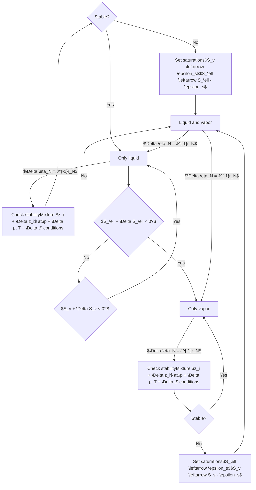

Figure 8.7 The phase transition procedure for the natural variables formulation. Starting from either of the possible phase states (single-phase liquid in blue, single-phase vapor in red, and two-phase in pink), the simulator can transition to other phase states by monitoring saturation changes and mixture stability.

procedure described in Figure 8.7 for the transition between single-phase and two-phase states. Once a single-phase cell is determined to be unstable in the stability test, the previously absent EoS phase is set to a small value $\epsilon_s$. Likewise, transition to a single-phase state occurs when the saturation of the other phase becomes negative after the Newton update. The formulation relies on solving simultaneously for all phase mole fractions and the phase saturation by the natural primary variable set

$$ \eta_N = (p, x_1, \dots, x_{N-1}, S_\ell, y_1, \dots, y_{N-1}). \quad (8.28) $$

These $2N$ primary variables are paired with the $N$ mass-balance equations (8.2) and the $N$ isofugacity or $K$-value constraints (8.7) before the system is linearized.

**Schur complement:** The resulting linearized system is twice as large as the overall composition system, but we can exploit the structure by noting that the last $N$ isofugacity equations are local to each cell and use a Schur-complement procedure to express the flow equations (mass conservation) as functions of the primary variables only. To explain the procedure, we partition the variables (8.28) into disjoint primary and secondary sets, $\mathbf{x}_p$ and $\mathbf{x}_s$. We denote the Jacobian of the


<page_number>347</page_number>

[https://doi.org/10.1017/9781009019781](https://doi.org/10.1017/9781009019781) Published online by Cambridge University Press

348 O. Møyner

mass balance and isofugacity residual equations as $J_{m*}$ and $J_{e*}$, respectively, where $* \in \{p, s\}$ denotes that the derivatives are taken either with respect to $\mathbf{x}_p$ or $\mathbf{x}_s$. With this notation, we can define a Schur complement (i.e., perform a block-Gaussian elimination) that reduces the system to an $N \times N$ linear system:

$$
-\begin{bmatrix} J_{mp} & J_{ms} \\ J_{ep} & J_{es} \end{bmatrix} \begin{bmatrix} \Delta \mathbf{x}_p \\ \Delta \mathbf{x}_s \end{bmatrix} = \begin{bmatrix} \mathbf{r}_p \\ \mathbf{r}_s \end{bmatrix} \rightarrow (J_{mp} - J_{ms} J_{es}^{-1} J_{ep}) \Delta \mathbf{x}_p = \mathbf{r}_p - J_{ms} J_{es}^{-1} \mathbf{r}_s. \tag{8.29}
$$

This system can be solved with standard constrained pressure residual-type preconditioned iterative solvers described in Chapter 6. After solving for $\mathbf{x}_p$, the additional values are recovered:

$$
\mathbf{x}_s = J_{es}^{-1}(\mathbf{r}_s - J_{ep} \Delta \mathbf{x}_p). \tag{8.30)
$$

The action of the inverse of $J_{es}$ is required both for the reduction and for the recovery. For this reason, MRST performs a single lower–upper factorization and stores the factors. The Schur complement requires that $J_{es}$ is invertible. This is not the case if we use the variable ordering in (8.28) as is. We therefore reorder the variables slightly before performing the Schur complement by swapping the saturation with an arbitrarily chosen liquid mole fraction:

$$
\mathbf{x}_p = (p, x_1, \dots, x_{N-2}, S_\ell), \quad \mathbf{x}_s = (x_{N-1}, y_1, \dots, y_{N-1}). \tag{8.31}
$$

We also refer you to Cao [5] for an early comprehensive description of natural variables in practice.

The Schur-complement reduction is automatically performed by MRST so that when the linear solver calls `getLinearSystem` on the linearized problem (see [[21, subsection 12.3.1]](https://doi.org/10.1017/9781009019781)), it outputs the reduced system. The eliminated variables are also automatically recovered when `storeIncrements` is called inside the linear solver (see [[21, subsection 12.3.4]](https://doi.org/10.1017/9781009019781)). You can disable this behavior by setting the property `reduceLinearSystem` of your natural variable model class to `false`; for example, if you wish to examine the full system.

**Configuration options:** The natural variables class in MRST contains several options that alter the nonlinear behavior of the solver. These include changing the definition of $\epsilon_s$ through `saturationEpsilon`, performing additional stability tests when cells switch to single phase (`checkStableTransition`), as well as deciding whether cells switching to the two-phase conditions should use a full flash to initialize the saturations and phase molar fractions (`flashFromSinglePhase`). In addition to the limits on changes for pressure and overall mole fractions present

[https://doi.org/10.1017/9781009019781](https://doi.org/10.1017/9781009019781) Published online by Cambridge University Press

Compositional Simulation with the AD-OO Framework <page_number>349</page_number>

in the overall composition model, the natural variables model limits changes in phase mole fractions according to `dzMaxAbs` and the saturation. Assuming that you have a natural variable class object called `natural`, the following code overrides the default settings:

```
natural.reduceLinearSystem    = false;  % Return full LinearizedSystemAD
natural.checkStableTransition = true;   % Perform extra stability tests
natural.saturationEpsilon     = 1e-8;   % Max dS during phase change
natural.flashFromSinglePhase  = true;   % Flash for single-phase cells
```

We discuss the implementation of model classes in more detail in Subsection 8.4.4.

**Convergence critera:** In addition to the tolerances for pressure increment and component-mass balance described in Subsection 8.4.1, the natural variables formulation needs to check the fugacity values in two-phase cells:

$$ \| (S_{\ell} + S_{v})(\mathbf{f}_{i\ell} - \mathbf{f}_{iv}) \|_{\infty} < \epsilon_{f} \quad \forall i \in \{1, \dots, N\}. \tag{8.32} $$

The convergence check uses a tolerance ($\epsilon_{f}$, prescribed in `fugacityTolerance`) that is scaled by `barsa` when tested, because the isofugacity is given in terms of the default pressure unit of Pascal, which becomes large for typical subsurface simulations.

## 8.4.3 Comparison between Different Formulations

Let us summarize the two previous subsections: The natural variable formulation uses a *variable substitution approach*, in which we assemble the full nonlinear equations (mass conservation (8.2) and isofugacity equations (8.7) with constraints (8.9) used to eliminate one mole fraction per phase) in each cell that contains two phases. We then use a Schur-complement technique to reduce the corresponding *linearized* system for the $2N$ primary variables so that we can solve for only $N$ variables in each cell. If one of the phases disappears, one must perform a *variable switching* to eliminate the corresponding saturation and reduce the overall system. With the overall composition formulations, the flow and thermodynamic equations are solved as a *nested nonlinear system* so that the nonlinear flash problem is solved fully nonlinearly for each outer iteration on the flow equations.

In the following, we first use a single-cell problem to compare and contrast the behavior of the two formulations before making some more general comments. We also encourage you to consult Voskov and Tchelepi [48] for a more comprehensive (computational) comparison of the two formulations implemented in MRST, as well as a set of other molar formulations.

[https://doi.org/10.1017/9781009019781](https://doi.org/10.1017/9781009019781) Published online by Cambridge University Press

350 O. Møyner

**A two-component example:** The `showNaturalOverall` script contains a small test case that demonstrates the difference between the two formulations in practice, as well as how to set up the solvers. We create a single-cell problem:

```matlab
G = computeGeometry(cartGrid(1));     % Single cell 1 m^3 grid
rock = makeRock(G, 0.5*darcy, 0.5);
```

We define a two-phase fluid and disable the 'blackoil' optional parameter to avoid adding viscosities and shrinkage factors to the fluid struct. To aid in the visualization of the results, we keep the model simple as a two-component water–CO<sub>2</sub> mixture<sup>3</sup>:

```matlab
f = initSimpleADIFluid('phases', 'wg', 'blackoil', false, 'rho', [1000, 700]);
mixture = TableCompositionalMixture({'Water','CarbonDioxide'}, {'Water','CO2'})
```

We next define the inputs to the constructor classes. The mandatory input arguments are the same irrespective of the choice of formulation. In the optional inputs, we set the water and gas phases as active and set the model to use those as the liquid and vapor phases, respectively, to obtain a two-component, two-phase model:

```matlab
arg = {G, rock, f, ...                                % Standard arguments
       mixture,...                                    % Compositional mixture
       'water', true, 'oil', false, 'gas', true,...   % Water-Gas system
       'liquidPhase', 'W', 'vaporPhase', 'G'};        % Water=liquid, gas=vapor

% Construct models for both formulations. Same input arguments
overall = GenericOverallCompositionModel(arg{:});     % Overall mole fractions
natural = GenericNaturalVariablesModel(arg{:});       % Natural variables
```

The code for setting up the initial state and boundary conditions is similar to what you may have encountered for other multiphase problems. The only difference is that, in addition to pressure and saturations, we need to specify the composition and temperature:

```matlab
p = 50*barsa; T = 273.15 + 30; s = []; z = [1, 0];    % p, T, s, z
bc = fluxside([], G, 'xmin', 1/day, 'sat', [0, 1]);   % Flux
bc = pside(bc, G, 'xmax', p, 'sat', [0, 1]);          % Standard bc
bc.components = repmat([0, 1], numel(bc.face), 1);    % Boundary z
state0 = initCompositionalState(overall, p, T, s, z); % Initialize state
```

<sup>3</sup> Using the default PR configuration for water–CO<sub>2</sub> VLE without volume shift or other parameter adjustments is somewhat questionable. For the purpose of this example, however, we simply think of the two as heavy and light components, respectively.

[https://doi.org/10.1017/9781009019781](https://doi.org/10.1017/9781009019781) Published online by Cambridge University Press

Compositional Simulation with the AD-OO Framework

351

<page_number>

351
</page_number>

<table>
  <thead>
    <tr>
        <th colspan="3">Solution paths in (zw, Δp) space (Left Chart)</th>
    </tr>
    <tr>
        <th>zw</th>
        <th>Natural variables [Pa]</th>
        <th>Overall composition [Pa]</th>
    </tr>
  </thead>
  <tbody>
    <tr>
        <td colspan="3">0.1</td>
    </tr>
    <tr>
        <td>0.2</td>
        <td>1180</td>
        <td>1180</td>
    </tr>
    <tr>
        <td>0.3</td>
        <td>1180</td>
        <td>1180</td>
    </tr>
    <tr>
        <td>0.4</td>
        <td>1180</td>
        <td>1180</td>
    </tr>
    <tr>
        <td>0.5</td>
        <td>1180</td>
        <td>1180</td>
    </tr>
    <tr>
        <td>0.6</td>
        <td>1180</td>
        <td>1180</td>
    </tr>
    <tr>
        <td>0.7</td>
        <td>1180</td>
        <td>1180</td>
    </tr>
    <tr>
        <td>0.8</td>
        <td>1180</td>
        <td>1180</td>
    </tr>
    <tr>
        <td>0.9</td>
        <td>1180</td>
        <td>1800</td>
    </tr>
    <tr>
        <td>0.95</td>
        <td>1550</td>
        <td>1180</td>
    </tr>
    <tr>
        <td>1.0</td>
        <td>1800</td>
        <td>1180</td>
    </tr>
  </tbody>
</table>
<table>
  <thead>
    <tr>
        <th colspan="3">Solution paths in (Sl, Δp) space (Right Chart)</th>
    </tr>
    <tr>
        <th>Sl</th>
        <th>Natural variables [Pa]</th>
        <th>Overall composition [Pa]</th>
    </tr>
  </thead>
  <tbody>
    <tr>
        <td>0.1</td>
        <td>1180</td>
        <td>1180</td>
    </tr>
    <tr>
        <td>0.2</td>
        <td>1180</td>
        <td>1180</td>
    </tr>
    <tr>
        <td>0.3</td>
        <td>1180</td>
        <td>1800</td>
    </tr>
    <tr>
        <td>0.4</td>
        <td>1180</td>
        <td>1180</td>
    </tr>
    <tr>
        <td>0.5</td>
        <td>1180</td>
        <td>1180</td>
    </tr>
    <tr>
        <td>0.6</td>
        <td>1180</td>
        <td>1180</td>
    </tr>
    <tr>
        <td>0.7</td>
        <td>1180</td>
        <td>1180</td>
    </tr>
    <tr>
        <td>0.8</td>
        <td>1200</td>
        <td>1180</td>
    </tr>
    <tr>
        <td>0.9</td>
        <td>1550</td>
        <td>1180</td>
    </tr>
    <tr>
        <td>1.0</td>
        <td>1800</td>
        <td>1180</td>
    </tr>
  </tbody>
</table>

Figure 8.8 Solution paths for the natural variable and overall compositions formulations for the single-cell problem plotted in ($z_w, \Delta p$) space (left) and in ($S_\ell, \Delta p$) space (right). The color sectors in both plots represent isocontour lines for $S_\ell = 0.1, 0.2, \dots, 1$.

The compositional solvers support the way of specifying standard boundary conditions, source terms, and wells in MRST, provided that the `components` field is added to the corresponding structures to specify inflow compositions.

Once the scenario has been set up, we solve a single timestep that brings the cell from pure water to a condition of mostly gas. The single-cell problem is entirely determined by the water mole fraction and the pressure difference from the boundary or, equivalently, by liquid saturation and pressure difference. Figure 8.8 reports the paths the two solution procedures take in ($z_w, \Delta p$) and ($S_\ell, \Delta p$) space. We observe that both solvers initially overshoot the pressure as they transition from the initial single-phase liquid state. The jump across the phase boundary is typical in miscible problems, because the derivatives of the Jacobian contain discontinuities at the phase boundary. For example, (8.26) means that the liquid fraction and, by extension, the saturations have derivatives with respect to pressure in the two-phase region but do not have any derivatives in the single-phase regions. The second observation is that the path for the overall composition model is regular in compositional space due to the default value of `dzMaxAbs=0.1` but makes large jumps in saturation space. For the natural variables model, the compositional changes are small, because the limit on saturation updates (`dsMaxAbs=0.1`) forces the algorithm to advance in regular saturation steps. Altogether, the overall composition model uses 10 iterations and the natural variables 12, but the numbers could equally well have been reversed if large changes in composition had resulted in small changes in the saturation.

The differences between the formulations are also apparent if we inspect the convergence output in verbose mode. For natural variables, the residuals for the

[https://doi.org/10.1017/9781009019781](https://doi.org/10.1017/9781009019781) Published online by Cambridge University Press

352 O. Møyner

fugacity constraints are included in addition to the pressure increment and the residual for the component-mass balances:

```
===============================================================
| It # | deltaP   | Water     | CO2      | f_Water   | f_CO2     |
===============================================================
|    1 | Inf      | *2.56e-15 | 1.66e+02 | *0.00e+00 | *0.00e+00 |
|    2 | 3.61e-01 | 9.95e+01  | 1.44e+02 | 3.31e-02  | 2.89e+02  |
|    3 | 5.86e-02 | 8.44e+01  | 1.48e+02 | 2.95e-02  | 2.03e+02  |
                               :
```

The fugacity residuals are exactly equal zero initially when the cell is at single-phase conditions but become nonzero once the vapor phase appears. The fugacity values are absent in the overall composition output, because these are handled by the separate nonlinear solve from the EoS:

```
=========================================
| It # | deltaP   | Water     | CO2      |
=========================================
|    1 | Inf      | *2.69e-16 | 1.66e+02 |
|    2 | 3.61e-01 | 8.22e+01  | 1.55e+00 |
|    3 | 1.29e-01 | 4.15e+01  | 1.02e+02 |
                          :
```

We can also examine the final state after the solution to see what the standard outputs are for a compositional model:

```
disp(solMole)

                            :
                  pressure: 5.0012e+06
                         s: [0.0145 0.9855]
                components: [0.1928 0.8072]
                         L: 0.1921
                         K: [0.0017 320.8334]
                       Z_V: 0.6862
                       Z_L: 0.0424
                         x: [0.9969 0.0031]
                         y: [0.0017 0.9983]
                      flag: 0
                         T: 303.1500
                            :
```

For brevity, we have omitted a few standard fields that are common to all states produced in AD-OO, but we can still see the familiar pressure, temperature, and phase saturations for each cell. In addition, we have the components field that stores the overall mole fraction for each component, the liquid and vapor phase mole fractions given in x and y, as well as the phase compressibility factors Z_L and Z_V. Strictly speaking, the system is completely determined by these values,

[https://doi.org/10.1017/9781009019781](https://doi.org/10.1017/9781009019781) Published online by Cambridge University Press

Compositional Simulation with the AD-OO Framework 353

<page_number>

353
</page_number>

but we also store the *K*-values, the liquid mole fraction *L*, and the phase state as flag to make the EoS coupling easier. In the single-phase region, the *K*-values stored will be the values from the last multiphase solution in that cell, which can be used as an initial guess if multiphase conditions occur again.

**Choice of formulation:** Picking the right formulation depends on the scenario to be simulated. The advantages of the overall composition formulation should be clear around the critical point, where a large number of local flash iterations may otherwise impede the convergence of the global system of equations. The formulation is also less involved to implement, because there are no variable switches and the integration with new types of flash is less invasive, especially if source code for the flash calculation is not available. The difference in implementation complexity is readily apparent: At the time of writing, the natural variables base class accounts for approximately 500 lines of code, whereas the overall composition code consists of less than 200 lines of code. A primary disadvantage is that the flash can spend significant time to converge for intermediate mass distributions in physical space, unless one uses a parameterization approach like compositional space adaptive tabulation [[49, 50]](https://doi.org/10.1017/9781009019781). Likewise, saturations cannot be directly relaxed to alleviate convergence issues associated with sharp gradients in the flux functions arising from large mobility contrasts or the form of the relative permeability curves. Instead, the solver limits the maximum allowable overall composition change but, as we have seen, the relationship between changes in composition and saturation can be highly nonlinear.

The primary advantage of the natural variables formulation is that the scheme produces a standard Newton method in the two-phase region where all variables can be safely relaxed, a crucial feature for steep relative permeability curves and strong capillary pressure. The Schur complement in (8.29) is analogous to the equation for differentiation of secondary properties in (8.26) for the overall composition formulation. The natural variables formulation is in practice somewhat more expensive in terms of the total assembly cost, because additional derivatives are required for the mass-balance equations to perform the Schur complement. As a rule of thumb, the assembly of the full set of natural variable equations is approximately 10% more expensive with the fastest AD backend options described in Chapter 6 for models with more than 100 000 cells. In addition, the Schur complement must be performed for many of the linear solvers. For further comparisons of various compositional formulations, we refer you to Voskov and Tchelepi [[48]](https://doi.org/10.1017/9781009019781), Zaydullin et al. [[56]](https://doi.org/10.1017/9781009019781), and references therein.

[https://doi.org/10.1017/9781009019781](https://doi.org/10.1017/9781009019781) Published online by Cambridge University Press

354 *O. Møyner*

Table 8.1 *Model classes implemented in the compositional module of MRST.*

<table>
  <thead>
    <tr>
        <th>Class name</th>
        <th>Formulation</th>
        <th>Note</th>
    </tr>
  </thead>
  <tbody>
    <tr>
        <td>`ThreePhaseCompositionalModel`</td>
        <td>—</td>
        <td>Virtual base class</td>
    </tr>
    <tr>
        <td>`OverallCompositionCompositionalModel`</td>
        <td>Overall composition</td>
        <td> </td>
    </tr>
    <tr>
        <td>`NaturalVariablesCompositionalModel`</td>
        <td>Natural variables</td>
        <td> </td>
    </tr>
    <tr>
        <td>`GenericOverallCompositionModel`</td>
        <td>Overall composition</td>
        <td>Generic model</td>
    </tr>
    <tr>
        <td>`GenericNaturalVariablesModel`</td>
        <td>Natural variables</td>
        <td>Generic model</td>
    </tr>
  </tbody>
</table>

<mark>COMPUTER EXERCISES</mark>

1. If the variable `maxChange` is declared in `showNaturalOverall`, the value is used for the maximum allowable changes for saturations and compositions. How does the path change with the value? Are there any large values for which the solvers are unable converge?

2. We used a very simple two-component mixture. The `showNaturalOverall2` example runs a similar experiment with a choice of many different mixtures from the literature. Experiment by varying the mixture, pressure, and temperature conditions. When does the natural variables formulation outperform the overall composition formulation and vice versa?

## 8.4.4 *Implementation as Generic Models*

As explained in the introduction to this section, the compositional module offers two different implementations of the natural variables and overall composition formulations; see Table 8.1. The first implementation follows the principles set out for the black-oil models in section 12.2 of the MRST textbook [21]; that is, `ThreePhaseBlackOilModel` and simplified versions thereof implemented in the `ad-blackoil` module. When developing similar compositional classes, we realized that even though the original AD-OO framework has a lot of useful abstractions that greatly simplify the process of prototyping simulators for new types of flow physics, describing model equations and computing fluid properties and accumulation, flux, and source terms using large pieces of monolithic code was not an optimal choice and made inclusion of new features unnecessarily complicated. This spurred research into new approaches for further modularization, which resulted in the new concept of state functions and generic model classes introduced in Chapter 5.

Herein, we do not discuss the monolithic implementation in any detail; the corresponding model classes are considered to be legacy code but are kept as part of the official MRST release for backward compatibility, because the generic models

[https://doi.org/10.1017/9781009019781](https://doi.org/10.1017/9781009019781) Published online by Cambridge University Press

Compositional Simulation with the AD-OO Framework 355

<page_number>

355
</page_number>

inherit functionality from them, and because they form a basis for the shale mod-
ule described in Chapter 10.

**Generic compositional components:** The monolithic implementation assumes
that an aqueous phase and two hydrocarbon phases (liquid and vapor) are always
present by default and uses `if` statements scattered throughout the code to treat
special cases when any of these phases are not present. The generic approach, on
the other hand, builds the configuration of the flow model at runtime as a collection
of individual components that each may belong to certain predefined categories
exhibiting specific behavior.

From black-oil models, we have immiscible and black-oil components (see
Subsection 5.4.2), whereas the derived models for chemical EOR introduce
the additional category of concentration components (see Subsection 7.3.3).
The compositional module introduces an additional component called
`EquationOfStateComponent`. To better understand the design of the com-
positional module, let us look in detail at how this component computes densities
for two phases at VLE, according to the formula:

$$
\rho_{i,\alpha} = \begin{cases} \mathbf{X}_{i,\ell}\rho_{\ell}, & \text{if } \alpha = \ell, \\ \mathbf{X}_{i,v}\rho_{v}, & \text{if } \alpha = v, \\ 0, & \text{otherwise.} \end{cases} \tag{8.33}
$$

We have already presented the member function that computes this formula in
Subsection 5.4.2, but let us present it explicitly again for completeness:

```matlab
function c = getComponentDensity(component, model, state, varargin)
    c = component.getPhaseComposition(model, state, varargin{:});
    rho = model.getProps(state, 'Density');
    for ph = 1:numel(c)
        if ~isempty(c{ph}), c{ph} = rho{ph}.*c{ph}; end
    end
end
```

The interesting part is how we compute the phase composition. This is done by
another member function (presented in a slightly condensed form):

```matlab
function c = getPhaseComposition(component, model, state, varargin)
    massFractions = model.getProps(state, 'ComponentPhaseMassFractions');
    for ph = 1:size(massFractions, 2)
        mf = massFractions{component.componentIndex, ph};
        if ~isempty(mf), c{ph} = mf; end
    end
end
```

[https://doi.org/10.1017/9781009019781](https://doi.org/10.1017/9781009019781) Published online by Cambridge University Press

356

O. Møyner

```matlab
% StateFn: ComponentPhaseMoleFractionsLv.m
function v = evaluateOnDomain(prop, model, state)
    [x, y] = model.getProps(state, 'x', 'y');
    :
    nph   = model.getNumberOfPhases();
    ncomp = model.getNumberOfComponents();
    v     = cell(ncomp, nph);
    isEoS = model.getEoSComponentMask();
    [v{isEoS, model.getLiquidIndex()}] = x{:};
    [v{isEoS, model.getVaporIndex()}]  = y{:};
    :
end

% StateFn: ComponentPhaseMassFractionsLv.m
function mass = evaluateOnDomain(prop, model, state)
    eos   = model.EOSModel;
    moles = prop.getEvaluatedDependencies(state, ...
                        'ComponentPhaseMoleFractions');
    mass  = moles;
    isEoS = model.getEoSComponentMask();
    for i = 1:size(mass, 2)
        mass(isEoS, i) = ....
            eos.getMassFraction(moles(isEoS, i));
    end
end

% Model class: EquationOfStateModel.m
function frac = getMassFraction(model, molfraction)
    mass = bsxfun(@times, molfraction, ...
                  model.CompositionalMixture.molarMass);
    frac = bsxfun(@rdivide, mass, sum(mass, 2));
end
```

Figure 8.9 Computation of component mass fractions for a generic EoS component.

The component mass fractions $X_{i,\alpha}$ are computed through a combination of state functions and member functions from the associated `EquationOfStateModel`, as shown in Figure 8.9. The code excerpts in the figure have been edited and simplified to get rid of data conversion and special cases that obscure the expressions in use. If we try to analyze the code, we see that the primary state function, shown to the upper right, starts by calling the secondary state function, shown to the upper left, to compute component mole fractions. All that the part shown here of this state function does is to extract the mole fractions for each phase from the state object and store them in a cell array that runs over all components and all phases; we have purposely edited out the parts that insert ones in the correct places for non-EoS components. Once the mole fractions are computed, the primary state function then iterates over all components and calls on a member function from the EoS model to compute the mass fractions, using the expression $X_i = m_i x_i / (\sum_i^N m_i x_i)$. The member function does this irrespective of whether `molfraction` is a cell array or an ordinary array of doubles, and here we only present the latter variant for pedagogical purposes, because it is more compact than the cell-array equivalent (which is the one usually called when executing the code).

**Instantiating compositional components:** In Subsection 5.4.2, we explained how the individual components that make up the flow model are instantiated by `validateModel` and showed the relevant code. We follow exactly the same approach for the compositional case, here from the overall composition class:

[https://doi.org/10.1017/9781009019781](https://doi.org/10.1017/9781009019781) Published online by Cambridge University Press

*Compositional Simulation with the AD-OO Framework*

357

```matlab
for ci = 1:nc
   name = names{ci};
   switch name
      case {'water', 'oil', 'gas'}
         ix = model.getPhaseIndex(upper(name(1)));
         c = ImmiscibleComponent(name, ix);
      otherwise
         c = getEOSComponent(model, p, T, name, ci);
   end
   model.Components{ci} = c;
end
```

The logic of this function is that components named `'water'`, `'oil'`, and `'gas'` represent single-component, immiscible fluid phases that can be instantiated directly. All other components are assumed to be part of the hydrocarbon phases that can be found in liquid and vapor form. Notice that we cannot instantiate these components directly but must instead first determine how each component splits across the phases found at the present temperature and pressure. This is done in the separate utility function shown in Listing 8.1, which first performs a standalone flash as discussed in Subsection 8.3.3 to compute the liquid-phase mole fraction and the phase densities and then subsequently uses these to instantiate the component.

## 8.4.5 State Functions for Compositional Models

The compositional module implements state functions for evaluating flow and thermodynamic properties and discretization terms in flow and facility equations based on the principles outlined for black-oil models in Chapter 5 and discussed in detail for chemical EOR in Chapter 7. We will therefore not discuss their compositional counterparts in any detail here; instead, we encourage you to study the source code yourself.

A good way to understand the inner workings of MRST has traditionally been to pick a tutorial example and use the debugger in the MATLAB editor to run the code lines in the accompanying script step by step. By stepping into each function call, you can follow the exact execution of the code and thus understand the logic of the implementation. This approach will not be as intuitive for simulator scripts implemented with the AD-OO framework as for the procedural parts of MRST, because the abstractions and inheritance that greatly aid you when implementing enhanced or new functionality also introduce many layers in the code that may be quite overwhelming to step through; indeed, at least the first few times you try, it will feel like peeling a cabbage or an onion. This is particularly true for the new state-function framework, which involves a lot of overhead code to implement

[https://doi.org/10.1017/9781009019781](https://doi.org/10.1017/9781009019781) Published online by Cambridge University Press

358 O. Møyner

Listing 8.1 *Perform initial flash and instantiate EoS components.*

```matlab
function c = getEOSComponent(model, p, T, name, ci)

    mixture = model.EOSModel.CompositionalMixture;
    hcpos   = strcmp(mixture.names, name);
    z       = zeros(1, numel(mixture.names)); z(hcpos) = 1;

    % Flash calculation to obtain molar fractions and densities
    [L, ~, ~, ~, ~, rhoL, rhoV] = standaloneFlash(p, T, z, model.EOSModel);
    Lm   = L.*rhoL./(rhoL.*L + rhoV.*(1-L));
    frac = zeros(1, model.getNumberOfPhases());

    % Assign mass fractions and phase densities
    Li = model.getLiquidIndex(); Vi = model.getVaporIndex();
    frac(Li) = Lm;               frac(Vi) = 1-Lm;
    rho(Li)  = rhoL;             rho(Vi)  = rhoV;

    % Densities for any non-EoS components
    extra = model.getNonEoSPhaseNames();
    phases = model.getPhaseNames();
    for i = 1:numel(extra)
        rho(phases == extra(i)) = model.fluid.(['rho', extra(i), 'S']);
    end

    c = EquationOfStateComponent(name, p, T, ci, frac, rho, ...
                                 mixture.molarMass(hcpos));
end
```

the very useful compute-cache mechanism and efficient evaluation of constitutive relationships for cases with multiple fluid and/or PVT regions.

The display and plotting functionality discussed in Subsection 5.4.1 has been introduced for the exact purpose of remedying this situation, and using this to display the exact state functions used and view different parts of the simulator as graphs is our recommended approach to understand the logic of the compositional module. To illustrate, let us revisit the example from Subsection 8.4.3 (script: `showNaturalOverall.m`) and use the overall compositional formulation as an example. Once the overall class object is constructed, we can extract its state-function groupings:

`ogroups = overall.getStateFunctionGroupings()`

```
ogroups = 
  1x4 cell array

  Columns 1 through 2
    {1x1 FlowPropertyFunctions}    {1x1 PVTPropertyFunctions}

  Columns 3 through 4
    {1x1 FlowDiscretization}    {1x1 FacilityFlowDiscretization}
```

[https://doi.org/10.1017/9781009019781](https://doi.org/10.1017/9781009019781) Published online by Cambridge University Press

Compositional Simulation with the AD-OO Framework

359

These are the same four groupings as shown for the black-oil case in Figure 5.7. We start by inspecting the flow properties:

> `FlowPropertyFunctions` (edit|plot) state function grouping instance.
>
> Intrinsic state functions (Class properties for FlowPropertyFunctions, always present):
>     CapillaryPressure: BlackOilCapillaryPressure (edit|plot)
>     ComponentMobility: ComponentMobility (edit|plot)
>     ComponentPhaseDensity: ComponentPhaseDensity (edit|plot)
>     ComponentPhaseMass: ComponentPhaseMass (edit|plot)
>     ComponentTotalMass: ComponentTotalMass (edit|plot)
>     Mobility: Mobility (edit|plot)
>     RelativePermeability: BaseRelativePermeability (edit|plot)
> No extra state functions have been added to this class instance.
> Dependency graph showing relationships between state functions like Viscosity, PoreVolume, Density, and ComponentPhaseMassFractions.

The graph is reproduced so small here that it is difficult to see details, but if you repeat the exercise and plot it using the command

```matlab
plotStateFunctionGroupings(ogroups{1})
```

on your own computer, you will see that it has four "end nodes": capillary pressure and mobility, phase density, and total mass for each component. The state function `CapillaryPressure` computes the saturation-dependent capillary pressure functions $P_c(S)$. This quantity is defined in the same way for our compositional model, as in the black-oil case, and is thus inherited from the previous implementation.

Moving on to the component quantities, we see that the yellow lines in the graph show that these all depend on thermodynamic properties, but the graph does not offer any details of how these prerequisites are computed. To also include the interdependencies of the thermodynamic quantities, we can redo the plot as follows to produce Figure 8.10:

```matlab
endnodes = {'CapillaryPressure', 'ComponentPhaseDensity',...
            'ComponentTotalMass','ComponentMobility'};
plotStateFunctionGroupings(ogroups(1:2),'Stop',endnodes,'label','name');
```

We have already discussed the computation of component phase density (8.33) in Subsection 8.4.4, which is implemented inside the `EquationOfStateComponent` class. The graph enables us to trace all dependencies: The first dependence is on the `Density` function in the PVT group, which in turn depends on `PhasePressures` and `p` and `T` from the `state` object. In the general case, `PhasePressures` would also depend on the `CapillaryPressure` just discussed, but this dependency is disregarded when the capillary pressures are turned off, as in this particular example.

The second dependence is on phase mass fractions, which we previously have discussed in detail and shown in Figure 8.9. At this point you may ask why there

[https://doi.org/10.1017/9781009019781](https://doi.org/10.1017/9781009019781) Published online by Cambridge University Press

360 O. Møyner

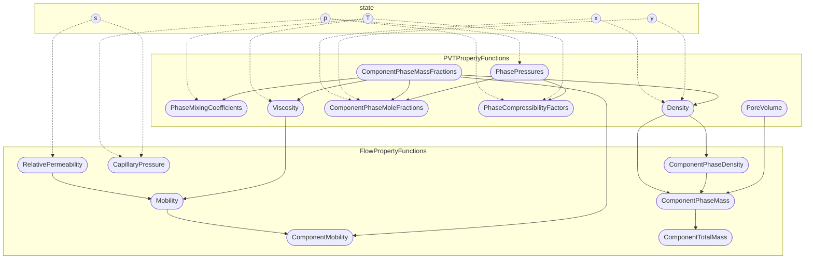

Figure 8.10 State-function diagram for the `FlowPropertyFunctions` group, including dependencies from the PVT property group. Solid lines denote dependencies between state functions, and dashed lines are dependencies on properties from the state object. End nodes – i.e., state functions that do not provide input to any other functions in the flow property group – are marked with a blue frame. (Notice also that the TikZ code exported from MRST has been edited a bit to improve the visual presentation.)

is no trace of the EoS in the graph. The reason is that all EoS models known to the compositional module are implemented as a monolithic class without the use of state functions and hence none of the internal function calls implemented in this class show up in the current graph.

We end this discussion by pointing out one important limitation of this plotting functionality. It does not do any kind of automatic code analysis to detect dependencies but instead relies on dependencies documented when coding each individual state function or component class. Such dependencies are registered in the constructor of each state function or component. We can take the EoS component class as an example. Here, the constructor reads:

```matlab
function c = EquationOfStateComponent(name, p, T, cindex, ..)
    :
    c = c.functionDependsOn('getPhaseComposition', ...
        {'ComponentPhaseMassFractions'}, 'PVTPropertyFunctions');
    c = c.functionDependsOn('getComponentDensity', ...
        {'Density', 'ComponentPhaseMassFractions'}, 'PVTPropertyFunctions');
end
```

[https://doi.org/10.1017/9781009019781](https://doi.org/10.1017/9781009019781) Published online by Cambridge University Press

*Compositional Simulation with the AD-OO Framework* 361

Looking back at how `getComponentDensity` is implemented on page 355, we see that the dependence on the component mass fractions does not appear in the function itself but is introduced through the call to `getPhaseComposition`. It must nonetheless be registered explicitly also for `getComponentDensity`, and it is essential that such dependencies are traced out and registered diligently for the plotting functionality to be accurate and useful.

**COMPUTER EXERCISES**

1. Use the approach just outlined to familiarize yourself with the other three state-function groupings that make up the compositional simulator classes.

2. Try to make a plot similar to the one shown in Figure 5.7 that displays the interdependencies among all of the quantities you need to evaluate to compute accumulation, fluxes, and source terms. (Hint: To distinguish state functions with the same name from two different groupings, you must prepend the group name; e.g., `FlowDiscretization.ComponentTotalFlux`.)

### 8.4.6 Limitations and Caveats

The compositional module in MRST has sufficient complexity to model a range of different multicomponent scenarios. Chapter 10 discusses how the module can be extended with sorption, diffusion, and geomechanics effects and be combined with embedded discrete fracture modeling to describe recovery from unconventional oil and gas reservoirs. In the interest of clarity, however, we mention a few features not present in the module. These features may come in the future – or you may be the one who contributes to any of them.

The compositional model neglects capillary pressure in the phase-equilibrium calculations. For modeling of hydrocarbon mixtures, this is quite reasonable and is standard in commercial compositional simulators, but it is less reasonable for VLE involving water or CO<sub>2</sub>. There are a number of recent works [[33, 45]](33_45) that incorporate these effects that could inform an MRST extension.

Cubic EoS are generally favored for their efficiency and limited number of parameters, but significant interest has also been devoted to PC-SAFT-type equations [[15]](15) derived from statistical mechanics. The official release of MRST will soon include the ePC-SAFT version [[24, 25]](24_25), which requires five molecular-based parameters per component for associating fluids and only three for nonassociating ones. Generally, PC-SAFT-type equations describe liquid systems better than traditional cubic EoS. PC-SAFT is more accurate to predict derivative properties, reducing errors by a factor of up to eight [[12, 20]](12_20), while reducing density prediction error by one half. PC-SAFT (or ePC-SAFT) provides good agreement

[https://doi.org/10.1017/9781009019781](https://doi.org/10.1017/9781009019781) Published online by Cambridge University Press

362 O. Møyner

between calculated and experimental properties of reservoir fluids, natural gas, and asphaltene phase behavior [4, 38]. On the other hand, PC-SAFT has issues related, e.g., to root finding and is known to increase the computational time [4, 12, 20, 38].

The compositional module does not take thermal effects into account, in that the description is fully isothermal. A natural future extension would be to incorporate the conservation of energy in the solver, which may necessitate the introduction of a flash that uses enthalpy instead of temperature [55] to model internal energy.

Several other smaller features would be easy to implement, given the flexibility of AD together with state functions. One is to finish the partially implemented Zudkevitch–Joffe–Redlich–Kwong EoS [57] that adds temperature dependence to the static Redlich–Kwong parameters, another is to introduce changing relative permeabilities and capillary pressure curves during the transition to fully miscible flooding (e.g., the Eclipse keyword `MISCIBLE` that implements the rule from Coats [9]). Yet other features are supported, but automatically setting these options from input files is not tested to the degree you may be used to from other solvers in MRST. Please report issues and fixes through the usual MRST channels.

# 8.5 Examples

This section goes through a number of examples to demonstrate how you can use functionality from the compositional module to set up relatively complex fluid cases. We also verify the simulator against a commercial simulator and another research code to demonstrate its correctness. All examples come with complete source code, which you can find in the `book-ii` example directory of the module. To keep the discussion as simple as possible, we only present 1D examples, but the solvers in the module are fully capable of simulating cases posed on complex and unstructured grids in 2D and 3D as long as your computer has sufficient memory and processing power. (Notice that use of external, iterative solvers and the accelerated AD backends discussed in Chapter 6 is particularly important when attempting to simulate large 2D/3D cases.)

## 8.5.1 Validation of MRST’s Simulators

We begin by comparing MRST with other reservoir simulators with compositional capability in the `compositionalValidationSimple` example. This test case is taken from Voskov and Tchelepi [48] and was originally reported for MRST in [31]. Here, pure CO<sub>2</sub> is injected over 500 timesteps into a 1D reservoir made up of 1 000 cells. The reservoir initially contains a CO<sub>2</sub>–methane–decane mixture mostly in the liquid phase, with CO<sub>2</sub> forming a supercritical phase under reservoir

[https://doi.org/10.1017/9781009019781](https://doi.org/10.1017/9781009019781) Published online by Cambridge University Press

*Compositional Simulation with the AD-OO Framework* 363

<page_number>

363
</page_number>

<table>
  <thead>
    <tr>
        <th>x</th>
        <th>MRST DECANE</th>
        <th>E300 DECANE</th>
        <th>AD-GPRS DECANE</th>
        <th>MRST CO2</th>
        <th>E300 CO2</th>
        <th>AD-GPRS CO2</th>
        <th>MRST METHANE</th>
        <th>E300 METHANE</th>
        <th>AD-GPRS METHANE</th>
    </tr>
  </thead>
  <tbody>
    <tr>
        <td>0</td>
        <td>0</td>
        <td>0</td>
        <td>0</td>
        <td>1</td>
        <td>1</td>
        <td>1</td>
        <td>0</td>
        <td>0</td>
        <td>0</td>
    </tr>
    <tr>
        <td>100</td>
        <td>0.18</td>
        <td>0.18</td>
        <td>0.18</td>
        <td>0.82</td>
        <td>0.82</td>
        <td>0.82</td>
        <td>0</td>
        <td>0</td>
        <td>0</td>
    </tr>
    <tr>
        <td>200</td>
        <td>0.24</td>
        <td>0.24</td>
        <td>0.24</td>
        <td>0.76</td>
        <td>0.76</td>
        <td>0.76</td>
        <td>0</td>
        <td>0</td>
        <td>0</td>
    </tr>
    <tr>
        <td>300</td>
        <td>0.28</td>
        <td>0.28</td>
        <td>0.28</td>
        <td>0.72</td>
        <td>0.72</td>
        <td>0.72</td>
        <td>0</td>
        <td>0</td>
        <td>0</td>
    </tr>
    <tr>
        <td>400</td>
        <td>0.35</td>
        <td>0.35</td>
        <td>0.35</td>
        <td>0.65</td>
        <td>0.65</td>
        <td>0.65</td>
        <td>0.05</td>
        <td>0.05</td>
        <td>0.05</td>
    </tr>
    <tr>
        <td>500</td>
        <td>0.56</td>
        <td>0.56</td>
        <td>0.56</td>
        <td>0.12</td>
        <td>0.12</td>
        <td>0.12</td>
        <td>0.32</td>
        <td>0.32</td>
        <td>0.32</td>
    </tr>
    <tr>
        <td>600</td>
        <td>0.59</td>
        <td>0.59</td>
        <td>0.59</td>
        <td>0.10</td>
        <td>0.10</td>
        <td>0.10</td>
        <td>0.31</td>
        <td>0.31</td>
        <td>0.31</td>
    </tr>
    <tr>
        <td>700</td>
        <td>0.61</td>
        <td>0.61</td>
        <td>0.61</td>
        <td>0.09</td>
        <td>0.09</td>
        <td>0.09</td>
        <td>0.30</td>
        <td>0.30</td>
        <td>0.30</td>
    </tr>
    <tr>
        <td>800</td>
        <td>0.63</td>
        <td>0.63</td>
        <td>0.63</td>
        <td>0.09</td>
        <td>0.09</td>
        <td>0.09</td>
        <td>0.28</td>
        <td>0.28</td>
        <td>0.28</td>
    </tr>
    <tr>
        <td>900</td>
        <td>0.66</td>
        <td>0.66</td>
        <td>0.66</td>
        <td>0.08</td>
        <td>0.08</td>
        <td>0.08</td>
        <td>0.26</td>
        <td>0.26</td>
        <td>0.26</td>
    </tr>
    <tr>
        <td>1000</td>
        <td>0.70</td>
        <td>0.70</td>
        <td>0.70</td>
        <td>0.07</td>
        <td>0.07</td>
        <td>0.07</td>
        <td>0.23</td>
        <td>0.23</td>
        <td>0.23</td>
    </tr>
  </tbody>
</table>

Figure 8.11 Mole fractions after 6 years and 175 days computed by three different simulators for the validation case from Voskov and Tchelepi [48].

conditions of 423.15 K and 75 bar. No *K*-values are used, which means that the component behavior and phase properties are predicted by the default PR EoS.

The overall mole fractions are plotted for all three simulators: MRST, AD-GPRS [48], and ECLIPSE (E300) [44]. To be as close as possible to E300 in formulation, MRST and AD-GPRS are both set to use the overall composition as primary variables with a fully implicit temporal discretization. Both wells operate at fixed bottom-hole pressures. In computed mole fractions reported in Figure 8.11 we can observe that there is a large two-phase region beyond the region where the supercritical CO<sub>2</sub> front fully saturates the medium. The relative permeabilities are of Corey type, with quadratic exponents, but the front structure is significantly more complex than in the immiscible Buckley–Leverett case from subsection 10.3.1 in the MRST textbook [21]. The variable density, viscosity, and phase mole distribution make this a highly challenging numerical problem to solve. The three simulators are in excellent agreement when formulations and timesteps are comparable. This simple 1D example is just a small sample of the extensive validation performed in-house on the MRST compositional solvers.

### 8.5.2 Numerical Accuracy

The previous example showed that MRST agrees with a commercial and a state-of-the-art academic simulator for a challenging case with complex phase behavior. As an extension of this, we also compare different formulations for the same case. In `compositionalAccuracyExample`, we set up two additional solvers: a fully implicit natural variables solver and an explicit overall composition solver. The upper part of Figure 8.12 reports mole fractions for all three solvers. The two fully

[https://doi.org/10.1017/9781009019781](https://doi.org/10.1017/9781009019781) Published online by Cambridge University Press

364 O. Møyner

<table>
  <thead>
    <tr>
        <th colspan="10">Mole fractions (top)</th>
    </tr>
    <tr>
        <th>x</th>
        <th>Explicit DECANE</th>
        <th>Explicit CO2</th>
        <th>Explicit METHANE</th>
        <th>Natural DECANE</th>
        <th>Natural CO2</th>
        <th>Natural METHANE</th>
        <th>Overall DECANE</th>
        <th>Overall CO2</th>
        <th>Overall METHANE</th>
    </tr>
  </thead>
  <tbody>
    <tr>
        <td>0</td>
        <td>1.0</td>
        <td>0.0</td>
        <td>0.0</td>
        <td>1.0</td>
        <td>0.0</td>
        <td>0.0</td>
        <td>1.0</td>
        <td>0.0</td>
        <td>0.0</td>
    </tr>
    <tr>
        <td>100</td>
        <td>0.8</td>
        <td>0.2</td>
        <td>0.0</td>
        <td>0.8</td>
        <td>0.2</td>
        <td>0.0</td>
        <td>0.8</td>
        <td>0.2</td>
        <td>0.0</td>
    </tr>
    <tr>
        <td>200</td>
        <td>0.75</td>
        <td>0.25</td>
        <td>0.0</td>
        <td>0.75</td>
        <td>0.25</td>
        <td>0.0</td>
        <td>0.75</td>
        <td>0.25</td>
        <td>0.0</td>
    </tr>
    <tr>
        <td>300</td>
        <td>0.1</td>
        <td>0.55</td>
        <td>0.35</td>
        <td>0.1</td>
        <td>0.55</td>
        <td>0.35</td>
        <td>0.1</td>
        <td>0.55</td>
        <td>0.35</td>
    </tr>
    <tr>
        <td>400</td>
        <td>0.1</td>
        <td>0.58</td>
        <td>0.32</td>
        <td>0.1</td>
        <td>0.58</td>
        <td>0.32</td>
        <td>0.1</td>
        <td>0.58</td>
        <td>0.32</td>
    </tr>
    <tr>
        <td>500</td>
        <td>0.1</td>
        <td>0.6</td>
        <td>0.3</td>
        <td>0.1</td>
        <td>0.6</td>
        <td>0.3</td>
        <td>0.1</td>
        <td>0.6</td>
        <td>0.3</td>
    </tr>
    <tr>
        <td>600</td>
        <td>0.1</td>
        <td>0.65</td>
        <td>0.25</td>
        <td>0.1</td>
        <td>0.65</td>
        <td>0.25</td>
        <td>0.1</td>
        <td>0.65</td>
        <td>0.25</td>
    </tr>
    <tr>
        <td>700</td>
        <td>0.1</td>
        <td>0.68</td>
        <td>0.22</td>
        <td>0.1</td>
        <td>0.68</td>
        <td>0.22</td>
        <td>0.1</td>
        <td>0.68</td>
        <td>0.22</td>
    </tr>
    <tr>
        <td>800</td>
        <td>0.1</td>
        <td>0.68</td>
        <td>0.22</td>
        <td>0.1</td>
        <td>0.68</td>
        <td>0.22</td>
        <td>0.1</td>
        <td>0.68</td>
        <td>0.22</td>
    </tr>
    <tr>
        <td>900</td>
        <td>0.1</td>
        <td>0.68</td>
        <td>0.22</td>
        <td>0.1</td>
        <td>0.68</td>
        <td>0.22</td>
        <td>0.1</td>
        <td>0.68</td>
        <td>0.22</td>
    </tr>
    <tr>
        <td>1000</td>
        <td>0.1</td>
        <td>0.68</td>
        <td>0.22</td>
        <td>0.1</td>
        <td>0.68</td>
        <td>0.22</td>
        <td>0.1</td>
        <td>0.68</td>
        <td>0.22</td>
    </tr>
    <tr>
        <th colspan="10">Vapor saturation (bottom)</th>
    </tr>
    <tr>
        <th>x</th>
        <th>Explicit</th>
        <th>Natural</th>
        <th colspan="7">Overall</th>
    </tr>
    <tr>
        <td>0</td>
        <td>1.0</td>
        <td>1.0</td>
        <td>1.0</td>
        <td colspan="6"></td>
    </tr>
    <tr>
        <td>100</td>
        <td>0.7</td>
        <td>0.7</td>
        <td>0.7</td>
        <td colspan="6"></td>
    </tr>
    <tr>
        <td>200</td>
        <td>0.55</td>
        <td>0.55</td>
        <td>0.55</td>
        <td colspan="6"></td>
    </tr>
    <tr>
        <td>300</td>
        <td>0.25</td>
        <td>0.25</td>
        <td>0.25</td>
        <td colspan="6"></td>
    </tr>
    <tr>
        <td>400</td>
        <td>0.25</td>
        <td>0.25</td>
        <td>0.25</td>
        <td colspan="6"></td>
    </tr>
    <tr>
        <td>500</td>
        <td>0.25</td>
        <td>0.25</td>
        <td>0.25</td>
        <td colspan="6"></td>
    </tr>
    <tr>
        <td>600</td>
        <td>0.15</td>
        <td>0.18</td>
        <td>0.18</td>
        <td colspan="6"></td>
    </tr>
    <tr>
        <td>700</td>
        <td>0.15</td>
        <td>0.2</td>
        <td>0.2</td>
        <td colspan="6"></td>
    </tr>
    <tr>
        <td>800</td>
        <td>0.2</td>
        <td>0.25</td>
        <td>0.25</td>
        <td colspan="6"></td>
    </tr>
    <tr>
        <td>900</td>
        <td>0.3</td>
        <td>0.32</td>
        <td>0.32</td>
        <td colspan="6"></td>
    </tr>
    <tr>
        <td>1000</td>
        <td>0.35</td>
        <td>0.38</td>
        <td>0.38</td>
        <td colspan="6"></td>
    </tr>
  </tbody>
</table>

Figure 8.12 Mole fractions (top) and vapor saturation (bottom) for the validation case from Voskov and Tchelepi [[48]](https://doi.org/10.1017/9781009019781) plotted for three different formulations: fully implicit natural and overall variables and explicit overall variables. The choice of temporal discretization has a large impact on the resolution of the solution, whereas the choice between formulations only matters for the required number of nonlinear iterations.

implicit solvers produce identical results at roughly comparable iteration numbers of 1 466 for natural variables and 1 575 for the overall composition formulation. For the explicit solver, we see a significant improvement in the sharpness of the discontinuities not only for the two trailing discontinuities but in particular for the leading, weak discontinuity positioned at $x \approx 545$. We can also discern that fine details ahead of this front are lost in the fully implicit solvers. We can see these more clearly in the saturation profile plotted in the lower half of Figure 8.12. The nonmonotone saturation is due to the production well, where additional vapor is formed as light components escape the fluid phase when the pressure decreases closer to the producer.

Note that whereas the two fully implicit simulations match perfectly, they ended up smearing out important features, even for a high-resolution setup with 500 timesteps on a 1 000-cell grid. Compositional problems are highly susceptible to numerical diffusion, in particular when the pertinent dynamics consists of com-

[https://doi.org/10.1017/9781009019781](https://doi.org/10.1017/9781009019781) Published online by Cambridge University Press

Compositional Simulation with the AD-OO Framework 365

<table>
  <thead>
    <tr>
        <th>Position</th>
        <th>μ_l [cP]</th>
        <th>μ_v [cP]</th>
        <th>ρ_l [kg/m³]</th>
        <th>ρ_v [kg/m³]</th>
        <th>S_g</th>
        <th>z (CO2)</th>
    </tr>
  </thead>
  <tbody>
    <tr>
        <td>0</td>
        <td>0.140</td>
        <td>0.025</td>
        <td>600</td>
        <td>100</td>
        <td>0.140</td>
        <td>0.140</td>
    </tr>
    <tr>
        <td>100</td>
        <td>0.105</td>
        <td>0.025</td>
        <td>570</td>
        <td>100</td>
        <td>0.095</td>
        <td>0.140</td>
    </tr>
    <tr>
        <td>200</td>
        <td>0.105</td>
        <td>0.025</td>
        <td>570</td>
        <td>100</td>
        <td>0.075</td>
        <td>0.100</td>
    </tr>
    <tr>
        <td>300</td>
        <td>0.125</td>
        <td>0.018</td>
        <td>580</td>
        <td>80</td>
        <td>0.015</td>
        <td>0.015</td>
    </tr>
    <tr>
        <td>400</td>
        <td>0.128</td>
        <td>0.018</td>
        <td>585</td>
        <td>80</td>
        <td>0.015</td>
        <td>0.015</td>
    </tr>
    <tr>
        <td>500</td>
        <td>0.132</td>
        <td>0.018</td>
        <td>590</td>
        <td>80</td>
        <td>0.015</td>
        <td>0.015</td>
    </tr>
    <tr>
        <td>600</td>
        <td>0.135</td>
        <td>0.018</td>
        <td>595</td>
        <td>80</td>
        <td>0.020</td>
        <td>0.012</td>
    </tr>
    <tr>
        <td>700</td>
        <td>0.138</td>
        <td>0.018</td>
        <td>600</td>
        <td>80</td>
        <td>0.035</td>
        <td>0.012</td>
    </tr>
    <tr>
        <td>800</td>
        <td>0.140</td>
        <td>0.018</td>
        <td>600</td>
        <td>80</td>
        <td>0.045</td>
        <td>0.012</td>
    </tr>
    <tr>
        <td>900</td>
        <td>0.142</td>
        <td>0.018</td>
        <td>600</td>
        <td>80</td>
        <td>0.050</td>
        <td>0.010</td>
    </tr>
    <tr>
        <td>1000</td>
        <td>0.145</td>
        <td>0.018</td>
        <td>600</td>
        <td>80</td>
        <td>0.055</td>
        <td>0.010</td>
    </tr>
  </tbody>
</table>

Figure 8.13 Plots of key flow properties along the front demonstrate the behavior of a compositional description: phase viscosities and densities change significantly depending on the composition in each point.

ponents being advected in the single-phase regions as discontinuities with no or weak associated self-sharpening mechanisms. (Poor resolution of such waves is also discussed in Chapters 3 and 7.) A full review of the wave structure for such problems is outside the scope of this chapter, but the interested reader is directed to the excellent textbook by Orr [36] on the subject.

Figure 8.13 reports densities and viscosities for both phases together with the gas saturation and CO<sub>2</sub> mole fraction. The density and viscosity change significantly beyond the CO<sub>2</sub> front, as different components move at different speeds toward the producer, depending on their dynamic liquid solubility.

### 8.5.3 Surface Volumes and Separators

One especially attractive feature of compositional models is that the PVT description is general and can be used for conditions others than those typically found inside a hydrocarbon reservoir. Other models, such as the black-oil model, use tabulated values that often have a limited range of validity and are only given for a specific gas composition. Compositional models can also accurately represent liquid and vapor mixtures that vary spatially and temporally throughout a simulation, which makes it easier to get accurate production data.

There is, in general, no limit to how complex models for production facilities can be for geoenergy applications. Well-developed gas fields can, in particular, have very complex pipe networks that transport produced gas out from the field or back for reinjection. MRST includes a basic implementation of separators for the purpose of controlling wells by surface rates in cases when the relationship between composition and surface phase formation is strong for produced mixtures.


<page_number>365</page_number>

[https://doi.org/10.1017/9781009019781](https://doi.org/10.1017/9781009019781) Published online by Cambridge University Press

366 O. Møyner

The default behavior in the compositional module performs a flash for injection mixtures to determine the surface density prior to simulation start. By default, MRST uses a simple rule for produced liquids: The surface density specified in the fluid object – for example, `fluid.rhoGS` for the default vapor phase – is used to set liquid and vapor rates. Components are separated into liquid and vapor streams according to their phase fractions at the standard conditions specified by the facility model.<sup>4</sup> The default behavior makes it easy to control mass rates and does not require a runtime flash at surface conditions, and it is similar to the black-oil model for which the gas and oil components by definition are found exclusively in the vapor and liquid, respectively, at the standard conditions.

For some scenarios, it is more natural to work with complex mixtures at surface conditions. Light and intermediate components can be present in the liquid phase at these conditions, provided that there is a sufficient amount of heavy components to form a stable liquid phase to dissolve into. The configuration options for separators are demonstrated in the `compositionalSeparatorExample` script. The reservoir is described on a uniform Cartesian grid with $11 \times 11 \times 10$ cells and homogeneous petrophysical properties. The hydrocarbon fluid system is modeled using six components (C<sub>1</sub>, C<sub>3</sub>, C<sub>6</sub>, C<sub>10</sub>, C<sub>15</sub>, and C<sub>20</sub>) and described by the fluid model from the Fifth SPE Comparative Solution Project [[18]](https://doi.org/10.1017/9781009019781), which you may recall we used as our second example when discussing the standalone flash in Subsection 8.3.2. The other fluid properties are extracted from a standard black-oil oil–gas model with quadratic Corey relative permeabilities and a surface density ratio of 100:1 between the liquid and vapor phases. A single injector is placed in the middle of the domain, operating at a fixed rate that extracts a significant volume so that a vapor phase eventually is formed as the pressure drops, reminiscent of the closed boundary version of the black-oil case discussed in subsection 12.4.1 of the MRST textbook [[21]](https://doi.org/10.1017/9781009019781).

Once we have set up the base case with standard code, omitted here for brevity, we can define a model with a single separator by copying `model` to `model_sep` and modifying the associated facility model:

```matlab
s = EOSSeparator('pressure', 1*atm, 'T', 300); % Set conditions for surface
sg = SeparatorGroup(s);                          % Group = single separator
sg.mode = 'moles';                               % Use mole mode
model_sep.FacilityModel.SeparatorGroup = sg;     % Connect to reservoir model
```

The separator will flash the surface streams at the surface conditions of 300 K and 1 atm pressure and use the result to determine the appropriate volume to extract at reservoir conditions to meet the target depletion rate.

<sup>4</sup> The default values are the metric standard conditions for gas of 273.15 K and 101.325 kPa.

[https://doi.org/10.1017/9781009019781](https://doi.org/10.1017/9781009019781) Published online by Cambridge University Press

*Compositional Simulation with the AD-OO Framework* 367

We can also go one step further and construct an alternative simulation model `model_msep` in which we replace the single separator by a tree structure of separators that each operates at different conditions:

```matlab
p = [200, 175, 50, 10]*barsa;        % p for each separator
T = [423, 400, 350, 300];            % T for each separator
dest = [2, 3; ...                    % Send liquid to 2, vapor to 3
         0, 4; ...                   % Send liquid to tank, vapor to 4
         4, 0; ...                   % Send liquid to 4, vapor to tank
         0, 0];                      % Send both liquid and vapor to tank
sg = SeparatorGroup(s, p, T, dest);  % Construct separator group
model_msep.FacilityModel.SeparatorGroup = sg; % Connect to reservoir model
```

By default, the group object automatically copies `s` for each stage and sets the conditions. The `dest` variable is of special importance because it encodes the flow between each stage. It is essentially a directed graph, in which the first column contains the *liquid targets* and the second column contains the *vapor targets*. The produced mixture will first be passed to the separator operating at 200 bar pressure, which will pass the liquid stream on to separator 2 and vapor on to separator 3. These pass their vapor and liquid streams, respectively, on to the fourth separator while sending the other phase to the surface tanks (denoted by a zero value). The fourth separator mixes the incoming streams, flashes again at surface conditions, and passes any liquid and vapor to the respective surface tanks. The overall flow rates into these tanks are used to determine the volume we need to extract at reservoir conditions to meet targeted depletion rates.

In Figure 8.14, we see that the use of even just a single separator significantly changes the depletion rate, as evidenced by the different pressure drop and formation of gas in the well cell. Setting up additional separators changes the behavior

<table>
  <thead>
    <tr>
        <th>Time [days]</th>
        <th>Pressure (No) [bar]</th>
        <th>Pressure (Multistep) [bar]</th>
        <th>Pressure (Single-step) [bar]</th>
        <th>Gas saturation (No)</th>
        <th>Gas saturation (Multistep)</th>
        <th>Gas saturation (Single-step)</th>
    </tr>
  </thead>
  <tbody>
    <tr>
        <td>0</td>
        <td>275</td>
        <td>275</td>
        <td>275</td>
        <td>0</td>
        <td>0</td>
        <td>0</td>
    </tr>
    <tr>
        <td>50</td>
        <td>255</td>
        <td>255</td>
        <td>255</td>
        <td>0</td>
        <td>0</td>
        <td>0</td>
    </tr>
    <tr>
        <td>100</td>
        <td>235</td>
        <td>235</td>
        <td>235</td>
        <td>0</td>
        <td>0</td>
        <td>0</td>
    </tr>
    <tr>
        <td>150</td>
        <td>210</td>
        <td>210</td>
        <td>210</td>
        <td>0</td>
        <td>0</td>
        <td>0</td>
    </tr>
    <tr>
        <td>200</td>
        <td>185</td>
        <td>185</td>
        <td>185</td>
        <td>0.01</td>
        <td>0</td>
        <td>0</td>
    </tr>
    <tr>
        <td>250</td>
        <td>165</td>
        <td>165</td>
        <td>165</td>
        <td>0.05</td>
        <td>0.01</td>
        <td>0.01</td>
    </tr>
    <tr>
        <td>300</td>
        <td>155</td>
        <td>155</td>
        <td>155</td>
        <td>0.09</td>
        <td>0.03</td>
        <td>0.03</td>
    </tr>
    <tr>
        <td>350</td>
        <td>150</td>
        <td>150</td>
        <td>150</td>
        <td>0.13</td>
        <td>0.06</td>
        <td>0.05</td>
    </tr>
  </tbody>
</table>

Figure 8.14 The separator test. Pressure and gas saturation in the well cell as a function of time shown on the left and right axes, respectively.

[https://doi.org/10.1017/9781009019781](https://doi.org/10.1017/9781009019781) Published online by Cambridge University Press

368 O. Møyner

to a lesser extent. This case illustrates that (i) it is possible to perform complex phase separation during simulation and (ii) the definitions of surface gas and oil production are both not straightforward *and* very important when working with rate-type controls for compositional models.

Using a tree of separators, one can separate out light and heavy components by exploiting the changes in mixture composition at different conditions. When a separator is set up as a tree, cyclical connections are disallowed from the destination matrix. Note that the separators use the EoS in the `EOSModel` field. The default value of empty means that the separator will obtain the necessary EoS from the reservoir model, using the same flash for both reservoir and separator stages. It is possible to have different EoS instances for each of the stages if desired; for example, if different settings are required at changing pressure and temperature conditions on the path up to the surface.

## 8.5.4 Miscibility

Simulation of miscible processes is a classical application for compositional simulators. The displacement efficiency of gas injection depends highly on the in situ reservoir pressure and temperature conditions. If the displacement front is kept at miscible conditions above the minimum miscibility pressure, the displacement is piston-like because there is no surface tension between the residual oil and the injected gas. If conditions away from the injection site fall below the minimum miscibility pressure, the immiscible behavior leads to reduced sweep efficiency, because the unfavorable viscosity ratio between the vapor phase formed by injection gas and the reservoir oil leads to the formation of viscous fingers and lowered recovery.

In `compositionalMiscibilityExample`, we inject a fixed mass of CO<sub>2</sub> at the left-hand boundary into a model that initially contains CO<sub>2</sub>, C<sub>1</sub>, C<sub>5</sub>, and C<sub>12</sub> in a pure liquid phase found at 150 bar pressure. The setup is based on tests reported by Alzayer et al. [2]. A producer operates at fixed bottom-hole pressure at the rightmost end of the domain. We perform seven simulations in which the pressure at the producer is varied from 70 to 150 bar. The resulting vapor saturation profile is reported at the same timestep for all scenarios in Figure 8.15. This 1D example can be thought to model a slim-tube setup, where miscibility conditions can be determined experimentally. Although the initial and injected masses are identical in all cases, we see that the displacement processes change significantly depending on the producer pressure. At the lowest pressure, the immiscible displacement front propagates quickly through the reservoir and is near breakthrough at the plotting step, whereas for the fully miscible displacement at the highest pressure, the piston-like front has barely covered one-fifth of the domain. It is also possible to

[https://doi.org/10.1017/9781009019781](https://doi.org/10.1017/9781009019781) Published online by Cambridge University Press

Compositional Simulation with the AD-OO Framework 369

<page_number>

369
</page_number>

<table>
  <thead>
    <tr>
        <th>x</th>
        <th>p<sub>b</sub>=70 bar</th>
        <th>p<sub>b</sub>=90 bar</th>
        <th>p<sub>b</sub>=100 bar</th>
        <th>p<sub>b</sub>=110 bar</th>
        <th>p<sub>b</sub>=120 bar</th>
        <th>p<sub>b</sub>=130 bar</th>
        <th>p<sub>b</sub>=150 bar</th>
    </tr>
  </thead>
  <tbody>
    <tr>
        <td>0</td>
        <td>1</td>
        <td>1</td>
        <td>1</td>
        <td>1</td>
        <td>1</td>
        <td>1</td>
        <td>1</td>
    </tr>
    <tr>
        <td>20</td>
        <td>0.8</td>
        <td>0.85</td>
        <td>0.9</td>
        <td>0.95</td>
        <td>1</td>
        <td>1</td>
        <td>1</td>
    </tr>
    <tr>
        <td>40</td>
        <td>0.78</td>
        <td>0.82</td>
        <td>0.85</td>
        <td>0.88</td>
        <td>1</td>
        <td>1</td>
        <td>1</td>
    </tr>
    <tr>
        <td>60</td>
        <td>0.75</td>
        <td>0.8</td>
        <td>0.82</td>
        <td>0.85</td>
        <td>0.4</td>
        <td>0.1</td>
        <td>0</td>
    </tr>
    <tr>
        <td>80</td>
        <td>0.6</td>
        <td>0.7</td>
        <td>0.75</td>
        <td>0.8</td>
        <td>0</td>
        <td>0</td>
        <td>0</td>
    </tr>
    <tr>
        <td>100</td>
        <td>0.45</td>
        <td>0.55</td>
        <td>0.65</td>
        <td>0.75</td>
        <td>0</td>
        <td>0</td>
        <td>0</td>
    </tr>
    <tr>
        <td>120</td>
        <td>0.2</td>
        <td>0.4</td>
        <td>0.55</td>
        <td>0.65</td>
        <td>0</td>
        <td>0</td>
        <td>0</td>
    </tr>
    <tr>
        <td>140</td>
        <td>0</td>
        <td>0.2</td>
        <td>0.45</td>
        <td>0.55</td>
        <td>0</td>
        <td>0</td>
        <td>0</td>
    </tr>
    <tr>
        <td>160</td>
        <td>0</td>
        <td>0</td>
        <td>0.35</td>
        <td>0.45</td>
        <td>0</td>
        <td>0</td>
        <td>0</td>
    </tr>
    <tr>
        <td>180</td>
        <td>0</td>
        <td>0</td>
        <td>0.2</td>
        <td>0.35</td>
        <td>0</td>
        <td>0</td>
        <td>0</td>
    </tr>
    <tr>
        <td>200</td>
        <td>0</td>
        <td>0</td>
        <td>0</td>
        <td>0</td>
        <td>0</td>
        <td>0</td>
        <td>0</td>
    </tr>
  </tbody>
</table>

Figure 8.15 Demonstration of miscibility as a function of pressure. The vapor saturation is plotted after the same amount of CO<sub>2</sub> has been injected for seven different producer pressures, ranging from immiscible to fully miscible.

use the `solvent` module in MRST to simulate some miscibility scenarios with a more lightweight, tabulated model that extends the standard black-oil model.

### 8.5.5 Performance of Compositional Solvers

In `compositionalPerformanceExample`, we perform a simple test of the solver speed for a compositional model. The model is, by default, defined for a 50 × 50 × 50 Cartesian grid with a single producer–injector pair with the six-component SPE 5 fluid model [[18]](https://doi.org/10.1017/9781009019781) for a total of 750 000 reservoir degrees of freedom. You can easily modify the script switch to use another fluid mixture or change the grid and then perform the test on your own computer.

The compositional equations contain a large number of element-wise sums of products for each component (see, e.g., (8.18) and (8.19)) that are fairly expensive for AD, because many intermediate objects are created and stored. These types of operations led to the creation of the diagonal backends described in Chapter 6. In the test reported herein, we compute a small timestep with four different AD backends. The first two backends are implemented purely in MATLAB and consist of the default sparse and the diagonal backends, whereas the last two are different variants of MEX-accelerated diagonal backends.

The results in Figure 8.16 demonstrate that the time per assembly drops from almost 9 seconds to just under 1.5 seconds (i.e., is reduced by a factor of 6) by switching to the best choice for this model. In addition, the linear solver time is significantly reduced by the same switch, because the matrix storage is better for the row-major, MEX-accelerated, diagonal AD backend. More so than for any

[https://doi.org/10.1017/9781009019781](https://doi.org/10.1017/9781009019781) Published online by Cambridge University Press

370

O. Møyner

<table>
  <thead>
    <tr>
        <th>Backend</th>
        <th>Assembly / each [s]</th>
        <th>Linear solve / it [s]</th>
        <th>Total / it [s]</th>
    </tr>
  </thead>
  <tbody>
    <tr>
        <td>Sparse</td>
        <td>9</td>
        <td>2</td>
        <td>17</td>
    </tr>
    <tr>
        <td>Diagonal</td>
        <td>4.5</td>
        <td>2.5</td>
        <td>10</td>
    </tr>
    <tr>
        <td>Diagonal (MEX)</td>
        <td>2</td>
        <td>2.5</td>
        <td>7</td>
    </tr>
    <tr>
        <td>Diagonal (MEX+RowMajor)</td>
        <td>1.5</td>
        <td>1</td>
        <td>5</td>
    </tr>
  </tbody>
</table>

Figure 8.16 Runtime for assembly and linear solve on a 50 × 50 × 50 grid with the SPE 5 fluid model with different AD backends discussed in Chapter 6.

other models in MRST, compositional simulation quickly becomes infeasible with the standard sparse backend and MATLAB’s direct solvers, because the number of degrees of freedom equals the number of cells multiplied by the number of components for the most compact formulation.

For further details on the benchmarking methodology, how different backends can improve execution time, possible caveats, and the hardware used for the test, please see Chapter 6.

## 8.6 Concluding Remarks

In this chapter, we have introduced you to the physical principles, equations, and numerical solution strategies underlying the compositional module in MRST. As explained earlier in the chapter, the compositional module offers two different types of implementations of the overall component and natural variable formulations. Whereas the monolithic approach is likely to stay with MRST for several years, we have herein chosen to only focus on the generic model classes. These have not only been used to implement improved spatial and temporal discretizations, as seen in Chapter 5, but all new developments of accelerated computing, improved support for wells and facility modeling, and so on are geared toward the generic approach. We therefore strongly recommend that you use the corresponding simulator classes to conduct simulations or as a basis for your own development on top existing functionality.

To illustrate typical behavior of compositional systems and teach you the basics of setting up and running simulations using the compositional module, we presented a set of relatively simple simulation cases that favor clarity in description over complexity of results. We emphasize that these examples by no means illustrate the general capabilities of the module when it comes to grid types, well configurations, simulation schedules, etc. To get a better idea of the type of multidimensional and challenging simulations you can run with


<page_number>

370
</page_number>

[https://doi.org/10.1017/9781009019781](https://doi.org/10.1017/9781009019781) Published online by Cambridge University Press

*Compositional Simulation with the AD-OO Framework* 371

<page_number>

371
</page_number>

the module, we suggest that you consult the multiscale-compositional example in Subsection 4.3.9, the shale examples in Chapter 10, or some of the papers that have used the compositional module as a research tool to investigate multiscale methods [31], new sequentially fully implicit methods [30], hybrid 3D/vertical-equilibrium simulation [29], and adaptive coarsening methods [19].

*Acknowledgement.* The author thanks Knut-Andreas Lie for invaluable help in finishing this text and ensuring the quality of the finished manuscript. Parts of the compositional module has been written as a part of VISTA project 6366. VISTA is a basic research program funded by Equinor and conducted in close collaboration with The Norwegian Academy of Science and Letters. The author thanks Arthur Moncorgé (TOTAL E&P) and Denis Voskov (TU Delft) for many fruitful discussions on compositional flow.

# References

[1] G. Acs, S. Doleschall, and E. Farkas. General purpose compositional model. *SPE Journal*, 25(4):543–553, 1985. doi: 10.2118/10515-PA.

[2] A. Alzayer, D. Voskov, and H. Tchelepi. On modification of relative permeability in compositional simulation of near-miscible processes. In *ECMOR XV-15th European Conference on the Mathematics of Oil Recovery*, August 29–September 1, Amsterdam, the Netherlands, pp. cp–494. European Association of Geoscientists & Engineers, 2016. doi: 10.3997/2214-4609.201601741.

[3] I. H. Bell, J. Wronski, S. Quoilin, and V. Lemort. Pure and pseudo-pure fluid thermophysical property evaluation and the open-source thermophysical property library CoolProp. *Industrial & Engineering Chemistry Research*, 53(6):2498–2508, 2014. doi: 10.1021/ie4033999.

[4] W. A. Burgess, D. Tapriyal, B. D. Morreale, Y. Soong, H. O. Baled, R. M. Enick, Y. Wu, B. A. Bamgbade, and M. A. McHugh. Volume-translated cubic EoS and PC-SAFT density models and a free volume-based viscosity model for hydrocarbons at extreme temperature and pressure conditions. *Fluid Phase Equilibria*, 359:38–44, 2013. doi: 10.1016/j.fluid.2013.07.016.

[5] H. Cao. Development of techniques for general purpose simulators. PhD thesis, Stanford University, Stanford, CA, 2002. URL [pangea.stanford.edu/ERE/pdf/pereports/PhD/Cao02.pdf](pangea.stanford.edu/ERE/pdf/pereports/PhD/Cao02.pdf)

[6] W. G. Chapman, K. E. Gubbins, G. Jackson, and M. Radosz. SAFT: equation-of-state solution model for associating fluids. *Fluid Phase Equilibria*, 52:31–38, 1989. doi: 10.1016/0378-3812(89)80308-580308-5).

[7] W. G. Chapman, K. E. Gubbins, G. Jackson, and M. Radosz. New reference equation of state for associating liquids. *Industrial & Engineering Chemistry Research*, 29(8):1709–1721, 1990. doi: 10.1021/ie00104a021.

[8] M. C. H. Chien, S. T. Lee, and W. H. Chen. A new fully implicit compositional simulator. In *SPE Reservoir Simulation Symposium*, TX. Society of Petroleum Engineers, 1985. doi: 10.2118/13385-MS.

[9] K. H. Coats. An equation of state compositional model. *Society of Petroleum Engineers Journal*, 20(5):363–376, 1980. doi: 10.2118/8284-PA.

[10] K. H. Coats. Simulation of gas condensate reservoir performance. *Journal of Petroleum Technology*, 37(10):1–870, 1985. doi: 10.2118/10512-PA.

[https://doi.org/10.1017/9781009019781](https://doi.org/10.1017/9781009019781) Published online by Cambridge University Press

372

O. Møyner

[11] D. A. Collins, L. X. Nghiem, Y. K. Li, and J. E. Grabonstotter. An efficient approach to adaptive-implicit compositional simulation with an equation of state. *SPE Reservoir Engineering*, 7(2):259–264, 1992. doi: 10.2118/15133-PA.

[12] A. J. De Villiers, C. E. Schwarz, A. J. Burger, and G. M. Kontogeorgis. Evaluation of the PC-SAFT, SAFT and CPA equations of state in predicting derivative properties of selected non-polar and hydrogen-bonding compounds. *Fluid Phase Equilibria*, 338:1–15, 2013. doi: 10.1016/j.fluid.2012.09.035.

[13] L. T. Fussell and D. D. Fussell. An iterative technique for compositional reservoir models. *Society of Petroleum Engineers Journal*, 19(4):211–220, 1979. doi: 10.2118/6891-PA.

[14] J. W. Gibbs. *The Collected Works of J. Willard Gibbs*. Yale University Press, New Haven, CT, 1948.

[15] J. Gross and G. Sadowski. Perturbed-chain SAFT: an equation of state based on a perturbation theory for chain molecules. *Industrial & Engineering Chemistry Research*, 40(4):1244–1260, 2001. doi: 10.1021/ie0003887.

[16] A. Iranshahr, D. Voskov, and H. A. Tchelepi. Generalized negative-flash method for multiphase multicomponent systems. *Fluid Phase Equilibria*, 299(2):272–284, 2010. doi: 10.1016/j.fluid.2010.09.022.

[17] A. Iranshahr, D. Voskov, and H. A. Tchelepi. A negative-flash tie-simplex approach for multiphase reservoir simulation. *SPE Journal*, 18(6):1140–1149, 2013. doi: 10.2118/141896-PA.

[18] J. E. Killough and C. A. Kossack. Fifth comparative solution project: evaluation of miscible flood simulators. In *SPE Symposium on Reservoir Simulation*, 1–4 February, San Antonio, Texas. Society of Petroleum Engineers, 1987. doi: 10.2118/16000-MS.

[19] Ø. Klemetsdal, O. Møyner, and K.-A. Lie. Implicit high-resolution compositional simulation with optimal ordering of unknowns and adaptive spatial refinement. In *SPE Reservoir Simulation Conference*, 10–11 April, Galveston, Texas. Society of Petroleum Engineers, 2019. doi: 10.2118/193934-MS.

[20] S. Leekumjorn and K. Krejbjerg. Phase behavior of reservoir fluids: comparisons of PC-SAFT and cubic EOS simulations. *Fluid Phase Equilibria*, 359:17–23, 2013. doi: 10.1016/j.fluid.2013.07.007.

[21] K.-A. Lie. *An Introduction to Reservoir Simulation Using MATLAB/GNU Octave: User Guide for the MATLAB Reservoir Simulation Toolbox (MRST)*. Cambridge University Press, Cambridge, UK, 2019. doi:10.1017/9781108591416.

[22] J. Lohrenz, B. G. Bray, and C. R. Clark. Calculating viscosities of reservoir fluids from their compositions. *Journal of Petroleum Technology*, 16(10):1–171, 1964. doi: 10.2118/915-PA.

[23] J. J. Martin. Cubic equations of state – which? *Industrial & Engineering Chemistry Fundamentals*, 18(2):81–97, 1979. doi: 10.1021/i160070a001.

[24] M. Masoudi, R. Miri, H. Hellevang, and S. Kord. Modified PC-SAFT characterization technique for modeling asphaltenic crude oil phase behavior. *Fluid Phase Equilibria*, p. 112545, 2020. doi: 10.1016/j.fluid.2020.112545.

[25] M. Masoudi, S. Parvin, R. Miri, S. Kord, and H. Hellevang. Implementation of PC-SAFT equation of state into MRST compositional for modelling of asphaltene precipitation. In *82nd EAGE Annual Conference & Exhibition*, 14–17 June, Amsterdam, the Netherlands, pp. 1–5. European Association of Geoscientists & Engineers, 2020. doi: 10.3997/2214-4609.202011432.

[26] M. L. Michelsen. The isothermal flash problem. Part I. Stability. *Fluid Phase Equilibria*, 9(1):1–19, 1982. doi: 10.1016/0378-3812(82)85001-285001-2).

[https://doi.org/10.1017/9781009019781](https://doi.org/10.1017/9781009019781) Published online by Cambridge University Press

Compositional Simulation with the AD-OO Framework 373

<page_number>

373
</page_number>

[27] M. L. Michelsen. The isothermal flash problem. Part II. Phase-split calculation. *Fluid Phase Equilibria*, 9(1):21–40, 1982. doi: 10.1016/0378-3812(82)85002-485002-4).

[28] M. L. Michelsen. Saturation point calculations. *Fluid Phase Equilibria*, 23(2): 181–192, 1985. doi: 10.1016/0378-3812(85)90005-690005-6).

[29] O. Møyner, O. Andersen, and H. M. Nilsen. Multi-model hybrid compositional simulator with application to segregated flow. *Computational Geosciences*, 24:775– 787, 2020. doi: 10.1007/s10596-019-09910-y.

[30] O. Møyner and A. Moncorgé. Nonlinear domain decomposition scheme for sequential fully implicit formulation of compositional multiphase flow. *Computational Geosciences*, 24(2):789–806, 2020. doi: 10.1007/s10596-019-09848-1.

[31] O. Møyner and H. A. Tchelepi. A mass-conservative sequential implicit multiscale method for isothermal equation-of-state compositional problems. *SPE Journal*, 23(6):2–376, 2018. doi: 10.2118/182679-PA.

[32] L. X. Nghiem, K. Aziz, and Y. K. Li. A robust iterative method for flash calculations using the Soave–Redlich–Kwong or the Peng–Robinson equation of state. *Society of Petroleum Engineers Journal*, 23(3):521–530, 1983. doi: 10.2118/8285-PA.

[33] D. V. Nichita. Volume-based phase stability analysis including capillary pressure. *Fluid Phase Equilibria*, 492:145–160, 2019. doi: 10.1016/j.fluid.2019.03.025.

[34] R. Okuno, R. Johns, and K. Sepehrnoori. A new algorithm for Rachford–Rice for multiphase compositional simulation. *SPE Journal*, 15(2):313–325, 2010. doi: 10.2118/117752-PA.

[35] R. Okuno, R. Johns, and K. Sepehrnoori. Three-phase flash in compositional simulation using a reduced method. *SPE Journal*, 15(3):689–703, 2010. doi: 10.2118/125226-PA.

[36] F. M. Orr. *Theory of Gas Injection Processes*, volume 5. Tie-Line Publications, Copenhagen, 2007.

[37] H. Pan and A. Firoozabadi. Fast and robust algorithm for compositional modeling: part II – two-phase flash computations. In *SPE Annual Technical Conference and Exhibition*, 30 September–3 October, New Orleans, Louisiana. Society of Petroleum Engineers, 2001. doi: 10.2118/71603-MS.

[38] S. R. Panuganti, F. M. Vargas, D. L. Gonzalez, A. S. Kurup, and W. G. Chapman. PC-SAFT characterization of crude oils and modeling of asphaltene phase behavior. *Fuel*, 93:658–669, 2012. doi: 10.1016/j.fuel.2011.09.028.

[39] A. Péneloux, E. Rauzy, and R. Fréze. A consistent correction for Redlich–Kwong–Soave volumes. *Fluid Phase Equilibria*, 8(1):7–23, 1982. doi: 10.1016/0378-3812(82)80002-280002-2).

[40] D.-Y. Peng and D. B. Robinson. A new two-constant equation of state. *Industrial & Engineering Chemistry Fundamentals*, 15(1):59–64, 1976. doi: 10.1021/i160057a011.

[41] M. Petitfrere and D. V. Nichita. Robust and efficient trust-region based stability analysis and multiphase flash calculations. *Fluid Phase Equilibria*, 362:51–68, 2014. doi: 10.1016/j.fluid.2013.08.039.

[42] H. H. Rachford Jr. and J. D. Rice. Procedure for use of electronic digital computers in calculating flash vaporization hydrocarbon equilibrium. *Journal of Petroleum Technology*, 4(10):19, 1952. doi: 10.2118/952327-G.

[43] O. Redlich and J. N. S. Kwong. On the thermodynamics of solutions. V. An equation of state. Fugacities of gaseous solutions. *Chemical Reviews*, 44(1):233–244, 1949. doi: 10.1021/cr60137a013.

[https://doi.org/10.1017/9781009019781](https://doi.org/10.1017/9781009019781) Published online by Cambridge University Press

374 O. Møyner

[44] Schlumberger. *ECLIPSE Reservoir Simulation Software: Technical Description*. Schlumberger, 2014.1 edition, 2014.

[45] M. Sherafati and K. Jessen. Stability analysis for multicomponent mixtures including capillary pressure. *Fluid Phase Equilibria*, 433:56–66, 2017. doi: 10.1016/j.fluid.2016.11.013.

[46] G. Soave. Equilibrium constants from a modified Redlich-Kwong equation of state. *Chemical Engineering Science*, 27(6):1197–1203, 1972. doi: 10.1016/0009-2509(72)80096-480096-4).

[47] J. A. Trangenstein. Minimization of Gibbs free energy in compositional reservoir simulation. In *SPE Reservoir Simulation Symposium*, 10–13 February, Dallas, TX. Society of Petroleum Engineers, 1985. doi: 10.2118/13520-MS.

[48] D. V. Voskov and H. A. Tchelepi. Comparison of nonlinear formulations for two-phase multi-component EoS based simulation. *Journal of Petroleum Science and Engineering*, 82:101–111, 2012. doi: 10.1016/j.petrol.2011.10.012.

[49] D. V. Voskov and H. A. Tchelepi. Compositional space parameterization: multicontact miscible displacements and extension to multiple phases. *SPE Journal*, 14(3):441–449, 2009. doi: 10.2118/113492-PA.

[50] D. V. Voskov and H. A. Tchelepi. Compositional space parameterization: theory and application for immiscible displacements. *SPE Journal*, 14(3):431–440, 2009. doi: 10.2118/106029-PA.

[51] C. H. Whitson and M. R. Brulé. *Phase Behavior*. Henry L. Doherty Memorial Fund of AIME, Society of Petroleum Engineers, Richardson, TX, 2000.

[52] C. H. Whitson and M. L. Michelsen. The negative flash. *Fluid Phase Equilibria*, 53:51–71, 1989. doi: 10.1016/0378-3812(89)80072-X80072-X).

[53] G. M. Wilson. A modified Redlich–Kwong equation of state, application to general physical data calculations. In *65th National AIChE Meeting*, Cleveland, OH, pp. 15, 1969.

[54] L. C. Young and R. E. Stephenson. A generalized compositional approach for reservoir simulation. *Society of Petroleum Engineers Journal*, 23(5):727–742, 1983. doi: 10.2118/10516-PA.

[55] R. Zaydullin, D. V. Voskov, S. C. James, H. Henley, and A. Lucia. Fully compositional and thermal reservoir simulation. *Computers & Chemical Engineering*, 63:51–65, 2014. doi: 10.1016/j.compchemeng.2013.12.008.

[56] R. Zaydullin, D. V. Voskov, and H. A. Tchelepi. Comparison of EoS-based and K-values-based methods for three-phase thermal simulation. *Transport in Porous Media*, 116(2):663–686, 2017. doi: 10.1007/s11242-016-0795-7.

[57] D. Zudkevitch and J. Joffe. Correlation and prediction of vapor-liquid equilibria with the Redlich–Kwong equation of state. *AIChE Journal*, 16(1):112–119, 1970. doi: 10.1002/aic.690160122.

[https://doi.org/10.1017/9781009019781](https://doi.org/10.1017/9781009019781) Published online by Cambridge University Press

9

# Embedded Discrete Fracture Models

DANIEL WONG, FLORIAN DOSTER, AND SEBASTIAN GEIGER

### Abstract

Fractures are often implicitly represented in models used to simulate flow in fractured porous media. This simplification results in smaller models that are computationally tractable. As computational power continues to increase, there has been growing interest in simulation methods that explicitly represent fractures. The embedded discrete fracture model (EDFM) is one such method. In EDFM, fracture and matrix grids are constructed independently. The grids are then coupled to each other via source/sink relations. This modeling approach makes EDFM versatile and easy to use. EDFM has been shown to be able to handle complex fracture networks. The grid construction process is also straightforward and requires minimal fine-tuning. Within academia and industry, EDFM has been used to study geothermal energy production, unconventional gas production, multiphase flow in fractured reservoirs, and enhanced oil recovery processes. In this chapter, the mathematical formulation of EDFM is introduced. We then demonstrate the usage of EDFM via three examples. The first example involves a simple fracture network containing only three fractures. The second involves upscaling a stochastically generated fracture network. Finally, a well test will be simulated in a publicly available data set sourced from the Jandaira carbonate formation in Brazil.

## 9.1 Introduction

Naturally fractured reservoirs (NFRs), defined as reservoirs that contain naturally occurring fractures that can or are expected to play a significant role in fluid flow [31] are often encountered in the exploitation of hydrocarbon accumulations

<page_number>375</page_number>

[https://doi.org/10.1017/9781009019781](https://doi.org/10.1017/9781009019781) Published online by Cambridge University Press

376 *D. Wong, F. Doster, and S. Geiger*

<page_number>

376
</page_number>

and geothermal energy, as well as in the management of groundwater resources. In terms of hydrocarbon reserves, a significant amount of hydrocarbons is contained in NFRs. At the turn of the millennium, it was estimated that over 20% of the world’s oil reserves are contained in NFRs [14]. In a study of 56 oil reservoirs, Jack and Sun [<mark>19</mark>] showed that recovery averaged at 26% but could range from a low of less than 10% to a high of over 60%. These figures suggest that there is huge incentive to properly manage NFRs in order to produce hydrocarbons sustainably, securely, and economically.

As with conventional reservoir management, reservoir simulations form an important component in making predictions about how NFRs may behave when produced. Such predictions enable us to evaluate and compare different field development and production strategies. This comparison then allows us to evolve and optimize the management of a field, maximizing the hydrocarbon recovery. Many mathematical methods have been developed to simulate flow in NFRs. One of the central features in these mathematical methods is how fractures are represented, implicitly or explicitly [<mark>4</mark>]. In methods that employ implicit fracture representation, fractures are converted into equivalent porous media via upscaling. These methods are often referred to as continuum methods. The models created through these methods are referred to as continuum models. Continuum models are computationally inexpensive to solve and can be used for full-field simulation studies. An example of a continuum model is the dual-porosity model, which represents fractures as a secondary porous medium that interacts with the matrix via transfer functions [2, 47].

Despite the advantages of continuum methods in terms of computational efficiency, their reliability is increasingly coming into question. Due to the multiscale nature of fracture networks, which are often self-similar, the representation of fracture networks as a continuum may not be possible due to the lack of a representative elementary volume [3, 7]. In line with these findings, Elfeel et al. [<mark>13</mark>] demonstrated that, for multiscale fracture networks, upscaled equivalent permeability fields are dependent on chosen grid sizes. This discrepancy ultimately led to different outcomes in terms of production forecasting and history matching. Egya et al. [<mark>11</mark>] showed that, contrary to what dual-porosity models might suggest, NFRs do not necessarily exhibit the dual-porosity signal in well tests. Moreover, various transfer functions have been proposed for the dual-porosity model. Choosing the appropriate one requires an understanding of the physical processes governing flow in NFRs. This understanding is often not available a priori [1, 26]. In view of these pitfalls, more accurate and robust simulation methods are required.

The response to the need for accurate simulation of flow in NFRs is the development of mathematical methods that explicitly represent a network of fractures in a

[https://doi.org/10.1017/9781009019781](https://doi.org/10.1017/9781009019781) Published online by Cambridge University Press

Embedded Discrete Fracture Models

377

porous rock matrix. These methods are collectively known as discrete fracture and matrix (DFM) methods. The main feature of DFM methods is that they make minimal simplifications to the fractures being modeled and seek to stay as close to reality as possible. With the increase in computational power, as well as improvement of data acquisition methods, there has been a growth in applications and studies that make use of DFM methods. For example, Geiger and Matthäi [16] reviewed and assessed how DFM methods can be used to critically assess continuum methods to identify areas of improvement. Panfili and Cominelli [32] simulated miscible gas injection into an NFR with DFM to assess the risks that the presence of fractures pose. Bisdom et al. [6] used DFM methods for numerical upscaling of fracture networks to determine the impact of various aperture prediction methods. Egya et al. [12] studied well-test responses from various fracture networks and found that the infamous “dual-porosity dip” is not always observable. Hardebol et al. [17] used DFM simulations to study the impact of fracture network characterization on fluid flow. Vo et al. [45] compared DFM and dual-permeability models and identified a range of deficiencies in terms of the dual-permeability method’s ability to account for viscous displacement and spontaneous imbibition. Hui et al. [18] used a DFM method to simulate waterflooding in a full-field model in which the fracture network is simplified via a method known as edge collapse. In this simplification, short fracture segments with hanging nodes are removed to reduce the degrees of freedom involved in the simulations.

Various DFM methods exist because of different simplification choices [15]. The classical DFM method makes use of an unstructured grid that conforms to the fracture network geometry; fractures are then represented as subdimensional objects that are located at cell boundaries [21]. On the other hand, recent developments of DFM methods have focused on using grids that do not have to conform to the fracture network geometry. One such method is the extended finite-element method (XFEM), which enriches the finite-element solution space with basis functions that capture the effects of fractures [40]. Closely related to XFEM is the Lagrange multiplier method, which does not enrich the finite-element basis functions but instead accounts for matrix–fracture coupling using Lagrange multipliers [24, 39]. Alternatively, the embedded discrete fracture model (EDFM) relaxes the grid conformance requirement by treating fractures as line sources or sinks. EDFM uses a finite-volume discretization, thus making it compatible with conventional reservoir simulators. The decoupling of matrix and fracture grids in XFEM, Lagrange multiplier method, and EDFM permits the usage of structured grids, which are the de facto grid type used in geological modeling [25, 30].

The focus of this chapter is on EDFM, which is available in the MATLAB Reservoir Simulation Toolbox (MRST). EDFM was first introduced by Lee et al. [25]

[https://doi.org/10.1017/9781009019781](https://doi.org/10.1017/9781009019781) Published online by Cambridge University Press

378 D. Wong, F. Doster, and S. Geiger

and took inspiration from the representation of wells as sinks or sources; however, they only considered a few sparse and unconnected fractures within the simulation domain. Li and Lee [27] later extended the EDFM approach to account for a network of connected vertical fractures. Improvements were then made by Moinfar et al. [30] to account for inclined fractures. Flemisch et al. [15] benchmarked EDFM against a full-dimensional fractured model for single-phase flow and found a good match between the two. However, to our knowledge, no such validation has been performed for more complex flow phenomena that involve capillarity or gravity. Nevertheless, EDFM has been used in many studies, including that of Panfili and Cominelli [32] to simulate miscible sour gas injection into a fractured carbonate field; Siripatrachai et al. [43] and Zhang et al. [51] to understand the impact of capillary effects on hydrocarbon production in tight hydraulically fractured formations; Karvounis and Jenny [22] for simulating flow in enhanced geothermal systems; and Shakiba et al. [42] to analyze production uncertainties in hydraulic fracture networks characterized by microseismic data.

The strengths of EDFM over its other DFM counterparts is twofold. Firstly, it does not require conforming grids, thus allowing us to avoid meshing difficulties by using structured grids. Although preprocessing is required to establish the fracture–matrix and fracture–fracture connectivity relations, it is a much easier procedure. Any subsequent modifications such as changes in fracture apertures can be incorporated by applying multipliers on the transmissibility and porosity values. Secondly, EDFM uses the finite-volume discretization and two-point flux approximation (TPFA), making it naturally compatible with conventional reservoir simulators. Though TPFA is a popular formulation in many DFM methods, the combination of TPFA and nonconforming grids make the use of EDFM appealing. The main disadvantage of EDFM is that it is only suitable for conductive fractures. A study by [44] has shown that matrix pressure and saturation are continuous across fractures in EDFM simulations. Pressure and saturation continuity is not a major issue for fractures that are highly conductive relative to the matrix but introduces significant errors when fractures are sealed and form barriers to flow.

This chapter aims to introduce the reader to theory behind EDFM as well as the practical aspects of running EDFM simulations. In the following section, we introduce the concept of fracture permeability. Then, we present the mathematical formulation of EDFM. Following that, we present three examples of EDFM simulations along with detailed explanations. The first example involves two-phase flow in a porous medium containing three fractures. The second example shows how EDFM can be used to upscale a stochastically generated fracture network. Finally, the third example shows how EDFM can be used to simulate a well-test response in a fracture network mapped on an outcrop.

[https://doi.org/10.1017/9781009019781](https://doi.org/10.1017/9781009019781) Published online by Cambridge University Press

*Embedded Discrete Fracture Models* 379

<page_number>

379
</page_number>

## 9.2 Fracture Permeability

To model flow in fractured porous media, one possible approach would be to define fractures as spaces in which flow would be modeled using the Navier–Stokes equation. However, it is a very challenging process to couple different mathematical models. Instead, we can represent the spaces as equivalent porous material with equivalent fracture permeabilities to simplify flow modeling within fractures. In the case of a conductive frature, we can determine its equivalent permeability using its aperture,

$$ k_f = \frac{a^2}{12f_c}, \tag{9.1} $$

where $k_f$ refers to fracture permeability and $a$ refers to fracture aperture. The correction factor $f_c$ equals to 1 for laminar flow between parallel and smooth planes and is larger than 1 if the flow regime, fracture geometry, and surface roughness deviate from these ideal conditions. According to Darcy’s law, volumetric flow rate is proportional to the product of $k_f$ and the cross-sectional area of flow. The latter is proportional to $a$. As such, the volumetric flow rate is proportional to $a^3$. As a result of this relationship, (9.1) is often called the cubic law. In a study performed by Witherspoon et al. [[48]](https://doi.org/10.1017/9781009019781), the cubic law was validated by performing flow tests on different rocks under various stress conditions. The study showed that the cubic law is valid regardless of the stress history undergone by a rock. The correction factor $f_c$ was found to vary between 1.04 and 1.65 because of the surface roughness of the fractures. In actual practice, $f_c$ is difficult to determine for subsurface rocks because of uncertainties surrounding fracture geometry and surface roughness. Because values for $f_c$ are typically close to 1, $f_c$ is usually assumed to be equal to 1 in the literature [[8, 23, 29, 34, 37, 52]](https://doi.org/10.1017/9781009019781).

The possibility of representing the transmissibilities of fractures by fracture permeabilities allows fracture networks to be incorporated within the framework of porous media flow. This is an important simplification that enables the use of DFM methods.

## 9.3 Mathematical Formulation

In this section, the mathematical formulation of EDFM will be reviewed. The mathematical formulation is based on the works of Lee et al. [[25]](https://doi.org/10.1017/9781009019781), Li and Lee [[27]](https://doi.org/10.1017/9781009019781), and Moinfar et al. [[30]](https://doi.org/10.1017/9781009019781). EDFM very much resembles the dual-porosity formulation, except that fractures are represented as subdimensional objects instead of a continuum and the transfer functions no longer assume a sugar cube geometry for matrix blocks. Mathematically, for a 3D system with $N_f$ fractures, flow in the

[https://doi.org/10.1017/9781009019781](https://doi.org/10.1017/9781009019781) Published online by Cambridge University Press

380 D. Wong, F. Doster, and S. Geiger

fractures is formulated using $N_f$ mass-conservation equations, with each fracture represented by an index $i$. For all $i \in [1, N_f]$,

$$ \frac{\partial(\phi^i \rho_\alpha S_\alpha^i)}{\partial t} + \nabla \cdot (\rho_\alpha \vec{u}_\alpha^i) = \frac{\rho_\alpha}{a_i} \left[ q_\alpha^i - q_\alpha^{i,0} - \sum_{j=1, j \neq i}^{N_f} q_\alpha^{i,j} \right], \quad \Omega_i \subset \mathbb{R}^2. \tag{9.2} $$

Flow in the matrix is modeled using a mass conservation equation as well. For convenience, the matrix is represented using an index $i = 0$. For $i = 0$,

$$ \frac{\partial(\phi^0 \rho_\alpha S_\alpha^0)}{\partial t} + \nabla \cdot (\rho_\alpha \vec{u}_\alpha^0) = \rho_\alpha \left[ q_\alpha^0 - \sum_{i=1}^{N_f} q_\alpha^{0,i} \right], \quad \Omega_0 \subset \mathbb{R}^3. \tag{9.3} $$

In (9.2) and (9.3), $\phi^i$ refers to the porosity of medium $i$. For fractures ($i \in [1, N_f]$), $\phi^i$ can be used to account for effects such as mineralization that reduce a fracture's total aperture open to flow. For the matrix ($i = 0$), the pore spaces that are open to flow is $\phi^0$. The density of fluid phase $\alpha$ is $\rho_\alpha$. The aperture of fracture $i$ is $a_i$. The saturation of fluid phase $\alpha$ in medium $i$ is $S_\alpha^i$. The transfer function $q_\alpha^{i,0}$ (with a unit of (m$^3$/s)/m$^2$) determines fluid flow from fracture $i$ to the matrix, whereas $q_\alpha^{0,i}$ (with a unit of (m$^3$/s)/m$^3$) flows in the opposite direction. Similarly, $q_\alpha^{i,j}$ (with a unit of (m$^3$/s)/m$^2$) is the transfer function for flow from fracture $i$ to fracture $j$. The source/sink terms in the matrix and fractures, $q_\alpha^0$ and $q_\alpha^i$, have units (m$^3$/s)/m$^3$ and (m$^3$/s)/m$^2$, respectively.

All of the fracture equations (9.2) are coupled to the matrix equation through $q_\alpha^{i,0}$. The fracture equations are coupled with each other through $q_\alpha^{i,j}$; however, because fractures do not always intersect each other, $q_\alpha^{i,j} = 0$ for some fracture pairs. Finally, $\vec{u}_\alpha^i$ is the velocity of fluid phase $\alpha$ in medium $i$ and is modeled using Darcy's law,

$$ \vec{u}_\alpha^i = -\frac{k_{r\alpha}^i}{\mu_\alpha} \mathbf{K}^i \nabla(p_\alpha^i - \rho_\alpha^i \vec{g}), \tag{9.4} $$

for all $i \in [0, N_f]$. Here, $k_{r\alpha}^i$ and $p_\alpha^i$ refer, respectively, to the relative permeability and pressure of fluid phase $\alpha$ in medium $i$; $\mu_\alpha$ is the viscosity of fluid phase $\alpha$; $\mathbf{K}^i$ is the permeability of medium $i$; and $\vec{g}$ is the acceleration due to gravity.

In the EDFM literature, $q_\alpha^{i,0}$ and $q_\alpha^{i,j}$ are not defined in continuous space; instead, they are constructed within the context of the finite-volume discretization [27, 30].

Given a matrix grid and fracture network (Figure 9.1a), the fractures are also discretized such that each fracture cell corresponds to one matrix cell (Figure 9.1b).

[https://doi.org/10.1017/9781009019781](https://doi.org/10.1017/9781009019781) Published online by Cambridge University Press

*Embedded Discrete Fracture Models*

381

Figure 9.1: (a) Structured matrix grid and fracture network. (b) Fracture grid. (c) Matrix cells color-coded according to fractures they are connected to. (d) Fracture cells that are connected to each other.

Figure 9.1 Construction of an EDFM. (a) Structured matrix grid and fracture network. (b) Fracture grid. (c) Matrix cells color-coded according to fractures they are connected to. (d) Fracture cells that are connected to each other.

For each matrix–fracture cell pair ($m, f$), the movements of the fluid phases are modeled via TPFA as follows:

$$ Q_{\alpha}^{m,f} = \int_{V_{m}} q_{\alpha}^{m,f} \, \mathrm{d}V = T^{mf} \frac{k_{r\alpha}}{\mu_{\alpha}} (p_{\alpha}^{m} - p_{\alpha}^{f}), \tag{9.5} $$

$$ Q_{\alpha}^{f,m} = \int_{A_{f}} q_{\alpha}^{f,m} \, \mathrm{d}A = T^{mf} \frac{k_{r\alpha}}{\mu_{\alpha}} (p_{\alpha}^{f} - p_{\alpha}^{m}), \tag{9.6} $$

where $Q_{\alpha}^{m,f}$ is the volumetric flow rate from the matrix cell to the fracture cell, whereas $Q_{\alpha}^{f,m}$ is the volumetric flow rate from the fracture cell to the matrix cell. The two are related by $Q_{\alpha}^{m,f} = -Q_{\alpha}^{f,m}$. The matrix and fracture cell domains are respectively $V_{m}$ and $A_{f}$. The mobility term $k_{r\alpha}/\mu_{\alpha}$ is upwind weighted. The transmissibility $T^{mf}$ is unique to each matrix–fracture cell pair and is defined as

$$ T^{mf} = \frac{k^{mf} A^{mf}}{\langle d \rangle^{mf}}, \tag{9.7} $$

[https://doi.org/10.1017/9781009019781](https://doi.org/10.1017/9781009019781) Published online by Cambridge University Press

382 D. Wong, F. Doster, and S. Geiger

where $k^{mf}$ is the pore volume weighted harmonic average of fracture and matrix permeabilities, whereas $A^{mf}$ is the fluid exchange area between the matrix–fracture cell pair. The average normal distance $\langle d \rangle^{mf}$ between points in the matrix and the fracture cell can be calculated as

$$ \langle d \rangle^{mf} = \frac{\int_{V_m} |(\vec{x} - \vec{x}_{ref}) \cdot \vec{n}_f| \ dV}{\int_{V_m} dV}, \tag{9.8} $$

where $\vec{x} \in V_m$ are points in the matrix cell, $\vec{x}_{ref}$ is any reference point on the fracture plane, and $\vec{n}_f$ is the unit normal vector of the fracture plane. $\langle d \rangle^{mf}$ can be numerically approximated by subgridding a matrix cell and calculating the weighted average of normal distances from each matrix subcell’s centroid to the fracture cell. The weights are the volumes of each matrix subcell. Note that it is possible for multiple fracture cells from different fractures to be within the same matrix cell. If fractures intersect with each other, there will be at least two fracture cells within one matrix cell. If two fractures are not intersecting but located close to each other, there may also be multiple fracture cells within each matrix cell. The latter case should be avoided by reducing matrix cell size, particularly for multiphase flow simulations where numerical dispersion can be severe. Also noteworthy is that at fracture tips, fracture cells may not be through-going within matrix cells. In such a case, the fluid exchange area $A^{mf}$ will be reduced according to the size of the fracture cell.

For every two fracture cells ($f1, f2$) that intersect with each other, the fluid exchange is modeled by

$$ Q_\alpha^{f1,f2} = \int_{A_{f1}} q_\alpha^{f1,f2} \ dA = T^{ff} \frac{k_{r\alpha}}{\mu_\alpha} (p_\alpha^{f1} - p_\alpha^{f2}), \tag{9.9} $$

$$ Q_\alpha^{f2,f1} = \int_{A_{f2}} q_\alpha^{f2,f1} \ dA = T^{ff} \frac{k_{r\alpha}}{\mu_\alpha} (p_\alpha^{f2} - p_\alpha^{f1}), \tag{9.10} $$

where the transmissibility $T^{ff}$ is zero for nonintersecting fracture cell pairs and positive otherwise. To determine $T^{ff}$, the half-transmissibilities of each fracture cell in the pair ($f1, f2$) have to be calculated:

$$ T_{1/2}^{fi} = \frac{k^{fi} a^{fi} L_\cap^{f1,f2}}{d_\cap^{fi}}, \quad \forall i \in \{1, 2\}. \tag{9.11} $$

Here, $k$ and $a$ are the permeability and aperture of the fracture cell, $L_\cap$ is the length of the intersection line between the two cells, and $d_\cap$ is the average normal distance from the centers of the subsegments to the intersection line (Figure 9.2).

[https://doi.org/10.1017/9781009019781](https://doi.org/10.1017/9781009019781) Published online by Cambridge University Press

Embedded Discrete Fracture Models 383

Geometrical input for fracture half-transmissibilities calculation showing two intersecting fractures f1 and f2 with distances d1 and d2 to the intersection line L.

Figure 9.2 Geometrical input required for the calculation of fracture half-transmissibilities.

Each subsegment of a fracture cell lies on one side of the intersection line. If the intersection line does not extend fully across a fracture cell, the subsegments of the fracture cell can be established by extrapolating the intersection line to the edge of the fracture cell. The calculated half-transmissibilities then enable us to determine $T^{ff}$ as the harmonic average of the two:

$$ T^{ff} = \frac{T_{1/2}^{f1} T_{1/2}^{f2}}{T_{1/2}^{f1} + T_{1/2}^{f2}}. $$ (9.12)

Note that EDFM only caters to the intersection of two fractures. For intersections involving more than two fractures, connectivity among the fractures can still be established by assigning transmissibility values for fracture cell pairs. However, to our knowledge, this scenario has not been addressed in the literature. In our work, we will only be considering intersections between two fractures.

In summary, the EDFM method involves three main steps:

1. Construction of a fracture grid based on a preexisting matrix grid (Figure 9.1b).

2. Connect intersecting matrix–fracture cell pairs using (9.7) (Figure 9.1c).

3. Connect intersecting fracture–fracture cell pairs using (9.12) (Figure 9.1d).

## 9.4 Hierarchical Fracture Model Module

EDFM has been implemented in the open-source MATLAB Reservoir Simulation Toolbox (MRST) under the `hfm` module. The initial implementation was by Shah et al. [[41]]([41]) in release 2016b and was mainly developed for 2D simulations. In release 2017b, we upgraded the `hfm` module to include full 3D capabilities based on the method developed by Li and Lee [[27]]([27]) and Moinfar et al. [[30]]([30]). The `hfm` module in MRST serves as a preprocessor that creates a global grid along with a list of

[https://doi.org/10.1017/9781009019781](https://doi.org/10.1017/9781009019781) Published online by Cambridge University Press

384 D. Wong, F. Doster, and S. Geiger

(a) Global grid

A simple global grid consisting of four matrix cells (1, 2, 3, 4) and four fracture cells (5, 6, 7, 8).

(b) Neighboring connections

<table>
  <thead>
    <tr>
        <th>Cell index</th>
        <th>Cell index</th>
        <th>Transmissibility*</th>
    </tr>
  </thead>
  <tbody>
    <tr>
        <td>1</td>
        <td>2</td>
        <td>10⁻⁵</td>
    </tr>
    <tr>
        <td>1</td>
        <td>3</td>
        <td>10⁻⁵</td>
    </tr>
    <tr>
        <td>2</td>
        <td>4</td>
        <td>10⁻⁵</td>
    </tr>
    <tr>
        <td>3</td>
        <td>4</td>
        <td>10⁻⁵</td>
    </tr>
    <tr>
        <td>5</td>
        <td>6</td>
        <td>10⁻¹</td>
    </tr>
    <tr>
        <td>7</td>
        <td>8</td>
        <td>2×10⁻¹</td>
    </tr>
  </tbody>
</table>

(c) Non-neighboring connections

<table>
  <thead>
    <tr>
        <th>Cell index</th>
        <th>Cell index</th>
        <th>Transmissibility*</th>
        <th>Type</th>
    </tr>
  </thead>
  <tbody>
    <tr>
        <td>1</td>
        <td>5</td>
        <td>2×10⁻¹</td>
        <td>Matrix-Fracture</td>
    </tr>
    <tr>
        <td>3</td>
        <td>6</td>
        <td>1×10⁻¹</td>
        <td>Matrix-Fracture</td>
    </tr>
    <tr>
        <td>2</td>
        <td>7</td>
        <td>5×10⁻¹</td>
        <td>Matrix-Fracture</td>
    </tr>
    <tr>
        <td>3</td>
        <td>8</td>
        <td>4×10⁻¹</td>
        <td>Matrix-Fracture</td>
    </tr>
    <tr>
        <td>6</td>
        <td>8</td>
        <td>50</td>
        <td>Fracture-Fracture</td>
    </tr>
  </tbody>
</table>

Figure 9.3 Difference between neighboring and non-neighboring connections. (a) A simple global grid consisting of four matrix and four fracture cells, (b) a list of neighboring connections and the associated transmissibilities, and (c) a list of non-neighboring connections that account for matrix–fracture and fracture–fracture fluid exchanges. Note that the transmissibility values are entirely fictional and for illustrative purposes only.

non-neighboring connections (NNCs) that are compatible with MRST’s black-oil simulator framework from `ad-core` and `ad-blackoil`. The construction of the global grid is performed through the `EDFMgrid` function. The calculation of the NNCs is performed using the `fracturematrixNNC3D` and `fracturefractureNNCs3D` functions. The NNCs refer to the matrix–fracture and fracture–fracture connections; although the interacting cells are physically next to each other, in the simulation, they are not treated as physical neighbors and, as such, require NNCs to be connected. A simple example is shown in Figure 9.3, where NNCs have been computed and tabulated; such NNC lists are commonly used by reservoir simulators.

The current 3D implementation of EDFM in the `hfm` module is capable of handling conductive fractures that are represented using convex 2D polygons in any orientation. However, the matrix grid is limited to orthogonal grids in a cuboid domain. Such a matrix grid can be constructed using the `cartGrid` and

[https://doi.org/10.1017/9781009019781](https://doi.org/10.1017/9781009019781) Published online by Cambridge University Press

Embedded Discrete Fracture Models

<page_number>385</page_number>

tensorGrid functions in MRST. These functions have been extensively covered in section 3.1 of the MRST textbook [[28]](https://doi.org/10.1017/9781009019781). For readers keen to implement EDFM on corner-point grids, we refer the reader to Xu and Sepehrnoori [[49]](https://doi.org/10.1017/9781009019781). In the `hfm` module, some aspects of the algorithm have been parallelized. In particular, fracture grid construction is implemented such that each fracture within a network can be handled by one parallel processor. The matrix–fracture NNC calculations are also treated the same way. For the fracture–fracture NNCs, the calculations are separated by fracture pairs for parallelization. The module can also be used in serial mode if the MATLAB Parallel Processing Toolbox is not available. In the next section, the workflow for setting up an EDFM simulation is described.

## 9.5 Two-Phase Flow through a Simple Fracture Network

In this section, we demonstrate how the 3D EDFM implementation in MRST works. The MATLAB script for this section, titled `Example_1_manualEDFM.m`, is available in the `hfm` module. This example involves simulating two-phase flow through a domain containing three intersecting fractures using the `hfm` and `ad-blackoil` modules in MRST. We refer readers unfamiliar with the `ad-blackoil` module to chapters 11 and 12 in the MRST textbook [[28]](https://doi.org/10.1017/9781009019781).

In our workflow, the `hfm` module can be thought of as a preprocessor for the `ad-blackoil` module. The preprocessor takes as inputs an orthogonal matrix grid and a database of fractures. The orthogonal matrix grid can be created using the `cartGrid` function. Rock properties can, for instance, be prescribed using the `makeRock` function:

```matlab
%% SET UP A STRUCTURED MATRIX GRID
physdim = [350, 200, 100]; % 350m x 200m x 100m domain
celldim = [35, 20, 10];    % 10m x 10m x 10m grid cell sizes
G       = cartGrid(celldim, physdim);
G       = computeGeometry(G);
G.rock  = makeRock(G,100*milli*darcy,0.3); % km=100mD, matrix porosity = 0.3
```

The database of fractures is contained in a `struct` array; each fracture is characterized by a set of vertices, a permeability value, aperture, and porosity value (usually set to 1). In this example, three fractures are created. All three fractures span the full vertical depth of the matrix grid. The first and third fractures are vertical, whereas the second fracture is inclined. Once the setup in Listing 9.1 has been executed, the following code produces the plot in Figure 9.1a:

```matlab
plotfracongrid(G,fracplanes);
view(30,45); axis equal tight
```

[https://doi.org/10.1017/9781009019781](https://doi.org/10.1017/9781009019781) Published online by Cambridge University Press

386 D. Wong, F. Doster, and S. Geiger

Listing 9.1 *Setup of model with three intersecting fractures.*

```matlab
%% SET UP FRACTURE 1 (RED)
fracplanes(1).points     = [40 100 0;
                            90 160 0;
                            90 160 100;
                            40 100 100]; % Vertices
fracplanes(1).aperture = 1/25;
fracplanes(1).poro     = 0.8;
fracplanes(1).perm     = 10000*darcy;

%% SET UP FRACTURE 2 (GREEN)
points = [80 160 0;
          290 40 0;
          290 40 100;
          80 160 100]; % Vertices
f2normal = getnormal(points);
points([1,2],:) = points([1,2],:)-f2normal*15; % displace top points
points([3,4],:) = points([3,4],:)+f2normal*15; % displace bottom points
fracplanes(2).points   = points;
fracplanes(2).aperture = 1/25;
fracplanes(2).poro     = 0.8;
fracplanes(2).perm     = 10000*darcy;

%% SET UP FRACTURE 3 (YELLOW)
fracplanes(3).points     = [200 70 0;
                            280 160 0;
                            280 160 100;
                            200 70 100]; % Vertices
fracplanes(3).aperture = 1/25;
fracplanes(3).poro     = 0.8;
fracplanes(3).perm     = 10000*darcy;
```
Fracture 1 (red) in a box
Fracture 2 (green) in a box
Fracture 3 (yellow) in a box

Now that the matrix grid and fracture database have been created, the fracture grid can be constructed. This is usually done by passing these two objects to the `EDFMgrid` function:

```matlab
[G,fracplanes] = EDFMgrid(G, fracplanes, 'Tolerance', 1e-6);
```

which creates a global grid containing both matrix and fracture grid cells. However, in this example, we will describe in detail all of the lower-level commands necessary to construct the grid manually for pedagogical reasons. The code in Listing 9.2 generates three fracture grids contained in `Fgrid`. Each fracture grid corresponds to one fracture plane defined in `fracplanes`. The main function in the code snippet is `pebiAABBintersect`, which takes as inputs the vertex coordinates of a 3D polygon (in this case the vertex coordinates of a fracture plane) and the vertex coordinates of a cube (in this case the nodal coordinates of a matrix cell).

[https://doi.org/10.1017/9781009019781](https://doi.org/10.1017/9781009019781) Published online by Cambridge University Press

Embedded Discrete Fracture Models 387

<page_number>

387
</page_number>

Listing 9.2 *Generate fracture grid.*

```matlab
tol = 1e-5;
Nm  = G.cells.num;
for i=1:length(fracplanes)
   points   = fracplanes(i).points;
   aperture = fracplanes(i).aperture;

   % Calculate plane unit normal
   diffp         = diff(points,1);
   planenormal = cross(diffp(1,:), diffp(2,:));
   planenormal = planenormal/norm(planenormal);

   % Instantiate data types to hold fracture grid information
   fraccellpoints = cell(Nm,1); % vertices of each fracture grid cell
   area           = -1*ones(Nm,1); % area of each fracture grid cell

   % Calculate intersection of fracture with each matrix grid cell
   for j = 1:Nm
      [cn,cpos] = gridCellNodes(G,j);
      [~,area(j),~,~,fraccellpoints{j}] = ...
            pebiAABBintersect(points,G.nodes.coords(cn,:),tol);
   end

   % Consolidate intersection data
   intersected    = ~cellfun('isempty',fraccellpoints);
   fraccellpoints = fraccellpoints(intersected);
   mcells = find(intersected); area = area(intersected);

   % Generate grid using vertex coordinates (V) and indirection map (C)
   V = vertcat(fraccellpoints{:});
   C = cellfun(@(c) 1:size(c,1),fraccellpoints,'UniformOutput',false);
   for j = 2:size(C,1)
      addTo = C{j-1}(end);
      C{j} = C{j}+addTo;
   end
   Fgrid(i).grid = fractureplanegeneralgrid(V,C,points,...
      planenormal,aperture,tol);
   Fgrid(i).matrix_connection.cells = mcells;
   Fgrid(i).matrix_connection.area = area;
end
```

It then determines whether the fracture plane intersects a given matrix cell. If so, the area and vertex coordinates of the intersection are calculated. The function `pebiAABBintersect` is used in a double `for` loop to determine the intersection of every fracture plane and matrix cell combination.

The generated intersection data are then used as input for a function called `fractureplanegeneralgrid`, which generates a 3D grid for each fracture plane. Each 3D grid will have a thickness equal to the aperture of the corresponding fracture plane. The list of intersected matrix cells and the respective intersection areas

[https://doi.org/10.1017/9781009019781](https://doi.org/10.1017/9781009019781) Published online by Cambridge University Press

388 D. Wong, F. Doster, and S. Geiger

are also saved to facilitate the calculation of fracture–matrix NNCs. Figure 9.1b shows the grids constructed with the code from Listing 9.2. The red and yellow fractures are vertical but angled with respect to the horizontal axes, which results in grid cells that have uneven lengths along the fractures. The green fracture is inclined relative to the vertical axis and, as a result, has an unstructured grid pattern. The figure can be generated as follows:

```matlab
colors = ['r','g','y'];
for i = 1:3
      plotGrid(Fgrid(i).grid,'FaceColor',colors(i));
end
axis equal tight; view(30,45);
xlim([0 physdim(1)]); ylim([0 physdim(2)]);
```

Figure 9.1c shows the intersected matrix grids and can be generated as follows:

```matlab
for i = 1:3
      plotGrid(G,Fgrid(i).matrix_connection.cells,...
                'FaceAlpha', 0.5, 'FaceColor', colors(i));
end
```

The generated fracture grids are then saved in the previous grid object `G` under a new field `FracGrid`, as shown in Listing 9.3. The grid is also extended into a global grid by using the `assembleGlobalGrid` function to append the fracture grids in `G.FracGrid` to the matrix grid. The grid cell indices for the fracture grids will continue from the matrix or the last appended grid. In the case of Figure 9.1, the global grid cell index will run from 1 to ($N_m + N_{red} + N_{green} + N_{yellow}$), with the first $N_m$ indices representing matrix grids, the next $N_{red}$ indices representing the red fracture cells, the next $N_{green}$ indices representing the green fracture cells, and the last $N_{yellow}$ indices representing the yellow fracture cells. An empty NNC list is also created in preparation for NNC calculations. Note that whenever possible, the resulting fracture grids should be inspected. Occasionally, small grid cells may be omitted by `EDFMgrid`. In such cases, a tighter floating point tolerance can be specified as an optional input.

Next, the empty NNC list needs to be populated to connect cells. We first consider neighboring cell connections. Because MRST’s grid generator automatically determines neighboring connections, the matrix cells are already connected to each other; similarly, fracture cells are also connected to neighboring fracture cells that are within the same fracture. These connections need not be added to the NNC list.

For matrix–fracture connections, because intersections have already been determined in the fracture grid construction step, we already know which matrix cell

[https://doi.org/10.1017/9781009019781](https://doi.org/10.1017/9781009019781) Published online by Cambridge University Press

*Embedded Discrete Fracture Models*

389

### Listing 9.3 *Assemble global grid.*

```matlab
% Initiate starting indices for cells, faces and nodes
cstart = G.cells.num+1;
fstart = G.faces.num+1;
nstart = G.nodes.num+1;

% Append Fgrid to G
for i = 1:length(fracplanes)
    fieldname = ['Frac',num2str(i)];

    % Add fracture grid to G.FracGrid
    G.FracGrid.(fieldname) = Fgrid(i).grid;

    % Save global starting indices and compute next one
    G.FracGrid.(fieldname).cells.start = cstart;
    G.FracGrid.(fieldname).faces.start = fstart;
    G.FracGrid.(fieldname).nodes.start = nstart;
    cstart = cstart + G.FracGrid.(fieldname).cells.num;
    fstart = fstart + G.FracGrid.(fieldname).faces.num;
    nstart = nstart + G.FracGrid.(fieldname).nodes.num;

    % Append poroperm data
    G.FracGrid.(fieldname).rock.perm = ...
        ones(G.FracGrid.(fieldname).cells.num,1)*fracplanes(i).perm;
    G.FracGrid.(fieldname).rock.poro = ...
        ones(G.FracGrid.(fieldname).cells.num,1)*fracplanes(i).poro;
end
G.nnc = []; % Instantiate an empty list of NNCs
G     = assembleGlobalGrid(G); % Create a global grid
```

each fracture cell should be connected with. Figure 9.1 shows matrix cells that are connected to fracture cells; the matrix cells are color-coded to match the fractures they should be connected to. For each matrix–fracture cell pair, the cell-to-cell transmissibility, $T^{mf}$, is calculated using (9.7); the two cell indices and associated transmissibility $T^{mf}$ are then appended to the NNC list. This procedure is achieved with the function:

```matlab
G = fracturematrixNNC3D(G, 1e-5);
```

Listing 9.4 presents details from the underlying code. Here, `G.nnc.cells` is a matrix in which every row contains the indices of two connected cells: one matrix and one fracture. The corresponding row in `G.nnc.T` contains the transmissibility between the cells. The transmissibility is calculated using the `calcfracmatCI` function, which uses the formula in (9.7). The average normal distance (9.8) between points in a matrix cell and a fracture cell is calculated using the `calcdavg` function.

[https://doi.org/10.1017/9781009019781](https://doi.org/10.1017/9781009019781) Published online by Cambridge University Press

390 *D. Wong, F. Doster, and S. Geiger*

<page_number>

390
</page_number>

Listing 9.4 *Generate non-neighboring connections between fracture and matrix.*

```matlab
G.nnc.cells = []; G.nnc.T   = [];
G.nnc.area  = []; G.nnc.type = [];
tol = 1e-6;

for i=1:length(fracplanes)
    points      = fracplanes(i).points;
    diffp       = diff(points,1);
    planenormal = cross(diffp(1,:), diffp(2,:));
    planenormal = planenormal/norm(planenormal);
    fieldname   = ['Frac',num2str(i)];

    % Generate list of NNC pairs
    fcellstart = G.FracGrid.(fieldname).cells.start;
    Nf         = Fgrid(i).grid.cells.num;
    mcells     = Fgrid(i).matrix_connection.cells;
    N_nnc      = length(mcells);
    nncpairs   = [mcells,repmat(((1:Nf)+fcellstart-1)',N_nnc/Nf,1)];

    % Calculate average distance and CI
    CI = ones(N_nnc,1); % instantiate list of CI
    for j=1:N_nnc
        [cn,cpos] = gridCellNodes(G,Fgrid(i).matrix_connection.cells(j));
        cellnodecoords = G.nodes.coords(cn,:);
        davg = calcdavg(cellnodecoords,planenormal,points(1,:),tol);
        CI(i) = calcfracmatCI(cellnodecoords,...
                              Fgrid(i).matrix_connection.area(j),...
                              planenormal,points(1,:),davg,tol);
    end

    % Calculate cell to cell transmissibility
    pv    = poreVolume(G,G.rock);
    w1    = pv(nncpairs(:,1))./G.rock.perm(nncpairs(:,1));
    w2    = pv(nncpairs(:,2))./G.rock.perm(nncpairs(:,2));
    wt    = pv(nncpairs(:,1))+pv(nncpairs(:,2));
    Trans = 2*CI.*(wt./(w1+w2));

    % Append NNC data
    G.nnc.cells = [G.nnc.cells;nncpairs];
    G.nnc.T     = [G.nnc.T;Trans];
    G.nnc.area  = [G.nnc.area;Fgrid(i).matrix_connection.area];
end
```

Finally, connections between intersecting fractures need to be established:

```matlab
[G,fracplanes] = fracturefractureNNCs3D(G, fracplanes, 1e-5);
```

In the underlying code, shown in Listing 9.5, we exploit the fact that if two fracture cells intersect, they must also intersect the same matrix cell. As such, we utilize the existing fracture–matrix NNC data to narrow down the fracture cell pairs that

[https://doi.org/10.1017/9781009019781](https://doi.org/10.1017/9781009019781) Published online by Cambridge University Press

Embedded Discrete Fracture Models 391

<page_number>

391
</page_number>

have to be evaluated. For each fracture pair, the vertex coordinates of every fracture cell pair are provided to `PEBIPEBIintersection3D` to determine intersections. As was done for matrix–fracture NNCs, the indices of the intersecting cells along with the associated transmissibility $T^{ff}$ are appended to the NNC list. Figure 9.1d shows an example in which the intersecting fracture cell pairs are highlighted with red and green and green and yellow colors, respectively. The figure was generated with the following code:

```matlab
allnnccells=nnc_pairs(:);
for i=1:3
    fieldname = ['Frac',num2str(i)];
    cstart    = G.FracGrid.(fieldname).cells.start;
    cend      = cstart-1+G.FracGrid.(fieldname).cells.num;

    plotGrid(G, cstart:cend, 'FaceColor', 'none');
    plotGrid(G, allnnccells(ismember(allnnccells',cstart:cend)),...
               'FaceColor', colors(i));
end
```

The next steps in this example follow the standard procedure for running a black-oil simulation using the `ad-blackoil` module. Whereas this example involves only two phases, a three-phase simulation model will be set up so that readers can easily make necessary modifications for their applications. The compressible three-phase fluid can be set up as follows:

```matlab
% Define a three-phase fluid model without capillarity. Properties are
% listed in the order 'Water-Oil-Gas'.
pRef = 100*barsa;
fluid = initSimpleADIFluid('phases' , 'WOG', ...
                           'mu' , [ 1, 5, 0.2] * centi*poise , ...
                           'rho', [1000, 700, 250] * kilogram/meter^3, ...
                           'c', [1e-8, 1e-5, 1e-3] / barsa, ...
                           'n' , [ 2, 2, 2], ...
                           'pRef' , pRef);
```

The fluid object and global grid can then be used to set up a three-phase black-oil model. In this model, the dissolved gas and vaporized oil options are turned off. The effects of gravity are also disregarded. Additionally, the operators within the model are overwritten to ensure that the NNCs are incorporated in the model:

```matlab
gravity off
model = ThreePhaseBlackOilModel(G,G.rock,fluid,'disgas',false,'vapoil',false);
model.operators = setupEDFMOperatorsTPFA(G, G.rock, tol);
```

[https://doi.org/10.1017/9781009019781](https://doi.org/10.1017/9781009019781) Published online by Cambridge University Press

392 D. Wong, F. Doster, and S. Geiger

Listing 9.5 *Generate non-neighboring connections among fractures.*

```matlab
tol=1e-6;
nnc_pairs = []; nnc_T = [];

% Indices of matrix cells which contain fracture cells
mcells = unique(G.nnc.cells(:,1));
N_nnc_max = length(mcells);

for i=1:N_nnc_max
    mcelli = mcells(i);
    ind    = ismember(G.nnc.cells(:,1),mcelli);

    if sum(ind)==2
        fraccells     = G.nnc.cells(ind,2)';
        fraccellareas = G.nnc.area(ind);
        cellnodes1 = G.nodes.coords(gridCellNodes(G,fraccells(1)),:);
        cellnodes2 = G.nodes.coords(gridCellNodes(G,fraccells(2)),:);

        % Intersection calculation
        [intersected,~,xlength,df] = ...
        PEBIPEBIintersection3D(cellnodes1,cellnodes2,tol);

        if intersected
            nnc_pairs = [nnc_pairs; sort(fraccells)];

            % Calculate transmissibility
            aperture1 = G.cells.volumes(fraccells(1))/fraccellareas(1);
            aperture2 = G.cells.volumes(fraccells(2))/fraccellareas(2);
            Trans1    = G.rock.perm(fraccells(1))*aperture1*xlength/df(1);
            Trans2    = G.rock.perm(fraccells(2))*aperture2*xlength/df(2);
            Trans     = (Trans1*Trans2)/(Trans1+Trans2);
            nnc_T     = [nnc_T; Trans];
        end
    end
end

G.nnc.cells = [G.nnc.cells;nnc_pairs];
G.nnc.T     = [G.nnc.T;nnc_T];
```

Wells are specified with one well injecting one pore volume over two years:

```matlab
%% ADD INJECTOR
totTime    = 2*year;
tpv        = sum(model.operators.pv);
wellRadius = 0.1;
[nx, ny, nz] = deal(G.cartDims(1), G.cartDims(2), G.cartDims(3));
cellinj    = 1:nx*ny:(1+(nz-1)*nx*ny);
W          = addWell([], G, G.rock, cellinj, 'Type', 'rate', ...
                     'Val', tpv/totTime, 'Radius', wellRadius, ...
                     'Comp_i', [1, 0, 0], 'Name', 'Injector');
```

and another well producing at a fixed pressure:

[https://doi.org/10.1017/9781009019781](https://doi.org/10.1017/9781009019781) Published online by Cambridge University Press

Embedded Discrete Fracture Models 393

```matlab
%% ADD PRODUCER
cellprod     = nx*ny : nx*ny : nz*nx*ny;
W            = addWell(W, G, G.rock, cellprod, 'Type', 'bhp', ...
                'Val', 50*barsa, 'Radius', wellRadius, ...
                'Comp_i', [1, 1, 0], 'Name', 'Producer');
```

The model is then initialized to be fully saturated with oil at constant pressure:

```matlab
s0 = [0, 1, 0];
state = initResSol(G, pRef, s0);
```

Finally, a timestepping scheme is set up before the simulation is launched. The timestep is set to 30 days, with an initial ramp-up to the designated step length:

```matlab
dt       = rampupTimesteps(totTime, 30*day, 10);
schedule = simpleSchedule(dt, 'W', W);

%% LAUNCH SIMULATION
[ws, states, report] = simulateScheduleAD(state, model, schedule);
```

The results of the simulation are shown in Figure 9.4, where the progression of the water saturation front is visibly affected by the three fractures. At 90 days, the front just reaches the fracture network. At 150 days, water has short-circuited through

Water saturation map at 90 days
Water saturation map at 150 days
Water saturation map at 270 days
Water saturation map at 600 days

Figure 9.4 Results for a waterflood simulation into the model in Figure 9.1. Water saturation maps for the matrix and fractures are shown for four different timesteps.

[https://doi.org/10.1017/9781009019781](https://doi.org/10.1017/9781009019781) Published online by Cambridge University Press

394 D. Wong, F. Doster, and S. Geiger

the fracture network. Water breaks through at the well at 270 days. After a further 330 days, most of the domain remains unswept by water. The plots are produced with MRST’s plotting tool: `plotToolbar(G, states)`.

## 9.6 Upscaling a Stochastically Generated Fracture Network

Instead of manually creating a fracture network like in the previous example, the statistical properties of a fracture network can be used to stochastically generate discrete fracture networks (DFN) realizations, which enable the study of flow behaviors within NFRs. Figure 9.5d is an example of a stochastically generated DFN. In this example, a DFN will be generated and processed using the `hfm` module. Then, the resulting EDFM will be used for numerical upscaling.

Vertical fracture set (red) oriented along the y-axis

Horizontal fracture set (green)

Vertical fracture set (yellow) oriented along the x-axis

Full fracture network combining red, green, and yellow sets

Figure 9.5 Stochastically generated DFN. (a) Vertical fracture set (red) oriented along the $y$-axis, (b) horizontal fracture set (green), (c) vertical fracture set (yellow) oriented along the $x$-axis, and (d) full fracture network. Note that this is not the fracture network used in Figure 9.6.

[https://doi.org/10.1017/9781009019781](https://doi.org/10.1017/9781009019781) Published online by Cambridge University Press

*Embedded Discrete Fracture Models* 395

<page_number>

395
</page_number>

To generate a DFN, we first need random generators that output fracture properties; e.g., fracture size, orientation, aperture, and position. These random generators are derived from the statistical distributions of the properties in question. For example, the cumulative distribution function for fracture sizes that follow a power law distribution is

$$ C(s) = \frac{s^{1-K_{PL}} - s_{min}^{1-K_{PL}}}{s_{max}^{1-K_{PL}} - s_{min}^{1-K_{PL}}}, \tag{9.13} $$

where $s$ refers to fracture size and $K_{PL}$ is a power-law exponent. The distribution function can be inverted to express $s$ in terms of $C(s)$. Noting that $0 \le C(s) \le 1$, we replace $C(s)$ with a random number generator $R_U$ that returns values between 0 and 1, drawn from a standard uniform distribution. The resulting random fracture size generator $R_{PL}$ (subscript referring to power law) is

$$ R_{PL} = \left( s_{min}^{1-K_{PL}} + R_U \left( s_{max}^{1-K_{PL}} - s_{min}^{1-K_{PL}} \right) \right)^{\frac{1}{1-K_{PL}}}. \tag{9.14} $$

The same approach can be used to derive random generators for other fracture properties. In this example, the steps for creating a DFN are based on the approach by Priest [33]:

1. Start with the first fracture orientation set.

2. Randomly generate the parameters for a new fracture: orientation, aperture, size, location.

3. Check that the new fracture does not intersect an exclusion zone around existing fractures within the same set.

    * Remove new fracture if intersection is detected.

    * Update fracture density if no intersection is detected.

4. If target fracture density is not met, repeat from Step 2.

5. Repeat Steps 2–4 for all other fracture orientation sets.

Step 3 in this procedure is a modification based on the observation of stress shadow zones around preexisting fractures. The shapes of exclusion zones, for practical reasons, are often chosen to be simple geometries that enclose fractures [20, 36, 46].

Note that the DFN generation procedure outlined can be modified to account for more features. For example, we have assumed that aperture and size are not correlated. The algorithm can also be modified to specify aperture as a function of fracture size. Another possible modification is the inclusion of fracture abutment probabilities, which can be used to create a random decision maker (equivalent to an unfair coin toss); new fractures may then either intersect with or truncate at an older fracture based on the outcome of the decision maker [17].

[https://doi.org/10.1017/9781009019781](https://doi.org/10.1017/9781009019781) Published online by Cambridge University Press

396 *D. Wong, F. Doster, and S. Geiger*

This procedure has been implemented in MATLAB and is part of the `hfm` module. The DFN generator takes as inputs the domain in which fractures will be generated, fracture network properties, and a parameter that controls the size of exclusion zones. In the following code, three orthogonal fracture sets are defined. The fracture orientations are allowed to vary around corresponding mean orientations based on the Fisher distribution. The fracture sizes are also allowed to vary according to a power-law distribution. Fracture apertures are constant. Fractures are represented as 10-sided polygons randomly distributed in space based on the Poisson process:

```matlab
%% FRACTURE NETWORK STATISTICAL PARAMETERS
physdim=[100 100 100]; % domain size

% Fracture sets 1 (red), 2(green), 3(yellow)
fracinput1 = struct('circle',true,'vertices',10,'poro',1,'perm',1e4*darcy,...
                 'P32',0.025*(1/meter),'aperture',1e-3*meter,...
                 'normal',struct('direction',[1 0 0],'K',10),...
                 'size',struct('minsize',5*meter,...
                             'maxsize',20*meter,'exponent',1.5));
fracinput2 = fracinput1; fracinput2.normal.direction=[0 0 1];
fracinput3 = fracinput1; fracinput3.normal.direction=[0 1 0];

% Exclusion zone is cylindrical with radius being (1+exclzonemult) times
% the fracture radius; height is exclzonemult times the fracture radius.
exclzonemult = 0.01;
```

The parameters are passed to the DFN generator in the `hfm` module. Periodicity is enforced at the domain boundaries, such that truncated fractures reappear at opposite boundaries:

```matlab
%% DFN GENERATION
tol     = 10^-5; % tolerance for comparison of doubles
fracplanes = DFNgenerator([],fracinput1,physdim,exclzonemult,tol);
fracplanes = DFNgenerator(fracplanes,fracinput2,physdim,exclzonemult,tol);
fracplanes = DFNgenerator(fracplanes,fracinput3,physdim,exclzonemult,tol);
```

Note that the generated DFN shown in Figure 9.5 is simply one of a limitless number of possible realizations that honor the fracture network parameters specified. In actuality, a proper risk assessment should adopt a Monte Carlo approach by generating hundreds to thousands of DFN realizations in order to quantify the uncertainty in flow behavior resulting from our limited knowledge of the fracture network. Figure 9.5 can be produced using the following code:

[https://doi.org/10.1017/9781009019781](https://doi.org/10.1017/9781009019781) Published online by Cambridge University Press

*Embedded Discrete Fracture Models* <page_number>397</page_number>

```matlab
%% PLOT DFN
colourchoice=['r','g','y'];
figure;
hold on;
plotGrid(cartGrid([1 1 1],physdim),'facealpha',0);
axis equal tight
view(45,30);
for i=1:3
    index = find(vertcat(fracplanes.SetID)==i);
    C = colourchoice(i);
    for j=index'
        X = fracplanes(j).points(:,1);
        Y = fracplanes(j).points(:,2);
        Z = fracplanes(j).points(:,3);
        fill3(X,Y,Z,C);
    end
    xlabel('x','Interpreter','latex')
    ylabel('y','Interpreter','latex')
    zlabel('z','Interpreter','latex')
end
```

The output from the DFN generator is a database of fractures that can directly be used as an input to the `hfm` module. In the next part of this example, we show how the generated DFN can be numerically upscaled using the method introduced by Durlofsky [10]. Numerical upscaling involves running a single-phase incompressible simulation in which the simulation domain is subjected to a pressure differential. The calculated flow rate can then be used to back-calculate an equivalent permeability using Darcy’s law. For an in-depth discussion of upscaling, we refer the reader to chapter 15 in the MRST textbook [28]. In this example, the EDFM grid and NNCs are set up automatically using the functions `EDFMgrid`, `fracturematrixNNC3D`, and `fracturefractureNNCs3D`. These functions perform the same EDFM preprocessing tasks as those shown in the previous example. Take note that due to the number of fractures involved, the EDFM preprocessing phase will take a while. For the reader’s convenience, an already preprocessed stochastically generated DFN is provided (`SampleDFN_preprocessed.mat`) so that the reader may proceed straight to the numerical upscaling part of this example:

```matlab
%% SETUP GRID
celldim = [25 25 25];
G       = cartGrid(celldim, physdim);
G       = computeGeometry(G);
km      = 10*milli*darcy;
G.rock  = makeRock(G,km,0.25);
```

[https://doi.org/10.1017/9781009019781](https://doi.org/10.1017/9781009019781) Published online by Cambridge University Press

398 D. Wong, F. Doster, and S. Geiger

```matlab
%% EDFM PRE-PROCESSING
tol            = 1e-6;
[G,fracplanes] = EDFMgrid(G,fracplanes,'Tolerance',tol);
G              = fracturematrixNNC3D(G,tol);
[G,fracplanes] = fracturefractureNNCs3D(G,fracplanes,tol);
```

Because numerical upscaling only requires a single flowing phase, a fluid model is set up with properties of water. Then, the EDFM grid and fluid model are used to instantiate a water model. Additionally, because the flowing fluid is incompressible, the `stepFunctionIsLinear` property in the water model is set to true:

```matlab
pRef = 100*barsa;
fluid = initSimpleADIFluid('phases','W','mu',1* centi*poise,'pRef',pRef,...
                    'rho',1000* kilogram/meter^3, 'c',0/barsa);
%% SETUP WATER MODEL
gravity reset off
model                      = WaterModel(G, G.rock, fluid);
model.operators            = setupEDFMOperatorsTPFA(G, G.rock, tol);
model.stepFunctionIsLinear = true;
```

In the next step, initial and boundary conditions are set. The initial condition is such that the entire domain is at constant pressure. A pressure differential is applied to the western and eastern boundaries of the domain. The fracture cell faces at these boundaries are determined using the `findfracboundaryfaces` function that checks for intersections between domain boundaries and fractures:

```matlab
% Initial condition
state = initResSol(G, pRef);

% Find fracture cell faces at domain boundary
boundfaces = findfracboundaryfaces(G,tol);
% Set pressure differential on opposing boundaries in the x-direction
deltaP       = 50*barsa;
bc           = pside([],G.Matrix,'East',pRef);
matwestfaces = bc.face;
bc           = pside(bc,G.Matrix,'West',pRef + deltaP);
bc           = addBC(bc,boundfaces.East,'pressure',pRef);
bc           = addBC(bc,boundfaces.West,'pressure',pRef + deltaP);
bc.sat       = ones(size(bc.face));
```

A simple schedule with a single 1 second timestep is set up and the simulation is launched:

```matlab
schedule      = simpleSchedule(1,'bc',bc);
[~, states,~] = simulateScheduleAD(state, model, schedule);
```

[https://doi.org/10.1017/9781009019781](https://doi.org/10.1017/9781009019781) Published online by Cambridge University Press

Embedded Discrete Fracture Models

<page_number>399</page_number>

Pressure field visualization in a 3D model with fractures, showing a gradient from high pressure (yellow) to low pressure (blue) with a color scale bar from 100 to 150.

Figure 9.6 Pressure field under a pressure differential imposed in the $x$-direction from the West to the East. Pressure is shown in bars.

Figure 9.6 shows the pressure field established in the model given the applied pressure differential. Pressures are high on the western boundary and low on the eastern boundary. The isopressure surfaces are uneven due to the influence of highly conductive fractures within the simulation domain. This figure can be reproduced with the code:

```matlab
plotCellData(G,states{1}.pressure,1:G.Matrix.cells.num,...
       'FaceAlpha',0.5,'EdgeAlpha',0.1);
plotCellData(G,states{1}.pressure,G.Matrix.cells.num+1:G.cells.num);
view(30,45);
caxis([100 150]*barsa); colorbar('EastOutside');
axis equal tight; box on
```

The simulation results can be easily processed to back-calculate an equivalent permeability for the whole domain. To do this, the overall flux through the domain in the $x$-direction has to be determined. Because the fluid involved is incompressible, fluid flux is equal at both the western and eastern boundaries. We will calculate the flux at the western boundary. Once the flux is calculated, Darcy’s law can be used to determine the equivalent permeability:

```matlab
% Determine flux through western boundary
westfaces = [matwestfaces;boundfaces.West'];
waterflux = sum(abs(states{end}.flux(westfaces,1)));

% Inverse Darcy's law for permeability
k_eq      = waterflux*fluid.muW(1)*physdim(1)/(physdim(1)*physdim(2)*deltaP);
```

[https://doi.org/10.1017/9781009019781](https://doi.org/10.1017/9781009019781) Published online by Cambridge University Press

400 *D. Wong, F. Doster, and S. Geiger*

<page_number>

400
</page_number>

In this example, only the $x$-direction of the equivalent permeability has been calculated. The boundary conditions can easily be modified such that the pressure differential is prescribed in other directions. By doing so, the $y$- and $z$-directions of the equivalent permeability can be determined. For the DFN in Figure 9.6, the equivalent permeability in the $x$-direction is 33.0 md. In comparison, the matrix permeability is 10.0 md. Due to the high conductivity of the fractures, the flow capacity of the overall volume in the $x$-direction has been increased threefold. Note that in the method proposed by Durlofsky [10], periodic boundary conditions are applied to boundaries perpendicular to the applied pressure differential. However, because the fracture network that is being upscaled in this example is largely isotropic, crossflow is not expected to be significant. Hence, we assume that no crossflow occurs and impose no-flow conditions on side boundaries. The example can also be repeated to obtain a distribution of possible equivalent permeabilities, given the same fracture network parameters.

## 9.7 Simulation of Well Test Response in an Outcrop-Based Fracture Network

In the final example of this chapter, we show how a well test in a real fracture network can be simulated. We use a publicly available database provided by Bisdom et al. [5] that contains fracture networks mapped on outcrops of the Jandaíra carbonate formation in the Potiguar basin, Brazil. The data are contained in two formats: kml and shapefiles. The former format can be read into Google Earth to visualize the fracture network. Shapefiles, on the other hand, can easily be read into MATLAB using the `shaperead` function, which is part of the Mapping Toolbox. For the reader's convenience, we have parsed the shapefile for the Apodi 2 fracture network and saved the data as `Apodi2.mat` (Figure 9.7). This file is available in the `hfm` module and contains two variables: `physdim` and `fracplanes`. The former contains information about the size of the domain of interest. The latter is a `struct` array that contains fracture segments.

Once `Apodi2.mat` is loaded, similar to the previous examples, an orthogonal grid can be set up. The grid and `fracplanes` can then be passed through the `EDFMgrid`, `fracturematrixNNC3D`, and `fracturefractureNNCs3D` functions to create an EDFM. Note that in this example, the EDFM only has one grid cell in the $z$-direction and is actually a 2D model. However, the example still utilizes the 3D version of the `hfm` module so that readers can easily modify the example such that there are more layers in the $z$-direction. Such a modification will allow for the study of gravitational effects on flow. Due to the number of fractures involved, the EDFM preprocessing step will take a while to complete. For readers who are keen to go straight into the flow simulation, we have provided `Apodi2preprocessed.mat`, which contains the preprocessed grid G:

[https://doi.org/10.1017/9781009019781](https://doi.org/10.1017/9781009019781) Published online by Cambridge University Press

*Embedded Discrete Fracture Models*

401

The Apodi 2 fracture network from Bisdom et al. mapped on outcrops of the Jandaira carbonate formation in the Potiguar basin, Brazil. The red point is the location of a well.

Figure 9.7 The Apodi 2 fracture network from Bisdom et al. [5] mapped on outcrops of the Jandaira carbonate formation in the Potiguar basin, Brazil. The red point is the location of a well.

```matlab
%% SETUP GRID
G      = cartGrid([220 220 1], physdim);
G      = computeGeometry(G);
G.rock = makeRock(G,1*milli*darcy,0.25);
```

```matlab
%% EDFM PRE-PROCESSING
tol            = 1e-6;
[G,fracplanes] = EDFMgrid(G,fracplanes,'Tolerance',tol);
G              = fracturematrixNNC3D(G,tol);
[G,fracplanes] = fracturefractureNNCs3D(G,fracplanes,tol);
```

For this well test, we assume that only a single-phase fluid is flowing. As such, we set up a fluid object with typical oil properties. The grid and fluid are used to instantiate a WaterModel. Note that although the model used here is named after water, it can in fact be used with any fluid as long as only a single phase is involved:

```matlab
%% SETUP FLUID MODEL WITH OIL PROPERTIES
pRef  = 100*barsa;
fluid = initSimpleADIFluid('phases','W','mu',8*centi*poise,'pRef',pRef,...
                           'rho',700* kilogram/meter^{3},'c',1e-5/barsa);
%% SETUP WATER MODEL
gravity reset off
model           = WaterModel(G, G.rock, fluid);
model.operators = setupEDFMOperatorsTPFA(G, G.rock, tol);
```

[https://doi.org/10.1017/9781009019781](https://doi.org/10.1017/9781009019781) Published online by Cambridge University Press

402 D. Wong, F. Doster, and S. Geiger

In the next step, we specify a point sink that acts as a well that is being produced at constant rate. The point sink will be positioned within a fracture cell to emulate the process of producing from a fracture. To do this, we first plot the EDFM grid using `plotEDFMgrid`. Using the plot as a reference, the approximate coordinates of a point on a fracture are chosen and used to determine the index of a fracture cell in that location. The fracture cell index can then be used as an input to the `addSource` function to specify a point sink. This procedure is implemented in the following code, which will produce Figure 9.7:

```matlab
%% PLOT GRID TO HELP DETERMINE APPROXIMATE WELL LOCATION
[hm,hf]=plotEDFMgrid(G); hm.EdgeAlpha=0; hold on
scatter(27.16, 121, 10, 'r', 'filled'); view(0,90); box on

%% LOCATE NEAREST FRACTURE CELL
fraccellcent = [27.16,121,0.5]; % Approximate location of well
fraccell     = find(all(abs(G.cells.centroids-fraccellcent)<0.5,2));
fraccell     = fraccell(fraccell>G.Matrix.cells.num);

%% SET UP SINK
src     = addSource([],fraccell,-1*(meter^3)/day);
src.sat = ones(size(src.cell));
```

The model is then initialized and a schedule with log spaced timesteps is set up. The log spaced timestepping is required to capture early time flow dynamics that are mainly concentrated near the well. Finally, the simulation can be launched:

```matlab
state       = initResSol(G, pRef);
dt          = diff(10.^(-8.5+(1:60)*0.25))'; % log spaced timesteps
schedule    = simpleSchedule(dt,'src',src);
[~, states] = simulateScheduleAD(state, model, schedule);
```

The results of well tests are often visualized on log–log plots of pressure derivatives with respect to log time [9]. The next code excerpt shows how the simulation results can be postprocessed to generate such a plot (Figure 9.8):

```matlab
pvalues = cellfun(@(x) x.pressure(src.cell), states);
tottime = cumsum(dt);
dp_dlnt = -diff(pvalues)./diff(log(tottime));
midtime = 0.5*(tottime(1:end-1)+tottime(2:end));
loglog(midtime,dp_dlnt);
```

The diagnostic plot (Figure 9.8) shows that there are two flow regimes separated by a brief drop in the pressure derivative. The first flow regime corresponds to fracture-dominated flow. In this phase, fluid flow occurs only in the fracture network. The second flow regime corresponds to matrix-dominated flow. In this

[https://doi.org/10.1017/9781009019781](https://doi.org/10.1017/9781009019781) Published online by Cambridge University Press

Embedded Discrete Fracture Models 403

<page_number>

403
</page_number>

<table>
  <thead>
    <tr>
        <th>Time (s)</th>
        <th>Pressure derivative (Pa)</th>
    </tr>
  </thead>
  <tbody>
    <tr>
        <td>10^-10</td>
        <td>10^-1</td>
    </tr>
    <tr>
        <td>10^-9</td>
        <td>10^0</td>
    </tr>
    <tr>
        <td>10^-8</td>
        <td>10^0.5</td>
    </tr>
    <tr>
        <td>10^-7</td>
        <td>10^1</td>
    </tr>
    <tr>
        <td>10^-6</td>
        <td>10^1.5</td>
    </tr>
    <tr>
        <td>10^-5</td>
        <td>10^2</td>
    </tr>
    <tr>
        <td>10^-4</td>
        <td>10^2.5</td>
    </tr>
    <tr>
        <td>10^-3</td>
        <td>10^3</td>
    </tr>
    <tr>
        <td>10^-2</td>
        <td>10^3.5</td>
    </tr>
    <tr>
        <td>10^-1</td>
        <td>10^3.2</td>
    </tr>
    <tr>
        <td>10^0</td>
        <td>10^2.8</td>
    </tr>
    <tr>
        <td>10^1</td>
        <td>10^3.5</td>
    </tr>
    <tr>
        <td>10^2</td>
        <td>10^4</td>
    </tr>
    <tr>
        <td>10^3</td>
        <td>10^4.5</td>
    </tr>
    <tr>
        <td>10^4</td>
        <td>10^5.5</td>
    </tr>
    <tr>
        <td>10^5</td>
        <td>10^6.5</td>
    </tr>
    <tr>
        <td>10^6</td>
        <td>10^7.5</td>
    </tr>
  </tbody>
</table>

Figure 9.8 Diagnostic plot for a well test simulated using EDFM in a real fracture network.

flow regime, fractures serve as the conduit for fluid flow from the matrix to the well. At the transition between the two flow regimes, the pressure front in the fracture network reaches the domain boundaries while the pressure in the matrix remains undisturbed (Figure 9.9a). At late time (beyond the transition), pressure in the matrix will deplete as fluid is produced from the well through the fractures (Figure 9.9b).

## 9.8 Concluding Remarks

In this chapter, EDFM has been presented as a way to perform high-resolution flow simulations in a fractured porous medium. In contrast to the popular dual-porosity model, EDFM represents fractures explicitly in the simulation model as line sinks or sources. Due to the explicit fracture representation, EDFM is capable of capturing the geometrical complexity of fracture networks. The `hfm` module provides the basic building blocks of EDFM. Various research efforts are still ongoing to improve the capabilities of EDFM. For example, Tene et al. [44] proposed the projection-based EDFM, which addresses the issue of pressure and saturation continuity across fractures in EDFM; their work allows sealing fractures to be modeled using EDFM. This method is explained in more detail and used to model

[https://doi.org/10.1017/9781009019781](https://doi.org/10.1017/9781009019781) Published online by Cambridge University Press

404

D. Wong, F. Doster, and S. Geiger

Four heatmaps showing pressure distribution in fracture and matrix cells at different times. Row (a) shows pressure at 1 second for fractures (left) and matrix (right). Row (b) shows pressure at 3.66 days for fractures (left) and matrix (right). All plots have x and y axes from 0 to 200 m. Color bars indicate pressure in bars.

Figure 9.9 Pressure distribution for the Apodi 2 well test simulation. Row (a) contains the pressure fields at 1 second. Row (b) contains the pressure fields at 3.66 days. Column 1 shows the pressures in the fracture cells. Column 2 shows the pressures in the matrix cells. Pressures are in bars.

flow in unconventional oil and gas reservoirs in Chapter 10. Hui et al. [[18]](https://doi.org/10.1017/9781009019781) have further simplified and optimized the EDFM preprocessing algorithm, thus allowing users to handle a much larger number of fractures. Additionally, various authors have coupled EDFM with geomechanical simulations for fully coupled simulations [[35, 38, 50]](https://doi.org/10.1017/9781009019781). We highly recommend that keen readers delve into these works to continue exploring EDFM beyond what has been covered in this chapter. Lastly, we encourage readers to modify and run the examples presented in this chapter to discover for themselves the ease of running EDFM simulations.

*Acknowledgement.* To close this chapter, we express our utmost gratitude to Knut-Andreas Lie and Olav Møyner for inviting us to contribute to this book. We also thank Energi Simulation for funding Sebastian Geiger’s Chair in Carbonates Research. Our thanks also go to Arjan Kamp, François Gouth, and Eddy Francot at Total, who supported Daniel Wong during his doctoral studies.

[https://doi.org/10.1017/9781009019781](https://doi.org/10.1017/9781009019781) Published online by Cambridge University Press

*Embedded Discrete Fracture Models* 405

# References

[1] A. S. Abushaikha and O. R. Gosselin. Matrix-fracture transfer function in dual-media flow simulation: review, comparison and validation. In *Europec/EAGE Conference and Exhibition*, 2013. doi: 10.2118/113890-MS.

[2] G. Barenblatt, I. Zheltov, and I. Kochina. Basic concepts in the theory of seepage of homogeneous liquids in fissured rocks [strata]. *Journal of Applied Mathematics and Mechanics*, 24(5):1286–1303, 1960. doi: 10.1016/0021-8928(60)90107-690107-6).

[3] B. Berkowitz. Characterizing flow and transport in fractured geological media: a review. *Advances in Water Resources*, 25(8–12):861–884, 2002. doi: 10.1016/S0309-1708(02)00042-800042-8).

[4] I. Berre, F. Doster, and E. Keilegavlen. Flow in fractured porous media: a review of conceptual models and discretization approaches. *Transport in Porous Media*, 130:215–236, 2019. doi: 10.1007/s11242-018-1171-6.

[5] K. Bisdom, G. Bertotti, H. Bezerra, M. Van Eijk, E. Van Der Voet, and J. Reijmer. Deterministic fracture network models from the Potiguar basin, Brazil, 2017. doi: 10.4121/uuid:988152da-3ac3-44cb-9d87-c7365e3707b6.

[6] K. Bisdom, G. Bertotti, and H. Nick. The impact of different aperture distribution models and critical stress criteria on equivalent permeability in fractured rocks. *Journal of Geophysical Research: Solid Earth*, 121(5), 4045–4063, 2016. doi: 10.1002/2015JB012657.

[7] E. Bonnet, O. Bour, N. E. Odling, P. Davy, I. Main, P. Cowie, and B. Berkowitz. Scaling of fracture systems in geological media. *Reviews of Geophysics*, 39(3): 347–383, 2001. doi: 10.1029/1999RG000074.

[8] F. E. Botros, A. E. Hassan, D. M. Reeves, and G. Pohll. On mapping fracture networks onto continuum. *Water Resources Research*, 44(8):1–17, 2008. doi: 10.1029/2007WR006092.

[9] D. Bourdet, J. Ayoub, and Y. Pirard. Use of pressure derivative in well test interpretation. *SPE Formation Evaluation*, 4(02):293–302, 1989. doi: 10.2118/12777-PA.

[10] L. J. Durlofsky. Numerical calculation of equivalent grid block permeability tensors for heterogeneous porous media. *Water Resources Research*, 27(5):699–708, 1991. doi: 10.1029/91WR00107.

[11] D. Egya, S. Geiger, and P. W. M. Corbett. Pressure-transient responses of fractures with variable conductivity and asymmetric well location. *SPE Reservoir Evaluation & Engineering*, 22(2):745–755, 2019. doi: 10.2118/190884-pa.

[12] D. O. Egya, S. Geiger, P. W. M. Corbett, R. March, K. Bisdom, G. Bertotti, and F. H. Bezerra. Analysing the limitations of the dual-porosity response during well tests in naturally fractured reservoirs. *Petroleum Geoscience*, 25(1):30–49, 2019. doi: 10.1144/petgeo2017-053.

[13] M. Elfeel, S. Jamal, C. Enemanna, D. Arnold, and S. Geiger. Effect of DFN upscaling on history matching and prediction of naturally fractured reservoirs. In *75th European Association of Geoscientists and Engineers Conference and Exhibition 2013 Incorporating SPE EUROPEC 2013: Changing Frontiers*, 2013, pp. 10–13. Society of Petroleum Engineers, 2013. doi: 10.2118/164838-MS.

[14] A. Firoozabadi. Recovery mechanisms in fractured reservoirs and field performance. *Journal of Canadian Petroleum Technology*, 39(11):13–17, 2000. doi: 10.2118/00-11-DAS.

[15] B. Flemisch, I. Berre, W. Boon, A. Fumagalli, N. Schwenck, A. Scotti, I. Stefansson, and A. Tatomir. Benchmarks for single-phase flow in fractured porous media.

[https://doi.org/10.1017/9781009019781](https://doi.org/10.1017/9781009019781) Published online by Cambridge University Press

<page_number>406</page_number>

*D. Wong, F. Doster, and S. Geiger*

*Advances in Water Resources* , 111:239–258, 2017. doi: 10.1016/j.advwatres.2017. 10.036.

[16] S. Geiger and S. Matthäi. What can we learn from high-resolution numerical simulations of single- and multi-phase fluid flow in fractured outcrop analogues? In *Advances in the Study of Fractured Reservoirs* , pp. 125–144, Geological Society, London, 2014. doi: 10.1144/SP374.8.

[17] N. J. Hardebol, C. Maier, H. Nick, S. Geiger, G. Bertotti, and H. Boro. Multiscale fracture network characterization and impact on flow: a case study on the Latemar carbonate platform. *Journal of Geophysical Research: Solid Earth* , 120(12):8197– 8222, 2015. doi: 10.1002/2015JB011879.

[18] M.-H. Hui, G. Dufour, S. Vitel, P. Muron, R. Tavakoli, M. Rousset, A. Rey, and B. Mallison. A robust embedded discrete fracture modeling workflow for simulating complex processes in field-scale fractured reservoirs. In *SPE Reservoir Simulation Conference, 10–11 April, Galveston, Texas, USA* , 2019. doi: 10.2118/193827-MS.

[19] A. Jack and S. Sun. Controls on recovery factor in fractured reservoirs: lessons learned from 100 fractured fields. *Proceedings of SPE Annual Technical Conference and Exhibition* , 2003. doi: 10.2523/84590-MS.

[20] J.-Y. Josnin, H. Jourde, P. Fénart, and P. Bidaux. A three-dimensional model to simulate joint networks in layered rocks. *Canadian Journal of Earth Sciences* , 39(10):1443–1455, 2002. doi: 10.1139/e02-043.

[21] M. Karimi-Fard, L. Durlofsky, and K. Aziz. An efficient discrete fracture model applicable for general purpose reservoir simulators. *SPE Journal* , 9(2):227–236, 2004. doi: 10.2118/79699-MS.

[22] D. C. Karvounis and P. Jenny. Adaptive hierarchical fracture model for enhanced geothermal systems. *Multiscale Modeling & Simulation* , 14(1):207–231, 2016. doi: 10.1137/140983987.

[23] A. Kirkby, G. Heinson, and L. Krieger. Relating permeability and electrical resistivity in fractures using random resistor network models. *Journal of Geophysical Research* , 121(3):1546–1564, 2016. doi: 10.1002/2015JB012541.

[24] M. Köppel, V. Martin, J. Jaffré, and J. E. Roberts. A Lagrange multiplier method for a discrete fracture model for flow in porous media. *Computational Geosciences* , 23(2):239–253, 2019. doi: 10.1007/s10596-018-9779-8.

[25] S. H. Lee, M. F. Lough, and C. L. Jensen. Hierarchical modeling of flow in naturally fractured formations with multiple length scales. *Water Resources Research* , 37(3):443–455, 2001. doi: 10.1029/2000WR900340.

[26] P. Lemonnier and B. Bourbiaux. Simulation of naturally fractured reservoirs. State of the art. *Oil & Gas Science and Technology – Revue de l’Institut Français du Pétrole* , 65(2):263–286, 2010. doi: 10.2516/ogst/2009067.

[27] L. Li and S. H. Lee. Efficient field-scale simulation of black oil in a naturally fractured reservoir through discrete fracture networks and homogenized media. *SPE Reservoir Evaluation & Engineering* , 11(4):750–758, 2008. doi: 10.2118/103901-PA.

[28] K.-A. Lie. *An Introduction to Reservoir Simulation Using MATLAB/GNU Octave: User Guide for the MATLAB Reservoir Simulation Toolbox (MRST)* . Cambridge University Press, Cambridge, UK, 2019. doi: 10.1017/9781108591416.

[29] S. K. Matthai and M. Belayneh. Fluid flow partitioning between fractures and a permeable rock matrix. *Geophysical Research Letters* , 31(7):1–5, 2004. doi: 10.1029/ 2003GL019027.

[30] A. Moinfar, A. Varavei, K. Sepehrnoori, and R. T. Johns. Development of a novel and computationally-efficient discrete-fracture model to study IOR processes in naturally

https://doi.org/10.1017/9781009019781 Published online by Cambridge University Press

*Embedded Discrete Fracture Models* 407

<page_number>

407
</page_number>

fractured reservoirs. In *SPE Improved Oil Recovery Symposium*, pp. 1–17. Society of Petroleum Engineers, 2012. doi: 10.2118/154246-MS.

[31] R. A. Nelson. *Geologic Analysis of Naturally Fractured Reservoirs*. Gulf Professional Publishing, Boston, 2001.

[32] P. Panfili and A. Cominelli. Simulation of miscible gas injection in a fractured carbonate reservoir using an embedded discrete fracture model. In *Abu Dhabi International Petroleum Exhibition and Conference*, 10–13 November, Abu Dhabi, UAE, 2014. doi: 10.2118/171830-MS.

[33] S. D. Priest. *Discontinuity Analysis for Rock Engineering*. Springer, Dordrecht, the Netherlands, 1993. doi: 10.1007/978-94-011-1498-1.

[34] V. Reichenberger, H. Jakobs, P. Bastian, and R. Helmig. A mixed-dimensional finite volume method for two-phase flow in fractured porous media. *Advances in Water Resources*, 29(7):1020–1036, 2006. doi: 10.1016/j.advwatres.2005.09.001.

[35] G. Ren, J. Jiang, and R. M. Younis. A fully coupled XFEM-EDFM model for multiphase flow and geomechanics in fractured tight gas reservoirs. *Procedia Computer Science*, 80:1404–1415, 2016. doi: 10.1016/j.procs.2016.05.449.

[36] C. E. Renshaw and D. D. Pollard. Numerical simulation of fracture set formation: a fracture mechanics model consistent with experimental observations. *Journal of Geophysical Research: Solid Earth*, 99(B5):9359–9372, 1994. doi: 10.1029/94JB00139.

[37] P. N. Saevik, M. Jakobsen, M. Lien, and I. Berre. Anisotropic effective conductivity in fractured rocks by explicit effective medium methods. *Geophysical Prospecting*, 62(6):1297–1314, 2014. doi: 10.1111/1365-2478.12173.

[38] A. Sangnimnuan, J. Li, and K. Wu. Development of efficiently coupled fluid-flow/geomechanics model to predict stress evolution in unconventional reservoirs with complex-fracture geometry. *SPE Journal*, 23, 2018. doi: 10.2118/189452-PA.

[39] P. Schädle, P. Zulian, D. Vogler, S. R. Bhopalam, M. G. Nestola, A. Ebigbo, R. Krause, and M. O. Saar. 3D non-conforming mesh model for flow in fractured porous media using Lagrange multipliers. *Computers & Geosciences*, 132:42–55, 2019. doi: 10.1016/j.cageo.2019.06.014.

[40] N. Schwenck, B. Flemisch, R. Helmig, and B. I. Wohlmuth. Dimensionally reduced flow models in fractured porous media: crossings and boundaries. *Computational Geosciences*, 19(6):1219–1230, 2015. doi: 10.1007/s10596-015-9536-1.

[41] S. Shah, O. Møyner, M. Tene, K.-A. Lie, and H. Hajibeygi. The multiscale restriction smoothed basis method for fractured porous media (F-MsRSB). *Journal of Computational Physics*, 318:1–22, 2016. doi: 10.1016/j.jcp.2016.05.001.

[42] M. Shakiba, J. S. d. A. Cavalcante Filho, and K. Sepehrnoori. Using embedded discrete fracture model (EDFM) in numerical simulation of complex hydraulic fracture networks calibrated by microseismic monitoring data. *Journal of Natural Gas Science and Engineering*, 55:495–507, 2018. doi: 10.1016/j.jngse.2018.04.019.

[43] N. Siripatrachai, T. Ertekin, R. Johns, et al. Compositional simulation of discrete fractures incorporating the effect of capillary pressure on phase behavior. In *SPE Improved Oil Recovery Conference*, 11–13 April, Tulsa, Oklahoma, USA. Society of Petroleum Engineers, 2016. doi: 10.2118/179660-MS.

[44] M. Tene, S. B. Bosma, M. S. Al Kobaisi, and H. Hajibeygi. Projection-based embedded discrete fracture model (pEDFM). *Advances in Water Resources*, 105:205–216, 2017. doi: 10.1016/j.advwatres.2017.05.009.

[45] H. Vo, J. Kamath, and R. Hui. High fidelity simulation of recovery mechanisms in complex natural fracture systems. In *SPE Reservoir Simulation Conference*, 2019. doi: 10.2118/193864-MS.

[https://doi.org/10.1017/9781009019781](https://doi.org/10.1017/9781009019781) Published online by Cambridge University Press

408 *D. Wong, F. Doster, and S. Geiger*

<page_number>

408
</page_number>

[46] X. Wang. Fluid flow in multi-scale fractured networks: from field observation to numerical modelling. PhD thesis, Imperial College London, 2016.

[47] J. Warren and P. Root. The behavior of naturally fractured reservoirs. *Society of Petroleum Engineers Journal*, 3(3):245–255, 1963. doi: 10.2118/426-PA.

[48] P. A. Witherspoon, J. S. Y. Wang, K. Iwai, and J. E. Gale. Validity of cubic law for fluid flow in a deformable rock fracture. *Water Resources Research*, 16(6): 1016–1024, 1980. doi: 10.1029/WR016i006p01016.

[49] Y. Xu and K. Sepehrnoori. Development of an embedded discrete fracture model for field-scale reservoir simulation with complex corner-point grids. *SPE Journal*, 24(4):1552–1575, 2019. doi: 10.2118/195572-PA.

[50] Q.-D. Zeng, J. Yao, and J. Shao. Study of hydraulic fracturing in an anisotropic poroelastic medium via a hybrid EDFM-XFEM approach. *Computers and Geotechnics*, 105:51–68, 2019. doi: 10.1016/j.compgeo.2018.09.010.

[51] Y. Zhang, W. Yu, K. Sepehrnoori, and Y. Di. A comprehensive numerical model for simulating fluid transport in nanopores. *Scientific Reports*, 1–11, 2016. doi: 10.1038/srep40507.

[52] R. Zimmerman and G. Bodvarsson. Effective transmissivity of two-dimensional fracture networks. *International Journal of Rock Mechanics and Mining*, 33(4): 433–438, 1996. doi: 10.1016/0148-9062(95)00067-400067-4).

[https://doi.org/10.1017/9781009019781](https://doi.org/10.1017/9781009019781) Published online by Cambridge University Press

10

# Numerical Modeling of Fractured Unconventional Oil and Gas Reservoirs

OLUFEMI OLORODE, BIN WANG, AND HARUN UR RASHID

## Abstract

The significant increase in the contribution of unconventional oil and gas reservoirs to the world’s total petroleum production has led to a corresponding interest in the study of these resources over the last decade. Various researchers have focused on the study of storage and transport mechanisms that are unique to these naturally fractured unconventional resources. In this chapter, we show how to extend the MATLAB Reservoir Simulation Toolbox (MRST) to model these physical mechanisms using a `shale` module we have developed. Some of the features of this module include the modeling of sorption, molecular diffusion, stress-sensitive permeability, and realistic fractures in any orientation. This chapter starts with a discussion of the design of the `shale` module. We then present the governing equations for compositional simulation and show how to use the `hfm` and `compositional` modules in MRST to perform a compositional simulation in a fractured reservoir. To demonstrate the practicality of the `shale` module, we model an Eagle Ford shale oil reservoir with hundreds of natural fractures. We conclude this chapter with a discussion of how to implement certain storage and transport mechanisms that are unique to shale oil/gas reservoirs.

## 10.1 Introduction

Unlike conventional petroleum reservoirs, unconventional oil and gas (UOG) reservoirs have very low matrix permeability and porosity. Although the terms shale gas/oil reservoirs and UOG reservoirs are typically used interchangeably, they include organic-rich source rocks with considerable amounts of mudstone, siltstone, or carbonate. These source rocks are known to be made up of mostly inorganic matter (such as quartz, clay, pyrites), in addition to the organic matter (called kerogen). The total organic carbon contents of these source rocks range from approximately 1% to 12% by mass.

<page_number>409</page_number>

[https://doi.org/10.1017/9781009019781](https://doi.org/10.1017/9781009019781) Published online by Cambridge University Press

410 O. Olorode, B. Wang, and H. U. Rashid

Sketch illustrating fractures at multiple scales in organic-rich source rocks, including hydraulic fractures, natural fractures, micro-fractures, and OM nanopores within a shale core.

Figure 10.1 This sketch illustrates the presence of fractures at multiple scales in organic-rich source rocks. The man-made hydraulic fractures are on the order of millimeters and tens/hundreds of meters in aperture and length, respectively, whereas the microcracks are on the order of micrometers in length. The natural fractures are at an intermediate scale between these two and could be on the order of meters in length.

Pore-size distributions from UOG reservoirs show that the pores in these source rocks could be less than 2 nm in the shale matrix and could be on the order of micrometers in the largest pores and natural fractures [16]. UOG reservoirs are also known to contain fractures across multiple scales, as illustrated in Figure 10.1. Microfractures (or microcracks) and larger-scale natural fractures are both naturally occurring cracks or openings in the organic-rich source rocks, whereas hydraulic fractures are man-made. Microfractures are typically developed from internal processes (such as crack nucleation due to the maturation of kerogen or dehydration of clay) or external processes such as tectonic loading [28].

Natural fractures are much larger cracks that occur within a rock and are typically characterized by a lack of displacement across the crack surface. Even though the terms “fractures” and “faults” are sometimes used interchangeably, a fault differs from a fracture in that there is displacement along the crack surface in faults but there is no rock displacement in fractures. The orientation of each fracture in a fractured rock is controlled by the prevailing stress states when the fracture was created. These stress states typically evolve over many years, leading to different natural fracture orientations [31]. Some of these natural fractures get sealed by the accumulation of fine-grained particles (called cementing materials) within the fractures and are referred to as “sealing fractures.” The other natural fractures with

[https://doi.org/10.1017/9781009019781](https://doi.org/10.1017/9781009019781) Published online by Cambridge University Press

*Numerical Modeling of Fractured Unconventional Oil and Gas Reservoirs* 411
<page_number>411</page_number>

little or no sealing materials are more conductive to the flow of reservoir fluids and are referred to as "conductive fractures."

The reservoir fluids (oil, gas, and water) we produce from UOG reservoirs are stored in void spaces in the rock matrix, microcracks, and natural fractures. Although fluids tend to flow through the path of least resistance (the largest pores and hundreds/thousands of conductive natural fractures), a considerable amount of the reservoir fluids is stored in the nanoscale pores. This, coupled with the low connectivity between larger pores and fractures, results in the low matrix permeability and consequently low recovery from UOG reservoirs. To produce commercially from these reservoirs, we typically employ the combination of horizontal wells with multistage hydraulic fracturing.

Hydraulic fractures are large-scale fractures that are artificially induced by pumping in a mixture of water and chemical additives (known as slickwater) at high pressures. They are typically created by plugging and perforating the horizontal wells in stages, starting from the toe of the well and progressing toward the heel of the well. After these fractures are initiated, we usually pump in proppants, which are solid particles dispersed in the fracturing fluid. These help to prevent the fractures from closing during production, when the pressure near the fracture surfaces drops and additional compressive stresses are induced. The solid proppants occupy a significant proportion of the void space in the hydraulic fractures, leading to a fracture porosity that is typically much less than 100%. These proppants also make the permeability of propped hydraulic fractures orders of magnitude lower than the values that would be obtained using the cubic law, which is applicable for cracks without proppants.

Hydraulic fractures facilitate the commercial production from UOG reservoirs by connecting the conductive natural fracture networks to the horizontal production wells. Figure 10.1 illustrates the relative length scales of the microcracks and natural and hydraulic fractures, which are on the scale of micrometers, meters, and tens or hundreds of meters, respectively. Their apertures are much smaller, with propped hydraulic fractures having apertures on the order of a millimeter. The apertures of the microcracks and natural fractures are less known but are expected to be much smaller than those of the hydraulic fractures. This contributes to the wide variation in the pore-size distribution of these UOG reservoirs, which have multiscale fractures and nanoporous source rocks.

The wide spread in the pore-size distribution of UOG reservoirs could lead to differences in the storage and transport mechanisms at different length scales. To simulate flow in these reservoirs, we typically modify the mass-balance equations in conventional petroleum reservoirs to account for the specific storage and transport mechanisms expected in these organic-rich source rocks. This, coupled with the multiphase and compositional nature of fractured UOG reservoirs, makes the

[https://doi.org/10.1017/9781009019781](https://doi.org/10.1017/9781009019781) Published online by Cambridge University Press

412 O. Olorode, B. Wang, and H. U. Rashid

modified governing equations very nonlinear and difficult to solve using analytical or semi-analytical methods [11]. Therefore, we focus only on the solution of these complex nonlinear equations using the numerical methods available in the MATLAB Reservoir Simulation Toolbox (MRST). For more details on the state-of-the-art analytical and semi-analytical methods for modeling UOG reservoirs, the interested reader is referred to chapter 10 of the Dynamic Data Analysis report [12].

In shale-gas reservoirs, we could have gas stored in the compressed form as free gas within the large pores (which is usually the only storage mechanism considered in conventional gas reservoirs) and in the sorbed state. The storage of gas molecules in the sorbed state refers to the adsorption of the gas molecules on the internal surfaces of the organic-rich source rock, as well as the dissolution of some gas molecules into the solid matrix. We usually consider sorption in the gas phase but not in the liquid phase because in gases the density of the sorbed fluid near the pore walls is much higher than the fluid density in the middle of the pores [6]. However, this is typically not the case in the liquid state, where oil molecules are much more closely packed even in the middle of the pores. Some of the models that have been proposed for sorption in shale-gas reservoirs include the Langmuir [18] and Brunauer–Emmett–Teller [3] isotherms, among others. The Langmuir isotherm assumes that only one layer of fluid is adsorbed on the pore walls, whereas the Brunauer–Emmett–Teller isotherm assumes that multiple layers of the fluid are adsorbed on the pore walls. The Langmuir is the most common sorption model because of the simplicity in its use of only two parameters.

Transport mechanisms in UOG reservoirs are also more complex than in conventional reservoirs. For instance, in conventional reservoirs, molecular diffusion (driven by the concentration gradient) is usually neglected because the high matrix permeability causes the advective mass transfer (driven by the pressure gradient) to dominate the mass transport mechanism. However, in unconventional reservoirs with very low matrix permeability, the contribution of the diffusive flux of each hydrocarbon component to the total mass flux could be significant. This chapter shows how to model the diffusion of multicomponent hydrocarbon mixtures using Fick’s law.

In UOG reservoirs, we also need to account for the tendency of hydraulic and natural fractures to close because of the compressive stresses induced when pressure drops during production. As in Olorode et al. [26], the model presented in Guo and Liu [10] can be implemented in a coupled flow and geomechanics simulator and used to model the closing of the propped hydraulic fractures. On the other hand, the change in the permeability of a fractured rock can be modeled using the Gangi [7] model. This model uses a conceptual bed of nails to represent a naturally fractured rock, with the bed of nails representing the surface roughness or asperity of the natural fracture surfaces. It relates the permeability of a matrix

[https://doi.org/10.1017/9781009019781](https://doi.org/10.1017/9781009019781) Published online by Cambridge University Press

*Numerical Modeling of Fractured Unconventional Oil and Gas Reservoirs* 413
<page_number>413</page_number>

and natural fracture system to the pore pressure and confining stresses acting to close the natural fractures. This chapter shows how to implement the Gangi model in MRST and provides an example that illustrates the effect of this permeability reduction on production.

This chapter starts with a presentation of the design of the `shale` module, which leverages the rapid prototyping features of MRST to facilitate the simulation of UOG reservoirs. Considering that most of the standard MRST modules were designed for conventional petroleum reservoirs, we discuss the functions, classes, and scripts we have added or modified to enable the simulation of UOG reservoirs. For instance, we provide additional codes that augment the `hfm` module from Chapter 9 to allow us use the projection-based embedded discrete fracture model (pEDFM) instead of the embedded discrete fracture model (EDFM), which has been shown to be inaccurate at low fracture conductivities [32]. We also provide additional codes that augment the `compositional` module to model shale mechanisms such as sorption, diffusion, and geomechanics.

In Section 10.3, we present the governing equations for compositional flow in conventional petroleum reservoirs. In a later section (Section 10.7), we will show how these equations are modified to include each of the shale mechanisms discussed in this chapter. Although compositional reservoir simulation is more computationally challenging than the black-oil simulation approach, we focus on compositional simulation so that the `shale` module can be used to model enhanced/improved oil recovery (EOR/IOR) by miscible CO<sub>2</sub> or lean-gas injection. EOR/IOR in unconventional oil reservoirs is an active research area because these reservoirs have very low recovery factors that are typically less than 10%. It is worth mentioning that the modeling of EOR/IOR processes in UOG reservoirs is complicated by the presence of multiscale natural fracture networks in these organic-rich source rocks.

To provide a broad perspective on the modeling of fractured reservoirs, we discuss the different groups of modeling approaches that have been used for fractured reservoirs. We then focus on three specific modeling approaches that will be demonstrated in this chapter. These include the full-dimensional modeling of the fractures using several three-dimensional (3D) cells to represent the fractures in a 3D reservoir model, the use of the EDFM disscussed in Chapter 9, and the use of the 3D pEDFM model proposed by Olorode et al. [27]. Considering the significance of natural and hydraulic fractures in these ultra-low-permeability reservoirs, a great part of this chapter focuses on the modeling of hydraulic and natural fractures using EDFM and pEDFM. We show that pEDFM is more accurate, using a UOG reservoir with hundreds of sealing natural fractures in addition to the conductive natural fractures in the reservoir.

[https://doi.org/10.1017/9781009019781](https://doi.org/10.1017/9781009019781) Published online by Cambridge University Press

414 *O. Olorode, B. Wang, and H. U. Rashid*

In Section 10.4, we systematically show how to use the `hfm` and `compositional` modules to model the production from a fractured compositional reservoir. For simplicity and computational speed, the case presented in this section only models a two-component mixture (10% CO<sub>2</sub> and 90% n-decane) with three fractures using EDFM. To model more realistic fractured reservoirs with hundreds or thousands of fractures in arbitrary orientations, we use the Alghalandis Discrete Fracture Network Engineering (ADFNE) code [1], an open-source MATLAB code to generate a stochastic fracture network distribution, in Section 10.5. Considering that there is currently no technology available to find the location, orientation, and dimension of all of the natural fractures in the subsurface, several realizations of the fracture network can be generated and simulated to evaluate the effect of the uncertainties in these fracture properties.

Section 10.6 shows how to model a representative Eagle Ford shale oil reservoir using the 3D pEDFM implemented in the `shale` module. We provide the `eagleFord.m` and `eagleFordEDFM.m` scripts (in the `examples` folder of the `shale` module) to regenerate the results presented in this section. The `eagleFord.m` script uses the 3D pEDFM functionality in the `shale` module, whereas `eagleFordEDFM.m` uses EDFM in the `hfm` module and is provided only for comparison. In both cases, we use the representative Eagle Ford compositional fluid given in Yu et al. [37]. In the final section of this chapter, we discuss how to implement three physical mechanisms that are unique to shale-gas reservoirs, namely, sorption, diffusion, and geomechanics. For each of these mechanisms, we present the corresponding mathematical model and modified governing mass-balance equation. In a tutorial style, we discuss the steps required to implement each of these models in MRST. Each subsection on these mechanisms ends with simulation results that illustrate the effect of the mechanism on production. We have also provided `sorption.m`, `diffusion.m`, and `gangi.m` scripts to facilitate the reproduction of the results presented in these subsections. They can be found in the `examples` folder of the `shale` module, which is discussed in the next section.

## 10.2 Shale Module

This section discusses the features and design of the `shale` module. Figure 10.2 shows that all of the codes in this module are contained within six folders. The design of the `shale` module is such that it depends on the `compositional` and `hfm` modules, which are discussed in Chapters 8 and 9, respectively. The module extends a few functions and classes from the original `compositional` module (which are stored in the `compositionalFns` folder) to facilitate the modeling of physical mechanisms unique to UOG reservoirs. The `NatVarsShaleModel` class extends

[https://doi.org/10.1017/9781009019781](https://doi.org/10.1017/9781009019781) Published online by Cambridge University Press

Numerical Modeling of Fractured Unconventional Oil and Gas Reservoirs 415

<page_number>

415
</page_number>

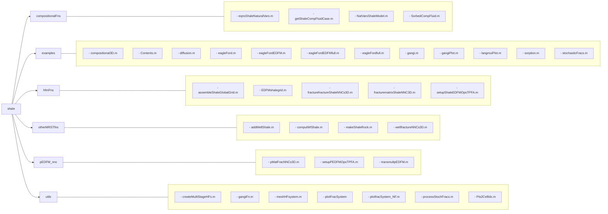

Figure 10.2 This data diagram shows the design of the shale module, as well as the functions and classes modified from the hfm and compositional modules.

the functionalities provided in the `NaturalVariablesCompositionalModel` class in the compositional module to model the shale mechanisms outlined in the previous section. The `NatVarsShaleModel` class uses its `eqnsShaleNaturalVars` method to model the equations that govern flow in UOG reservoirs. Although the examples presented in this chapter use the natural variables approach, the overall composition approach can also be used to model these shale mechanisms by extending the `OverallCompositionCompositionalModel` class instead of the natural variables class.

The shale module also depends on the module for EDFM and provides modifications of some `hfm` functions in the `hfmFns` folder. The functions that are unique to our 3D projection algorithm discussed in Subsection 10.3.2 are stored in the `pEDFM_nnc` folder. Considering that most of the shale mechanisms involve some modification of the `setupEDFMOperatorsTPFA` function in the `hfm` module, we created `setupShaleEDFMOpsTPFA` and `setupShalePEDFMOpsTPFA` to facilitate the integration of these additional physical mechanisms with the EDFM

[https://doi.org/10.1017/9781009019781](https://doi.org/10.1017/9781009019781) Published online by Cambridge University Press

416 O. Olorode, B. Wang, and H. U. Rashid

and pEDFM fracture modeling approaches, respectively. These two functions call `setupEDFMOperatorsTPFA`, before making the additional changes required to implement the shale mechanisms in EDFM and pEDFM. In the next listing, we show how we modify the `s` field returned from `setupEDFMOperatorsTPFA` to make the discrete operators compatible with the 2019b version of MRST:

```matlab
s = setupEDFMOperatorsTPFA(G, G.rock, tol);
n = size(s.N,1);
C = (s.C)'; % transpose it only once for speed
if n == 0
   s.AccDiv = @(acc, flux) acc;
   s.Div = @(x) zeros(G.cells.num, 1);
else
   s.AccDiv = @(acc, flux) acc + C*flux;
   s.Div = @(x) C*x;
end
```

The examples folder contains the MATLAB scripts that can be used to regenerate all of the results presented in this chapter. The `sorption.m`, `diffusion.m`, and `gangi.m` scripts demonstrate how we model these three shale mechanisms. As shown in Section 10.7, they all use the `shaleMechanisms` field to specify the shale mechanism to be modeled. The `otherMRSTfns` folder contains modifications to functions taken from other parts of MRST, and `utils` contains utility functions that are used in the example scripts. To run these examples smoothly, the user is advised to first add the `shale` module and its subfolders to the MATLAB path.

The shale module also depends on the use of ADFNE [1], an open-source toolkit for stochastic fracture network generation. ADFNE requires the Statistics & Machine Learning Toolbox in MATLAB, so we provide the `EagleFordEDFM.mat` and `StochasticFracs.mat` files generated with ADFNE to allow users reproduce our simulation results without installing any toolboxes. The reader is also encouraged to explore the use of the discrete fracture network (DFN) generator in the `hfm` module, as discussed in Chapter 9. We discuss stochastic fracture modeling and its application in a fractured reservoir simulation in Sections 10.5 and 10.6. We also provide Table 10.1 to help readers identify the sources of the different functions discussed throughout this chapter.

To lay a foundation for the discussion of the physical mechanisms implemented in these functions, the next section discusses the governing equations for compositional flow in conventional petroleum reservoirs. Subsequent sections will show how these equations are modified to account for the storage and transport mechanisms expected in UOG reservoirs.

[https://doi.org/10.1017/9781009019781](https://doi.org/10.1017/9781009019781) Published online by Cambridge University Press

Numerical Modeling of Fractured Unconventional Oil and Gas Reservoirs 417

<page_number>

417
</page_number>

Table 10.1 *Location of all functions discussed.*

<table>
  <thead>
    <tr>
        <th>hfm</th>
        <th>shale</th>
        <th>ADFNE</th>
    </tr>
  </thead>
  <tbody>
    <tr>
        <td>EDFMgrid</td>
        <td>processStochFracs</td>
        <td>DFN</td>
    </tr>
    <tr>
        <td>fracturematrixNNC3D</td>
        <td>plotfracSystemNF</td>
        <td>Field</td>
    </tr>
    <tr>
        <td>fracturefractureNNCs3D</td>
        <td>createMultiStageHFs</td>
        <td>Orientation</td>
    </tr>
    <tr>
        <td>setupEDFMOpsTPFA</td>
        <td>setupPEDFMOpsTPFA</td>
        <td>Stereonet</td>
    </tr>
    <tr>
        <td> </td>
        <td>wellfractureNNCs3D</td>
        <td> </td>
    </tr>
    <tr>
        <td> </td>
        <td>pMatFracNNCs3D</td>
        <td> </td>
    </tr>
    <tr>
        <td> </td>
        <td>makeShaleRock</td>
        <td> </td>
    </tr>
  </tbody>
</table>

## 10.3 Compositional Flow and Modeling of Fractured Reservoirs

This section starts with a presentation of the governing equations for compositional flow in conventional petroleum reservoirs. We summarize how these equations are discretized and solved in MRST and provide appropriate references for further details on the numerical solution procedure employed in MRST. We also discuss how the discretized form of the governing equations are modified to model fractured reservoirs with EDFM and pEDFM.

### 10.3.1 Governing Equations for Compositional Flow in Conventional Reservoirs

In this chapter, we consider a petroleum reservoir where the hydrocarborn fluids can exist only in either the liquid or the gas phase. The equation for the conservation of each hydrocarbon species *i* in the oil (liquid) or gas (vapor) phase is given as

$$ \partial_t \left[ \phi (\rho_l S_l X_l^i + \rho_v S_v X_v^i) \right] + \nabla \cdot (\rho_l X_l^i \vec{v}_l + \rho_v X_v^i \vec{v}_v) - (\rho_l X_l^i q_l + \rho_v X_v^i q_v) / V = 0. $$ (10.1)

If an aqueous phase (water) is present, its conservation equation can be written as

$$ \partial_t (\phi \rho_w S_w) + \nabla \cdot (\rho_w \vec{v}_w) - \rho_w q_w / V = 0. $$ (10.2)

In these conservation equations, $\phi$ represents porosity, $\rho_\alpha$ and $S_\alpha$ respectively represent the mass density and saturation of phase $\alpha$, and $X_l^i$ and $X_v^i$ are the mass fractions of each component *i* in the liquid and vapor phases, respectively. The division of the volumetric flow rates ($q_\alpha$) by volume ($V$) ensures that all terms in the equation are dimensionally consistent. Subscripts *w*, *l*, and *v*, refer to the water, liquid, and vapor hydrocarbon phases. Thus, $\vec{v}_w$, $\vec{v}_l$, and $\vec{v}_v$ represent the Darcy velocity for the water, liquid, and vapor hydrocarbon phases, which is defined as

[https://doi.org/10.1017/9781009019781](https://doi.org/10.1017/9781009019781) Published online by Cambridge University Press

418 O. Olorode, B. Wang, and H. U. Rashid

<page_number>

418
</page_number>

$$ \vec{v}_\alpha = -K \frac{k_\alpha(s)}{\mu_\alpha} (\nabla p_\alpha - \rho_\alpha g \nabla z) = -K \lambda_\alpha (\nabla p_\alpha - \rho_\alpha g \nabla z). \tag{10.3} $$

Using the subscript $\alpha$ for the liquid and vapor phases, (10.1) can be rewritten in terms of $X_\alpha^i$ (which is the mass fraction of a component $i$ in phase $\alpha$) as follows:

$$ \partial_t \left[ \phi \sum_{\alpha=l,v} \rho_\alpha S_\alpha X_\alpha^i \right] + \sum_{\alpha=l,v} \nabla \cdot (\rho_\alpha X_\alpha^i \vec{v}_\alpha) - \sum_{\alpha=l,v} \rho_\alpha X_\alpha^i q_\alpha / V = 0. \tag{10.4} $$

Here, the three terms on the left-hand side of the equation (which are the accumulation, flux, and source/sink terms, respectively) are expressed as a sum over each phase, $\alpha$. The capillary pressure definitions, as well as saturation and composition constraints (that is, saturations and compositions sum up to one) are also applied to the governing equations. The primary variables selected depend on the mathematical formulation used for the simulation. Although we can use either the natural variables formulation [4] or the overall composition variables formulation [5] in MRST as discussed in Chapter 8, we focus on the use of the natural variables in this chapter. This approach involves the use of pressure, phase saturation(s), and phase composition of each component as the primary variables. Voskov and Tchelepi [33] provides further details and other alternative formulations for compositional simulation, and Møyner and Tchelepi [23] gives more details on the governing equations, their discretization, and numerical solution procedure.

## 10.3.2 Modeling of Fractured Reservoirs in MRST

Depending on whether each individual fracture in a fractured reservoir is modeled or not, we can classify the modeling approach into three broad groups (see also discussion in Chapter 11):

1. **Effective medium models:** These fracture models represent a fractured system with an effective medium. They include the dual-porosity, dual-permeability, and multicontinuum models [30, 34]. They are computationally faster than the discrete models but are based on the assumption that the reservoir is densely fractured and has homogeneous fracture properties. This limits their application in UOG reservoirs, which could have a heterogeneous fracture distribution and fractures with very different lengths, apertures, permeabilities, orientations, etc.

2. **Discrete models:** These models account for each individual fracture in the reservoir. They include the full-dimensional model, discrete fracture model (DFM) [14, 15], EDFM [19], pEDFM [32], etc. The added flexibility of modeling each fracture explicitly makes these models more computationally expensive.

[https://doi.org/10.1017/9781009019781](https://doi.org/10.1017/9781009019781) Published online by Cambridge University Press

*Numerical Modeling of Fractured Unconventional Oil and Gas Reservoirs* 419 <page_number>419</page_number>

Considering the importance of modeling the multiscale fractures in UOG reservoirs accurately, we focus on these DFMs in this chapter. To clarify, even though we use the term "discrete fracture models" in this chapter, we also model the reservoir matrix.

3. **Hybrid models:** These fracture models combine some form of effective medium modeling with a DFM. Examples include the multiple subregion model [8], multilevel DFMs [9, 20], etc.

### Full-Dimensional Modeling

This is the most direct approach to model fractures. It involves a full volumetric representation that subdivides each fracture into cells in the same way the matrix is subdivided into cells. Cells that make up the fractures are referred to as fracture cells, whereas those that make up the matrix are referred to as matrix cells. The properties (such as porosity and permeability) of all of the fracture cells are set to the corresponding property for that fracture. For a 3D reservoir simulation domain, the fracture cells are also three-dimensional. Therefore, for a vertical fracture that is parallel to the $(y,z)$-plane, the width of each fracture cell in the $x$-direction ($\Delta x$) is specified as the fracture aperture. The full-dimensional model is the most computationally expensive of all of the fracture models because it requires the largest number of $n$-dimensional cells (where $n$ is the number of dimensions of the reservoir domain). In most cases, the large number of cells, the small fracture apertures, and their typically high permeabilities make such models computationally intractable.

### Embedded Discrete Fracture Modeling

EDFM involves gridding the matrix and fractures independently of each other. For an $n$-dimensional model, the matrix cells will be $n$-dimensional, whereas the fracture cells are of dimension $n - 1$. The lower dimensionality of the fracture cells and its independent gridding give the flexibility to embed one or more fracture cells within a matrix cell. To account for the flow of fluids between the matrix and fracture cells, the governing equations presented in Subsection 10.3.1 are modified to include an additional source/sink term, which is implemented like the non-neighboring source/sink terms in commercial reservoir simulators. Chapter 9 provides a detailed discussion on the EDFM and how it is implemented in the `hfm` module.

Although EDFM is more computationally efficient than the full-dimensional and discrete fracture models, it is limited by its inability to accurately capture the effects of low conductivity or sealing faults/fractures on flow. Although UOG reservoirs have low matrix permeabilities, it could be misleading to treat all natural fractures

[https://doi.org/10.1017/9781009019781](https://doi.org/10.1017/9781009019781) Published online by Cambridge University Press

<page_number>420</page_number>

O. Olorode, B. Wang, and H. U. Rashid

as having high conductivity given that many of these fractures are no longer active in the current stress state of the rock. By the critically stressed fault hypothesis, faults that are mechanically alive or active act as conduits for fluid flow, whereas inactive faults act as barriers to flow [38]. To address the inaccuracy of the EDFM in modeling low-conductivity fractures, Tene ¸ et al. [32] developed the pEDFM, which is discussed in the next subsection.

*Projection-Based Embedded Discrete Fracture Modeling*

The pEDFM basically modifies EDFM by adding two more types of non-neighboring connections (NNCs). It involves projecting the fracture cells into some of its neighboring matrix cells and computing the additional transmissibilities introduced as a result of this projection. Jiang and Younis [13] presented an algorithm to find the matrix cells into which the fracture cells will be projected. Their algorithm only applies to 2D or extruded 2D (2.5D) systems, where all fractures have to be perfectly vertical. In Olorode et al. [27], we presented a 3D pEDFM algorithm that provides the capability of modeling fractures with any arbitrary orientation in 3D space. This algorithm was developed for structured hexahedral meshes for the matrix but could be extended for use with corner-point grids. The general idea in pEDFM is to project a fracture in a cell into three of the six neighbors of the matrix cell in which the fracture is located. The matrix cell that hosts the fracture is referred to as the "host matrix cell," whereas the neighboring cells into which the fracture is projected are referred to as the "projection matrix cells." Fracture cells within a host matrix cell are referred to as "interior fracture cells." In the rare cases where fractures lie at the interface between two matrix cells, pEDFM simplifies into the DFM [32].

Figure 10.3 shows the flowchart for the 3D pEDFM algorithm, as presented in Olorode et al. [27]. It starts with a loop that estimates the distances between all interior fracture centroids and the six faces of their host matrix cells. Because these are hexahedral grids, the algorithm compares each pair of distances in the same spatial direction. For instance, we chose one projection face out of either the left or right face (in the $x$-direction). Depending on the computed values of the six distances, we could have a total of four possible scenarios. In all four cases, whenever a fracture cell is closer to one of a pair of faces in more than one spatial direction, the closer of the pair of faces is selected. We then compute the area that the fracture projects on each of the selected projection faces (called projection area) and its corresponding transmissibility (called projection transmissibility). We summarize each of these four cases here but refer to Olorode et al. [27] for more details and graphical examples of these cases.

[https://doi.org/10.1017/9781009019781](https://doi.org/10.1017/9781009019781) Published online by Cambridge University Press

Numerical Modeling of Fractured Unconventional Oil and Gas Reservoirs 421

<page_number>

421
</page_number>

```mermaid
graph TD
    Start((start)) --> Pick[Pick first/next interior fracture cell]
    Pick --> Dist[Compute distance betweenfracture and all 6 cell faces]
    Dist --> Comp[Compare fracture distances of pairof faces in each of x,y,z directions]
    Comp --> Select[For directions with non-equidistant pair of faces, selectthe face closer to the fracture]
    Select --> Area[Compute area & transmissibilityfor all selected faces]
    Area --> Equi{Any equidistantpair of faces?}
    Equi -- No --> Proc
    Equi -- Yes --> Num{Number ofequidistant pairs offaces}
    
    Num -- 1 --> F1[Find the 2 nodes commonto the 2 faces selected]
    F1 --> S1[Select the node that isfarther from the fractureplane out of these 2]
    S1 --> T1[The face that con-tains this selected nodeis the projected face]
    T1 --> Area2
    
    Num -- 2 --> F2[Find the direction of the selected face]
    F2 --> S2[Find the index of the far-thest node (of the selectedface) from the fracture plane]
    S2 --> T2[Find other 2 projection faces us-ing selected direction and index(from the 2 steps above) in Table 10.1]
    T2 --> Area2
    
    Num -- 3 --> F3[Randomly select one face (e.g.,left face). This gives face direction]
    F3 --> S3[Find the index of the far-thest node (of the selectedface) from the fracture plane]
    S3 --> T3[Find other 2 projection faces us-ing selected direction and index(from the 2 steps above) in Table 10.1]
    T3 --> Area2
    
    Area2[Compute area and transmissibil-ity for projected matrix/fractureNNCs that have not been computed] --> Proc{Processed allfractures?}
    
    Proc -- No --> Pick
    Proc -- Yes --> End((End))
```

Figure 10.3 The proposed algorithm automatically determines the three neighboring cells, whose transmissibilities and connection areas need to be modified in 3D pEDFM.

– **No pair of equidistant faces in any spatial direction:** When a fracture cell is closer to one of a pair of faces in all three directions, we select the three projection cells (based on proximity to the fracture centroid). We then compute the projection areas and transmissibilities for all three selected projection faces using the equations presented in the next section. The algorithm then proceeds to the next fracture cell.

[https://doi.org/10.1017/9781009019781](https://doi.org/10.1017/9781009019781) Published online by Cambridge University Press

422 O. Olorode, B. Wang, and H. U. Rashid

Table 10.2 Selection of remaining two faces based on a combination of the node index and the direction of the only selected face.

<table>
  <thead>
    <tr>
        <th>Node index</th>
        <th>Face 1</th>
        <th>Face 2</th>
        <th>Face 1</th>
        <th>Face 2</th>
        <th>Face 1</th>
        <th>Face 2</th>
    </tr>
  </thead>
  <tbody>
    <tr>
        <td>1</td>
        <td>Front</td>
        <td>Bottom</td>
        <td>Left</td>
        <td>Bottom</td>
        <td>Left</td>
        <td>Front</td>
    </tr>
    <tr>
        <td>2</td>
        <td>Back</td>
        <td>Bottom</td>
        <td>Left</td>
        <td>Top</td>
        <td>Right</td>
        <td>Front</td>
    </tr>
    <tr>
        <td>3</td>
        <td>Back</td>
        <td>Top</td>
        <td>Right</td>
        <td>Top</td>
        <td>Right</td>
        <td>Back</td>
    </tr>
    <tr>
        <td>4</td>
        <td>Front</td>
        <td>Top</td>
        <td>Right</td>
        <td>Bottom</td>
        <td>Left</td>
        <td>Back</td>
    </tr>
  </tbody>
</table>

- **One equidistant pair of faces in one of the three spatial directions:** Because there is only one equidistant pair of faces, we readily determine two projection faces based on the proximity to the fracture centroid and compute their corresponding projection areas and transmissibilities. We then find which of the two nodes common to the selected projection faces is farther from the fracture plane and select the third projection face as the one that contains this shared node. The last step in this case is to compute the area and transmissibility for the third projection face and continue with the next interior fracture cell.

- **Two equidistant pairs of faces:** We determine one projection face based on the proximity to the fracture centroid and compute its corresponding projection area and transmissibility. We then find which of the four nodes of this selected projection face is farthest from the fracture plane and combine this with the direction of the selected face to select the other two projection faces. We use Table 10.2 to facilitate the selection of the projection faces and ensure that they do not meet along the path of the fracture plane; see Olorode et al. [[27]](reference_27). For each cell, the faces are ordered from face 1 to face 6, representing the left, right, front, back, top, and bottom faces, respectively. The algorithm continues with the computation of the area and transmissibility for these two newly selected (second and third) faces before proceeding to the next interior fracture cell.

- **Three equidistant pairs of faces:** We randomly select one face as the projection face and compute its projection area and transmissibility. The rest of the algorithm in this case then becomes identical to that of the previous case with two equidistant pairs of faces.

The algorithm discussed in this section has been implemented as a function named `pMatFracNNCs3D` within the shale module. This module leverages the EDFM functionality that is already built into the `hfm` module. The additional code needed to implement the 3D pEDFM involves the computation of the transmissibilities for two distinct groups of NNCs that are absent in EDFM. These two pEDFM NNCs are discussed in the next subsection.

[https://doi.org/10.1017/9781009019781](https://doi.org/10.1017/9781009019781) Published online by Cambridge University Press

Numerical Modeling of Fractured Unconventional Oil and Gas Reservoirs 423

<page_number>

423
</page_number>

### 10.3.3 The pEDFM Transmissibilities

In this subsection, we discuss the two additional NNC transmissibilities that are required in the pEDFM model. These are the transmissibilities between projection matrix cells and fracture cells (referred to as the projection matrix/fracture transmissibilities) and those between projection matrix cells and host matrix cells (referred to as the projection matrix/matrix transmissibilities).

**Projection Matrix/Fracture Transmissibility** The projection matrix/fracture transmissibility ($T_{pMF}$) is expressed as [32]

$$ T_{pMF} = \frac{A_{\perp x} K_{pMF}}{d_{pMF}}, $$ (10.5)

where

$$ K_{pMF} = \frac{K_{pM} K_f}{K_{pM} + K_f}. $$ (10.6)

Here, $K_{pMF}$ represents the harmonic average of the projection matrix and fracture cell permeabilities, $d_{pMF}$ represents the distance between the centroid of the fracture and that of the projection cell, and $A_{\perp x}$ is the area of the fracture projection along each dimension. The projection matrix/fracture transmissibility is computed in the `computeNNCprojAreanTrans` function, which is provided in `pMatFracNNCs3D`.

**Projection Matrix/Matrix Transmissibility** The projection matrix/matrix transmissibility ($T_{pMM}$) is given as

$$ T_{pMM} = K \frac{A - A_{\perp x}}{\Delta \vec{x}_e}. $$ (10.7)

In (10.7), $\Delta \vec{x}_e$ refers to the cell sizes in all three spatial directions, $A$ refers to the area of the face between the projection and the host matrix cells, and $A_{\perp x}$ refers to the projection area. When the interior fracture cell fully intersects the host matrix cell and is parallel to the interface between the projection and host matrix cells, the projection area obtains its maximum value and is equal to $A$. It reduces to zero as the orientation of the interior fracture cell becomes perpendicular to the interface between the projection and host matrix cells.

To simplify the computation of $T_{pMM}$ in MRST, we take advantage of the standard matrix–matrix transmissibilities ($T_{MM}$) already computed as

$$ T_{MM} = K \frac{A}{\Delta \vec{x}_e}. $$ (10.8)

[https://doi.org/10.1017/9781009019781](https://doi.org/10.1017/9781009019781) Published online by Cambridge University Press

424 O. Olorode, B. Wang, and H. U. Rashid

Combining this with (10.7) yields

$$ T_{pMM} = T_{MM} \frac{A - A_{\perp x}}{A} . $$ (10.9)

The fractional term in this equation is implemented as a transmissibility multiplier, as shown in the last couple of lines in the `transmultpEDFM.m` script:

```matlab
oldArea = newarealist(globalFaceIdx); % denominator in eq (9)
newArea = oldArea - projectedArea;    % numerator in eq (9)
newArea(newArea<tol) = 0;             % zeros out very small areas
newarealist(globalFaceIdx) = newArea; % broadcasting numerator to T array
transmultp = newarealist./oldarealist; % fraction in eq (9)
```

The transmissibility multiplier computed in `transmultpEDFM` is then multiplied with the EDFM transmissibility multiplier that is computed in the `transmultEDFM` function of the `hfm` module. This is implemented in `setupPEDFMOpsTPFA` as shown:

```matlab
T = getFaceTransmissibility(G, rock, opt.deck);
transmultMFM = transmultEDFM(G,tol);     % EDFM NNCs already implemented
transmultpMM = transmultpEDFM(G,tol);    % pEDFM update: compute T_pM-M mults
T = T.*transmultMFM.*transmultpMM;       % pEDFM update: using the multipliers
s.T_all = T; % T_all will not contain nnc transmissibilities
T = [T; G.nnc.T]; % modified line
T = T(intInx);
```

The next section shows how to perform a compositional simulation of fractured reservoirs using a combination of both the `compositional` and `hfm` modules.

## 10.4 EDFM and Compositional Simulation in MRST

The objective of this section is to provide a tutorial on how to perform a simple compositional simulation of a reservoir with only three fractures. The idea is to provide the reader with the fundamentals required to simulate more complex and realistic compositional fractured reservoirs. Figure 10.4 presents the simplistic scenario to be simulated in this section. It shows the location of a water injection and a production well at two diagonally opposite edges of the simulation domain. The injection well injects 100% water at a constant rate, whereas the production well produces the reservoir fluid at a constant flowing bottom-hole pressure. The hydrocarbon fluid simulated is a two-component mixture of 90% n-decane and 10% CO<sub>2</sub>. To facilitate further compositional studies of recovery processes

[https://doi.org/10.1017/9781009019781](https://doi.org/10.1017/9781009019781) Published online by Cambridge University Press

Numerical Modeling of Fractured Unconventional Oil and Gas Reservoirs 425

3D structured mesh with three yellow fracture planes and vertical red injection/production wells

Figure 10.4 The three yellow planes represent the fractures in the 3D structured mesh of the simulation domain. The injection and production wells are shown as the vertical red lines at two corners of the simulation domain.

(like EOR/IOR) in UOG reservoirs, the complete code for this simplistic case is included as `compositional3D.m` in the examples folder. For instance, an interested reader could replace the water in the injection well with a lean gas or replace the simplistic fractures with the stochastic fractures discussed in the next section.

The simple case discussed here starts by loading the required modules:

```
mrstModule add compositional hfm;
```

**Select fluid composition and compute surface densities:** The first line of Listing 10.1 shows how to select the multicomponent fluid for compositional simulation. The compositional module provides a `getBenchmarkMixture` function that facilitates the specification of the composition, chemical properties, and initial conditions of the multicomponent hydrocarbon mixture to be simulated. The function is generic enough to allow the simulation of single hydrocarbon components,

Listing 10.1 *Create single cell model with selected composition.*

```matlab
casename = 'verysimple'; % Simple 2-component fluid
%% Create a single-cell model with a given initial composition
[fluid, info] = getBenchmarkMixture(casename);
eosname = 'pr';          % Select the Peng-Robinson equation of state
G1cell = cartGrid([1 1],[1 1]); % Create a single-cell grid
G1cell = computeGeometry(G1cell);
EOSModel = EquationOfStateModel(G1cell, fluid, eosname);
```

[https://doi.org/10.1017/9781009019781](https://doi.org/10.1017/9781009019781) Published online by Cambridge University Press

426 O. Olorode, B. Wang, and H. U. Rashid

<page_number>

426
</page_number>

as well as fluid mixtures with tens of hydrocarbon components. To speed up the simulation runs in this section, we simulate the flow of a simple fluid that is made up of 10% CO<sub>2</sub> and 90% n-decane. The fluid is specified via a casename called `'verysimple'`, which is defined in the `getBenchmarkMixture` function. We use the Peng–Robinson equation of state [29] to compute the fluid properties such as phase compressibility factors (Z) and densities.

To convert the reservoir fluid volumes to volumes at surface conditions, we flash the selected fluid composition to surface conditions in a single-cell model and obtain the surface densities of the oil and gas phases (as shown in Listing 10.2). The reader is reminded that formation volume factor can be expressed as the ratio of the surface densities to the corresponding densities at reservoir conditions.

Listing 10.2 *Flash fluid in single-cell model to surface conditions.*

```matlab
%Surface Conditions
p_sc = 101325; % atmospheric pressure
T_sc = 288.706; % 60 Farenheit
[~, ~, ~, ~, ~, rhoO_S, rhoG_S] = ...
            standaloneFlash(p_sc, T_sc, info.initial, EOSModel);
flowfluid = initSimpleADIFluid('phases', 'WOG', 'n', [2, 2, 2], ...
                              'rho', [1000, rhoO_S, rhoG_S]);
```

**Select compositional formulation to be used:** Listing 10.3 shows how to use the natural variables approach for compositional simulation. To prevent the use of the standard two-point approach to calculate the transmissibilities, we do not provide a second argument to `setupShaleEDFMOpsTPFA`. Note that we use our own function instead of `setupEDFMOperatorsTPFA` from the `hfm` module because our modification makes the function compatible with the 2019b version of MRST, as discussed in Section 10.2.

Listing 10.3 *Use the natural variables formulation.*

```matlab
model = NaturalVariablesCompositionalModel(G, [], flowfluid, ...
fluid, 'water', true);
% Setup TPFA operators that incorporate all the EDFM NNCs
model.operators = setupShaleEDFMOpsTPFA(G, G.rock, tol);
```

**Specify the initial composition of the injection/production wells:** We provide the initial composition of the injected and produced fluids after the definition of the injector and producer. The actual composition of the fluid produced will be

[https://doi.org/10.1017/9781009019781](https://doi.org/10.1017/9781009019781) Published online by Cambridge University Press

Numerical Modeling of Fractured Unconventional Oil and Gas Reservoirs 427
<page_number>427</page_number>

determined based on the thermodynamics and flow processes implemented in the reservoir simulator. The last line of the code listing shows how to initialize a compositional reservoir model using the `initCompositionalState` function:

```matlab
W(1).components = info.injection; % obtained from getBencharkMixture
W(2).components = info.initial;
%% Set up initial state and schedule
s0 = [0, 1, 0];
state = initCompositionalState(G, pRef, info.temp, s0, info.initial, ...
    model.EOSModel);
```

**Simulation results:** Figure 10.5 presents the pressure and ternary (water, gas, and oil) saturation profiles after simulating production, and water injection for three and a half years. These profiles show a marked change in the pressure and saturations near the surfaces of the fractures modeled. This is because the fractures act as the paths of least resistance to flow, and they accelerate the rate of flow of the injected water toward the production well. Although we modeled only three fractures in this section, real fractured reservoirs can have hundreds or thousands of natural fractures with any orientation in a 3D space. The next section discusses how to generate such realistic fractures using a stochastic approach.

Pressure and saturation profiles showing fracture effects

Figure 10.5 The pressure (top) and overall saturation (bottom) profiles after three and a half years of production show the effect of the fractures on the flow of fluids.

[https://doi.org/10.1017/9781009019781](https://doi.org/10.1017/9781009019781) Published online by Cambridge University Press

428 O. Olorode, B. Wang, and H. U. Rashid

# 10.5 Stochastic Generation of Fractures with Arbitrary Orientations in 3D

Considering that there is no technology available to determine the exact location of all natural fractures in the subsurface, we could evaluate the effect of the uncertainties in the fracture location and orientation by generating several realizations of the fracture network. This section shows how to generate such realistic stochastic fracture networks in 3D using an open-source MATLAB code called ADFNE. Our pEDFM example codes assume that ADFNE has been added to the MATLAB path. To minimize MATLAB crashes on the Windows platform, the user is also advised to delete the `R2015a` folder within the ADFNE folder. Alghalandis [1] provides a comprehensive tutorial on the stochastic generation of fractures using ADFNE. The `Demo.m` file in the ADFNE folder illustrates virtually all of the functionality available in this package. Our goal in this section is to show the modifications required to use the stochastic fractures from ADFNE in the `hfm` and `shale` modules.

## 10.5.1 Generation of Fracture Sets Using ADFNE

We start by demonstrating how to generate two sets of natural fractures with 350 fractures each. The complete code is available as `stochasticFracs.m` in the `examples` folder. The first fracture set contains fractures with a dip angle and a dip direction of 45°, and the second contains fractures with a dip angle of 45° and a dip direction of 315° (or −45°). As illustrated in Figure 10.6, the dip angle is the acute angle that a rock surface makes with a horizontal plane, whereas the dip direction is the azimuth of the direction of the dip, as projected to the horizontal.

Illustration of fracture surface geometry showing strike, dip direction (135°), and dip angle (45°).

Figure 10.6 Illustration of the dip (angle) and dip direction of a fracture or fault surface.

[https://doi.org/10.1017/9781009019781](https://doi.org/10.1017/9781009019781) Published online by Cambridge University Press

Numerical Modeling of Fractured Unconventional Oil and Gas Reservoirs 429

<page_number>429</page_number>

In the code excerpt, the `DFN` function generates random DFNs when no arguments are provided and customizes the fracture networks when the function arguments are given. The `Field` function takes two arguments: a DFN and a field that is set to either `line` (for 2D models) or `poly` (for 3D models). In the `DFN` function arguments, `dim` is the number of dimensions modeled, `n` is the number of fractures, `dip` is the dip angle, and `dir` is the dip direction. The minimum, mean, and maximum lengths (used in the exponential distribution for the lengths) of each of these fractures in any direction are set to 4, 10, and 30 m, respectively (`'minl',4,'mu',10,'maxl',30`). All fractures are constrained to lie within the reservoir domain, which is specified with a bounding box (`bbx`). Considering that the pEDFM algorithm requires each matrix cell that hosts a fracture (called "host matrix cell") to have six neighbors, we prevent the fractures from touching the reservoir boundary by starting the minimum spatial coordinate from a very small value (`tol=0.01`) instead of the origin. This tolerance value is also subtracted from the maximum values of the spatial coordinate of the box:

```
tol = 0.01;
physdim = [3300 1300 250]*ft;
set1 = Field(DFN('dim',3,'n',350,'dir',45,'ddir',-100,'minl',4,'mu',10, ...
       'maxl',30,'bbx',[tol,tol,tol,physdim(1)-tol, ...
       physdim(2)-tol,physdim(3)-tol],'dip',45,'ddip',-100, ...
       'shape','l','q',4),'Poly');
set2 = Field(DFN('dim',3,'n',350,'dir',-45,'ddir',-100,'minl',4,'mu',10, ...
       'maxl',30,'bbx',[tol,tol,tol,physdim(1)-tol, ...
       physdim(2)-tol,physdim(3)-tol],'dip',45,'ddip',-100, ...
       'shape','l','q',4),'Poly');
[set1_,nonPlanarSets1,fracArea1] = processStochFracs(set1);
```

The `processStochFracs` function used in the last line of the code excerpt provides a robust test for coplanarity and removes unrealistic fractures that either have negligible areas or appear as lines (instead of planes). This is needed because the EDFM and pEDFM codes presented herein require the vertices of each fracture to be coplanar. To allow the orientation of fractures to vary, we provide `ddip` and `ddir` as function arguments that control the degree of the variation in the dip and dip directions, respectively. The degree of variation in the fracture orientation increases as the magnitudes of these two negative numbers increase. We set both variables to –100 and use `plotfracSystemNF` to plot the resulting fracture network and wellbore trajectories in Figure 10.7. The `plotfracSystemNF` function extends the plotting functionality in MRST to allow us plot the wellbore trajectories and hydraulic and natural fractures with custom colors as shown in Figures 10.7 and 10.10. The yellow-colored fractures in

[https://doi.org/10.1017/9781009019781](https://doi.org/10.1017/9781009019781) Published online by Cambridge University Press

430 *O. Olorode, B. Wang, and H. U. Rashid*

3D visualization of two fracture sets in a rectangular volume, with yellow and blue colored planes.

Figure 10.7 This figure illustrates the two fracture sets created. The 350 fractures in the first fracture set are colored yellow, and the remaining 350 fractures in the second fracture set are colored blue.

Figure 10.7 belong to the first fracture set, whereas the blue-colored fractures belong to the second. We compute the dip and dip direction of the two fracture sets using the `Orientation` function and plot these using the `Stereonet` function from ADFNE:

```matlab
plotfracSystemNF(G, fracplanes, numHFplanes, wells, 'label', false)
o = Orientation([set1;set2]); % extract and store dip angle and direction
figure,
Stereonet([o.Dip],[o.Dir],'density',true,'marker','*','ndip',6,...
           'ndir',24,'cmap',@jet,'color','y');
```

This yields the stereonet in Figure 10.8, which is similar to a scatterplot in the sense that it plots the dip and dip direction of each fracture as a point (with a yellow asterisk). The red and blue colors in this stereonet indicate the relative number of fractures in each segment of the stereonet. The red (or hotter) colors indicate the segments with the largest number of fractures, whereas the blue (or cooler) colors indicate the segments with fewer fractures. As seen in the figure, the white segments are the regions of the stereonet with no fractures. In this stereonet, a positive dip direction is read starting from the 0° point and moving in a counter-clockwise direction, whereas the dip angle starts out from the circumference of the outermost circle and increases to a maximum of 90° in the center of the circle. The stereonet allows us to summarize the orientation of all of the fractures in the system in one simple plot. The reader is encouraged to modify the dip, dip direction, and their degrees of variation and observe the change in the orientation of the fractures in both Figures 10.7 and 10.8. The next section shows how we model an Eagle Ford shale oil reservoir using natural fracture networks generated as described in this section.

[https://doi.org/10.1017/9781009019781](https://doi.org/10.1017/9781009019781) Published online by Cambridge University Press

*Numerical Modeling of Fractured Unconventional Oil and Gas Reservoirs* 431

<page_number>

431
</page_number>

Stereonet showing fracture orientation variation with yellow asterisks and red/blue segments

Figure 10.8 This stereonet shows the limited variation in the orientation of the fractures in the two fracture sets modeled. Each yellow asterisk represents a fracture, whereas the red and blue segments indicate the regions with the most and fewest number of fractures, respectively.

## 10.6 Applications of 3D pEDFM to Model UOG Reservoirs

This section discusses how to model unconventional reservoirs (with hundreds of natural fractures in any orientation) using the 3D pEDFM algorithm recently presented by Olorode et al. [[27]](https://doi.org/10.1017/9781009019781). Although we only model a realization from a stochastic fracture network, our goal is to show how the `shale` module can be used to predict the production corresponding to any realization from a stochastic fracture model. This could then be used to study and evaluate the sensitivity of model forecasts to the uncertainty in the amount, distribution, geometry, and orientation of these natural fractures.

### 10.6.1 Basic Model Parameters Representative of the Eagle Ford Shale

Most of the model parameters presented in this section were taken from Yu et al. [[37]](https://doi.org/10.1017/9781009019781). Table 10.3 summarizes the well, matrix, and fracture properties, and Tables 10.4 and 10.5 present the compositional data and binary interaction constants, respectively. These parameters are used in the Peng–Robinson equation of state [[29]](https://doi.org/10.1017/9781009019781), which is implemented in the `compositional` module. To obtain a high-resolution discretization of the simulation domain, we take advantage of the symmetry observed in bi-wing planar hydraulic fractures. The idea is that we can represent the multiply fractured horizontal well system with a smaller repeatable fraction of the entire domain, called a "stencil." Figure 10.9 illustrates the stencil

[https://doi.org/10.1017/9781009019781](https://doi.org/10.1017/9781009019781) Published online by Cambridge University Press

432 O. Olorode, B. Wang, and H. U. Rashid

Table 10.3 *Representative Eagle Ford shale parameters.*

<table>
  <thead>
    <tr>
        <th>Parameters</th>
        <th>SI units</th>
        <th>Field units</th>
    </tr>
  </thead>
  <tbody>
    <tr>
        <td>Stencil model dimension</td>
        <td>150 × 300 × 38.1 m</td>
        <td>492.1 × 984.3 × 125.0 ft</td>
    </tr>
    <tr>
        <td>Initial reservoir pressure, pi</td>
        <td>5.6 · 10⁷ Pa</td>
        <td>8 125 psia</td>
    </tr>
    <tr>
        <td>Reservoir temperature, T</td>
        <td>405.4 K</td>
        <td>270°F</td>
    </tr>
    <tr>
        <td>Reservoir thickness, h</td>
        <td>76.2 m</td>
        <td>250.0 ft</td>
    </tr>
    <tr>
        <td>Matrix permeability, Km</td>
        <td>8.88 · 10⁻¹⁹ m²</td>
        <td>9 · 10⁻⁷ D</td>
    </tr>
    <tr>
        <td>Matrix porosity, φ</td>
        <td>0.12</td>
        <td>0.12</td>
    </tr>
    <tr>
        <td>Hydraulic fracture porosity, φfrac</td>
        <td>0.5</td>
        <td>0.5</td>
    </tr>
    <tr>
        <td>Hydraulic fracture half-length, x f</td>
        <td>180 m</td>
        <td>590.6 ft</td>
    </tr>
    <tr>
        <td>Hydraulic fracture aperture, wf</td>
        <td>0.003 m</td>
        <td>0.01 ft</td>
    </tr>
    <tr>
        <td>Hydraulic fracture height, hf</td>
        <td>45.7 m</td>
        <td>150 ft</td>
    </tr>
    <tr>
        <td>Hydraulic fracture permeability</td>
        <td>9.87 · 10⁻¹³ m²</td>
        <td>1.0 D</td>
    </tr>
    <tr>
        <td>Natural fracture aperture</td>
        <td>1 · 10⁻⁷ m</td>
        <td>3.28 · 10⁻⁷ ft</td>
    </tr>
    <tr>
        <td>Conductive natural fracture permeability</td>
        <td>9.87 · 10⁻¹⁷ m²</td>
        <td>1 · 10⁻⁴ D</td>
    </tr>
    <tr>
        <td>Sealing natural fracture permeability</td>
        <td>9.87 · 10⁻²² m²</td>
        <td>1 · 10⁻⁹ D</td>
    </tr>
    <tr>
        <td>Number of fracture stages</td>
        <td>7</td>
        <td>7</td>
    </tr>
    <tr>
        <td>Number of fractures per stage</td>
        <td>3</td>
        <td>3</td>
    </tr>
    <tr>
        <td>Cluster spacing</td>
        <td>10 m</td>
        <td>32.8 ft</td>
    </tr>
    <tr>
        <td>Fracture spacing</td>
        <td>150 m</td>
        <td>492.13 ft</td>
    </tr>
    <tr>
        <td>Well radius, rw</td>
        <td>0.1 m</td>
        <td>0.33 ft</td>
    </tr>
    <tr>
        <td>Initial water saturation, Sw</td>
        <td>0.17</td>
        <td>0.17</td>
    </tr>
    <tr>
        <td>Flowing bottom-hole pressure, pwf</td>
        <td>6.895 · 10⁶ Pa</td>
        <td>1 000 psia</td>
    </tr>
    <tr>
        <td>Number of natural fractures</td>
        <td>150</td>
        <td>150</td>
    </tr>
    <tr>
        <td>Well length</td>
        <td>920 m</td>
        <td>3 018.4 ft</td>
    </tr>
  </tbody>
</table>
<table>
  <thead>
    <tr>
      <th>Table 10.4</th>
      <th>Compositional data</th>
      <th></th>
      <th>for Eagle Ford shale oil.</th>
      <th></th>
      <th></th>
      <th></th>
      <th></th>
    </tr>
    <tr>
      <th></th>
      <th>Critical</th>
      <th>Critical</th>
      <th>Critical</th>
      <th>Molar</th>
      <th></th>
      <th></th>
      <th></th>
    </tr>
    <tr>
      <th></th>
      <th>Mole pressure</th>
      <th>temperature</th>
      <th>volume</th>
      <th>weight (g/g</th>
      <th>Acentric</th>
      <th></th>
      <th></th>
    </tr>
    <tr>
      <th>Components</th>
      <th>fraction (atm)</th>
      <th>(K)</th>
      <th>(L/mol)</th>
      <th>mol)</th>
      <th>factor</th>
      <th>Parachor</th>
      <th></th>
    </tr>
  </thead>
  <tbody>
    <tr>
      <td>CO<sub>2</sub></td>
      <td>0.01183</td>
      <td>72.80</td>
      <td>304.20</td>
      <td>0.0940</td>
      <td>44.01</td>
      <td>0.2250</td>
      <td>78.0</td>
    </tr>
    <tr>
      <td>N<sub>2</sub></td>
      <td>0.00161</td>
      <td>33.50</td>
      <td>126.20</td>
      <td>0.0895</td>
      <td>28.01</td>
      <td>0.0400</td>
      <td>41.0</td>
    </tr>
    <tr>
      <td>C<sub>1</sub></td>
      <td>0.11541</td>
      <td>45.40</td>
      <td>190.60</td>
      <td>0.0990</td>
      <td>16.04</td>
      <td>0.0080</td>
      <td>77.00</td>
    </tr>
    <tr>
      <td>C<sub>2</sub>−C<sub>5</sub></td>
      <td>0.26438</td>
      <td>36.50</td>
      <td>274.74</td>
      <td>0.2293</td>
      <td>52.02</td>
      <td>0.1723</td>
      <td>171.07</td>
    </tr>
    <tr>
      <td>C<sub>6</sub>−C<sub>10</sub></td>
      <td>0.38089</td>
      <td>25.08</td>
      <td>438.68</td>
      <td>0.3943</td>
      <td>103.01</td>
      <td>0.2839</td>
      <td>297.42</td>
    </tr>
    <tr>
      <td>C<sub>11+</sub></td>
      <td>0.22588</td>
      <td>17.55</td>
      <td>740.29</td>
      <td>0.8870</td>
      <td>267.15</td>
      <td>0.6716</td>
      <td>661.45</td>
    </tr>
  </tbody>
</table>

[https://doi.org/10.1017/9781009019781](https://doi.org/10.1017/9781009019781) Published online by Cambridge University Press

Numerical Modeling of Fractured Unconventional Oil and Gas Reservoirs 433

Table 10.5 *Binary interaction constants for Eagle Ford shale oil.*

<table>
  <thead>
    <tr>
        <th> </th>
        <th>CO<sub>2</sub></th>
        <th>N<sub>2</sub></th>
        <th>C<sub>1</sub></th>
        <th>C<sub>2</sub>–C<sub>5</sub></th>
        <th>C<sub>6</sub>–C<sub>10</sub></th>
        <th>C<sub>11+</sub></th>
    </tr>
  </thead>
  <tbody>
    <tr>
        <td>CO<sub>2</sub></td>
        <td>0</td>
        <td>0.0200</td>
        <td>0.1030</td>
        <td>0.1299</td>
        <td>0.1500</td>
        <td>0.1500</td>
    </tr>
    <tr>
        <td>N<sub>2</sub></td>
        <td>0.0200</td>
        <td>0</td>
        <td>0.0310</td>
        <td>0.0820</td>
        <td>0.1200</td>
        <td>0.1200</td>
    </tr>
    <tr>
        <td>C<sub>1</sub></td>
        <td>0.1030</td>
        <td>0.0031</td>
        <td>0</td>
        <td>0.0174</td>
        <td>0.0462</td>
        <td>0.1110</td>
    </tr>
    <tr>
        <td>C<sub>2</sub>–C<sub>5</sub></td>
        <td>0.1299</td>
        <td>0.0820</td>
        <td>0.0174</td>
        <td>0</td>
        <td>0.0073</td>
        <td>0.0444</td>
    </tr>
    <tr>
        <td>C<sub>6</sub>–C<sub>10</sub></td>
        <td>0.1500</td>
        <td>0.1200</td>
        <td>0.0462</td>
        <td>0.0073</td>
        <td>0</td>
        <td>0.0162</td>
    </tr>
    <tr>
        <td>C<sub>11+</sub></td>
        <td>0.1500</td>
        <td>0.1200</td>
        <td>0.1110</td>
        <td>0.0444</td>
        <td>0.0162</td>
        <td>0</td>
    </tr>
  </tbody>
</table>

Plan view of grid showing a multiply fractured horizontal well with seven fracture stages (top) and the "minimum repetitive element" or "stencil" (bottom). The top diagram shows a grid with vertical black lines representing hydraulic fracture stages and a red horizontal line representing the well. The bottom diagram is a zoomed-in view of one stage, labeled with dimensions like Xf = 180 m.

Figure 10.9 Plan view of grid shows a multiply fractured horizontal well with seven fracture stages (top) and the “minimum repetitive element” or “stencil” (bottom).

in relation to a multiply fractured horizontal well system. The red horizontal line in the middle of the figure shows the well location. The stencil in the bottom figure is a model of half of the simulation domain around one fracture stage and half of this domain in the z-direction. Thus, it is essentially a quarter of the domain around one

[https://doi.org/10.1017/9781009019781](https://doi.org/10.1017/9781009019781) Published online by Cambridge University Press

434 *O. Olorode, B. Wang, and H. U. Rashid*

<page_number>

434
</page_number>

fracture stage. The production rates obtained for the stencil can then be multiplied by the number of times the stencil is repeated in the full simulation domain. This means that for a system with seven fracture stages, we will multiply the simulation results for the stencil by 28. Olorode [24] showed that the use of the stencil is able to replicate the behavior of the full system of multiple fractures for the expected production period of a typical shale oil/gas well.

## 10.6.2 Implementation Steps

This section discusses the steps required to perform a compositional simulation of fractured UOG reservoirs using MRST. We use an Eagle Ford shale oil reservoir as a case study and provide the complete code (`eagleFord.m`) in the examples folder of the shale module. We also provide an `eagleFordEDFM.m` script, which only differs from `eagleFord.m` in that it uses EDFM instead of pEDFM. The next three subsections show and explain excerpts from `eagleFord.m`.

**Create the hydraulic fractures:** We provide a `createMultiStageHFs` function to facilitate the modeling of multiple stages of hydraulic fractures with one or more fractures per stage. Using this function, we can model either the stencil discussed in the previous subsection or a multiply fractured horizontal well system with any number of hydraulic fractures. Here, we show how we model a stencil with the three fractures that make up one of the stages of the multiply fractured horizontal well. All other examples in the shale module involve modeling the complete system with multiple fracture stages.

We use `clusterSpacing` to specify that the three fractures in a fracture stage are 10 m apart, whereas `fracSpacing` is used to specify that the fracture stages are 150 m apart in a multistage fracture system. In this stencil case, the fracture spacing is inferred from the size of the domain in the $x$-direction (which is 150 m, as in Table 10.3). We also show how to specify the input values for the aperture, porosity, and permeability of each hydraulic fracture:

```matlab
[fracplanes,frac_centroid_s] = createMultiStageHFs('numStages',NumStages,...
    'fracSpacing',fractureSpacing,'numFracsPerStage',fracPerStage,...
    'fracHalfLength',fracHalfLength,'fracHeight',fracHeight,...
    'clusterSpacing', clusterSpacing,'fracCentroid1',fracCentroid1,...
    'isStencil',1);
for i=1:numel(fracplanes)
   fracplanes(i).aperture = fracAperture;
   fracplanes(i).poro = fracPoro;
   fracplanes(i).perm = fracPerm;
end
```

[https://doi.org/10.1017/9781009019781](https://doi.org/10.1017/9781009019781) Published online by Cambridge University Press

Numerical Modeling of Fractured Unconventional Oil and Gas Reservoirs <page_number>435</page_number>

This figure shows the hydraulic (in yellow) and natural (in blue) fractures in the stencil used in our simulation of the Eagle Ford test case. This stencil is essentially a quarter of the simulation domain around one fracture stage.

Figure 10.10 This figure shows the hydraulic (in yellow) and natural (in blue) fractures in the stencil used in our simulation of the Eagle Ford test case. This stencil is essentially a quarter of the simulation domain around one fracture stage.

**Create the natural fractures:** Next, we use ADFNE (as shown in Subsection 10.5.1) to generate the natural fractures. To demonstrate the advantage of pEDFM over EDFM, we randomly set half of the natural fractures as highly conductive and the other half as sealing (or flow barriers). The reader is reminded that the main advantage of pEDFM over EDFM is that pEDFM models both low- and high-conductivity fractures accurately, whereas EDFM is unable to model low-conductivity fractures accurately. The following code excerpt shows how to specify the properties of the natural fractures, such as aperture, porosity, and permeability:

```matlab
for i=1:numNFplanes
    idxGlobal = numHFplanes + i;
    fracplanes(idxGlobal).points = fracSet{i}(1:end-1,:);
    fracplanes(idxGlobal).aperture = 100*nano*meter;
    fracplanes(idxGlobal).poro=0.5; % high because HF is not propped everywhere
    if(mod(i,2)==false) %even NF index set as conductive fractures
        fracplanes(idxGlobal).perm=100*micro*darcy;
    else %odd NF index set as sealing fractures
        fracplanes(idxGlobal).perm=1*nano*darcy;
    end
end
```

Figure 10.10 shows the hydraulic and natural fractures obtained. The three hydraulic fracture planes that make up a hydraulic fracture stage are shown in yellow, whereas the natural fractures are shown in blue.

[https://doi.org/10.1017/9781009019781](https://doi.org/10.1017/9781009019781) Published online by Cambridge University Press

436

O. Olorode, B. Wang, and H. U. Rashid

Listing 10.4 Required NNCs for pEDFM.

```matlab
[G,fracplanes]=EDFMgrid(G,fracplanes,...
      'Tolerance',tol,'plotgrid',false,'fracturelist',1:numel(fracplanes));
G = fracturematrixNNC3D(G,tol);                             % Frac-Matrix NNCs
[G,fracplanes]=fracturefractureNNCs3D(G,fracplanes,tol); % Frac-Frac NNCs
[G,wells] = wellfractureNNCs3D(G,fracplanes,wells,tol);     % Well-Fracs NNCs
G = pMatFracNNCs3D(G,tol);                                  % pEDFM NNCs
TPFAoperators = setupPEDFMOpsTPFA(G, G.rock, tol); % Setup pEDFM operators
```

**Compute all pEDFM NNCs:** The last three function calls in Listing 10.4 show how we model the well/fracture, projection matrix/matrix, and projection matrix/fracture NNCs in the shale module. The other parts of this code listing are identical to those used in embedded fracture modeling with the `hfm` module.

To model fractures that are connected to a production well, we use the `wellfractureNNCs3D` function to find all of the fracture cells that intersect the well. We then compute the effective wellbore index (WI) for each of these fracture–well intersections using a form of the Peaceman model presented in Moinfar [21]:

$$ WI_f = \frac{2\pi K_f w_f}{\ln(r_e/r_w)}, \tag{10.10} $$

where

$$ r_e = 0.14 \sqrt{l_f^2 + h_f^2}. \tag{10.11} $$

Here, $K_f$ is fracture permeability, $w_f$ is fracture aperture, $r_e$ is effective or representative wellbore radius, and $r_w$ is the actual wellbore radius given in Table 10.3. Additionally, $l_f$ and $h_f$ represent the length and height of a fracture segment that is bounded within the fracture cell. The `pMatFracNNCs3D` function implements our pEDFM algorithm to find the projection cells, as well as the non-neighboring transmissibilities between the projection and host matrix cells. Similarly, the `setupPEDFMOpsTPFA` function computes the non-neighboring transmissibilities between the projection cells and fracture cells, in addition to the other standard and EDFM transmissibilities, as discussed in Subsection 10.3.3.

### 10.6.3 Eagle Ford Shale Reservoir Simulation Results

We ran the Eagle Ford shale oil simulation case for 15 years and obtained the results presented in Figures 10.11–10.16. From the pressure profile given in Figure 10.11, we observe a sharp drop in the pressure near the hydraulic fracture surfaces. An inspection of Darcy’s law in the context of a fractured ultra-low matrix permeability reservoir confirms that the pressure gradient in the matrix has to be large to sustain

[https://doi.org/10.1017/9781009019781](https://doi.org/10.1017/9781009019781) Published online by Cambridge University Press

*Numerical Modeling of Fractured Unconventional Oil and Gas Reservoirs* 437

<page_number>

437
</page_number>

3D pressure profile visualization with a color scale from 1 to 4 Pa x 10^7

Figure 10.11 Pressure profile after 15 years of production shows the typical sharp drop in pressure near the fracture surfaces. The pressure right by the fracture surface is approximately equal to the flowing bottom-hole pressure of 1 000 psia.

3D saturation profile visualization with a ternary plot showing Sg, So, and Sw

Figure 10.12 The profiles of water, oil, and gas saturation after 15 years of production show that oil vaporizes in the vicinity of the fracture surface due to the sharp pressure drop in this region.

the much higher flow rates expected in the fractures. In highly conductive fractures, the fluid pressure is also expected to drop rapidly toward the value of the flowing bottom-hole pressure. It is worth noting that the results shown in this section are for the stencil and have not been multiplied by the number of times the stencil is repeated in the actual multistage fracture system of interest.

Figure 10.12 presents a ternary plot of the three-phase saturation profile obtained after 15 years of simulated production. An inspection of the three saturations reveals that the gas saturation near the fracture surface is higher than elsewhere in the reservoir. This is because at initial conditions, the reservoir fluid exists only in two phases (oil and water). However, as the pressure near the fracture surfaces drops below the bubble-point pressure, gas comes out of the solution. This results in the localized increase in gas saturation and corresponding decrease in oil saturation in Figure 10.12, whereas the change in water saturation is negligible. Although we

[https://doi.org/10.1017/9781009019781](https://doi.org/10.1017/9781009019781) Published online by Cambridge University Press

438 O. Olorode, B. Wang, and H. U. Rashid

3D profiles of mole fractions for C1 and C2-C5 hydrocarbon components near fracture surfaces.

Figure 10.13 The profiles of the mole fractions of C<sub>1</sub> and C<sub>2</sub>–C<sub>5</sub> show the change in composition due to the vaporization of the oil near the fracture surfaces. The profiles of the other four fluid components are not presented for brevity.

modeled a six-component hydrocarbon mixture, we show only the mole fractions of the first two hydrocarbon components in Figure 10.13. The marked change in composition near the fracture surface is because the mole fractions of the hydrocarbon components in the oil and gas phases deviate from the original single-phase oil composition when the pressure drops below the bubble point near these fractures.

Figure 10.14 compares the oil and gas rates from the pEDFM implemented in the `shale` module to the corresponding rates from the EDFM implemented in the `hfm` module. The oil-rate plot shows the typical half-slope that is indicative of linear flow after about 100 days of production. The gas-rate plot shows that gas production begins after approximately 15 days of production and rises sharply to a peak gas rate of about 5 Mscf/day. The gas rate then declines because the total reservoir fluid withdrawal declines, as shown in Figure 10.16. As expected, the use of a log–log plot in Figure 10.14 (left) masks the overestimation of oil production when EDFM is used. Therefore, we provide the corresponding cumulative production plots in

[https://doi.org/10.1017/9781009019781](https://doi.org/10.1017/9781009019781) Published online by Cambridge University Press

*Numerical Modeling of Fractured Unconventional Oil and Gas Reservoirs* 439

<page_number>

439
</page_number>

<table>
  <thead>
    <tr>
        <th>Time, days</th>
        <th>pEDFM (stb/day)</th>
        <th>EDFM (stb/day)</th>
    </tr>
  </thead>
  <tbody>
    <tr>
        <td>10<sup>0</sup></td>
        <td>150</td>
        <td>150</td>
    </tr>
    <tr>
        <td>10<sup>1</sup></td>
        <td>120</td>
        <td>120</td>
    </tr>
    <tr>
        <td>10<sup>2</sup></td>
        <td>50</td>
        <td>50</td>
    </tr>
    <tr>
        <td>10<sup>3</sup></td>
        <td>15</td>
        <td>18</td>
    </tr>
    <tr>
        <td>10<sup>4</sup></td>
        <td>6</td>
        <td>8</td>
    </tr>
  </tbody>
</table>
<table>
  <thead>
    <tr>
        <th>Time, days</th>
        <th>pEDFM (Mscf/day)</th>
        <th>EDFM (Mscf/day)</th>
    </tr>
  </thead>
  <tbody>
    <tr>
        <td>0</td>
        <td>0</td>
        <td>0</td>
    </tr>
    <tr>
        <td>200</td>
        <td>5.0</td>
        <td>5.0</td>
    </tr>
    <tr>
        <td>2000</td>
        <td>2.5</td>
        <td>2.7</td>
    </tr>
    <tr>
        <td>4000</td>
        <td>2.0</td>
        <td>2.2</td>
    </tr>
    <tr>
        <td>6000</td>
        <td>1.6</td>
        <td>1.8</td>
    </tr>
  </tbody>
</table>

Figure 10.14 The simulation results show that both oil and gas production rates from EDFM are higher than those from pEDFM. Note that the oil rates are presented on a log–log plot, whereas the gas rates are shown on a Cartesian plot.

<table>
  <thead>
    <tr>
        <th>Time, days</th>
        <th>pEDFM (Mstb)</th>
        <th>EDFM (Mstb)</th>
    </tr>
  </thead>
  <tbody>
    <tr>
        <td>0</td>
        <td>0</td>
        <td>0</td>
    </tr>
    <tr>
        <td>2000</td>
        <td>45</td>
        <td>48</td>
    </tr>
    <tr>
        <td>4000</td>
        <td>65</td>
        <td>72</td>
    </tr>
    <tr>
        <td>6000</td>
        <td>75</td>
        <td>80</td>
    </tr>
  </tbody>
</table>
<table>
  <thead>
    <tr>
        <th>Time, days</th>
        <th>pEDFM (MMscf)</th>
        <th>EDFM (MMscf)</th>
    </tr>
  </thead>
  <tbody>
    <tr>
        <td>0</td>
        <td>0</td>
        <td>0</td>
    </tr>
    <tr>
        <td>2000</td>
        <td>7.5</td>
        <td>8.0</td>
    </tr>
    <tr>
        <td>4000</td>
        <td>11.5</td>
        <td>12.0</td>
    </tr>
    <tr>
        <td>6000</td>
        <td>13.5</td>
        <td>14.2</td>
    </tr>
  </tbody>
</table>

Figure 10.15 The results show that EDFM overestimates the oil and gas expected ultimate recovery by 4.78% and 3.44%, respectively (in comparison to pEDFM).

<mark>Figure 10.15</mark>. It shows that EDFM overestimates the expected ultimate recovery of oil and gas by 4.78% and 3.44%, respectively (when compared to the results from pEDFM). <mark>Figure 10.16</mark> shows that the total reservoir fluid withdrawal from EDFM is 4.32% more than that from pEDFM. This is expected because half of the natural fractures are essentially flow barriers and EDFM is unable to account for sealing fractures accurately. Additionally, the modeling of the hydraulic fractures with pEDFM is more accurate than with EDFM when the fracture lies on the interface between two matrix cells. In this case, pEDFM simplifies to DFM whereas EDFM does not [32], and this adds to its overestimation of production.

[https://doi.org/10.1017/9781009019781](https://doi.org/10.1017/9781009019781) Published online by Cambridge University Press

440 *O. Olorode, B. Wang, and H. U. Rashid*

Table 10.6 *Some transport and storage mechanisms expected in shale reservoirs.*

<table>
  <thead>
    <tr>
        <th>Mechanism</th>
        <th>Models</th>
        <th>Continuum</th>
        <th>Type</th>
    </tr>
  </thead>
  <tbody>
    <tr>
        <td>Adsorption</td>
        <td>Langmuir</td>
        <td>Matrix</td>
        <td>Storage</td>
    </tr>
    <tr>
        <td>Diffusion</td>
        <td>Fick’s law</td>
        <td>Matrix and fracture</td>
        <td>Storage</td>
    </tr>
    <tr>
        <td>Geomechanics</td>
        <td>Gangi</td>
        <td>Fracture</td>
        <td>Transport</td>
    </tr>
  </tbody>
</table>
<table>
  <tbody>
    <tr>
        <td>Time, days</td>
        <td>pEDFM</td>
        <td>EDFM</td>
    </tr>
    <tr>
        <td>0</td>
        <td>0</td>
        <td>0</td>
    </tr>
    <tr>
        <td>2000</td>
        <td>65</td>
        <td>70</td>
    </tr>
    <tr>
        <td>4000</td>
        <td>105</td>
        <td>110</td>
    </tr>
    <tr>
        <td>6000</td>
        <td>130</td>
        <td>135</td>
    </tr>
  </tbody>
</table>

Figure 10.16 The results show that EDFM overestimates the total reservoir fluid withdrawal volume by 4.32% (in comparison to pEDFM).

## 10.7 Modeling Transport and Storage Mechanisms in Organic-Rich Source Rocks

The study of the physical mechanisms in unconventional oil and gas reservoirs has been an active research area over the last decade. Most of these studies have focused on the understanding of the storage, flow, and transport mechanisms in the shale plays. Consequently, several models have been developed to describe the complex nature of adsorption, diffusion, and fracture closure in UOG reservoirs. This section shows how to implement some of these physical mechanisms in MRST and provides tutorial cases that illustrate the application of these mechanisms in shale-gas reservoir simulation. Our goal with these examples is to show how to easily incorporate additional physical mechanisms as needed. Table 10.6 summarizes the physical mechanisms and models discussed in this section. The remaining subsections show how the governing equations are modified and implemented to account for these physical mechanisms.

To illustrate the significance of all of the shale mechanisms discussed in this section, we model a Barnett shale-gas reservoir with the parameters summarized in Table 10.7. These parameters were taken from Ambrose [2], Olorode et al. [26],

[https://doi.org/10.1017/9781009019781](https://doi.org/10.1017/9781009019781) Published online by Cambridge University Press

Numerical Modeling of Fractured Unconventional Oil and Gas Reservoirs 441

<page_number>

441
</page_number>

Table 10.7 *Representative Barnett shale-gas model parameters.*

<table>
  <thead>
    <tr>
        <th>Parameters</th>
        <th>SI units</th>
        <th>Field units</th>
    </tr>
  </thead>
  <tbody>
    <tr>
        <td>Fracture half-length, x<sub>f</sub></td>
        <td>91.4 m</td>
        <td>300 ft</td>
    </tr>
    <tr>
        <td>Fracture width, w<sub>f</sub></td>
        <td>3 · 10<sup>−3</sup> m</td>
        <td>9.84 · 10<sup>−3</sup> ft</td>
    </tr>
    <tr>
        <td>Reservoir thickness, h</td>
        <td>100.6 m</td>
        <td>330 ft</td>
    </tr>
    <tr>
        <td>Matrix permeability, K<sub>m</sub></td>
        <td>1.0 · 10<sup>−19</sup> m<sup>2</sup></td>
        <td>1.0 · 10<sup>−4</sup> md</td>
    </tr>
    <tr>
        <td>Fracture permeability, K<sub>f</sub></td>
        <td>5.0 · 10<sup>−11</sup> m<sup>2</sup></td>
        <td>5.0 · 10<sup>4</sup> md</td>
    </tr>
    <tr>
        <td>Matrix porosity, φ</td>
        <td>0.04</td>
        <td>0.04</td>
    </tr>
    <tr>
        <td>Fracture porosity, φ<sub>frac</sub></td>
        <td>0.33</td>
        <td>0.33</td>
    </tr>
    <tr>
        <td>Temperature, T</td>
        <td>366.5 K</td>
        <td>200°F</td>
    </tr>
    <tr>
        <td>Well radius, r<sub>w</sub></td>
        <td>0.1 m</td>
        <td>0.32 ft</td>
    </tr>
    <tr>
        <td>Initial reservoir pressure, p<sub>i</sub></td>
        <td>3.45 · 10<sup>7</sup> Pa</td>
        <td>5 000 psia</td>
    </tr>
    <tr>
        <td>Initial mole fractions, z<sub>i</sub></td>
        <td>[0.85, 0.1, 0.05]</td>
        <td>[0.85, 0.1, 0.05]</td>
    </tr>
    <tr>
        <td>Flowing bottom-hole pressure, p<sub>wf</sub></td>
        <td>1.03 · 10<sup>7</sup> Pa</td>
        <td>1 500 psia</td>
    </tr>
    <tr>
        <td>Tortuosity, τ</td>
        <td>2–10</td>
        <td>2–10</td>
    </tr>
    <tr>
        <td>Biot’s constant, α</td>
        <td>0.5</td>
        <td>0.5</td>
    </tr>
    <tr>
        <td>Confining pressure, P<sub>c</sub></td>
        <td>1.03 · 10<sup>8</sup> Pa</td>
        <td>15 000 psia</td>
    </tr>
    <tr>
        <td>Effective stress, P<sub>1</sub></td>
        <td>1.8 · 10<sup>8</sup> Pa</td>
        <td>26 000 psia</td>
    </tr>
    <tr>
        <td>ρ<sub>sL</sub> of C<sub>1</sub>, C<sub>2</sub>, and C<sub>3</sub></td>
        <td>[3.0, 4.9, 9.6] kg/m<sup>3</sup></td>
        <td>[56, 91, 179] scf/ton</td>
    </tr>
    <tr>
        <td>Langmuir pressure, p<sub>L</sub> for C<sub>1</sub>, C<sub>2</sub>, C<sub>3</sub></td>
        <td>[10.8, 5.6, 5.8] · 10<sup>6</sup> Pa</td>
        <td>[1 562, 811, 844] psia</td>
    </tr>
    <tr>
        <td>Bulk density, ρ<sub>b</sub></td>
        <td>2 500 kg/m<sup>3</sup></td>
        <td>1.56 · 10<sup>5</sup> lb/ft<sub>3</sub></td>
    </tr>
  </tbody>
</table>

Simple Barnett shale-gas simulation domain with 10 fractures.

Figure 10.17 Simple Barnett shale-gas simulation domain with 10 fractures. This grid is used in all of the remaining simulation results presented in this chapter.

and Xiong et al. [36]. Figure 10.17 shows the multiply-fractured horizontal well and dimensions of the reservoir modeled in this section. The reservoir domain is meshed with a structured Cartesian grid, and we simulate 10 planar and orthogonal hydraulic fractures connected to a horizontal well.

[https://doi.org/10.1017/9781009019781](https://doi.org/10.1017/9781009019781) Published online by Cambridge University Press

<page_number>442</page_number>

O. Olorode, B. Wang, and H. U. Rashid

<table>
  <thead>
    <tr>
        <th>Pressure (Pa x 10^7)</th>
        <th>ρs (kg/m^3)</th>
    </tr>
  </thead>
  <tbody>
    <tr>
        <td>0</td>
        <td>0</td>
    </tr>
    <tr>
        <td>PL</td>
        <td>0.5 ρsL</td>
    </tr>
    <tr>
        <td>10</td>
        <td>ρsL</td>
    </tr>
  </tbody>
</table>

Figure 10.18 The Langmuir isotherm illustrates that the change in the amount of gas adsorbed is much less at high pressures.

## 10.7.1 Sorption

Shale-gas reservoirs have been observed to have a wide pore size distribution that ranges from as low as 2 nm to hundreds of nanometers or more. As pore sizes get smaller than approximately 10 nm, gas molecules begin to interact a lot more with the pore walls, leading to a deviation from the classical bulk behavior of fluids. In conventional gas reservoirs, gas is stored in the compressed (or free) state, but in unconventional gas reservoirs, gas could also be stored in the sorbed (adsorbed plus dissolved) state, in addition to free gas storage. Next, we present the Langmuir isotherm and show how it is modeled in the shale module.

### Langmuir Isotherm

For a single-component gas, the Langmuir isotherm can be written as

$$ \rho_s = \rho_{sL} \frac{p}{p + p_L} . $$ (10.12)

Here, $\rho_s$ refers to the mass density of gas sorbed, and $\rho_{sL}$ refers to the maximum mass density of gas that can be sorbed in the reservoir rock. The SI unit for both variables is kilograms per cubic meter. The variables $p$ and $p_L$ refer to the reservoir and Langmuir pressures, respectively. As shown in Figure 10.18, the Langmuir pressure is the pressure at which $\rho_s$ is equal to half of $\rho_{sL}$.

For multicomponent gas mixtures, it is common to use the extended Langmuir isotherm, which is given as

$$ \rho_s^i = \rho_{sL}^i \frac{y_i \frac{p}{p_L^i}}{1 + \sum_{j=1}^n y_j \frac{p}{p_L^j}} , $$ (10.13)

[https://doi.org/10.1017/9781009019781](https://doi.org/10.1017/9781009019781) Published online by Cambridge University Press

Numerical Modeling of Fractured Unconventional Oil and Gas Reservoirs 443

where the superscripts and subscripts $i$ and $j$ refer to each hydrocarbon component. Thus, $y_i$ refers to the mole fraction of component $i$ in the gas phase. The other parameters remain as defined in the single-component case. To obtain the total sorbed-gas density ($\rho_s$) at any pressure, we take the sum of the sorbed-gas density of each component ($\rho_s^i$) in the multicomponent fluid. To account for the sorption of each hydrocarbon gas component $i$ on the nanoporous shale pore walls, we modify the storage (first) term in the governing equation (10.1) as in Moridis et al. [22]:

$$ \partial_t \left[ \phi \sum_{\alpha=l,v} \rho_\alpha S_\alpha X_\alpha^i + \delta_s (1 - \phi) \rho_s^i \right] + \sum_{\alpha=l,v} \nabla \cdot (\rho_\alpha X_\alpha^i \vec{v}_\alpha) - \sum_{\alpha=l,v} \rho_\alpha X_\alpha^i q_\alpha / V = 0, $$
$$ (10.14) $$

where $\rho_s$ is sorbed-gas density in kilograms per cubic meter of shale. The multiplication of the sorbed-gas density of component $i$ by $1 - \phi$ accounts for the fact that the sorbed-gas amount is considered per mass unit of rock. Therefore, each term in this equation is in units of component mass per unit bulk volume and per unit time (kg m<sup>−3</sup> s<sup>−1</sup>). As in Moridis et al. [22], $\delta_s$ is a logical parameter that is set to one in the shale matrix and zero elsewhere. This allows us to model sorption only in the shale matrix.

### Implementation of the Extended Langmuir Isotherm

We provide a `sorption.m` script (in the examples folder) to illustrate our implementation of sorption in MRST. We use `makeShaleRock` to add an `isMatrix` field to the `G.rock` data structure. It is set to one for every matrix cell and zero otherwise. This allows us to turn on certain physical mechanisms (such as sorption) only in the matrix if needed. We then activate sorption by setting the `sorption` subfield of the `shaleMechanisms` field to one, as shown:

```matlab
G_matrix.rock = makeShaleRock(G_matrix, matrix_perm, matrix_poro);
G.rock.shaleMechanisms.sorption = 1; % set to 0 to turn off sorption
```

In `setupShaleEDFMOpsTPFA` and `setupShalePEDFMOpsTPFA`, we compute and store the grain volume as shown:

```matlab
if isfield(G.rock,'shaleMechanisms') && isfield(G.rock.shaleMechanisms,'sorption')
    s.isSorbed = rock.isMatrix;
    s.gv = s.isSorbed.*(1-rock.poro) .* G.cells.volumes;
end
```

Given that the parameters of the extended Langmuir isotherm are specified for each pure component in the fluid mixture, we provide these sorption parameters

[https://doi.org/10.1017/9781009019781](https://doi.org/10.1017/9781009019781) Published online by Cambridge University Press

444 *O. Olorode, B. Wang, and H. U. Rashid*

and other standard compositional fluid parameters in `getShaleCompFluidCase`. We also provide a `SorbedCompositionalFluid` class that extends the `TableCompositionalFluid` class to include these sorption parameters.

To demonstrate our implementation of sorption, we provide a representative Barnett shale-gas fluid case named `barnett3comps`. In `getShaleCompFluidCase`, we store the multicomponent $\rho_{sL}$ and $p_L$ values from Ambrose [2] in the first and second columns of the `isotherm` field as shown:

```matlab
case 'barnett_3comps'
    names = {'Methane', 'Ethane', 'n-Propane'};
    % Pressure in Pa in first column, rho_sL in kg/m^3 in 2nd column
    isotherm = [10769611, 2.99; 5591648, 4.86; 5819175, 9.56];
    fluid = SorbedCompositionalFluid(names,isotherm');
```

Our `eqnsShaleNaturalVars` function shows how we compute the sum in the denominator of (10.13) at the current and previous timesteps:

```matlab
if isfield(model.G.rock, 'shaleMechanisms') && ...
    isfield(model.G.rock.shaleMechanisms,'sorption')
    sumIso = y{1}./model.EOSModel.fluid.isotherm(1,1);
    sumIso0 = y0*(1./model.EOSModel.fluid.isotherm(1,:)');
    for ii=2:numel(y)
        sumIso = sumIso + y{ii}./model.EOSModel.fluid.isotherm(1,ii);
    end
end
```

We then modify the governing equations in `eqnsShaleNaturalVars` to include sorption when necessary, using the `if` block in Listing 10.5. The reader is encouraged to compare this code to the modified governing equations (10.12) and (10.14). The next subsection shows our simulation results with and without sorption.

### Simulation Results With and Without Sorption

Figure 10.19 reports a comparison of the gas production obtained with and without the effect of sorption. These results show that sorption contributes an additional 7% of gas production over 15 years. The contribution of sorption is usually limited because the shape of the Langmuir isotherm (as in Figure 10.18) is such that it flattens out at high pressures. The average reservoir pressures need to be very low to see a more significant contribution from sorption.

[https://doi.org/10.1017/9781009019781](https://doi.org/10.1017/9781009019781) Published online by Cambridge University Press

Numerical Modeling of Fractured Unconventional Oil and Gas Reservoirs 445

Listing 10.5 *Option to choose to model sorption or not.*

```matlab
if isfield(model.G.rock, 'shaleMechanisms') && ...
   isfield(model.G.rock.shaleMechanisms,'sorption')
    eqs{i} = (1/dt).*( ...
     rhoO.*pv.*sO.*xM{i} - rhoO0.*pv0.*sO0.*xM0{i} + ...
     rhoG.*pv.*sG.*yM{i} - rhoG0.*pv0.*sG0.*yM0{i} +...
     (s.gv.*model.EOSModel.fluid.isotherm(2,i) ...
     ./model.EOSModel.fluid.isotherm(1,i)).*...
     ((y{i}.*p)./(1+p.*sumIso)- (y0(:,i).*p0)./(1+p0.*sumIso0) ) );
else
    eqs{i} = (1/dt).*( ...
     pv.*rhoO.*sO.*xM{i} - pv0.*rhoO0.*sO0.*xM0{i} + ...
     pv.*rhoG.*sG.*yM{i} - pv0.*rhoG0.*sG0.*yM0{i});
end
```

<table>
  <thead>
    <tr>
        <th>Time, days</th>
        <th>With Adsorption (MMscf/day)</th>
        <th>Without Adsorption (MMscf/day)</th>
    </tr>
  </thead>
  <tbody>
    <tr>
        <td>1</td>
        <td>5</td>
        <td>5</td>
    </tr>
    <tr>
        <td>10</td>
        <td>5</td>
        <td>5</td>
    </tr>
    <tr>
        <td>100</td>
        <td>3</td>
        <td>2.5</td>
    </tr>
    <tr>
        <td>1000</td>
        <td>0.8</td>
        <td>0.6</td>
    </tr>
    <tr>
        <td>5000</td>
        <td>0.3</td>
        <td>0.2</td>
    </tr>
  </tbody>
</table>
<table>
  <thead>
    <tr>
        <th>Time, days</th>
        <th>With Adsorption (MMscf)</th>
        <th>Without Adsorption (MMscf)</th>
    </tr>
  </thead>
  <tbody>
    <tr>
        <td>0</td>
        <td>0</td>
        <td>0</td>
    </tr>
    <tr>
        <td>1500</td>
        <td>2200</td>
        <td>2000</td>
    </tr>
    <tr>
        <td>3000</td>
        <td>3000</td>
        <td>2700</td>
    </tr>
    <tr>
        <td>4500</td>
        <td>3500</td>
        <td>3200</td>
    </tr>
    <tr>
        <td>6000</td>
        <td>3800</td>
        <td>3500</td>
    </tr>
  </tbody>
</table>

Figure 10.19 Comparison of (left) gas production rate and (right) cumulative gas production of a fractured reservoir with and without sorption. The incorporation of sorption in the model results in an increase of 7% in the cumulative gas production.

## 10.7.2 Molecular Diffusion

The two primary mass transport mechanisms considered in petroleum reservoirs are the advective (also referred to as convective) and diffusive mass transport mechanisms. Advective transport is driven by a pressure gradient and modeled using Darcy’s law, whereas molecular diffusion is driven by a concentration gradient and is part of a more general phenomenon referred to as “hydrodynamic dispersion.” Hydrodynamic dispersion basically incorporates both molecular diffusion and mechanical dispersion but tends to be dominated by molecular diffusion at the very low flow velocities expected in a shale matrix [17].

[https://doi.org/10.1017/9781009019781](https://doi.org/10.1017/9781009019781) Published online by Cambridge University Press

446 O. Olorode, B. Wang, and H. U. Rashid

In conventional petroleum reservoirs under primary recovery, molecular diffusion is usually neglected because the high matrix permeability causes the advective mass transfer to dominate the mass transport mechanism. In such reservoirs, molecular diffusion is expected to be on the same order as the numerical dispersion associated with the typical block sizes used in field-scale reservoir simulation. However, in unconventional reservoirs with very low matrix permeability, the advective fluxes are much lower. Therefore, the contribution of the diffusive flux to the total mass flux could be significant and needs to be modeled. The next subsection presents Fick’s law, which is used to model hydrodynamic dispersion or molecular diffusion.

*Fick’s Law*

Fick’s law is one of the most common models used to describe the diffusive transport of multicomponent mixtures due to a gradient in concentration. For the diffusion of a component $i$ in a box filled with a single-phase fluid, it is written as

$$J_{\alpha}^{i} = -D_{\alpha}^{i} \nabla \left( \rho_{\alpha} X_{\alpha}^{i} \right), \tag{10.15}$$

where the product $\rho_{\alpha} X_{\alpha}^{i}$ refers to the mass concentration of component $i$ in phase $\alpha$. To account for the presence of multiple phases, a tortuous path, and a solid matrix in porous systems, the diffusion coefficient $D_{\alpha}^{i}$ (in m$^2$/s) of component $i$ in phase $\alpha$ is typically multiplied by the porosity $\phi$ and saturation $S$ and divided by tortuosity $\tau$, which is the ratio of the actual length of the flow path in the porous medium to the thickness of the medium in the direction of the flow. The modified form of the Fickian diffusion for a porous medium is given as

$$J_{\alpha}^{i} = -\frac{\phi S_{\alpha}}{\tau_{\alpha}} D_{\alpha}^{i} \nabla \left( \rho_{\alpha} X_{\alpha}^{i} \right). \tag{10.16}$$

As in Lake et al. [17], the governing equation can be modified to include molecular diffusion by adding $J_{\alpha}^{i}$ (in kg m$^{-2}$ s$^{-1}$) to (10.1) as follows:

$$\partial_{t} \left[ \phi \sum_{\alpha=l,v} \rho_{\alpha} S_{\alpha} X_{\alpha}^{i} \right] + \sum_{\alpha=l,v} \nabla \cdot \left( \rho_{\alpha} X_{\alpha}^{i} \vec{v}_{\alpha} + J_{\alpha}^{i} \right) - \sum_{\alpha=l,v} \rho_{\alpha} X_{\alpha}^{i} q_{\alpha} / V = 0. \tag{10.17}$$

### Implementation of Fickian Diffusion

The complete code that illustrates our implementation of Fickian diffusion is found as `diffusion.m` in the examples folder. As in the implementation of sorption, we turn diffusion on by setting the `diffusion` subfield of `G.rock.shaleMechanisms` to one. We also provide the two additional parameters needed to implement Fickian diffusion ($D_{\alpha}^{i}$ and $\tau$). Considering that gases

[https://doi.org/10.1017/9781009019781](https://doi.org/10.1017/9781009019781) Published online by Cambridge University Press

Numerical Modeling of Fractured Unconventional Oil and Gas Reservoirs 447

<page_number>
447
</page_number>

diffuse much faster than liquids, our focus in this section is on the implementation of diffusion in the gas phase only. We specify the effective diffusion coefficient using the values given in Xiong et al. [36], as shown:

```matlab
G.rock.shaleMechanisms.diffusion = 1; % Turns diffusion on
G.rock.Di=[2.8,2.5,1.9]*10^-7;     % in m^2/s
G.rock.tau = 2;                    % Specify tortuosity
```

Finally, we implement Fickian diffusion by adding the diffusive flux equation (10.17) to the governing equations in `eqnsShaleNaturalVars`. This is done only when the diffusion transport mechanism is turned on, as shown:

```matlab
if isfield(model.G.rock, 'shaleMechanisms') && ...
   isfield(model.G.rock.shaleMechanisms,'diffusion')
    Sg_rhoG_poro = s.faceUpstr(upcg,sG.*model.G.rock.poro);
    eqs{i} = eqs{i} - s.Div(model.G.rock.Di(i)./model.G.rock.tau ...
    .*Sg_rhoG_poro.*s.Grad(yM{i}.*rhoG));
end
```

### Simulation Results with and without Diffusion

To illustrate the effect of molecular diffusion, we model the same Barnett shale-gas reservoir discussed in Subsection 10.7.1 but with a matrix permeability of 1 nD (instead of 100 nD, as in the table). The production profiles obtained with and without diffusion (given in Figure 10.20) show that molecular diffusion contributes up to 14% additional production when the matrix permeability is set to 1 nD. This extremely low permeability value results in the rather flat decline observed in the log–log rate plot after approximately 5 days. At the higher permeability values in the other shale mechanisms studied, the effect of molecular diffusion is negligible. The reader is encouraged to increase this matrix permeability in multiples of 10 and observe that this contribution becomes much less significant at higher permeability values. These results indicate that it is important to account for the diffusive transport mechanism in shale-gas reservoirs, which typically have very low matrix permeability.

## 10.7.3 Geomechanics Effect

As illustrated in Figure 10.1, UOG reservoirs contain multiscale fractures in addition to the hydraulic fractures we create. As reservoir fluids are produced from these reservoirs, the pore pressure reduces, leading to an increase in effective stress. These induced effective stresses are compressive and tend to close the fractures. The next subsection discusses one of the common models that have been applied to estimate the closure of natural fractures in UOG reservoirs.

[https://doi.org/10.1017/9781009019781](https://doi.org/10.1017/9781009019781) Published online by Cambridge University Press

448 O. Olorode, B. Wang, and H. U. Rashid

<table>
  <thead>
    <tr>
        <th>Time, days</th>
        <th>With Diffusion (MMscf/day)</th>
        <th>Without Diffusion (MMscf/day)</th>
    </tr>
  </thead>
  <tbody>
    <tr>
        <td>0.1</td>
        <td>3.0</td>
        <td>3.0</td>
    </tr>
    <tr>
        <td>1</td>
        <td>0.1</td>
        <td>0.1</td>
    </tr>
    <tr>
        <td>10</td>
        <td>0.05</td>
        <td>0.04</td>
    </tr>
    <tr>
        <td>100</td>
        <td>0.045</td>
        <td>0.038</td>
    </tr>
    <tr>
        <td>1000</td>
        <td>0.04</td>
        <td>0.035</td>
    </tr>
    <tr>
        <td>10000</td>
        <td>0.035</td>
        <td>0.03</td>
    </tr>
  </tbody>
</table>
<table>
  <thead>
    <tr>
        <th>Time, days</th>
        <th>With Diffusion (MMscf)</th>
        <th>Without Diffusion (MMscf)</th>
    </tr>
  </thead>
  <tbody>
    <tr>
        <td>0</td>
        <td>0</td>
        <td>0</td>
    </tr>
    <tr>
        <td>2000</td>
        <td>80</td>
        <td>70</td>
    </tr>
    <tr>
        <td>4000</td>
        <td>160</td>
        <td>140</td>
    </tr>
    <tr>
        <td>6000</td>
        <td>240</td>
        <td>210</td>
    </tr>
  </tbody>
</table>

Figure 10.20 Comparison of (left) gas production rate and (right) cumulative gas production with and without diffusion. In this fractured reservoir with a matrix permeability of 1 nD, diffusion increases the cumulative production by 14%.

Modified sketch of Gangi's "bed of nails" model showing a plug core and fracture surface roughness represented by asperities (nails) under force F.

Figure 10.21 Modifed sketch of Gangi’s “bed of nails” model from Wasaki [35], who used it to model changes in the effective permeability of fractured organic-rich source rocks.

## Gangi Model

Gangi [7] developed a model to account for the change in the permeability of a fracture (or fractured rock) with pressure and confining stress. This model uses a conceptual bed of nails (Figure 10.21) to represent the expected fracture surface roughness or asperity. Considering that UOG reservoirs contain propped hydraulic

[https://doi.org/10.1017/9781009019781](https://doi.org/10.1017/9781009019781) Published online by Cambridge University Press

*Numerical Modeling of Fractured Unconventional Oil and Gas Reservoirs* 449

<page_number>

449
</page_number>

<table>
  <thead>
    <tr>
        <th>Pressure (Pa x 10^7)</th>
        <th>F_app</th>
    </tr>
  </thead>
  <tbody>
    <tr>
        <td>0</td>
        <td>0.16</td>
    </tr>
    <tr>
        <td>1</td>
        <td>0.19</td>
    </tr>
    <tr>
        <td>2</td>
        <td>0.225</td>
    </tr>
    <tr>
        <td>3</td>
        <td>0.265</td>
    </tr>
  </tbody>
</table>

Figure 10.22 Permeability correction factor $F_k$ versus pore pressure with $m = 0.5$, $p_L = 180$ MPa, $\sigma_c = 38$ MPa, and $\alpha = 0.5$. The reduction in $F_k$ results in a decrease in the permeability (of a naturally fractured rock) as the pore pressure drops.

fractures in addition to the multiscale natural fractures, Olorode [25] modeled the change in the hydraulic fracture permeability using the analytical model from Guo and Liu [10] in a fully coupled geomechanics simulator, whereas the Gangi model was used to account for the “effective” permeability of organic-rich source rocks with multiscale fractures. The Gangi model [7] is given as

$$ K = K_0 \left[ 1 - \left( \frac{\sigma_c - \alpha_B p}{\sigma_1} \right)^m \right]^3, $$ (10.18)

where $\alpha_B$ is Biot’s constant, $\sigma_c$ is the confining stress, $\sigma_1$ is the maximum effective stress that closes the fracture completely, $K_0$ is the permeability at zero confining pressure, and $m$ is a constant related to the surface roughness of the fracture. To simplify the implementation of the Gangi model, all of the terms on the right-hand side of the equation (with the exception of $K_0$) can be grouped together and referred to as the apparent Gangi permeability correction factor, $F_k$. Figure 10.22 presents a plot of this permeability correction factor against pressure. It shows that $F_k$ (and consequently permeability) decreases as the pore pressure decreases.

## Implementation of the Gangi Model

The complete code that demonstrates the implementation of the Gangi model is found in `gangi.m`. In Listing 10.6, we specify the Gangi model parameters and implement the equation in the `gangiFn` function. The actual implementation of the Gangi model in `gangiFn` is shown as the last line commented in Listing 10.6. The reader is encouraged to implement other types of pressure-dependent permeability functions in a similar manner.

[https://doi.org/10.1017/9781009019781](https://doi.org/10.1017/9781009019781) Published online by Cambridge University Press

450 O. Olorode, B. Wang, and H. U. Rashid

It is important to note that $K_0$ is the matrix permeability at zero confining stress and is not the same as the matrix permeability at initial reservoir conditions. We divide $K_0$ by the initial matrix permeability, so that the result of this function can be multiplied by the standard flow velocity obtained from the Darcy equation.

*Listing 10.6 Gangi model implementation.*

```matlab
Pc = 10000*psia;
alpha = 1.0;
Pmax = 14000*psia;
m = 0.4;
k0 = 2090.2259*nano*darcy;
flowfluid.KGangiFn = @(p) gangiFn(p, Pc, alpha, Pmax, m, k0, matrix_perm);
%gangiFn = (k0./matrix_perm).*power((1-power(((Pc - alpha.*p)./Pmax),m)),3);
```

In the modified `eqnsShaleNaturalVars`, we compute the apparent permeability correction factor and use the Boolean `isMatrix` variable to ensure that the Gangi model is only applied in the matrix cells. Because the number of items in `F_k` is equal to the number of cells in the domain but the number of items in the Darcy oil velocity, `vO`, is equal to the number of faces, we use the `splitFaceCellValue` function to map the cell `F_k` values to the corresponding faces. The standard Darcy flow velocity is then scaled to account for the pressure-dependent matrix permeability. Although the following code excerpt only shows the scaling of the oil velocity (`vO`), the same correction factor is applied to the gas and water velocities:

```matlab
if isfield(model.G.rock, 'shaleMechanisms') && ...
   isfield(model.G.rock.shaleMechanisms, 'Gangi')
    F_k = model.fluid.KGangiFn(p);
    F_k(~s.isMatrix) = 1;
    [KGangif, ~] = s.splitFaceCellValue(s, upco, F_k);
    vO = (KGangif.*vO);
end
```

*Simulation Results with and without the Pressure-Dependent Permeability*

To illustrate the effect of a pressure-dependent matrix permeability, we model the representative Barnett shale-gas reservoir described at the beginning of this section. Figure 10.23 shows that the decrease in matrix permeability (as a result of fluid withdrawal) can lead to a 24% reduction in the cumulative gas production over 15 years. This result indicates that it is important to account for the pressure dependence of the matrix permeability in UOG reservoirs.

[https://doi.org/10.1017/9781009019781](https://doi.org/10.1017/9781009019781) Published online by Cambridge University Press

Numerical Modeling of Fractured Unconventional Oil and Gas Reservoirs 451

<page_number>

451
</page_number>

<table>
  <thead>
    <tr>
        <th>Time, days</th>
        <th>With Gangi (MMscf/day)</th>
        <th>Without Gangi (MMscf/day)</th>
    </tr>
  </thead>
  <tbody>
    <tr>
        <td>0.01</td>
        <td>15</td>
        <td>15</td>
    </tr>
    <tr>
        <td>0.1</td>
        <td>4</td>
        <td>4</td>
    </tr>
    <tr>
        <td>1</td>
        <td>2.5</td>
        <td>3</td>
    </tr>
    <tr>
        <td>10</td>
        <td>2.4</td>
        <td>2.8</td>
    </tr>
    <tr>
        <td>100</td>
        <td>1.8</td>
        <td>2.5</td>
    </tr>
    <tr>
        <td>1000</td>
        <td>0.8</td>
        <td>1.2</td>
    </tr>
    <tr>
        <td>10000</td>
        <td>0.2</td>
        <td>0.5</td>
    </tr>
  </tbody>
</table>
<table>
  <thead>
    <tr>
        <th>Time, days</th>
        <th>With Gangi (MMscf)</th>
        <th>Without Gangi (MMscf)</th>
    </tr>
  </thead>
  <tbody>
    <tr>
        <td>0</td>
        <td>0</td>
        <td>0</td>
    </tr>
    <tr>
        <td>1500</td>
        <td>1200</td>
        <td>1800</td>
    </tr>
    <tr>
        <td>3000</td>
        <td>1800</td>
        <td>2800</td>
    </tr>
    <tr>
        <td>4500</td>
        <td>2200</td>
        <td>3500</td>
    </tr>
    <tr>
        <td>6000</td>
        <td>2400</td>
        <td>4000</td>
    </tr>
  </tbody>
</table>

Figure 10.23 Comparison of (left) gas production rate and (right) cumulative gas production from a Barnett shale-gas reservoir with and without a pressure-dependent matrix permeability. The Gangi correction decreases the cumulative gas production by 24%.

Acknowledgement. The authors recognize the support of the Craft and Hawkins Department of Petroleum Engineering at Louisiana State University (LSU). This work was facilitated by the use of the computational resources and software packages available in the department and at the Center for Computation and Technology (CCT).

# References

[1] Y. F. Alghalandis. *DFNE Practices with ADFNE*. Alghalandis Computing, Toronto, 2018.

[2] R. J. Ambrose. Micro-structure of gas shales and its effects on gas storage and production performance. PhD thesis, The University of Oklahoma, 2011. URL [hdl.handle.net/11244/318875](hdl.handle.net/11244/318875).

[3] S. Brunauer, P. H. Emmett, and E. Teller. Adsorption of gases in multimolecular layers. *Journal of the American Chemical Society*, 60(2):309–319, 1938. doi: 10.1021/ja01269a023.

[4] K. H. Coats. An equation of state compositional model. *SPE Journal*, 20(5):363–376, 1980. doi: 10.2118/8284-PA.

[5] D. A. Collins, L. X. Nghiem, Y. K. Li, and J. E. Grabonstotter. An efficient approach to adaptive-implicit compositional simulation with an equation of state. *SPE Reservoir Engineering*, 7(2):259–264, 1992. doi: 10.2118/15133-PA.

[6] B. R. Didar and I. Y. Akkutlu. Pore-size dependence of fluid phase behavior and properties in organic-rich shale reservoirs. In *SPE International Symposium on Oilfield Chemistry*, 8–10 April, The Woodlands, Texas, USA. Society of Petroleum Engineers, 2013. doi: 10.2118/164099-MS.

[7] A. F. Gangi. Variation of whole and fractured porous rock permeability with confining pressure. *International Journal of Rock Mechanics and Mining Sciences & Geomechanics Abstracts*, 15(5):249–257, 1978. doi: 10.1016/0148-9062(78)90957-990957-9).

[https://doi.org/10.1017/9781009019781](https://doi.org/10.1017/9781009019781) Published online by Cambridge University Press

<page_number>452</page_number>

*O. Olorode, B. Wang, and H. U. Rashid*

[8] B. Gong. Effective models of fractured systems. PhD thesis, Stanford University, 2007. URL pangea.stanford.edu/ERE/pdf/pereports/PhD/Gong07 .pdf.

[9] B. Gong, G. Thakur, G. Qin, X. Peng, and W. Xu. Application of multi-level and high-resolution fracture modeling in field-scale reservoir simulation study. In *SPE Reservoir Characterisation and Simulation Conference and Exhibition, 8–10 May, Abu Dhabi, UAE* . Society of Petroleum Engineers, 2017. doi: 10.2118/186068-MS.

[10] J. Guo and Y. Liu. Modeling of proppant embedment: elastic deformation and creep deformation. In *SPE International Production and Operations Conference & Exhibition, 14–16 May, Doha, Qatar* . Society of Petroleum Engineers, 2012. doi: 10.2118/157449-MS.

[11] O. Houze, E. Tauzin, V. Artus, and L. Larsen. *The Analysis of Dynamic Data in Shale Gas Reservoirs – part 1 – version 2* . KAPPA Engineering, Houston, TX, 2010.

[12] O. Houze, D. Viturat, and O. S. Fjaere. *Dynamic Data Analysis v.5.20.02* . KAPPA Engineering, Houston, TX, 2019. URL https://www.kappaeng .com/papers.

[13] J. Jiang and R. M. Younis. An improved projection-based embedded discrete fracture model (pEDFM) for multiphase flow in fractured reservoirs. *Advances in Water Resources* , 109:267–289, 2017. doi: 10.1016/j.advwatres.2017.09.017.

[14] M. Karimi-Fard and A. Firoozabadi. Numerical simulation of water injection in 2d fractured media using discrete-fracture model. In *SPE Annual Technical Conference and Exhibition, September 30–October 3, New Orleans, Louisiana* . Society of Petroleum Engineers, 2001. doi: 10.2118/71615-MS.

[15] J.-G. Kim and M. D. Deo. Finite element, discrete-fracture model for multiphase flow in porous media. *AIChE Journal* , 46(6):1120–1130, 2000. doi: 10.1002/aic. 690460604.

[16] U. Kuila and M. Prasad. Understanding pore-structure and permeability in shales. In *SPE Annual Technical Conference and Exhibition* , Denver, Colorado, USA, 2011. Society of Petroleum Engineers. doi: 10.2118/146869-MS.

[17] L. W. Lake, R. Johns, W. R. Rossen, and G. A. Pope. *Fundamentals of Enhanced Oil Recovery* . Society of Petroleum Engineers, Richardson, TX, 2014.

[18] I. Langmuir. The constitution and fundamental properties of solids and liquids. Part I. Solids. *Journal of the American Chemical Society* , 38(11):2221–2295, 1916. doi: 10.1021/ja02268a002.

[19] L. Li and S. H. Lee. Efficient field-scale simulation of black oil in a naturally fractured reservoir through discrete fracture networks and homogenized media. *SPE Reservoir Evaluation & Engineering* , 11(4):750–758, 2008. doi: 10.2118/103901-PA.

[20] L. Li and D. Voskov. Multi-level discrete fracture model for carbonate reservoirs. In *ECMOR XVI – 16th European Conference on the Mathematics of Oil Recovery, Barcelona, Catalonia, Spain, September 3–6* . European Association of Geoscientists & Engineers, 2018. doi: 10.3997/2214-4609.201802164.

[21] A. Moinfar. Development of an efficient embedded discrete fracture model for 3D compositional reservoir simulation in fractured reservoirs. PhD thesis, The University of Texas at Austin, 2013. URL hdl.handle.net/2152/21393.

[22] G. Moridis, T. Blasingame, and C. Freeman. Analysis of mechanisms of flow in fractured tight-gas and shale-gas reservoirs. *SPE Latin American and Caribbean Petroleum Engineering Conference Proceedings, 1–3 December, Lima, Peru* , 2010. doi: 10.2118/139250-MS.

https://doi.org/10.1017/9781009019781 Published online by Cambridge University Press

Numerical Modeling of Fractured Unconventional Oil and Gas Reservoirs 453
<page_number>453</page_number>

[23] O. Møyner and H. A. Tchelepi. A mass-conservative sequential implicit multiscale method for isothermal equation-of-state compositional problems. *SPE Journal*, 23(6):2–376, 2018. doi: 10.2118/182679-PA.

[24] O. M. Olorode. Numerical modeling of fractured shale-gas and tight-gas reservoirs using unstructured grids. Master’s thesis, Texas A&M Univerisity, College Station, 2012. URL [hdl.handle.net/1969.1/ETD-TAMU-2011-12-10286](hdl.handle.net/1969.1/ETD-TAMU-2011-12-10286).

[25] O. M. Olorode. A new multicontinuum model for compositional gas transport in a deformable shale formation. PhD thesis, Texas A&M Univerisity, College Station, 2017. URL [hdl.handle.net/1969.1/165828](hdl.handle.net/1969.1/165828).

[26] O. M. Olorode, I. Y. Akkutlu, and Y. Efendiev. Compositional reservoir-flow simulation for organic-rich gas shale. *SPE Journal*, 22(6):1963–1983, 2017. doi: 10.2118/182667-PA.

[27] O. M. Olorode, B. Wang, and H. U. Rashid. Three-dimensional projection-based embedded discrete fracture model for compositional simulation of fractured reservoirs. *SPE Journal*, 25(4):2143–2161, 2020. doi: 10.2118/201243-PA.

[28] A. Ougier-Simonin, F. Renard, C. Boehm, and S. Vidal-Gilbert. Microfracturing and microporosity in shales. *Earth-Science Reviews*, 162:198–226, 2016. doi: 10.1016/j.earscirev.2016.09.006.

[29] D.-Y. Peng and D. B. Robinson. A new two-constant equation of state. *Industrial & Engineering Chemistry Fundamentals*, 15(1):59–64, 1976. doi: 10.1021/i160057a011.

[30] K. Pruess and T. N. Narasimhan. A practical method for modeling fluid and heat flow in fractured porous media. *SPE Journal*, 25(1):14–26, 1982. doi: 10.2118/10509-PA.

[31] A. Shafiei, M. B. Dusseault, E. Kosari, and M. N. Taleghani. Natural fractures characterization and in situ stresses inference in a carbonate reservoir – an integrated approach. *Energies*, 11(2):312, 2018. doi: 10.3390/en11020312.

[32] M. Țene, S. B. M. Bosma, M. S. A. Kobaisi, and H. Hajibeygi. Projection-based embedded discrete fracture model (pEDFM). *Advances in Water Resources*, 105:205–216, 2017. doi: 10.1016/j.advwatres.2017.05.009.

[33] D. V. Voskov and H. A. Tchelepi. Comparison of nonlinear formulations for two-phase multi-component EoS based simulation. *Journal of Petroleum Science and Engineering*, 82-83:101–111, 2 2012. doi: 10.1016/j.petrol.2011.10.012.

[34] J. E. Warren and P. J. Root. The behavior of naturally fractured reservoirs. *SPE Journal*, 3(3):245–255, 1963. doi: 10.2118/426-PA.

[35] A. Wasaki. Dynamics of matrix-fracture coupling during shale gas production. Master’s thesis, Texas A&M University, 2015. URL hdl.handle.net/1969.1/155369.

[36] Y. Xiong, P. Winterfeld, C. Wang, Z. Huang, and Y.-S. Wu. Effect of large capillary pressure on fluid flow and transport in stress-sensitive tight oil reservoirs. In *SPE Annual Technical Conference and Exhibition*, 28–30 September, Houston, Texas, USA. Society of Petroleum Engineers, 2015. doi: 10.2118/175074-MS.

[37] W. Yu, Y. Zhang, A. Varavei, K. Sepehrnoori, T. Zhang, K. Wu, and J. Miao. Compositional simulation of CO<sub>2</sub> huff-n-puff in Eagle Ford tight oil reservoirs with CO<sub>2</sub> molecular diffusion, nanopore confinement, and complex natural fractures. *SPE Reservoir Evaluation & Engineering*, 22(2):492–508, 2019. doi: 10.2118/190325-PA.

[38] M. D. Zoback. *Reservoir Geomechanics*. Cambridge University Press, Cambridge, UK, 2010. doi:10.1017/CBO9780511586477.

[https://doi.org/10.1017/9781009019781](https://doi.org/10.1017/9781009019781) Published online by Cambridge University Press

# 11

# A Unified Framework for Flow Simulation in Fractured Reservoirs

RAFAEL MARCH, CHRISTINE MAIER, FLORIAN DOSTER, AND SEBASTIAN GEIGER

### Abstract

Simulation of multiphase flow in fractured reservoirs still poses a challenge due to the different timescales of fluid flow in fractures and matrix. Common approaches to modeling fractures in reservoir simulators include the discrete fracture and matrix (DFM) method, where the fractures are explicitly represented as lower-dimensional elements in the computational mesh, and multicontinuum approaches (e.g., dual-porosity and dual-permeability models) where the behavior of the fractures and matrix are integrated and treated as distinct continua. The latter requires models (bespoke “transfer functions”) that upscale the multiphase transfer between fracture and matrix. There are several formulations for transfer functions available in the literature, and they are often application dependent.

Here, we propose a unified framework for simulation of flow in fractured media. The framework makes no distinction between dual-continuum and DFM methods, treating fractures and one or more matrix domains as flowing domains and virtual domains. Transfer functions are reinterpreted as fluxes between cells of different domains. This enables us to create an abstraction that encompasses both methods and makes it easy to build hybridized models including different regions with different matrix/fracture interaction concepts. We present a series of cases to illustrate the main differences between both modeling approaches and the benefit of a flexible implementation that enables the development of a fit-for-purpose simulator for fractured reservoirs based on automatic differentiation.

## 11.1 Introduction

Modeling of fluid flow in fractured rocks is relevant for a variety of applications that involve the use of the subsurface, such as recovery of oil and gas from hydrocarbon reservoirs, enhanced geothermal systems, and geological storage of CO<sub>2</sub>.

<page_number>454</page_number>

[https://doi.org/10.1017/9781009019781](https://doi.org/10.1017/9781009019781) Published online by Cambridge University Press

*A Unified Framework for Flow Simulation in Fractured Reservoirs* 455
<page_number>455</page_number>

Enhanced oil recovery (EOR) techniques are typically used to economically extract hydrocarbons from fractured reservoirs. These techniques often rely on injection cycles of aqueous and gaseous fluids to exploit capillary and gravitational forces to sweep oil and gas toward the production wells [7, 10, 37] (see Chapter 7 for EOR simulations using the MATLAB Reservoir Simulation Toolbox [MRST]). The presence of fractures can lead to a series of undesired operational problems, such as the early breakthrough of injected fluids, that can severely impact hydrocarbon production and the economics of the project [45].

Geothermal energy is a clean and sustainable resource that is based on extracting heat from the subsurface of the Earth. Conventional natural geothermal systems are typically restricted to volcanic areas, which hinders the contribution of this form of energy to the global energy portfolio. The quest for improving the contribution of this resource has led to the development of enhanced geothermal systems (EGS) [6]. In EGS, hydraulic stimulation is used to engineer fracture-hosted permeability for extracting heat from low-permeability rocks outside volcanic areas. The performance of EGS and the control of circulation efficiency relies heavily on the modeling of fluid and heat flow in the fractured host rock [17].

Geological storage of CO<sub>2</sub> consists of injecting CO<sub>2</sub> in subsurface formations and is regarded as a key technology to decrease the concentration of greenhouse gases in the atmosphere and reduce its impact on the global climate. Fractured reservoirs may offer significant potential for combining CO<sub>2</sub> storage with enhanced oil recovery [2] or for storage in fractured saline aquifers [34]. In these applications, it is important to know how fast CO<sub>2</sub> will travel in the fracture system, how fast CO<sub>2</sub> will enter the rock matrix, and how much CO<sub>2</sub> will be trapped in the matrix [34, 35].

All the abovementioned applications have in common the need for understanding and quantifying fluid flow and transport in fractured formations. Although laboratory experiments are important to obtain insights about the main physical mechanisms, they fail to reproduce the space and timescales seen in natural systems. Hence, numerical simulations arise as key tools to not only understand the behavior of fluid flow in fractured rocks but also provide quantitative estimates of fluid storage and extraction potential.

In this chapter, we review the main techniques for simulating multiphase flow in fractured reservoirs and introduce `fractures`: an MRST module to enable flexible implementation and evaluation of techniques for simulation of fractured reservoirs. The `fractures` module leverages the automatic differentiation framework of MRST to provide a platform for quick development of fit-for-purpose simulators for fractured reservoirs based on automatic differentiation (AD).

This chapter is organized as follows. In Section 11.2 we describe the challenges found when modeling fluid flow in fractured reservoirs and explain the main

[https://doi.org/10.1017/9781009019781](https://doi.org/10.1017/9781009019781) Published online by Cambridge University Press

456 R. March, C. Maier, F. Doster, and S. Geiger

<page_number>

456
</page_number>

modeling techniques. In Section 11.3 we describe the implementation of the fractures module, focusing on the utilization of MRST’s AD framework to achieve a flexible and extensible implementation. In Section 11.4 we present some simple applications that outline how the package may be used to obtain insight about fluid flow in fractured formations for different geo-energy-related applications. Finally, in Section 11.5 we present the summary and conclusions of this chapter.

## 11.2 Modeling and Simulation Techniques for Fractured Reservoirs

The geological, physical, and mathematical modeling of flow in fractured reservoirs is a challenging task. Figure 11.1 shows pictures of two outcrops featuring fracture networks. In these illustrations we see that fractures are narrow zones of material discontinuity in the underlying rock. Fractures are often thought of as surfaces but exhibit a thickness at some spatial scale (here referred to as *fracture aperture*). Their distribution can be sparse, with just a few fractures spread over a domain of interest, or dense, with thousands of fractures located in a typical simulation grid-block. Fractures can occur isolated or form large connected networks. In any case, fractures typically dominate the flow behavior.

Fractures are usually invisible to seismic surveys and other geophysical tools but are often too large to be studied in cores obtained from wells [13]. It is hence impossible to obtain a mapping of a real 3D fracture network. Geological models of fracture systems therefore rely on statistical representations, which in turn require the simulation of many realizations, making computationally effective tools paramount.

Fracture network from the Bristol channel basin, UK

Fault outcrop in the Araripe basin, northeast Brazil, showing damage zone and fault core

Figure 11.1 Two examples of outcrops displaying fracture networks. (left) Fracture network from the Bristol channel basin, UK, and (right) a fault outcrop in the Araripe basin, northeast Brazil.

[https://doi.org/10.1017/9781009019781](https://doi.org/10.1017/9781009019781) Published online by Cambridge University Press

A Unified Framework for Flow Simulation in Fractured Reservoirs 457

<page_number>

457
</page_number>

Often fracture distributions follow scale-invariant power-law distributions which preclude the definition of a characteristic length scale. Hence, effective upscaled representations have to be applied cautiously. Fractures can be void and enhance flow or be filled with sealing material preventing flow. They can be the only available pore space (e.g., in granite geothermal reservoirs) or act as main conduits, whereas the matrix contains most of the volume (e.g., shale-gas reservoirs). The density of fractures can vary substantially within a domain of interest as shown in the picture of a fault damage zone to the right in Figure 11.1, where the fracture density increases next to the fault core. Given these complexities, it is no surprise that there are many different techniques available to simulate flow in fractured porous rocks. None of them is a panacea. The ideal technique to model fluid flow in a particular fractured reservoir should take into account the characterization of the fracture system and the individual fractures (e.g., fracture connectivity and fracture density), the amount of information available, and the goal of the simulation model (a simplified model might suit if the goal is to obtain an order of magnitude estimate of a certain engineering variable).

Techniques to simulate flow in fractured porous rocks are typically separated into two large families of methods [5]. The first family includes methodologies that explicitly represent the fractures as geometrical features. Pertaining to this family are the discrete fracture and matrix (DFM) methods [12, 15, 18, 36] and the embedded discrete fracture model (EDFM) [25]. The second family of methods considers the fractures as a second continuum. Of particular importance are the dual-porosity [4, 49] and dual-porosity dual-permeability [24] methods, together with their extensions like the multiple interacting continua (MINC) [38], multirate dual-porosity [16, 32], and multiple subregions [19, 22] methods.

Perhaps the most used variation of the DFM method is the one introduced in [21]. In this work, the authors propose representing each fracture explicitly as virtual cells; that is, cells that are present in the final linear system but not explicitly present in the geometrical mesh. This is done by considering fractures as lower-dimension elements that match the faces (or edges, for 2D meshes) of the mesh elements. Each face of the mesh that is marked as a fracture will hold additional degrees of freedom to represent fields that are stored in the virtual fracture cell. Intersections between multiple fractures are treated via the "star-delta" transformation that computes the transmissibility between the different fracture cells without the need of explicitly accounting for a small element in the intersection. Though the DFM method is useful for applications (e.g., upscaling of fracture properties), conforming the computational mesh to a complex system of fractures can be challenging, time-consuming or even computationally unfeasible.

The EDFM method solves the meshing issue by embedding fractures within the simulation grid blocks. The method is implemented in the MRST module `hfm` and

[https://doi.org/10.1017/9781009019781](https://doi.org/10.1017/9781009019781) Published online by Cambridge University Press

458 *R. March, C. Maier, F. Doster, and S. Geiger*

is discussed in Chapter 9. In the EDFM approach, the fractures do not need to match edges/faces of the computational grid and the meshing of the fractures is completely independent from the matrix. This enables, for instance, the utilization of Cartesian or corner-point grids with arbitrary systems of fractures. In EDFM, the conservation equations are solved for fracture and matrix separately, and matrix–fracture transfer is modeled as source terms in this equation. The transmissibility between fracture and matrix cells is calculated by considering the potential difference between the centroids of these cells and the cross-sectional area of the fracture cell within the grid block. The EDFM has been applied successfully to complex fracture patterns. A currently known limitation of this approach is its inability to simulate rocks with anisotropic matrix permeability. Moreover, the preprocessing step that computes fracture–matrix and fracture–fracture intersections is computationally intensive.

The second family of methods, the multicontinuum methods, are popular in the reservoir simulation community due to their computational efficiency. They are based on representing the fracture system as a separate continuum in addition to rock matrix instead of representing each individual fracture. The communication between fracture system and rock matrix system is modeled by mass transfer functions that aim to capture the dynamics of the fluid exchange between fractures and the matrix. Representing the transfer between fractures and the matrix through simple differential equations based on continuum quantities is a very challenging task: though the first transfer functions were developed in the 1960s [49], the development of transfer functions that correctly capture the physics of flux exchange between different continua is still an active field of research.

The first transfer functions were based on scaling the pressure potential difference between fracture and matrix, which makes them simple to implement in any conventional reservoir simulator. However, a known problem with this formulation is that it fails to capture the early-time transfer behavior during imbibition into the matrix. To solve this problem, several authors have attempted to develop transfer functions that carry more physical knowledge about the fracture–matrix system [29, 33, 34, 42, 47, 48].

Despite these challenges, multicontinuum methods address the main limitation of methods that represent fractures explicitly: They do not require the representation of all fractures at the reservoir scale and hence increase the computational efficiency. Most important, the exact location of the fractures in the subsurface is generally not known: there are no effective methods to obtain such information.

In summary, both families of techniques have their realm in the modeling of fluid flow in fractured reservoirs. Often, we find that some combination of these techniques forms a powerful tool to evaluate fluid flow in fractured reservoirs

[https://doi.org/10.1017/9781009019781](https://doi.org/10.1017/9781009019781) Published online by Cambridge University Press

A Unified Framework for Flow Simulation in Fractured Reservoirs <page_number>459</page_number>

[30, 31, 50]. For instance, a typical workflow involves generating stochastic realizations of fracture networks, running fluid flow simulations with these fractures explicitly on a smaller spatial scale, upscaling the effective properties of the fracture system (such as permeability of the fracture network and the fracture–matrix transfer), and finally using these effective models as precomputed proxies for simulation of flow at the field scale with a multicontinuum method.

In the next subsections we will take a deeper look into the mathematical and computational details of multicontinuum and explicit fracture models. We will focus our attention on dual-porosity models and DFM models, because these are the most widely used models for flow simulation in fractured reservoirs. However, we emphasize that the computational package described in this chapter allows for quick implementation of other important techniques such as the MINC and EDFM models.

## 11.2.1 Governing Equations

Before we start introducing the different methods for simulation of flow in fractured reservoirs, it is useful to specify the physical model we consider in this chapter. For a comprehensive presentation of the conservation equations that govern flow in porous media, we refer to [27]. We consider immiscible flow of three phases, aqueous, oleic, and gaseous, represented by the subscripts $w$, $o$, and $g$, respectively. The mass conservation equations for this system are given by

$$ \frac{\partial \phi \rho_\alpha S_\alpha}{\partial t} + \nabla \cdot (\rho_\alpha \vec{v}_\alpha) = \rho_\alpha q_\alpha, \tag{11.1} $$

where $\alpha \in \{w, o, g\}$, $\phi$ is the rock porosity, $\rho_\alpha$ is the specific mass of phase $\alpha$, $S_\alpha$ is the saturation of phase $\alpha$, $q_\alpha$ are volumetric sources/sinks of phase $\alpha$ due to wells and/or boundary conditions, and $\vec{v}_\alpha$ is the Darcy velocity of phase $\alpha$. We will often assume that the fluids are compressible, and we may normalize the density of phase $\alpha$ by its density at standard conditions: $\rho_\alpha = \rho_\alpha^{std} b_\alpha (p_\alpha)$, where $b_\alpha$ is the *shrinkage factor*. The Darcy velocity of phase $\alpha$ is given by

$$ \vec{v}_\alpha = -\mathbf{K} \lambda_\alpha (\nabla p_\alpha - \rho_\alpha \vec{g}), \tag{11.2} $$

where **K** is the permeability tensor, $\lambda_\alpha$ and $p_\alpha$ are the mobility and pressure of phase $\alpha$, and $\vec{g}$ is the gravity acceleration vector. Mobility is defined as the ratio between the relative permeability to phase $\alpha$ and the viscosity of phase $\alpha$: $\lambda_\alpha = k_{r\alpha} / \mu_\alpha$.

After inserting Darcy's law (11.2) into the mass conservation equations (11.1), the model consists of three equations for six unknowns ($S_w, S_o, S_g, p_w, p_o, p_g$). The remaining three equations to close the system are the restriction that saturations should sum up to one ($S_w + S_o + S_g = 1$) and two capillary pressure models.

[https://doi.org/10.1017/9781009019781](https://doi.org/10.1017/9781009019781) Published online by Cambridge University Press

460 R. March, C. Maier, F. Doster, and S. Geiger

Capillary pressure is usually assumed to be a saturation-dependent function that establishes a relationship between the phase pressures. We consider in this work that $p_w$ and $p_o$ are related via a capillary pressure function that only depends on water saturation: $p_o = p_w + p_{cow}(S_w)$. Further, the pressures $p_o$ and $p_g$ relate through a capillary pressure function that only depends on gas saturation: $p_g = p_o + p_{cog}(S_g)$. The underlying concept assumes that there is a clear hierarchy in wetting behavior, with water being the most and gas the least wetting fluid, and that the interface structure between oil and water is as if the gas was oil. Similarly, it assumes that the interface structure between oil and gas is identical to a situation where all water was oil. Power-law models like the Brooks–Corey model are usually assumed for $k_{r\alpha}$ and $p_c$; see the MRST textbook [27, section 8.1].

## 11.2.2 Multicontinuum Models

In the multicontinuum approach, the fracture network is represented as a continuum that is superposed to the rock matrix. The continua interact by a transfer term $\tau$ that models the mass exchange between them. We focus here on a widely used formulation of multicontinuum models: the dual-porosity model. This formulation assumes the existence of two continua, one for fractures and one for matrix, usually called the "flowing" and "stagnant" domains. Hence, (11.1) is extended by a set of conservation equations for the rock matrix:

$$ \frac{\partial}{\partial t} (\phi_m \rho_{\alpha m} S_{\alpha m}) = \tau_\alpha. $$ (11.3)

In the remainder of this chapter, we use subscripts $m$ and $f$ to denote matrix and fracture continua, respectively. The transfer-rate term $\tau_\alpha$ models the rate of mass exchange of phase $\alpha$ between fracture and matrix per unit bulk volume. Note that, to ensure conservation of mass, we need to add an equivalent sink term $-\tau_\alpha$ to the right-hand side of the flowing domain equations (11.1).

Several formulations for $\tau_\alpha$ have been suggested in the past decades. The first model was introduced in [49] for a single compressible phase. The multiphase extension presented in [24] consists of scaling the fracture–matrix pressure potential by a transmissibility between the continua:

$$ \tau_\alpha = \sigma \rho_{\alpha} k_m \lambda_\alpha (p_{\alpha f} - p_{\alpha m}), $$ (11.4)

where $k_m$ is a representative value of the matrix permeability and $\sigma$ is the *shape factor*, which has units of $[1/L^2]$ and represents the matrix-block geometry. The shape factor encompasses the matrix-block area open for fluid exchange and the distance between the point in the matrix block where the matrix pressure is represented. There are several formulations for the shape factor; some of them are presented in Table 11.1.

[https://doi.org/10.1017/9781009019781](https://doi.org/10.1017/9781009019781) Published online by Cambridge University Press

*A Unified Framework for Flow Simulation in Fractured Reservoirs* 461

Table 11.1 *Summary of shape factors implemented in the fractures module. Shape factor classes are placed under the* `transfer-functions` *directory. For further details on the module folder structure, see Subsection 11.3.3.*

<table>
  <thead>
    <tr>
        <th>Reference</th>
        <th>Shape factor (σ)</th>
        <th>Class name</th>
    </tr>
  </thead>
  <tbody>
    <tr>
        <td>Warren and Root (1963) [[49]](https://doi.org/10.1017/9781009019781)</td>
        <td>60/L<sup>2</sup>, L = L<sub>x</sub> = L<sub>y</sub> = L<sub>z</sub></td>
        <td>WarrenRootShapeFactor</td>
    </tr>
    <tr>
        <td>Kazemi et al. (1976) [[24]](https://doi.org/10.1017/9781009019781)</td>
        <td>4 ($$\frac{1}{L_x^2} + \frac{1}{L_y^2} + \frac{1}{L_z^2}$$)</td>
        <td>KazemiShapeFactor</td>
    </tr>
    <tr>
        <td>Coats (1989) [[8]](https://doi.org/10.1017/9781009019781)</td>
        <td>24/L<sup>2</sup>, L = L<sub>x</sub> = L<sub>y</sub> = L<sub>z</sub></td>
        <td>CoatsShapeFactor</td>
    </tr>
    <tr>
        <td>Lim and Aziz (1995) [[28]](https://doi.org/10.1017/9781009019781)</td>
        <td>$$\frac{\pi^2}{\bar{k}_m} (\frac{k_{mx}}{L_x^2} + \frac{k_{my}}{L_y^2} + \frac{k_{mz}}{L_z^2})$$,<br/>$$\bar{k}_m = (k_{mx}k_{my}k_{mz})^{1/3}$$</td>
        <td>LimAzizShapeFactor</td>
    </tr>
  </tbody>
</table>

The transfer function given by (11.4), with some minor modifications, is used in the majority of the academic and commercial simulators that solve dual-porosity systems. One of the modifications of this transfer function was suggested in [[43]](https://doi.org/10.1017/9781009019781) to capture gravity-drainage effects. The modified transfer function takes the following form:

$$
\begin{aligned}
\tau_o &= \sigma \rho_o k_m \lambda_o [(p_{of} - p_{om}) - \frac{1}{2} (\rho_o - \rho_g) g (h_{gf}^e - h_{gm}^e) L_z], \\
\tau_g &= \sigma \rho_g k_m \lambda_g [(p_{gf} - p_{gm}) + \frac{1}{2} (\rho_o - \rho_g) g (h_{gf}^e - h_{gm}^e) L_z],
\end{aligned}
\eqno(11.5)
$$

with

$$
h_{gf}^e = \frac{S_{gf} - S_{gr}}{1 - S_{or} - S_{gr}}, \quad h_{gm}^e = \frac{S_{gm} - S_{gr}}{1 - S_{or} - S_{gr}}, \eqno(11.6)
$$

where L<sub>z</sub> is the matrix-block height. With this correction, the gravity potential is split between wetting and nonwetting phases. This particular formulation of the transfer function with the gravity-transfer correction is implemented in the widely used commercial reservoir simulators Eclipse [[41]](https://doi.org/10.1017/9781009019781) and IMEX [[9]](https://doi.org/10.1017/9781009019781).

The family of transfer functions defined by (11.4) and (11.5) assumes that the matrix–fracture transfer is the same across all of the matrix-block faces. To obtain a more accurate representation of the transfer physics, it was suggested in [[39]](https://doi.org/10.1017/9781009019781) that the transfer across each face is treated independently, and the total transfer is given by the sum over all matrix-block faces:

$$
\tau_\alpha = \frac{1}{L_x L_y L_z} \sum_i \tau_\alpha^i, \eqno(11.7)
$$

where L<sub>x</sub>, L<sub>y</sub>, and L<sub>z</sub> are the block dimensions and $$\tau_\alpha^i$$ stands for the transfer of phase $$\alpha$$ across face $$i$$. The face transfer is written as

$$
\tau_\alpha^i = -\sigma^i \rho_\alpha k_m^i \lambda_\alpha^i (\Phi_{\alpha f}^i - \Phi_{\alpha m}^s), \eqno(11.8)
$$

[https://doi.org/10.1017/9781009019781](https://doi.org/10.1017/9781009019781) Published online by Cambridge University Press

462 R. March, C. Maier, F. Doster, and S. Geiger

<page_number>

462
</page_number>

where $\Phi_{\alpha f}^{i}$ stands for the potential of phase $\alpha$ at the fracture side of face $i$, $\Phi_{\alpha m}^{s}$ is the potential at the center of the matrix block, and $\sigma^{i}$ is the shape factor associated with face $i$. In theory, the separation of the transfer across each face enables the treatment of block anisotropy and the representation of gravity drainage. However, in a later study, the authors acknowledge that the computation of the transfer across each face of the matrix block does not fully solve the transfer-function modeling problem [26]. They recommend that simulations of fully-resolved matrix blocks are carried out to calibrate the transfer model.

A fundamentally different approach is based on the "divide and conquer" concept: Each transfer mechanism is modeled separately and the total transfer between the continua is obtained by the sum of the transfers of the individual mechanisms. Modeling each transfer mechanism separately has been done since the work of [39], but the different models to capture the different physical transfer mechanisms were combined in the same transfer for the first time in [29]. The exponential model of [3] has been regularly used to model the transfer due to spontaneous imbibition and gravity drainage separately [11, 23]. It leads to a transfer function that is linear with respect to the saturation in the matrix:

$$ \tau_{\alpha} = \beta \phi_{m} \left( S_{\alpha m}^{*} - S_{\alpha m} \right), \tag{11.9} $$

where $\beta$ is the transfer-rate coefficient that models the speed of the transfer process and $S_{\alpha m}^{*}$ stands for the maximum saturation of phase $\alpha$ that the matrix block can hold. For gravity drainage, $S_{\alpha m}^{*}$ is determined by the capillarity–gravity equilibrium, whereas $S_{\alpha m}^{*} = 1 - S_{or}$ for spontaneous imbibition (or $S_{\alpha m}^{*} = 1 - S_{gr}$, depending on the phases present in the system).

There are several expressions to obtain $\beta$ for imbibition and drainage processes; unfortunately, most of them have limitations. For spontaneous imbibition, the most accurate expression suggested in [42] is based on the analytical solution for spontaneous imbibition in a matrix block and captures reasonably well the general trend of experimental data available in the literature. However, it underestimates the early-time imbibition behavior that scales with the square root of time. In [33], the authors suggested a way to combine the analytical solution for imbibition having the appropriate $\sqrt{t}$ scaling in early time with the late-time solution of Schmid and Geiger [42]. The drawback of this solution is that it includes an explicit dependency on time, which makes it challenging to implement in simulators. For gravity drainage, the formulation suggested in [11] is focused on oil and gas systems and relies on fitting parameters based on high-resolution numerical simulations. This approach was improved in [34], where the authors revisited the methodology for estimating $\beta$ based on the timescales of fluid flow and developed a model that is more accurate and does not require fitting to fully-resolved block simulations.

[https://doi.org/10.1017/9781009019781](https://doi.org/10.1017/9781009019781) Published online by Cambridge University Press

*A Unified Framework for Flow Simulation in Fractured Reservoirs*

463

<page_number>

463
</page_number>

Geometrical domain

Numerical domain

Schematic of the geometrical domain for a 2D fracture intersection showing pressure points $p_i$, $p_j$ and transmissibilities $T_{i,j}$, $T_{j,i}$.

Schematic of the numerical domain for a 2D fracture intersection showing aperture $a_f$, surface area $A_f$, pressure points $p_i$, $p_j$, $p_k$, $p_l$ and various transmissibilities $T_{i,j}$, $T_{k,i}$, $T_l^f$, $T_k^f$.

Figure 11.2 Schematic: geometrical and numerical domains for a 2D fracture intersection.

In summary, there are numerous ways to model the matrix–fracture transfer in dual-porosity simulators. The presented list is not exhaustive and we refer to [[1, 40]](https://doi.org/10.1017/9781009019781) for comprehensive reviews. All formulations have their weaknesses and strong points, and they are usually developed to suit a particular application and physical setting. This is one of the main motivations behind the development of this MRST-based framework: providing the modeler with a toolbox that enables the development of a fit-for-purpose simulator for fractured reservoirs.

## 11.2.3 Discrete Fracture and Matrix Model

The DFM model is the most fundamental approach to model fluid flow in a fractured porous media, because it represents the discontinuities explicitly. The representation of fractures as volumetric entities in the geometrical mesh would require prohibitively fine meshes. Hence, to reduce computational time, the use of lower-dimensional entities for fractures (1D lines in a 2D model and 2D surfaces in a 3D model) was introduced by [[21]](https://doi.org/10.1017/9781009019781). We focus on 2D fracture geometries in this section.

In DFM, the fractures need to be matched to the edges (or faces) of the computational grid. Although the fractures are not volumetric elements in the grid, they still retain their actual aperture $a_f$ through a property assigned to the edges associated with the fracture system (see Figure 11.2). The degrees of freedom associated with the fractures are added to the final system of equations as virtual cells with a pore volume of $V_f = a_f A_f$, where $A_f$ is the surface area of the fracture. The area $A_f$ reduces to the length of the fracture edge in 2D.

The two-point flux approximation involves approximating the flux across each face using fields that live in the two cells connected by the face. The flux of phase $\alpha$ across the face is written as

[https://doi.org/10.1017/9781009019781](https://doi.org/10.1017/9781009019781) Published online by Cambridge University Press

464 R. March, C. Maier, F. Doster, and S. Geiger

$$ v_{\alpha i j} = \left( T_{i,j}^{-1} + T_{j,i}^{-1} \right)^{-1} \lambda_{\alpha} \left( p_{\alpha i} - p_{\alpha j} \right) \equiv T_{ij} \lambda_{\alpha} \left( p_{\alpha i} - p_{\alpha j} \right), \quad (11.10) $$

where $T_{i,j}$ is the one-side transmissibility of cell $i$ associated to the face that connects cells $i$ and $j$ and $T_{j,i}$ is the one-side transmissibility of cell $j$ associated to the face that connects cells $j$ and $i$. The face transmissibility between cells $i$ and $j$ is denoted by $T_{ij}$ and is calculated as the harmonic average between the one-side transmissibilities. (For more details on the derivation of the two-point flux approximation, please refer to the MRST textbook [27].)

Now, to reflect the additional degrees of freedom that live in the virtual cells representing the fractures, the list of cell connections and the associated transmissibilities need to be updated. Each existing connection between matrix cells $i$ and $j$ that are separated by a fracture edge of index $k$ needs to be replaced by two new matrix–fracture connections $T_{ik}$ and $T_{jk}$. The transmissibilities between fracture and matrix are calculated as

$$ T_{ik} = \left( T_{i,j}^{-1} + T_{k,i}^{-1} \right)^{-1}. \quad (11.11) $$

The one-side transmissibility between fracture and matrix is computed as

$$ T_{k,i} = \frac{2 A_k k_k}{a_k}, \quad (11.12) $$

where $k_k$ is the fracture edge permeability.

Equation (11.11) defines the transmissibility between the fracture edges and the matrix cells separated by them. To complete the construction of the DFM formulation, we need to define the transmissibility between the fracture edges. The transmissibility between two fracture edges is computed based on the number of fracture edges that are connected to the node that separates these edges. We write the transmissibility between fracture segment $k$ and $l$ as

$$ T_{kl}^f = \frac{T_k^f T_l^f}{\sum_{i=1}^n T_i^f}, \quad T_i^f = \frac{2 a_i k_i}{A_i}, \quad (11.13) $$

where $n$ is the number of fracture edges connected to the intersection node and $T_i^f$ is the fracture–fracture one-side transmissibility.

This formulation avoids creating virtual cells with small volume at the intersection nodes. It is called star-delta transformation and was first introduced in [21]. Note that in the case of $n = 2$ segments the transmissibility collapses to a standard fracture–fracture cell connection. Therefore, we can treat all fracture–fracture connections in the same way without any special treatment to intersection nodes.

[https://doi.org/10.1017/9781009019781](https://doi.org/10.1017/9781009019781) Published online by Cambridge University Press

*A Unified Framework for Flow Simulation in Fractured Reservoirs*

465

In 3D, intersections between fracture planes are lines, and there might be flow along these lines. This requires treatment of lower-dimensional flowing domains within the computational grid. We refer to [[44]](https://doi.org/10.1017/9781009019781) for a formal treatment of the interaction between domains of different dimensions.

## 11.3 Implementation in MRST

The different techniques to simulate flow in fractured reservoirs presented in the previous section appear very different and a general formulation unifying all of them may seem out of reach. Multicontinuum techniques are usually formulated as different continua that interact with the flowing continuum via source terms. On the other hand, DFM methods introduce virtual cells that live in the edges and interact with the geometrical mesh via transmissibilities that quantify the matrix–fracture fluid exchange.

However, the methods actually have more in common than meets the eye. Both families of methods involve a series of common steps:

1. The definition of one or more *regions* (sets of edges and/or cells in the physical grid) with virtual cells that represent additional continua;

2. The definition of connections between the grid cells and the virtual cells;

3. The definition of rock and fluid properties for the virtual cells (e.g., relative permeabilities, porosity, permeability, capillary pressure).

4. The definition of a *flux model* that defines how the flux of each phase between the cells is calculated.

In the following subsections, we show that these steps can all be naturally accommodated considering the finite-volume method with the two-point flux approximation in the general framework of MRST. We will present the computational background behind the `fractures` module, which provides a framework for quick implementation of models for flow simulation in fractured reservoirs.

### 11.3.1 Multicontinuum and Discrete Fracture and Matrix Models

The finite-volume method involves the integration of the mass-conservation equations (11.1) in a grid volume:

$$ \frac{\partial}{\partial t} \int_{\Omega_e} \phi \rho_\alpha S_\alpha \, dV + \oint_{\partial \Omega_e} \rho_\alpha \vec{q}_\alpha \cdot \vec{dS} = \int_{\Omega_e} \rho_\alpha I_\alpha \, dV, \qquad (11.14) $$

where $\Omega_e$ is the domain of a cell element. The mass-conservation equation is obviously valid for any cell element in the domain, geometrical or virtual (we call a

[https://doi.org/10.1017/9781009019781](https://doi.org/10.1017/9781009019781) Published online by Cambridge University Press

466 R. March, C. Maier, F. Doster, and S. Geiger

### Domains

Diagram showing geometrical grid with explicit fracture, dual porosity region, DFM virtual cells (16, 17, 18), and DP virtual cells (19, 20, 21) with connections.

### Connections

<table>
  <thead>
    <tr>
        <th colspan="2">Original connections</th>
    </tr>
  </thead>
  <tbody>
    <tr>
        <td>1</td>
        <td>2</td>
    </tr>
    <tr>
        <td>2</td>
        <td>3</td>
    </tr>
    <tr>
        <td>~~4~~</td>
        <td>~~5~~</td>
    </tr>
    <tr>
        <td>5</td>
        <td>6</td>
    </tr>
    <tr>
        <td>~~7~~</td>
        <td>~~8~~</td>
    </tr>
    <tr>
        <td>8</td>
        <td>9</td>
    </tr>
    <tr>
        <td>~~10~~</td>
        <td>~~11~~</td>
    </tr>
    <tr>
        <td>11</td>
        <td>12</td>
    </tr>
    <tr>
        <td>13</td>
        <td>14</td>
    </tr>
    <tr>
        <td>14</td>
        <td>15</td>
    </tr>
    <tr>
        <td>1</td>
        <td>4</td>
    </tr>
    <tr>
        <td>2</td>
        <td>5</td>
    </tr>
    <tr>
        <td>3</td>
        <td>6</td>
    </tr>
    <tr>
        <td>4</td>
        <td>7</td>
    </tr>
    <tr>
        <td>5</td>
        <td>8</td>
    </tr>
    <tr>
        <td>6</td>
        <td>9</td>
    </tr>
    <tr>
        <td>7</td>
        <td>10</td>
    </tr>
    <tr>
        <td>8</td>
        <td>11</td>
    </tr>
    <tr>
        <td>9</td>
        <td>12</td>
    </tr>
    <tr>
        <td>10</td>
        <td>13</td>
    </tr>
    <tr>
        <td>11</td>
        <td>14</td>
    </tr>
    <tr>
        <td>12</td>
        <td>15</td>
    </tr>
  </tbody>
</table>
<table>
  <thead>
    <tr>
        <th colspan="2">DFM connections</th>
    </tr>
  </thead>
  <tbody>
    <tr>
        <td>4</td>
        <td>16</td>
    </tr>
    <tr>
        <td>7</td>
        <td>17</td>
    </tr>
    <tr>
        <td>10</td>
        <td>18</td>
    </tr>
    <tr>
        <td>16</td>
        <td>5</td>
    </tr>
    <tr>
        <td>17</td>
        <td>8</td>
    </tr>
    <tr>
        <td>18</td>
        <td>11</td>
    </tr>
    <tr>
        <td>16</td>
        <td>17</td>
    </tr>
    <tr>
        <td>17</td>
        <td>18</td>
    </tr>
  </tbody>
</table>
<table>
  <thead>
    <tr>
        <th colspan="2">DP connections</th>
    </tr>
  </thead>
  <tbody>
    <tr>
        <td>5</td>
        <td>19</td>
    </tr>
    <tr>
        <td>8</td>
        <td>20</td>
    </tr>
    <tr>
        <td>11</td>
        <td>21</td>
    </tr>
  </tbody>
</table>

Figure 11.3 Schematic of flowing domain with one explicit fracture and a dual-porosity region. Left figure shows the geometrical domain and the new virtual cells with the new virtual connections. Right figure shows the final connection list, including the original connections, the DFM connections, and the dual-porosity connections. Note that some of the original connections need to be removed due to the explicit fracture that “breaks” the connection between the cells at both sides of the fracture.

geometrical cell a cell that belongs to the geometrical grid). The first term is the mass accumulation term and depends on the pore volume of $\Omega_e$. For geometrical cells and for dual-porosity virtual cells, the pore volume is simply the porosity of the continuum at that point in space times the cell volume. For a DFM virtual cell, we need to use the aperture of the fracture segment to calculate the pore volume (see definition for fracture segment pore volume in Subsection 11.2.3).

The second term of (11.14) accounts for the mass flow rate of phase $\alpha$ across the faces of element $\Omega_e$. Note that these faces can be faces in the geometrical grid (between geometrical cells), virtual faces that connect geometrical and virtual cells, and virtual faces that connect virtual cells. We refer to all of them as connections. Figure 11.3 shows a schematic of the connections for a simple Cartesian grid with a dual-porosity region and one explicit fracture. Again we need to treat the fluxes differently depending on the nature of the connection. For connections between geometrical cells, the flux is the normal flux across the corresponding cell interfaces in the grid. For connection that involve DFM virtual cells, the flux is calculated based on the pressure difference and the fracture–matrix and fracture–fracture

[https://doi.org/10.1017/9781009019781](https://doi.org/10.1017/9781009019781) Published online by Cambridge University Press

*A Unified Framework for Flow Simulation in Fractured Reservoirs*

467

transmissibilities as shown in Subsection 11.2.3. For connections between dual-porosity virtual cells and geometrical cells, the flux is defined by the transfer functions $\tau_\alpha$. Note that transfer functions have units of kilograms per second, and though they are commonly formulated as source terms in equations for fracture and matrix continua, they can be alternatively seen as fluxes across virtual faces that connect geometrical and virtual cells.

> The discrete divergence operator in MRST, discussed in subsection 4.4.2 of the MRST textbook [[27]](https://doi.org/10.1017/9781009019781), is a linear mapping from faces to cells that ensures that mass is conserved across all faces. That is, this operator ensures that the mass we take out from one cell (geometrical or virtual) enters the neighbor cell (geometrical or virtual). Note that this is equivalent to adding the source terms $\tau_\alpha$ and $-\tau_\alpha$ to the matrix and fractures in the dual-porosity model.

In short, the implementation of a unified framework that encompasses different methods for fracture representation in the same model requires updating the geometrical grid with new cells (each cell group having different models to compute pore volume depending on the selected fracture representation) and the grid connection list (represented by `G.cells.neighbors` in the grid structure in MRST) with new connections, where each connection has a different model for the phase fluxes. Luckily, MRST offers a code structure that enables a very flexible implementation of the main functions and variables required to implement the conservation equations for flow in fractured porous media.

The important point to note is that the current structure of the AD models of MRST is based on *state functions* and enables us to redefine the phase fluxes and pore volumes for the virtual cells and connections. A state function is an abstraction of a function of one or more state variables that can be evaluated in the domain or part of it. The importance of state functions is that they enable us to separate the logic on how these functions are computed from the logic of the governing equations. State functions have dependencies, which can be state variables such as pressure or saturation or other state functions. The state of the system is updated via a call to the member function `evaluateOnDomain` of the `StateFunction` class. When this function is called for a particular state function, the whole chain of dependencies of this state function is recursively updated via calls of this member function. For instance, the phase pressures are defined via a state function that depends on the state variable pressure and the state function capillary pressure. The latter depends on the state variable saturation. Note that, when the phase pressures are computed, we do not need to know exactly *how* the capillary pressure was computed. This logic belongs to the capillary pressure state-function class.

[https://doi.org/10.1017/9781009019781](https://doi.org/10.1017/9781009019781) Published online by Cambridge University Press

468 *R. March, C. Maier, F. Doster, and S. Geiger*

By detaching the logic of the different state functions, MRST creates a powerful framework for flexible model concept implementation. For a comprehensive presentation of the state functions concept, we refer to Chapter 5.

The following code snippet helps to understand how this concept is applied in our unified framework. It was extracted from the equations file for immiscible two-phase flow in MRST (`equationsOilWater.m`). Building a physical model in MRST involves evaluating state functions on the domain:

```matlab
[b, pv]    = model.getProps(state, 'ShrinkageFactors', 'PoreVolume');
[b0, pv0]  = model.getProps(state0, 'ShrinkageFactors', 'PoreVolume');
[phaseFlux, flags] = model.getProps(state, 'PhaseFlux', 'PhaseUpwindFlag');
[pressures, mob, rho] = model.getProps(state, 'PhasePressures', 'Mobility',
                                             'Density');
```

and using these to construct the residual of each conservation equation:

```matlab
[bW, bO]     = deal(b{:});
[bW0, bO0]   = deal(b0{:});
[vW, vO]     = deal(phaseFlux{:});
[upcw, upco] = deal(flags{:});

% Accumulation term for water and oil phase
water = (1/dt).*( pv.*bW.*sW - pv0.*bW0.*sW0 );
oil   = (1/dt).*( pv.*bO.*sO - pv0.*bO0.*sO0 );
eqs   = {water, oil};

% Fluxes across faces (connections)
eqs{1} = eqs{1} + s.Div(s.faceUpstr(upcw, bW).*vW);
eqs{2} = eqs{2} + s.Div(s.faceUpstr(upco, bO).*vO);
```

We can see that the mass conservation equations defined by (11.1) are implemented and the AD residuals are stored in the `water` and `oil` variables. Note that there is no information on *how* the phase fluxes, pore volume, and other state functions are calculated inside the equations file. We simply need to make sure that we redefine these state functions in an external class. Note also that the new `vW` and `vO` variables will now have as many entries as connections in our augmented domain. Therefore, operators like `s.Div` need also to be augmented by the new connections that are introduced.

In order to implement the concepts just described in MRST, we develop a class called `FracturedDomainManager` that acts as a wrapper around the standard AD models of MRST. The class has no attributes and provides a method called `addFracturedDomain(model,...)` that includes the information about the fractured domains in the physical model. Note that we send in a `model` to this method and receive back the same model with extra information. With this

[https://doi.org/10.1017/9781009019781](https://doi.org/10.1017/9781009019781) Published online by Cambridge University Press

*A Unified Framework for Flow Simulation in Fractured Reservoirs* 469

<page_number>

469
</page_number>

structure, we can easily “stack” several virtual domains, all with different models for the phase flux. For instance, to define a model like the one shown in Figure 11.3, we write:

```matlab
%% Adding DFM domain
model = manager.addFracturedDomain(model,'dfm',edges_dfm,rock_dfm,fluid_dfm);

%% Adding dual-porosity domain
transfer_model = KazemiMultiphaseTransferFunction(...
                     WarrenRootShapeFactor([10,10,10]));
model = manager.addFracturedDomain(model, 'multi_continuum', region_dp,...
                     rock_dp, fluid_dp, 'transfer_model', transfer_model);
```

where `edges_dfm` and `region_dp` are lists of edges and cells of the geometrical grid. Note that we need to inform the method which concept of virtual domain we are adding, because this defines the way we create the connections and the phase fluxes. If the domain is of type `multi_continuum`, we need to provide a transfer model that calculates fluxes between virtual and geometrical cells for each phase. We can have a glimpse at how such transfer models look. The following code snippet is adapted from the method `transfer` of the class `KazemiMultiphaseTransferFunction`:

```matlab
function v = transfer(obj, model, state, domain_id)
   [p, s, flag, mob, rho] = ... % Get state variables
      model.getProps(state, 'PhasePressures', ...
              'Saturation', 'PhaseUpwindFlag', 'Mobility', 'Density');
   % Get domain object
   dom = model.G.FracturedDomains.domains{domain_id};
   % Calculate shape factor
   sigma = obj.shape_factor_model.calculate_shape_factor(dom.rock);
   vb = model.G.cells.volumes(dom.region);
   % Compute fluxes (transfer)
   pf = {}; pm = {};       % fracture and matrix pressures
   for i = 1:length(p)
      % Pressures in fracture and matrix
      pf{i} = p{i}(dom.connections(:,1));
      pm{i} = p{i}(dom.connections(:,2));
      % Fluxes
      fmob = model.operators.faceUpstr(flag{i}, mob{i});
      fmob = fmob(dom.global_connection_ids);
      v{i} = vb.*fmob.*sigma.*(pf{i}-pm{i});
   end
end
```

Note how state functions help us to easily compute the pressure gradient and the upwind properties to define the transfer function. The method `getProps` is defined for any subclass of the `PhysicalModel` class. This method enables us to get state

[https://doi.org/10.1017/9781009019781](https://doi.org/10.1017/9781009019781) Published online by Cambridge University Press

470 *R. March, C. Maier, F. Doster, and S. Geiger*

variables and their corresponding AD-computed derivatives, given the string that defines the state variable name. We then get the corresponding domain structure given by the `domain_id` identifier. This step is required, because the framework allows the user to define simulation models having an arbitrary number of different domains with different transfer functions. For this particular transfer function, a shape factor computation is required. The calculation of the shape factor based on the matrix-block geometry is carried out in the `calculate_shape_factor` member function of the `ShapeFactor` class. Note that no particular definition of shape factor model is assumed here, which enables the user to explore different shape factor concepts with any transfer function. Finally, we iterate through the pressure cell arrays and compute the phase fluxes based on the pressure gradients of each fluid phase. Note that the pressures are restricted to the cells that define the virtual connections, as previously defined in the call to the `addFracturedDomain` method.

In order to understand how we compute the phase fluxes for the different types of connections, we can have a look at the `evaluateOnDomain` method of the state function `FracturedDomainPhaseFlux`:

```matlab
function v = evaluateOnDomain(prop, model, state)
    [mob, kgrad] = prop.getEvaluatedDependencies(state, 'FaceMobility',
                               'PermeabilityPotentialGradient');
    % Standard flux evaluation
    v = cellfun(@(x,y)-x.*y, mob, kgrad, 'UniformOutput', false);

    % Compute fluxes between multi-continuum domains
    for j = 1:length(model.G.FracturedDomains.domains)
       dom = model.G.FracturedDomains.domains{j};
       if(strcmp(dom.type,'multi_continuum'))
          ids = dom.global_connection_ids;
          vf = dom.transfer_model.transfer(model, state, j);
          for i = 1:numel(mob)
             v{i}(ids) = vf{i};
          end
       end
    end
end
```

Like any standard state function, `FracturedDomainPhaseFlux` provides a method called `evaluateOnDomain` that implements the logic of evaluation of the state function on the domain given a certain system state. This class is a specialization of the `PhaseFlux` state function that treats the flux between cells differently depending on the cell type. Geometrical connections (i.e., those defined by standard transmissibilities) are calculated as v = -mob.*kgrad. This happens in a call to the MATLAB function `cellfun`, which evaluates a function handle on each element of a cell array. Here, the function `@(x,y)-x.*y` is evaluated for all

[https://doi.org/10.1017/9781009019781](https://doi.org/10.1017/9781009019781) Published online by Cambridge University Press

*A Unified Framework for Flow Simulation in Fractured Reservoirs* 471

of the entries of the `mob` and `kgrad` cell arrays, which have as many entries as fluid phases. Hence, after this call, the cell array `v` contains the phase fluxes for the fluid phases. An additional loop is required to compute the fluxes of connections between multicontinuum domains. In this case the phase flux is computed via an arbitrary transfer model defined in run time by the user. The `transfer` method of this transfer model is called to compute the flux for these connections. A similar treatment is made in `FracturedDomainPoreVolume`, in which the cell pore volume is computed differently depending on the cell type. Hence, the definition of these state functions is at the core of the `fractures` module, because it enables us to treat the flow and pore volume associated to any type of connection or cell by changing the appropriate state functions without modifying the functions that define the conservation equations.

This concludes our description of the framework for simulation of flow in fractured reservoirs with different model concepts. At this stage we note that though this chapter focuses on dual-porosity and DFM models, any other model for simulation in fractured reservoirs, such as EDFM or MINC, fits in this framework. We briefly discuss some of these models in the next subsection.

## 11.3.2 A Brief Note on Other Methods

The framework described in the previous section is general and can be extended to accommodate other models for simulation of fractured reservoirs. In the multicontinuum family, a natural extension of the dual-porosity model is dual-porosity dual-permeability models. These models are useful when the permeability contrast between fractures and matrix is lower and there is significant viscous flow across the matrix continuum. The implementation of a dual-porosity dual-permeability model in the framework would require extending the connection list to include connections between multicontinuum virtual cells and updating the `FracturedDomainPhaseFlux` class (or the transmissibility in `model.operators`) to treat the flux between the matrix cells.

Another subfamily of methods in the multicontinuum approach involves discretizing the matrix blocks to better represent the fluid transfer between fracture and matrix. One popular formulation of such methods is the MINC model, which consists of discretizing the cubic matrix blocks in shells to better describe the imbibition front inside the matrix during waterflooding in fractured reservoirs. With some minor modifications, this method could be easily implemented in the framework: One needs to stack several multicontinuum domains and set their cell lists as the virtual cells instead of the geometrical cells. Then, the shape factors and the pore volume of the virtual domains have to be changed to represent the shell structure.

[https://doi.org/10.1017/9781009019781](https://doi.org/10.1017/9781009019781) Published online by Cambridge University Press

472 R. March, C. Maier, F. Doster, and S. Geiger

<page_number>

472
</page_number>

> By default, any new domain considers connection between its cells and the physical region in which it is defined (geometrical cells). It is possible, however, to define connection between virtual domains using the optional argument `cell_connection_list` of `FracturedDomainManager`. This is useful to implement models that consider discretization of matrix blocks, such as MINC and subdomain methods.

The implementation of other methods that represent the fractures explicitly is also straightforward in the framework presented in this chapter. Generally speaking, the implementation of EDFM requires the computation of intersections between fracture cells and between fracture and matrix cells. These intersections define the connection lists that are implemented in the class `FracturedDomainManager`. Additionally, EDFM approximates the transmissibility between these cells, just like we define transmissibilities between fracture and matrix connections in DFM (see Figure 11.2). Hence, the implementation of EDFM in the `fractures` module would follow very closely the structure of the DFM code.

### 11.3.3 Description of the fractures Module

The `fractures` module is a standard MRST module with the following directory structure:

```
fractures
 ├── examples
 │    ├── dfm-and-dual-porosity
 │    ├── multirate-transfer
 │    ├── pressure-buildup
 │    └── validation-dfm
 ├── manager
 │    ├── state-functions
 │    └── FracturedDomainManager.m
 ├── transfer-functions
 │    ├── shape-factors
 │    ├── KazemiMultiphaseTransferFunction.m
 │    └── SaturationDifferenceTransferFunction.m
 └── utils
```

The `examples` folder contains the scripts to run the simulations that will be described in Section 11.4. The `utils` folder contains helper functions that are used

[https://doi.org/10.1017/9781009019781](https://doi.org/10.1017/9781009019781) Published online by Cambridge University Press

*A Unified Framework for Flow Simulation in Fractured Reservoirs* 473

<page_number>

473
</page_number>

throughout the module’s code. The `manager` folder has a subfolder containing the state functions that are defined for the fractured domains and the script `FracturedDomainManager.m`, which contains a class of the same name and is considered the “brain” of the `fractures` module. In this class we implement the logic of domain superposition that is described in Section 11.3 of this chapter. This class is able to take a general physical model as an input and superpose multiple domains to the geometrical grid by defining the method `addFracturedDomain`.

The `transfer-functions` folder contains a subfolder with the shape factors from Table 11.1 and two classes implementing dual-porosity transfer functions that cover most of the models presented in Section 11.2: the ones that are based on a pressure potential with a gravity correction term (11.5) and the ones that are based on a saturation difference scaled by a transfer-rate coefficient (11.9).

At the present stage, the code only implements the DFM method and dual-porosity models with the aforementioned transfer functions and shape factors. However, as explained in Subsection 11.3.2, the implementation of other approaches for flow simulation in fractured reservoirs can be incorporated with little effort in the `fractures` module.

## 11.4 Applications

In this section, we present example cases that outline the main features of the `fractures` module. The examples aim to show the reader how to setup simulation models to simulate fluid flow in fractured reservoirs. Each of the following subsection corresponds to one folder inside the `examples` folder in the accompanying code. Table 11.2 shows a brief description of each example case and the reference to the corresponding folders.

Table 11.2 *Description of the examples available in the `fractures` module. Folders are placed in the `fractures/examples` folder.*

<table>
  <thead>
    <tr>
        <th>Subsection</th>
        <th>Folder name</th>
        <th>Description</th>
    </tr>
  </thead>
  <tbody>
    <tr>
        <td>11.4.1</td>
        <td>validation-dfm</td>
        <td>Validation of the DFM implementation against [21]</td>
    </tr>
    <tr>
        <td>11.4.2</td>
        <td>pressure-buildup</td>
        <td>Analysis of pressure buildup during fluid injection in a fractured aquifer</td>
    </tr>
    <tr>
        <td>11.4.3</td>
        <td>dfm-and-dual-porosity</td>
        <td>Simulation model with combined DFM and dual-porosity regions</td>
    </tr>
    <tr>
        <td>11.4.4</td>
        <td>multirate-transfer</td>
        <td>A multirate-transfer dual-porosity simulation example</td>
    </tr>
  </tbody>
</table>

[https://doi.org/10.1017/9781009019781](https://doi.org/10.1017/9781009019781) Published online by Cambridge University Press

474 R. March, C. Maier, F. Doster, and S. Geiger

<page_number>

474
</page_number>

<table>
  <thead>
    <tr>
        <th>PV Water Injected</th>
        <th>PV Oil Produced (Present work)</th>
        <th>PV Oil Produced (Karimi-Fard et al. [21])</th>
    </tr>
  </thead>
  <tbody>
    <tr>
        <td>0</td>
        <td>0</td>
        <td>0</td>
    </tr>
    <tr>
        <td>0.12</td>
        <td>0.12</td>
        <td>0.12</td>
    </tr>
    <tr>
        <td>0.25</td>
        <td>0.25</td>
        <td>0.25</td>
    </tr>
    <tr>
        <td>0.38</td>
        <td>0.38</td>
        <td>0.38</td>
    </tr>
    <tr>
        <td>0.5</td>
        <td>0.5</td>
        <td>0.5</td>
    </tr>
    <tr>
        <td>0.62</td>
        <td>0.6</td>
        <td>0.6</td>
    </tr>
    <tr>
        <td>0.75</td>
        <td>0.7</td>
        <td>0.7</td>
    </tr>
    <tr>
        <td>0.88</td>
        <td>0.78</td>
        <td>0.78</td>
    </tr>
    <tr>
        <td>1</td>
        <td>0.84</td>
        <td>0.84</td>
    </tr>
    <tr>
        <td>1.12</td>
        <td>0.88</td>
        <td>0.88</td>
    </tr>
    <tr>
        <td>1.25</td>
        <td>0.92</td>
        <td>0.92</td>
    </tr>
    <tr>
        <td>1.38</td>
        <td>0.94</td>
        <td>0.94</td>
    </tr>
    <tr>
        <td>1.5</td>
        <td>0.96</td>
        <td>0.96</td>
    </tr>
    <tr>
        <td>1.62</td>
        <td>0.97</td>
        <td>0.97</td>
    </tr>
    <tr>
        <td>1.75</td>
        <td>0.98</td>
        <td>0.98</td>
    </tr>
    <tr>
        <td>1.88</td>
        <td>0.99</td>
        <td>0.99</td>
    </tr>
    <tr>
        <td>2</td>
        <td>1</td>
        <td>1</td>
    </tr>
  </tbody>
</table>

Figure 11.4 Left: Comparison of water saturation profiles after 0.0, 0.1, 0.3, and 0.5 pore volumes injected obtained with the present implementation in MRST. Right: Cumulative oil produced against pore volume water injected yield with present work compared to data extracted from [21].

## 11.4.1 Validation of the DFM Implementation

We validate the DFM implementation using a 2D model introduced in [21]. This model consists of a 1 m × 1 m domain with three fractures and one intersection (see Figure 11.4). The permeability and the porosity of the matrix are $k_m = 1$ md and $\phi_m = 0.2$, respectively. The fracture aperture is set to $a_f = 0.1$ mm, yielding a fracture permeability of $k_f = a_f^2 / 12 = 844.37$ D. The matrix and fractures are initially fully saturated with oil. The viscosities of water and oil are $\mu_w = 1$ cP and $\mu_o = 0.45$ cP. Water is injected in the lower-left corner with an injection rate of $q = 0.01$ pore volume per day. The producer well is located in the opposite, upper-right corner and is operated at a fixed pressure of 0 Pa. Linear relative permeabilities and no capillary pressure are assumed for both the fractures and the matrix. To set up this model, we first identify the fracture edges and then apply the `addFracturedDomain` method with domain type `'dfm'`:

```matlab
%% Defining fractures
[xf, yf]     = deal( G.faces.centroids(:,1),G.faces.centroids(:,2));
frac1        = find(abs(yf-0.2) <= 1e-5 & xf <= 0.6);
frac2        = find(abs(xf-0.3) <= 1e-5 & yf <= 0.4);
frac3        = find(abs(xf-0.7) <= 1e-5 & yf <= 0.7 & yf >= 0.3);
frac_edges = [frac1; frac2; frac3];

%% Fractured domain manager
manager = FracturedDomainManager();
model = manager.addFracturedDomain(model, 'dfm', frac_edges,...
                             rock_fracture, fluid_fracture);
```

[https://doi.org/10.1017/9781009019781](https://doi.org/10.1017/9781009019781) Published online by Cambridge University Press

*A Unified Framework for Flow Simulation in Fractured Reservoirs* 475

<page_number>

475
</page_number>

We discretized the model using a Cartesian grid with dimensions of $40 \times 40$ grid cells. This approximately corresponds to the spatial resolution of the fine grid used in [21]. We ran the simulation for a total time of 200 days using a timestep of $dt = 1$ day. Figure 11.4 shows the water saturation profiles after 0.0, 0.1, 0.3, and 0.5 pore volumes injected. By analyzing the cumulative oil production, shown in Figure 11.4, we see that we obtain a nearly identical result compared to the reference solution taken from [21]. This validation benchmark gives us confidence that our implementation in MRST is consistent and can be applied for simulation of flow through explicitly represented fractures using the DFM method.

## 11.4.2 *Pressure Buildup in Fractured Aquifers during CO<sub>2</sub> Storage Operations*

One of the key points of attention during CO<sub>2</sub> storage operations is the control of the pressure buildup during the lifetime of the project. As CO<sub>2</sub> is injected in an underground formation, the imbalance between mass increase and pressure diffusion might lead to overpressurization of the formation, which could in turn lead to a series of serious operational problems, such as fault reactivation and fracturing of the caprock. During the design of storage operations, the injection rate must be designed in such a way that the maximum pressure in the caprock never exceeds the caprock's fracture pressure. Numerical simulations (and analytical solutions) may be used to achieve this goal.

Whereas fractures are deemed to pose a challenge to storage operations due to the fast-traveling CO<sub>2</sub> plume, the presence of a fracture system in an aquifer might boost the injection rates due to the increased permeability provided by the fracture system. In this exercise, we use MRST and the dual-porosity model to evaluate the gain in injectivity provided by fractures and obtain a better insight on the key controls on CO<sub>2</sub> injection rates in fractured and unfractured formations. This example is inspired by the work of [46], in which the authors use similar numerical and analytical models to evaluate the storage potential of large saline aquifers.

**Model Setup.** We consider an aquifer with size $10\text{ km} \times 10\text{ km} \times 100\text{ m}$, at a depth of 2 km, with a pressure of $P_{top} = 20\text{ MPa}$ at the top of the formation. We assume that rock and fluid properties are constant and uniform throughout the model domain. We discretize the domain using $50 \times 50 \times 10$ grid blocks. For simplicity, we consider a single-phase model with a well at the center of the aquifer that operates at a constant injection rate for a maximum injection time of 30 years. The aquifer is initially saturated with water having constant density

[https://doi.org/10.1017/9781009019781](https://doi.org/10.1017/9781009019781) Published online by Cambridge University Press

476 R. March, C. Maier, F. Doster, and S. Geiger

of $\rho = 10^3\text{ kg/m}^3$, constant viscosity of $\mu = 1\text{ cP}$, and compressibility of $c = 0.1\text{ GPa}^{-1}$. The pressure is initially hydrostatic and we assume the aquifer is confined (no-flow boundary conditions).

Note that in this example we disregard two-phase flow effects that might be important for the pressure evolution in the aquifer. However, considering a single-phase model for the pressure buildup typically leads to a conservative estimate, because CO<sub>2</sub> has a compressibility that is orders of magnitude higher than that of brine. Similarly, whereas most of the target formations for storage projects are not confined aquifers, assuming a confined formation leads to higher and faster pressure buildup and hence to a conservative design.

We compare the pressure buildup in two cases: one fractured and one unfractured version of the aquifer. The unfractured aquifer is modeled as a conventional single-porosity model, whereas its fractured version is modeled as a dual-porosity model using the `multi_continuum` domain type of the `FracturedDomainManager`. Both models have the same total pore volume and the same matrix permeability ($k_m = 10\text{ md}$). For the unfractured model, we assume a matrix porosity of $\phi_m = 0.2$, and for the fractured model we assume a matrix porosity of $\phi_m = 0.19$ and a fracture porosity of $\phi_f = 0.01$. We consider three permeability contrasts between fracture and matrix for the fractured model: $k_f = 10k_m$, $k_f = 10^2k_m$, and $k_f = 10^3k_m$. We assume the standard Kazemi et al. [24] transfer function (11.4) and shape factor (see Table 11.1) for the matrix–fracture transfer, with a constant fracture spacing of $L_x = L_y = 100\text{ m}$ and $L_z = 10\text{ m}$. We consider a fracture pressure of $P_{frac} = 30\text{ MPa}$ for the caprock for all cases. The setup of the fractured continuum in this case reads:

```matlab
%% Fractured domain manager
manager = FracturedDomainManager();
t_model = KazemiMultiphaseTransferFunction( KazemiShapeFactor([100,100,10]));
region  = 1:G.cells.num;
model   = manager.addFracturedDomain(model, 'multi_continuum', region,...
                                     rock_matrix, fluid_matrix, t_model);
```

**Results.** We first analyze the pressure buildup for the fractured and unfractured models for a constant injection rate of $q_i = 1.6 \times 10^{-2}\text{ MtCO}_2\text{/year}$. Figure 11.5 shows the pressure buildup in the aquifer for the unfractured model and the fractured model with $k_f = 10k_m$ at $t = 10\text{ years}$ and $t = 30\text{ years}$. We note that this injection rate leads to a pressure buildup in the well regions that reaches the fracture pressure of the caprock in the unfractured model. For the fractured model, we see that the pressure diffuses throughout the domain more quickly and this alleviates the pressure increase in the well region. Note that at the end of the

[https://doi.org/10.1017/9781009019781](https://doi.org/10.1017/9781009019781) Published online by Cambridge University Press

*A Unified Framework for Flow Simulation in Fractured Reservoirs* 477

Figure 11.5: Comparison of pressure buildup in fractured and unfractured models at 10 and 30 years. The left column shows the fractured model (Fracture Cells and Matrix Cells) with corresponding pressure profiles. The right column shows the unfractured model with its pressure profiles. Color bars indicate pressure levels from 20 to 35. Red dashed lines in the line charts indicate the fracture pressure $P_{frac}$.

Figure 11.5 Pressure buildup in fractured model (left) and unfractured model (right) after 10 years and after 30 years of fluid injection. The fluid pressure increases uniformly in both matrix and fracture systems in the fractured model but stays below the fracture pressure of the caprock. In the unfractured model, the fluid pressure builds up at the well region such that fracture pressure of the caprock is reached after 30 years of injection.

injection period, after 30 years, the pressure in the fractured model is still much lower than the fracture pressure in the caprock. We also notice that the pressure fields in fracture and matrix look quite similar in the fractured model. Indeed, due to the low compressibility of the resident fluid, the pressure fields in the fracture system and matrix equilibrate at a relatively fast timescale. For formations with lower permeability, we can expect a larger transient pressure diffusion time. This setting usually requires more complex transfer functions, because it is well known that the standard Kazemi et al. [[24]](https://doi.org/10.1017/9781009019781) transfer functions underestimate the early-time transfer, an effect that might lead to a high discrepancy when the transient diffusion period is long.

[https://doi.org/10.1017/9781009019781](https://doi.org/10.1017/9781009019781) Published online by Cambridge University Press

478 R. March, C. Maier, F. Doster, and S. Geiger

<page_number>

478
</page_number>

<table>
  <thead>
    <tr>
        <th>k_f/k_m</th>
        <th>q_f^max / q_m^max</th>
    </tr>
  </thead>
  <tbody>
    <tr>
        <td>10^0</td>
        <td>1</td>
    </tr>
    <tr>
        <td>10^1</td>
        <td>2</td>
    </tr>
    <tr>
        <td>10^2</td>
        <td>2.4</td>
    </tr>
    <tr>
        <td>10^3</td>
        <td>2.4</td>
    </tr>
  </tbody>
</table>

Figure 11.6 Scaling the increase in maximum injection rate with increase in permeability contrast between fracture an matrix. First point (leftmost) is the unfractured simulation case. The other three data points correspond to the cases with $k_f /k_m = 10$, $k_f /k_m = 100$, and $k_f /k_m = 1\ 000$.

Figure 11.6 shows the maximum injection rates for the unfractured and fractured cases with $k_f = 10k_m$, $k_f = 10^2k_m$, $k_f = 10^3k_m$. We observe a factor two increase when comparing the maximum injection rates in the unfractured and fractured models with $k_f = 10k_m$. In principle, one could think that a further increase in the fracture permeability would lead to a significant further increase in the maximum injection rate. This does not happen for this model as evidenced by Figure 11.6.

In fact, when we increase the permeability contrast to a factor of $k_f /k_m = 10^2$, we observe an increase in the maximum injection rate of only factor $\approx 2.4$, and the cases with $k_f = 10^2k_m$ and $k_f = 10^3k_m$ show essentially the same maximum injection rate. This is not surprising, as seen in the pressure fields in Figure 11.5, because the pressure profiles in the fractured model with $k_f = 10^2k_m$ are already uniform throughout the domain. In other words, there is no further room for improvement in pressure diffusivity for this particular choice of rock and fluid properties. This application example – though perhaps simplistic – shows that fractures often provide an injectivity boost and allow a pressure relief in injection operations, which may be advantageous to prevent the fracturing of the caprock.

### 11.4.3 A Model with Explicit Fractures and Dual Porosity

In this section, we present an example that shows how to combine DFM and dual-porosity concepts in the same model. The model we create is inspired by the fault model described by [20] and considered in Karimi-Fard et al. [21] for flow simulation using DFM. A fault typically consists of a low-permeability fault core and a system of fractures surrounding the fault core, called the fault damage zone.

[https://doi.org/10.1017/9781009019781](https://doi.org/10.1017/9781009019781) Published online by Cambridge University Press

*A Unified Framework for Flow Simulation in Fractured Reservoirs* 479

<page_number>

479
</page_number>

Schematic of virtual domains showing DFM region, dual porosity region, injector, and producer wells.

Figure 11.7 Schematic of the virtual domains for the present simulation model. Blue rectangles show the dual-porosity region, which are separated by a region with explicitly defined fractures using the DFM model.

The fault core is often an extensively fractured region, and a fault may be sealing or not sealing depending on the connectivity of this fracture network. A variety of possible scenarios arise due to the uncertainty about the connectivity of fracture systems in the subsurface. The evaluation of different possible scenarios is of utmost importance to understand fluid flow in a reservoir that has the presence of a large-scale fault.

**Model Setup.** In our illustrative model, we consider a square 2D domain of size 1 000 m × 1 000 m, with a fault crossing the entire domain in the middle of the $x$ axis (see Figure 11.7). We assume that the fault core ($x = 500$ m to $x = 560$ m) has no matrix permeability ($k_m = 0$) but has a system of conductive fractures that establish a hydraulic connection between the left and right parts of the domain. We consider all grid edges located in the fault core region as fracture edges with an aperture $a_f = 0.1$ mm, which corresponds to a permeability of $k_f \approx 844$ D. The domains are initially saturated with the nonwetting phase. We inject the wetting phase via a well that operates at constant injection rate of $q_i = 10^{-4}$ m³/s and is placed at the bottom-left corner of the flowing domain. Fluids are produced via a well that operates at constant bottom-hole pressure of 500 psia and is placed at the top-right corner of the flowing domain.

> In fractured reservoir simulation, we often assume that the fracture permeability is related to its aperture via the so-called cubic law: $k_f = a_f^2/12$. Although this is a useful concept to initialize the permeability of a single fracture, it assumes that the fractures are flat surfaces, a somewhat unrealistic assumption. However, we can interpret this aperture as a hydraulic aperture, equivalent to an aperture of a flat-surface fracture that matches the permeability of a fracture with a rough surface.

[https://doi.org/10.1017/9781009019781](https://doi.org/10.1017/9781009019781) Published online by Cambridge University Press

<page_number>480</page_number>

R. March, C. Maier, F. Doster, and S. Geiger

Around the fault core, we consider two regions with a system of natural fractures and nonzero permeability in the matrix that will be modeled with the dual-continua approach. This is the fault damage zone. The left dual-porosity region is located between $x = 400$ and $x = 500$ and the right region is located between $x = 560$ and $x = 650$. For these regions, we assume an upscaled fracture permeability of $k_f = 100$ md. The matrix of the dual-porosity regions has the same properties of the flowing domain outside the fault zone, $k_m = 1$ md.

Fluid transfer in the dual-porosity region is driven by the capillary contrast between fracture and matrix. We assume a simple Corey-type model for the capillary pressure of the matrix in this zone: $p_{cow} (S_w) = p_o - p_w = P_e S_w^{-0.5}$, with an entry pressure $P_e = 100$ kPa. We consider the Kazemi et al. [24] transfer function with a constant and uniform fracture spacing of $L_x = L_y = L_z = 10$ m. The setup of the configuration is as follows. We first define the dual-porosity region cells and the edges that define the DFM fractures:

```matlab
%% Dual-porosity cells, fault core cells and DFM edges
xc = G.cells.centroids(:,1);
xf = G.faces.centroids(:,1);
yf = G.faces.centroids(:,2);
dual_porosity_cells = find(((xc >= 400) & (xc <= 500)) | ...
                           ((xc >= 560) & (xc <= 650)));
fault_core_cells = find(xc>=500 & xc<=550);
dfm_edges = find((xf >= 490) & (xf <= 570) & (yf < y_size) & (yf > 0));
```

We then instantiate the `FracturedDomainManager` class and add the two fractured domains to the model:

```matlab
%% Fractured domain manager and transfer model
manager = FracturedDomainManager();
t_model = KazemiMultiphaseTransferFunction(KazemiShapeFactor([10, 10, 10]));

% Dual-porosity domain
model = manager.addFracturedDomain(model, 'multi_continuum',...
                           dual_porosity_cells, dual_porosity_matrix_rock,...
                           dual_porosity_matrix_fluid,...
                           'transfer_model', t_model);

% DFM domain
model = manager.addFracturedDomain(model, 'DFM', dfm_edges,...
                                   dfm_fracture_rock, dfm_fracture_fluid);
```

where `dual_porosity_matrix_rock` and `dual_porosity_matrix_fluid` are the rock and fluid models for the dual-porosity region and `dfm_fracture_rock` and `dfm_fracture_fluid` are the rock and fluid models for the DFM region.

[https://doi.org/10.1017/9781009019781](https://doi.org/10.1017/9781009019781) Published online by Cambridge University Press

*A Unified Framework for Flow Simulation in Fractured Reservoirs*

481

<page_number>

481
</page_number>

Water saturation profiles at 1500, 2500, and 6000 days for flowing and stagnant domains. The images show heatmaps of water saturation (Sw) ranging from 0 to 1, with a color scale on the right. The top row represents the flowing domain and the bottom row represents the stagnant domain.

Figure 11.8 Water saturation profiles after 1 500 days, 2 500 days, and 6 000 days of simulation. Top row shows the water saturation at the flowing domain, which consists of the matrix of the single-porosity region, the fractures of the dual-porosity region, and the DFM fractures. Bottom row shows the water saturation at the stagnant domain, which consists of the matrix of the dual-porosity region.

**Results.** Figure 11.8 shows the saturation fields after 1 500, 2 500, and 6 000 days of injection. We observe the water saturation spreading radially from the injection well after 1 500 days. Note that at this stage the water front has just reached the dual-porosity zone, and we observe some water in the matrix of the left part of the fault damage zone. After 2 500 days, the water has crossed the fault core via the high-conductivity fractures and has reached the right half of the domain. In this region, we also observe transfer to the matrix. Finally, after 6 000 days, we see the water starting to break through in the producer well. The high permeability of the damage zone creates an elongated water saturation profile in the dual-porosity region. We note that, whereas it is not possible to see any water saturating the fault core region due to the zero permeability of the matrix, the high-conductivity fractures located on the edges of the geometrical mesh in this part of the domain successfully establish hydraulic connection between the left and the right part of the model.

[https://doi.org/10.1017/9781009019781](https://doi.org/10.1017/9781009019781) Published online by Cambridge University Press

482 R. March, C. Maier, F. Doster, and S. Geiger

Fracture network map with 2 m scale bar

Photograph of geological outcrop showing fracture patterns

<table>
  <thead>
    <tr>
        <th>Area of matrix blocks [m²]</th>
        <th>Number of matrix blocks</th>
    </tr>
  </thead>
  <tbody>
    <tr>
        <td>0.01</td>
        <td>145</td>
    </tr>
    <tr>
        <td>0.02</td>
        <td>148</td>
    </tr>
    <tr>
        <td>0.03</td>
        <td>142</td>
    </tr>
    <tr>
        <td>0.04</td>
        <td>140</td>
    </tr>
    <tr>
        <td>0.05</td>
        <td>135</td>
    </tr>
    <tr>
        <td>0.06</td>
        <td>102</td>
    </tr>
    <tr>
        <td>0.07</td>
        <td>85</td>
    </tr>
    <tr>
        <td>0.08</td>
        <td>95</td>
    </tr>
    <tr>
        <td>0.09</td>
        <td>55</td>
    </tr>
    <tr>
        <td>0.10</td>
        <td>45</td>
    </tr>
    <tr>
        <td>0.11</td>
        <td>32</td>
    </tr>
    <tr>
        <td>0.12</td>
        <td>48</td>
    </tr>
    <tr>
        <td>0.13</td>
        <td>35</td>
    </tr>
    <tr>
        <td>0.14</td>
        <td>25</td>
    </tr>
    <tr>
        <td>0.15</td>
        <td>28</td>
    </tr>
    <tr>
        <td>0.16</td>
        <td>18</td>
    </tr>
    <tr>
        <td>0.17</td>
        <td>15</td>
    </tr>
    <tr>
        <td>0.18</td>
        <td>12</td>
    </tr>
    <tr>
        <td>0.19</td>
        <td>8</td>
    </tr>
    <tr>
        <td>0.20</td>
        <td>5</td>
    </tr>
    <tr>
        <td>0.21</td>
        <td>15</td>
    </tr>
    <tr>
        <td>0.22</td>
        <td>5</td>
    </tr>
    <tr>
        <td>0.23</td>
        <td>2</td>
    </tr>
    <tr>
        <td>0.24</td>
        <td>1</td>
    </tr>
    <tr>
        <td>0.25</td>
        <td>3</td>
    </tr>
    <tr>
        <td>0.30</td>
        <td>2</td>
    </tr>
    <tr>
        <td>0.40</td>
        <td>1</td>
    </tr>
  </tbody>
</table>

Figure 11.9 Fracture network mapped in Bristol Channel and the corresponding matrix-block size distribution. The histogram shows the heterogeneity of the fracture network in terms of matrix-block sizes. The transfer from the bigger matrix-blocks will occur at a slower rate compared to the fluid transfer from smaller matrix blocks.

### 11.4.4 Multirate Transfer in Multicontinuum Model

The fundamental assumption of dual-porosity models is a uniform, well-connected fracture network with a single set of matrix properties per grid cell. This was named the *sugar cube model* in the paper that first introduced dual-porosity models [49]. This assumption leads to one transfer-rate value for each grid cell. However, geological outcrops show that in reality the properties of a fracture network and its host rock are far from being uniform (see Figure 11.9). At the scale of a simulation grid cell, one can find heterogeneity in several properties, like the matrix-block sizes, matrix permeability, and matrix porosity. To capture this heterogeneity, one can use the multirate-transfer model that makes use of a distribution of transfer rates arising from sub-grid-scale heterogeneity [14, 32]. In this example, we show how we can use our unified framework to set up multirate-transfer models.

[https://doi.org/10.1017/9781009019781](https://doi.org/10.1017/9781009019781) Published online by Cambridge University Press

*A Unified Framework for Flow Simulation in Fractured Reservoirs*

<page_number>

483
</page_number>

**Model Setup.** We consider a 2D model with dimensions of 1 km × 1 km discretised with 400 grid cells (each cell with size of 50 m × 50 m). For the flowing domain we set an effective permeability of $k_f = 1\text{D}$ and an effective porosity of $\phi_f = 0.01$. The permeability and porosity for the stagnant domain (the matrix domain) are $k_m = 0.1\text{ md}$ and $\phi_m = 0.1$, respectively. Taking the *Klive* fracture network from the Bristol Channel as inspiration, we assume that on the subgrid scale we can distinguish between five subdomains $\Omega_i$ with five distinct transfer rates $\beta_i$ (see Figure 11.10). In this illustrative example, the majority of the stagnant domain volume will exchange fluid with the flowing domain at rates higher than $10^{-9}\text{ s}^{-1}$, whereas the remaining resident fluid will be recovered at lower rates. Note that here we select our transfer rates and the subdomain volume fractions in an arbitrary way. In reality these two properties will be informed by statistical data of the fracture network – e.g., matrix-block size distribution (see Figure 11.9) – and other rock matrix properties like permeability, porosity, and capillary pressure.

We can use a cell array to store the transfer model objects with different transfer rates in order to set up the multirate-transfer model. We add five fractured domains using the `FracturedDomainManager` class as follows:

```matlab
%% Setting pore volume multiplier to account for subdomain volume fractions
sub_domains_fraction = [0.2; 0.35; 0.3; 0.1; 0.05];
for i=1:length(sub_domains_fraction)
   mrtr_matrix_fluid{i}.pvMultR = @(p) p*0 + sub_domains_fraction(i);
end

%% Fractured domain manager
manager = FracturedDomainManager();

%% Transfer models
t_rates = [1e-8, 1e-9, 1e-10, 1e-11, 1e-12];
t_model = cell(length(sub_domains_fraction),1);
for i = 1:length(t_rates)
  t_model{i} = SaturationDifferenceTransferFunction(t_rates(i));
end

for i=1:length(sub_domains_fraction)
   model = manager.addFracturedDomain(model, 'multi_continuum', ...
                  mrtr_cells, mrtr_matrix_rock, mrtr_matrix_fluid{i}, ...
                  'transfer_model', t_model{i});
end
```

Note that to account for the correct pore volume of each subdomain, we are using the `pvMultR` function handle of the fluid structure. This automatically scales the pore volume of each subdomain to its correct size. Because we are setting the pore volume multipliers to constant values, we need to define the function handle as `p*0+K`, where **K** is the subdomain fraction. This is necessary because the `pvMultR`

[https://doi.org/10.1017/9781009019781](https://doi.org/10.1017/9781009019781) Published online by Cambridge University Press

484 *R. March, C. Maier, F. Doster, and S. Geiger*

<table>
  <tbody>
    <tr>
        <td>Transfer Rate [1/s]</td>
        <td>Subdomain Volume Fraction [/]</td>
    </tr>
    <tr>
        <td>1.0e-8</td>
        <td>0.2</td>
    </tr>
    <tr>
        <td>1.0e-9</td>
        <td>0.35</td>
    </tr>
    <tr>
        <td>1.0e-10</td>
        <td>0.3</td>
    </tr>
    <tr>
        <td>1.0e-11</td>
        <td>0.1</td>
    </tr>
    <tr>
        <td>1.0e-12</td>
        <td>0.05</td>
    </tr>
  </tbody>
</table>

Figure 11.10 Partition of the stagnant domain $\Omega_m$ into five subdomains $\Omega_i$ with five different rates $\beta_{\Omega_i}$ associated with them.

field was originally designed to be a pressure-dependent pore volume multiplier. We use a "saturation difference" transfer function [[11, 29]](https://doi.org/10.1017/9781009019781) that computes the flux for the virtual connection depending on the difference between the saturation value in the matrix and the maximum possible water saturation in the matrix (see (11.9)).

We model a two-phase system with water and oil. The viscosities of both phases are $\mu_w = 1\text{cP}$ and $\mu_o = 1.5\text{cP}$, respectively. We assume linear relative permeabilities for all domains. We place an injector in the lower-left corner and a producer in the upper-right corner connected to the flowing domain. The system is initially 100% saturated by oil and we inject water at a fixed rate of $q_i = 10^{-4} \text{ m}^3/\text{s}$. The production well operates at a constant bottom-hole pressure of $10^3 \text{ psia}$. No-flow boundary conditions are assumed at the boundaries of the domain.

**Results.** We run the simulation with a timestep of $dt = 0.5 \text{ year}$ for a total time of 50 years. For comparison, we also run five other simulations, each with the standard dual-porosity model using a constant transfer rate. The pore volume of each individual dual-porosity simulation is the same as the sum of the pore volumes of the matrix domains in the multirate-transfer simulation. Figure 11.11 shows the results of the simulations in terms of oil recovery factor and the water cut. Comparing the single-rate dual-porosity models, we clearly see that lower transfer rates result in a slower and thus lower total recovery of oil from the rock matrix. Because less water is imbibing into the rock matrix and more water remains in the fractured continuum, we see an earlier water breakthrough at the producer for these models. Accordingly, the cases with higher transfer rates show later water breakthrough times and higher oil recoveries. Using the multirate-transfer model


<page_number>484</page_number>

[https://doi.org/10.1017/9781009019781](https://doi.org/10.1017/9781009019781) Published online by Cambridge University Press

*A Unified Framework for Flow Simulation in Fractured Reservoirs* 485

<page_number>

485
</page_number>

<table>
  <thead>
    <tr>
        <th colspan="7">Oil Recovery Factor [/]</th>
    </tr>
    <tr>
        <th>Time [year]</th>
        <th>1.0e-8</th>
        <th>1.0e-9</th>
        <th>1.0e-10</th>
        <th>1.0e-11</th>
        <th>1.0e-12</th>
        <th>multirate</th>
    </tr>
  </thead>
  <tbody>
    <tr>
        <td>0</td>
        <td>0</td>
        <td>0</td>
        <td>0</td>
        <td>0</td>
        <td>0</td>
        <td>0</td>
    </tr>
    <tr>
        <td>10</td>
        <td>0.35</td>
        <td>0.3</td>
        <td>0.2</td>
        <td>0.1</td>
        <td>0.05</td>
        <td>0.35</td>
    </tr>
    <tr>
        <td>20</td>
        <td>0.6</td>
        <td>0.55</td>
        <td>0.35</td>
        <td>0.12</td>
        <td>0.08</td>
        <td>0.58</td>
    </tr>
    <tr>
        <td>30</td>
        <td>0.75</td>
        <td>0.7</td>
        <td>0.45</td>
        <td>0.15</td>
        <td>0.1</td>
        <td>0.72</td>
    </tr>
    <tr>
        <td>40</td>
        <td>0.85</td>
        <td>0.8</td>
        <td>0.55</td>
        <td>0.18</td>
        <td>0.11</td>
        <td>0.8</td>
    </tr>
    <tr>
        <td>50</td>
        <td>0.9</td>
        <td>0.85</td>
        <td>0.6</td>
        <td>0.2</td>
        <td>0.12</td>
        <td>0.82</td>
    </tr>
  </tbody>
</table>
<table>
  <thead>
    <tr>
        <th colspan="7">Water Cut [/]</th>
    </tr>
    <tr>
        <th>Time [year]</th>
        <th>1.0e-8</th>
        <th>1.0e-9</th>
        <th>1.0e-10</th>
        <th>1.0e-11</th>
        <th>1.0e-12</th>
        <th>multirate</th>
    </tr>
  </thead>
  <tbody>
    <tr>
        <td>0</td>
        <td>0</td>
        <td>0</td>
        <td>0</td>
        <td>0</td>
        <td>0</td>
        <td>0</td>
    </tr>
    <tr>
        <td>10</td>
        <td>0.1</td>
        <td>0.4</td>
        <td>0.5</td>
        <td>0.9</td>
        <td>1.0</td>
        <td>0.1</td>
    </tr>
    <tr>
        <td>20</td>
        <td>0.3</td>
        <td>0.55</td>
        <td>0.6</td>
        <td>0.92</td>
        <td>1.0</td>
        <td>0.35</td>
    </tr>
    <tr>
        <td>30</td>
        <td>0.55</td>
        <td>0.65</td>
        <td>0.7</td>
        <td>0.93</td>
        <td>1.0</td>
        <td>0.6</td>
    </tr>
    <tr>
        <td>40</td>
        <td>0.75</td>
        <td>0.75</td>
        <td>0.75</td>
        <td>0.94</td>
        <td>1.0</td>
        <td>0.75</td>
    </tr>
    <tr>
        <td>50</td>
        <td>0.85</td>
        <td>0.8</td>
        <td>0.8</td>
        <td>0.95</td>
        <td>1.0</td>
        <td>0.82</td>
    </tr>
  </tbody>
</table>

Figure 11.11 Oil recovery factor and water cut for different rates compared with the multirate case.

that accounts for all transfer rates proportional to the matrix volume, we see that the oil recovery curve follows the curves of the higher rates at early time but deviates from it at late times. At the time of deviation, the recovery of oil from the matrix volume associated with higher rates is nearly completed, whereas the subdomains with lower rates are still mainly saturated by oil. The overall recovery of oil is therefore delayed and the water breakthrough expedited.

## 11.5 Summary and Conclusion

Simulation of multiphase fluid flow in fractured porous media is relevant to a variety of subsurface applications ranging from geo-energy to water resources. Fractures are ubiquitous in the subsurface and it is often important to represent them in simulation models, because they may significantly affect fluid flow. However, simulation of flow in fractured reservoirs still poses a challenge due to the different spatial and temporal scales of fluid flow introduced by fractures.

There are different techniques for simulating flow in fractured reservoirs. These techniques are typically separated into two families of methods: those that explicitly represent the fractures and those that consider fractures as a different continuum. Pertaining to the first family is the discrete fracture and matrix model and to the second family is the dual-porosity model. The first model is typically used when: (i) there is a need to represent fractures explicitly in the computational model and (ii) we can afford to conform the computational grid to the fracture network. The second model is typically used for larger reservoir models, where the explicit representation of fractures would be unfeasible or uninteresting because the exact location of each fracture is not known.

[https://doi.org/10.1017/9781009019781](https://doi.org/10.1017/9781009019781) Published online by Cambridge University Press

486 R. March, C. Maier, F. Doster, and S. Geiger

<page_number>

486
</page_number>

Particularly for dual-porosity models, there is a wide range of models that upscale the mass transfer between the fracture and matrix continua. Typical models used in commercial reservoir simulators sometimes fail to describe the physics of fluid transfer at certain timescales, and many alternative formulations have been suggested in the literature to overcome such downsides. These formulations can be significantly different, and it is important to develop a computational simulator that is not necessarily tailored to one particular transfer model.

In this chapter, we presented a unified framework for simulation of fluid flow in fractured reservoirs using MRST. The framework makes no distinction between the different conceptual models for simulation of flow in fractured reservoirs. It treats different regions of the geometrical grid (e.g., edges or cells) as locations for virtual domains, which could be dual-continua or explicit fractures. The different domains (the geometrical plus one or more virtual) interact with each other via the definition of virtual connections and models that define the phase fluxes. We leverage the newly introduced framework of state functions in MRST to provide a flexible computational toolbox that enables users to implement their own models.

Through a series of application examples we demonstrated how you can use the presented code to solve a variety of problems relevant to geo-energy applications. Though most of the examples consider DFM and dual-porosity models, the presented framework could be easily extended to include most fractured reservoir simulation concepts introduced in the past decades (e.g., MINC and EDFM models).

*Acknowledgement.* Rafael March and Florian Doster thank the European Commission, the Research Council of Norway, the Rijksdienst voor Ondernemend Nederland, the Bundesministerium für Wirtschaft und Energie, and the Department for Business, Energy & Industrial Strategy, UK, for funding through the ERANET Cofund ACT (Project No. 271497). Rafael March, Florian Doster, and Sebastian Geiger thank the U.S. Department of Energy (DOE) National Energy Technology Laboratory (NETL), which funded Rafael’s PhD work under grant FE0023323. Neither the United States Government nor any agency thereof, nor any of their employees, makes any warranty, express or implied, or assumes any legal liability or responsibility for the accuracy, completeness, or usefulness of any information, apparatus, product, or process disclosed or represents that its use would not infringe privately owned rights. Reference herein to any specific commercial product, process, or service by trade name, trademark, manufacturer, or otherwise does not necessarily constitute or imply its endorsement, recommendation, or favoring by the U.S. Government or any agency thereof. The views and opinions of the authors expressed herein do not necessarily state or reflect those of the U.S. Government or any agency thereof. Christine Maier and Sebastian Geiger thank Energi Simulation for supporting Christine’s Research Associate position and Sebastian’s Chair for Carbonate Reservoir Simulation at Heriot–Watt University.

[https://doi.org/10.1017/9781009019781](https://doi.org/10.1017/9781009019781) Published online by Cambridge University Press

*A Unified Framework for Flow Simulation in Fractured Reservoirs*

<page_number>487</page_number>

# References

[1] A. S. Abushaikha and O. R. Gosselin. Matrix–fracture transfer function in dual-media flow simulation: Review, comparison and validation. In *Europec/EAGE Conference and Exhibition*. Society of Petroleum Engineers, 2008. doi: 10.2118/113890-MS.

[2] S. Agada, S. Geiger, and F. Doster. Wettability, hysteresis and fracture–matrix interaction during CO<sub>2</sub> EOR and storage in fractured carbonate reservoirs. *International Journal of Greenhouse Gas Control*, 46:57–75, 2016. doi: 10.1016/j.ijggc.2015.12.035.

[3] J. S. Aronofsky, L. Masse, and S. G. Natanson. A model for the mechanism of oil recovery from the porous matrix due to water invasion in fractured reservoirs. *Petroleum Transactions, AIME*, 213(2):17–19, 1958. doi: 10.2118/932-G.

[4] G. I. Barenblatt, I. P. Zheltov, and I. N. Kochina. Basic concepts in the theory of seepage of homogeneous liquids in fissured rocks. *Journal of Applied Mathematics and Mechanics*, 24:1286–1303, 1960.

[5] I. Berre, F. Doster, and E. Keilegavlen. Flow in fractured porous media: a review of conceptual models and discretization approaches. *Transport in Porous Media*, 130:215–236, 2019. doi: 10.1007/s11242-018-1171-6.

[6] K. Breede, K. Dzebisashvili, X. Liu, and G. Falcone. A systematic review of enhanced (or engineered) geothermal systems: past, present and future. *Geothermal Energy*, 1(1):1–27, 2013. doi: 10.1186/2195-9706-1-4.

[7] J. R. Christensen, E. H. Stenby, and A. Skauge. Review of WAG field experience. In *International Petroleum Conference and Exhibition of Mexico*. Society of Petroleum Engineers, 1998. doi: 10.2118/39883-MS.

[8] K. H. Coats. Implicit compositional simulation of single-porosity and dual-porosity reservoirs. In *SPE Symposium on Reservoir Simulation*. Society of Petroleum Engineers, 1989. doi: 10.2118/18427-MS.

[9] Computer Modelling Group. *IMEX User Guide*. 2016.

[10] L. Denoyelle, C. Bardon, and E. Couve de Murville. Interpretation of a CO<sub>2</sub>/N<sub>2</sub> injection field test in a moderately fractured carbonate reservoir. *SPE Reservoir Engineering*, 3(1):220–226, 1988. doi: 10.2118/14942-PA.

[11] G. Di Donato, H. Lu, Z. Tavassoli, and M. J. Blunt. Multirate-transfer dual-porosity modeling of gravity drainage and imbibition. *SPE Journal*, 12(1):77–88, 2007. doi: 10.2118/93144-PA.

[12] L. J. Durlofsky. A triangle based mixed finite element–finite volume technique for modeling two phase flow through porous media. *Journal of Computational Physics*, 105(2):252–266, 1993. doi: 10.1006/jcph.1993.1072.

[13] H. Fossen. *Structural Geology*, 2nd ed. Cambridge University Press, Cambridge, UK, 2016.

[14] S. Geiger, M. Dentz, and I. Neuweiler. A novel multi-rate dual-porosity model for improved simulation of fractured and multiporosity reservoirs. *SPE Journal*, 18(4):670–684, 2013. doi: 10.2118/148130-PA.

[15] S. Geiger, S. Matthäi, J. Niessner, and R. Helmig. Black-oil simulations for three-component, three-phase flow in fractured porous media. *SPE Journal*, 14(2), 338–354, 2009. doi: 10.2118/107485-PA.

[16] R. Haggerty and S. M. Gorelick. Multiple-rate mass transfer for modeling diffusion and surface reactions in media with pore-scale heterogeneity. *Water Resources Research*, 31(10):2383–2400, 1995. doi: 10.1029/95WR10583.

[https://doi.org/10.1017/9781009019781](https://doi.org/10.1017/9781009019781) Published online by Cambridge University Press

488 R. March, C. Maier, F. Doster, and S. Geiger

[17] S. Held, A. Genter, T. Kohl, T. Kölbel, J. Sausse, and M. Schoenball. Economic evaluation of geothermal reservoir performance through modeling the complexity of the operating EGS in Soultz-sous-Forêts. *Geothermics*, 51:270–280, 2014. doi: 10.1016/j.geothermics.2014.01.016.

[18] R. Huber and R. Helmig. Multiphase flow in heterogeneous porous media: a classical finite element method versus an implicit pressure–explicit saturation-based mixed finite element–finite volume approach. *International Journal for Numerical Methods in Fluids*, 29(8):899–920, 1999. doi: 10.1002/(SICI)1097-0363(19990430)29:8<899::AID-FLD715>3.0.CO;2-W1097-0363(19990430)29:8%3C899::AID-FLD715%3E3.0.CO;2-W).

[19] M.-H. R. Hui, M. Karimi-Fard, B. Mallison, and L. J. Durlofsky. A general modeling framework for simulating complex recovery processes in fractured reservoirs at different resolutions. *SPE Journal*, 23(2):598–613, 2018. doi: 10.2118/182621-PA.

[20] H. Jourde, E. A. Flodin, A. Aydin, L. J. Durlofsky, and X.-H. Wen. Computing permeability of fault zones in Eolian sandstone from outcrop measurements. *AAPG Bulletin*, 86(7):1187–1200, 2002. doi: 10.1306/61EEDC4C-173E-11D7-8645000102C1865D.

[21] M. Karimi-Fard, L. J. Durlofsky, and K. Aziz. An efficient discrete-fracture model applicable for general-purpose reservoir simulators. *SPE Journal*, 9(2):227–236, 2004. doi: 10.2118/88812-PA.

[22] M. Karimi-Fard, B. Gong, and L. J. Durlofsky. Generation of coarse-scale continuum flow models from detailed fracture characterizations. *Water Resources Research*, 42(10), 2006. doi: 10.1029/2006WR005015.

[23] H. Kazemi, J. Gilman, and A. Elsharkawy. Analytical and numerical solution of oil recovery from fractured reservoirs with empirical transfer functions (includes associated papers 25528 and 25818). *SPE Reservoir Engineering*, 7(2):219–227, 1992. doi: 10.2118/19849-PA.

[24] H. Kazemi, L. S. Merrill Jr., K. L. Porterfield, and P. R. Zeman. Numerical simulation of water-oil flow in naturally fractured reservoirs. *Society of Petroleum Engineers Journal*, 16(6):317–326, 1976. doi: 10.2118/5719-PA.

[25] S. H. Lee, M. F. Lough, and C. L. Jensen. Hierarchical modeling of flow in naturally fractured formations with multiple length scales. *Water Resources Research*, 37(3):443–455, 2001. doi: 10.1029/2000WR900340.

[26] P. Lemonnier and B. Bourbiaux. Simulation of naturally fractured reservoirs. State of the art: Part 2 – matrix-fracture transfers and typical features of numerical studies. *Oil & Gas Science and Technology-Revue de l’Institut Français du Pétrole*, 65(2):263–286, 2010. doi: 10.2516/ogst/2009067.

[27] K.-A. Lie. *An Introduction to Reservoir Simulation Using MATLAB/GNU Octave: User Guide for the MATLAB Reservoir Simulation Toolbox (MRST)*. Cambridge University Press, Cambridge, UK, 2019.

[28] K. Lim and K. Aziz. Matrix–fracture transfer shape factors for dual-porosity simulators. *Journal of Petroleum Science and Engineering*, 13(3–4):169–178, 1995. doi: 10.1016/0920-4105(95)00010-F00010-F).

[29] H. Lu, G. Di Donato, and M. J. Blunt. General transfer functions for multiphase flow in fractured reservoirs. *SPE Journal*, 13(3):289–297, 2008. doi: 10.2118/102542-PA.

[30] C. Maier and S. Geiger. Combining unstructured grids, discrete fracture representation and dual-porosity models for improved simulation of naturally fractured reservoirs. In *SPE Reservoir Characterization and Simulation Conference and Exhibition*. Society of Petroleum Engineers, 2013. doi: 10.2118/166049-MS.

[https://doi.org/10.1017/9781009019781](https://doi.org/10.1017/9781009019781) Published online by Cambridge University Press

*A Unified Framework for Flow Simulation in Fractured Reservoirs* 489
<page_number>489</page_number>

[31] C. Maier, M. Karimi-Fard, A. Lapene, and L. Durlofsky. An MPFA-based dual continuum–discrete feature model for simulation of flow in fractured reservoirs. In *ECMOR XV-15th European Conference on the Mathematics of Oil Recovery*. European Association of Geoscientists & Engineers, 2016. doi: 10.3997/2214-4609.201601845.

[32] C. Maier, K. S. Schmid, M. A. Elfeel, and S. Geiger. Multi-rate mass-transfer dual-porosity modelling using the exact analytical solution for spontaneous imbibition. In *75th EAGE Conference and Exhibition 2013*, pp. 3386–3399. EAGE Publishing BV, 2013. doi: 10.3997/2214-4609.20130869.

[33] R. March, F. Doster, and S. Geiger. Accurate early-time and late-time modeling of countercurrent spontaneous imbibition. *Water Resources Research*, 52(8):6263–6276, 2016. doi: 10.1002/2015WR018456.

[34] R. March, F. Doster, and S. Geiger. Assessment of CO<sub>2</sub> storage potential in naturally fractured reservoirs with dual–porosity models. *Water Resources Research*, 54(3):1650–1668, 2018. doi: 10.1002/2017WR022159.

[35] R. March, H. Elder, F. Doster, and S. Geiger. Accurate dual-porosity modeling of CO<sub>2</sub> storage in fractured reservoirs. In *SPE Reservoir Simulation Conference February 20–22, Montgomery, TX*. 2017. doi: 10.2118/182646-MS.

[36] J. E. Monteagudo and A. Firoozabadi. Control-volume model for simulation of water injection in fractured media: incorporating matrix heterogeneity and reservoir wettability effects. *SPE Journal*, 12(3):355–366, 2007. doi: 10.2118/98108-PA.

[37] M. Panda, J. G. Ambrose, G. Beuhler, and P. L. McGguire. Optimized EOR design for the Eileen West End area, Greater Prudhoe Bay. *SPE Reservoir Evaluation & Engineering*, 12(1):25–32, 2009. doi: 10.2118/123030-PA.

[38] K. Pruess. A practical method for modeling fluid and heat flow in fractured porous media. *SPE Journal*, 25(1):14–26, apr 1985. doi: 10.2118/10509-PA.

[39] P. Quandalle and J. Sabathier. Typical features of a multipurpose reservoir simulator. *SPE Reservoir Engineering*, 4(4):475–480, 1989. doi: 10.2118/16007-PA.

[40] B. Ramirez, H. Kazemi, and M. Al-Kobaisi. A critical review for proper use of water–oil–gas transfer functions in dual-porosity naturally fractured reservoirs – part I. In *SPE Annual Technical Conference and Exhibition*. Society of Petroleum Engineers, 2007. doi: 10.2118/109821-MS.

[41] Schlumberger. *Eclipse Technical Description*. Schlumberger, 2014.

[42] K. Schmid and S. Geiger. Universal scaling of spontaneous imbibition for arbitrary petrophysical properties: water-wet and mixed-wet states and Handy’s conjecture. *Journal of Petroleum Science and Engineering*, 101:44–61, 2013. doi: 10.1016/j.petrol.2012.11.015.

[43] F. Sonier, P. Souillard, and F. T. Blaskovich. Numerical simulation of naturally fractured reservoirs. *SPE Reservoir Engineering*, 3(4):1–114, 1988. doi: 10.2118/15627-PA.

[44] I. Stefansson, I. Berre, and E. Keilegavlen. Finite-volume discretisations for flow in fractured porous media. *Transport in Porous Media*, 124(2):439–462, 2018. doi: 10.1007/s11242-018-1077-3.

[45] R. D. Sydansk and L. Romero-Zeron. *Reservoir Conformance Improvement*. Society of Petroleum Engineers, Richardson, TX, 2011.

[46] M. L. Szulczewski, C. W. MacMinn, H. J. Herzog, and R. Juanes. Lifetime of carbon capture and storage as a climate-change mitigation technology. *Proceedings*

[https://doi.org/10.1017/9781009019781](https://doi.org/10.1017/9781009019781) Published online by Cambridge University Press

<page_number>490</page_number>

*R. March, C. Maier, F. Doster, and S. Geiger*

*of the National Academy of Sciences* , 109(14):5185–5189, 2012. doi: 10.1073/pnas. 1115347109.

[47] J. Tecklenburg, I. Neuweiler, J. Carrera, and M. Dentz. Multi-rate mass transfer modeling of two-phase flow in highly heterogeneous fractured and porous media. *Advances in Water Resources* , 91:63–77, 2016. doi: 10.1016/j.advwatres.2016.02. 010.

[48] J. Tecklenburg, I. Neuweiler, M. Dentz, J. Carrera, S. Geiger, C. Abramowski, and O. Silva. A non-local two-phase flow model for immiscible displacement in highly heterogeneous porous media and its parametrization. *Advances in Water Resources* , 62:475–487, 2013. doi: 10.1016/j.advwatres.2013.05.012.

[49] J. E. Warren and P. J. Root. The behavior of naturally fractured reservoirs. *SPE Journal* , 3(3):245–255, 1963. doi: 10.2118/426-PA.

[50] D. Wong, F. Doster, S. Geiger, and A. Kamp. Partitioning thresholds in hybrid implicit–explicit representations of naturally fractured reservoirs. *Water Resources Research* , 56(2), 2020. doi: 10.1029/2019WR025774.

https://doi.org/10.1017/9781009019781 Published online by Cambridge University Press

# 12

# Simulation of Geothermal Systems Using MRST

MARINE COLLIGNON, ØYSTEIN S. KLEMETSDAL, AND OLAV MØYNER

## Abstract

Geothermal energy is renewable, always on, and available anywhere (at least in principle). Hot underground aquifers are therefore appealing as a source of green energy but also for large-scale energy storage, which is important to buffer the seasonal energetic imbalance associated with the use of renewable energies. The viability of a geothermal exploitation project is determined by a number of factors such as energy efficiency, storage capacity, economical aspects (e.g., drilling and operational costs), and compliance with legal regulations. Such assessments require a detailed characterization of the geology and physical properties of both the aquifer and aquiclude, groundwater chemistry, and flow properties. Proper understanding of these processes depends on accurate and flexible numerical simulation tools. In this chapter, we present `geothermal`, a module for geothermal simulations of low- to moderate-enthalpy geothermal systems. The module implements the equations for conservation of energy and conservation of mass for water and salt (NaCl), along with pressure-, temperature- and NaCl-dependent viscosity and density and other functionalities specific to geothermal problems. We demonstrate the accuracy of the module by benchmarking it with TOUGH2, a widely used groundwater flow simulator. We also show how `geothermal` can be used to simulate different geothermal applications.

## 12.1 Introduction

A rapid and large-scale transition from a mostly fossil fuel–based to a renewable energy supply is critical to mitigate the effects of climate change while meeting the world’s increasing energy demand [6, 9, 14, 28]. Conventional sources of

<page_number>491</page_number>

[https://doi.org/10.1017/9781009019781](https://doi.org/10.1017/9781009019781) Published online by Cambridge University Press

492 M. Collignon, Ø. S. Klemetsdal, and O. Møyner

renewable energy (e.g., wind, solar, and hydraulic) typically have a strong temporal and spatial variability, which makes them challenging to implement in a reliable, large-scale setting. Moreover, these systems often require large and invasive infrastructures. In contrast, geothermal energy constitutes a resource that shows little variability in time, is available anywhere on the planet, and requires limited infrastructure [14, 28]. Geothermal energy commonly refers to the production of new energy but also includes storage strategies in the subsurface [1, 3]. Among these, aquifer thermal energy storage (ATES) is a cost-effective and large-scale storage facility system in which the excess energy from multiple temporal resources is stored in an aquifer for later use in periods of demand [2, 10].

The viability of a geothermal energy system, either for production or for storage, depends on its economic gain (i.e., energy efficiency or storage capacity versus operational and drilling costs) and compliance with legal regulations [14, 28]. Evaluating the viability of a geothermal system requires a solid knowledge of the groundwater flow characteristics and reservoir properties [2], which can only be achieved through numerical simulations [18, 21, 28]. There are a number of software packages for simulation of geothermal systems; e.g., COMSOL, ANSYS FLUENT, UTMECH, SEAWAT (MODFLOW family), FEFLOW, and TOUGH2 [8, 11, 16–18, 25]. They all provide a high degree of complexity in terms of physical properties (e.g., equations of state (EoSs), compositional behavior, chemical reactions, etc.) but tend to lack support for complex grid geometries and realistic well modeling (including injection/production strategies and operational limits), as well as efficient linear and nonlinear solvers (e.g., HYDROTHERM [16]). On the other hand, software developed for the oil and gas industry usually offers flexible and complex gridding capabilities, well modeling, and efficient solvers but tends to limit the physical effects to those needed for simulation of hydrocarbon recovery. This is particularly true for thermal effects, because most petroleum reservoirs are almost thermally inert.

In this chapter, we present `geothermal`, a module for geothermal simulations in the MATLAB Reservoir Simulation Toolbox (MRST) based on the general, object-oriented, simulator framework. This framework offers an industry-standard finite-volume discretization with single-point upstream evaluation and two-point flux approximation and gives access to powerful solvers widely used by the reservoir simulation community. Moreover, one can easily integrate the `geothermal` module with well-established functionality from petroleum applications that are already part of MRST and apply the resulting simulators to realistic geological models and complex fluid physics. We demonstrate the applicability of `geothermal` on a number of cases, ranging from simple conceptual and validity tests to a complex high-temperature ATES system.


<page_number>

492
</page_number>

[https://doi.org/10.1017/9781009019781](https://doi.org/10.1017/9781009019781) Published online by Cambridge University Press

Simulation of Geothermal Systems Using MRST 493

<page_number>

493
</page_number>

# 12.2 Governing Equations for Geothermal Applications

The governing equations for thermal field-scale flow in porous media describe two fundamental physical properties: conservation of mass and conservation of energy.

**Mass conservation:** Conservation of mass can be written as

$$ \partial_t M_f + \nabla \cdot \vec{F}_f = Q_f, \quad \text{where} \quad M_f = \phi \rho_f, \quad \vec{F}_f = \rho_f \vec{v}, \quad Q_f = q_f \rho_f. \tag{12.1} $$

Here, $M_f$, $\vec{F}_f$, and $Q_f$ denote fluid mass, mass flux, and sources/sinks, respectively. In particular, $\phi$ is the rock porosity, $\rho_f$ is the fluid density, and $q_f$ represents volumetric source and sink terms (e.g., wells). Darcy's law gives the velocity $\vec{v}$,

$$ \vec{v} = -\frac{\mathbf{K}}{\mu_f} (\nabla p - \rho_f g \nabla z), \tag{12.2} $$

where $\mathbf{K}$ is the permeability tensor, $\mu_f$ is fluid viscosity, $z$ is depth, and $g$ denotes gravity acceleration.

**Energy conservation:** The equation for conservation of energy reads

$$ \underbrace{\partial_t (M_f u_f + M_r u_r)}_{\text{accumulation}} + \underbrace{\nabla \cdot (\vec{F}_f h_f)}_{\text{advection}} + \underbrace{\nabla \cdot (\vec{H}_f + \vec{H}_r)}_{\text{conduction}} = \underbrace{Q_f h_f}_{\text{source}}. \tag{12.3} $$

Equations (12.1) and (12.2) are well described in other work on MRST like the textbook by Lie [19]. The equation for conservation of energy is also described briefly in [19, section 7.5] but may not be familiar to many readers and therefore merits some discussion. Equation (12.3) states that the rate of change of the thermal energy in a given volume, plus the energy transported in/out of the volume due to fluid flow, plus energy diffusion due to temperature differences should equal the energy injected into or extracted from the same volume. Because this is a bookkeeping statement about the change in thermal energy (SI unit Joule [J]) per time (SI unit second [s]), the expression is given in units of Joules per second, or watts (W).

The first term in the temporal derivative of (12.3) represents accumulation of energy in the pores of the rock, which we assume are completely occupied by the fluid. The thermal energy in a given volume of pore space is then equal to the mass $M_f$ of the fluid occupying the pore space, multiplied by the energy density $u_f$ (per unit of fluid mass), commonly referred to as internal energy. This is typically modeled as $u_f = C_f T$, where $C_f$ is the specific heat capacity of the fluid and $T$ denotes temperature. Simple dimensional analysis tells us that $C_f$ must be given in

[https://doi.org/10.1017/9781009019781](https://doi.org/10.1017/9781009019781) Published online by Cambridge University Press

494 M. Collignon, Ø. S. Klemetsdal, and O. Møyner

units of Joule per kilogram-Kelvin. Likewise, the second term models accumulation of energy in the solid parts of the rock. The solid rock mass equals

$$ \mathcal{M}_r = (1 - \phi)\rho_r, $$

where $\rho_r$ is the solid rock density. As for the fluid part, $u_r$ denotes the energy density per unit mass of rock.

The second term in (12.3) accounts for energy transport due to advection. Here, $h_f = u_f + p/\rho_f$ denotes the enthalpy density per mass. Moreover, heat conduction is modeled by Fourier’s law,

$$ \vec{H}_r = -\lambda_r \nabla T \quad \text{and} \quad \vec{H}_f = -\lambda_f \nabla T, \tag{12.4} $$

where $\lambda_r$ and $\lambda_f$ denote the thermal conductivity of the fluid and rock, respectively. Again, we can use dimensional analysis to find that the thermal conductivity $\lambda$ has dimension watts per meter-Kelvin. Finally, $\mathcal{Q}_f h_f$ models energy sources and sinks due to injection/extraction of fluids.

> Consider a sample of solid rock ($\phi = 0$) with uniform and constant density and conductivity. If we insert Fourier’s law into (12.3), we get the familiar parabolic heat equation $\partial_t T = \alpha \Delta T$, where $\alpha = \frac{\lambda_r}{\rho_r C_r}$ is the thermal diffusivity.

Notice the similarity between Fourier’s law (12.4) and Darcy’s law (12.2) and the analogy between thermal conductivity and permeability. Whereas temperature gradient is the only driving force for the heat flow in Fourier’s law, the fluid flow in Darcy’s law is driven by both the pressure gradient and gravity effects. The module currently neglects the pressure–volume work done by the heat on the fluid. This may, however, be significant in vapor-dominated systems and will be accounted for in future work.

**Conservation of salts:** Aquifer water is almost always rich with salts that dissolve into the water to form a brine. Conservation of a salt component $c$ can be written as

$$ \partial_t (\mathcal{M}_f X_c) + \nabla \cdot (\vec{\mathcal{F}}_f X_c) + \nabla \cdot \vec{\mathcal{D}}_c = \mathcal{Q}_f X_c, \quad \text{where} \quad \vec{\mathcal{D}}_c = -\rho_f \phi \tau D_c \nabla X_c. \tag{12.5} $$

Here, $\vec{\mathcal{D}}_c$ models diffusion of component $c$ due to concentration differences, where $X_c$ denotes the component mass fraction, $\tau$ is the tortuosity of the medium, and $D_c$ is the component molecular diffusivity. For simplicity, we assume that the concentration of any salt component is always less than the saturation concentration

[https://doi.org/10.1017/9781009019781](https://doi.org/10.1017/9781009019781) Published online by Cambridge University Press

Simulation of Geothermal Systems Using MRST <page_number>495</page_number>

for brine so that we can safely neglect salt precipitation. The component number $c$ runs from 1 to the number of components $m$. We also introduce a water component, which gives us the closure relation $\sum_c X_c = 1$.

Sodium chloride (NaCl) is the most commonly occurring dissolved salt, and its concentration may have a significant effect on the brine thermodynamic properties such as density, viscosity, enthalpy, and internal energy. In this work, we consider a two-component water–NaCl model to account for salt effects. Fluid density $\rho_f$ and viscosity $\mu_f$ can be related to pressure, temperature, and NaCl mass fraction by a mathematical formulation, itself derived from an EoS. A large body of research has been devoted to developing reliable EOSs based on experimental data for both pure water [[15, 29, 30]](https://doi.org/10.1017/9781009019781) and NaCl–H<sub>2</sub>O systems (e.g., [[12, 13, 20, 22–24, 26]](https://doi.org/10.1017/9781009019781)). Most of these formulations are accurate over a given pressure, temperature, or salinity range and may therefore be limited to specific applications. Here, we consider low- to moderate-enthalpy geothermal systems with a liquid brine and no phase transition. We use the formulations by Spivey et al. [[27]](https://doi.org/10.1017/9781009019781) for both density and viscosity of a brine. These formulations are valid for temperatures from 0°C to 275°C, pressures up to 200 MPa, and salinity below the solubility limit, which is usually sufficient to investigate the first 5 km of most sedimentary basins. Note that the module in principle supports any number of salt components, but this requires the user to provide a suitable EoS. In addition to density and viscosity, specific heat capacities $C_f$ and $C_r$ and thermal conductivities $\lambda_f$ and $\lambda_r$ will generally depend on pressure, temperature, and NaCl mass fraction. Our implementation supports such effects, but we omit the details here.

**Discrete equations:** As well described in the MRST textbook [[19]](https://doi.org/10.1017/9781009019781), the standard discretization approach in reservoir simulation for (12.1)–(12.2) is to use implicit backward Euler discretization in time. Applying the same method to (12.3) gives the following equation, written in residual form:

$$
\begin{aligned}
\mathcal{R}^{n+1} = & \frac{1}{\Delta t^n} ([M_f u_f + M_r u_r]^{n+1} - [M_f u_f + M_r u_r]^n) \\
& + \nabla \cdot [\vec{F}_f h_f]^{n+1} + \nabla \cdot [\vec{H}_f + \vec{H}_r]^{n+1} - [Q_f h_f]^{n+1} = 0.
\end{aligned}
\eqno(12.6)
$$

Here, superscript $n$ refers to time $t^n$, and $\Delta t^n = t^{n+1} - t^n$ denotes the timestep. To obtain a fully discrete formulation of the equations, we use a finite-volume discretization with single-point upwind weighting, in which both the mass flux (12.2) and the heat flux (12.4) are discretized with a two-point flux approximation. The result is a robust discretization that is stable over a wide range of timesteps. Equation (12.5) for conservation of NaCl mass is discretized in an equivalent manner, with a two-point discretization of the second-order diffusion term.

[https://doi.org/10.1017/9781009019781](https://doi.org/10.1017/9781009019781) Published online by Cambridge University Press

<page_number>496</page_number>

M. Collignon, Ø. S. Klemetsdal, and O. Møyner

# 12.3 The Geothermal Module

The geothermal module is built using the object-oriented, automatic differentiation (AD-OO) simulator framework in MRST, which is discussed in detail in chapters 11 and 12 of the MRST textbook [[19]](https://doi.org/10.1017/9781009019781). In its basic form, the AD-OO framework offers a general setup for fully implicit simulators, and if we for a moment disregard wells, source terms, and boundary conditions other than no flow, all you have to do to make a new simulator is to create a simulator class that defines the necessary physical variables and implements the governing equations.

The framework has many existing simulator classes we can use as a template for implementing the flow equations. Using the discrete differentiation operators offered by the framework, we can write the fully discrete conservation equations for energy in a form very similar to (12.6):

```matlab
eq = ((Mf.*uf + Mr.*ur) - (Mf0.*uf0 + Mr0.*ur0))/dt ...
     + op.Div(Ff.*hf) + op.Div(Hf + Hr) - Qf.*hf
```

To compute the accumulation, flux, and source terms, we use so-called state functions, which are a recent addition to MRST that modularizes the implementation of physical models and introduces a compute-cache mechanism that avoids redundant function evaluations; see Chapter 5 for details. More about this in Subsection 12.3.2.

Evaluating the fully discrete conservation equations gives a system of nonlinear equations, which by default is solved using Newton’s method in the AD-OO framework. This involves repeated computation of the Jacobian of the residual equations. In MRST, this is done by means of *automatic differentiation*, which automatically computes exact numerical values for all derivatives with respect to a prescribed set of variables when evaluating the discrete equations. This means that you entirely avoid the cumbersome and error-prone process of analytically deriving and implementing Jacobians of complex functional expressions. You can find more details on automatic differentiation in sections 4.4 and 7.2 of the MRST textbook [[19]](https://doi.org/10.1017/9781009019781). The module is also compatible with the faster backends for automatic differentiation described in Chapter 6.

## 12.3.1 A Simple Worked Example

Before going into more details about the actual implementation, we present key components of the geothermal module by means of an example. The setup consists of a 2D vertical 100 × 50 m<sup>2</sup> domain, into which we inject warm water through

[https://doi.org/10.1017/9781009019781](https://doi.org/10.1017/9781009019781) Published online by Cambridge University Press

Simulation of Geothermal Systems Using MRST 497

<page_number>

497
</page_number>

one side. This yields a propagating thermal front that progressively tilts due to temperature-induced density differences. You can find the example source code in the `geothermalExample2D` script of the module.

First, we load the geothermal module, along with the modules it depends on:

```
mrstModule add geothermal ad-core ad-props ad-blackoil compositional
```

and then use a uniform Cartesian grid to discretize the domain:

```matlab
physdim = [100 50]; % Domain size in x, y directions
celldim = [50 50]; % Number of cells in x, y directions
G = computeGeometry(cartGrid(celldim, physdim)); % Cartesian grid
```

**Fluid model:** The single-phase fluid model is constructed in two steps by first using a standard routine to initialize a single-phase fluid object and then adding thermal properties (heat capacity and thermal conductivity), as well as an EoS [27] that overwrites the default (constant) pressure–volume–temperature (PVT) properties:

```matlab
fluid = initSimpleADIFluid('phases', 'W', 'mu', 1, 'rho', 1); % Fluid structure
fluid = addThermalFluidProps(fluid , ... % Original fluid structure
'Cp' , 4.2e3, ... % Specific heat capacity
'lambdaF', 0.6 , ... % Thermal conductivity
'useEOS' , true ); % Use equation of state
```

Figure 12.1 shows how density and viscosity depend on pressure and temperature in this EoS model. Alternatively, you can use a simpler expression of the form

$$ \rho_f = \rho_f^S \exp \left( c_p [p - p^S] + c_T [T - T^S] + c_X X_c \right), \tag{12.7} $$

where $c_p$, $c_T$, and $c_X$ are the factors for compressibility, thermal expansion, and salinity, whereas $\rho_W^S$, $p^S$, and $T^S$ are the density, pressure, and temperature at surface (or any other reference) conditions. Thermal expansion and salinity factor are provided to the fluid structure using the keywords `'cT'` and `'cX'` and the reference temperature by `'TRef'`. Reference density, pressure, and compressibility $c_p$ must be provided when calling `initSimpleADIFluid` (see the function documentation). A final option is to apply your own user-defined density/viscosity functions to, e.g., interpolate tabulated data, by introducing appropriate functions as function handles in the fluid structure; e.g., `fluid.rhoW = @(p,T)rhoW(p,T)`. Note that this is also true for the specific heat capacity, `'Cp'`.

[https://doi.org/10.1017/9781009019781](https://doi.org/10.1017/9781009019781) Published online by Cambridge University Press

498 M. Collignon, Ø. S. Klemetsdal, and O. Møyner

3D surface plots showing Density (kg/m³) and Viscosity (cp) as functions of Pressure (bar) and Temperature (C).

Figure 12.1 Density (left) and viscosity (right) as functions of pressure and temperature from the standard EoS [[27]](https://doi.org/10.1017/9781009019781) in the geothermal module. Standard operational conditions are delimited by black lines.

**Rock properties:** We follow the same approach as for the fluid properties by first imposing homogeneous permeability and porosity and then subsequently adding thermal properties to the rock object:

```matlab
rock = makeRock(G, 1e-14, 0.1);               % Rock structure
rock = addThermalRockProps(rock     ,  ... % Original rock structure
                 'CpR'              , 1000, ... % Specific heat capacity
                 'lambdaR', 2           , ... % Thermal conductivity
                 'rhoR'             , 2700),  % Rock density
```

The rock properties can be given to the function either as a scalar variable, as an array with one entry per grid cell, or using function handles.

**Conductivities:** The conductivities $\lambda_r$ and $\lambda_f$ are assumed to depend on pressure and temperature and are given as function handles:

```matlab
fluid.lambdaF = @(p,T) lambdaF(p,T); % Fluid thermal conductivity
rock.lambdaR = @(p,T) lambdaR(p,T); % Rock thermal conductivity
```

At each nonlinear iteration, the class `DynamicTransmissibility` computes heat transmissibilities for the fluid and rock using a two-point expression. This class can also be used to introduce pressure- and temperature-dependent permeability but currently only supports isotropic tensors. If the user provides a constant to `'lambdaF'` or `'lambdaR'`, the conductivities are treated as constant.

**Simulation model and initial state:** We now have all of the parts necessary to construct a simulator. In the AD-OO framework, this is done by instantiating a model class. The model class in geothermal is called `GeothermalModel` and by default implements single-component flow modeled by (12.1) and (12.3):

[https://doi.org/10.1017/9781009019781](https://doi.org/10.1017/9781009019781) Published online by Cambridge University Press

Simulation of Geothermal Systems Using MRST 499
<page_number>499</page_number>

```matlab
gravity reset on, gravity([0 -9.81]);  % Gravity along -y
model = GeothermalModel(G, rock, fluid); % Single-phase geothermal model
```

We also need to set up the initial state, with constant pressure and temperature. This is done by first calling a standard initialization routine and then expanding the resulting state object with an extra field T for temperature:

```matlab
state0   = initResSol(G, 100*barsa, 1);  % Pressure and saturation
state0.T = ones(G.cells.num,1).*(273.15+10); % Temperature
```

**Drive mechanisms:** To drive flow within a model, we must also prescribe forcing terms in the form of wells, boundary conditions, or source terms. In this example, we model inflow of warm water at the left boundary by imposing fixed pressure and temperature boundary conditions with higher values than those in the reservoir. Outflow at the right boundary is modeled by imposing fixed pressure and temperature boundary conditions but with values equal to the initial reservoir conditions:

```matlab
bc = pside([], G, 'left' , pInj, 'sat', 1); nf = numel(bc.face); % Injection
bc = pside(bc, G, 'right', pRes, 'sat', 1);                  % Production
Tbc = repmat(Tres, numel(bc.face), 1); Tbc(1:nf) = Tinj;     % Temperature
bc = addThermalBCProps(bc, 'T', Tbc);
```

Fixed temperature can be imposed at a boundary closed to flow by first imposing a flux boundary condition with zero value and then prescribing the temperature. For example, a heat flux can be imposed at the base of a model to represent conductive heat from a far-field magmatic source without any flow across that boundary. It is also possible to prescribe heat flux by using the keyword argument `'Hflux'` instead of `'T'` in `addThermalBCProps`. Each boundary face must have either a prescribed temperature *or* a prescribed heat flux.

**Running the simulation:** The only remaining part of the setup is to prescribe a series of timesteps with associated controls on drive mechanisms, which together are referred to as a schedule [19, section 11]. Here, we define timesteps that gradually increase up to 30 days, defining a total simulation time of one year:

```matlab
timesteps = rampupTimesteps(1*year, 30*day, 8);     % Define time steps
schedule = simpleSchedule(timesteps, 'bc', bc);     % Simulation schedule
```

Finally, we simulate with the standard simulator function from AD-OO:

```matlab
[~, states] = simulateScheduleAD(state0, model, schedule);
```

[https://doi.org/10.1017/9781009019781](https://doi.org/10.1017/9781009019781) Published online by Cambridge University Press

500 M. Collignon, Ø. S. Klemetsdal, and O. Møyner

Heat maps showing the evolution of reservoir temperature at t = 3 months, t = 6 months, and t = 12 months, with a temperature scale from 10 to 50 °C.

Figure 12.2 Evolution of the reservoir temperature under constant injection of warm water from the left boundary. The right boundary has a fixed temperature and pressure equivalent to the initial reservoir conditions, allowing a flow out of the reservoir. The top and bottom boundaries are thermally insulated, with no-flow conditions. Notice how the thermal front progressively tilts while propagating toward the right side of the reservoir.

You can now use the standard plotting functions in MRST to inspect the results; e.g., the graphical user interface `plotToolbar` for interactive plotting. Figure 12.2 shows the evolution of the temperature distribution in the reservoir during injection. Notice how the propagating warm water front tilts due to temperature-induced density differences.

## 12.3.2 Utility and State Functions

The `geothermal` module offers a set of model classes that are derived from the `ReservoirModel` class in the `ad-core` module. This generic class does not implement any flow equations per se and can therefore not be used directly for simulation but has properties to represent entities found in most reservoir models (grids, fluid model, petrophysical properties, phase indicators, well/facility models, etc.) as well as the basic numerical machinery necessary to run simulations (discretization and averaging operators, nonlinear solvers and linearization mechanisms, linear solvers, timestep controls, etc.), which are inherited from the underlying `PhysicalModel` class. You can read more about these template classes in section 12.2 of the MRST textbook [19].

**Model classes:** The basic `GeothermalModel` class implements core functionality for geothermal simulations, like the thermal conductivities discussed in the previous subsection, and functionality for setting up thermal effects in models of wells and surface facilities and in boundary conditions. It also declares a number of so-called state functions for evaluating necessary physical properties and discretizations of intercell fluxes. The main purpose of the class is to assemble the discrete equations, which is done in three steps: First, discrete forms of the accumulation, fluxes, and sources/sinks (i.e., terms one, two, and

[https://doi.org/10.1017/9781009019781](https://doi.org/10.1017/9781009019781) Published online by Cambridge University Press

Simulation of Geothermal Systems Using MRST 501

Table 12.1 *Description of utility functions in the geothermal module.*

<table>
  <thead>
    <tr>
        <th>Function</th>
        <th>Description</th>
    </tr>
  </thead>
  <tbody>
    <tr>
        <td>addThermalFluidProps</td>
        <td>Add thermal properties to the fluid</td>
    </tr>
    <tr>
        <td>addThermalRockProps</td>
        <td>Add thermal properties to the rock</td>
    </tr>
    <tr>
        <td>addThermalBCProps</td>
        <td>Add temperature or heat flux to boundary condition struct</td>
    </tr>
    <tr>
        <td>addThermalWellProps</td>
        <td>Add temperature to wells</td>
    </tr>
  </tbody>
</table>

four) in (12.5) are obtained from the parent model through the class method `getModelEquations`. Then, molecular diffusion (i.e., term three) is computed and added to the flux, before everything is assembled. Finally, (12.3) is assembled using many of the properties already computed to discretize (12.5). In addition to this model, the `GeothermalExtendedFacilityModel` implements everything related to wells. This includes declaration of state functions for computing heat fluxes in and out of wells and setting up an additional equation to associate the temperature in the wellbore to that in the reservoir.

**Utility functions:** The introductory example discussed in the previous subsection already introduced you to some of the utility functions the module offers for setting thermal properties for fluids and rock and for specifying thermal boundary conditions. Similar functions also exist for specifying thermal contributions to source terms and well models. Table 12.1 summarizes the module utility functions.

**State functions:** Rock and fluid properties are conveniently implemented in an object-oriented framework using state functions described in detail in Chapter 5. A `StateFunction` implements a specific physical property with defined dependencies. These are organized together into a state-function group that collects interdependent state functions. The `GeothermalModel` has three such groups: `PVTPropertyFunctions`, `FlowPropertyFunctions`, and `FlowDiscretization`. These groups are populated with state functions that are common to most subsurface flow models, in addition to those specific to geothermal applications. For instance, the PVT property group holds all state functions needed to compute the enthalpy:

```
>> disp(model.PVTPropertyFunctions)
PVTPropertyFunctions (edit|plot) state function grouping instance.

Intrinsic state functions (Class properties for PVTPropertyFunctions,
always present):
                            Density: ThermalDensity (edit|plot)
                     PhasePressures: PhasePressures (edit|plot)
                     ...
```


<page_number>

501
</page_number>

[https://doi.org/10.1017/9781009019781](https://doi.org/10.1017/9781009019781) Published online by Cambridge University Press

<page_number>502</page_number>

M. Collignon, Ø. S. Klemetsdal, and O. Møyner

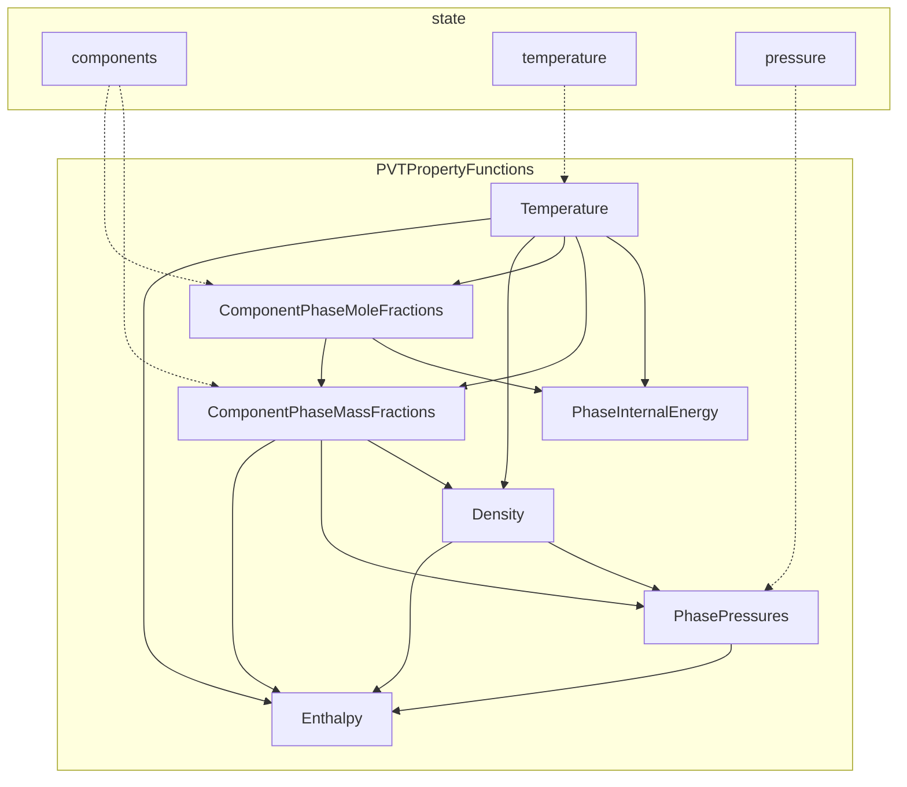

Figure 12.3 Execution graph for computing the enthalpy. Names in gray represent properties and state functions that are inherited from existing properties and state functions in MRST, whereas names in black represent properties and state functions that are specific to the module.

```
Extra state functions (Added to class instance):
    ComponentPhaseMassFractions: ComponentPhaseMassFractionsBrine (edit|plot)
    ComponentPhaseMoleFractions: ComponentPhaseMoleFractionsBrine (edit|plot)
    Temperature: Temperature (edit|plot)
    Enthalpy: Enthalpy (edit|plot)
    PhaseInternalEnergy: PhaseInternalEnergy (edit|plot)
    ...
```

Figure 12.3 illustrates these properties and the order in which they must be computed. Once a property is computed during a nonlinear solution step, it is cached to state. This way, we avoid potentially costly recomputations of these properties within the same nonlinear iteration. Notice that the state functions for pressure, internal energy, and mole and mass fractions contain Phase. This is a formality that will ease the extension to multiple phases. In fact, many of the state functions in geothermal already support multiphase fluids. Note also that temperature appears both as a property on state and as a PVT property function. This is because we intend to implement a formulation with enthalpy instead of temperature as a primary variable in the future, so that Temperature will be derived from the EoS. Such a formulation is needed to properly treat phase transitions. For now, however, Temperature simply gets the temperature from state.

## 12.4 Numerical Examples

In the following, we present three more examples to demonstrate how the module can be used to simulate various geothermal scenarios, including effects of brine and complex well schedules.

[https://doi.org/10.1017/9781009019781](https://doi.org/10.1017/9781009019781) Published online by Cambridge University Press

*Simulation of Geothermal Systems Using MRST* <page_number>503</page_number>

Schematic drawing of the model setup showing boundary conditions like P_right = P_res, T_right = T_res, and injection points at (0,99) and (0,101).

Figure 12.4 Schematic drawing of the model setup (rotated) showing grid dimensions, initial and boundary conditions, and monitoring points (red and blue) for the benchmark between geothermal and TOUGH2.

## 12.4.1 Benchmark with TOUGH2

The `geothermalExampleBenchmark` example presents a comparison with the widely used flow simulator TOUGH2 [25]. Figure 12.4 illustrates the setup, which consists of a 100 × 200 m<sup>2</sup> Cartesian grid with 50 × 100 cells and homogeneous rock properties. We add thermal properties to the fluid structure:

```matlab
fluid = addThermalFluidProps(fluid           , ... % Original fluid
                             'Cp'      , 4.2e3, ... % Specific heat capacity
                             'lambdaF' , 0.6  , ... % Thermal conductivity
                             'useEOS'  , true );    % Use equation of state
```

Thermal properties of the rock are added as before, and we must now provide the medium’s tortuosity as well:

```matlab
rock = addThermalRockProps(rock              , ... % Original rock
                           'CpR'     , 1000  , ... % Specific heat capacity
                           'lambdaR' , 2     , ... % Thermal conductivity
                           'rhoR'    , 2700  , ... % Rock density
                           'tau'     , 1     );    % Tortuosity
```

To define a model with brine, we must make a `CompositionalBrineFluid` object. This is inherited from `CompositionalFluid` in the compositional module and holds the component names, molar mass, and molecular diffusivity.

[https://doi.org/10.1017/9781009019781](https://doi.org/10.1017/9781009019781) Published online by Cambridge University Press

504 M. Collignon, Ø. S. Klemetsdal, and O. Møyner

```matlab
% Provide data for one-phase two-component model with H2O and NaCl
compFluid = CompositionalBrineFluid(           ...
      {'H2O'    , 'NaCl'                     }, ... % Component names
      [18.015281*gram/mol, 58.442800*gram/mol], ... % Molar masses
      [0        , 1e-6                       ]);    % Molecular diffusivities
% Make model
model = GeothermalModel(G, rock, fluid, compFluid, 'extraStateOutput', true)
```

In fact, `GeothermalModel` makes a compositional fluid with a single H<sub>2</sub>O component by default. Initial temperature, pressure, and NaCl mass fraction are set at 10°C, 100 bar, and 0.1, respectively:

```matlab
state0      = initResSol(G, 100*barsa, 1);     % Pressure and saturation
state0.T = ones(G.cells.num,1).*283.15;        % Temperature
X = repmat([0.9, 0.1], G.cells.num, 1);        % Initial mass fractions
state0.components = model.getMoleFraction(X); % Convert to mole fractions
```

A pressure of 250 bar and a temperature of 50°C are imposed on two faces in the middle of the left boundary to simulate injection of warm pure water in the reservoir. The right boundary has the same initial conditions as the reservoir for pressure, temperature, and NaCl mass fraction to allow for outflow (Figure 12.4):

```matlab
bc = pside([], G, 'right', 100*barsa, 'sat', 1);         % Right (p)
bc = addBC(bc, faces, 'pressure', 250*barsa ,'sat', 1); % Left (p)
Tbc = [repmat(283.15, 100, 1); repmat(323.15, 2, 1)];
bc = addThermalBCProps(bc, 'T', Tbc);                    % Temperature
Xbc = [repmat(0.1, 100, 1); zeros(2, 1)];                % Mass fractions
bc.components = model.getMoleFraction([1-Xbc, Xbc]);     % Mole fractions
```

We monitor pressure, temperature, and NaCl mass fraction in two cells of the model: near the injection and in the center (red and blue, respectively, in Figure 12.4). Generally, we observe less than 1% difference in pressure, NaCl mass fraction, and temperature between both codes (Figure 12.5). However, there are two exceptions where the results show a larger discrepancy: Near the injection, the pressure shows up to 5% difference between the solvers in the beginning, and there is a slight overshoot of the pressure for TOUGH2. The latter may be due to a convergence issue in the solver; indeed, TOUGH2 requires smaller timesteps to converge in the beginning of the simulation than our implementation. This results in reduced numerical diffusion and, indirectly, a more accurate result than from the prescribed steps. The temperature in the model center shows up to 3.6% relative difference between the results after 150 days. This is possibly due to a difference in the formulation of thermal properties, such as internal energy, heat capacity, and conductivity: In TOUGH2, specific heat capacity $C_\alpha$ and thermal conductivity $\lambda_\alpha$

[https://doi.org/10.1017/9781009019781](https://doi.org/10.1017/9781009019781) Published online by Cambridge University Press

Simulation of Geothermal Systems Using MRST

505

<table>
  <thead>
    <tr>
        <th colspan="7">Simulation Results Comparison: TOUGH2 vs MRST</th>
    </tr>
    <tr>
        <th>Time [day]</th>
        <th>Inj. Pressure (bar)</th>
        <th>Ctr. Pressure (bar)</th>
        <th>Inj. NaCl mass frac.</th>
        <th>Ctr. NaCl mass frac.</th>
        <th>Inj. Temp (°C)</th>
        <th>Ctr. Temp (°C)</th>
    </tr>
  </thead>
  <tbody>
    <tr>
        <td>0</td>
        <td>240</td>
        <td>110</td>
        <td>0.06</td>
        <td>0.1</td>
        <td>20</td>
        <td>10</td>
    </tr>
    <tr>
        <td>50</td>
        <td>235</td>
        <td>145</td>
        <td>0</td>
        <td>0.08</td>
        <td>50</td>
        <td>10</td>
    </tr>
    <tr>
        <td>100</td>
        <td>233</td>
        <td>148</td>
        <td>0</td>
        <td>0</td>
        <td>50</td>
        <td>10</td>
    </tr>
    <tr>
        <td>150</td>
        <td>232</td>
        <td>149</td>
        <td>0</td>
        <td>0</td>
        <td>50</td>
        <td>12</td>
    </tr>
    <tr>
        <td>200</td>
        <td>231</td>
        <td>150</td>
        <td>0</td>
        <td>0</td>
        <td>50</td>
        <td>20</td>
    </tr>
  </tbody>
</table>

Figure 12.5 Pressure (top), NaCl mass fraction (middle), and temperature (bottom) evolution recorded at two points of the model (see Figure 12.4) for both geothermal and TOUGH2.

are functions of both pressure and temperature, whereas we keep these constant in our implementation.

## 12.4.2 Subset of SPE10 Model 2

In `geothermalExampleSPE10Subset`, we consider an inverted five-spot pattern and use the `upr` module from Chapter 1 to construct a perpendicular bisector grid with refinement around each well. We then sample permeability and porosity from Layer 10 from Model 2 of the SPE10 benchmark study [4]. Figure 12.6 shows the result. To ensure a high thermal energy throughput in the solid rock, we assign a high thermal conductivity and low specific heat capacity to the rock structure:

```matlab
rock = addThermalRockProps(rock, 'lamdaR', 100, 'CpR', 250);
```

[https://doi.org/10.1017/9781009019781](https://doi.org/10.1017/9781009019781) Published online by Cambridge University Press

506 M. Collignon, Ø. S. Klemetsdal, and O. Møyner

Setup for the SPE10 Model 2 example showing permeability map with injection well I1 in the center and production wells P1-P4 in the corners.

Figure 12.6 Setup for the SPE10 Model 2 example. The colors indicate permeability, and the wells (injection in the center, production in each corner) are indicated by white dots.

The center well injects 100°C water at a constant rate of 50 m<sup>3</sup>/day, whereas the producers are operated at a fixed bottom-hole pressure (BHP) of 4 000 psi. We must prescribe the well temperatures after constructing the wells:

```matlab
Tinj = (273.15 + 100)*Kelvin;           % 100 degrees Celsius
W    = addThermalWellProps(W, 'T', Tin); % Add temperature field T to wells
```

We prescribe no-flow boundary conditions on all sides and simulate two types of thermal boundary conditions: fully insulated and fixed temperature. By default, MRST computes mass and energy fluxes across internal interfaces only and adds in fluxes across boundary faces only where boundary conditions are given. This means that the fully insulated case can be set up without providing boundary conditions, whereas fixed-temperature conditions must be provided. We assign a fixed temperature equal to the initial reservoir temperature on all sides:

```matlab
bc = addBC([], boundaryFaces(G), 'flux', 0); % Set up no-flow BCs
bc = addThermalBCProps(bc, 'T', Tres);       % Prescribe temperature
```

Figure 12.7 shows the reservoir temperature at the end of both simulations, along with the logarithm of the (approximate) thermal Péclet number. The thermal Péclet number measures the heat transfer efficiency and is approximated as advective to conductive heat flux:

$$ Pe = \frac{\|\vec{F}_f h_f\|}{\|\vec{H}_f + \vec{H}_r\|} = \frac{\|\rho_f \vec{v}_f h_f\|}{\|-(\lambda_f + \lambda_r) \nabla T\|} . $$

As expected, the fully insulated case achieves a higher temperature near the boundary. The Péclet number also indicates that advective heat transfer dominates in

[https://doi.org/10.1017/9781009019781](https://doi.org/10.1017/9781009019781) Published online by Cambridge University Press

Simulation of Geothermal Systems Using MRST 507

Heatmaps showing temperature distribution and thermal Péclet number for fully insulated and fixed temperature boundary conditions.

Figure 12.7 Temperature distribution at the end of the simulation using fully insulated boundary conditions (left) and fixed-temperature boundary conditions (right).

almost all parts of the domain, with more than five orders of magnitude near the center well. The Péclet number is also slightly higher with fully insulated boundary conditions.

## 12.4.3 Enhanced Geothermal System

Enhanced geothermal systems are built by fracturing the subsurface rock in a region with low permeability and high temperature. By injecting and extracting fluids from the resulting fracture network, the fractures serve the same purpose as the fins of a conventional heat exchanger. This setup is ideal for utilizing the abundant geothermal energy, because there is typically almost no flow outside the fractures and consequently a very small heat loss. We model a small enhanced geothermal system by a network of intersecting fractures in a confined box of 50 × 50 × 15 m<sup>3</sup> using a predefined artificial fracture data set. The source code for this example can be found in `geothermalExampleEGS`. From a 2D grid constructed using the `upr` module, we make a 3D model by extruding it in the vertical direction:

```matlab
G2D = pebiGrid2D(dx, xmax(1:2), ...
         'cellConstraints', data.fractures, ... % Fractures
         'CCRefinement'      , true     , ... % Refine fractures
         'CCFactor'          , 0.1      );  % Relative fracture cell size
G = makeLayeredGrid(G2D, layers);
```

Figure 12.8 shows the setup. Permeability and porosity are set to 0.1 md and 0.05 in the matrix and 10 000 md and 0.7 in the fractures.

[https://doi.org/10.1017/9781009019781](https://doi.org/10.1017/9781009019781) Published online by Cambridge University Press

508 M. Collignon, Ø. S. Klemetsdal, and O. Møyner

<table>
  <thead>
    <tr>
        <th>Time (years)</th>
        <th>Heat extraction efficiency</th>
    </tr>
  </thead>
  <tbody>
    <tr>
        <td>0</td>
        <td>1.35</td>
    </tr>
    <tr>
        <td>5</td>
        <td>1.28</td>
    </tr>
    <tr>
        <td>10</td>
        <td>1.20</td>
    </tr>
    <tr>
        <td>15</td>
        <td>1.15</td>
    </tr>
    <tr>
        <td>20</td>
        <td>1.10</td>
    </tr>
    <tr>
        <td>25</td>
        <td>1.08</td>
    </tr>
  </tbody>
</table>

Figure 12.8 Enhanced geothermal system. The injection and production wells are placed in opposite sides of a fracture network, which is 10<sup>4</sup> times more permeable than the matrix rock.

```matlab
rock = makeRock(G, 1*milli*darcy, 0.05);
rock.perm(fracture_cells) = 1e4*milli*darcy; % Fracture permeability
rock.poro(fracture_cells) = 0.8;              % Fracture porosity
```

In this example, we use a density formulation of the form (12.7):

```matlab
fluid = initSimpleADIFluid(               ...
    'phases', 'W'            ,  ... % Water only
    'mu'    , 0.5*centi*poise,  ... % Viscosity
    'rho'   , 1000*kilogram/meter^3, ... % Reference density
    'c'     , 4.4e-10/Pascal ,  ... % Compressibility
    'pRef'  , 1*atm          );     % Reference pressure

% Add thermal properties
fluid = addThermalFluidProps(fluid   , ...
    'Cp'     , 4.2*joule/(gram*Kelvin), ... % Heat capacity
    'lambdaF', 0.6*Watt/(meter*Kelvin), ... % Thermal conductivity
    'cT'     , 207e-6/Kelvin          , ... % Thermal expansion
    'TRef'   , K0 + 10*Kelvin         );   % Reference temperature
```

Two wells are placed in opposite corners of the fracture network, one injects water at 10°C at a constant rate equal to half the fracture pore volume per year, whereas the other produces at a constant BHP. The initial reservoir temperature is 95°C. Figure 12.8 reports the heat extraction efficiency (produced to injected energy) during 25 years of operation, along with reservoir temperature at three selected timesteps. The reservoir gradually cools down, which is also reflected in the decreasing extraction efficiency.

[https://doi.org/10.1017/9781009019781](https://doi.org/10.1017/9781009019781) Published online by Cambridge University Press

Simulation of Geothermal Systems Using MRST 509

<page_number>

509
</page_number>

3D Voronoi-type geomodel showing permeability distribution and well groups H1-H4 and C1-C4 for a high-temperature ATES system.

Figure 12.9 Setup for the high-temperature ATES system. Colors indicate the permeability, and the black, vertical pillars indicate the hot (H1–H4) and cold (C1–C4) well groups.

## 12.4.4 Thermal Aquifer Energy Storage

In the next example, we consider a setup inspired by previous work [[5]](https://doi.org/10.1017/9781009019781), in which we investigated high-temperature ATES in the Greater Geneva Basin, Switzerland. Thermal energy is produced at a waste incinerator near Geneva and distributed to the local-district heating systems for heating of buildings. However, whereas energy supply (e.g., waste) is fairly constant throughout the year, the energy demand is highly seasonal. Storing excess energy in summer to use it in winter may therefore lead to potentially large energy savings. Full source code for this example is given in the `geothermalExampleHTATES` script.

We use the unstructured Voronoi-type geomodel shown in Figure 12.9. Chapter 1 describes in detail how the `upr` module can be used to generate this grid. The model has three intersecting faults and a layered permeability structure as commonly seen in engineering geomodels. Injection and extraction of heated water are controlled by two groups of four wells each, which we refer to as hot and cold, respectively. The hot group (H1–H4) injects hot water for storage during summer and extracts the hot water for heating in winter. The cold group (C1–C4) provides pressure support by injecting or extracting cold water, with a low BHP during storage and a high BHP during extraction. In between storage and extraction, there is a period of rest during which all wells are closed.

[https://doi.org/10.1017/9781009019781](https://doi.org/10.1017/9781009019781) Published online by Cambridge University Press

510 M. Collignon, Ø. S. Klemetsdal, and O. Møyner

For simplicity, we assume a constant energy supply and impose constant water injection of 1 000 m<sup>3</sup> per day at a temperature of 100°C in each of the wells in the hot group during storage and a production rate of 1 000 m<sup>3</sup> per day during extraction. The cold group operates at a constant BHP of 70 bar during storage and 85 bar during extraction. The storage and extraction periods last for four months each, whereas the intermediate rest period lasts for two months. In other words, one cycle (storage–rest–extraction–rest) totals one year, and we simulate four cycles. For simplicity, we neglect salinity effects and assume that the reservoir constitutes a closed, thermally insulated flow compartment. Initial hydrostatic equilibrium is approximated by simulating ten years with fixed pressure and temperature boundary conditions at the topmost part of the reservoir using eight timesteps. The EoS is valid for pressure/temperature within a given range. We provide these to the model, which ensures that pressure/temperature remain within these values during the nonlinear solution step. This is crucial to get a robust nonlinear solver, because intermediate states in a Newton loop may result in pressure and temperature values far outside the EoS validity range.

```matlab
model.maximumPressure    = 200e6;     % Maximum pressure
model.minimumTemperature = K0;        % Minimum temperature
model.maximumTemperature = K0 + 275;  % Maximum temperature
```

Because the problem is fairly large (pressure and temperature in 27 449 cells gives 54 898 degrees of freedom), we speed up the simulation using a compiled iterative Krylov solver with constrained pressure residual (CPR) preconditioning [7] together with the mex-accelerated AD backend detailed in Chapter 6.

```matlab
model.AutoDiffBackend = DiagonalAutoDiffBackend('useMex', true);
mrstModule add linearsolvers, lsolver = AMGCL_CPRSolverAD();
```

Figure 12.10 shows the temperature distribution in the reservoir after storage and extraction in the first and last cycles. The plots only show cells where the temperature deviates from its initial value by more than 20%. We see that all important dynamics takes place in the near-well regions, which indicates that the ability to incorporate near-well refinement in the computational grid is crucial for efficient simulation of large cases. Figure 12.11 reports the temperature in all wells as a function of time, along with the energy recovery factor. The latter is defined as the ratio of extracted to stored energy, in this case reported as the total cumulative factor over time. The vertical lines indicate the storage, rest, and extraction periods, with the second cycle (from Year 1 to Year 2) emphasized in color.

[https://doi.org/10.1017/9781009019781](https://doi.org/10.1017/9781009019781) Published online by Cambridge University Press

*Simulation of Geothermal Systems Using MRST* 511

<page_number>

511
</page_number>

Four 3D reservoir models showing temperature distribution during first storage, first extraction, last storage, and last extraction cycles, with a temperature color scale from 30 to 100 °C.

Figure 12.10 Reservoir temperature after storage and extraction in the first and last cycles, reported in cells where the temperature deviates more than 20% from the initial temperature.

This example demonstrates how `geothermal` can be used to simulate complex injection strategies with multiple wells and different constraints. The current setup is, however, very simplified compared to real high-temperature ATES applications, for which factors such as aquifer drift, thermal diffusion out of the reservoir, well operating limits, and temporal variations in energy supply play an important role and tend to result in much lower energy recovery factors. Such effects can also be simulated with `geothermal`, and the reader can refer to [5] for a more advanced example simulated with the `geothermal` module.

## 12.5 Concluding Remarks

The new `geothermal` module in MRST enables intuitive and rapid testing of geothermal applications involving complex injection schedules and geological grids. Currently, the module can be used to investigate low- to moderate-enthalpy geothermal systems, in which water is always present as a liquid phase. The module can also account for transport of dissolved salt and its impact on fluid flow through density and viscosity changes. The implemented EoS has a pressure, temperature, and salinity range suitable for modeling the first 5 km of most sedimentary basins. As part of MRST, the module can be integrated with well-established

[https://doi.org/10.1017/9781009019781](https://doi.org/10.1017/9781009019781) Published online by Cambridge University Press

512 M. Collignon, Ø. S. Klemetsdal, and O. Møyner

<table>
  <thead>
    <tr>
        <th>Time (years)</th>
        <th>Well temperature (C) - Series 1</th>
        <th>Well temperature (C) - Series 2</th>
        <th>Energy recovery factor</th>
    </tr>
  </thead>
  <tbody>
    <tr>
        <td>0</td>
        <td>100</td>
        <td>50</td>
        <td>0.0</td>
    </tr>
    <tr>
        <td>0.5</td>
        <td>100</td>
        <td>50</td>
        <td>0.0</td>
    </tr>
    <tr>
        <td>1</td>
        <td>65</td>
        <td>30</td>
        <td>0.95</td>
    </tr>
    <tr>
        <td>1.5</td>
        <td>100</td>
        <td>45</td>
        <td>0.45</td>
    </tr>
    <tr>
        <td>2</td>
        <td>75</td>
        <td>30</td>
        <td>0.95</td>
    </tr>
    <tr>
        <td>2.5</td>
        <td>100</td>
        <td>40</td>
        <td>0.65</td>
    </tr>
    <tr>
        <td>3</td>
        <td>75</td>
        <td>30</td>
        <td>0.95</td>
    </tr>
    <tr>
        <td>3.5</td>
        <td>100</td>
        <td>40</td>
        <td>0.75</td>
    </tr>
    <tr>
        <td>4</td>
        <td>80</td>
        <td>30</td>
        <td>0.95</td>
    </tr>
  </tbody>
</table>

Figure 12.11 Well temperatures and energy recovery during four cycles of high-temperature ATES. Cumulative energy recovery factor measures the efficiency of the system, reported as the aggregated recovery factor for all four wells in the hot group.

functionality from petroleum applications, such as optimal well control, sensitivity analysis, adjoint-based optimization, and uncertainty quantification, and applied to realistic geological models using complex fluid physics. The module represents a first step toward a more advanced module that will consider water-phase transition and the presence of other components such as carbon dioxide or methane, which are commonly found in geothermal systems. Such an implementation will permit exploring high-enthalpy geothermal systems in volcanic settings or mud volcanoes, which possess a strong energetic potential. Other possible extensions include combining the module with existing modules in MRST to consider, e.g., thermomechanical or thermochemical processes, which may have a strong impact on the efficiency of geothermal energy systems.

*Acknowledgement.* The authors thank Antonio Rinaldi for his contribution to benchmarking geothermal with TOUGH2 and Halvor Møll Nilsen and Odd Andersen for scientific discussions and insightful comments. Finally, we thank Knut-Andreas Lie for improving the chapter through careful review and constructive suggestions.

[https://doi.org/10.1017/9781009019781](https://doi.org/10.1017/9781009019781) Published online by Cambridge University Press

*Simulation of Geothermal Systems Using MRST*

<page_number>513</page_number>

**References**

[1] R. Al-Khoury. *Computational Modeling of Shallow Geothermal Systems* , Volume 4 of *Multiphysics Modeling* . CRC Press, 2011.

[2] O. Andersson. Aquifer thermal energy storage. In H. Ö. Paksoy, ed., *Thermal Energy Storage for Sustainable Energy Consumption: Fundamentals, Case Studies and Design* , Volume 234, pp. 155–176. Springer, Dordrecht, The Netherlands, 2007. doi: 10.1007/978-1-4020-5290-3.

[3] T. A. Buscheck, J. M. Bielicki, T. A. Edmunds, Y. Hao, Y. Sun, J. B. Randolph, and M. O. Saar. Multifluid geo-energy systems: using geologic CO2 storage for geothermal energy production and grid-scale energy storage in sedimentary basins. *Geosphere* , 12(3):678–696, 2016. doi: 10.1130/GES01207.1.

[4] M. A. Christie and M. J. Blunt. Tenth SPE comparative solution project: a comparison of upscaling techniques. *SPE Reservoir Evaluation and Engineering* , 4(4):308–316, 2001. doi: 10.2118/72469-PA.

[5] M. Collignon, Ø. S. Klemetsdal, O. Møyner, M. Alcanié, A. Pio, H. Nilsen, and M. Lupi. Evaluating thermal losses and storage capacity in high-temperature aquifer thermal energy storage (HT-ATES) systems with well operating limits: insights from a study-case in the Greater Geneva Basin, Switzerland. *Geothermics* , 85:101773, 2020. doi: 10.1016/j.geothermics.2019.101773.

[6] U. Colombo. Development and the global environment. In J. M. Hollander, ed., *The Energy-Environment Connection* , pp. 3–14. Island Press, Washington, DC, 1992.

[7] D. Demidov. AMGCL: an efficient, flexible, and extensible algebraic multigrid implementation. *Lobachevskii Journal of Mathematics* , 40(5):535–546, 2019. doi: 10.1134/S1995080219050056.

[8] H.-J. G. Diersch. *Finite Element Modeling of Flow, Mass and Heat Transport in Porous and Fractured Media* . Springer, 2014. doi: 10.1007/978-3-642-38739-5.

[9] I. Dincer. Energy and environmental impacts: present and future perspectives. *Energy Sources* , 20(4-5):427–453, 1998. doi: 10.1080/00908319808970070.

[10] I. Dincer. Renewable energy and sustainable development: a crucial review. *Renewable and Sustainable Energy Reviews* , 4(2):157–175, 2000. doi: 10.1016/ S1364-0321(99)00011-8.

[11] I. Dincer and M. A. Rosen. *Thermal Energy Storage: Systems and Applications* . Wiley, 2011.

[12] T. Driesner. The system H2O-NaCl. Part II. Correlations for molar volume, enthalpy, and isobaric heat capacity from 0 to 1 000 degrees C, 1 to 5 000 bar, and 0 to 1 XNaCl . *Geochimica et Cosmochimica Acta* , 71:4902–4919, 2007. doi: 10.1016/j.gca.2007.05. 026.

[13] R. Gibson and O. Loeffler. Pressure–volume–temperature relations in solutions. Part IV. The apparent volumes and thermal expansibilities of sodium chloride and sodium bromide in aqueous solutions between 25 and 95◦. *Journal of the American Chemical Society* , 63(2):443–449, 1941. doi: 10.1021/ja01847a026.

[14] W. Glassley. *Geothermal Energy: Renewable Energy and the Environment* . CRC Press, 2010. doi: 10.1201/b17521.

[15] L. Haar, J. S. Gallagher, and G. S. Kell. *NBS/NRC Steam Tables Thermodynamic and Transport Properties and Computer Programs for Vapor and Liquid States of Water in SI Units* . Hemisphere Publishing Company, Washington, DC, 1984.

[16] K. L. J. Kipp, P. Hsieh, and S. Charlton. *Guide to the Revised Ground-Water Flow and Heat Transport Simulator: HYDROTHERM – Version 3* , Volume 6-A25 of *Techniques and Methods* . U.S. Geological Survey, 2008.

https://doi.org/10.1017/9781009019781 Published online by Cambridge University Press

514 M. Collignon, Ø. S. Klemetsdal, and O. Møyner

<page_number>

514
</page_number>

[17] C. D. Langevin, D. T. Thorne Jr., A. M. Dausman, M. C. Sukop, and W. Guo. *SEAWAT Version 4.0: A Computer Program for Simulation of Multi-Species Solute and Heat Transport*, Volume 6-A22 of *Techniques and Methods*. U.S. Geological Survey, 2007.

[18] K. S. Lee. A review on concepts, applications, and models of aquifer thermal energy storage systems. *Energies*, 3(6):1320–1334, 2010. doi: 10.3390/en3061320.

[19] K.-A. Lie. *An Introduction to Reservoir Simulation Using MATLAB/GNU Octave: User Guide for the MATLAB Reservoir Simulation Toolbox (MRST)*. Cambridge University Press, Cambridge, UK, 2019. doi: 10.1017/9781108591416.

[20] S. Lvov and R. Wood. Equation of state of aqueous NaCl solutions over a wide range of temperatures, pressures and concentrations. *Fluid Phase Equilibria*, 60:273–287, 1990. doi: 10.1016/0378-3812(90)85057-H85057-H).

[21] M. J. O’Sullivan, K. Pruess, and M. J. Lippmann. State of the art of geothermal reservoir simulation. *Geothermics*, 30(4):395–429, 2001. doi: 10.1016/S0375-6505(01)00005-000005-0).

[22] C. Palliser and R. McKibbin. A model for deep geothermal brines, I: T-p-X state–space description. *Transport in Porous Media*, 33:65–80, 1998. doi: 10.1023/A:1006537425101.

[23] K. Pitzer, J. Peiper, and R. Busey. Thermodynamic properties of aqueous sodium chloride solutions. *Journal of Physical and Chemical Reference Data*, 13:1–102, 1984. doi: 10.1063/1.555709.

[24] K. Pitzer and M. Sterner. Equations of state for solid NaCl-KCl and saturated liquid NaCl-KCl-H<sub>2</sub>O. *Thermochimica Acta*, 218:413–423, 1993. doi: 10.1016/0040-6031(93)80440-L80440-L).

[25] K. Pruess, C. Oldenburg, and G. Moridis. *TOUGH2 User’s Guide, Version 2.0*. Lawrence Berkeley National Laboratory, 1999.

[26] P. Rogers and K. Pitzer. Volumetric properties of aqueous sodium-chloride solutions. *Journal of Physical and Chemical Reference Data*, 11:15–81, 1982. doi: 10.1016/0040-6031(93)80440-L80440-L).

[27] J. P. Spivey, W. D. McCain, and R. North. Estimating density, formation volume factor, compressibility, methane solubility, and viscosity for oilfield brines at temperatures from 0 to 275°C, pressures to 200 MPa, and salinities to 5.7 mole/kg. *Journal of Canadian Petroleum Technology*, 43(7):52–61, 2004. doi: 10.2118/04-07-05.

[28] I. Stober and K. Bucher. *Geothermal Energy: From Theoretical Models to Exploration and Development*. Springer, 2013.

[29] W. Wagner, J. Cooper, A. Dittman, J. Kijima, H.-J. Kretzschmar, A. Kruse, R. Mares, K. Oguchi, H. Sato, I. Støcker, O. Sifner, Y. Takaishi, I. Tanishita, J. Trübenbach, and T. Willkommen. The IAPWS industrial formulation 1997 for the thermodynamic properties of water and steam. *ASME Journal of Engineering for Gas Turbines and Power*, 122:150–182, 2000. doi: 10.1007/978-3-540-74234-0_3.

[30] W. Wagner and A. Pruss. The IAPWS formulation 1995 for the thermodynamic properties of ordinary water substance for general and scientific use. *Journal of Physical and Chemical Reference Data*, 31:387–535, 2002. doi: 10.1063/1.1461829.

[https://doi.org/10.1017/9781009019781](https://doi.org/10.1017/9781009019781) Published online by Cambridge University Press

# 13

# A Finite-Volume-Based Module for Unsaturated Poroelasticity

JHABRIEL VARELA, SARAH E. GASDA, EIRIK KEILEGAVLEN, AND JAN MARTIN NORDBOTTEN

**Abstract**

In this chapter, we present `fv-unsat`, a multipoint finite-volume-based solver for unsaturated flow in deformable and nondeformable porous media. The latter is described using the mixed form of Richards’ equation, whereas the former by the equations of unsaturated linear poroelasticity. The module aims at flexibility, relying heavily on discrete operators and equations, exploiting the automatic differentiation framework provided by the MATLAB Reservoir Simulation Toolbox (MRST). Our examples cover two numerical convergence tests and two three-dimensional practical applications, including the water infiltration process in a nondeformable soil column and a realistic desiccation process of a deformable clay sample using atmospheric boundary conditions. The resulting convergence rates are in agreement with previously reported rates for single-phase models, and the practical applications capture the physical processes accurately.

## 13.1 Introduction

The unsaturated zone has been a constant focus of attention by the industrial and research communities due to its high relevance in areas such as environmental sciences, hydrogeology, soil mechanics, and agriculture. Relevant natural and anthropogenic processes take place in this zone; transmission of water from the atmosphere to the saturated zone via infiltration or precipitation, support of plants via root uptake, active return of water from the subsurface to the atmosphere via evapotranspiration, drying of soils during drought seasons, extraction of groundwater via wells, construction and operations of dams, etc. [46].

Although many of these processes can be studied by only taking into account the simultaneous flow of water and air, some of them, such as the desiccation of muddy soils, require the incorporation of the deformation effects due to the

<page_number>515</page_number>

[https://doi.org/10.1017/9781009019781](https://doi.org/10.1017/9781009019781) Published online by Cambridge University Press

516 J. Varela, S. E. Gasda, E. Keilegavlen, and J. M. Nordbotten

strong coupling between flow and mechanics. This gives rise to a nonlinear coupled flow/mechanical set of partial differential equations. Under the assumption of small deformations and linear constitutive relations for the mechanical behavior of the soils, this set of equations can be expressed as a natural extension of Biot’s equations of poroelasticity [26], for which recently global existence of the weak solution has been proven [9].

Given the complexity of the resulting model, it is imperative to use robust discretization techniques in a flexible computational setting. The fully coupled system is not commonly treated by numerical software, and the few available codes are limited to the use of finite-element methods [26] or mixed finite-element methods [7]. In this module, we propose the use of finite-volume methods (FVM), which are inherently conservative while keeping the advantages of robust discretization schemes; i.e., flexibility in representing complex domains.

In the FVM framework, two-point flux approximation (TPFA) is the most widely used method for discretizing scalar equations. However, TPFA is only consistent for $K$-orthogonal grids [1] and cannot be directly applied to vector equations. The first of these issues can be addressed with the multipoint flux approximation (MPFA) method [1], and the second with the multipoint stress approximation (MPSA) method [33]. Both methods are currently well established in academia and slowly taking hold in industry.

As we mentioned before, computational flexibility is an important aspect of a module when it comes to solving a broad range of applications. With this goal in mind, we have written `fv-unsat` taking advantage of the high-level coding capacities of the MATLAB Reservoir Simulation Toolbox (MRST), such as automatic differentiation [24]. This module is based on the work of [44] and requires the module `fvbiot`, which provides the discrete MPFA and MPSA operators, along with the coupling operators for the flow/mechanical problem.<sup>1</sup>

The existing implementation of `fv-unsat` does not cover the full width of modeling options of the governing equations; e.g., mixed and time-dependent boundary conditions for the mechanical problem. If the interested user needs to include these setups, we recommend the Python-based framework PorePy [20], which provides a more general implementation of MPSA for poroelastic problems.

Our notation follows MRST’s conventions [28]. In physical space, $x$ represents a scalar, $\vec{x}$ a vector, and **x** a tensor. In a discrete sense, **x** is a vector and $\text{ope}(\mathbf{x})$ is a discrete operator acting on **x**; i.e., the matrix–vector product between $\text{ope}$ and **x**.

The chapter is structured as follows: in Section 13.2 we provide the continuous formulations for the unsaturated flow in nondeformable (Richards’ equation) and

<sup>1</sup> After this chapter was written, `mpsaw`, a new and improved implementation of the MPSA-W method has been released with the core MRST distribution. The module can also be downloaded separately at [https://bitbucket.org/mrst/mpsaw/src/master/](https://bitbucket.org/mrst/mpsaw/src/master/).

[https://doi.org/10.1017/9781009019781](https://doi.org/10.1017/9781009019781) Published online by Cambridge University Press

A Finite-Volume-Based Module for Unsaturated Poroelasticity <page_number>517</page_number>

deformable (unsaturated poroelasticity) porous media; in Section 13.3 we introduce the MPFA and MPSA methods, together with the discrete operators and the discrete equations; in Section 13.4 we present two numerical convergence tests and two practical applications with in-depth explanation regarding the module; and in Section 13.5 we draw the conclusions.

## 13.2 Governing Equations

In this section, we provide the set of equations that governs the physical processes in the continuous domain. We do not attempt to provide detailed derivations of these equations; for that matter we refer to [[13, 26, 37]](https://doi.org/10.1017/9781009019781).

### 13.2.1 Richards’ Equation

Richards’ equation models the flow of water in partially saturated porous media, and it is based on the assumption of inviscid air. This assumption is supported by the contrast in physical properties between water and air; e.g., at atmospheric conditions air is three orders of magnitude less dense and two orders less viscous than water [[37]](https://doi.org/10.1017/9781009019781). Because the unsaturated zone is connected to the atmosphere, it is reasonable to assume that the air remains at atmospheric pressure. This is usually referred to as the Richards assumption and it was first proposed in [[40]](https://doi.org/10.1017/9781009019781).

We start the derivation by stating the mass-balance equation for the water phase

$$ \frac{\partial (\rho_w S_w n)}{\partial t} + \nabla \cdot (\rho_w S_w n \vec{v}_w) = \dot{m}_w. \tag{13.1} $$

Here, $\rho_w$ and $S_w$ are the density and saturation, $n$ is the porosity of the porous medium, $\vec{v}_w$ is the water velocity, and $\dot{m}_w$ is the rate of external addition/subtraction of fluid mass per volume of representative elementary volume [[5]](https://doi.org/10.1017/9781009019781). If water and solid phases are assumed to be incompressible, we can rewrite (13.1) as

$$ n \rho_w \frac{\partial S_w}{\partial t} + \rho_w \nabla \cdot (S_w n \vec{v}_{ws}) = \dot{m}_w, \tag{13.2} $$

where $\vec{v}_{ws} := \vec{v}_w - \vec{v}_s$ is the velocity of the water with respect to the solids [[26]](https://doi.org/10.1017/9781009019781). We recognize the term $S_w n \vec{v}_{ws}$ as the Darcy velocity of the water phase, given by

$$ \vec{q}_w = S_w n \vec{v}_{ws} = - \frac{\mathbf{k}}{\mu_w} k_{rw} (\nabla p_w - \rho_w \vec{g}), \tag{13.3} $$

where **k** is the intrinsic permeability tensor, $\mu_w$ is the water dynamic viscosity, $p_w$ is the water pressure, and $\vec{g}$ is the gravity acceleration considered positive downwards. The relative permeability $k_{rw} \in [0, 1]$ is included to account for the simultaneous flow of water and air.

[https://doi.org/10.1017/9781009019781](https://doi.org/10.1017/9781009019781) Published online by Cambridge University Press

518 *J. Varela, S. E. Gasda, E. Keilegavlen, and J. M. Nordbotten*

In hydrology, it is common to express Darcy’s law (13.3) in terms of heads,

$$ \vec{q}_w = -\mathbf{K}_w^{sat} k_{rw} \nabla \left( \psi_w + \zeta \right). \eqno(13.4) $$

Here, $\psi_w = (p_w - p_a) / (\rho_w g)$ is the water pressure head (relative to the atmospheric pressure $p_a$), $\zeta = z - z_0$ is the elevation head (e.g., the height from a reference to the measurement point), and $\mathbf{K}_w^{sat} := \rho_w g \mathbf{k} / \mu_w$ is the hydraulic conductivity at saturated conditions [17, 37].

If Richards’ assumption holds true, the air pressure is constant and equal to $p_a$, which is assumed to be zero. This allows us to write the equations purely in terms of the water phase. Note that the capillary pressure is still present; i.e., $p_c = p_a - p_w = -p_w$. To get to the final expression, we substitute (13.4) into (13.2) and divide by $\rho_w$:

$$ \frac{\partial \theta_w}{\partial t} - \nabla \cdot \left( \mathbf{K}_w^{sat} k_{rw} \nabla \left( \psi_w + \zeta \right) \right) = \frac{\dot{m}_w}{\rho_w}, \eqno(13.5) $$

where we introduce the water content $\theta_w := n S_w$ and use the fact that the porosity is constant. Equation (13.5) is referred to as the mixed-based form of Richards’ equation. The term “mixed” suggests that both the water content and the pressure head appear explicitly in the equation. Alternative formulations include the pressure head–based and the water content–based forms [37]. On a continuous level, all forms of Richards’ equation are equivalent under strictly unsaturated conditions. However, on a discrete level, the $\psi$-based lacks conservative properties [12] and the $\theta$-based fails to converge when $S_w \rightarrow 1$ [38]. Therefore, in this module, we employ the mixed-based formulation.

In unsaturated systems, the usual practice is to express $k_{rw}$ and $\theta_w$ in terms of $\psi_w$. These relationships are called soil/water retention curves (SWRCs). One such family of curves is the van Genuchten–Mualem (vG-M) model, originally proposed in [43]. For the vG-M model, the water content is given by

$$ \theta_w = \begin{cases} \displaystyle \frac{\theta_w^s - \theta_w^r}{[1 + (\alpha_v |\psi_w|)^{n_v}]^{m_v}} + \theta_w^r, & \psi_w < 0, \\ \theta_w^s, & \psi_w \geq 0, \end{cases} \eqno(13.6) $$

where $\theta_w^s$ and $\theta_w^r$ are the water content at saturated and residual conditions and $\alpha_v$, $n_v$, and $m_v$ are fitting parameters. Note that $\psi_w < 0$ denotes unsaturated conditions. The relative permeability is given by

$$ k_{rw} = \begin{cases} \displaystyle \frac{\left\{ 1 - (\alpha_v |\psi_w|)^{n_v-1} [1 + (\alpha_v |\psi_w|)^{n_v}]^{-m_v} \right\}^2}{[1 + (\alpha_v |\psi_w|)^{n_v}]^{m_v/2}}, & \psi_w < 0, \\ 1, & \psi_w \geq 0. \end{cases} \eqno(13.7) $$

[https://doi.org/10.1017/9781009019781](https://doi.org/10.1017/9781009019781) Published online by Cambridge University Press

A Finite-Volume-Based Module for Unsaturated Poroelasticity 519

<page_number>

519
</page_number>

We also introduce the specific moisture capacity $C_\psi := d\theta_w/d\psi_w$:

$$
C_\psi = \begin{cases} -\frac{m_v n_v \psi_w \left(\theta_w^s - \theta_w^r\right) \left(\alpha_v |\psi_w|\right)^{n_v}}{|\psi_w|^2 \left[\left(\alpha_v |\psi_w|\right)^{n_v} + 1\right]^{m_v+1}}, & \psi_w < 0, \\ 0, & \psi_w \geq 0. \end{cases} \tag{13.8}
$$

## 13.2.2 Unsaturated Poroelasticity

Herein, we present the equations that govern an unsaturated poroelastic medium as a natural extension of Biot’s equations [26]. The momentum conservation for an unsaturated poroelastic medium reads

$$
\nabla \cdot \boldsymbol{\sigma}_t + \left((1 - n)\rho_s + n S_w \rho_w\right) \vec{g} = 0, \tag{13.9}
$$

where $\boldsymbol{\sigma}_t$ is the total stress tensor and $\rho_s$ the density of the solids, with the second term representing the body forces. For a poroelastic medium, the total stress has two contributions: the part that acts on the solid skeleton and the part that acts on the fluid. The relation is given by the extended principle of effective stress [16],

$$
\boldsymbol{\sigma}_t = \boldsymbol{\sigma}_e - \alpha p_w S_w \mathbf{I}. \tag{13.10}
$$

The term $\boldsymbol{\sigma}_e$ is the effective stress tensor, and it is responsible for causing the actual deformation of the material; thus the name “effective” [45]. The second term affects the pore pressure of the fluid, where $\alpha$ is the Biot coupling coefficient and $\mathbf{I}$ is the identity tensor. The negative sign follows the convention that tensile forces are positive whereas compressive forces are negative [31]. Substitution of (13.10) into (13.9) gives the final version of the unsaturated momentum balance equation,

$$
\nabla \cdot \boldsymbol{\sigma}_e - \alpha \nabla \left(S_w p_w\right) + \left((1 - n)\rho_s + n S_w \rho_w\right) \vec{g} = 0. \tag{13.11}
$$

Assuming small deformations and a linear stress–strain relation, the effective stress $\boldsymbol{\sigma}_e$ can be related to the displacement field $\vec{u}$ employing the generalized Hooke’s law

$$
\boldsymbol{\sigma}_e = \mathbf{C} : \frac{1}{2} \left(\nabla \vec{u} + (\nabla \vec{u})^T\right), \tag{13.12}
$$

where $\mathbf{C}$ is the stiffness matrix, a fourth-order tensor in its most general form. For the particular case of an isotropic medium, (13.12) can be written as

$$
\boldsymbol{\sigma}_e = \mu_s \left(\nabla \vec{u} + (\nabla \vec{u})^T\right) + \lambda_s \left(\nabla \cdot \vec{u}\right) \mathbf{I}, \tag{13.13}
$$

where $\lambda_s$ and $\mu_s$ are the first and second Lamé parameters [30].

[https://doi.org/10.1017/9781009019781](https://doi.org/10.1017/9781009019781) Published online by Cambridge University Press

520 J. Varela, S. E. Gasda, E. Keilegavlen, and J. M. Nordbotten

A statement of the mass conservation principle for both phases (water and solid skeleton) can be used to derive the unsaturated storage equation (see [44] for a detailed derivation):

$$ \xi(S_w) \frac{\partial p_w}{\partial t} + \chi(S_w, p_w) \frac{\partial S_w}{\partial t} + \alpha S_w \frac{\partial}{\partial t} (\nabla \cdot \vec{u}) + \nabla \cdot \vec{q}_w = \frac{\dot{m}_w}{\rho_w}, \quad (13.14) $$

where $\xi := (\alpha - n) C_s S_w^2 + n C_w S_w$ and $\chi := (\alpha - n) C_s S_w p_w + n$ are compressibility-like terms. In (13.14), the first two terms represent accumulation terms, the third term is the change of strain at constant saturation, the fourth term is the divergence of the Darcy velocity, and the last terms are sources or sinks of water [41].

Note that the above set of equations is written in terms of $(p_w, S_w)$ instead of $(\psi_w, \theta_w)$. Because the SWRC is expressed in terms of the latter variables, we have to adapt the original vG-M model to be consistent with the $(p_w, S_w)$ representation. This can be easily achieved using the following relations:

$$ \psi_w = \frac{p_w}{\rho_w g}, \quad \theta_w = n S_w, \quad C_\psi = n \rho_w g C_p, $$

where all of the terms have been previously introduced, except the specific saturation capacity $C_p := \partial S_w / \partial p_w$.

## 13.2.3 Boundary and Initial Conditions

To close the systems of partial differential equations, we must provide boundary and initial conditions for the flow and mechanical problems. For the flow problem, two types of conditions can be specified: pressure (or pressure head) and fluxes. For the mechanical problem, we can impose displacement and traction force vectors. Denoting $\Omega$ the domain of interest and $\partial \Omega$ its boundary, the boundary conditions are given by

$$ p_w = g_{p,D} \quad \text{on} \quad \Gamma_{p,D}, \quad (13.15) $$

$$ \vec{q}_w \cdot \vec{n} = g_{p,N} \quad \text{on} \quad \Gamma_{p,N}, \quad (13.16) $$

$$ \vec{u} = \vec{g}_{u,D} \quad \text{on} \quad \Gamma_{\vec{u},D}, \quad (13.17) $$

$$ \sigma_t \cdot \vec{n} = \vec{g}_{u,N} \quad \text{on} \quad \Gamma_{\vec{u},N}, \quad (13.18) $$

where $\vec{n}$ is the normal vector pointing outwards, and the subindices $D$ and $N$ denote Dirichlet and Neumann boundary conditions. The boundary of the domain is given by $\partial \Omega = \Gamma_D \cup \Gamma_N$ with $\Gamma_D \cap \Gamma_N = \emptyset$.

The initial conditions are specified as

$$ p_w = p_{w,0} \quad \text{for} \quad t = 0, \quad (13.19) $$

$$ \vec{u} = \vec{u}_0 \quad \text{for} \quad t = 0. \quad (13.20) $$

[https://doi.org/10.1017/9781009019781](https://doi.org/10.1017/9781009019781) Published online by Cambridge University Press

*A Finite-Volume-Based Module for Unsaturated Poroelasticity*

521

# 13.3 Discretization and Implementation

This section is devoted to the discretization techniques and computational implementation. First, we briefly introduce the numerical methods; e.g., MPFA/MPSA finite-volume (FV) schemes. Then, we employ the discrete operators to derive the discrete version of the governing equations. Finally, we describe the general strategy for solving the resulting nonlinear set of equations. In particular, we discuss the workflow of the iterative solver and the timestepping algorithm.

## 13.3.1 MPFA and MPSA

Before writing the discrete version of the governing equations, we briefly introduce the MPFA and MPSA methods. From an implementation standpoint, the discretization routines for both methods are provided by the third-party module `fvbiot`. Nevertheless, we should remark that TPFA is the standard scheme employed in MRST for the discretization of flow equations. In addition, MRST provides an alternative MPFA implementation based on the mimetic method available through the `mpfa` module (see section 6.4 of the MRST textboox [[28]](https://doi.org/10.1017/9781009019781) for further details). Because both techniques (MPFA and MPSA) are well established in the literature we do not go in-depth. We refer to [[1, 4, 23]](https://doi.org/10.1017/9781009019781) for an introduction to MPFA and to [[21, 33]](https://doi.org/10.1017/9781009019781) for an introduction to MPSA.

### MPFA

In an FVM framework applied to the flow problem, we aim to discretize the integrated version of (13.4) over a face. For a cell-centered FVM, we use the cell-centered pressures to estimate the fluxes across the faces; i.e., $Q = \int_S \vec{q} \cdot \vec{n} \, d\Sigma$. Hence, for a given face, we have to define the number of points to be considered for approximating $Q$.

The simplest choice is to consider two points, say, 1 and 2 from top Figure 13.1. This technique is referred to as TPFA, with the flux across the shared face $j$ given by

$$ Q_j \approx \lambda_j T_j (p_1 - p_2), \tag{13.21} $$

where $Q_j$ is the water flux, $\lambda_j = k_{rw,j} / \mu_w$ is the water mobility, and $T_j$ is the transmissibility. For readability, we drop the subindices denoting the water phase.

The MPFA method is a generalization of the TPFA method, where instead of using two points of information, we use a larger set of potentials (see bottom of Figure 13.1). For the MPFA method, the flux can be approximated as

$$ Q_j \approx \lambda_j \sum_{i \in \mathcal{I}} t_{ij} p_i, \tag{13.22} $$

[https://doi.org/10.1017/9781009019781](https://doi.org/10.1017/9781009019781) Published online by Cambridge University Press

522 J. Varela, S. E. Gasda, E. Keilegavlen, and J. M. Nordbotten

Flux approximations: TPFA (top) and MPFA (bottom) diagrams showing cell neighbors and flux directions.

Figure 13.1 Flux approximations: TPFA (top) relies on first neighbors only, whereas MPFA (bottom) also includes second neighbors. Adapted from [1]

where $t_{ij}$ are the transmissibility coefficients satisfying $\sum_{i \in \mathcal{I}} t_{ij} = 0$, and $\mathcal{I}$ is the set of of cells used to approximate the flux through the face $j$. The size of the set $\mathcal{I}$ depends on the dimensionality of the problem and the type of element employed. For quadrilaterals, the set $\mathcal{I}$ consists of six neighbors. With this increase in accuracy, MPFA results in a consistent discretization method compared to TPFA (which gives nonphysical results when applied to non-$K$-orthogonal grids) [1]. An interesting discussion regarding consistency of the numerical methods can be found in chapter 6 of the MRST textbook [28].

Mobilities $\lambda_j$ are evaluated at the faces using either an arithmetic mean or an upstream weighting of the cell-centered values. The arithmetic mean implies $\lambda_j = (\lambda_1 + \lambda_2)/2$, whereas the upstream weighting is based on the flux direction; i.e., $\lambda_j = \lambda_1$ if $\sum_{i \in \mathcal{I}} t_{ij} p_i > 0$ ($T_j(p_1 - p_2) > 0$ for TPFA) and $\lambda_j = \lambda_2$ otherwise [1].

Provided that the pressures are known, both problems are reduced to determining $T_j$ and $t_{ij}$. For TPFA, these are given by the harmonic average; however, finding $t_{ij}$ is more complicated. Several families of MPFA methods obtain $t_{ij}$ in different ways. The key difference among the methods lies in the way interaction regions are constructed and continuity points selected. Interaction regions are composed of the relevant neighboring cells and identified using the dual of the mesh (see Figure 13.2). We refer to [14] for an excellent discussion on the topic. In this module, we use the MPFA-O method, implemented in the `fvbiot` module.

### MPSA

In recent years, the MPSA method was developed as a generalization of the MPFA method applied to vector equations, such as the Navier–Lamé equations [21, 33] or

[https://doi.org/10.1017/9781009019781](https://doi.org/10.1017/9781009019781) Published online by Cambridge University Press

*A Finite-Volume-Based Module for Unsaturated Poroelasticity* [523](523)

<page_number>

523
</page_number>

Dual mesh (light gray), conservation cells (black), and interaction region for the O-method (shaded).

Figure 13.2 Dual mesh (light gray), conservation cells (black), and interaction region for the *O*-method (shaded). Adapted from [[33]](https://doi.org/10.1017/9781009019781)

the Biot equations [[35]](https://doi.org/10.1017/9781009019781). MPSA uses the displacements $\vec{u}$ located at the cell centers as the only primary unknowns with the traction forces $\vec{T} = \int_S \sigma_e \cdot \vec{n} \, \mathrm{d}\Sigma$ defined on the faces. On each face, the traction is linearly approximated by

$$ \vec{T}_j \approx \sum_{i \in \mathcal{I}} s_{ij} \vec{u}_i, \tag{13.23} $$

where $s_{ij} = -s_{ij}$ are the stress weight tensors, and $\mathcal{I}$ is the set of neighboring cells to the face $j$. In essence, (13.23) can be seen as a local version of Hooke’s law (13.12). Now the problem is reduced to the calculation of the stress weight tensors $s_{ij}$ for each face of the domain. Similar to MPFA, there are several ways to estimate $s_{ij}$ depending on the continuity points. The procedure for calculating the stress weights is beyond the scope of this chapter; we refer to [[21, 33]](https://doi.org/10.1017/9781009019781) for further details. The `fvbiot` module provides the MPSA-W version from [[21]](https://doi.org/10.1017/9781009019781), which is used herein.

### 13.3.2 Discretization

Herein we introduce the discrete MPFA/MPSA operators and discretize the governing equations. The way discrete operators are defined in our module is heavily inspired by MRST’s rapid prototyping philosophy. In particular, they are in agreement with the basic structure of the simulators based on automatic differentiation utilized in MRST; see, for example, chapter 7 of the MRST textbook [[28]](https://doi.org/10.1017/9781009019781) for an excellent introduction. As the reader will note, this enables us to write the discrete equations in a fairly compact way, while simultaneously providing a concise way to structure the code.

[https://doi.org/10.1017/9781009019781](https://doi.org/10.1017/9781009019781) Published online by Cambridge University Press

524 J. Varela, S. E. Gasda, E. Keilegavlen, and J. M. Nordbotten

Table 13.1 *Definition of the MPFA/MPSA operators.*

<table>
  <thead>
    <tr>
        <th>Description</th>
        <th>Mapping</th>
        <th>Operator dimension</th>
    </tr>
  </thead>
  <tbody>
    <tr>
        <td>Flux</td>
        <td>$\mathbb{F} : \mathbb{P} \rightarrow \mathbb{F}$</td>
        <td>$N_f \times N_c$</td>
    </tr>
    <tr>
        <td>Flux boundaries</td>
        <td>$\text{boundF} : \mathbb{F} \rightarrow \mathbb{F}$</td>
        <td>$N_f \times N_f$</td>
    </tr>
    <tr>
        <td>Flux divergence</td>
        <td>$\text{divF} : \mathbb{F} \rightarrow \mathbb{P}$</td>
        <td>$N_c \times N_f$</td>
    </tr>
    <tr>
        <td>Stress</td>
        <td>$\mathbb{S} : \mathbb{U} \rightarrow \mathbb{S}$</td>
        <td>$dN_f \times dN_c$</td>
    </tr>
    <tr>
        <td>Stress boundaries</td>
        <td>$\text{boundS} : \mathbb{S} \rightarrow \mathbb{S}$</td>
        <td>$dN_f \times dN_f$</td>
    </tr>
    <tr>
        <td>Stress divergence</td>
        <td>$\text{divS} : \mathbb{S} \rightarrow \mathbb{U}$</td>
        <td>$dN_c \times dN_f$</td>
    </tr>
    <tr>
        <td>Pressure gradient</td>
        <td>$\text{gradP} : \mathbb{P} \rightarrow \mathbb{U}$</td>
        <td>$dN_c \times N_c$</td>
    </tr>
    <tr>
        <td>Displacement divergence</td>
        <td>$\text{divU} : \mathbb{U} \rightarrow \mathbb{P}$</td>
        <td>$N_c \times dN_c$</td>
    </tr>
    <tr>
        <td>Compatibility</td>
        <td>$\text{compat} : \mathbb{P} \rightarrow \mathbb{P}$</td>
        <td>$N_c \times N_c$</td>
    </tr>
  </tbody>
</table>

### Discrete MPFA/MPSA Operators

Let $d$ denote the dimensionality of the problem – i.e., $d = 2,3$ – and let $N_c$ and $N_f$ represent the number of cells and faces of a nonoverlapping domain $\Omega$. Each cell of the domain is identified as $\Omega_i$ and its enclosed surface as $\partial\Omega_i$.

We first introduce the discrete version of the variables of interest; i.e., pressure, displacement, flux, and traction:

$$ \boldsymbol{p} := \{p_1, \cdots, p_{N_c}\}^T \in \mathbb{P}, \quad \mathbb{P} = \mathbb{R}^{N_c}, \quad (13.24) $$

$$ \boldsymbol{u} := \{\vec{u}_1, \cdots, \vec{u}_{N_c}\}^T \in \mathbb{U}, \quad \mathbb{U} = \mathbb{R}^{dN_c}, \quad (13.25) $$

$$ \boldsymbol{Q} := \{Q_1, \cdots, Q_{N_f}\}^T \in \mathbb{F}, \quad \mathbb{F} = \mathbb{R}^{N_f}, \quad (13.26) $$

$$ \boldsymbol{T} := \{\vec{T}_1, \cdots, \vec{T}_{N_f}\}^T \in \mathbb{S}, \quad \mathbb{S} = \mathbb{R}^{dN_f}. \quad (13.27) $$

For vector-valued quantities, such as displacement and traction, the length of the vector depends on the dimensionality of the problem. For example, for a 2D problem using two cells, $\boldsymbol{u} = \{u_1, u_2, u_3, u_4\}^T = \{u_{1_x}, u_{1_y}, u_{2_x}, u_{2_y}\}^T$.

Following MRST’s operator-based approach, in Table 13.1 we introduce the discrete MPFA and MPSA operators along with the coupling operators. The first three operators are related to the discretization of flow problems: $\mathbb{F}(\cdot)$ acts on the potential and computes the fluxes (by first determining $t_{ij}$ and then computing the gradient of the potential); $\text{boundF}(\cdot)$ deals with the boundary conditions; i.e., either constant pressure or constant flux. This operator will take care of the mapping from boundary values to the right discretization, keeping track of how Neumann and Dirichlet conditions should be treated differently. Finally, $\text{divF}(\cdot)$ computes the divergence of the flux, mapping back from faces to cell centers.

[https://doi.org/10.1017/9781009019781](https://doi.org/10.1017/9781009019781) Published online by Cambridge University Press

A Finite-Volume-Based Module for Unsaturated Poroelasticity <page_number>525</page_number>

The next three operators are analogous to the first three, `S(·)` acting on the displacement, `boundS(·)` acting on the mechanic boundary conditions, and `divS(·)` computing the divergence of the (integrated) stress.

The last three operators are necessary for the coupled mechanics flow setting; `gradP(·)` computes the gradient of the pressure, `divU(·)` takes the divergence of the displacement, and `compat(·)` is a compatibility operator. This last operator (which acts on the pressure) arises naturally from the discretization process. This term has the physical interpretation of representing the volumetric expansion (or contraction) of a grid cell in response to the deviation in pressure of the cell relative to its neighbors. It is especially relevant when small timesteps are employed, providing stability to the discretized coupled system [35].

## Discrete Richards’ Equation

Having defined the discrete operators, we can write the discrete version of the governing equations. In an FVM framework, we typically integrate the mass conservation equation (13.5) over a cell volume,

$$ \int_{\Omega_i} \frac{\partial \theta_w}{\partial t} dV + \int_{\Omega_i} \nabla \cdot \vec{q}_w dV = \int_{\Omega_i} \frac{\dot{m}_w}{\rho_w} dV, \quad \forall i \in [1, N_c]. \eqno(13.28) $$

Assuming that the equation is solved using an iterative strategy (see Subsection 13.3.3), after applying backward Euler, the accumulation term from (13.28) becomes

$$ \frac{\partial \theta_w}{\partial t} = \frac{\theta_w^{n+1,m+1} - \theta_w^n}{\Delta t^n}, \eqno(13.29) $$

where $n$ denotes the time level and $m$ the iteration level, and $\Delta t$ is the timestep. As suggested in [12], to ensure local mass conservation, we use the modified Picard iteration to Taylor-expand $\theta_w^{n+1,m+1}$ from (13.29) as a function of $\psi_w$,

$$ \theta_w^{n+1,m+1} = \theta_w^{n+1,m} + C_\psi^{n+1,m} \left( \psi_w^{n+1,m+1} - \psi_w^{n+1,m} \right) + H.O.T. \eqno(13.30) $$

Using (13.29) and (13.30) with the higher-order terms neglected and computing the integral, the accumulation term from (13.28) is given by

$$ \int_{\Omega_i} \frac{\partial \theta_w}{\partial t} dV = \frac{V_i}{\Delta t^n} \left[ \theta_{w,i}^{n+1,m} + C_{\psi,i}^{n+1,m} \left( \psi_{w,i}^{n+1,m+1} - \psi_{w,i}^{n+1,m} \right) - \theta_{w,i}^n \right], \quad \forall i \in [1, N_c], $$

where $V_i$ is the volume of the cell $i$. Alternatively, we can write the previous equation in vector form as

[https://doi.org/10.1017/9781009019781](https://doi.org/10.1017/9781009019781) Published online by Cambridge University Press

526 *J. Varela, S. E. Gasda, E. Keilegavlen, and J. M. Nordbotten*

$$ \int_{\Omega} \frac{\partial \theta_w}{\partial t} \mathrm{d}V = \frac{\boldsymbol{V}}{\Delta t^n} (\boldsymbol{\theta}_w^{n+1,m} + \boldsymbol{C}_{\psi}^{n+1,m} (\boldsymbol{\psi}_w^{n+1,m+1} - \boldsymbol{\psi}_w^{n+1,m}) - \boldsymbol{\theta}_w^n), \quad (13.31) $$

where with a slight abuse of notation, we denote

$$ \int_{\Omega} \frac{\partial \theta_w}{\partial t} \mathrm{d}V = \left\{ \int_{\Omega_1} \frac{\partial \theta_w}{\partial t} \mathrm{d}V, \dots, \int_{\Omega_{N_c}} \frac{\partial \theta_w}{\partial t} \mathrm{d}V \right\}^T. $$

In (13.31), $\boldsymbol{V} := \{V_1, \dots, V_{N_c}\}^T$ is a vector representing the volumes of each cell of the domain. Note that the product between vectors should be interpreted as element-wise multiplications. An analogous procedure gives the expression for the source term,

$$ \int_{\Omega} \frac{\dot{m}_w}{\rho_w} \mathrm{d}V = \boldsymbol{V} \frac{\dot{\boldsymbol{m}}_w^n}{\rho_w}. \quad (13.32) $$

Applying the divergence theorem, the second term of (13.28) can be written as

$$ \int_{\Omega_i} \nabla \cdot \vec{q}_w \mathrm{d}V = \int_{\partial \Omega_i} \vec{q}_w \cdot \vec{n} \mathrm{d}A = \sum_{j \in \mathcal{F}_i} \vec{q}_{w,j} \cdot \vec{n}_j A_j = \sum_{j \in \mathcal{F}_i} Q_j, \quad \forall i \in [1, N_c], $$

where $\mathcal{F}_i$ is the set of faces associated with the cell $i$. Alternatively, in vector form,

$$ \int_{\Omega} \nabla \cdot \vec{q}_w \mathrm{d}V = \text{divF}(\boldsymbol{Q}_w), \quad (13.33) $$

where we use the discrete divergence operator $\text{divF}$ acting on $\boldsymbol{Q}_w$.

Combining (13.31), (13.32), and (13.33), we can write the discrete version of mass conservation as

$$ \frac{\boldsymbol{V}}{\Delta t^n} (\boldsymbol{\theta}_w^{n+1,m} + \boldsymbol{C}_{\psi}^{n+1,m} (\boldsymbol{\psi}_w^{n+1,m+1} - \boldsymbol{\psi}_w^{n+1,m}) - \boldsymbol{\theta}_w^n) + \text{divF}(\boldsymbol{Q}_w) = \boldsymbol{V} \frac{\dot{\boldsymbol{m}}_w^n}{\rho_w}. $$

(13.34)

The discrete version of the Darcy flux through a face $j$ is given by

$$ Q_{w,j} = \frac{\rho_w g}{\mu_w} \breve{k}_{rw,j}^{n+1,m} \sum_{i \in \mathcal{I}} t_{ij} \left( \psi_{w,i}^{n+1,m+1} + \zeta_i \right), \quad \forall j \in [1, N_f], $$

where $\breve{k}_{rw,j}$ denotes the relative permeabilities evaluated at the faces; i.e., obtained by arithmetic average or upstream weighting. The previous equation written in vector form reads

$$ \boldsymbol{Q}_w = \frac{\rho_w g}{\mu_w} \breve{\boldsymbol{k}}_{rw}^{n+1,m} \left( \mathbf{F}(\boldsymbol{\psi}_w^{n+1,m+1} + \boldsymbol{\zeta}) + \text{boundF}(\boldsymbol{b}_f) \right), \quad (13.35) $$

[https://doi.org/10.1017/9781009019781](https://doi.org/10.1017/9781009019781) Published online by Cambridge University Press

A Finite-Volume-Based Module for Unsaturated Poroelasticity <page_number>527</page_number>

where $\boldsymbol{b}_f \in \mathbb{F}$ is the vector of flow boundary conditions. Equations (13.34) and (13.35) represent a closed system of nonlinear algebraic equations, perfectly suited for an iterative solver. Finally, note that even though the physical model is referred to as the mixed-based version, the discretized version of the model is solved only for the pressure head $\boldsymbol{\psi}_w^{n+1,m+1}$, because we can to express $\theta_w = \theta_w(\psi_w)$ from (13.6).

## Discrete Equations of Unsaturated Poroelasticity

Following the same procedure as in the Richards equation, the unsaturated storage equation (13.14) in vector form is given by

$$
\begin{aligned}
\boldsymbol{V} \boldsymbol{\xi}^n & \left(\boldsymbol{p}_w^{n+1,m+1} - \boldsymbol{p}_w^n\right) + \boldsymbol{V} \boldsymbol{\chi}^n \left(\boldsymbol{S}_w^{n+1,m} + \boldsymbol{C}_p^{n+1,m} \left(\boldsymbol{p}_w^{n+1,m+1} - \boldsymbol{p}_w^{n+1,m}\right) - \boldsymbol{S}_w^n\right) \\
& + \alpha \boldsymbol{S}_w^n \text{divU} \left(\boldsymbol{u}^{n+1,m+1} - \boldsymbol{u}^n\right) + \alpha^2 \text{compat} \left(\boldsymbol{S}_w^n \boldsymbol{p}_w^{n+1,m+1}\right) \\
& + \Delta t^n \text{divF} \left(\boldsymbol{Q}_w\right) = \boldsymbol{V} \Delta t^n \frac{\dot{\boldsymbol{m}}_w^n}{\rho_w},
\end{aligned} \eqno (13.36)
$$

where the time derivatives are approximated using backward Euler and we applied the modified Picard iteration to Taylor-expand $S_w^{n+1,m+1}$ in terms of $p_w$. The compat operator appears naturally in the MPFA/MPSA discretization of the coupled system and provides compatibility when $\Delta t^n \ll 1$. We choose to evaluate the accumulation-like terms $\xi$ and $\chi$ at the time level $n$ to reduce the nonlinearities; nevertheless, we acknowledge that other choices are possible.

The Darcy flux (integrated version of (13.3)) in terms of pressure reads

$$
\boldsymbol{Q}_w = \frac{1}{\mu_w} \breve{\boldsymbol{k}}_{rw}^{n+1,m} \left(\mathbb{F} \left(\boldsymbol{p}_w^{n+1,m+1} + \rho_w g \boldsymbol{\zeta}\right) + \text{boundF} \left(\boldsymbol{b}_f\right)\right). \eqno (13.37)
$$

The (semidiscrete) unsaturated linear momentum equation (13.11) can be integrated over each cell of the domain, giving

$$
\begin{aligned}
\int_{\Omega_i} \nabla \cdot \boldsymbol{\sigma}_e \, \text{d}V & - \int_{\Omega_i} \alpha \nabla \left(S_w^n p_w^{n+1,m+1}\right) \, \text{d}V \\
& + \int_{\Omega_i} \left[(1 - n) \rho_s + n S_w^n \rho_w\right] \vec{g} \, \text{d}V = 0, \quad \forall i \in [1, N_c].
\end{aligned} \eqno (13.38)
$$

Applying the divergence theorem, the first term from (13.38) can be written as

$$
\int_{\Omega_i} \nabla \cdot \boldsymbol{\sigma}_e \, \text{d}V = \int_{\partial \Omega_i} \boldsymbol{\sigma}_e \cdot \vec{n} \, \text{d}A = \sum_{j \in \mathcal{F}_i} \boldsymbol{\sigma}_{e,j} \cdot \vec{n}_j A_j = \sum_{j \in \mathcal{F}_i} \vec{T}_j, \quad \forall i \in [1, N_c],
$$

[https://doi.org/10.1017/9781009019781](https://doi.org/10.1017/9781009019781) Published online by Cambridge University Press

528 J. Varela, S. E. Gasda, E. Keilegavlen, and J. M. Nordbotten

or in vector form as

$$ \int_{\Omega} \nabla \cdot \boldsymbol{\sigma}_e \, \mathrm{d}V = \text{divS}(\boldsymbol{T}). \tag{13.39} $$

The second term of (13.38) is given by

$$ \int_{\Omega} \alpha \nabla \left( S_w^n p_w^{n+1,m+1} \right) \, \mathrm{d}V = \alpha \text{gradP} \left( S_w^n p_w^{n+1,m+1} \right), \tag{13.40} $$

whereas the discretization of the body forces reads

$$ \int_{\Omega} \left[ (1 - n)\rho_s + n S_w^n \rho_w \right] \vec{\mathbf{g}} \, \mathrm{d}V = \text{dnc}(V) \left( (1 - n)\rho_s + n \text{dnc}(S_w^n) \rho_w \right) \mathbf{g}. \tag{13.41} $$

Here, we have used the $\text{dnc}(\cdot)$ operator, which converts a vector of length $N_c$ to a vector of length $dN_c$ by repeating each element of the $N_c$ vector $d$ times. For example, for a 2D problem with two cells, $\text{dnc}(V) = \text{dnc}(\{V_1, V_2\}^T) = \{V_1, V_2, V_1, V_2\}^T$.

Combining (13.39), (13.40), and (13.41) gives the discrete version of the momentum equation in vector form,

$$ \begin{aligned} \text{divS} & (\boldsymbol{T}) - \alpha \text{gradP} \left( S_w^n p_w^{n+1,m+1} \right) \\ & + \text{dnc} \left( V \right) \left( (1 - n)\rho_s + n \text{dnc}(S_w^n) \rho_w \right) \mathbf{g} = \mathbf{0}. \end{aligned} \tag{13.42} $$

Finally, for a generic face $j$, the traction forces acting on that face are given by

$$ \vec{T}_j = \sum_{i \in \mathcal{I}} s_{ij} \vec{u}_i^{n+1,m+1}, \quad \forall j \in [1, N_f], $$

or in vector form,

$$ \boldsymbol{T} = \mathbb{S}(\boldsymbol{u}^{n+1,m+1}) + \text{boundS} \left( \boldsymbol{b}_m \right), \tag{13.43} $$

where $\boldsymbol{b}_m \in \mathbb{S}$ is the vector of boundary conditions for the mechanical problem. Equations (13.36), (13.37), (13.42), and (13.43) represent the complete set of discrete equations. This set of equations can be solved using a sequential approach [6, 22] or a monolithic approach [34]. The latter is the preferred method for this module, with the vector $\{\boldsymbol{u}_w^{n+1,m+1}, \boldsymbol{p}_w^{n+1,m+1}\}^T$ as the only compound primary variable.

[https://doi.org/10.1017/9781009019781](https://doi.org/10.1017/9781009019781) Published online by Cambridge University Press

A Finite-Volume-Based Module for Unsaturated Poroelasticity 529

```mermaid
graph TD
    Start(( )) --> CallEq[<font color="red">Call equation</font>eq = resEq(x<sub>ad</sub>, x<sub>0</sub>)]
    CallEq --> CompFJ[<font color="red">Compute <b>F</b> and <b>J</b></font>F = eq.valJ = eq.jac{1}]
    CompFJ --> UpVar[<font color="red">Update variable</font>Y = J\-Fx<sub>ad</sub>.val = x<sub>ad</sub>.val + Y]
    UpVar --> Conv{<font color="red">Converges?</font>}
    Conv -- No --> CallEq
    Conv -- Yes --> Next[To the next time level]
```

Figure 13.3 Workflow of the iterative solver applied to a generic equation.

### 13.3.3 Solving the Equations

To solve the system of equations we implement the modified Picard iteration method as a part of an iterative solver as presented in the MRST textbook [[28]](https://doi.org/10.1017/9781009019781). Other types of linearization schemes have been successfully applied to Richards’ equation and to a lesser extent to unsaturated poroelasticity. Usual schemes include the classical Newton method, the Picard method, the Picard–Newton method, and the L-scheme with and without Anderson acceleration (see [[8, 19, 29]](https://doi.org/10.1017/9781009019781)).

The resulting iterative scheme can be written as

$$ \frac{d\boldsymbol{F}}{d\boldsymbol{x}}(\boldsymbol{x}^m) \delta\boldsymbol{x}^{m+1} = -\boldsymbol{F}(\boldsymbol{x})^m, \quad \boldsymbol{x}^{m+1} \leftarrow \boldsymbol{x}^m + \delta\boldsymbol{x}^{m+1}, \quad (13.44) $$

where **F** is the residual vector, **J** := $d\boldsymbol{F}/d\boldsymbol{x}$ is the Jacobian matrix depending on the current solution $\boldsymbol{x}^m$, and $\delta\boldsymbol{x}^{m+1}$ is the updated solution. Generally, the manual computation of **J** is a tedious and error-prone process. To avoid such a process, we exploit the automatic differentiation (AD) interface available in MRST, which in essence consists of breaking down the computation into nested elementary differentiation operations (see [[24, 27, 28]](https://doi.org/10.1017/9781009019781)). Figure 13.3 shows a schematic representation of the workflow of the iterative solver.

The selection of the timestep $\Delta t$ plays a key role in a solver’s performance. As a general rule, the smaller the timestep the greater the chances of convergence. However, decreasing the timestep too much could be unfeasible for some simulations due to the increase in computational time. A better strategy is to use an adaptive timestepping algorithm, such as the one implemented in Hydrus-1D [[47]](https://doi.org/10.1017/9781009019781).

[https://doi.org/10.1017/9781009019781](https://doi.org/10.1017/9781009019781) Published online by Cambridge University Press

530 *J. Varela, S. E. Gasda, E. Keilegavlen, and J. M. Nordbotten*

<table>
  <tbody>
    <tr>
        <td colspan="2">graph TD</td>
    </tr>
    <tr>
        <td colspan="2">Start([$\Delta t_{old}$, $i$]) --&gt; Decision1{i $\le$ i<sub>low</sub>}</td>
    </tr>
    <tr>
        <td>Decision1 -- Yes --&gt; Action1[$\Delta t_{new} = \Delta t_{old}</td>
        <td>imes k_{low}$]</td>
    </tr>
    <tr>
        <td colspan="2">Decision1 -- No --&gt; Decision2{i $\ge$ i<sub>upp</sub>}</td>
    </tr>
    <tr>
        <td>Decision2 -- Yes --&gt; Action2[$\Delta t_{new} = \Delta t_{old}</td>
        <td>imes k_{upp}$]</td>
    </tr>
    <tr>
        <td colspan="2">Decision2 -- No --&gt; Action3[$\Delta t_{new} = \Delta t_{old}$]</td>
    </tr>
  </tbody>
</table>

Figure 13.4 Workflow of the adaptive time stepping algorithm.

The algorithm determines the next timestep size based on the number of iterations needed to achieve convergence in the last time level (see Figure 13.4). The idea is to increase $\Delta t$ in case the number of iterations $i$ is less (or equal) than a lower optimal iteration range $i_{low}$ (i.e., 3), decrease $\Delta t$ if $i$ is greater (or equal) than an upper optimal iteration range $i_{upp}$ (i.e., 7), or keep the same value otherwise. To increase $\Delta t$, we multiply $\Delta t_{old}$ by a lower multiplication factor $k_{low}$ (i.e., 1.3), and to decrease it, we multiply $\Delta t_{old}$ by an upper multiplication factor $k_{upp}$ (i.e., 0.7).

## 13.4 Numerical Examples

In this section we present four numerical examples; the first two are numerical convergence tests and the last two are practical applications. The convergence tests include Richards’ equation (`convAnalysisRE.m`) and the equations of unsaturated poroelasticity (`convAnalysisUnsatBiot.m`). The third example is a well-known problem for unsaturated flow, where we simulate the water infiltration in a nondeformable initially dry soil (see `waterInfiltrationRE.m`). The last example, `desiccationUnsatBiot.m`, consists of a desiccation process of a clayey soil under atmospheric evaporation in a Petri dish.

Even though the codes for the convergence tests are included in the module, in principle they are not meant as tutorials. To start using fv-unsat, we recommend `waterInfiltrationRE.m`, which offers a step-by-step explanation of the module.

### 13.4.1 Numerical Convergence Tests

The first two examples involve numerical convergence tests, one for Richards’ equation and one for the unsaturated poroelastic equations. Before that, we define the errors used to determine the converge rates.

[https://doi.org/10.1017/9781009019781](https://doi.org/10.1017/9781009019781) Published online by Cambridge University Press

A Finite-Volume-Based Module for Unsaturated Poroelasticity 531

<page_number>

531
</page_number>

We are interested in measuring the errors for the pressure (or pressure head), displacement, flux, and traction forces. We use the subscript $h$ to denote the numerical approximation and no subscript for the exact solution. We define the following relative discrete $L_2$-type errors as in [[33]](https://doi.org/10.1017/9781009019781):

$$ \varepsilon_p^{h, \Delta t} = \frac{\left(\sum_i^{N_c} V_i |p_i - p_{h,i}|^2\right)^{1/2}}{\left(\sum_i^{N_c} V_i |p_i|^2\right)^{1/2}}, \quad \varepsilon_Q^{h, \Delta t} = \frac{\left(\sum_j^{N_f} A_j |Q_j - Q_{h,j}|^2\right)^{1/2}}{\left(\sum_j^{N_f} A_j |Q_j|^2\right)^{1/2}}, $$
$$ \varepsilon_{\vec{u}}^{h, \Delta t} = \frac{\left(\sum_i^{N_c} V_i |\vec{u}_i - \vec{u}_{h,i}|^2\right)^{1/2}}{\left(\sum_i^{N_c} V_i |\vec{u}_i|^2\right)^{1/2}}, \quad \varepsilon_{\vec{T}}^{h, \Delta t} = \frac{\left(\sum_j^{N_f} A_j |\vec{T}_j - \vec{T}_{h,j}|^2\right)^{1/2}}{\left(\sum_j^{N_f} A_j |\vec{T}_j|^2\right)^{1/2}}, $$

where $V_i$ and $A_j$ are the cell volumes and face areas, respectively. For a given variable, we define the reduction between two successive levels of refinement as the ratio between the errors obtained by halving the spatial resolution for a fixed time step. For example, for the pressure, we have the reduction and the convergence rate given by

$$ \text{Red}_p = \varepsilon_p^{h, \Delta t} / \varepsilon_p^{h/2, \Delta t}, \quad \text{Rate}_p = \log_2(\text{Red}_p). $$

## Richards’ Equation

In this example, we present a numerical convergence analysis of the two-dimensional incompressible mixed-based formulation of Richards’ equation. This analysis is performed in a unit square with a final simulation time of 1 and a timestep $\Delta t = 0.1$. The computational mesh is a structured Cartesian grid. The relative permeabilities on the faces are approximated using an arithmetic mean of the cell centers, and for simplicity, gravity effects are neglected. Moreover, all of the physical parameters are assumed to be equal to one, except $\alpha_v = 0.4$, $\theta_w^s = 0.4$, $\theta_w^r = 0.1$, $n_v = 2$, and $m_v = 0.5$. We assume the existence of a time-dependent solution

$$ \psi_w(x,y,t) = -t(1 - x)x \sin(\pi x)(1 - y)y \cos(\pi y) - 1, $$

satisfying $\psi_w(0,y,t) = \psi_w(1,y,t) = \psi_w(x,0,t) = \psi_w(x,1,t) = \psi_w(x,y,0) = -1$. With this assumption, it is possible to obtain an exact expression for the source term $\dot{m}_w/\rho_w = f_w$ and compute the errors. We refer to [[39]](https://doi.org/10.1017/9781009019781) for more details.

Table 13.2 shows the results for five different levels of spatial refinement. Pressure head and fluxes show quadratic convergence rates. These results are consistent with reported rates for MPFA schemes on structured-uniform grids (see, e.g., [[2, 3]](https://doi.org/10.1017/9781009019781)).

## Unsaturated Poroelasticity

In this analysis, we investigate the numerical convergence rates for the unsaturated poroelastic equations. The domain, final simulation time, timestep, average of $k_{rw}$,

[https://doi.org/10.1017/9781009019781](https://doi.org/10.1017/9781009019781) Published online by Cambridge University Press

532 J. Varela, S. E. Gasda, E. Keilegavlen, and J. M. Nordbotten

Table 13.2 Convergence test for Richards’ equation.

<table>
  <thead>
    <tr>
        <th>h</th>
        <th>ε<sub>ψ</sub><sup>h, Δt</sup></th>
        <th>Red<sub>ψ</sub></th>
        <th>Rate<sub>ψ</sub></th>
        <th>ε<sub>Q</sub><sup>h, Δt</sup></th>
        <th>Red<sub>Q</sub></th>
        <th>Rate<sub>Q</sub></th>
    </tr>
  </thead>
  <tbody>
    <tr>
        <td>0.1</td>
        <td>5.338 × 10<sup>−4</sup></td>
        <td rowspan="2">3.9949</td>
        <td rowspan="2">1.9982</td>
        <td>2.965 × 10<sup>−2</sup></td>
        <td rowspan="2">3.9823</td>
        <td rowspan="2">1.9936</td>
    </tr>
    <tr>
        <td>0.05</td>
        <td>1.336 × 10<sup>−4</sup></td>
        <td>7.445 × 10<sup>−3</sup></td>
    </tr>
    <tr>
        <td>0.025</td>
        <td>3.343 × 10<sup>−5</sup></td>
        <td rowspan="2">3.9970</td>
        <td rowspan="2">1.9989</td>
        <td>1.852 × 10<sup>−3</sup></td>
        <td rowspan="2">4.0207</td>
        <td rowspan="2">2.0075</td>
    </tr>
    <tr>
        <td>0.0125</td>
        <td>8.386 × 10<sup>−6</sup></td>
        <td>4.608 × 10<sup>−3</sup></td>
    </tr>
    <tr>
        <td>0.00625</td>
        <td>2.090 × 10<sup>−6</sup></td>
        <td rowspan="2">3.9991</td>
        <td rowspan="2">1.9997</td>
        <td>1.149 × 10<sup>−4</sup></td>
        <td rowspan="2">4.0182</td>
        <td rowspan="2">2.0065</td>
    </tr>
    <tr>
        <td> </td>
        <td> </td>
        <td></td>
    </tr>
    <tr>
        <td> </td>
        <td> </td>
        <td rowspan="2">3.9998</td>
        <td rowspan="2">1.9999</td>
        <td> </td>
        <td rowspan="2">4.0110</td>
        <td rowspan="2">2.0040</td>
    </tr>
    <tr>
        <td> </td>
        <td> </td>
        <td></td>
    </tr>
  </tbody>
</table>

Table 13.3 Convergence test for unsaturated poroelasticity: pressure and displacement.

<table>
  <thead>
    <tr>
        <th>h</th>
        <th>ε<sub>p</sub><sup>h, Δt</sup></th>
        <th>Red<sub>p</sub></th>
        <th>Rate<sub>p</sub></th>
        <th>ε<sub>u⃗</sub><sup>h, Δt</sup></th>
        <th>Red<sub>u⃗</sub></th>
        <th>Rate<sub>u⃗</sub></th>
    </tr>
  </thead>
  <tbody>
    <tr>
        <td>0.2</td>
        <td>8.817 × 10<sup>−4</sup></td>
        <td rowspan="2">3.9106</td>
        <td rowspan="2">1.9674</td>
        <td>9.156 × 10<sup>−2</sup></td>
        <td rowspan="2">4.0877</td>
        <td rowspan="2">2.0313</td>
    </tr>
    <tr>
        <td>0.1</td>
        <td>2.255 × 10<sup>−4</sup></td>
        <td>2.240 × 10<sup>−2</sup></td>
    </tr>
    <tr>
        <td>0.05</td>
        <td>5.725 × 10<sup>−5</sup></td>
        <td rowspan="2">3.9381</td>
        <td rowspan="2">1.9775</td>
        <td>5.597 × 10<sup>−3</sup></td>
        <td rowspan="2">4.0017</td>
        <td rowspan="2">2.0006</td>
    </tr>
    <tr>
        <td>0.025</td>
        <td>1.437 × 10<sup>−5</sup></td>
        <td>1.404 × 10<sup>−3</sup></td>
    </tr>
    <tr>
        <td>0.0125</td>
        <td>3.596 × 10<sup>−6</sup></td>
        <td rowspan="2">3.9836</td>
        <td rowspan="2">1.9941</td>
        <td>3.524 × 10<sup>−4</sup></td>
        <td rowspan="2">3.9859</td>
        <td rowspan="2">1.9949</td>
    </tr>
    <tr>
        <td>0.00625</td>
        <td>8.991 × 10<sup>−7</sup></td>
        <td>8.864 × 10<sup>−5</sup></td>
    </tr>
    <tr>
        <td> </td>
        <td> </td>
        <td rowspan="2">3.9970</td>
        <td rowspan="2">1.9989</td>
        <td> </td>
        <td rowspan="2">3.9852</td>
        <td rowspan="2">1.9946</td>
    </tr>
    <tr>
        <td> </td>
        <td> </td>
        <td></td>
    </tr>
    <tr>
        <td> </td>
        <td> </td>
        <td rowspan="2">3.9992</td>
        <td rowspan="2">1.9997</td>
        <td> </td>
        <td rowspan="2">3.9753</td>
        <td rowspan="2">1.9911</td>
    </tr>
    <tr>
        <td> </td>
        <td> </td>
        <td></td>
    </tr>
  </tbody>
</table>

and water retention parameters are the same as in the last example. However, we now include gravity contributions. The physical parameters different from unity are $C_s = 0.1$, $n = 0.4$, and $\alpha = 0.9$.

We are interested in convergence rates of pressures and displacements, as well as fluxes and traction forces. We assume the following time-dependent solutions for the primary variables:

$$ p_w(x, y, t) = -tx(1 - x)y(1 - y) \sin(\pi x) \cos(\pi y) - 1, $$
$$ \vec{u}(x, y, t) = tx(1 - x)y(1 - y) [\sin(\pi x), \cos(\pi y)]^T. $$

We employ Dirichlet boundary conditions for the pressure and displacement satisfying the above equations. The initial conditions are obtained by setting $t = 0$, the mesh is a structured triangular grid, and the analysis is performed for six different levels of spatial refinement. The results are shown in Tables 13.3 and 13.4.

Pressures, displacements, and fluxes show quadratic convergence rate. The convergence rate for traction is less uniform. Nevertheless, it is greater than 1.5 and lower than 2, which is in agreement with previously reported rates on structured grids for elasticity and (saturated) poroelasticity [21, 35].

[https://doi.org/10.1017/9781009019781](https://doi.org/10.1017/9781009019781) Published online by Cambridge University Press

A Finite-Volume-Based Module for Unsaturated Poroelasticity 533

Table 13.4 Convergence test for unsaturated poroelasticity: flux and traction.

<table>
  <thead>
    <tr>
        <th>h</th>
        <th>ε<sub>Q</sub><sup>h, Δt</sup></th>
        <th>Red<sub>Q</sub></th>
        <th>Rate<sub>Q</sub></th>
        <th>ε<sub>T</sub><sup>h, Δt</sup></th>
        <th>Red<sub>T</sub></th>
        <th>Rate<sub>T</sub></th>
    </tr>
  </thead>
  <tbody>
    <tr>
        <td>0.2</td>
        <td>1.025 × 10<sup>−2</sup></td>
        <td rowspan="2">3.6349</td>
        <td rowspan="2">1.8619</td>
        <td>7.048 × 10<sup>−2</sup></td>
        <td rowspan="2">3.4914</td>
        <td rowspan="2">1.8038</td>
    </tr>
    <tr>
        <td>0.1</td>
        <td>2.821 × 10<sup>−3</sup></td>
        <td>2.019 × 10<sup>−2</sup></td>
    </tr>
    <tr>
        <td>0.05</td>
        <td>7.258 × 10<sup>−4</sup></td>
        <td rowspan="2">3.8863</td>
        <td rowspan="2">1.9584</td>
        <td>6.152 × 10<sup>−3</sup></td>
        <td rowspan="2">3.2813</td>
        <td rowspan="2">1.7143</td>
    </tr>
    <tr>
        <td>0.025</td>
        <td>1.826 × 10<sup>−4</sup></td>
        <td>1.862 × 10<sup>−3</sup></td>
    </tr>
    <tr>
        <td>0.0125</td>
        <td>4.568 × 10<sup>−5</sup></td>
        <td rowspan="2">3.9755</td>
        <td rowspan="2">1.9911</td>
        <td>6.256 × 10<sup>−4</sup></td>
        <td rowspan="2">3.3032</td>
        <td rowspan="2">1.7239</td>
    </tr>
    <tr>
        <td>0.00625</td>
        <td>1.142 × 10<sup>−5</sup></td>
        <td>2.031 × 10<sup>−4</sup></td>
    </tr>
    <tr>
        <td> </td>
        <td> </td>
        <td rowspan="2">3.9968</td>
        <td rowspan="2">1.9989</td>
        <td> </td>
        <td rowspan="2">2.9773</td>
        <td rowspan="2">1.5740</td>
    </tr>
    <tr>
        <td> </td>
        <td> </td>
        <td></td>
    </tr>
    <tr>
        <td> </td>
        <td> </td>
        <td rowspan="2">4.0007</td>
        <td rowspan="2">2.0020</td>
        <td> </td>
        <td rowspan="2">3.0802</td>
        <td rowspan="2">1.6230</td>
    </tr>
    <tr>
        <td> </td>
        <td> </td>
        <td></td>
    </tr>
  </tbody>
</table>

## 13.4.2 Water Infiltration in a Column of Dry Soil

In this example, we solve a water infiltration problem in an initially dry soil column. The water flows from top to bottom and is modeled using Richards’ equation. The simplicity of the problem represents an excellent opportunity to introduce the module (see `waterInfiltrationRE.m` from the examples folder).

We start by constructing a Cartesian grid consisting of five cells in the *x*- and *y*-directions and 30 cells in the *z*-direction. The domain is 100 × 100 × 100 cm<sup>3</sup>. We refer to chapter 3 of the MRST textbook [28] for more details regarding mesh generation in MRST.

```matlab
nx = 5;     ny = 5;         nz = 30;     % cells
Lx = 1;     Ly = 1;         Lz = 1;      % domain lenght [m]
G = cartGrid([nx, ny, nz], [Lx, Ly, Lz]); % create Cartesian grid
G = computeGeometry(G);                  % compute geometry

% Plotting grid
newplot; plotGrid(G); axis off;
pbaspect([1, 1, 5]); view([-51, 26]);
```

Next, we declare the hydraulic parameters of the soil. We use the physical parameters of a field sample from New Mexico [37]. Most of the properties can be accessed from our mini-catalog of soils (see `getHydraulicProperties.m`). The properties are stored in SI units inside the `phys` structure, which, in turn, contains the `flow` substructure. For coupled problems, the `phys` structure will also contain the `mech` substructure (see next example):

```matlab
soil = getHydraulicProperties('newMexSample'); % get soil properties
phys = struct(); % create structure to store physical properties

% Flow parameters
phys.flow.rho           = 1 * gram / (centi * meter)^3;            % density
phys.flow.mu            = 0.01 * gram / (centi * meter * second);  % viscosity
```

[https://doi.org/10.1017/9781009019781](https://doi.org/10.1017/9781009019781) Published online by Cambridge University Press

534 J. Varela, S. E. Gasda, E. Keilegavlen, and J. M. Nordbotten

<page_number>

534
</page_number>

```matlab
phys.flow.g         = 980.66 * centi * meter / (second^2);    % gravity
phys.flow.gamma     = phys.flow.rho * phys.flow.g;   % specific gravity
phys.flow.K         = soil.K_s;  % saturated hydraulic conductivity
phys.flow.perm      = (phys.flow.K * phys.flow.mu / phys.flow.gamma) .* ...
                      ones(G.cells.num, 1);     % intrinsic permeability
phys.flow.alpha     = soil.alpha / meter;    % vGM parameter
phys.flow.n         = soil.n;                % vGM parameter
phys.flow.m         = 1-(1/phys.flow.n);     % vGM parameter
phys.flow.theta_s   = soil.theta_s;            % Water content at saturation conditions
phys.flow.theta_r   = soil.theta_r;            % Residual water content
```

Boundary and initial conditions are declared next. For this problem, $\psi_w = -75\text{ cm}$ is set at the top and $\psi_{w,} = -1\ 000\text{ cm}$ at the bottom, and the rest are set as no flux by default. Initially, we set $\psi_w = -1\ 000\text{ cm}$ for all cells. Boundary conditions are declared following the MRST convention (see chapter 5 of the MRST textbook [[28]](https://doi.org/10.1017/9781009019781)). In addition, we need to create `bcVal` (a vector containing the values of the boundary conditions) for backward compatibility with the `fvbiot` module. It is important to mention that if gravity effects are considered, we must include their contributions to the Dirichlet faces in the `bcVal` vector:

```matlab
% Extracting grid information
:

% Creating the boundary structure
psiT            = -75 * centi * meter;   % Top boundary pressure head
psiB            = -1000 * centi * meter; % Bottom boundary pressure head
bc              = addBC([], z_min, 'pressure', psiT);
bc              = addBC(bc, z_max, 'pressure', psiB);
bcVal           = zeros(G.faces.num, 1);
bcVal(z_min)    = psiT + zetaf(z_min);      % assigning Top boundary
bcVal(z_max)    = psiB + zetaf(z_max);      % assigning Bottom boundary
```

The problem is discretized using the `mpfa` routine from the `fvbiot` module. The `mpfa` function takes as input arguments the `G` structure, the `flow` substructure, and the boundary conditions structure `bc`. The output contains the discrete operators that later will be used to construct the model:

```matlab
%% Discretize the flow problem using MPFA
mpfa_discr = mpfa(G, phys.flow, [], 'bc', bc, 'invertBlocks', 'matlab');
```

After declaring parameters structures for time/printing (`time_param`, `print_param`) we are in position to construct the model. This is done by calling the function `modelRE` (from the models folder) as follows:

```matlab
%% Call Richards' equation model
modelEqs = modelRE(G, phys, mpfa_discr, bc, bcVal, 'arithmetic', 'on');
```

[https://doi.org/10.1017/9781009019781](https://doi.org/10.1017/9781009019781) Published online by Cambridge University Press

A Finite-Volume-Based Module for Unsaturated Poroelasticity <page_number>535</page_number>

Listing 13.1 The principal parts of the workflow of `modelRE`.

```matlab
function model = modelRE(G, phys, mpfa_discr, bc, bcVal, relPermMethod, gEffects)
:

% Soil Water Retention Curves (SWRC) for the theta-psi model
[theta, krw, C_theta] = vGM_theta(phys);

% Discrete mpfa operators
F      = @(x) mpfa_discr.F * x;           % Flux
boundF = @(x) mpfa_discr.boundFlux * x;   % Boundary fluxes
divF   = @(x) mpfa_discr.div * x;         % Divergence

% Relative permeability at the faces
if strcmp(relPermMethod, 'arithmetic')
      krw_faces = @(psi_m) arithmeticAverageMPFA(G, krw, bc, psi_m);
elseif strcmp(relPermMethod, 'upstream')
      krw_faces = @(psi_m) upstreamWeightingMPFA(G, krw, bc, bcVal, ...
       mpfa_discr, phys, psi_m, 'psi', gEffects);
else
      error('Method not implemented. Use either ''arithmetic'' or ''upstream''')
end

% Darcy Flux
Q = @(psi, psi_m) (phys.flow.gamma ./ phys.flow.mu) .* krw_faces(psi_m) .* ...
      (F(psi + gravOn * zetac) + boundF(bcVal));

% Mass Conservation Equation
psiEq = @(psi, psi_n, psi_m, dt, source) (V ./ dt) .* (theta(psi_m) ...
      + C_theta(psi_m) .* (psi - psi_m) - theta(psi_n)) ...
      + divF(Q(psi, psi_m)) - V .* source;
:
```

The function `modelRE` takes as input arguments the grid structure `G`, the physical properties structure `phys`, the discretized structure `mpfa_discr`, the boundary conditions structure and vector values `bc` and `bcVal`, and two string arguments. The first string argument specifies the way relative permeabilities at the faces should be calculated (e.g., `'arithmetic'` or `'upstream'`), and the last argument is either `'on'` or `'off'` depending whether gravity effects are included or neglected.

For completeness, we show the principal parts of the workflow of `modelRE` in Listing 13.1. First, we retrieve the SWRC quantities (see (13.6)–(13.8)) using the utility function `vGM_theta`. Because the problem is already discretized, we can create the discrete MPFA operators as introduced in Table 13.1. Next, we compute the relative permeabilities at the faces using the preferred method. Finally, we declare the discrete equations as anonymous functions; i.e., `Q` for the Darcy flux and `psiEq` for the mass conservation equation. The function `modelRE` returns the model structure containing the discrete equations together with the

[https://doi.org/10.1017/9781009019781](https://doi.org/10.1017/9781009019781) Published online by Cambridge University Press

536 J. Varela, S. E. Gasda, E. Keilegavlen, and J. M. Nordbotten

<page_number>

536
</page_number>

SWRC-related quantities. We remark the straightforward equivalence between the mathematical and computational equations.

Now, we can solve the nonlinear set of equations using a nested while loop. The first corresponds to the time loop and the second to the solver `solverRE` (shown in a separate code excerpt). Once we exit the solver loop (provided successful convergence), the timestep dt for the next time level is calculated using the adaptive timestepping routine `timeStepping`:

```matlab
while time_param.time < time_param.simTime
    psi_n = psi; % current time step (n-index)
    time_param.time = time_param.time + time_param.dt; % current time
    source = zeros(G.cells.num,1); % source term equal to zero
    % Newton loop
    [psi,psi_m,iter] = solverRE(psi_n,modelEqs,time_param,solver_param,source);
    % Determine next time step
    [time_param.dt,print_param.print]=timeStepping(time_param,print_param,iter);
    :
end
```

The solver `solverRE` is written in such a way that it exploits the capabilities of the AD framework:

```matlab
function [psi, psi_m, iter] = solverRE(psi_n, modelEqs, time_param, ...
    solver_param, source)
:
psi_ad = initVariablesADI(psi_n); % Initialiazing AD-variable

% Newton loop
while (res > solver_param.tol) && (iter <= solver_param.maxIter)
    psi_m = psi_ad.val; % current iteration level (m-index)
    eq = modelEqs.psiEq(psi_ad, psi_n, psi_m, time_param.dt, ...
        source);       % call equation from model
    R = eq.val;        % residual
    J = eq.jac{1};     % Jacobian
    Y = J\-R;          % solve linear system
    psi_ad.val = psi_ad.val + Y; % update
    res = norm(R);     % compute tolerance
    :
end
psi = psi_ad.val; % return updated pressure head
```

In case the solver does not converge in the prescribed maximum number of iterations, an error is printed in the console. The options to enforce convergence are either to increase `maxIter` or decrease `tol`. The results can be easily accessed via the `sol` object for all printing times. In Figure 13.5, we show the pressure head and water content distributions corresponding to 21.6 hours. Alternatively, the

[https://doi.org/10.1017/9781009019781](https://doi.org/10.1017/9781009019781) Published online by Cambridge University Press

*A Finite-Volume-Based Module for Unsaturated Poroelasticity*

<page_number>

537
</page_number>

Heatmap plots showing pressure head and water content after water infiltration.

Figure 13.5 Solutions to the water infiltration problem in an initially dry soil. We show the pressure head (left) and water content (right) after 21.6 hours of water infiltration from top to bottom. Note that approximately half of the domain remains in dry conditions.

interested user can explore further plotting functionalities via the `plotToolBar` interface from the `mrst-gui` module.

## 13.4.3 Desiccation of a Clayey Soil in a Petri Dish

In this numerical experiment, we study the desiccation process of a clayey sample in a Petri dish using real parameters (see `desiccationUnsatBiot.m`). The desiccation is driven by an evaporation process that is modeled using atmospheric boundary conditions, allowing us to resemble with more precision a realistic evaporation scenario. Our main motivation to study soil desiccation is the formation of cracks. Even if fractures are not included in this model, it is useful to predict whether the conditions before cracking exist. The desiccation process involves a gradual reduction of saturation with a simultaneous reduction in the pressure and soil shrinkage [18].

The domain consists of a standard Petri dish (10 cm in diameter and 1.5 cm thick) containing a sample of clay. In such a setup, the soil is constrained everywhere but the top, where the evaporation takes place at stress-free conditions (see Figure 13.6). The evaporation at the top of the Petri dish can be either flux controlled or pressure controlled. In an atmospheric evaporation scenario, the soil initially dries at a maximum evaporation rate (thus a flux-controlled top boundary condition is imposed) and then smoothly decreases, approaching zero in the limit

[https://doi.org/10.1017/9781009019781](https://doi.org/10.1017/9781009019781) Published online by Cambridge University Press

538 J. Varela, S. E. Gasda, E. Keilegavlen, and J. M. Nordbotten

Diagram of the Petri dish domain showing boundary and initial conditions. On the left, a circular domain labeled "Initial conditions" with u = 0 and p<sub>w</sub> = -0.1 

Figure 13.6 The Petri dish domain showing the boundary and initial conditions.

when $S_w \rightarrow S_w^r$ (in this second stage a pressure-controlled boundary condition is used). The criteria can be written as

$$ \Gamma_{\text{flow}}^{\text{top}} = \begin{cases} E_{\text{max}}, & p_w^{\text{top}} \geq p_w^{\text{crit}}, \\ p_w^{\text{crit}}, & \text{otherwise}, \end{cases} $$

where $\Gamma_{\text{flow}}^{\text{top}}$ is the flow boundary condition at the top of the domain (note that the word "flow" does not refer to a "flux" boundary condition but rather the subproblem as in the flow/mechanics coupled problem), $E_{\text{max}}$ is the maximum evaporation rate, and $p_w^{\text{crit}}$ is the water critical pressure [[15]](https://doi.org/10.1017/9781009019781). There are several correlations to estimate $E_{\text{max}}$ for field-scale applications [[25]](https://doi.org/10.1017/9781009019781). In this case, we adopt an experimental value obtained by Stirling [[42]](https://doi.org/10.1017/9781009019781) and more recently employed in numerical experiments in [[10]](https://doi.org/10.1017/9781009019781). The critical pressure $p_w^{\text{crit}}$ is the minimum allowed pressure at the soil surface. This value is a function of the ambient psychrometric conditions and can be estimated as

$$ p_w^{\text{crit}} = \frac{\log(\phi)RT\rho_w}{M}, $$

where $\phi$ is the relative humidity, $R$ is the universal gas constant, $T$ is the absolute temperature, $\rho_w$ is the water density, and $M$ is the molecular weight of water [[47]](https://doi.org/10.1017/9781009019781).

The soil is initially at virtually saturated conditions – i.e., $S_w = 0.9996$ – and the final simulation time is 2 hours. Now, we describe each step of the simulation process. We highly encourage the interested reader to use `desiccationUnsatBiot.m` along with this explanation.

As usual, we start by generating the computational grid. First, we create a Delaunay triangulation on a circle using the (freely available) mesh generator `distmesh` [[36]](https://doi.org/10.1017/9781009019781). To add `distmesh` to MRST, we follow the procedure described in [[28]](https://doi.org/10.1017/9781009019781):

```matlab
pth = fullfile(ROOTDIR,'utils','3rdparty','distmesh'); mkdir(pth)
unzip('http://persson.berkeley.edu/distmesh/distmesh.zip', pth);
mrstPath('reregister','distmesh', pth);
```

[https://doi.org/10.1017/9781009019781](https://doi.org/10.1017/9781009019781) Published online by Cambridge University Press

A Finite-Volume-Based Module for Unsaturated Poroelasticity

539

Listing 13.2 *Grid construction for the Petri dish.*

```matlab
% Two-dimensional grid
r      = 50 * milli * meter;     % radii of the Petri-dish
fd     = @(p) sqrt(sum(p.^2, 2)) - r; % circular domain function
min_x = -r; max_x = r;           % min and max values in x-axis
min_y = -r; max_y = r;           % min and max values in y-axis
h      = (2*r)/25;               % step size
[p, t] = distmesh2d(fd, @huniform, h, [min_x, min_y; max_x, max_y], []);
p      = p + r;                  % shifting triangulation points
G      = triangleGrid(p, t);     % creating triangular grid
G      = pebi(G);                % creaing Voronoi diagram

% Extrude in the z-direction
Lz = 15 * milli * meter;  % thickness of the Petri-dish
nz = 5;                   % number of layers in z-axis
dz = Lz/nz;               % thickness of each layer
thick = dz .* ones(nz, 1);      % thickness vector
G = makeLayeredGrid(G, thick); % extrude grid
G = computeGeometry(G);         % compute geometry
```

We employ the function `distmesh2d` to triangulate a circle of radius r, with step size h. With the triangulation points p and the connectivity map t available, we can generate the triangular grid using `triangleGrid` and then apply a Voronoi diagram using the `pebi` routine to obtain the hexagonal grid. Finally, to generate the three-dimensional grid, we extrude the hexagonal grid in the z-direction using the function `makeLayeredGrid`<sup>2</sup> (see Listing 13.2).

After extracting useful topological data, we declare the physical parameters for the mechanics and the flow problem using the `phys` structure:

```matlab
% Mechanics parameters [Kaolinite]
phys.mech.lambda = 1.229E11 .* ones(Nc, 1) * Pascal;  % first Lame parameter
phys.mech.mu      = 4.7794E10 .* ones(Nc, 1) * Pascal; % second Lame parameter
phys.mech.C_s     = 5.618E-11 / Pascal;               % solid compressibility
phys.mech.rho     = 1769 * kilo * gram / meter^3;     % solid density
phys.mech.stiff = shear_normal_stress(Nc, Nd, ...     % stiffnes matrix
                  phys.mech.mu, phys.mech.lambda, 0 .* phys.mech.mu);
```

Here, we assume homogeneity in the physical properties. However, the code is flexible to include heterogeneous permeability and elasticity coefficients. The elastic parameters were taken from [[32]]([32]) for a sample of kaolinite and the hydraulic properties from [[11]]([11]) for clay. The mechanic discretization requires the construction of the stiffness matrix. This is done using the function `shear_normal_stress` from the `fvbiot` module.

<sup>2</sup> Technically speaking, these grids are referred to as 2.5–dimensional grids.

[https://doi.org/10.1017/9781009019781](https://doi.org/10.1017/9781009019781) Published online by Cambridge University Press

540 J. Varela, S. E. Gasda, E. Keilegavlen, and J. M. Nordbotten

We use the soil catalog to get the hydraulic properties of the clay. The critical pressure is determined using `computeCriticalPressure`. For this example, we assume standard laboratory psychometric conditions; i.e., $T = 298.15\text{ K}$ and $\phi = 0.5$:

```matlab
% Flow parameters [Water]
soil = getHydraulicProperties('clay');
:
phys.flow.temperature = 298.15 * Kelvin;     % Ambient temperature
phys.flow.relativeHumidity = 0.5;            % Ambient relative humidity
p_crit = computeCriticalPressure(phys);
```

Now, we proceed to declare the boundary conditions. For the mechanics, we set $\vec{u} = 0$ at the sides and bottom of the domain, whereas the top is assumed to be stress-free by default (note that the keyword `'pressure'` indicates a displacement condition and `'flux'` indicates a traction condition):

```matlab
% Creating the boundary structure for the mechanics problem
bcMech = addBC([], sides, 'pressure', 0);         % u=0 at the sides
bcMech = addBC(bcMech, z_max, 'pressure', 0);     % u=0 at the bottom
bcMechVals = zeros(Nd * Nf, 1);
```

For the flow boundary conditions, we have two scenarios: flux and pressure controlled. For the flux-controlled scenario we have only flux conditions:

```matlab
% Creating the boundary structure for flux-controlled BC
bcFlow_f   = addBC([], z_min, 'flux', Qtop_f);
bcFlowVals_f = zeros(Nf, 1);
bcFlowVals_f(z_min) = Qtop_f;
```

whereas for the pressure-controlled, we have zero flux except at the top:

```matlab
% Creating the boundary structure for pressure-controlled BC
bcFlow_p   = addBC([], z_min, 'pressure', p_crit);
bcFlowVals_p = zeros(Nf, 1);
bcFlowVals_p(z_min) = p_crit + phys.flow.gamma .* zetaf(z_min);
```

For the initial conditions, we assume an initially undeformed sample – that is, $\vec{u}(x,y,z,0)=0\text{ m}$ – and a homogeneous pressure field of $p_w(x,y,z,0) = -0.1\text{ kPa}$:

```matlab
u_init = zeros(Nd * Nc, 1) * meter;
p_init = -0.1 * kilo * Pascal * ones(Nc, 1);
```

[https://doi.org/10.1017/9781009019781](https://doi.org/10.1017/9781009019781) Published online by Cambridge University Press

A Finite-Volume-Based Module for Unsaturated Poroelasticity

541

Once the boundary and initial conditions have been declared, we can discretize the different problems. On one hand, we have the mechanical problem, which is discretized using the `mpsa` routine from `fvbiot`, and, on the other hand, we have the flow problem which is discretized using `mpfa`. Note that the flow problem is divided into the flux- and pressure-controlled subproblems, because different boundary conditions result in different discrete operators:

```matlab
% Discretize mechanics problem
mpsa_discr = mpsa(G,phys.mech.stiff,[],'invertBlocks','matlab','bc',bcMech);

% Discretize flow problem for flux-controlled boundary conditions
mpfa_discr_flux = mpfa(G,phys.flow, [],'invertBlocks','matlab','bc',bcFlow_f);

% Discretize flow problem for pressure-controlled boundary conditions
mpfa_discr_pres = mpfa(G,phys.flow, [],'invertBlocks','matlab','bc',bcFlow_p);
```

After declaring the time and printing parameters, we set up the two different scenarios (flux and pressure controlled) using the function `modelUnsatBiot`:

```matlab
%% Calling the model for the unsaturated poroelastic equations

% Setting up model for flux-controlled problem
modelEqsFlux = modelUnsatBiot(G, phys, mpfa_discr_flux, mpsa_discr, ...
    bcFlow_f, bcFlowVals_f, bcMech, bcMechVals, 'upstream', 'on');

% Setting up model for pressure-controlled problem
modelEqsPres = modelUnsatBiot(G, phys, mpfa_discr_pres, mpsa_discr, ...
    bcFlow_p, bcFlowVals_p, bcMech, bcMechVals, 'upstream', 'on');
```

Note that `modelUnsatBiot` now uses both the mechanics and flow boundary conditions as well as discretization structures. The last two string arguments are the same as in `modelRE`. To avoid being repetitive, and because `modelUnsatBiot` is essentially the same as `modelRE` (structure-wise, not complexity-wise), we prefer not to show this function and proceed with solving the coupled systems.

To solve the coupled problem we create two time loops, one for each flow scenario. The flux-controlled time loop is shown in Listing 13.3. The process is essentially the same as in `waterInfiltrationRE.m`, except for some technicalities. Note that after calling `solverUnsatBiot` we calculate the value of the top pressure of the domain using the function `computeTopPressure`. This function uses a TPFA discretization to approximate the mean value of the surface pressure. Next, we check whether the critical pressure is reached or not. If the pressure is higher, we proceed to determine the next timestep using `timeStepping`.

[https://doi.org/10.1017/9781009019781](https://doi.org/10.1017/9781009019781) Published online by Cambridge University Press

542 J. Varela, S. E. Gasda, E. Keilegavlen, and J. M. Nordbotten

Listing 13.3 *Flux-controlled time loop.*

```matlab
while (time_param.time < time_param.simTime) && (p_top > p_crit) ...
      && (pControlled == false)

    p_n = p; % current time level (n-index)
    u_n = u; % current time level (n-index)
    time_param.time = time_param.time + time_param.dt; % cumulative time

    % Source terms
    sourceFlow = zeros(Nc, 1); % no sources for the flow
    sourceMech = modelEqsFlux.body(p_n); % sourceMech = body force

    % Calling Newton solver
    [p, p_m, u, iter] = solverUnsatBiot(G, p_n, u_n, modelEqsFlux, ...
       time_param, solver_param, sourceFlow, sourceMech);

    % Approximating top pressure
    fluxTemp = modelEqsFlux.Q(p, p_m);
    p_top = computeTopPressure(G, phys, p, fluxTemp, modelEqsFlux);

    % If it is flux controlled, update time step and store solution
    if (p_top > p_crit)
       % Calling time stepping routine
       [time_param.dt, print_param.print] = timeStepping(time_param, ...
          print_param, iter);

       : % store solution if necessary
    else
       : % change to pressure controlled loop
    end
end
```

If the pressure is less than (or equal to) the critical pressure, we switch to the pressure-controlled time loop.

Because the pressure-controlled loop is essentially the same, we show the solver and the sparsity of the system in Listing 13.4. The Jacobian matrix consists of four blocks, which are characteristic of the monolithic approach:

– Upper-left: displacement contribution to the momentum equation, eq1.

– Upper-right: pressure contribution to the momentum equation, eq2.

– Lower-left: displacement contribution to the storage equation, eq3.

– Lower-right: pressure contribution to the storage equation, eq4.

The simulation results are shown in Figures 13.7–13.10. In Figure 13.7, we show the saturation profile for the final simulation time. As expected, the lower saturation zones are located at the top layer due to the evaporation process, whereas the bottom layer remains at nearly saturated conditions. In Figure 13.8, we show the variation

[https://doi.org/10.1017/9781009019781](https://doi.org/10.1017/9781009019781) Published online by Cambridge University Press

A Finite-Volume-Based Module for Unsaturated Poroelasticity

543

Listing 13.4 *Solver for the unsaturated Biot equations.*

```matlab
function [p, p_m, u, iter] = solverUnsatBiot(G, p_n, u_n, modelEqs, ...
    time_param, solver_param, sourceFlow, sourceMech)
:
% Initializing AD-variables
p_ad = initVariablesADI(p_n);
u_ad = initVariablesADI(u_n);

% Newton loop
while (res > solver_param.tol) && (iter <= solver_param.maxIter)
    % Calling equations
    p_m = p_ad.val; % current iteration level (m-index)
    eq1 = modelEqs.uEq1(u_ad);
    eq2 = modelEqs.uEq2(p_ad, p_n, sourceMech);
    eq3 = modelEqs.pEq1(p_n, u_ad, u_n);
    eq4 = modelEqs.pEq2(p_ad, p_n, p_m, time_param.dt, sourceFlow);

    J = [eq1.jac{1} eq2.jac{1}; eq3.jac{1}, eq4.jac{1}];
    R = [eq1.val + eq2.val; eq3.val + eq4.val];
    Y = J\-R; % solve linear system
    u_ad.val = u_ad.val + Y(1:Nd*Nc);     % update u
    p_ad.val = p_ad.val + Y(Nd*Nc+1:end); % update p
    res = norm(R); % compute tolerance
    :
end
p = p_ad.val; % updating pressure value
u = u_ad.val; % updating displacement value
```

Saturation field for the final simulation time showing a cylindrical mesh with a color gradient representing Sw

Figure 13.7 Saturation field for the final simulation time.

of the top pressure head and flux with respect to time. The change in boundary condition modes that takes place at 0.44 hours highly influences the evaporation process. After this point, the pressure declines abruptly toward the critical value, whereas the flux smoothly approaches zero as the driven force for the evaporation vanishes.

[https://doi.org/10.1017/9781009019781](https://doi.org/10.1017/9781009019781) Published online by Cambridge University Press

544 J. Varela, S. E. Gasda, E. Keilegavlen, and J. M. Nordbotten

<table>
  <thead>
    <tr>
        <th>Time [hours]</th>
        <th>$\psi_w^{top}$ [m] ($\times 10^4$)</th>
        <th>$Q_w^{top}$ [mm$^3$/s]</th>
    </tr>
  </thead>
  <tbody>
    <tr>
        <td>0.5</td>
        <td>-1000</td>
        <td>4.5</td>
    </tr>
    <tr>
        <td>1</td>
        <td>-9000</td>
        <td>1.2</td>
    </tr>
    <tr>
        <td>1.5</td>
        <td>-9000</td>
        <td>0.6</td>
    </tr>
    <tr>
        <td>2</td>
        <td>-9000</td>
        <td>0.5</td>
    </tr>
  </tbody>
</table>

Figure 13.8 Top pressure head (left) and surface flux (right) evolution.

Magnitude of the displacement field shown on a cylindrical mesh with a color scale from 0 to 3 x 10^-5 mm.

Figure 13.9 Magnitude of the displacement for the final simulation time. The deformation is maximum where the evaporation takes place.

In Figure 13.9, we show the magnitude of the displacement field for the final simulation time. Note that the displacement is maximum at the top layer, which again is in agreement with the expected results. Finally, in Figure 13.10 we show a closeup of the positive quarter domain of the top layer, where the arrows depict the direction of the displacement field, demonstrating the tensile nature of the stresses that eventually cause the rupture of the material.

# 13.5 Concluding Remarks

In this chapter, we presented a flexible solver based on robust multipoint finite-volume schemes (MPFA/MPSA) for simulating flow in unsaturated soils. We studied the case where deformations effects are neglected (Richards’ equation) and the case where small deformations and linear elastic behavior of the soil are assumed

[https://doi.org/10.1017/9781009019781](https://doi.org/10.1017/9781009019781) Published online by Cambridge University Press

*A Finite-Volume-Based Module for Unsaturated Poroelasticity* <page_number>545</page_number>

Positive quarter domain (top layer) showing tensile stress arrows on a hexagonal grid with a displacement magnitude color scale.

Figure 13.10 Positive quarter domain (top layer). The arrows show the character-istic tensile nature of stresses of clayey soils when subjected to desiccation.

(equations of unsaturated poroelasticity). Numerical tests showed that convergence rates previously found for saturated media are preserved when the models are extended to the (nonlinear) unsaturated case. In addition, we provided two numer-ical applications, a classical water infiltration case using Richards’ equation and a fairly realistic desiccation process of a clayey soil driven by atmospheric evapora-tion. In both cases, physically coherent results are obtained. Thanks to the AD-based approach, the models presented herein can be extended to include other processes such as scalar transport, chemical reactions, or heat transfer.

*Acknowledgement.* The funds that made this investigation possible were provided by the Paraguayan Postgraduate Scholarship Program “Don Carlos Antonio López” (Ref 209/2016) and the Norwegian Academy of Science and Letters (VISTA project 6371).

## References

[1] I. Aavatsmark. An introduction to multipoint flux approximations for quadrilat-eral grids. *Computational Geosciences*, 6(3-4):405–432, 2002. doi: 10.1023/A:1021291114475.

[2] I. Aavatsmark, G. T. Eigestad, and R. A. Klausen. Numerical convergence of the MPFA O-method for general quadrilateral grids in two and three dimensions. In *Compatible Spatial Discretizations*, pp. 1–21. Springer, 2006. doi: 10.1007/0-387-38034-5_1.

[3] I. Aavatsmark, G. T. Eigestad, R. A. Klausen, M. F. Wheeler, and I. Yotov. Convergence of a symmetric MPFA method on quadrilateral grids. *Computational Geosciences*, 11(4):333–345, 2007. doi: 10.1007/s10596-007-9056-8.

[4] I. Aavatsmark, G. Eigestad, B. Mallison, and J. Nordbotten. A compact multipoint flux approximation method with improved robustness. *Numerical Methods for Partial Differential Equations: An International Journal*, 24(5):1329–1360, 2008. doi: 10.1002/num.20320.

[https://doi.org/10.1017/9781009019781](https://doi.org/10.1017/9781009019781) Published online by Cambridge University Press

546 *J. Varela, S. E. Gasda, E. Keilegavlen, and J. M. Nordbotten*

<page_number>

546
</page_number>

[5] J. Bear. *Dynamics of Fluids in Porous Media*. Dover Publications, 1989.

[6] J. W. Both, M. Borregales, J. M. Nordbotten, K. Kumar, and F. A. Radu. Robust fixed stress splitting for Biot’s equations in heterogeneous media. *Applied Mathematics Letters*, 68:101–108, 2017. doi: 10.1016/j.aml.2016.12.019.

[7] J. W. Both, K. Kumar, J. M. Nordbotten, and F. A. Radu. Iterative methods for coupled flow and geomechanics in unsaturated porous media. In M. Vandamme, P. Dangla, J.-M. Pereira, and S. Ghabezloo, eds., *Poromechanics VI*, pp. 411–418. American Society of Civil Engineers, Reston, VA, 2017. doi: 10.1061/9780784480779.050.

[8] J. W. Both, K. Kumar, J. M. Nordbotten, and F. A. Radu. Anderson accelerated fixed-stress splitting schemes for consolidation of unsaturated porous media. *Computers & Mathematics with Applications*, 77(6):1479–1502, 2019. doi: 10.1016/j.camwa.2018.07.033.

[9] J. W. Both, I. S. Pop, and I. Yotov. Global existence of a weak solution to unsaturated poroelasticity. *arXiv preprint arXiv:1909.06679*, 2019.

[10] T. Cajuhi, L. Sanavia, and L. De Lorenzis. Phase-field modeling of fracture in variably saturated porous media. *Computational Mechanics*, 61(3):299–318, 2018. doi: 10.1007/s00466-017-1459-3.

[11] R. F. Carsel and R. S. Parrish. Developing joint probability distributions of soil water retention characteristics. *Water Resources Research*, 24(5):755–769, 1988. doi: 10.1029/wr024i005p00755.

[12] M. A. Celia, E. T. Bouloutas, and R. L. Zarba. A general mass-conservative numerical solution for the unsaturated flow equation. *Water Resources Research*, 26(7):1483–1496, 1990. doi: 10.1029/WR026i007p01483.

[13] O. Coussy. *Poromechanics*. John Wiley & Sons, 2004.

[14] J. Droniou. Finite volume schemes for diffusion equations: introduction to and review of modern methods. *Mathematical Models and Methods in Applied Sciences*, 24(8):1575–1619, 2014. doi: 10.1142/s0218202514400041.

[15] R. A. Feddes, E. Bresler, and S. P. Neuman. Field test of a modified numerical model for water uptake by root systems. *Water Resources Research*, 10(6):1199–1206, 1974. doi: 10.1029/wr010i006p01199.

[16] D. G. Fredlund. Unsaturated soil mechanics in engineering practice. *Journal of Geotechnical and Geoenvironmental Engineering*, 132(3):286–321, 2006. doi: 10.1061/(ASCE)1090-0241(2006)132:3(286)1090-0241(2006)132:3(286)).

[17] R. A. Freeze and J. A. Cherry. *Groundwater*. Prentice-Hall, 1979.

[18] L. Goehring, A. Nakahara, T. Dutta, S. Kitsunezaki, and S. Tarafdar. *Desiccation Cracks and Their Patterns: Formation and Modelling in Science and Nature*. John Wiley & Sons, 2015.

[19] D. Illiano, I. S. Pop, and F. A. Radu. Iterative schemes for surfactant transport in porous media. *Computational Geosciences*, 25:805–822, 2021. doi: 10.1007/s10596-020-09949-2.

[20] E. Keilegavlen, R. Berge, A. Fumagalli, M. Starnoni, I. Stefansson, J. Varela, and I. Berre. PorePy: an open-source software for simulation of multiphysics processes in fractured porous media. *Computational Geosciences*, 25:243–265, 2021. doi: 10.1007/s10596-020-10002-5.

[21] E. Keilegavlen and J. M. Nordbotten. Finite volume methods for elasticity with weak symmetry. *International Journal for Numerical Methods in Engineering*, 112(8):939–962, 2017. doi: 10.1002/nme.5538.

[22] J. Kim, H. Tchelepi, and R. Juanes. Stability and convergence of sequential methods for coupled flow and geomechanics: drained and undrained splits. *Computer Methods*

[https://doi.org/10.1017/9781009019781](https://doi.org/10.1017/9781009019781) Published online by Cambridge University Press

A Finite-Volume-Based Module for Unsaturated Poroelasticity 547

<page_number>

547
</page_number>

*in Applied Mechanics and Engineering*, 200(23–24):2094–2116, 2011. doi: 10.1016/j.cma.2011.02.011.

[23] R. Klausen, F. Radu, and G. Eigestad. Convergence of MPFA on triangulations and for Richards’ equation. *International Journal for Numerical Methods in Fluids*, 58(12):1327–1351, 2008. doi: 10.1002/fld.1787.

[24] S. Krogstad, K.-A. Lie, O. Møyner, H. M. Nilsen, X. Raynaud, and B. Skaflestad. MRST-AD – an open-source framework for rapid prototyping and evaluation of reservoir simulation problems. In *SPE Reservoir Simulation Symposium, 23–25 February, Houston, Texas*. Society of Petroleum Engineers, 2015. doi: 10.2118/173317-MS.

[25] K. K. Kumar, K. R. Kumar, and P. Rakhecha. Comparison of Penman and Thornthwaite methods of estimating potential evapotranspiration for Indian conditions. *Theoretical and Applied Climatology*, 38(3):140–146, 1987. doi: 10.1007/bf00868097.

[26] R. B. Lewis and B. A. Schrefler. *The Finite Element Method in the Static and Dynamic Deformation and Consolidation of Porous Media*. Wiley, 1998.

[27] X. Li and D. Zhang. A backward automatic differentiation framework for reservoir simulation. *Computational Geosciences*, 18(6):1009–1022, 2014. doi: 10.1007/s10596-014-9441-z.

[28] K.-A. Lie. *An Introduction to Reservoir Simulation Using MATLAB/GNU Octave: User Guide for the MATLAB Reservoir Simulation Toolbox (MRST)*. Cambridge University Press, Cambridge, UK, 2019. doi: 10.1017/9781108591416.

[29] F. List and F. A. Radu. A study on iterative methods for solving Richards’ equation. *Computational Geosciences*, 20(2):341–353, 2016. doi: 10.1007/s10596-016-9566-3.

[30] J. Lubliner and P. Papadopoulos. *Introduction to Solid Mechanics*. Springer, 2016.

[31] A. Merxhani. An introduction to linear poroelasticity. *arXiv preprint* arXiv:1607.04274, 2016.

[32] N. H. Mondol, J. Jahren, K. Bjørlykke, and I. Brevik. Elastic properties of clay minerals. *The Leading Edge*, 27(6):758–770, 2008. doi: 10.1190/1.2944161.

[33] J. M. Nordbotten. Cell-centered finite volume discretizations for deformable porous media. *International Journal for Numerical Methods in Engineering*, 100(6):399–418, 2014. doi: 10.1002/nme.4734.

[34] J. M. Nordbotten. Finite volume hydromechanical simulation in porous media. *Water Resources Research*, 50(5):4379–4394, 2014. doi: 10.1002/2013wr015179.

[35] J. M. Nordbotten. Stable cell-centered finite volume discretization for Biot equations. *SIAM Journal on Numerical Analysis*, 54(2):942–968, 2016. doi: 10.1137/15m1014280.

[36] P.-O. Persson and G. Strang. A simple mesh generator in MATLAB. *SIAM Review*, 46(2):329–345, 2004. doi: 10.1137/s0036144503429121.

[37] G. F. Pinder and M. A. Celia. *Subsurface Hydrology*. John Wiley & Sons, 2006.

[38] G. F. Pinder and W. G. Gray. *Essentials of Multiphase Flow and Transport in Porous Media*. John Wiley & Sons, 2008.

[39] F. A. Radu and W. Wang. Convergence analysis for a mixed finite element scheme for flow in strictly unsaturated porous media. *Nonlinear Analysis: Real World Applications*, 15:266–275, 2014. doi: 10.1016/j.nonrwa.2011.05.003.

[40] L. A. Richards. Capillary conduction of liquids through porous mediums. *Physics*, 1(5):318–333, 1931. doi: 10.1063/1.1745010.

[41] B. Schrefler, T. Shiomi, A. Chan, O. Zienkiewicz, and M. Pastor. *Computational Geomechanics with Special Reference to Earthquake Engineering*. Wiley, Chichester, England, 1999.

[https://doi.org/10.1017/9781009019781](https://doi.org/10.1017/9781009019781) Published online by Cambridge University Press

548 *J. Varela, S. E. Gasda, E. Keilegavlen, and J. M. Nordbotten*

<page_number>

548
</page_number>

[42] R. A. Stirling. Multiphase modelling of desiccation cracking in compacted soil. PhD thesis, Newcastle University, 2014. URL [hdl.handle.net/10443/2492](hdl.handle.net/10443/2492).

[43] M. T. van Genuchten. A closed-form equation for predicting the hydraulic conductivity of unsaturated soils. *Soil Science Society of America Journal*, 44(5):892–898, 1980. doi: 10.2136/sssaj1980.03615995004400050002x.

[44] J. Varela. Implementation of an MPFA/MPSA-FV solver for the unsaturated flow in deformable porous media. Master’s thesis, The University of Bergen, 2018. URL [hdl.handle.net/1956/17905](hdl.handle.net/1956/17905).

[45] A. Verruijt. *An Introduction to Soil Mechanics*, Volume 30 of *Theory and Applications of Transport in Porous Media*. Springer, 2017. doi:10.1007/978-3-319-61185-3.

[46] J. Šimůnek and S. A. Bradford. Vadose zone modeling: introduction and importance. *Vadose Zone Journal*, 7(2):581–586, 2008. doi: 10.2136/vzj2008.0012.

[47] J. Šimůnek, M. Šejna, M. T. Van Genuchten, D. Mallants, H. Saito, and M. Sakai. The HYDRUS-1D software package for simulating the one-dimensional movement of water, heat, and multiple solutes in variable-saturated media, 2013. URL www.pc-progress.com/Downloads/Pgm_hydrus1D/HYDRUS1D-4.17.pdf.

[https://doi.org/10.1017/9781009019781](https://doi.org/10.1017/9781009019781) Published online by Cambridge University Press

# 14

# A Brief Introduction to Poroelasticity and Simulation of Coupled Geomechanics and Flow in MRST

ODD ANDERSEN

**Abstract**

In this chapter, we discuss how two-way coupled fluid flow and geomechanics can be modeled in the MATLAB Reservoir Simulation Toolbox (MRST) using the `ad-mechanics` module. A brief introduction to linear poroelasticity is provided, which is a common framework for studying geomechanics in the context of reservoir management or groundwater applications. We review commonly used poroelastic coefficients and moduli and present a handy tool that removes the need to manually navigate the large number of poroelastic relationships to compute values of needed parameters. The chapter further provides three examples where well-known model cases in linear elasticity and poroelasticity are modeled in MRST and compared with results from analytical estimates. These examples include the compression of a dry sample (a linear elastic problem) as well as the compression of a wet sample (Terzaghi’s problem) and Mandel’s problem.

## 14.1 Introduction

Understanding the mechanical behavior of the subsurface is a key factor for a wide and growing range of engineering disciplines. Historical examples include building and construction, which requires a good understanding of the process of soil consolidation, and the extraction of groundwater from confined aquifers, where estimates of available resources are based on storage coefficients derived from poromechanics theory. The oil and gas industry is also concerned with the estimation of in-place resources, and growing use of hydraulic fracking for well stimulation has further increased its emphasis on understanding the underlying rock mechanics.

<page_number>549</page_number>

[https://doi.org/10.1017/9781009019781](https://doi.org/10.1017/9781009019781) Published online by Cambridge University Press

<page_number>550</page_number>

*O. Andersen*

Another growing field where knowledge of the subsurface stress state is of fundamental importance is the production of energy from deep geothermal systems [8] (see also Chapter 12). Fluid flow through such systems is often through fractures whose properties, whether engineered or natural, to a large degree depend on the in situ effective stress. Although rocks are often fractured on purpose in the context of geothermal energy or hydrocarbon production, fracturing is something that must actively be avoided in other contexts. In the emerging engineering discipline of geological CO<sub>2</sub> storage, an important parameter is that of *maximum sustainable injection pressure* [17], which is the maximum pressure at which CO<sub>2</sub> can be injected into an underground reservoir without risking irreversible mechanical damage in the form of new fractures or reactivating existing faults. Other common causes of concern that arise when fluids are extracted from or injected into the subsurface through human activity include the potential for long-term land subsidence (groundwater, hydrocarbons) and the possibility of induced seismicity.

To a large extent, the underground can be thought of as a fluid-filled porous medium consisting of rock (solid) and water (liquid). Its mechanical behavior is frequently modeled and analyzed within the framework of *linear poroelasticity*. This theory models the linear elastic behavior of porous, fluid-filled systems and how the mechanics of the solid matrix and the evolving pressure of the pore fluid influence each other. As reflected by historical practice (reservoir modeling, hydrogeology), this influence can in many cases reasonably be considered to work mainly in one direction, which allows the engineer to compute one system (i.e., fluid flow) first and then estimate the impact on the other (e.g., the mechanical stresses) as a second step, only if needed. However, in modern applications it is frequently becoming the case that the two-way coupling of fluid flow and mechanical behavior cannot be neglected or be sufficiently approximated by simple multipliers.

The goal of this chapter is to show how the coupled effects of geomechanical stresses, deformations, and fluid flow can be modeled and understood within the framework of linear poroelasticity, using tools provided by the MATLAB Reservoir Simulation Toolbox (MRST). We present a brief introduction to the theory, building on the concepts originally introduced by Maurice Biot [4]. We focus on the equations, general poroelastic concepts and quantities, solution strategies, and the resolution of some well-known problems from the literature through developed code examples. On the other hand, analysis of the calculated stresses, strains, and pressures in the context of the actual engineering disciplines just mentioned is not within this chapter’s scope. It should also be mentioned that linear (and nonlinear) poroelasticity is highly relevant not only for applications within geomechanics but also for a whole range of other sciences and industries (e.g., biomedical applications, manufacturing of composites, gels [5, 12]) in which the understanding of porous media flow and deformation is central.

[https://doi.org/10.1017/9781009019781](https://doi.org/10.1017/9781009019781) Published online by Cambridge University Press

Introduction to Poroelasticity and Coupled Geomechanics and Flow 551

**Notation:** We use lowercase symbols with arrows to denote 3D vectors ($\vec{n}$) but use plain italic letters for coordinates ($x$). Higher-rank tensors are usually represented with boldface and uppercase (**C**), except for the stress and strain tensors, which are written using their traditional symbols $\boldsymbol{\sigma}$ and $\boldsymbol{\epsilon}$. On the other hand, the scalar properties *mean stress*, $\sigma$, and *volumetric strain*, $\epsilon$, are written in regular face. For the gradient (of a scalar or vector) we use the $\nabla$ symbol, whereas the divergence (of a vector or tensor) is written using ($\nabla \cdot$). Application of a tensor to another tensor or vector is written with a dot between, $\boldsymbol{\sigma} \cdot \vec{n}$, whereas time derivatives are written with a dot above, $\dot{\zeta}$. We have tried to remain consistent with the established use of letters and symbols in other poroelastic literature. As such, we advise the reader to carefully distinguish between **K** (boldface), which represents the permeability tensor, and $K$ (regular face), which represents the (drained) bulk modulus of a (poro)elastic medium.

# 14.2 Governing Equations

In this section, we present the equations governing mechanic deformation in a linear elastic system and then extend the formulation to the linear poroelastic case by coupling the linear elastic equations with the equation for one-phase fluid flow in a porous medium.

## 14.2.1 Equations of Linear Elasticity

We here consider the *elastostatic* problem of linear elasticity, for which the solid under consideration is assumed to be in static equilibrium and the problem does not depend on time. The purely elliptic governing equations are derived from the force equilibrium equations (Newton's second law with zero acceleration) applied to each point of a continuum, combined with a linear constitutive relationship relating material stresses and strains. We will here briefly derive these equations expressed in terms of the (infinitesimal) displacement field of the domain. This version of the equations is commonly called the *displacement formulation*.

### Displacement and the Strain Tensor

Let $\Omega$ represent a region in 3D space occupied by some continuous solid (or part thereof). Consider a spatial transformation $\vec{\chi}$ of this solid that moves each point from its original position $x \in \Omega$ to a new position $\vec{\chi}(x) \in \vec{\chi}(\Omega)$. The associated displacement field $\vec{u}$ is defined as $\vec{u} = \vec{\chi}(x) - x$. Furthermore, assume that the deformation is such that the displacements are *infinitesimal*; i.e., that the values of $\vec{u}(x)$ are sufficiently small to be (i) negligible compared to the size of $\Omega$ and

[https://doi.org/10.1017/9781009019781](https://doi.org/10.1017/9781009019781) Published online by Cambridge University Press

552 O. Andersen

(ii) small enough to ignore second-order effects of the resulting strains on material stresses (see Subsection 14.2.1). Infinitesimal displacements also mean that the change in position can be disregarded when referencing points in $\Omega$ after the deformation; in other words, we can use the original coordinates $x$ to refer to the position of the points before and after the displacement. (This means that we make no distinction between the so-called *Lagrangian* [material] and *Eulerian* [spatial] descriptions of the solid, a distinction that becomes important when displacements are finite.) Infinitesimal displacements thus do not affect the geometric description; they only matter in the effect they have on strains and stresses [[15]](https://doi.org/10.1017/9781009019781).

We now define the infinitesimal *deformation gradient tensor*:

$$ \mathbf{F} = \nabla \vec{u}. \tag{14.1} $$

As the gradient of a vector in 3D space, this is a rank 2 tensor. An infinitesimal, continuous spatial transformation of an infinitesimal volume element $dV_x$ around a position $x \in \Omega$ can be decomposed into a *translation*, a *rotation*, and a *deformation*, described respectively by $\vec{u}$ itself and the antisymmetric and symmetric parts of the deformation gradient tensor $\mathbf{F}(x)$. The translation and rotation components ($\vec{u}$ and the antisymmetric part of $\mathbf{F}$) collectively describe a *rigid-body motion*. The deformation component (the symmetric part of $\mathbf{F}$) can be further broken down into three orthogonal, infinitesimal *strains*. The symmetric part of $\mathbf{F}$ is called the *infinitesimal strain tensor* $\boldsymbol{\epsilon}$:

$$ \boldsymbol{\epsilon} = \frac{1}{2}(\mathbf{F} + \mathbf{F}^T) = \frac{1}{2}(\nabla \vec{u} + (\nabla \vec{u})^T). \tag{14.2} $$

The three (real) eigenvalues of this symmetric tensor are called *principal strains* and the associated eigenvectors the *principal directions of strain*. Strain is a dimensionless quantity. A positive value of a principal strain represents an extension ("stretch") along the associated principal direction, and a negative value represents a compression.

## The Stress Tensor and Force Equilibrium

With each point $x \in \Omega$, we can associate a rank 2 tensor, called the *stress tensor*, which expresses the internal forces (stress) acting on an infinitesimal surface $dS_{x,\vec{n}}$ around $x$ for any given surface normal $\vec{n}$. In other words, for each spatial direction $\vec{n}$, the application of the stress tensor provides the corresponding stress vector $\vec{\tau}$. The stress tensor is usually denoted $\boldsymbol{\sigma}$, and the stress vector for a given point $x$ and direction $\vec{n}$ can be written as

$$ \vec{\tau}(x, \vec{n}) = \boldsymbol{\sigma}(x) \cdot \vec{n}, \tag{14.3} $$

where we emphasize that $\boldsymbol{\sigma}$ is a function of $x \in \Omega$ so that $\vec{\tau}$ depends both on $x$ and the chosen direction $\vec{n}$. In general, $\vec{n}$ and $\vec{\tau}$ are not colinear. The component

[https://doi.org/10.1017/9781009019781](https://doi.org/10.1017/9781009019781) Published online by Cambridge University Press

Introduction to Poroelasticity and Coupled Geomechanics and Flow 553

<page_number>

553
</page_number>

Decomposition of the stress vector into normal and tangential components on a surface element dS.

Figure 14.1 Decomposition of the stress $\vec{\tau}(x, \vec{n})$ acting on an infinitesimal surface element $dS$ around a point $x$ having unit normal $\vec{n}$. The stress vector $\vec{\tau}(x, \vec{n})$ can be decomposed into a normal component $\tau_n(x, \vec{n})$ (normal stress) and a tangential component $\tau_t(x, \vec{n})$ (shear stress).

of $\vec{\tau}$ parallel with $\vec{n}$ is called *normal stress* and the perpendicular component *shear stress*; see Figure 14.1.

Stress has the unit of pressure (force per area). For a solid in rotational equilibrium, Newton’s second law for moments can be used to show that the tensor is necessarily symmetric. As such, it has three real eigenvalues, which we refer to as *principal stresses*, with associated eigenvectors that are called *principal directions of stress*. We here use the convention that positive eigenvalues represent *extensive* stresses (same direction as $\vec{n}$, thus “pulling” on the corresponding surface element), whereas negative eigenvalues represent *compressive* stresses (with opposite orientation of $\vec{n}$, thus “pushing” on the corresponding surface element). The reader should be aware that the opposite sign convention is also sometimes found in the literature.

Similarly, Newton’s second law of motion can be used to show that in the static case (no acceleration), the following relation must hold in the interior of $\Omega$:

$$ \nabla \cdot \boldsymbol{\sigma} + \vec{b} = 0. \tag{14.4} $$

Here, $\nabla \cdot \boldsymbol{\sigma}$ denotes the divergence of the stress tensor, which here becomes a vector, whereas $\vec{b}$ represents the body forces, which usually consist of gravity in geomechanical applications. In other words, $\vec{b} = \rho \vec{g}$ where $\rho$ is the mass density and $\vec{g}$ is the vector of gravitational acceleration.

## Linking Stresses and Strains

In linear elasticity, the constitutive relation linking the stress and strain tensor is in its most general form represented by a rank 4 symmetric<sup>1</sup> tensor **C** such that

$$ \boldsymbol{\sigma}(x) = \mathbf{C}(x) \cdot \boldsymbol{\epsilon}(x). \tag{14.5} $$

<sup>1</sup> More specifically, the symmetries we here refer to are $C_{ij,kl} = C_{ji,kl} = C_{ij,lk} = C_{kl,ij}$ when we consider the individual tensor components of $C$.

[https://doi.org/10.1017/9781009019781](https://doi.org/10.1017/9781009019781) Published online by Cambridge University Press

554 O. Andersen

Table 14.1 *Common linear elastic constants.*

<table>
  <thead>
    <tr>
        <th>Name</th>
        <th>Symbol</th>
        <th>Unit</th>
        <th>Description</th>
    </tr>
  </thead>
  <tbody>
    <tr>
        <td>Young’s modulus</td>
        <td>E</td>
        <td>[p]<sup>∗</sup></td>
        <td>Resistance to uniaxial stress when lateral boundaries are unconstrained</td>
    </tr>
    <tr>
        <td>Poisson’s ratio</td>
        <td>ν</td>
        <td>[–]</td>
        <td>The negative of the ratio of lateral to longitudinal strain under uniaxial loading</td>
    </tr>
    <tr>
        <td>Bulk modulus</td>
        <td>K</td>
        <td>[p]</td>
        <td>Resistance to uniform compression (inverse of compressibility)</td>
    </tr>
    <tr>
        <td>Shear modulus<sup>†</sup></td>
        <td>G</td>
        <td>[p]</td>
        <td>Resistance to shear stress</td>
    </tr>
    <tr>
        <td>Lamé’s parameter</td>
        <td>λ</td>
        <td>[p]</td>
        <td>No immediate physical description but results in a simple expression for the constitutive relation between stresses when used together with the shear modulus</td>
    </tr>
    <tr>
        <td>Vertical incompressibility<sup>‡</sup></td>
        <td>K<sub>v</sub></td>
        <td>[p]</td>
        <td>Resistance to uniaxial stress, with constrained (“roller”) lateral boundaries</td>
    </tr>
  </tbody>
</table>

<sup>∗</sup>Pressure = [$M/T^2L$].

<sup>†</sup>Also called *Lamé’s second parameter*.

<sup>‡</sup>Also called p-wave modulus.

This is called the *generalized Hooke’s law*. In the most general case in 3D, one needs 21 independent stiffness coefficients to specify **C** for an elastic material. However, when the material in question satisfies certain additional and commonly encountered symmetry relations (specifically: *monoclinic, orthotropic* materials) and we moreover assume the elastic properties to be *isotropic* (independent of direction), only two degrees of freedom remain. To link **σ** and **ϵ** in this case, it is sufficient to specify the value of two different *elastic constants*. A number of such constants exist, connected by mathematical relationships that imply that by fixing two of them (see Table 14.1), all of the others can be derived [20].

The choice of Young’s modulus *E* and Poisson’s ratio *ν* enables us to describe the linear relationship between stresses and strain as

$$ \boldsymbol{\sigma}(x) = \frac{E}{1 + \nu} \left[ \boldsymbol{\epsilon}(x) + \frac{\nu}{1 - 2\nu} \text{tr}(\boldsymbol{\epsilon}(x))\mathbf{I} \right], \tag{14.6} $$

where tr(**ϵ**) denotes the trace of **ϵ** and **I** is the identity tensor. Equivalent formulations can, of course, be obtained using different choices of constants. For the purpose of the discussion in Subsection 14.2.1, for instance, the same relationship will be presented in terms of the bulk (*K*) and shear (*G*) moduli. For the rest of this chapter, we assume that the linear elastic relationship between stresses and strains can be written as in (14.6); i.e., we restrict our discussion to isotropic materials that satisfy all of the required symmetry relationships just mentioned.

[https://doi.org/10.1017/9781009019781](https://doi.org/10.1017/9781009019781) Published online by Cambridge University Press

Introduction to Poroelasticity and Coupled Geomechanics and Flow 555

## The Displacement Formulation

By combining the generalized Hooke’s law (14.5) with the force equilibrium equation (14.4) and the definition of the infinitesimal strain tensor (14.2), we obtain the *displacement formulation* of the governing linear elasticity equation for the interior of a solid occupying the volume $\Omega$:

$$ \nabla \cdot \left( \mathbf{C}(\mathbf{x}) \cdot \frac{1}{2} (\nabla \vec{u}(\mathbf{x}) + (\nabla \vec{u}(\mathbf{x}))^T \right) + \vec{b} = 0, \quad \forall \mathbf{x} \in \Omega. \tag{14.7} $$

If, moreover, the material fulfills the additional requirements mentioned in Subsection 14.2.1, and if material properties are constant throughout $\Omega$, (14.7) can be further developed; for instance:

$$ \frac{E}{2(1 + \nu)} \left( \nabla^2 \vec{u}(\mathbf{x}) + \frac{1}{1 - 2\nu} \nabla (\nabla \cdot \vec{u}(\mathbf{x})) \right) + \vec{b} = 0, \quad \forall \mathbf{x} \in \Omega. \tag{14.8} $$

Note that whereas (14.8) has here been expressed in terms of Young’s modulus $E$ and Poisson’s parameter $\nu$, other choices of elastic constants lead to different but equivalent expressions. The infinitesimal displacements $\vec{u}$ are the unknowns in (14.7) and (14.8). In 3D space, this elliptic partial differential vector equation can be written out as a set of three scalar partial differential equations for each component of $\vec{u}$ (i.e., $u_x, u_y$, and $u_z$ in a Cartesian coordinate system).

To complete the specification of the linear elastic problem, (14.7) has to be supplemented with proper conditions on the boundary of $\Omega$. This boundary, denoted $\partial\Omega$, can be divided up into two nonoverlapping parts, $\partial\Omega = \Gamma_u \cup \Gamma_\sigma$, such that

$$ \vec{u} = \vec{g}_0 \text{ on } \Gamma_u, \tag{14.9} $$

$$ \boldsymbol{\sigma} \cdot \vec{n} = \vec{t}_0 \text{ on } \Gamma_\sigma, \tag{14.10} $$

where $\vec{g}_0 : \Gamma_u \rightarrow \mathbb{R}^3$ gives prescribed displacements on the Dirichlet boundary $\Gamma_u$, $\vec{t}_0 : \Gamma_\sigma \rightarrow \mathbb{R}^3$ gives prescribed forces acting on the Neumann boundary $\Gamma_\sigma$, and $\vec{n}$ represents the surface normal of an elementary surface patch of $\Gamma_\sigma$. For the problem to be well-posed, it is also necessary that $\Gamma_u$ has nonzero measure [6].

## Dilation and Mean Stress

Equation (14.6) represents one way to express the linear relationship between the stress and strain tensors under the hypotheses of the previous section, but it is not the only one. Expressed in this form, the equation does not allow us to differentiate between the separate effects of normal and shear stresses. When discussing the force balance equations for linear poroelasticity in Subsection 14.2.3, we will see that fluid pressure affects only normal stress, not shear stress. The basic constitutive relations introduced by Biot, which we present in Subsection 14.2.2 by (14.19) and (14.20), only regard volume change and compressibility; they do not involve shear

[https://doi.org/10.1017/9781009019781](https://doi.org/10.1017/9781009019781) Published online by Cambridge University Press

556 O. Andersen

effects at all. In order to understand how to move from these relations to the full tensor poroelastic equation of Subsection 14.2.3, the contents of the present section will be helpful.

We will here develop a way to express the linear relationship between stress and strain in a way that clearly identifies the separate roles of normal and shear stresses and strains. For this purpose, Young’s modulus $E$ and Poisson’s ratio $\nu$ are not particularly useful. Instead, we will express relation (14.6) in terms of bulk $K$ and shear $G$ moduli. The relations linking $K$ and $G$ to $E$ and $\nu$ are

$$ K = \frac{E}{3(1 - 2\nu)} \qquad G = \frac{E}{2 + 2\nu}. \tag{14.11} $$

We start by mathematically defining normal (bulk) and shear stress. The stress tensor can be understood as a sum of a *deviatoric stress tensor* and a *mean normal stress tensor*, also known as *hydrostatic stress tensor* or *volumetric stress tensor*. The latter is given by $\sigma \mathbf{I}$, where the scalar $\sigma$ represents the mean of the trace of $\boldsymbol{\sigma}$:

$$ \sigma = \frac{1}{3} \text{tr}(\boldsymbol{\sigma}), \tag{14.12} $$

and the deviatoric stress $\tilde{\boldsymbol{\sigma}}$ is the remaining part:

$$ \tilde{\boldsymbol{\sigma}} = \boldsymbol{\sigma} - \sigma \mathbf{I}. \tag{14.13} $$

Under the assumptions of Subsection 14.2.1, the mean normal stress represents the part of the stress tensor that changes the volume of (a compressible) solid when applied, whereas deviatoric stress leads to a volume-preserving deformation.

Likewise, we can decompose the strain tensor into a *mean strain tensor*, $\epsilon \mathbf{I}$, and a *deviatoric strain tensor*, $\tilde{\boldsymbol{\epsilon}}$. The scalar $\epsilon = \text{tr}(\boldsymbol{\epsilon})$ is referred to as *dilation* or *volumetric strain* and represents a (relative) volume change $\partial V/V$. On the other hand, the deviatoric strain, $\tilde{\boldsymbol{\epsilon}} = \boldsymbol{\epsilon} - \frac{1}{3} \epsilon \mathbf{I}$, represents a volume-preserving deformation.

If we reformulate (14.6) in terms of bulk ($K$) and shear ($G$) modulus (14.11) and substitute with definitions (14.12) and (14.13), we obtain after some manipulations:

$$ \boldsymbol{\sigma} = 2G\tilde{\boldsymbol{\epsilon}} + K\epsilon \mathbf{I}, \tag{14.14} $$

which we can further decompose as

$$ \tilde{\boldsymbol{\sigma}} = 2G\tilde{\boldsymbol{\epsilon}}, \tag{14.15} $$

$$ \sigma = K\epsilon. \tag{14.16} $$

As we see here, the bulk modulus $K$ expresses a linear relation between mean strain (volume change) and mean normal stress, whereas shear modulus $G$ expresses a linear relation between deviatoric strain and stress. Shear stress does not affect volume change at all.

[https://doi.org/10.1017/9781009019781](https://doi.org/10.1017/9781009019781) Published online by Cambridge University Press

Introduction to Poroelasticity and Coupled Geomechanics and Flow <page_number>557</page_number>

# Discretization of the Linear Elastic Equations in MRST

The most common way of discretizing the linear elastostatic problem is using the finite-element method (FEM), which solves the weak formulation of the governing equations. This can be obtained by posing the elastostatic problem as the minimization of an energy functional:

$$ \vec{u} = \text{argmin}_{\vec{v} \in \mathcal{V}^g} \left( \frac{1}{2} a(\vec{v}, \vec{v}) - f(\vec{v}) \right). $$ (14.17)

In this minimization problem, the bilinear and linear operators are defined as

$$ a(\vec{u}, \vec{v}) = \int_{\Omega} \left[ \mathbf{C}(x) \cdot \boldsymbol{\epsilon}_u(x) \right] \cdot \boldsymbol{\epsilon}_v(x) \, dx, \quad f(\vec{v}) = \int_{\Omega} \vec{b} \cdot \vec{v} \, dx + \int_{\partial\Omega_\sigma} \vec{t}_0 \cdot \vec{v} \, dx, $$

where $\boldsymbol{\epsilon}_u$ and $\boldsymbol{\epsilon}_v$ are the strain fields associated with displacement fields $\vec{u}$ and $\vec{v}$, and $\mathcal{V}^g$ is the set of all admissible displacement fields that equal $g_0$ on $\Gamma_u$ while satisfying some additional integrability requirements. Using calculus of variations, one can show that the equations of the previous section can be derived directly from (14.17). FEM solves the minimization problem (14.17) on a finite-dimensional subspace $\mathcal{V}_h^g \subset \mathcal{V}^g$ consisting of (typically low-degree) piecewise polynomials defined on a discrete mesh, requiring that the unknown $\vec{u} \in \mathcal{V}_h^g$ satisfies

$$ a(\vec{u}, \vec{v}) = f(\vec{v}), \quad \forall \vec{v} \in \mathcal{V}_h^0, $$ (14.18)

where the set $\mathcal{V}_h^0$ is defined like $\mathcal{V}_h^g$ except being zero on $\Gamma_g$.

FEM is popular for solving problems in linear elasticity because it works well on this type of elliptic problem and can be applied without trouble as long as the inner product $a(\vec{u}, \vec{v})$ is easy to compute on the finite-dimensional subspaces $\mathcal{V}_h^g$ and $\mathcal{V}_h^0$. This is generally the case for simple meshes consisting of simplices or quadrilaterals but quickly becomes impractical for more complex meshes. This is a problem for industrial-standard grids used in reservoir modeling, in which cells may have arbitrary polygonal shapes that are not necessarily convex, may have any number of vertices, and frequently contain degenerate edges.

The virtual element method (VEM) began to attract attention around 2012 [[2]]([2]). It arose from work on extending mimetic finite-difference methods<sup>2</sup> to higher-order schemes. It turned out that this approach was more conveniently understood when recast in the conceptual framework of the FEM, formulated as the solution of a variational problem that involves minimization over discretized function spaces, just like FEM. In fact, VEM can be understood as an extension of finite-element

<sup>2</sup> Mimetic methods are a family of finite-difference methods defined on polyhedral grids, constructed to “mimic” certain properties of the partial differential equations they were used to discretize, such as mass conservation or maximum principles; see, e.g., [[6]]([6]) or section 6.4 of the MRST textbook [[11]]([11]).

[https://doi.org/10.1017/9781009019781](https://doi.org/10.1017/9781009019781) Published online by Cambridge University Press

558 *O. Andersen*

theory that involves function spaces described in terms of a richer set of basis functions than piecewise polynomials [3].

The word “virtual” in VEM stems from the fact that the involved basis functions are never explicitly computed and remain unknown in the interior of each cell in the simulation grid. Only the values of the functions at certain points on cell boundaries are known (for first-order schemes, these would be the nodal values). However, the discrete function space is constructed so that the bilinear form $a(\vec{u}, \vec{v})$ in (14.18) over a cell $K$ can nevertheless be computed *exactly* from the given boundary values when either $\vec{u}$ or $\vec{v}$ restricted to $K$ is a piecewise polynomial of degree lower than or equal to the numerical order of the scheme. On the other hand, for nonpolynomial components of $\vec{u}$ and $\vec{v}$, the approximation of the bilinear form is limited to simple estimates constructed to remain within the right order of magnitude, which ensures the stability and convergence of the method.

The big advantage that VEM holds over FEM is that it can be easily applied to complex grids with very general cell shapes. In fact, because $a(\vec{u}, \vec{v})$ can be properly approximated from point-wise boundary values with no need for actually computing the basis functions in cell interiors, the main complication of FEM just mentioned is circumvented entirely. The price to be paid is the error introduced when evaluating the bilinear form on nonpolynomial components of $\vec{u}$ and $\vec{v}$, but such components are often small compared to the polynomial parts and the scheme still converges. For meshes consisting of simplices (triangles in 2D or tetrahedra in 3D), first-order VEM and FEM are equivalent and translate into the same system of linear equations.

The `vemmech` module of MRST provides an implementation of first-order VEM for linear elasticity problems. Its implementation follows the formulation and terminology used in [7], which provides a practical description of VEM applied to linear elasticity. A demonstration of the use of the `vemmech` module is given in Subsection 14.5.1.

## 14.2.2 Equations of Linear Poroelasticity

Poromechanics is the study of the coupling between mechanics and fluid flow in a porous medium, whether that medium is water-filled rock or soil in geomechanics or blood-filled living tissue in the medical sciences. A poroelastic medium is a porous medium consisting of an elastic solid matrix whose pores are filled with a viscous fluid (Figure 14.2). This is the model most commonly used in the study of geomechanics. In this chapter, we limit ourselves to the case in which the matrix is linear elastic.

The topic of poromechanics was mostly developed within the last hundred years, motivated by the need to understand key phenomena such as soil consolidation,

[https://doi.org/10.1017/9781009019781](https://doi.org/10.1017/9781009019781) Published online by Cambridge University Press

*Introduction to Poroelasticity and Coupled Geomechanics and Flow* 559

<page_number>

559
</page_number>

The mechanics of a porous media showing solid grains, fluid-filled voids, applied stresses, pore pressure, and grain-to-grain contact stresses.

Figure 14.2 The mechanics of a porous media. The *bulk* consists of both solid grains (gray) and fluid-filled voids (blue). Forces acting on/within the system include the applied stress $\sigma$ (red), the *pore pressure* $p$, and the grain-to-grain contact stresses $\sigma_g$. Note that the stress on the boundary is here explicitly represented in terms of normal stress, $\sigma_N$, and shear stress, $\sigma_T$.

storage of water in confined aquifers, and land subsidence following hydrocarbon extraction [[20]](https://doi.org/10.1017/9781009019781). The key concept of *effective stress*, which will be discussed later in this chapter, was introduced by Karl Terzaghi [[18]](https://doi.org/10.1017/9781009019781), who conducted a series of lab experiments between 1916 and 1925 to understand the behavior of soil as a foundation material. The first full-fledged theory of poroelasticity was presented by Maurice Biot in 1941 [[4]](https://doi.org/10.1017/9781009019781). Central to this theory were two linear constitutive relations linking isotropic mean stress $\sigma$ (see Subsection 14.2.1), volumetric strain $\epsilon = \delta V/V$ (see Subsection 14.2.1), fluid pressure $p$, and the *increment of fluid content* $\zeta$. The latter quantity represents the change in fluid volume for a given reference volume after a change in applied stress or in pressure occurs. As such, it is a dimensionless quantity (volume divided by volume) just like $\epsilon$. The constitutive relations introduced by Biot are

$$ \delta\epsilon = \frac{1}{K}\delta\sigma + \frac{1}{H}\delta p, \tag{14.19} $$

$$ \delta\zeta = \frac{1}{H_1}\delta\sigma + \frac{1}{R}\delta p. \tag{14.20} $$

We recognize the bulk modulus $K$ from Table 14.1 linking mean stress and volumetric strain. In addition, (14.19) and (14.20) present three additional moduli: $H, H_1$, and $R$. Assuming the existence of a potential energy density $U = \frac{1}{2}(\sigma\epsilon + p\zeta)$, it is straightforward to show that $H_1 = H$ [[20]](https://doi.org/10.1017/9781009019781), and thus the effect of a change in pore pressure on bulk volume (at constant applied stress) equals the effect of a change in applied stress on fluid content (at constant pressure). Within Biot's framework, three moduli are thus needed to characterize a linear poroelastic

[https://doi.org/10.1017/9781009019781](https://doi.org/10.1017/9781009019781) Published online by Cambridge University Press

560 O. Andersen

medium. The full linear poroelastic equations that include shear also need the shear modulus, thus bringing the total number of degrees of freedom to four. Note that this is two more than what was needed to characterize an isotropic linear elastic medium in Subsection 14.2.1. This is not surprising, considering that a description of the poroelastic system also needs to account for the separate compressibility of the fluid, as well a characterization of the interaction between the fluid and the mechanics of the porous medium.

From $K$, $H$, $R$, and $G$, a large number of poroelastic moduli can be defined, with different utility depending on the context. (Although a poroelastic system can be fully characterized by different choices of four poroelastic constants, at least one of the constants must include a property related to shear deformation.) We will discuss some of them further in Section 14.3.

## 14.2.3 The Linear Poroelastic Equations

Starting from Biot’s constitutive relationships (14.19) and (14.20), the equations of linear elasticity, and the one-phase flow equation for a porous medium, we will derive the governing equations of the linear poroelastic system. These can be seen as a set of elliptic equations expressing the force balance in the solid matrix and a parabolic equation expressing fluid flow, linked together by coupling terms. We will start by looking at the force balance of the matrix.

### The Force Balance Equations for the Linear Poroelastic Matrix

Starting from relation (14.19) (and disposing of the deltas for notational convenience, while keeping in mind that we are still considering differentials), we can solve for mean stress to obtain

$$ \sigma = K\epsilon - \alpha p, \tag{14.21} $$

where we have introduced the *Biot–Willis coefficient* $\alpha = \frac{K}{H}$. Comparing with the constitutive relationship for mean stress in linear elasticity, (14.16), we see that the only difference is that for poroelasticity we have the additional term $(-\alpha p)$, which expresses the influence of fluid pressure on the mean stress. On the other hand, deviatoric stress (14.15), which is volume preserving, is considered to remain unaffected by fluid pressure. The full linear poroelastic stress tensor can thus be described by simply subtracting $\alpha p$ from the mean stress, resulting in the following expression (see (14.14)):

$$ \boldsymbol{\sigma} = 2G\tilde{\boldsymbol{\epsilon}} + (K\epsilon - \alpha p)\mathbf{I} = \mathbf{C} \cdot \boldsymbol{\epsilon} - \alpha p\mathbf{I}, \tag{14.22} $$

[https://doi.org/10.1017/9781009019781](https://doi.org/10.1017/9781009019781) Published online by Cambridge University Press

Introduction to Poroelasticity and Coupled Geomechanics and Flow

<page_number>561</page_number>

where the second equality assumes that we consider an isotropic medium (see Subsection 14.2.1). We combine (14.22) with the force equilibrium equation (14.4) to obtain

$$ \nabla \cdot [\mathbf{C}(x) \cdot \boldsymbol{\epsilon}(x)] - \nabla(\alpha(x)p(x)) + \vec{b}(x) = 0, \quad \forall x \in \Omega. \tag{14.23} $$

This expression is similar to the displacement formulation for linear elasticity (14.7), with an additional coupling term in pressure.

In the discussion of linear poroelasticity, a frequently encountered concept is that of *effective stress*. Moving around the terms of (14.22), we get **C**$\boldsymbol{\epsilon} = \boldsymbol{\sigma}'$, where $\boldsymbol{\sigma}'$ denotes effective stress, defined as

$$ \boldsymbol{\sigma}' = \boldsymbol{\sigma} + \alpha p \mathbf{I}. \tag{14.24} $$

We see that the deformation of the rock matrix results both from the applied stresses $\boldsymbol{\sigma}$ and an isotropic tensor proportional with pore pressure $\alpha p \mathbf{I}$. One way to interpret $\boldsymbol{\sigma}'$ is the stress needed in a linear elastic (not poroelastic) system to produce the same deformation as the combined effect of stress and pore pressure in the poroelastic system with the same stiffness tensor **C**.

## The Flow Equation

The increment of fluid content $\zeta$ plays the role of the accumulation term in the fluid continuity equation with volumetric fluid flux $\vec{q}$ and source term $Q$:

$$ \dot{\zeta} + \nabla \cdot \vec{q} = Q. \tag{14.25} $$

By rearranging terms in (14.19) and (14.20), we can express $\zeta$ in terms of volumetric strain:

$$ \zeta = \frac{K}{H} \epsilon + \left( \frac{1}{R} - \frac{K}{H^2} \right) p. \tag{14.26} $$

We recognize the Biot–Willis coefficient $\frac{K}{H} = \alpha$ as the coefficient of $\epsilon$ in the expression in (14.26). The coefficient in front of $p$ is called the *specific storage coefficient at constraint strain*. It is a poroelastic modulus with its own symbol $S_\epsilon$:

$$ S_\epsilon = \left( \frac{\partial \zeta}{\partial p} \right)_{\epsilon = \text{const.}} = \left( \frac{1}{R} - \frac{K}{H^2} \right). \tag{14.27} $$

Substituting $\alpha$ and $S_\epsilon$ into (14.26) and taking the time derivative gives us the expression of the first term of (14.25) in terms of volumetric strain and pressure changes:

$$ \dot{\zeta} = \alpha \dot{\epsilon} + S_\epsilon \dot{p}. \tag{14.28} $$

[https://doi.org/10.1017/9781009019781](https://doi.org/10.1017/9781009019781) Published online by Cambridge University Press

562 O. Andersen

We use Darcy’s law to express $\vec{q}$ in terms of pressure,

$$ \vec{q} = -\frac{1}{\mu} \mathbf{K} (\nabla p - \rho_f \vec{g}), \tag{14.29} $$

where $\mu$ is the fluid viscosity, $\rho_f$ is the fluid density, $\mathbf{K}$ is the permeability of the porous medium, and $\vec{g}$ is gravitational acceleration ($z$-axis oriented downwards).

Inserting the expressions for $\vec{q}$ and $\dot{\zeta}$ into (14.25) yields

$$ \alpha \dot{\epsilon} + S_{\epsilon} \dot{p} - \frac{1}{\mu} \mathbf{K} (\nabla p - \rho_f \vec{g}) = Q. \tag{14.30} $$

This is the poroelastic fluid continuity equation, expressed in terms of pressure and volumetric strain. (Other equivalent expressions are possible, e.g., with the accumulation term given in terms of pressure and mean stress.) Equation (14.30) is a standard volumetric fluid continuity equation expressed in terms of pressure, assuming Darcy flow, and with an extra coupling term $\alpha \dot{\epsilon}$ that describes its dependence on the force balance equations for the solid matrix (14.23). Taken together, these equations constitute the full system of poroelastic equations describing flow and mechanical deformation of the system under study. In addition, we need boundary conditions. The mechanical boundary conditions for the solid matrix are those already given by (14.9) and (14.10) above. In addition, we need to specify the flow boundary conditions for the fluid phase. To do this, we once again subdivide $\partial\Omega$ into two nonoverlapping parts, $\partial\Omega = \Gamma_p \cup \Gamma_{\vec{q}}$, such that pressure is prescribed (constant or equal to some function $p_0$) on $\Gamma_p$ and flux is prescribed (typically zero; i.e., *no-flow*) on $\Gamma_{\vec{q}}$.

## The Full Linear Poroelastic Equation System

Taken together, the full poroelastic system of equations with boundary conditions thus reads:

$$ \nabla \cdot [\mathbf{C} \cdot \epsilon] - \nabla(\alpha p) - \rho_b \vec{g} = 0, \quad \text{in } \Omega \text{ (matrix)}, \tag{14.31} $$

$$ \alpha \dot{\epsilon} + S_{\epsilon} \dot{p} - \frac{1}{\mu} \mathbf{K} (\nabla p - \rho_f \vec{g}) = Q, \quad \text{in } \Omega \text{ (fluid)}, \tag{14.32} $$

with mechanical boundary conditions

$$ \vec{u} = \vec{g}_0, \quad \text{on } \Gamma_u, \tag{14.33} $$

$$ \sigma \cdot \vec{n} = \vec{t}_0, \quad \text{on } \Gamma_{\sigma}, \tag{14.34} $$

and flow boundary conditions

$$ p = p_0, \quad \text{on } \Gamma_p, \tag{14.35} $$

$$ \vec{q} = \vec{q}_0, \quad \text{on } \Gamma_{\vec{q}}. \tag{14.36} $$

[https://doi.org/10.1017/9781009019781](https://doi.org/10.1017/9781009019781) Published online by Cambridge University Press

Introduction to Poroelasticity and Coupled Geomechanics and Flow 563

<page_number>

563
</page_number>

Note that in (14.31) we have here replaced the general body force term $\vec{b}$ of (14.23) with gravity $-\rho_b \vec{g}$, where $\rho_b$ is the *bulk density* of the medium, a porosity-weighted average of the density $\rho_m$ of the solid matrix and the density $\rho_f$ of the fluid; i.e., $\rho_b = (1 - \phi)\rho_m + \phi\rho_f$.

## 14.3 Moduli, Moduli, Moduli . . .

For the student starting out to learn poroelastic theory, the subtopic of poroelastic moduli and coefficients may seem daunting, even intimidating. A large number of such entities are encountered in the literature, many of which express similar concepts under subtly different assumptions. Though they all can be derived from the basic poroelastic constants of Subsection 14.2.2 (plus porosity), they are also linked between themselves by a much larger number of poroelastic relationships, many of which may seem to provide little intuition to the beginner – an intractable jungle of equations with unclear usefulness.

A consolation would be that the most important insight to obtain is an overview of the different main categories of parameters (compressibilities, storativities, etc.) and the main types of assumptions involved (e.g., bulk vs. grain, drained vs. undrained, uniaxial vs. triaxial). A good understanding of these concepts will make it clear when and how to use them. The student should also rest reassured that these definitions exist because they are indeed useful and needed in particular contexts. Knowledge of specific poroelastic moduli often enables quick estimates without the need of numerical simulation (how much water can this aquifer hold under hydrostatic pressure?), guides the setup and interpretation of lab experiments, provides the basis for a range of analytical solutions to particular poroelastic problems in literature, helps in choosing a mutually compatible set of parameters when setting up simulations (e.g., choosing a value of the Biot–Willis coefficient that is compatible with the other chosen parameters in a coupled reservoir simulation), and enables validation of simulation results, as we will see in Section 14.4.3.

Table 14.2 shows a number of poroelastic parameters, roughly grouped by function. The ambition of this section is not to provide a full explanation of these but rather to provide an introduction to some central concepts and categories (drained and undrained moduli, specific storage coefficients), as well as discuss a handful of particularly important parameters, such as the Biot–Willis coefficient (which is central to coupling the poroelastic equations) and Geertsma’s uniaxial expansion coefficient (which, among other, helps us understand the link with pore volume multipliers in industry-standard reservoir simulation software). Some other parameters that are relevant for the examples of Section 14.5 will also be briefly discussed. On a first read, the impatient reader may choose to skip parts of the present section and refer back to it when going through the examples given in Section 14.5.

[https://doi.org/10.1017/9781009019781](https://doi.org/10.1017/9781009019781) Published online by Cambridge University Press

564 O. Andersen

<page_number>

564
</page_number>

Table 14.2 List of elastic and poroelastic parameters. The last column specifies whether the quantity depends on shear modulus or not.

<table>
  <thead>
    <tr>
        <th>Symbol</th>
        <th>Name</th>
        <th>Shear</th>
    </tr>
  </thead>
  <tbody>
    <tr>
        <td colspan="3"><strong>Poroelastic constants from Biot’s basic constitutive relationships</strong></td>
    </tr>
    <tr>
        <td><em>K</em></td>
        <td>Drained bulk modulus</td>
        <td> </td>
    </tr>
    <tr>
        <td><em>H</em></td>
        <td>Inverse of poroelastic expansion coefficient</td>
        <td> </td>
    </tr>
    <tr>
        <td><em>R</em></td>
        <td>Inverse of unjacketed specific storage coefficient</td>
        <td> </td>
    </tr>
    <tr>
        <td><em>M</em></td>
        <td>Inverse of constrained specific storage coefficient</td>
        <td> </td>
    </tr>
    <tr>
        <td colspan="3">**Compressibilities (other than <em>K</em>)**</td>
    </tr>
    <tr>
        <td><em>K<sub>s</sub></em></td>
        <td>Unjacketed bulk modulus</td>
        <td> </td>
    </tr>
    <tr>
        <td><em>K<sub>p</sub></em></td>
        <td>Inverse of drained pore compressibility</td>
        <td> </td>
    </tr>
    <tr>
        <td><em>K<sub>f</sub></em></td>
        <td>Inverse of fluid compressibility</td>
        <td> </td>
    </tr>
    <tr>
        <td><em>K<sub>ϕ</sub></em></td>
        <td>Inverse of unjacketed pore compressibility</td>
        <td> </td>
    </tr>
    <tr>
        <td><em>K<sub>v</sub></em></td>
        <td>Uniaxial drained bulk modulus</td>
        <td>x</td>
    </tr>
    <tr>
        <td colspan="3"><strong>Storativities</strong></td>
    </tr>
    <tr>
        <td><em>S</em></td>
        <td>Uniaxial specific storage coefficient</td>
        <td>x</td>
    </tr>
    <tr>
        <td><em>S<sub>σ</sub></em></td>
        <td>Unconstrained specific storage coefficient</td>
        <td> </td>
    </tr>
    <tr>
        <td><em>S<sub>ϵ</sub></em></td>
        <td>Constrained specific storage coefficient</td>
        <td> </td>
    </tr>
    <tr>
        <td><em>S<sub>γ</sub></em></td>
        <td>Unjacketed specific storage</td>
        <td> </td>
    </tr>
    <tr>
        <td colspan="3"><strong>Other parameters from linear elasticity, drained or undrained</strong></td>
    </tr>
    <tr>
        <td><em>K<sub>u</sub></em></td>
        <td>Undrained bulk modulus</td>
        <td> </td>
    </tr>
    <tr>
        <td><em>K<sub>v</sub><sup>(u)</sup></em></td>
        <td>Uniaxial undrained bulk modulus</td>
        <td>x</td>
    </tr>
    <tr>
        <td><em>E</em></td>
        <td>Young’s modulus (drained)</td>
        <td>x</td>
    </tr>
    <tr>
        <td><em>E<sub>u</sub></em></td>
        <td>Young’s modulus (undrained)</td>
        <td>x</td>
    </tr>
    <tr>
        <td><em>λ</em></td>
        <td>Lamé’s parameter (drained)</td>
        <td>x</td>
    </tr>
    <tr>
        <td><em>λ<sub>u</sub></em></td>
        <td>Lamé’s parameter (undrained)</td>
        <td>x</td>
    </tr>
    <tr>
        <td><em>ν</em></td>
        <td>Poisson’s ratio (drained)</td>
        <td>x</td>
    </tr>
    <tr>
        <td><em>ν<sub>u</sub></em></td>
        <td>Poisson’s ratio (undrained)</td>
        <td>x</td>
    </tr>
    <tr>
        <td><em>G</em></td>
        <td>Shear modulus (drained <em>and</em> undrained)</td>
        <td>x</td>
    </tr>
    <tr>
        <td colspan="3"><strong>Other parameters</strong></td>
    </tr>
    <tr>
        <td><em>α</em></td>
        <td>Biot–Willis coefficient</td>
        <td> </td>
    </tr>
    <tr>
        <td><em>β</em></td>
        <td>Effective stress coefficient for pore volume</td>
        <td> </td>
    </tr>
    <tr>
        <td><em>γ</em></td>
        <td>Loading efficiency</td>
        <td>x</td>
    </tr>
    <tr>
        <td><em>η</em></td>
        <td>Poroelastic stress coefficient</td>
        <td>x</td>
    </tr>
    <tr>
        <td><em>c<sub>m</sub></em></td>
        <td>Geertsma’s parameter</td>
        <td>x</td>
    </tr>
    <tr>
        <td><em>B</em></td>
        <td>Skempton’s coefficient</td>
        <td> </td>
    </tr>
  </tbody>
</table>

Lastly, the large number of relations between poroelastic parameters can make it hard to find the easiest way to compute some specific value from a given set of already defined parameters. For instance, in the practical code example presented in Subsection 14.5.2 to study Terzaghi’s problem, we will need to compute the uniaxial specific storage coefficient *S* from the given values of Young’s modulus, Poisson’s parameter, Biot–Willis coefficient, and fluid compressibility.

[https://doi.org/10.1017/9781009019781](https://doi.org/10.1017/9781009019781) Published online by Cambridge University Press

Introduction to Poroelasticity and Coupled Geomechanics and Flow 565

A code excerpt shows how this can be (painstakingly) done, but another alternative is also presented, in the form of a utility script called `poroParams`, provided by MRST. This utility script, when given an arbitrary selection of input parameters, will automatically compute as many of the parameters listed in Table 14.2 as possible from the provided input. This removes the need to manually navigate the large number of poroelastic relationships in order to arrive at the value of the target parameter. In Subsection 14.3.5, we will close the discussion of poroelastic moduli by giving an explanation on how this script can be used.

## 14.3.1 The Biot–Willis Coefficient, α

The Biot–Willis coefficient α plays a central role in the poroelastic equation system presented in Subsection 14.2.3, as a factor in the coupling terms. The influence of pressure on the mechanics equation system (14.31) is through the term $\nabla(\alpha p)$, and the influence of the mechanical strain on the flow equation (14.32) is through the term $\alpha \dot{\epsilon}$. In Subsection 14.2.3 we gave the definition $\alpha = \frac{K}{H}$, but from this expression it is unclear what $\alpha$ physically represents. We will here take a closer look at this question.

The most intuitive is perhaps to consider the coupling term $\alpha \dot{\epsilon}$ from flow equation (14.32), which is the part of the accumulation term that represents an incremental change in fluid content caused by an incremental change in volumetric strain (at constant fluid pressure). In other words, if the reference volume expands (or shrinks) by $\delta\epsilon$, this results in a change in pore volume of $\alpha(\delta\epsilon)$. The remainder, $(1 - \alpha)\delta\epsilon$, represents a change in the volume of the solid matrix itself. If the rock matrix consists of incompressible rock grains, any change in bulk volume is entirely due to change in pore volume, in which case $\alpha = 1$.

To formalize this, we introduce the poroelastic constant *unjacketed bulk modulus*: $K'_s = \frac{HK}{H-K}$. Its reciprocal, $(K'_s)^{-1}$, is referred to as *unjacketed bulk compressibility* and represents the change in volume of a poroelastic sample saturated by, and submerged in, a fluid when the pressure of that fluid changes. If we assume that the poroelastic samples consist of a uniform solid material (e.g., solid rock grains all of the same type), then $K'_s$ also equals the *solid grain modulus* $K_s$, whose reciprocal expresses the compressibility of the solid material that constitutes the matrix. This assumption is not true in general but is a frequently made approximation. Substituting for $H$ in our previous expression of $\alpha$, we derive

$$ \alpha = \frac{K}{H} = 1 - \frac{K}{K'_s} \approx 1 - \frac{K}{K_s}. \tag{14.37} $$

From this relation we see that when the compressibility $K^{-1}_s$ of the solid material becomes insignificant compared to the compressibility $K^{-1}$ of the bulk as a whole, then $\alpha \rightarrow 1$. In the general case, $\alpha$ takes on a value between $\phi$ (porosity) and 1.

[https://doi.org/10.1017/9781009019781](https://doi.org/10.1017/9781009019781) Published online by Cambridge University Press

566 O. Andersen

## 14.3.2 Drained and Undrained Moduli

In general, the response of a poroelastic material to a change in stress conditions is time dependent, due to the parabolic nature of the flow equation (14.32). The time it takes for the material to settle into a new equilibrium depends on the permeability **K** of the porous medium; a high value of **K** allows fluid to rapidly flow and reequilibrate with an external boundary, whereas a low value of **K** restricts fluid flow and increases the transitory time.

It is interesting to consider the two limiting cases, where fluid either (i) re-equilibrates instantly or (ii) is entirely prevented from flowing through the medium. These are respectively referred to as *drained* and *undrained* conditions and express the response we can expect from a poroelastic material when applied stresses change on a timescale either much slower or much quicker than the time it takes for the fluid to reequilibrate.

Under drained conditions, the fluid pressure remains constant throughout the change in applied stress, as it instantly equilibrates with the external boundary. As a consequence, the bulk modulus of the porous medium is just *K*, as can easily be seen from Biot’s constitutive relation (14.19) when $\delta p = 0$. Hence, the compressibility of the fluid does not contribute to the stiffness of the material at all, which only depends on the material of the solid matrix.

On the other hand, when conditions are undrained, the fluid remains in place and thus contributes to increase the stiffness of the porous medium. The bulk modulus under undrained conditions is denoted $K_u$ and is related to *K* as follows:

$$ K_u = \frac{K}{1 - \alpha B}, \tag{14.38} $$

where $B = R/H$ is known as *Skempton’s coefficient*. (The physical interpretation of *B* is that of the ratio between change in pore pressure and applied stress under undrained conditions: $B = -\partial p / \partial \sigma$ for $\delta \zeta = 0$.) Because $\alpha B > 0$, we note that $K_u > K$, which is to be expected, because the fluid now also contributes to the stiffness of the material.

Most poroelastic constants have drained and undrained variants. For instance, the drained Poisson parameter is expressed in terms of *K* and *G* as

$$ \nu = \frac{3K - 2G}{2(3K + G)}, \tag{14.39} $$

whereas the undrained variant is

$$ \nu_u = \frac{3\nu + \alpha B(1 - 2\nu)}{3 - \alpha B(1 - 2\nu)}. \tag{14.40} $$

An exception to this is the *shear modulus*, *G*, which remains unaffected by fluid pressure and thus has the same value whether or not conditions are drained.

[https://doi.org/10.1017/9781009019781](https://doi.org/10.1017/9781009019781) Published online by Cambridge University Press

Introduction to Poroelasticity and Coupled Geomechanics and Flow 567

## 14.3.3 Specific Storage Coefficients

Specific storage coefficients express how much the fluid content of a reference volume changes as a function of fluid pressure, which is a highly relevant property in hydrogeology. Different assumptions on boundary conditions lead to different coefficients. We will here consider the cases of *constant stress*, *constant strain*, and *uniaxial strain*.

The *specific storage coefficient at constant stress*, denoted $S_\sigma$, represents the incremental change in fluid content $\delta\zeta$ of a reference volume for an incremental change in pore pressure $p$, assuming constant mean stress ($\delta\sigma = 0$). From Biot’s constitutive relation (14.20) we immediately obtain

$$ S_\sigma = R^{-1}. $$ (14.41)

Conditions under which the assumption of constant mean stress holds are rarely met in geomechanical applications. The definition of $S_\sigma$ will nevertheless become useful in the discussion of coupling strategies in Section 14.4.

We first encountered the *specific storage coefficient at constant strain*, denoted $S_\epsilon$, in Subsection 14.2.3, where we derived expression (14.27). It represents the change in fluid content due to a change in fluid pressure, assuming constant bulk volume ($\delta\epsilon = 0$). If we introduce the fluid compressibility $K_f^{-1}$ and porosity $\phi$, it is also possible to derive the following expression for $S_\epsilon$, assuming that the solid phase consists of a uniform solid material

$$ S_\epsilon = \frac{1}{K}(1 - \alpha)(\alpha - \phi) + \frac{\phi}{K_f}. $$ (14.42)

(If this approximation cannot be made, yet another poroelastic constant $K_\phi$ needs to be specified for completeness; see [[20]]([20]).) The interesting aspect of this expression is that we have clearly identified the separate influences of fluid compressibility $K_f^{-1}$ and bulk compressibility $K^{-1}$ on the total change in fluid content. We will see how this becomes very handy when we discuss Geertsma’s coefficient in Subsection 14.3.4.

The *uniaxial specific storage coefficient* $S$ is frequently encountered in hydrogeology, although hydrogeologists tend to work with *head* rather than pressure, which means they would use the form $S_s = (\rho_f g)S$. It represents the change in fluid content from a change in fluid pressure, under the assumption of zero lateral strain and constant vertical stress. In other words, the reference volume cannot expand or contract laterally, and all changes to volumetric strain are due to displacements in the vertical direction. The expression for $S$ is

$$ S = S_\sigma \left( 1 - \frac{4\eta B}{3} \right), $$ (14.43)

[https://doi.org/10.1017/9781009019781](https://doi.org/10.1017/9781009019781) Published online by Cambridge University Press

568 O. Andersen

where $\eta$ is the *poroelastic stress parameter*

$$ \eta = \frac{1 - 2\nu}{2(1 - \nu)}\alpha. \tag{14.44} $$

Note that contrary to the other specific storage coefficients discussed here, $S$ also depends on the shear modulus $G$ (through $\nu$).

The particular utility of $S$ is that with the underlying assumptions (zero lateral strain and constant vertical stress), mean normal stress becomes a function of fluid pressure only:

$$ \sigma = -\frac{4}{3}\eta p, \tag{14.45} $$

which means that the volumetric strain also becomes a function of fluid pressure alone; see (14.21). As a consequence, the flow equation (14.32) decouples from the mechanics equations (14.31) and can be solved independently. (As stated in Subsection 14.2.1, we restrict discussion to isotropic materials satisfying all of the necessary symmetry relations for (14.6) to hold.) All of the influence of mechanics on flow is expressed through the parameter $S$, and no (computationally costly) mechanical equation system needs to be included.

We round off the discussion of storage parameters by noting that we always have the following order on magnitudes of the storage coefficients:

$$ S_{\sigma} \leq S \leq S_{\epsilon}. \tag{14.46} $$

### 14.3.4 *Geertma’s Uniaxial Expansion Coefficient, $C_m$*

We remain under the assumptions made for $S$ in the previous section, namely, zero lateral strain and constant vertical stress, and define a corresponding bulk modulus $K_v$, referred to as *vertical incompressibility* or *p-wave modulus* (Table 14.1). The following expression can be derived:

$$ K_v = K + \frac{4}{3}G. \tag{14.47} $$

From this, we define a new constant, *Geertsma’s uniaxial expansion coefficient*,

$$ c_m \equiv \frac{\alpha}{K_v}, \tag{14.48} $$

which represents the ratio of change of vertical strain to pore pressure under conditions of zero lateral strain and constant vertical stress. Note that because lateral strains are assumed zero, vertical strain is equivalent to total volumetric strain in this setting. In other words, we have

$$ \delta\epsilon = c_m\delta p. \tag{14.49} $$

[https://doi.org/10.1017/9781009019781](https://doi.org/10.1017/9781009019781) Published online by Cambridge University Press

Introduction to Poroelasticity and Coupled Geomechanics and Flow 569

<page_number>

569
</page_number>

Again, we here implicitly make all the assumptions of Subsection 14.2.1 required for (14.6) to hold.

If we use (14.49) to replace the coupling term of the poroelastic flow equation (14.32), we obtain

$$ (\alpha c_m + S_\epsilon)\dot{p} - \frac{1}{\mu}\mathbf{K}(\nabla p - \rho_f \vec{g}) = Q. \tag{14.50} $$

Under the assumptions of zero lateral strain and constant vertical stress, we obtain a flow equation whose only unknown is pore pressure and thus can be solved independent of the force balance equations (14.31). In other words, we can model flow without considering the associated mechanics. This is, of course, standard practice in reservoir simulation, where only flow is considered and the mechanical response of the porous rock is modeled using a rock compressibility parameter.

A closer look at the accumulation term of (14.50) helps us further understand the link with reservoir simulation practice. If we insert the expression for $S_\epsilon$ given by (14.42), the accumulation term can be written as

$$ \left[ \alpha c_m + \frac{1}{K}(1 - \alpha)(\alpha - \phi) \right] \dot{p} + \frac{\phi}{K_f}\dot{p}. \tag{14.51} $$

The first term of this sum accounts for bulk expansion and grain compressibility, whereas the second accounts for fluid compressibility. The use of a rock compressibility parameter in industry-standard reservoir simulation software therefore conceptually represents the first term, whereas a fluid compressibility parameter conceptually accounts for the second. Note that when expressed on this form, it is easy to see how fluid compressibility can be generalized to the nonlinear case where fluid density is obtained from an equation of state.

### 14.3.5 Automatic Computation of Poroelastic Parameters

We have already discussed the existence of a large number of poroelastic parameters that can be derived from a small set of fundamental constants, including the moduli of Biot’s basic constitutive relations ($K$, $H$, $R$), and sometimes porosity, and/or the shear modulus $G$. A (not exhaustive) list of parameters is given in Table 14.2. A large number of relations link these parameter so that in practice it is sufficient to know a small subset of them (not necessarily $K$, $H$, $R$, and $G$) to determine the others. However, identifying the exact set of relations that will help compute the quantities you do not know from the quantities you know can be laborious. For this reason, the `ad-mechanics` module provides a utility function called `poroParams`. This function takes the parameters you already know, whichever they may be, and uses them to compute as many as possible of the parameters you do not know, based on a large set of poroelastic relations hard-coded within the algorithm.

[https://doi.org/10.1017/9781009019781](https://doi.org/10.1017/9781009019781) Published online by Cambridge University Press

570 O. Andersen

<page_number>

570
</page_number>

The algorithm takes two required arguments and a number of optional ones. The first required argument is porosity (a value strictly between 0 and 1). The second required argument is a true/false switch specifying whether the algorithm is allowed to assume uniform solid material (all rock grains have the same compressibility; see Subsection 14.3.1) or not. Finally, an arbitrary number of poroelastic parameter names and their values should be provided. If these are insufficient to compute all unknown poroelastic parameter values, the undetermined ones will be left at `NaN` (not-a-number) in the resulting output. On the other hand, if the provided variable values overdetermine the solution, a warning will be displayed.

We will here provide a quick demonstration of how this utility script can be used. We start by asking the script to show us which poroelastic variables are supported and what names they take:

```
help poroParams
```

This will list the supported parameters, which happen to be the same as those listed in Table 14.2. We now try to see what values we can compute by providing the values for $K$, $H$, and $R$ (in addition to porosity), while assuming uniform solid material:

```
poroParams(0.25, true, 'K', 1e9, 'H', 1.2e9, 'R', 1.2e9)
```

```
ans = 
  struct with fields:
              K: 1.0000e+09             beta: 0.9500
              H: 1.2000e+09            gamma: NaN
              R: 1.1000e+09              eta: NaN
              M: 4.6588e+09              c_m: NaN
            K_s: 6.0000e+09                B: 0.9167
            K_p: 300000000               K_u: 4.2353e+09
            K_f: 2.1290e+09             K_vu: NaN
          K_phi: 6.0000e+09                E: NaN
            K_v: NaN                     E_u: NaN
              S: NaN                  lambda: NaN
        S_sigma: 9.0909e-10         lambda_u: NaN
      S_epsilon: 2.1465e-10               nu: NaN
        S_gamma: 7.5758e-11             nu_u: NaN
          alpha: 0.8333                    G: NaN
```

We see that the algorithm was able to compute quite a few poroelastic parameters from the provided input but that many remain undetermined. We try to call the function again, this time also providing a value for shear modulus $G$:

```
poroParams(0.25, true, 'K', 1e9, 'H', 1.1e9, 'R', 1.2e9, 'G', 0.9e9)
```

[https://doi.org/10.1017/9781009019781](https://doi.org/10.1017/9781009019781) Published online by Cambridge University Press

Introduction to Poroelasticity and Coupled Geomechanics and Flow

571

<page_number>

571
</page_number>

```
ans =
  struct with fields:
              K: 1.0000e+09             beta: 0.9500
              H: 1.2000e+09            gamma: 0.7143
              R: 1.1000e+09              eta: 0.3409
              M: 4.6588e+09              c_m: 3.7879e-10
            K_s: 6.0000e+09                B: 0.9167
            K_p: 300000000               K_u: 4.2353e+09
            K_f: 2.1290e+09             K_vu: 5.4353e+09
          K_phi: 6.0000e+09                E: 2.0769e+09
            K_v: 2.2000e+09              E_u: 2.5214e+09
              S: 5.3030e-10           lambda: 4.0000e+08
        S_sigma: 9.0909e-10         lambda_u: 3.6353e+09
      S_epsilon: 2.1465e-10               nu: 0.1538
        S_gamma: 7.5758e-11             nu_u: 0.4008
          alpha: 0.8333                    G: 900000000
```

The algorithm now had sufficient information to compute the full set of parameters. If we try to overspecify the system by also providing a value for M that is different from what was computed, we get a warning:

```matlab
poroParams(0.25, true, 'K', 1e9, 'H', 1.2e9, 'R', 1.1e9, 'G', 0.9e9, 'M', 3e9)
```

```
Warning: Some residuals did not vanish. Input parameters might over-specify system.
> In poroParams (line 134)

ans =
  struct with fields:
  ...
```

On the other hand, if we remove the assumption of uniform solid material, there are still a few parameters remaining that the algorithm was not able to determine:

```matlab
poroParams(0.25, false, 'K', 1e9, 'H', 1.2e9, 'R', 1.1e9, 'G', 0.9e9)
```

```
ans =
  struct with fields:
              K: 1.0000e+09             beta: NaN
              H: 1.2000e+09            gamma: 0.7143
              R: 1.1000e+09              eta: 0.3409
              M: 4.6588e+09              c_m: 3.7879e-10
            K_s: 6.0000e+09                B: 0.9167
            K_p: 300000000               K_u: 4.2353e+09
            K_f: NaN                    K_vu: 5.4353e+09
          K_phi: NaN                       E: 2.0769e+09
            K_v: 2.2000e+09              E_u: 2.5214e+09
              S: 5.3030e-10           lambda: 4.0000e+08
        S_sigma: 9.0909e-10         lambda_u: 3.6353e+09
      S_epsilon: 2.1465e-10               nu: 0.1538
        S_gamma: 7.5758e-11             nu_u: 0.4008
          alpha: 0.8333                    G: 900000000
```

[https://doi.org/10.1017/9781009019781](https://doi.org/10.1017/9781009019781) Published online by Cambridge University Press

572 O. Andersen

Finally, we note that the system can be specified by any selection of parameters, as long as they are compatible and do not overspecify the system:

```matlab
poroParams(0.25, true, 'nu', 0.15, 'B', 1, 'alpha', 0.9, 'c_m', 1e-10)
```

```
ans = 
  struct with fields:
              K: 4.0588e+09                beta: 0.9722
              H: 4.5098e+09               gamma: 0.8915
              R: 4.5098e+09                 eta: 0.3706
              M: 4.5098e+10                 c_m: 1.0000e-10
            K_s: 4.0588e+10                   B: 1
            K_p: 1.1275e+09                 K_u: 4.0588e+10
            K_f: 4.0588e+10                K_vu: 4.5529e+10
          K_phi: 4.0588e+10                   E: 8.5235e+09
            K_v: 9.0000e+09                 E_u: 1.0789e+10
              S: 1.1217e-10              lambda: 1.5882e+09
        S_sigma: 2.2174e-10            lambda_u: 3.8118e+10
      S_epsilon: 2.2174e-11                  nu: 0.1500
        S_gamma: 1.2925e-26                nu_u: 0.4557
          alpha: 0.9000                       G: 3.7059e+09
```

# 14.4 Coupling Strategies

The full linear poroelastic system presented in Subsection 14.2.3 consists of one mechanics equation (14.31), whose primary unknown is the displacement field $\vec{u}$, and one flow equation (14.32), whose primary unknown is the fluid pressure $p$. In the following discussion, we respectively refer to these equations as $E_m$ and $E_f$. The two equations are linked with coupling terms, so that the mechanics equation depends on the gradient of the fluid pressure through the term $\alpha \nabla p$, and the flow equation depends on the time derivative of the volumetric strain, $\dot{\epsilon}$.

## 14.4.1 Fully Coupled and Sequentially Split Schemes

The equations $E_m$ and $E_f$, with associated boundary conditions, describe an evolution in the poroelastic system $(\vec{u}, p)$ over time. If we consider a time discretization $t^n = n \Delta t$, the evolution of the system from time $t^n$ to time $t^{n+1}$ can be expressed in an abstract sense as

$$ (\vec{u}^n, p^n) \xrightarrow{\mathcal{A}} (\vec{u}^{n+1}, p^{n+1}), \tag{14.52} $$

where $\mathcal{A}$ is the operator representing the combined system $(E_m, E_f)$, and the time derivative of $E_f$ has been approximated using a backward Euler time discretization. Combined with a spatial discretization of $\vec{u}$, $p$, and $\mathcal{A}$, the timestep can be computed by solving one combined system of equations. (In our case, for the MRST examples presented in this chapter, the spatial discretization will be *virtual elements* for the mechanics equation and *finite volumes* for the flow equation.) Note that for pure

[https://doi.org/10.1017/9781009019781](https://doi.org/10.1017/9781009019781) Published online by Cambridge University Press

Introduction to Poroelasticity and Coupled Geomechanics and Flow <page_number>573</page_number>

linear poroelastic systems these equations would be linear but not necessarily so in the more general case; e.g., when working with an extension of the flow equation to the multiphase setting. We refer to this as solving the *fully coupled* problem.

Another approach to solving the equation system ($E_m, E_f$) would be to employ *operator splitting*, in which the two parts of the equation system are solved sequentially, with some approximation of the coupling term that does not depend on variables not explicitly covered by the equation. We could, for example, imagine the following scheme:

$$ (\vec{u}^n, p^n) \xrightarrow{\mathcal{A}_m^{ds}} (\vec{u}^{n+1}, p^n) \xrightarrow{\mathcal{A}_f^{ds}} (\vec{u}^{n+1}, p^{n+1}). \tag{14.53} $$

Here, $\mathcal{A}_m^{ds}$ is an operator that solves the mechanical equation $E_m$ for $\vec{u}^{n+1}$, where the coupling term $\alpha \nabla p$ is evaluated from the already available $p^n$. Likewise, $\mathcal{A}_f^{ds}$ is an operator that solves the flow equation $E_f$ for $p^{n+1}$ using the newly computed displacements $u^{n+1}$ to compute the coupling term $\dot{\epsilon}$. The approach (14.53) is referred to as the *drained split* scheme (hence the superscript "ds"). Its name comes from the fact that keeping pressure constant at $p^n$ when solving for $\vec{u}^{n+1}$ amounts to considering fully drained conditions (see Subsection 14.3.2).

An important motivation for employing operator-splitting schemes is the ability to employ different, existing numerical codes to solve the mechanics and the flow equations. This enables the combined use of highly sophisticated existing mechanical and flow simulators to address the coupled poroelasticity problem. A typical example would be TOUGH-FLAC [[16]](https://doi.org/10.1017/9781009019781), in which TOUGH2 is used to compute multiphase flow, whereas the geomechanical equations are solved using the commercial FLAC<sup>3D</sup> simulator. Another potential advantage of operator-splitting schemes over the fully coupled scheme (14.52) could be computational efficiency, although this highly depends on the operator-splitting scheme used, the size of the discretized system, and other factors such as the nature of the linear solver and the degree of hardware parallelism employed [[1, 9, 10, 14]](https://doi.org/10.1017/9781009019781). Another aspect relevant to computational efficiency of an operator-splitting approach is whether the scheme is applied in a *staggered* (single-pass) or *iterative* manner. In the staggered approach, the operator-splitting procedure (e.g., (14.53) for the drained split scheme) is only applied once per timestep, whereas an iterative approach repeats the procedure until convergence before proceeding to the next timestep. The former is less precise per timestep than the latter but allows the computation of a larger number of timesteps for a given computational cost.

### 14.4.2 The Fixed Stress Split Scheme

The main advantage of the drained split scheme (14.53) is that it is easy to explain and implement. Otherwise, it does not have much going for it. It is only stable

[https://doi.org/10.1017/9781009019781](https://doi.org/10.1017/9781009019781) Published online by Cambridge University Press

574 O. Andersen

for weakly coupled problems (regardless of timestep size) and is generally not convergent for a fixed number of iterations (such as the staggered approach). In the general case, a much better approach is the *fixed stress split* method. Whereas the drained split approach solves the mechanics equation first by keeping pressure constant, the fixed stress split solves the flow equation first by keeping the rate of mean stress change constant. The accumulation term of the flow equation (14.32) reads:

$$ \alpha \dot{\epsilon} + S_{\epsilon} \dot{p} = \frac{\alpha}{K} \dot{\sigma} + \left( \frac{\alpha^{2}}{K} + S_{\epsilon} \right) \dot{p}, \tag{14.54} $$

where the expression on the right was obtained by substituting (14.21) into the expression on the left. We discretize in time and use $\Delta_{n}$ to denote the forward difference $\Delta_{n} a = a^{n+1} - a^{n}$ to obtain

$$ \frac{\alpha}{K} \Delta_{n} \sigma + \left( \frac{\alpha^{2}}{K} + S_{\epsilon} \right) \Delta_{n} p. \tag{14.55} $$

The fixed-stress approach considers the rate of change of stress to be constant, $\Delta_{n} \sigma = \Delta_{n-1} \sigma$, which enables us to write

$$ \frac{\alpha}{K} \Delta_{n-1} \sigma + \left( \frac{\alpha^{2}}{K} + S_{\epsilon} \right) \Delta_{n} p. \tag{14.56} $$

We use relation (14.21) again to substitute back for $\sigma$

$$ \left( \alpha \Delta_{n-1} \epsilon - \frac{\alpha^{2}}{K} \Delta_{n-1} p \right) + \left( \frac{\alpha^{2}}{K} + S_{\epsilon} \right) \Delta_{n} p. \tag{14.57} $$

Note that the terms inside the first parentheses are all known at timestep $n$, and this grouping plays the role of an additional source term in the discretized flow equation. When we replace the accumulation term of a time-discretized version of the flow equation (14.32) by the expression (14.57), we obtain

$$ \left( \frac{\alpha^{2}}{K} + S_{\epsilon} \right) \Delta_{n} p - \Delta_{n} t \frac{\mathbf{K}}{\mu} (\nabla p^{n+1} - \rho_{f} \vec{g}) = \Delta_{n} t Q - \left( \alpha \Delta_{n-1} \epsilon - \frac{\alpha^{2}}{K} \Delta_{n-1} p \right). \tag{14.58} $$

This is a modified equation expressed in terms of pressure only. The fixed-stress scheme first computes $p^{n+1}$ from (14.58) and then uses the new pressure to compute $\sigma^{n+1}$ from the mechanics equation. Schematically,

$$ (\vec{u}^{n}, p^{n}) \xrightarrow{\mathcal{A}_{f}^{\text{fss}}} (\vec{u}^{*}, p^{n}) \xrightarrow{\mathcal{A}_{m}^{\text{fss}}} (\vec{u}^{n+1}, p^{n+1}), \tag{14.59} $$

[https://doi.org/10.1017/9781009019781](https://doi.org/10.1017/9781009019781) Published online by Cambridge University Press

*Introduction to Poroelasticity and Coupled Geomechanics and Flow* 575

<page_number>

575
</page_number>

Table 14.3 *Coupled flow and mechanics models in `ad-mechanics`.*

<table>
  <thead>
    <tr>
        <th>Name</th>
        <th>Solver</th>
        <th>Flow model</th>
    </tr>
  </thead>
  <tbody>
    <tr>
        <td>`MechWaterModel`</td>
        <td>fully coupled</td>
        <td>one-phase flow</td>
    </tr>
    <tr>
        <td>`MechOilWaterModel`</td>
        <td>fully coupled</td>
        <td>two-phase flow</td>
    </tr>
    <tr>
        <td>`MechBlackOilModel`</td>
        <td>fully coupled</td>
        <td>three-phase black-oil flow</td>
    </tr>
    <tr>
        <td>`MechFluidFixedStressSplitModel`</td>
        <td>fixed stress split</td>
        <td>one-phase, two-phase, or three-phase black-oil (chosen when setting up the model)</td>
    </tr>
  </tbody>
</table>

where $\mathcal{A}_f^{\text{fss}}$ represents the computation of $p^{n+1}$ from (14.58), and $\mathcal{A}_m^{\text{fss}}$ represents the ensuing computation of $\vec{u}^{n+1}$ using the mechanics equations. Note that $\vec{u}^*$ is here used as a placeholder in the diagram to represent the displacements associated with fixed stress between timesteps but is never actually computed.

The fixed-stress split scheme has many favorable properties. In the fully implicit form just outlined, it is unconditionally stable regardless of timestep size or coupling strength and nonoscillatory and converges quickly in most cases when used in iterative schemes. It also converges to the correct solution when using a staggered approach. This is the splitting approach chosen for the MRST implementation of coupled flow and geomechanics discussed in Subsection 14.4.3.

The stability, convergence, and performance of sequential methods for coupled geomechanics have been studied extensively, and the interested reader may refer to [[9]](https://doi.org/10.1017/9781009019781) and [[14]](https://doi.org/10.1017/9781009019781) for in-depth detail and analysis.

### 14.4.3 The `ad-mechanics` Module in MRST

Coupled flow and geomechanics within the linear elastic framework is implemented in MRST in the `ad-mechanics` module. The module provides models for solving the coupled flow and mechanics problem for the cases of one-phase, two-phase, and three-phase (black-oil) flow and implements both a fully coupled solver and a solver based on operator splitting using the fixed-stress split scheme.

The mechanics equations are discretized using the first-order VEM, whereas the flow equations are discretized using standard finite volumes with two-point flux and a fully implicit first-order Euler scheme in time. Table 14.3 outlines the available models. We will see some examples of their application to (idealized) model problems in Section 14.5, but they have also been applied with success on real industry-sized reservoir grids.

[https://doi.org/10.1017/9781009019781](https://doi.org/10.1017/9781009019781) Published online by Cambridge University Press

576 O. Andersen

# 14.5 Numerical Examples

In this section, we will demonstrate the linear elastic and poroelastic solvers of MRST on a few basic examples. We start with a simple case of compression of a solid cylinder (a pure linear elastic problem), which shows how to set up a grid's mechanical properties, define boundary conditions, and compute the corresponding displacements. We also use the result to demonstrate the physical meaning of Poisson's parameter, as well as illustrate the difference between the bulk modulus $K$ and the vertical incompressibility $K_v$. We then consider the same cylinder in a poroelastic setting, which brings us to the well-known *Terzaghi problem* [[18, 20]](https://doi.org/10.1017/9781009019781), for which we can compare the numerical solution with the known analytic one. For this problem, we choose to use the fixed-stress split model `MechFluidFixedStressSplitModel` from the `ad-mechanics` module.

We then move on to model another well-known poroelastic problem, *Mandel's problem* [[13, 20]](https://doi.org/10.1017/9781009019781). This problem demonstrates the Mandel–Cryer effect, a distinct poroelastic phenomenon that was first predicted theoretically by Jean Mandel and later confirmed by results of laboratory testing [[19]](https://doi.org/10.1017/9781009019781). For this problem, we use the fully coupled `MechWaterModel` model.

## 14.5.1 Compression of a Dry Sample

Computing the deformation of a solid cylinder from a set of applied stresses is a linear elastic problem that we can solve directly using the MRST virtual element–based mechanics solver from the `vemmech` module. We will look at a simple uniaxial compression example and examine the impact of two different lateral boundary conditions: (i) "zero stress" and (ii) laterally constrained boundaries. The full MRST script for the problem developed in the present and following section is provided in the `ad-mechanics` module within the file `examples/terzaghi.m`.

To start off, we load the `vemmech` module and turn off gravity, because we have no interest in body forces in this example and the analytic solutions assume no gravity:

```
mrstModule add vemmech
gravity off
```

The first step is to define the grid representing the cylinder. To do this, we first define an approximately circular 2D grid using `triangleGrid` and `pebi` from

[https://doi.org/10.1017/9781009019781](https://doi.org/10.1017/9781009019781) Published online by Cambridge University Press

Introduction to Poroelasticity and Coupled Geomechanics and Flow 577

<page_number>

577
</page_number>

Three 3D cylinder grids: left is a wireframe undeformed cylinder, middle and right are colored heatmaps showing deformation under different boundary conditions.

Figure 14.3 Left: undeformed cylinder; middle: cylinder deformed under zero stress lateral boundary conditions; right: cylinder deformed under "roller" boundary conditions.

MRST's core module and then extrude it vertically in 3D using `makeLayeredGrid` to produce the grid shown to the left in Figure 14.3:

```matlab
P = [];
layers = 20;
for r = linspace(0.2, 1, 5)
    [x, y, ~] = cylinder(r^1.5, 16);
    P = [P [x(1,:); y(1,:)]];
end
P = unique([P'; 0, 0], 'rows');
aG = pebi(triangleGrid(P));
G = makeLayeredGrid(aG, layers);
G = computeGeometry(G);
G = createAugmentedGrid(G); % add geometric information for VEM mechanics
```

Existing functionality in the `vemmech` module makes it most convenient to use Young's modulus and Poisson's parameter to define elastic properties. We set these to be respectively 5 GPa and 0.3 in the following. We also set density to 2 000 kg/m<sup>3</sup>, although this value will not influence the result unless we turn on gravity:

```matlab
density = 2000 * kilogram / (meter^3);
Nc = G.cells.num;
E = 5 * giga * Pascal; % Young's modulus
nu = 0.3; % Poisson's parameter
```

[https://doi.org/10.1017/9781009019781](https://doi.org/10.1017/9781009019781) Published online by Cambridge University Press

578 O. Andersen

We proceed to define the boundary conditions. In general, this task can be a bit complicated because it requires us to identify the specific boundary nodes (for displacements) and faces (for forces) that constitute the different parts of the boundary. For the current problem this can be done using simple geometric considerations, but in the general case the task can quickly become more involved:

```
bottom_nodes = find(G.nodes.coords(:,3) == max(G.nodes.coords(:,3)));
top_nodes    = find(G.nodes.coords(:,3) == 0);
top_faces    = find(G.faces.centroids(:,3) == 0);
bottom_innermost = ...
    find(sqrt(sum(G.nodes.coords(bottom_nodes, 1:2).^2, 2)) < 0.1);
```

The last line in this code snippet is used to identify the single central node at the bottom of the cylinder. We will use this node to “anchor” the model, in the sense that the position of this node will be locked completely in place. In general, such anchoring is necessary to ensure unicity of the solution whenever the imposed boundary conditions are insufficient to fully prevent translations and rotations (rigid body motion) of the full model.

Boundary conditions for the linear elastic problem are specified by a structure by convention called `el_bc` in MRST. This struct has two fields, which themselves are structures: `disp_bc` and `force_bc`. As the names imply, these fields specify displacement and stress boundary conditions, respectively.

The following code defines the displacement boundary conditions, which consist of constraining the $z$-coordinate of bottom nodes. The nodes can still move in the $x$ and $y$ directions, except for the innermost node, which is locked completely in place. The targeted node indices are specified in the `nodes` field and the 3D displacements in the `uu` field. The `mask` field specifies for which of the three coordinate directions a particular constraint is active. In the code, only the innermost bottom node is constrained in the lateral directions:

```
% zero vertical displacement for bottom nodes (and zero displacement for
% innermost node to anchor the problem)
el_bc.disp_bc.nodes = bottom_nodes;
el_bc.disp_bc.uu = repmat([0, 0, 0], numel(bottom_nodes), 1);
el_bc.disp_bc.mask = repmat([false, false, true], numel(bottom_nodes), 1);
el_bc.disp_bc.mask(bottom_innermost, 1:2) = true;
```

At the top of the cylinder, we apply a downwards force $\sigma_o = 10$ MPa (megapascals). For this, we use the `force_bc` field, where we specify the faces and the 3D force vector applied to each of these faces. In this example, the force is normal to the faces and only has a $z$-component:

[https://doi.org/10.1017/9781009019781](https://doi.org/10.1017/9781009019781) Published online by Cambridge University Press

Introduction to Poroelasticity and Coupled Geomechanics and Flow 579

```matlab
top_force = 1e7 * Pascal;  % force applied at top boundary
el_bc.force_bc.faces = top_faces;
el_bc.force_bc.force = repmat([0, 0, top_force], numel(top_faces), 1);
```

Finally, we specify the body force, which should be given as a function of the position x, which could be a single position or a set of N positions given as an N $\times$ 3 array. Because we have turned gravity off, this function will not influence the result, but we specify it nevertheless for completeness:

```matlab
load = @(x) repmat(density * gravity(), size(x, 1), 1);
```

We are now almost ready to solve the linear elastic system; i.e., compute the corresponding displacements. The solution is computed by the function `VEM_linElast`, which takes a grid `G`, the elasticity tensor `C` for each cell, the boundary conditions `el_bc`, and the load function `load`. The final step before calling `VEM_linElast` is thus to compute the full cell-wise elasticity tensor from our elastic parameters (Young’s modulus `E` and Poisson’s parameter `nu`), which is done using the function `Enu2C`. Nodal displacements are returned from `VEM_linElast` as a (`G.nodes.num` x 3) matrix of row-wise 3D displacement vectors:

```matlab
% solve the linear elastic system
C = Enu2C(E * ones(Nc, 1), nu * ones(Nc, 1), G);
uu = VEM_linElast(G, C, el_bc, load);
```

The following code snippet plots the deformed grid (exaggerating displacements by a factor of 100) and shows it in profile view, using a color coding that indicates the Euclidean norm of the displacement, shown in the middle plot of Figure 14.3:

```matlab
plotNodeDataDeformed(G, sqrt(sum(uu.^2, 2)), uu * 100);
```

From the plot, we see that the cylinder has not only shortened in length but also slightly widened. The ratio of widening to shortening per unit length of a material under uniaxial strain is exactly what Poisson’s parameter expresses. To verify that our simulation honors this relation, we calculate the simulated ratio and compare it with the value used for Poisson’s parameter in the simulation:

```matlab
L = max(G.nodes.coords(:,3)) - min(G.nodes.coords(:,3)); % length
R = max(G.nodes.coords(:,1)); % radius - should equal 1
axial_strain = uu(top_nodes(1), 3) / L;
radial_strain = max(uu(:,1)) / R;
```

[https://doi.org/10.1017/9781009019781](https://doi.org/10.1017/9781009019781) Published online by Cambridge University Press

580 O. Andersen

```matlab
measured_nu  = radial_strain / axial_strain;
relative_err = (measured_nu - nu)/nu;
fprintf('Real nu: %1.5f. Measured nu: %1.5f\n', nu, measured_nu);
fprintf('Relative error: %1.2e\n', relative_err);
```

```text
Real nu: 0.30000. Measured nu: 0.30007
Relative error: 2.20e-04
```

The difference between the theoretical and the simulated value is quite small (the small discrepancy is a result of our model only being approximately cylindrical).

We now repeat the experiment but with laterally constrained side boundaries. In other words, points on the side boundary are allowed to move up and down but not along the $x$ or $y$ axes. We identify the lateral boundary nodes by a geometric trick and redefine the displacement part of our boundary structure:

```matlab
side_nodes = find(sqrt(sum(G.nodes.coords(:,1:2).^2, 2)) > 0.9);
side_nodes = setdiff(side_nodes, bottom_nodes);
[Nb, Ns]   = deal(numel(bottom_nodes), numel(side_nodes));

el_bc.disp_bc.nodes = [bottom_nodes; side_nodes];
el_bc.disp_bc.uu    = repmat([0, 0, 0], Nb + Ns, 1);
el_bc.disp_bc.mask  = [repmat([true, true, true], Nb, 1); ... % locked btm.
                       repmat([true, true, false], Ns, 1)]; % roller side bnd.
```

Note that we remove from the side boundaries the nodes that belong to both the bottom and side boundaries, to avoid defining these twice in `el_bc`. We rerun the solver and plot the result, which is shown to the right in Figure 14.3:

```matlab
% solving the linear elastic system
uu = VEM_linElast(G, C, el_bc, load);

% plot result
plotNodeDataDeformed(G, sqrt(sum(uu.^2, 2)), uu * 100);
```

From the two rightmost plots in Figure 14.3, we see that the length of the cylinder has changed less in the laterally constrained case than in the case with free lateral boundaries. The deformation is one of zero lateral strain and constant lateral stress, which is described by the vertical incompressibility modulus introduced in Subsection 14.3.4 in (14.47). We end the first part of this exercise by verifying that the displacement is consistent with the one predicted by $K_v$:

```matlab
K = E / (3 * (1-2*nu)); % compute bulk modulus from E and nu
Kv = 3 * K * (1-nu)/(1+nu); % compute vertical incompressibility
axial_strain = uu(top_nodes(1), 3) / L;
predicted_strain = top_force / Kv;
```

[https://doi.org/10.1017/9781009019781](https://doi.org/10.1017/9781009019781) Published online by Cambridge University Press

Introduction to Poroelasticity and Coupled Geomechanics and Flow 581

```matlab
relative_err = (axial_strain - predicted_strain)/predicted_strain;
fprintf('Predicted strain: %1.5f. Measured strain: %1.5f\n', ...
    predicted_strain, axial_strain);
fprintf('Relative error: %1.2e\n', relative_err);
```

```
Predicted strain: 0.00149. Measured strain: 0.00149
Relative error: -5.37e-14
```

This time, the simulation outcome matches the predicted value to a very high degree of precision.

## 14.5.2 Compression of a Wet Sample: The Terzaghi Problem

We now move into the poroelastic setting. We depart from the previous example<sup>3</sup> (the compression of a laterally constrained cylindrical sample) and make the following modifications:

* We change the cylinder from a solid elastic medium to a fluid-filled poroelastic medium.

* We initialize fluid pressure to zero inside the cylinder.

* We add no-flow boundary conditions to the bottom and lateral sides, while allowing fluid to flow across the top boundary by imposing a constant pressure of zero here.

This example, known as Terzaghi's problem, was formulated by Karl Terzaghi in his work leading up to his consolidation theory in the early part of last century [18] and was key to the development of his consolidation equation [20]. In the experiment, a constant force is applied to the top boundary, causing a compression of the medium and the internal fluid pressure to rise. As the fluid is gradually evacuated through the top boundary, fluid pressure slowly returns to its initial value. As such, the system goes through a gradual transition from fully undrained to fully drained conditions, which also implies a gradual change in the level of compression of the solid matrix.

The *loading efficiency* $\gamma$ is a poroelastic parameter that describes the response in fluid pressure to the application of a vertical load on a poroelastic sample under undrained, laterally constrained conditions. Formally, it can be written as

$$ \gamma = - \left( \frac{\delta p}{\delta \sigma_{zz}} \right)_{\epsilon_{xx} = \epsilon_{yy} = \zeta = 0} . \tag{14.60} $$

<sup>3</sup> The code discussed herein is found in the same file in `ad-mechanics` as that of the previous section, namely, `examples/terzaghi.m`

[https://doi.org/10.1017/9781009019781](https://doi.org/10.1017/9781009019781) Published online by Cambridge University Press

582 O. Andersen

It can be derived from other elastic parameters and expressed in several ways; for instance, in terms of the poroelastic stress parameter $\eta$ from (14.44), the shear modulus $G$, and the uniaxial specific storage coefficient $S$ from (14.43):

$$ \gamma = \frac{\eta}{GS}. \tag{14.61} $$

In Terzaghi’s problem, the initial rise in fluid pressure after applying the constant vertical force to the top boundary will therefore be $\delta p = \gamma \sigma_o$, where $\sigma_o$ is the applied downward top force.

In (14.38), we introduced the drained and undrained bulk moduli, $K$ and $K_u$. We also introduced the (drained) vertical incompressibility $K_v$ in (14.47). To describe the initial response of the system studied in this example, we also need to define an *undrained* vertical incompressibility, which we denote $K_v^{(u)}$ and which can be computed from the shear modulus $G$ and the undrained Poisson’s parameter $\nu_u$:

$$ K_v^{(u)} = G \frac{2 - 2\nu_u}{1 - 2\nu_u}. \tag{14.62} $$

The knowledge of $\gamma$ and $K_v^{(u)}$ enables us to predict the initial response of the (undrained) system; i.e., pore pressure and vertical strain immediately after the top force has been applied. Terzaghi showed that the evolution of the ensuing pore pressure is described by the one-dimensional homogeneous diffusion equation. When the system reaches equilibrium, the pore pressure will thus have returned to its initial condition and vertical strain can be computed using $K_v$, as per the previous example. We will use these relations to validate the following numerical simulation.

Because we are dealing with a poroelastic problem, we need to load `ad-mechanics`, along with a few other modules:

```
mrstModule add ad-mechanics ad-core ad-props ad-blackoil
```

We define basic poroelastic and flow properties of the system, including permeability, porosity, fluid (in)compressibility, the Biot–Willis coefficient, and the reference pressure for fluid density, which we set equal to the initial pressure (i.e., zero):

```matlab
perm = 300 * milli * darcy; % permeability
poro = 1/4;                 % porosity
pRef = 0;                   % zero reference pressure for fluid density
alpha = 0.9;                % Biot-Willis coefficient
Kf = 1.96 * giga * Pascal;  % fluid incompressibility
```

The next step is to create the poroelastic model. Here, we choose to use the fixed-stress split `MechFluidFixedStressSplitModel`, but we could equally well

[https://doi.org/10.1017/9781009019781](https://doi.org/10.1017/9781009019781) Published online by Cambridge University Press

Introduction to Poroelasticity and Coupled Geomechanics and Flow 583

<page_number>

583
</page_number>

have used the fully coupled `MechWaterModel`. Setting up this model requires providing a rock structure that contains the values of permeability, porosity, and Biot–Willis parameter for all cells in the grid, as well as a fluid object that provides information on density, viscosity, fluid compressibility, and pore volume multiplier. Before defining our fluid, we compute the pore volume multiplier to be consistent with our choice of poroelastic parameters, as explained in Subsection 14.3.4 and (14.51).

```matlab
rock   = struct('perm', perm * ones(Nc, 1), ...
                'poro', poro * ones(Nc, 1), ...
                'alpha', alpha * ones(Nc, 1));
pvMult = (1-alpha) * (alpha-poro) / poro / K; % pore volume multiplier,
fluid = initSimpleADIFluid('phases', 'W', ...
                'mu'        , 1 * centi * poise, ...
                'rho'       , 1000 * kilogram / meter^3, ...
                'c'         , 1 / Kf, ...
                'cR'        , pvMult, ...
                'pRef', pRef);
mech_problem = struct('E', E * ones(Nc, 1) , ...
                'nu'         , nu * ones(Nc, 1), ...
                'el_bc', el_bc, ...
                'load' , load);
model = MechFluidFixedStressSplitModel(G, rock, fluid, mech_problem);
```

Note that we reused the grid and boundary conditions defined in the last example.

Like other models using the object-oriented, automatic differentiation framework in MRST, simulation will be executed by a call to `simulateScheduleAD` [11]. To call this function, an initial state and a schedule must be provided. The schedule defines the timesteps and the (potentially time-dependent) driving forces that act on the system.

To define the initial state, we must define the initial nodal displacements and pore pressure values. These are all zero, so the only slightly nontrivial task is to determine the number of displacement values that must be provided. In general, each node of the 3D grid is associated with three degrees of freedom, except for boundary nodes, where fixed displacements may be imposed in one or more directions. The total number of degrees of freedom is therefore equal to the number of nodal displacements that are *not* imposed as Dirichlet boundary conditions, which is what we compute on the first line of the following code listing (remember also that in the previous example, we defined `Nc` to equal the number of cells in the grid):

```matlab
num_mech_unknowns = sum(~model.mechModel.operators.isdirdofs);
initState = struct('pressure', pRef * ones(Nc, 1), ...
                    'xd', zeros(num_mech_unknowns, 1));
initState = addDerivedQuantities(model.mechModel, initState);
```

[https://doi.org/10.1017/9781009019781](https://doi.org/10.1017/9781009019781) Published online by Cambridge University Press

584 O. Andersen

The call to `addDerivedQuantities` in the last line adds additional fields to `initState`, including `u` and `uu` (full lists of displacement values, also including the fixed displacement values associated with imposed boundary conditions), as well as the `vdiv`, `stress`, and `strain` fields, which provide cell-wise volumetric strains, stress tensors, and strain tensors.

To define a suitable schedule, we must decide over what time span we wish to simulate the behavior of the system; i.e., a time span within which most of the interesting behavior of the system response can be observed. From the analytical solution of the equation describing pressure evolution (i.e., the 1D homogeneous transport equation, not further discussed here), one can identify a characteristic time $L^2/c$, where $c = |\mathbf{K}|/(\mu S)$ is the *uniaxial hydraulic diffusivity* of the system. Note that here **K** represents the permeability of the porous medium (not the bulk modulus $K$), whereas $\mu$ is fluid viscosity and $S$ the uniaxial specific storage coefficient defined in (14.43). By letting the dimensionless time $\tau = ct/L^2$ run from 0 to 1, we will capture most of the relevant response in our simulation.

To compute $c$, we need to compute $S$, which requires us to compute several other parameters in the code, as outlined in the following code excerpt:

```matlab
Ks = K / (1-alpha);                        % grain compressibility
H  = K / alpha;
S_sigma = (1/K - 1/Ks) + poro*(1/Kf - 1/Ks); %specific storage, const. stress
R  = 1 / S_sigma;
B  = R / H;                                % Skempton's coefficient
eta = (1 - 2*nu) / (2*(1 - nu))*alpha;     % poroelastic stress parameter
S  = S_sigma * (1 - 4*eta*B/3);            % uniaxial specific storage
c  = perm / (fluid.muW(pRef)*S);           % uniaxial hydraulic diffusivity
```

As pointed out in Section 14.3, it is generally time consuming to find a minimal sequence of formulas to evaluate a given parameter value from the ones that specify the problem. Using `poroParams`, we introduce a little computational overhead but save a lot of manual work. The following line eliminates the need of explicitly specifying the steps shown in the previous code listing:

```matlab
params = poroParams(poro, true, 'E', E, 'nu', nu, 'alpha', alpha, 'K_f', Kf);
c      = perm / (fluid.muW(pRef)*params.S);
```

Once we have computed $c$, we define a time span running from 0 to $L^2/c$, divided into 50 equal timesteps plus an initial ministep that enables us to capture the immediate completely undrained response in our simulation. Following the standard in MRST, the simulation schedule is then defined as a structure holding the two substructures `control` and `step`. The first specifies the set of fluid driving forces that can be associated with specific time steps, whereas the latter specifies the timestep values and associates specific controls with these. In our case, we use a single

[https://doi.org/10.1017/9781009019781](https://doi.org/10.1017/9781009019781) Published online by Cambridge University Press

Introduction to Poroelasticity and Coupled Geomechanics and Flow 585

control for all timesteps, consisting of no-flow bottom and lateral boundaries and fixed-pressure boundary at the top. The full code listing for creating the schedule and running the simulation is the following:

```matlab
nsteps = 50;
tsteps = [0, linspace(1e-5, 1, nsteps+1)] * L^2 / c;
schedule = struct('step', struct('val', diff(tsteps), ...
                                 'control', ones(nsteps+1, 1)), ...
                  'control', struct('W', [], 'bc', bc));
[~, states, report] = simulateScheduleAD(initState, model, schedule);
```

Upon completion of the simulation, we can graphically examine the development of the column pressure profile over time by picking and plotting selected timesteps. The result is shown in Figure 14.4, where we have scaled the $x$-axis by column length and the $y$-axis by the theoretical initial pressure response $p_{\text{init}} = \gamma \sigma_o$. The selected curves are labeled in terms of their corresponding dimensionless time $\tau$. As is apparent from the figure, the initial pressure response is constant and equal to $p_{\text{init}}$ across the whole column and then gradually dissipates over time. At $\tau = 1$, the pressure has not fully dissipated but reaches only approximately 10% of its initial value at the bottom of the column:

```matlab
% compute max pressure (undrained response pressure)
% 'gamma' can be taken directly from the result of poroParams()
pmax = top_force * params.gamma;

% plot development of column pressure profile over time
z_cells = [1:G.cells.num/layers:G.cells.num]';
z_depths = [0; G.cells.centroids(z_cells, 3)]/L;
ixs     = [0, 1, 2, 5, 20, 50] + 1;
figure; hold on
for ix = ixs
    plot(z_depths, [0; states{ix}.pressure(z_cells)/pmax]);
end
```

We also plot the vertical displacement of the top surface as a function of dimensionless time (Figure 14.5):

```matlab
% plot vertical displacement of top surface over time
w_top = [0; cellfun(@(s) s.uu(top_nodes(1), 3), states)];
plot(tsteps * c / L^2, w_top * 100, 'linewidth', 1.5);
```

We see that there is an immediate response of approximately 1.6 cm after applying the force, after which the column keeps compressing further over time as fluid pressure drops. We compare the initial displacement observed in the simulation with the theoretical initial displacement for the undrained system based on $K_v^{(u)}$, which we obtain directly from the previous call to `poroParams`:

[https://doi.org/10.1017/9781009019781](https://doi.org/10.1017/9781009019781) Published online by Cambridge University Press

586 O. Andersen

<table>
  <thead>
    <tr>
        <th>z/L</th>
        <th>τ = 10⁻⁵</th>
        <th>τ = 0.02</th>
        <th>τ = 0.04</th>
        <th>τ = 0.1</th>
        <th>τ = 0.4</th>
        <th>τ = 1</th>
    </tr>
  </thead>
  <tbody>
    <tr>
        <td>0</td>
        <td>0</td>
        <td>0</td>
        <td>0</td>
        <td>0</td>
        <td>0</td>
        <td>0</td>
    </tr>
    <tr>
        <td>0.2</td>
        <td>1</td>
        <td>0.8</td>
        <td>0.65</td>
        <td>0.4</td>
        <td>0.15</td>
        <td>0.05</td>
    </tr>
    <tr>
        <td>0.4</td>
        <td>1</td>
        <td>0.95</td>
        <td>0.85</td>
        <td>0.65</td>
        <td>0.3</td>
        <td>0.08</td>
    </tr>
    <tr>
        <td>0.6</td>
        <td>1</td>
        <td>1</td>
        <td>0.95</td>
        <td>0.8</td>
        <td>0.45</td>
        <td>0.1</td>
    </tr>
    <tr>
        <td>0.8</td>
        <td>1</td>
        <td>1</td>
        <td>1</td>
        <td>0.9</td>
        <td>0.5</td>
        <td>0.12</td>
    </tr>
    <tr>
        <td>1</td>
        <td>1</td>
        <td>1</td>
        <td>1</td>
        <td>1</td>
        <td>0.55</td>
        <td>0.15</td>
    </tr>
  </tbody>
</table>

Figure 14.4 Development in the column pressure profile over time for our simulated Terzaghi’s problem; $\tau = ct/L^2$ is the dimensionless time.

<table>
  <thead>
    <tr>
        <th>τ</th>
        <th>cm</th>
    </tr>
  </thead>
  <tbody>
    <tr>
        <td>0</td>
        <td>0</td>
    </tr>
    <tr>
        <td>0.2</td>
        <td>2.1</td>
    </tr>
    <tr>
        <td>0.4</td>
        <td>2.5</td>
    </tr>
    <tr>
        <td>0.6</td>
        <td>2.7</td>
    </tr>
    <tr>
        <td>0.8</td>
        <td>2.8</td>
    </tr>
    <tr>
        <td>1</td>
        <td>2.9</td>
    </tr>
  </tbody>
</table>

Figure 14.5 Vertical displacement of the top surface in our simulation of Terzaghi’s problem as a function of dimensionless time $\tau$.

```matlab
w_0        = w_top(2);              % observed initial displacement
w_0_theory = top_force * L / params.K_vu; % theoretical init. displacement

rel_err = (w_0 - w_0_theory)/w_0;
fprintf('Expected init. displacement: %1.5f m.\n', w_0_theory)
fprintf('Measured displacement: %1.5f m\n', w_0);
fprintf('Relative error: %1.2e\n', rel_err);
```

```text
Expected init. displacement: 0.01614 m.
Measured displacement: 0.01614 m
Relative error: -1.93e-04
```

[https://doi.org/10.1017/9781009019781](https://doi.org/10.1017/9781009019781) Published online by Cambridge University Press

Introduction to Poroelasticity and Coupled Geomechanics and Flow 587

<page_number>

587
</page_number>

Engineering drawing showing the geometry for Mandel's problem with a rectangular slab of height H and width 2L between two rigid plates, with applied forces F and coordinate axes x and y.

Figure 14.6 The geometry for Mandel’s problem. Small circles are used to illustrate roller boundaries where movement is unrestrained in the $x$-direction but constrained to remain in contact with the rigid plates in the $y$-direction.

The agreement is reasonable. In the previous example, we also calculated the vertical strain of the drained system to be approximately $1.49 \cdot 10^{-3}$. By multiplying this by the column length $L = 20$ m, we compute the theoretical final displacement to be $2.98 \cdot 10^{-2}$ m, which seems about right from examining the asymptotic behavior of the curve in Figure 14.5.

### 14.5.3 Mandel’s Problem

In the Terzaghi problem just explored, pore pressure is uncoupled from the (constant) vertical stress and satisfies the one-dimensional homogeneous diffusion equation. The pressure evolution can be determined completely independent of the mechanical deformation problem. *Mandel’s problem*, on the other hand, is often cited as an example of a poromechanical effect exhibiting nonmonotonous pressure behavior that cannot be accounted for without considering the two-way coupling of fluid pressure and mechanical deformation.

The problem considers a rectangular slab of poroelastic material, interposed between two parallel, rigid, impermeable plates, as illustrated in Figure 14.6. The two sides of the slab in contact with the plates (top and bottom on the figure) are free to move laterally, whereas the left and right sides are fully free to move; i.e., zero-stress boundaries. The dimensions of the slab equal $2L$ in the $x$-direction (width) and $H$ in the $y$-direction (thickness). It is infinitely long in the $z$-direction. Because everything remains constant along the $z$-direction, the problem reduces to a plane strain problem in the $(x, y)$ plane. There are no body forces. Initially, fluid pressure and all forces are zero. At time $t = t_0$, a nonzero force $F$ is suddenly applied normally to the rigid plates and then held constant. This leads to a gradual compression of the porous slab, as the pore fluid gradually evacuates through the side boundaries driven by the increased pore pressure. In this process, the fluid

[https://doi.org/10.1017/9781009019781](https://doi.org/10.1017/9781009019781) Published online by Cambridge University Press

588 O. Andersen

pressure in the center of the slab does not uniformly decrease over time but first goes through a period where it *increases*. This nonmonotonic behavior is a uniquely poromechanical phenomenon referred to as the *Mandel–Cryer effect*, which we aim to demonstrate in the scripted example following next.

Mandel’s problem is symmetric across the plane $x = 0$, which implies that the rigid plates remain parallel and aligned with the $x$-axis at all times. As a consequence, the pressure and stress fields are constant in the $y$ coordinate and thus only depend on $x$ and $t$. In particular, this means that fluid flow only occurs along the $x$ direction and that $\sigma_{xx}(x, y) = 0$. However, the complete rigidity of the vertical plates in combination with the applied normal force and the roller boundary conditions lead to a particular complication when formulating the boundary conditions in a numerical code. For $t > t_0$, the normal force $F$ is not uniformly applied along the $x$-direction but must be distributed to keep the interface flat. This distribution is a priori unknown and can therefore not be explicitly specified before simulation begins. However, we know that the sum of the integrated normal stress along the interface should equal $F = -2p_0L$, where $p_0$ is understood as the constant, “average” normal stress:

$$ F = -2p_0L = \int_{-L}^{L} \sigma_{yy}(x, H, t) \, dx. \tag{14.63} $$

In the example, we will show how we can setup the simulation to obey this condition, although it requires a somewhat unorthodox use of `simulateScheduleAD`. The full source code for the example can be found in the `ad-mechanics` module within the file `examples/mandel.m`.

We start by loading all of the required MRST modules and then define a standard Cartesian grid representing the poroelastic slab:

```matlab
mrstModule add ad-mechanics ad-core ad-props ad-blackoil vemmech
gravity off

L = 10 * meter; H = 1 * meter;
G = computeGeometry( cartGrid([50, 10], [L, H]) );
```

Due to the plane symmetry, we only model the $x > 0$ part of the domain. The rigid plates do not form part of this grid, and their effect will be modeled by careful application of nonconstant boundary conditions, as explained further shortly.

We proceed by defining the `rock` and `mech_problem` objects, much as we did for Terzaghi’s problem. However, we hold off the specification of mechanical boundary conditions (the `el_bc` structure) for now.

[https://doi.org/10.1017/9781009019781](https://doi.org/10.1017/9781009019781) Published online by Cambridge University Press

Introduction to Poroelasticity and Coupled Geomechanics and Flow <page_number>589</page_number>

```matlab
E          = 0.1*giga*Pascal;               % Young's modulus
nu         = 0.2;                          % Poisson's parameter
alpha      = 1;                            % Biot-Willis coefficient
top_press  = 1*mega*Pascal;
rock       = makeRock(G, 200*milli*darcy, 0.1);
rock.alpha = alpha * ones(G.cells.num, 1);
mech_problem.E      = E * ones(G.cells.num, 1);
mech_problem.nu     = nu * ones(G.cells.num, 1);
mech_problem.load   = @(x) 0*x;  % no body force applied
```

In the same way, we set up the fluid parameters and construct a fluid object:

```matlab
muW = 0.89 * milli * Pascal / second; % fluid viscosity
rhoW = 1000 * kilogram / meter^3;     % fluid density
cW = 1.0e-10 * Pascal^-1;             % fluid compressibility
pRef = 0;                             % reference pressure (zero)
fluid = initSimpleADIFluid('phases', 'W', 'mu', muW, 'rho', rhoW, ...
                             'c', cW, 'pRef', pRef);
```

We now proceed to define initial-boundary conditions. Most of these will remain constant throughout the simulation, with the exception of the displacement along the top ($y = H$) boundary, which will be dynamically modified during simulation. The first step is to identify all relevant boundary faces and nodes:

```matlab
facenodes = ...   % lambda function to identify nodes for a set of faces
        @(f) unique(G.faces.nodes(mcolon(G.faces.nodePos(f), ...
                                   G.faces.nodePos(f+1)-1)));

% identify bottom faces and nodes
bfaces = find(G.faces.centroids(:,2) == min(G.faces.centroids(:,2)));
bnodes = facenodes(bfaces); % bottom nodes
nbn    = numel(bnodes); % number of bottom nodes (and top nodes)

% identify top faces and nodes
tfaces = find(G.faces.centroids(:,2) == max(G.faces.centroids(:,2)));
tnodes = facenodes(tfaces);

% identify left boundary faces and nodes
xmin_faces = find(G.faces.centroids(:,1) == 0);
lnodes     = facenodes(xmin_faces);
nln        = numel(lnodes); % number of nodes on left side

% identify right boundary faces (no need for nodes)
xmax_faces = find(G.faces.centroids(:,1) == max(G.faces.centroids(:, 1)));
```

The boundary conditions for flow are zero for the top ($y = H$) and bottom ($y = 0$) boundaries. Flow is also zero at the left ($x = 0$) boundary due to symmetry. Because no-flow is the default boundary condition for flow, we only have to spec-

[https://doi.org/10.1017/9781009019781](https://doi.org/10.1017/9781009019781) Published online by Cambridge University Press

590 O. Andersen

ify the conditions at the right ($X = L$) side, where we impose a fixed pressure of zero:

```matlab
bc = addBC([], xmax_faces, 'pressure', pRef);
```

As for the mechanics boundary conditions, we impose zero displacement along the $x$-axis for nodes on the left boundary and zero displacements along the $y$-axis for nodes on the bottom and top boundaries (the latter will be changed later):

```matlab
% setup displacement boundary conditions (actual displacement value for top
% nodes to be determined later)
disp_bc = struct('nodes', [1:G.nodes.num]', ...
                  'uu', zeros(size(G.nodes.coords)), ...
                  'mask', false(G.nodes.num, 2));
disp_bc.mask(tnodes, 2) = true;
disp_bc.mask(bnodes, 2) = true;
disp_bc.mask(lnodes, 1) = true;
```

Because some nodes belong to both the bottom and side boundaries, for which different restrictions are applied, we employ a slight trick to keep the code as simple as possible. We list *all* nodes (internal or not) in the `disp_bc` structure but only activate restrictions for the targeted boundary nodes and coordinate directions (the three last lines).

The next step is to define the initial state. To do this, we must identify the indices of the active degrees of freedom of the mechanical problem; i.e., node displacement that are *not* part of the imposed displacement boundary conditions. In the Terzaghi example, we did this by querying the `mechModel.operators.isdirdofs` field of the poroelastic model instance. To do the same here, we create a temporary instance of the fully coupled model, `MechWaterModel`, which will not be used for simulation in the following, because the mechanical boundary conditions still are not correct:

```matlab
% initial state
mech_problem.el_bc = struct('disp_bc', disp_bc, 'force_bc', []);
model              = MechWaterModel(G, rock, fluid, mech_problem);
mech_unknowns      = ~model.mechModel.operators.isdirdofs;

initState.pressure = pRef * ones(G.cells.num, 1);
initState.xd       = zeros(nnz(mech_unknowns), 1);
initState          = addDerivedQuantities(model.mechModel, initState);
```

As for the Terzaghi problem, we complete the definition of the `initState` by a call to `addDerivedQuantities`.

[https://doi.org/10.1017/9781009019781](https://doi.org/10.1017/9781009019781) Published online by Cambridge University Press

Introduction to Poroelasticity and Coupled Geomechanics and Flow 591

We also compute a characteristic time that will be used when determining the total simulation time. This characteristic time is expressed as $T_{char} = L^2/c$ (squared length over uniaxial hydraulic diffusivity) and we compute it in a manner very similar to what we did in the Terzaghi example:

```matlab
ppar = poroParams(poro, true, 'E', E, 'alpha', alpha, 'nu', nu, 'K_f', 1/cW);
c = perm / (muW * ppar.S);
Tchar = L^2 / c; % charateristic time
```

We now get to the central part of the scripting example: the actual simulation. For the Terzaghi problem and most other poroelastic problems encountered in practice, the boundary conditions could be set in advance, and a schedule could be defined that allowed us to simulate all timesteps of the problem by a single call to `simulateScheduleAD`. This is how simulations are generally intended to be defined and run in the object-oriented, automatic differentiation framework, but because we are here dealing with variable and a priori unknown boundary stresses, we cannot specify everything in advance. Instead, we will have to run the simulation one timestep at a time and search for the exact boundary conditions as we go along. This is done by using a simple iterative scheme that converges to the correct boundary condition. Instead of imposing a uniform *force* along the top boundary (which would be incorrect), we impose a uniform *displacement* and compute the corresponding force post hoc. As long as the resulting force (`tforce_sim * 2L`) differs significantly from the desired $F$ (`top_press * 2L`), a corresponding adjustment is made to the imposed displacement and the timestep is run again until convergence. As we go along, the computed state for each timestep is collected in the `states` cell array. This iteration is implemented as follows:

```matlab
for step = 1:tsteps
    while (true)
        disp_bc.uu(tnodes, 2) = dy_init; % initial guess, vert. displ.

        % combine displacement and force boundary conditions
        mech_problem.el_bc = struct('disp_bc', disp_bc, 'force_bc', []);

        % model
        model = MechWaterModel(G, rock, fluid, mech_problem);

        % define an initial guess, to ensure the correct values for imposed
        % displacements are respected when the time step is simulated
        initGuessState = addDerivedQuantities(model.mechModel, state0);

        % simulate a single time step
        [~, state] = simulateScheduleAD(state0, model, schedule, ...
                                            'initialGuess', initGuessState);
```

[https://doi.org/10.1017/9781009019781](https://doi.org/10.1017/9781009019781) Published online by Cambridge University Press

592 O. Andersen

<page_number>

592
</page_number>

```matlab
         % comparing simulated mean stress with the target
         tstress_eff = state{1}.stress(tcells, 2);
         tpress      = state{1}.pressure(tcells);
         tforce_sim  = mean(-tstress_eff + alpha * tpress);
         if abs((top_press - tforce_sim)/top_press) < 1e-4
           % close enough to target, save results and proceed to next step
           break;
         else
           % adjust displacement boundary condition and try again
           dy_init = dy_init * top_press / tforce_sim;
         end
      end
      states = [states, state];
      state0 = state{1};
    end
```

A few additional comments to this listing:

* For the Terzaghi problem in the previous example, we used the fixed-stress split model `MechFluidFixedStressSplitModel`. Here, we use the fully coupled model `MechWaterModel`. The only reason we use different models for the two examples is to demonstrate the use of them both. They produce practically the same result.

* Each time boundary conditions are changed, a new instance of `MechWaterModel` has to be generated. This is because unlike the flow boundary conditions, which are specified in the `schedule` structure, mechanical boundary conditions form an integral part of the model itself. Because there is currently no established way of changing mechanical boundary conditions inside an already created model, which would entail reassembling all of the associated discrete operators, we have to create a new model each time.

* The state structure computed by `simulateScheduleAD` for a given timestep contains all of the updated degrees of freedom of the problem (i.e., free node displacements and pressure values). The values of the imposed displacements (Dirichlet boundary conditions) are not recomputed but are inherited from the previous timestep. This is usually what one wants, but not in our case, where the imposed displacements change from iteration to iteration. However, if we provide the function with an *initial guess*, imposed displacements will be inherited from this initial guess instead. This is why we define an `initGuessState` at each iteration in the loop, which is computed from `addDerivedQuantities` applied on the updated `model.mechModel`. It is not particularly elegant, but it gets the work done.

* An ad-hoc, one-timestep schedule is created in advance and passed to each call to `simulateScheduleAD`. It specifies a single-timestep simulation and provides the correct timestep size.

[https://doi.org/10.1017/9781009019781](https://doi.org/10.1017/9781009019781) Published online by Cambridge University Press

*Introduction to Poroelasticity and Coupled Geomechanics and Flow* 593

<page_number>

593
</page_number>

Heatmap showing pressure profile inside a poroelastic slab. The pressure is uniform vertically and varies horizontally, decreasing from left to right.

Figure 14.7 Pressure profile inside the poroelastic slab after simulating Mandel’s problem for a period of one characteristic time.

<table>
  <thead>
    <tr>
        <th>x/L</th>
        <th>τ=0.01</th>
        <th>τ=0.1</th>
        <th>τ=0.5</th>
        <th>τ=1.0</th>
        <th>τ=2.0</th>
    </tr>
  </thead>
  <tbody>
    <tr>
        <td>0</td>
        <td>1</td>
        <td>1</td>
        <td>0.6</td>
        <td>0.26</td>
        <td>0.02</td>
    </tr>
    <tr>
        <td>0.1</td>
        <td>1</td>
        <td>0.99</td>
        <td>0.59</td>
        <td>0.25</td>
        <td>0.02</td>
    </tr>
    <tr>
        <td>0.2</td>
        <td>1</td>
        <td>0.98</td>
        <td>0.58</td>
        <td>0.24</td>
        <td>0.02</td>
    </tr>
    <tr>
        <td>0.3</td>
        <td>1</td>
        <td>0.95</td>
        <td>0.55</td>
        <td>0.23</td>
        <td>0.02</td>
    </tr>
    <tr>
        <td>0.4</td>
        <td>1</td>
        <td>0.9</td>
        <td>0.52</td>
        <td>0.21</td>
        <td>0.02</td>
    </tr>
    <tr>
        <td>0.5</td>
        <td>1</td>
        <td>0.82</td>
        <td>0.48</td>
        <td>0.19</td>
        <td>0.02</td>
    </tr>
    <tr>
        <td>0.6</td>
        <td>0.98</td>
        <td>0.72</td>
        <td>0.42</td>
        <td>0.16</td>
        <td>0.02</td>
    </tr>
    <tr>
        <td>0.7</td>
        <td>0.92</td>
        <td>0.58</td>
        <td>0.34</td>
        <td>0.13</td>
        <td>0.01</td>
    </tr>
    <tr>
        <td>0.8</td>
        <td>0.78</td>
        <td>0.42</td>
        <td>0.24</td>
        <td>0.09</td>
        <td>0.01</td>
    </tr>
    <tr>
        <td>0.9</td>
        <td>0.5</td>
        <td>0.22</td>
        <td>0.12</td>
        <td>0.04</td>
        <td>0.01</td>
    </tr>
    <tr>
        <td>1</td>
        <td>0</td>
        <td>0</td>
        <td>0</td>
        <td>0</td>
        <td>0</td>
    </tr>
  </tbody>
</table>

Figure 14.8 Pressure profiles along the x-axis of the slab in Mandel’s problem for different multipliers of the characteristic time $\tau$. The center of the slab is located at $x = 0$ and the boundary is located at $x = L$.

The code just outlined uses `simulateScheduleAD` in a rather unconventional way. It should be emphasized that in situations where boundary conditions are specified in advance, typically the case for most problems, you should use the approach shown in the code listing of the Terzaghi problem, where a full schedule is defined for the whole simulation and `simulateScheduleAD` is called exactly once.

With the parameters given in the code listing, the characteristic time is 4 063 seconds or approximately 1 hour and 8 minutes. We have simulated a total of two times this interval, using 200 timesteps. We can visualize the pressure inside the slab half-way through the simulation using `plotCellData`; see Figure 14.7. From the plot, we can visually verify that the pressure field does not depend on the $y$ coordinate. To get a sense of the pressure development over time, we plot the pressure of the top cells (which is equal to the pressure along any horizontal line inside the slab) for various multipliers of the characteristic time.

[https://doi.org/10.1017/9781009019781](https://doi.org/10.1017/9781009019781) Published online by Cambridge University Press

594 O. Andersen

The outcome, with characteristic time $\tau$ ranging from 0.01 to 2.0, is displayed in Figure 14.8. For the very early time ($\tau = 0.01$), pore pressure is more or less constant in the central part of the slab and drops to zero toward the boundary. For $\tau = 0.1$, the pressure drop is more gradual, but the pressure at the center has actually *increased*. The reason for this temporary pressure increase can be intuitively understood as the effect of the fluid in the central part of the slab having to carry more of the applied load as the peripheral part of the slab gradually drains. In a later phase ($\tau \geq 0.5$), the pressure drops monotonously in time throughout the slab. This happens when the effect of the drainage process on pore pressure becomes sufficiently important also in the central part, shifting more of the load to the solid matrix.

## 14.6 Concluding Remarks

In this chapter we have provided a brief overview of linear elasticity and poroelasticity theory and introduced a number of poroelastic moduli and coefficients. We also discussed the practical solution of the equations involved in MRST. A VEM-based linear elasticity solver is given by the `vemmech` module, and the `ad-mechanics` module provides a model for time-dependent poroelasticity problems, which also generalizes to a multiphase setting. The practical examples discussed herein are well known from poroelastic theory. Historically, Terzaghi’s problem was studied in the context of understanding soil consolidation, whereas the Mandel problem demonstrates a phenomenon that can only be understood in light of the two-way coupling between mechanics and fluid flow. Such couplings have often been ignored or simplified in the past, but new focus on the impact of geomechanics in several disciplines and improved high-performance computing capabilities have made the modeling of such coupled problems increasingly relevant and practical.

The focus of this chapter (and indeed the whole book) has been on subsurface applications, but poromechanical modeling is also highly relevant in many other application domains. The motivated reader might therefore be interested in employing the functionality of the modules discussed in this chapter to other applications and settings for which the hypotheses of linear poroelasticity apply. This type of “alternative” use should be straightforward to implement, because MRST to a large extent is developed with generic functionality and interfaces in mind, despite the “R” in its acronym.

*Acknowledgement.* The author acknowledges Halvor Møll Nilsen and Xavier Raynaud as primary architects of the MRST software modules presented in this chapter.

[https://doi.org/10.1017/9781009019781](https://doi.org/10.1017/9781009019781) Published online by Cambridge University Press

Introduction to Poroelasticity and Coupled Geomechanics and Flow

595

<page_number>

595
</page_number>

# References

[1] M. Beck, A. P. Rinaldi, B. Flemisch, and H. Class. Accuracy of fully coupled and sequential approaches for modeling hydro- and geomechanical processes. *Computational Geosciences*, 24:1707–1723, 2020. doi: 10.1007/s10596-020-09987-w.

[2] L. Beirão da Veiga, F. Brezzi, A. Cangiani, G. Manzini, L. D. Marini, and A. Russo. Basic principles of virtual element methods. *Mathematical Models and Methods in Applied Sciences*, 23(1):199–214, 2013. doi: 10.1142/S0218202512500492.

[3] L. Beirão da Veiga, F. Brezzi, L. Marini, and A. Russo. The hitchhiker’s guide to the virtual element method. *Mathematical Models and Methods in Applied Sciences*, 24(8):1541–1573, 2014. doi: 10.1142/S021820251440003X.

[4] M. A. Biot. General theory of three-dimensional consolidation. *Journal of Applied Physics*, 12(2):155–164, 1941. doi: 10.1063/1.1712886.

[5] S. Chen, R. Huang, and K. Ravi-Chandar. Linear and nonlinear poroelastic analysis of swelling and drying behavior of gelatin-based hydrogels. *International Journal of Solids and Structures*, 195:43–56, 2020. doi: 10.1016/j.ijsolstr.2020.03.017.

[6] L. B. da Veiga, K. Lipnikov, and G. Manzini. *The Mimetic Finite Difference Method for Elliptic Problems*. Volume 11 of *MS&A – Modeling, Simulation and Applications*. Springer International Publishing, 2014. doi:10.1007/978-3-319-02663-3.

[7] A. L. Gain, C. Talischi, and G. H. Paulino. On the Virtual Element Method for three-dimensional linear elasticity problems on arbitrary polyhedral meshes. *Computer Methods in Applied Mechanics and Engineering*, 282:132–160, 2014. doi: 10.1016/j.cma.2014.05.005.

[8] A. Ghassemi. A review of some rock mechanics issues in geothermal reservoir development. *Geotechnical and Geological Engineering*, 30(3):647–664, 2012. doi: 10.1007/s10706-012-9508-3.

[9] J. Kim. Sequential methods for coupled geomechanics and multiphase flow. PhD thesis, Stanford University, 2010. URL [pangea.stanford.edu/ERE/pdf/pereports/PhD/Kim10.pdf](pangea.stanford.edu/ERE/pdf/pereports/PhD/Kim10.pdf)

[10] A. E. Kolesov, P. N. Vabishchevich, and M. V. Vasilyeva. Splitting schemes for poroelasticity and thermoelasticity problems. *Computers & Mathematics with Applications*, 67(12):2185–2198, 2014. doi: 10.1016/j.camwa.2014.02.005.

[11] K.-A. Lie. *An Introduction to Reservoir Simulation Using MATLAB/GNU Octave: User Guide for the MATLAB Reservoir Simulation Toolbox (MRST)*. Cambridge University Press, Cambridge, UK, 2019. doi: 10.1017/9781108591416.

[12] A. Malandrino and E. Moeendarbary. Poroelasticity of living tissues. In R. Narayan, ed., *Encyclopedia of Biomedical Engineering*, pp. 238–245. Elsevier, Oxford, UK, 2019. doi: 10.1016/B978-0-12-801238-3.99932-X.

[13] J. Mandel. Consolidation des sols (étude mathématique) [Soil consolidation (a mathematical study)]. *Geotechnique*, 3(7):287–299, 1953. doi: 10.1680/geot.1953.3.7.287.

[14] A. Mikelić and M. F. Wheeler. Convergence of iterative coupling for coupled flow and geomechanics. *Computational Geosciences*, 17(3):455–461, 2013. doi: 10.1007/s10596-012-9318-y.

[15] J. N. Reddy. *An Introduction to Continuum Mechanics*, 2nd ed. Cambridge University Press, 2013. doi: 10.1017/CBO9781139178952.

[16] J. Rutqvist. Status of the TOUGH-FLAC simulator and recent applications related to coupled fluid flow and crustal deformations. *Computers & Geosciences*, 37(6):739–750, 2011. doi: 10.1016/j.cageo.2010.08.006.

[17] J. Rutqvist. The geomechanics of CO<sub>2</sub> storage in deep sedimentary formations. *Geotechnical and Geological Engineering*, 30(3):525–551, 2012. doi: 10.1007/s10706-011-9491-0.

[https://doi.org/10.1017/9781009019781](https://doi.org/10.1017/9781009019781) Published online by Cambridge University Press

596 *O. Andersen*

[18] K. Terzaghi. *Erdbaumechanik auf bodenphysikalischer Grundlage* [The Mechanics of Earth Construction Based on Soil Physics]. F. Deuticke, Leipzig, Germany, 1925.

[19] A. Verruijt. *Theory and Problems of Poroelasticity*. Delft University of Technology, 2016. URL geo.verruijt.net/software/PoroElasticity2016b.pdf.

[20] H. F. Wang. *Theory of Linear Poroelasticity with Applications to Geomechanics and Hydrogeology*, Volume 2 of *Princeton Series in Geophysics*. Princeton University Press, Princeton, NJ, 2000.

[https://doi.org/10.1017/9781009019781](https://doi.org/10.1017/9781009019781) Published online by Cambridge University Press